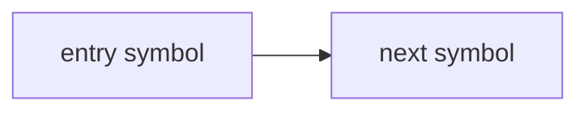

# Plan <N> — <short title>

## 1. Metadata

- Plan ID:
- Iteration: `<NNN-short-title>`
- Status: Planned
- Depends on:
- Requirement IDs:

## 2. Goal

用一段话说明这个 Plan 要完成什么，以及开发者需要看清的最终边界。

### Requirement Mapping

| Requirement ID | Outcome in this Plan | Acceptance signal |
|---|---|---|
| R1 | TBD | TBD |

## 3. Scope

### In scope

### Out of scope

## 4. Impact Surface

### 4.1 File and Symbol Map

列出目录树；在树下面为每个文件单独使用一个 fenced code block，写出该文件受影响的 module、function、class 及职责。文件块之间留空行，便于人工 review。Plan 阶段描述结构，不展开实现代码。

```text
src/
  <module-file>
tests/
  <test-file>
```

```text
File: path/to/file
Module: module name
Symbols:
  symbolName — role
  anotherSymbol — role
```

```text
File: path/to/another-file
Symbols:
  symbolName — role
```

### 4.2 End-to-End Flow

用一个连续流程图说明入口如何经过请求/解析/业务处理/持久化/输出；流程节点必须复用上面的 function/class 名称。



## 5. Decision

### 5.1 Open Decision

每个 Decision 单独成块，说明为什么需要决定、各选项是什么意思、会影响什么、推荐哪个选项，以及需要 Human Review 确认什么。

#### OD-01 — <decision title>

- Decision question: 要决定什么？
- Why it matters: 为什么这个决定会影响实现、范围或验证？
- Option A — <name>
  ```text
  Meaning: 这个选项具体是什么意思？
  Impact: 会影响哪些文件、symbols、流程或依赖？
  Pros:
  Cons:
  ```
- Option B — <name>
  ```text
  Meaning:
  Impact:
  Pros:
  Cons:
  ```
- Option C — <name>
  ```text
  Meaning:
  Impact:
  Pros:
  Cons:
  ```
- Recommendation: <recommended option and why>
- Human decision needed: <what the user needs to confirm>
- Status: Open

### 5.2 Confirmed Decision

用户明确选择后，将对应 Decision 从 `5.1 Open Decision` 移入这里，并记录来源、日期和理由。

#### Confirmed Decision Record

- Decision ID: None yet
- Confirmed choice: Pending Human Review
- Source: Pending
- Date: Pending
- Reason: Pending

## 6. Task

验收意图写在对应 Plan 或 Validation 内容中，不再塞入每个 Task 重复记录。

### Task

- [ ] T1 — <summary title>
  - Objective:
  - Affected files:
    ```text
    Expected:
      <directory tree or file list>
    Actual:
      Pending
    ```
  - Implementation backfill:
    ```text
    Notes: Pending
    Changed files:
      Pending
    ```

Task 只用 checkbox 表示是否完成：`[ ]` 表示仍需继续，`[x]` 表示完成。实现完成后只回填对应 Task 的 Implementation backfill；其他状态、验收、验证和阻塞信息不在 Task 内重复记录。验证统一写在第 7 部分，并使用 `T1`、`T2` 等 Task ID 关联。Task 的执行方式由阶段运行时决定，不在 Plan 中绑定到 agent、effort 或预算。

## 7. Validation

### Traceability

| Check ID | Requirement ID | Task ID | Check | Tier and reason | Expected evidence | Delivery impact / escalation condition |
|---|---|---|---|---|---|---|
| V1 | R1 | T1 | TBD | G1: TBD | TBD | TBD |

G1 只包含证明本次目标所需的最小充分检查。G2 写明哪些结果需要 Human 接受、
什么情况会升级为 G1；G3 写明本次可暂缓的理由和未来重查条件。未执行的检查
不得预写为通过。检查级别应与 Plan Index 的需求基线及当前交付边界一致。

### Commands

- 目标运行环境/测试命令（标注 Check ID）：
- 静态检查（标注 Check ID）：
- 针对性测试（标注 Check ID）：

### Implementation evidence

Implementation 阶段按 Task ID 回填实际执行的命令、结果和关键输出；这不是正式
`verify.md` 的替代。

### Manual checks

- <Check ID> — <操作、观察结果与可记录证据>

## 8. Risks

-

## 9. Approval

- Status: Pending human review
- Approved by:
- Approval date:
- Notes:

若 Goal、Scope、Decision、Task 或 Validation 有实质修订，将 Approval 恢复为
Pending，并等待用户再次明确批准。
