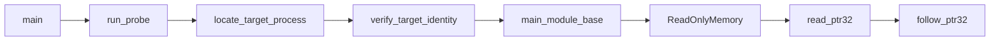

# Plan 01 — 项目与只读内存模块

## 1. Metadata

- Plan ID: P01
- Iteration: `001-memory-state-reader`
- Status: Approved
- Depends on: None
- Requirement IDs: R1, R10, R12

## 2. Goal

先把仓库建成可复现的 Python 3.12.13 `uv` 项目，定义 `runtime/`、`configs/`、`game/`、`state/`、`dashboard/` 的职责与根目录 `main.py` 启动入口，再实现供 P02 复用的 Windows 只读内存基础层。`pywin32` 负责发现目标进程、路径与主模块信息；`ctypes` 负责定义 Win32 函数签名、打开只读句柄和 `ReadProcessMemory`。P01 不解析阳光或任何游戏实体。

### Requirement Mapping

| Requirement ID | Outcome in this Plan | Acceptance signal |
|---|---|---|
| R1 | 只读附加、目标程序身份核对、模块基址和远程 32 位指针读取 | 正确进程可打开；错误路径/哈希/短读给明确错误 |
| R10 | `uv` 固定 Python 3.12.13，锁定 `pywin32`，形成清楚的项目目录 | `uv run python --version` 精确为 3.12.13；`pywin32` 可导入 |
| R12 | 建立分层目录与单一启动入口 | `main.py probe` 可运行；`runtime/` 不导入业务目录，静态地址集中在 `configs/` |

## 3. Scope

### In scope

- 在现有仓库根创建标准配置 `.python-version`、`pyproject.toml`、`uv.lock`，固定 3.12.13；使用 `uv init --bare` 避免生成根目录样例业务文件。`pyproject.toml` 限定 `>=3.12.13,<3.13`，`uv.lock` 锁定 `pywin32` 解析版本；`.venv/` 加入 `.gitignore`。不把环境目录、游戏资源或运行产物提交。
- 当前 `uv` 不在 PATH，Windows 已有 WinGet。实施时用 [uv 官方 Windows 安装方式](https://docs.astral.sh/uv/getting-started/installation/)建立工具，再执行 `uv python install 3.12.13`、`uv python pin 3.12.13`、`uv add pywin32`、`uv sync`；准确步骤以实施时安装的 uv 版本核对。Python 3.12 可用的 Windows wheel 已在 [pywin32 项目发布页](https://pypi.org/project/pywin32/)确认。
- 项目目录按职责组织：`runtime/` 只包含通用 Windows 进程/内存能力；`configs/` 保存目标版本身份和静态偏移；P02 创建 `game/` 解码 PvZ；P03 创建 `state/` 构建快照；P04 创建 `dashboard/` 服务页面。根目录 `main.py` 是用户明确指定的统一启动入口，P01 先提供 `probe`，P03/P04 逐步加入 `snapshot`/`serve`。不启用额外 build backend。
- 依赖方向：`runtime/` 不导入上层目录；`main.py` 将 `configs/` 的静态配置注入 `runtime/`；`game/` 依赖 `runtime/` 与 `configs/`；`state/` 依赖 `game/`；`dashboard/` 依赖 `state/`。`docs/architecture.md` 写清目录职责、只读边界和环境复现。
- `configs/pvz_1051.py` 在 P01 保存目标版本身份和 Board 根地址的模块 RVA，P02 再扩展已知结构偏移；静态地址不得散落在读取逻辑中。
- 001 完成后的预期结构如下；P01 只创建自身负责的文件，其余由对应 Plan 创建：
  ```text
  main.py                 统一启动 probe / snapshot / serve
  runtime/                进程定位、句柄与通用内存读取
  configs/                版本身份、模块 RVA、静态结构偏移
  game/                   PvZ Board 与实体原始读取
  state/                  快照模型、棋盘与行统计
  dashboard/              本地 HTTP 服务与静态页面
  tests/                  针对跨层关键行为的测试
  docs/                   架构与地址实测记录
  ```
- `pywin32` 只用于枚举/确认进程及模块信息，`ctypes` 只申请 `PROCESS_VM_READ | PROCESS_QUERY_LIMITED_INFORMATION` 并调用 `ReadProcessMemory`。目标进程唯一性、可执行文件路径、SHA-256、版本和 32 位 PE 都须检查；实际 API 如模块枚举需要额外查询权限，增加最小查询权限并记录原因，不申请写权限。
- 实现 `read_bytes`、`read_u32`、`read_i32`、`read_f32`、`read_ptr32` 和可复用指针链读取；本机 Python 可以是 64 位，但远程游戏指针按 4 字节解释。短读、空指针、进程退出和资源关闭要有独立错误。

### Out of scope

- 把用户提供的偏移硬编码在基础层、遍历游戏对象或输出 State；这些属于 P02/P03。
- 写内存、驱动、注入、Hook、游戏输入和跨版本兼容。
- 为了项目结构额外引入 Web 框架、构建后端或测试框架。

## 4. Impact Surface

已检查 `AGENTS.md`、`.gitignore`、`.game/PlantsVsZombies.exe`、SDD 文件及 Git 工作区：目前没有 `pyproject.toml`、应用代码、测试或 CI。`.gitignore` 已有未提交的空白改动；实施时只增补 `.venv/`，保留该无关改动。当前系统 `uv` 不可用，Python launcher 只有 3.8/3.10。根目录 `main.py` 由用户本次明确指定。

### 4.1 File and Symbol Map

```text
.python-version
pyproject.toml
uv.lock
.gitignore
runtime/
  __init__.py
  process.py
  memory.py
configs/
  __init__.py
  pvz_1051.py
main.py
docs/
  architecture.md
tests/
  test_memory.py
```

```text
File: .python-version
Module: uv environment pin
Symbols:
  3.12.13 — 项目固定解释器版本
```

```text
File: pyproject.toml
Module: uv project metadata
Symbols:
  project.requires-python — 支持 Python 3.12.13 的约束
  project.dependencies — 唯一运行时第三方依赖 pywin32
```

```text
File: uv.lock
Module: resolved dependency lock
Symbols:
  pywin32 resolution — 锁定兼容当前 Windows/Python 的版本
```

```text
File: .gitignore
Module: repository ignore rules
Symbols:
  .venv/ — 排除本地虚拟环境，保留现有规则和无关改动
```

```text
File: runtime/__init__.py
Module: runtime
Symbols:
  package exports — 公开基础异常与通用接口，不执行读取
```

```text
File: runtime/process.py
Module: runtime.process
Symbols:
  locate_target_process — 用 pywin32 枚举并选定唯一的目标 PID
  verify_target_identity — 比对路径、PE、FileVersion 和 SHA-256
  main_module_base — 用 pywin32 获取运行中的主模块基址
```

```text
File: runtime/memory.py
Module: runtime.memory
Symbols:
  ReadOnlyMemory — 用 ctypes 持有最小权限句柄、读取字节并负责关闭
  read_ptr32 — 将远程四字节指针解码为地址
  follow_ptr32 — 对给定起点和偏移序列解析 32 位指针链
```

```text
File: configs/__init__.py
Module: configs
Symbols:
  package exports — 标记版本化静态配置包，不执行内存读取
```

```text
File: configs/pvz_1051.py
Module: configs.pvz_1051
Symbols:
  TARGET_IDENTITY — 目标路径、版本、PE 类型和 SHA-256
  BOARD_ROOT_RVA — 模块 RVA 0x002A9EC0，不存某次运行绝对地址
```

```text
File: main.py
Module: application entry
Symbols:
  main — 统一分派 probe；P03/P04 再增 snapshot/serve
  run_probe — 把 configs 的目标身份注入 runtime 并输出只读诊断
```

```text
File: docs/architecture.md
Module: project design record
Symbols:
  module responsibilities — runtime/configs/game/state/dashboard/main 的职责和依赖方向
  environment steps — uv/Python/pywin32 复现说明
```

```text
File: tests/test_memory.py
Module: tests.test_memory
Symbols:
  pointer and failure tests — 可控内存样本下的指针链、短读和身份错误路径
```

### 4.2 End-to-End Flow



## 5. Decision

### 5.1 Open Decision

无阻塞性 Open Decision。`uv` 工具当前未安装是实施前置动作，用户已明确选择使用 `uv`；若安装被系统策略阻止，实施阶段记录实际错误再讨论替代途径。

### 5.2 Confirmed Decision

#### Confirmed Decision Record

- Decision ID: CD-01
- Confirmed choice: `uv` + Python 3.12.13；`pywin32` 与 `ctypes` 分工；runtime/configs/game/state/dashboard 分层，并以根目录 main.py 启动。
- Source: 用户 2026-09-23 本轮两次 `$sdd-plan` 修订与随后澄清
- Date: 2026-09-23
- Reason: 用户希望先有可复现的项目基础与可复用内存模块。

## 6. Task

### Task

- [x] T1 — 建立 `uv` 项目、目录边界和启动入口
  - Objective: 安装/定位 `uv`，固定 Python 3.12.13 与 `pywin32`，生成锁文件、版本配置、main.py 入口骨架和架构说明。
  - Execution hint:
    - Width: `standard`
    - Worker effort: `medium`
    - Budget override: None; uses `sdd-implementation` defaults
  - Affected files:
    ```text
    Expected:
      .python-version
      pyproject.toml
      uv.lock
      .gitignore
      runtime/__init__.py
      configs/__init__.py
      configs/pvz_1051.py
      main.py
      docs/architecture.md
    Actual:
      .python-version
      pyproject.toml
      uv.lock
      .gitignore
      runtime/__init__.py
      configs/__init__.py
      configs/pvz_1051.py
      main.py
      docs/architecture.md
    ```
  - Implementation backfill:
    ```text
    Notes: 已安装 uv 0.12.18，并将项目固定为 Python 3.12.13；`pyproject.toml` 限定 `>=3.12.13,<3.13`，`uv.lock` 锁定 pywin32 312。`uv sync`、`uv run python --version`、pywin32 导入和 `.venv/` 忽略检查通过。配置从模块位置推导仓库根目录；`docs/architecture.md` 记录分层边界。
    Changed files:
      .python-version
      pyproject.toml
      uv.lock
      .gitignore
      runtime/__init__.py
      configs/__init__.py
      configs/pvz_1051.py
      main.py
      docs/architecture.md
    ```

- [x] T2 — 只读进程与通用内存读取
  - Objective: 用 pywin32 定位/校验进程与模块，用 ctypes 读取远程原始值和指针链，接通 main.py probe；明确异常与句柄生命周期。
  - Execution hint:
    - Width: `standard`
    - Worker effort: `medium`
    - Budget override: None; uses `sdd-implementation` defaults
  - Affected files:
    ```text
    Expected:
      runtime/process.py
      runtime/memory.py
      main.py
      tests/test_memory.py
    Actual:
      runtime/process.py
      runtime/memory.py
      main.py
      tests/test_memory.py
    ```
  - Implementation backfill:
    ```text
    Notes: pywin32 通过精确可执行路径定位唯一进程，并按版本资源、PE Machine 与 SHA-256 校验身份；ctypes 使用 PROCESS_VM_READ 和 PROCESS_QUERY_LIMITED_INFORMATION 句柄调用 ReadProcessMemory，远程指针固定按四字节读取。模块枚举单独使用所需的查询/读权限。短读、空指针、已退出进程和关闭句柄有独立错误路径；未加入写权限 API。当前暂停进程 PID 26120 的身份及模块基址核对成功。
    Changed files:
      runtime/process.py
      runtime/memory.py
      main.py
      tests/test_memory.py
    ```

## 7. Validation

### Traceability

| Requirement ID | Task ID | Check | Expected evidence |
|---|---|---|---|
| R10 | T1 | `uv run python --version`、导入 pywin32、检查锁文件和 .venv 排除 | 精确 3.12.13，导入成功，锁文件存在，环境目录未跟踪 |
| R1 | T2 | 连接正确进程、错误路径/版本、进程退出、短读和空指针 | 只读成功或可解释错误；无写权限调用 |
| R12 | T1, T2 | 检查目录依赖与 `main.py probe` | runtime 不导入上层；地址只在 configs；入口运行成功 |

### Commands

- 目标运行环境/测试命令：`winget --version` 已为 `v1.29.380`；实施后 `uv --version`、`uv run python --version`、`uv run python -c "import win32process, win32api"`、`uv run python main.py probe`、`uv run python -m unittest discover -s tests -p test_memory.py`。
- 静态检查：`uv run python -m compileall runtime configs main.py`；`python .codex/hooks/check_iteration_names.py`。
- 针对性测试：以伪造内存块测试跨 32 位指针链、短读、失效地址；实机只读附加目标程序并核对哈希和模块基址。

### Implementation evidence

| Task | 命令/检查 | Implementation evidence |
|---|---|---|
| T1 | `uv --version`; `uv run python --version`; `uv run python -c "import win32process, win32api"`; `git check-ignore .venv`; `uv run python .codex/hooks/check_iteration_names.py` | uv 0.12.18；Python 3.12.13；pywin32 导入成功；`.venv` 被忽略；Plan 命名检查退出码 0。锁文件解析到 pywin32 312。 |
| T2 | `uv run python -m compileall runtime configs game main.py`; `uv run python -m unittest discover -s tests -p test_memory.py`; `uv run python main.py probe` | 编译通过；5 项内存/异常测试通过。只读 probe 对 PID 26120 校验版本 1.0.0.1051、PE `0x014C`、SHA-256 `F587903E9C3AD3890C1F4E2FBC1FE1EA88BD191E3D623D6F291283F6658C8DD4`，模块基址 `0x00400000`。动态采样证据见 P02 与 `docs/memory-map.md`；本记录不是正式 Verify。 |

### Manual checks

- 运行中的目标程序路径须为仓库 `.game/PlantsVsZombies.exe`；确认 SHA-256 与 `F587903E9C3AD3890C1F4E2FBC1FE1EA88BD191E3D623D6F291283F6658C8DD4` 相同。
- 在进程未启动、多个同名进程和游戏关闭时观察明确错误与句柄释放。

## 8. Risks

- `pywin32` 为 Windows 专用依赖；目标平台就是 Windows，且 [PyPI 项目页](https://pypi.org/project/pywin32/)已有 CPython 3.12 Windows wheel。
- 当前 `uv`/Python 3.12.13 未安装，实施时需要下载；旧版 uv 可能不收录指定解释器，需按官方说明核对或更新 uv。
- 32 位游戏与 64 位 Python 混用时，Win32 句柄宽度与远程指针宽度不同；基础层必须明确区分。
- 预计文件超过小改动基线，是因为仓库完全没有应用工程，且用户明确要求环境、依赖和通用模块三项基础工作；不添加未获授权的其他包。

## 9. Approval

- Status: Approved
- Approved by: 用户
- Approval date: 2026-09-24
- Notes: 本次为实质修订；与 Iteration 审批状态保持一致。

若 Goal、Scope、Decision、Task 或 Validation 有实质修订，将 Approval 恢复为 Pending，并等待用户再次明确批准。
