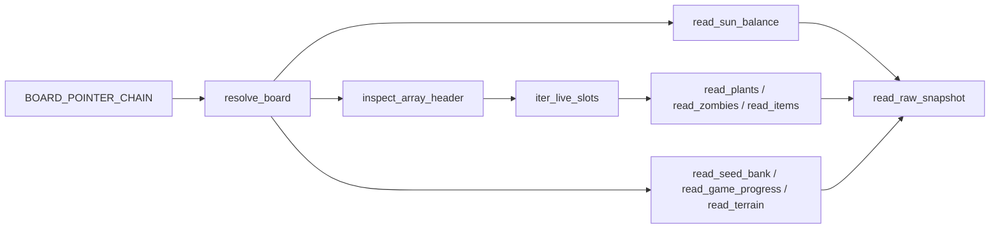

# Plan 02 — 已知偏移与候选字段读取

## 1. Metadata

- Plan ID: P02
- Iteration: `001-memory-state-reader`
- Status: Approved
- Depends on: P01
- Requirement IDs: R2, R3, R4, R5, R6, R9, R13, R14

## 2. Goal

在 P01 只读内存模块之上解析用户已给出的 Board、阳光、植物、僵尸和掉落物；再将公开 1.0.0.1051 结构中的卡槽、场景/关卡/波次、地形与活性字段作为候选逐项验证。先用目标 SHA-256 的暂停现场确认单帧读数，再等用户游玩时核对动态语义；地址表是调查起点，不是已完成验证的声明。

### Requirement Mapping

| Requirement ID | Outcome in this Plan | Acceptance signal |
|---|---|---|
| R2 | Board 链与阳光原始读取 | 暂停现场读数与画面一致；用户游玩时若阳光变化，读数同步；若重启则重新解析 |
| R3 | 活植物类型、行列的原始读取 | 暂停现场及用户实际种植后的记录与画面一致；删除槽位若出现则无残影 |
| R4 | 活僵尸类型、行、X/Y、HP 的原始读取 | 暂停现场至少一只僵尸的行/类型/位置可对照；游玩期间移动与数量变化同步，HP 动态语义按实际伤害事件核对 |
| R6 | 掉落物类型与 X/Y 的原始读取 | 若出现掉落物，则坐标与画面可对照；未经证实类型保持未知 |
| R9 | 暂停进程的一次采样与画面对照 | 地址档案记录 PID、采样时间、原始值、画面及证据等级 |
| R14 | 用户玩一关时的字段动态核对 | 用户操作的事件前后数据可追溯；没有发生的事件保持未验证 |
| R5 | 对卡牌、冷却、关卡和阶段候选字段尝试只读验证 | 单帧核对成功项标为 `observed_once`；动态核对后升级；失败项保持未获取 |
| R13 | 为公开偏移保留来源与证据等级 | 文档逐项列出来源、类型、候选地址和验证事件 |

## 3. Scope

### In scope

- 地址表达统一为“主模块 RVA + 远程指针链”：`root = read_ptr32(module_base + 0x2A9EC0)`；`board = read_ptr32(root + 0x768)`。当前实例的模块基址为 `0x00400000`，对应用户提供的进程地址 `0x006A9EC0`；不写死 `0x00400000` 或本次 Board 绝对值。
- 以下表是用户提供的候选结构，字段值以游戏进程读数为准；阳光与 Board 链已由用户测试，并由只读一次采样复现。

| 对象 | Board 中的字段 | 单项大小 | 单项字段 |
|---|---|---|---|
| 阳光余额 | `Board+0x5560` | `u32` 候选 | 无 |
| 僵尸数组 | 指针 `Board+0x90`；当前数量 `Board+0xA0` | `0x15C` | 行 `+0x1C`，类型 `+0x24`，X `+0x2C`/Y `+0x30` 为 `float`，HP `+0xC8` |
| 植物数组 | 指针 `Board+0xAC`；当前数量 `Board+0xBC` | `0x14C` | 行 `+0x1C`，类型 `+0x24`，列 `+0x28` |
| 掉落物数组 | 指针 `Board+0xE4`；当前数量 `Board+0xF4` | `0xD8` | X `+0x24`，Y `+0x28`，类型 `+0x58`；X/Y 的整数或浮点解释待现场确认 |

- 先读取并验证数组头的容量、最高使用槽位、当前活数和对象 ID。源码中的 `DataArray` 排列是指针 `+0x0`、已用槽位上限 `+0x4`、容量 `+0x8`、空闲链头 `+0xC`、活数 `+0x10`；活槽判断是对象末尾 ID 的高 16 位非零。其遍历逻辑见[重建源码 DataArray.h](https://github.com/Electr0Gunner/PvZ-Reconstruction-BugFix/blob/main/Sexy.TodLib/DataArray.h)。一次只读采样中僵尸 `Board+0xA0=0` 而 `Board+0x94=10`，与上述解释相容，但要在目标二进制上再次验证。植物/僵尸/掉落物的活数分别仍以用户给出的 `Board+0xBC/+0xA0/+0xF4` 为候选；公开 [1051 头文件](https://github.com/HenryJk/PvZLib/blob/main/include/pvz_reference/1_0_0_1051_en.h) 把 `+0x4` 命名为 count，不能覆盖本地活数证据。
- 为每个数组以 `0 <= live_count <= max_used <= capacity` 做上限检查，再扫描 `max_used` 个槽位；对象 ID 候选为 Plant `+0x148`、Zombie `+0x158`、Item `+0xD0`。活性规则验证前，ID、对象尾部标志以及活数量均不能单凭一个值推断成功。
- 2026-09-24 查到的新增候选偏移如下。`Root` 指 `read_ptr32(module+0x2A9EC0)`，`Board=read_ptr32(Root+0x768)`，`SeedBank=read_ptr32(Board+0x144)`。所有候选均为只读调查，不在 P01 的通用 `runtime/` 中写死。

  | 领域 | 候选地址/结构 | 预计含义与验证场景 |
  |---|---|---|
  | 场景/模式 | `Root+0x7FC`、`Root+0x7F8` | 场景（菜单/选卡/进行中/胜负）与模式；跨菜单、开局、结束取样，并确认枚举 |
  | 暂停、关卡、波次 | `Board+0x164`、`+0x5550`、`+0x5564`、`+0x557C`、`+0x55FC` | 暂停、关卡号、总波数、当前波、通关标志；暂停/恢复及波次推进核对，注意当前波可能是 0 基 |
  | 卡槽 | `SeedBank+0x24` 槽数，槽数组从 `SeedBank+0x28` **内嵌开始**，步长 `0x50` | 进入选卡/开始战斗，槽数和 UI 对照；不可把 `+0x28` 当指针再解引用 |
  | 单张卡 | `Slot+0x34` 类型、`+0x38` 模仿者类型、`+0x24/+0x28` 冷却进度/总时长、`+0x48` 可用标志 | 选卡、种植、冷却结束事件对照；冷却字段按游戏 tick，换算秒数要另证实 |
  | 地形 | `Board+0x168` 的 9×6 地形数组；`Board+0x11C` 的 GridItem 数组 | 在目标 5×9 草坪核对索引方向、草/空值；GridItem 候选用于墓碑/坑洞等阻挡，不能仅凭地形判定任意卡能否种 |
  | 掉落物语义 | `Item+0x24/+0x28` 为 `float` 候选；`+0x50` 收集中；`+0x58` 类型；类型码 `4/5/6` 候选为普通/小/大阳光 | 观察不同阳光掉落与收集过程，验证浮点坐标和类型码后才派生阳光列表 |

- 候选结构依据为 [PvZLib 1051 头文件](https://github.com/HenryJk/PvZLib/blob/main/include/pvz_reference/1_0_0_1051_en.h)、[Board.h 结构注释](https://github.com/Electr0Gunner/PvZ-Reconstruction-BugFix/blob/main/Lawn/Board.h)、[SeedPacket.h 卡槽结构](https://github.com/Electr0Gunner/PvZ-Reconstruction-BugFix/blob/main/Lawn/SeedPacket.h)、[Coin.h 掉落物结构](https://github.com/Electr0Gunner/PvZ-Reconstruction-BugFix/blob/main/Lawn/Coin.h)和[枚举定义](https://github.com/Electr0Gunner/PvZ-Reconstruction-BugFix/blob/main/ConstEnums.h)。这些是第三方逆向/重建资料，未证明与仓库内 exe 的完整内存布局相同。
- 卡槽结构没有存放“当前阳光费用”的直接字段。[SeedPacket.cpp 绘制逻辑](https://github.com/ruslan831/PlantsVsZombies-decompilation/blob/master/Lawn/SeedPacket.cpp)经 `Board::GetCurrentPlantCost` 计算展示费用；本计划不调用游戏函数。费用只可由可审计的规则/静态表在当前关卡画面核对后填入；否则保留未知，不把种子类型码误当费用。
- 扫描时按已证实的槽位上限遍历，过滤活对象；计数与活列表应一致或解释差异。行列以 0 基读取并检查 5×9 边界；X/Y 保留游戏坐标原值；未知类型码保留数值码与 `unknown` 标签。
- 在 `docs/memory-map.md` 记录每个字段的来源级别：`user_reported`、`observed_once`、`verified_with_gameplay`，及样本事件、数值类型、对象活性规则和重启结论。已有一次实测：阳光 100、植物数 1（首槽类型 1、行 0、列 3）、僵尸数 0、掉落物数 0；不把该状态当成持续事实。用户提供的 [暂停前](../evidence/001-game-before-pause.png) 与 [暂停时](../evidence/002-game-paused.png) 两张图显示已有僵尸，可作为下一次采样要核对的场景说明，但旧图中的阳光 3333 和关卡 1-3 不能直接充作新采样的真值。
- 候选字段的证据等级与快照呈现分开：当前目标进程中能稳定读取且与同刻可见画面或结构不变量对上的数值，可记 `observed_once` 并交 P03 标 `provisional`；页面注明待动态核验。被暂停面板遮住、画面不显示的 HP/冷却内部计数等，只有原始诊断值，不能因数值看似合理就标 `available`；无法确认地址/类型/活性时为 `unavailable`。用户游玩中有对应事件前后对照才升至 `verified_with_gameplay`/`available`。

### Out of scope

- 把未经现场核对的卡牌/CD、游戏阶段/关卡、地形字段当成可信 State；已单帧核对者最多为 `provisional`，其余记录缺口并在 P03 显示 `unavailable`。
- 新的全自动扫描器、跨版本偏移发现、游戏写入或动作执行。
- 从掉落物类型码推断“阳光”之前，没有类型码实测就不把全部 Item 认作阳光。

## 4. Impact Surface

P01 提供 `runtime/process.py`、`runtime/memory.py` 的只读原语以及 `configs/pvz_1051.py` 的目标身份/Board 根地址。当前仓库没有游戏读取实现；P02 在 `configs/` 补充实体和候选偏移，在 `game/` 实现 PvZ 领域解码并记录实测证据。

### 4.1 File and Symbol Map

```text
configs/
  pvz_1051.py
game/
  __init__.py
  arrays.py
  reader.py
main.py
docs/
  memory-map.md
tests/
  test_reader.py
```

```text
File: configs/pvz_1051.py
Module: configs.pvz_1051
Symbols:
  BOARD_POINTER_CHAIN — 模块 RVA 0x2A9EC0 与 +0x768 指针链
  FIELD_OFFSETS — 阳光、三类数组头、结构步长与字段偏移
```

```text
File: game/__init__.py
Module: game
Symbols:
  package exports — 将 PvZ 解码与通用 runtime 分离
```

```text
File: game/arrays.py
Module: game.arrays
Symbols:
  inspect_array_header — 读取容量、高水位候选、活数量及其边界
  iter_live_slots — 用经过验证的活性规则扫描槽位，拒绝越界与短读
```

```text
File: game/reader.py
Module: game.reader
Symbols:
  resolve_board — 用 configs 的静态指针链和 runtime 原语定位当前 Board
  read_sun_balance — 读取并检查阳光余额
  read_plants — 解码活植物类型、行、列
  read_zombies — 解码活僵尸类型、行、X/Y、HP
  read_items — 解码活掉落物类型和 X/Y，不预设都是阳光
  read_seed_bank — 验证并读取内嵌卡槽的槽位、类型、冷却 tick 与可用标志
  read_game_progress — 验证场景、模式、暂停、关卡、波次和结束标志
  read_terrain — 验证 9×6 地形数组的索引、值域与目标 5×9 区域
  read_raw_snapshot — 同一轮汇总上述字段并标注逐域读取状态
```

```text
File: main.py
Module: application entry
Symbols:
  run_probe — 在 P01 身份核对后展示已知字段可读性，不绕过 game/reader.py
```

```text
File: docs/memory-map.md
Module: address evidence record
Symbols:
  offset table — 用户候选、公开来源、一次读数与经游戏变化验证的分级证据
  missing fields — 费用/种植规则等仍无法可靠给出的值与验证步骤
```

```text
File: tests/test_reader.py
Module: tests.test_reader
Symbols:
  array behavior tests — 稀疏槽位、已删除对象、越界/短读和未知类型行为
```

### 4.2 End-to-End Flow



## 5. Decision

### 5.1 Open Decision

无阻塞性 Open Decision。槽位活性、`Board+0x94` 等数组头含义、Item 坐标类型和枚举、卡槽 tick 语义、场景/地形枚举是待实验事实；Implementation 必须以实机结果回填，不能仅凭数值相似确认。

### 5.2 Confirmed Decision

#### Confirmed Decision Record

- Decision ID: CD-02
- Confirmed choice: P02 以用户已给出的偏移表读取当前已知数据；缺失的卡牌/CD、阶段/关卡暂不强求。
- Source: 用户 2026-09-23 偏移表、本次四 Plan 修订及缺口处理澄清
- Date: 2026-09-23
- Reason: 先完成可测的内存采集基础，并保留下一轮逆向工作的明确入口。

#### Confirmed Decision Record

- Decision ID: CD-05
- Confirmed choice: 依据公开资料扩充 001 的候选偏移调查，同时对未经目标程序验证的值保持“未获取”。
- Source: 用户 2026-09-24 显式调用 `$sdd-plan` 并要求查询相关基址
- Date: 2026-09-24
- Reason: 可用现成结构资料缩小现场逆向范围，但不能用资料替代实机验证。

## 6. Task

### Task

- [x] T1 — 版本档案、Board 链与阳光
  - Objective: 将用户偏移写成版本化档案，通过 P01 模块读取 Board、阳光及三类数组头，并记录已知证据等级。
  - Execution hint:
    - Width: `standard`
    - Worker effort: `medium`
    - Budget override: None; uses `sdd-implementation` defaults
  - Affected files:
    ```text
    Expected:
      configs/pvz_1051.py
      game/__init__.py
      game/reader.py
      main.py
      docs/memory-map.md
    Actual:
      configs/pvz_1051.py
      game/__init__.py
      game/reader.py
      main.py
      docs/memory-map.md
    ```
  - Implementation backfill:
    ```text
    Notes: 配置只保存模块 RVA 和偏移；reader 以 module base → `module+0x2A9EC0` → `root+0x768` 重解析 Board。当前只读样本读取 PID 26120、模块基址 `0x00400000`、Root `0x027CA3C0`、Board `0x16F67D20`、阳光 3333；三个数组头均按 live/max-used/capacity 边界读取。绝对地址仅记为本次证据，不写入配置。
    Changed files:
      configs/pvz_1051.py
      game/__init__.py
      game/reader.py
      main.py
      docs/memory-map.md
    ```

- [x] T2 — 数组活性与实体字段读取
  - Objective: 实现槽位遍历/活性规则，读取植物、僵尸和掉落物字段；先按暂停现场核对，再为用户游玩事件保留证据和未证实类型。
  - Execution hint:
    - Width: `broad`
    - Worker effort: `high`（稀疏槽位和实体类型需要实机调查）
    - Budget override: None; uses `sdd-implementation` defaults
  - Affected files:
    ```text
    Expected:
      game/arrays.py
      game/reader.py
      configs/pvz_1051.py
      docs/memory-map.md
      tests/test_reader.py
    Actual:
      game/arrays.py
      game/reader.py
      configs/pvz_1051.py
      docs/memory-map.md
      tests/test_reader.py
    ```
  - Implementation backfill:
    ```text
    Notes: 通过 DataArray `max_used` 高水位扫描对象 ID 高 16 位非零候选槽位。当前暂停样本中植物 live/扫描数为 2/2（type 1 行0列3、type 29 行2列3），僵尸为 1/1（slot 9/10，type 0、row 2、float 候选 X=687.00946/Y=250、HP=270），Item 为 1/1（type 4，float 坐标候选 551/448）。数量与活槽在此单帧吻合；未观察删除、复用、移动、受伤或收集事件，故活性和动态含义仍为 provisional/candidate。Item 类型仍 unknown，type 4 只记录阳光候选。
    Changed files:
      game/arrays.py
      game/reader.py
      configs/pvz_1051.py
      docs/memory-map.md
      tests/test_reader.py
    ```

- [x] T3 — 卡槽、阶段、地形等公开候选字段实测
  - Objective: 按公开来源只读解析卡槽类型与冷却、场景/关卡/波次、地形和阳光类型；暂停现场可核对项标为单帧证据，事件语义留待用户游玩时确认，失败项记录缺口。
  - Execution hint:
    - Width: `broad`
    - Worker effort: `high`（需要多场景动态核对与候选字段消歧）
    - Budget override: None; uses `sdd-implementation` defaults
  - Affected files:
    ```text
    Expected:
      configs/pvz_1051.py
      game/reader.py
      docs/memory-map.md
      tests/test_reader.py
    Actual:
      configs/pvz_1051.py
      game/reader.py
      docs/memory-map.md
      tests/test_reader.py
    ```
  - Implementation backfill:
    ```text
    Notes: 在同一暂停样本只读读取 SeedBank 候选指针 `0x16AD3520`、槽数 10、槽类型码 `[35,5,29,7,40,41,1,23,20,22]` 和冷却原始计数；Root/Board 候选进度值为 scene=3、mode=0、pause=1、level=3、total waves=20、current wave=1、won raw=4284372992。Board+0x168 保留 54 字节原始数据，不解码地形。所有字段保留 observed_once/candidate；没有场景、冷却、波次或地形变化事件，未标为动态 verified/available。
    Changed files:
      configs/pvz_1051.py
      game/reader.py
      docs/memory-map.md
      tests/test_reader.py
    ```

## 7. Validation

### Traceability

| Requirement ID | Task ID | Check | Expected evidence |
|---|---|---|---|
| R2 | T1 | 暂停现场读数及用户游玩中的阳光自然增减；重启若发生再核对 | Board 链解析正确，阳光值与当时画面一致；不发生重启时不声称跨会话已验证 |
| R3 | T2 | 暂停现场植物与用户实际种植；移除/死亡若发生再核对 | 活列表与行列正确；死槽发生时无残影 |
| R4 | T2 | 暂停现场僵尸与用户游玩时的出现/移动；伤害/死亡若发生再核对 | 行、类型、X/Y、HP 原始值有分级证据；活数量与列表一致，动态语义不超出观察 |
| R6 | T2 | 用户游玩时出现的掉落物及其收集 | 类型码与坐标类型只在有证据时确认，未知项不误称阳光 |
| R9 | T1, T2, T3 | 用户已暂停的现场：一次采样与当前画面逐字段对照 | PID、时间、exe 哈希、Board 链、阳光、植物、活僵尸、掉落物、卡槽等原始读数和同刻画面记录；未证实者仍标候选 |
| R14 | T1, T2, T3 | 用户玩一关期间，按其自然发生的事件记录前后读数；若用户重启，再核对指针链 | 阳光/实体/掉落物/冷却/波次/阶段的事件证据与人类观察；未发生事件不造值、不声称已验证 |
| R5 | T3 | 暂停现场先核对可见卡槽/关卡；用户游玩时观察种植冷却、菜单/开局/通关和波次推进 | 可见单帧值记 `observed_once`/`provisional`，事件前后验证的字段才 `available`；不成立则未获取 |
| R13 | T1, T2, T3 | 对照每一候选偏移的来源与现场记录 | 来源 URL、地址、数据类型、事件前后读数、证据等级可追溯 |

### Commands

- 目标运行环境/测试命令：`uv run python main.py probe`（P01 提供，P02 补充字段可读性），实施中可用 P01 读取原语输出受限的诊断读数；不把一次绝对 Board 地址写进代码。
- 静态检查：`uv run python -m compileall configs game`。
- 针对性测试：`uv run python -m unittest discover -s tests -p test_reader.py`；实体语义另需实机核对。

### Implementation evidence

| Task | 命令/检查 | Implementation evidence |
|---|---|---|
| T1 | `uv run python main.py probe` | 2026-09-23 16:38:59.767 UTC / 2026-09-24 00:38:59.767 Asia/Shanghai；PID 26120；版本 1.0.0.1051、PE `0x014C`、SHA-256 与目标匹配；模块 `0x00400000`、Root `0x027CA3C0`、Board `0x16F67D20`、sun raw=3333。现场地址仅为一次性样本。 |
| T2 | `uv run python -m compileall runtime configs game main.py`; `uv run python -m unittest discover -s tests -p test_reader.py` | 编译通过，4 项数组/实体测试通过。该暂停样本的植物、僵尸、Item 数量均与高水位 ID 扫描结果相符；Plant ID `0xDC610000/0xDC620001`、Zombie ID `0xDF6D0009`、Item ID `0xDF6C0000`。仅观察到一帧，未证实删除槽位或活槽复用。 |
| T3 | `uv run python main.py probe` | SeedBank 槽数 10；原始卡槽类型及冷却候选见 `docs/memory-map.md`。progress raw: scene=3、mode=0、pause=1、level=3、total waves=20、current wave=1、won=4284372992；terrain 地址 `0x16F67E88` 读取 54 字节但未解码。Item `+0x24/+0x28` 的 f32 读数为 551/448，type=4；坐标解释与类型均保留 candidate，未将 Item 命名为阳光。公开候选来源及缺口见 `docs/memory-map.md`。 |

以上是 Implementation 阶段证据，不替代正式 Verify。用户游玩期间的事件和重启结果尚未观察，应由后续 Verify 按实际发生情况记录。

### Manual checks

- 第一部分：保持用户的游戏暂停；只读连接当前目标进程，记录 PID/哈希/时间、Board、阳光、数组头与活槽读数，并对照现场画面中的至少一只僵尸。若进程已结束，旧截图不替代现场，应待用户再次提供暂停现场。暂停画面遮挡中间格，不能据此确认被遮挡植物或落物。
- 第二部分：由用户自行恢复并玩一关；观察阳光前后变化、植物增删、僵尸出现/移动/受伤/死亡、掉落物出现/收集、卡牌冷却与波次。代理只采样、对照和记录，不发送游戏操作。
- 如用户游玩中自然出现已删除槽位或重启，再确认扫描上限、活性标志与指针链；不要求用户为了验证强行制造事件。未观察到对应事件的字段维持 `candidate`。
- 地形的行列索引须与画面方向核对；“不可种植”需要独立的规则证据，不能把有植物的格子或未知地形一概标为不可种。

## 8. Risks

- 用户偏移覆盖对象字段，但没有提供槽位活性标记、稳定 ID 和全部数组头语义；P02 必须实测这些条件。若某域未能确认，原始快照须标记不可用，不能让 P03 生成看似完整的列表。
- 原来约定的卡牌/CD 与阶段/关卡暂缺；其缺口由 P03/P04 清楚展示，不构成已读取事实。
- 进程内 Board 绝对地址会变化；仅以模块 RVA 和指针链配置。
- PvZLib 的数组 `COUNT_OFFSET` 指向结构 `+0x4`，但现有用户活数量在 `+0x10`；实施应以 `DataArray` 结构和现场事件解释，不照搬宏名。
- 公开重建源码未提供与当前 exe 哈希绑定的证明；卡槽、场景、地形、枚举和值类型均须逐项验证，必要时保持不可用。
- 超出小改动基线，因为三类不同结构共享稀疏数组机制，需要档案、解码和有针对性的行为测试；不新增 P01 之外依赖。
- 暂停现场能验证当前值和对象存在，不能证明移动、HP 扣减、冷却 tick 或活槽复用的时间语义；这些结论须等待用户游玩时的事件。进程退出后旧截图不可当新帧证据。

## 9. Approval

- Status: Approved
- Approved by: 用户
- Approval date: 2026-09-24
- Notes: 与 Iteration 审批状态保持一致。

若 Goal、Scope、Decision、Task 或 Validation 有实质修订，将 Approval 恢复为 Pending，并等待用户再次明确批准。
