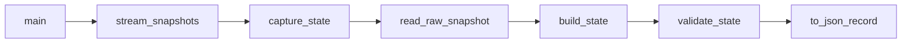

# Plan 03 — State 构建

## 1. Metadata

- Plan ID: P03
- Iteration: `001-memory-state-reader`
- Status: Approved
- Depends on: P01, P02
- Requirement IDs: R3, R4, R5, R7, R8, R9, R14

## 2. Goal

把 P02 的原始内存数据转换为统一 State 快照：植物导出 5×9 占用层，僵尸导出每行威胁；卡槽、阶段、关卡、波次和地形按证据等级进入可信值、待动态核验值或缺口。快照带采集时间、来源、逐域状态与明确缺口，供 P04 观察；001 不宣称已经能直接交给 JEV 自动玩。

### Requirement Mapping

| Requirement ID | Outcome in this Plan | Acceptance signal |
|---|---|---|
| R3 | 从有效植物构建棋盘占用 | 5×9、0 基行列，与植物列表一致 |
| R4 | 从有效僵尸计算每行数量并保留位置/HP | 五行计数与僵尸列表一致 |
| R5 | 卡牌/CD、阶段/关卡按证据等级进入 State | 单帧对照值为 `provisional`，事件验证值为 `available`，未获取项是 `null` + `unavailable` |
| R7 | 版本化、带来源和有效性快照及连续输出 | 成功、空、未映射、读取失败可区分 |
| R8 | State 清单与字段来源一致 | 清单中列明已读、待验证、未获取及后续补充 |
| R9 | 暂停现场的一次原始读取与 State 对照 | 同一采样的字段值、时间、PID、可用性与游戏画面可追溯 |
| R14 | 用户游玩时连续快照与事件对照 | 变化只来自用户的实际操作和游戏推进；用户判断由 Verify 记录 |

## 3. Scope

### In scope

- `capture_state` 调用 P02 `read_raw_snapshot`，对同一采样周期的数据检查边界和数量；必要时重读一次，仍不一致则标明该域无效，不以旧值冒充新值。
- 暂停采样也要生成新 `observed_at_utc` 和采样序号/时间证据；实体值未变化属于正常状态。`snapshot --once` 需可与 P02 的同次或相邻原始读数对照，不把旧截图数值写死到测试或 State。
- `build_state` 将活植物映射到 5×9 `board.cells` 的占用层、将活僵尸归入五条 `lanes`；保留原始游戏 X/Y、类型码与僵尸 HP。植物冲突占用、非法行列、HP 异常或数组计数不一致要显式报错。若已验证地形数组，再按 9×6 的正确索引映射 5×9 地形层；`plantability` 与植物占用分开，只有相应放置规则也明确时才给出“不可种”，否则为 `unknown`。
- State `schema_version=1`，包含 UTC 采样时刻、目标二进制哈希、PID、profile ID、`valid`、`errors`、逐域 `availability`、`missing_fields` 与实际数据。字段规则：有值且经事件验证为 `available`；一次现场画面/结构对照成功但动态语义未证实为 `provisional`，保留值并标注来源；未映射或无法确认的候选用 `null` 和 `unavailable`；读取失败用 `null` 和 `error`。成功且无对象可为 `[]`，但仍带该域证据等级。`valid` 只说明本次采样内部一致且可读取，不代表所有域已验证；001 的 `decision_ready` 保守为 `false`，直到费用、可放置规则和游戏阶段等全部决策输入有证据。
- `game.mode/phase/paused/level/wave`、`cards`、`board.terrain` 分别设置可用性：P02 哪一字段单帧对照或事件验证通过，就按其实际等级输出；不能因为某个邻近字段有效而整组冒充已验证。可用性需细分到证据不同的字段，例如僵尸行/位置与 HP、卡牌类型与冷却计数、掉落物坐标与阳光类型映射；不强制整个数组共享一个证据等级。卡牌数组可包含槽序、类型码、模仿者类型、冷却 tick/总 tick 和可用标志；**费用是独立可用字段**，没有准确规则时为 `null`。冷却秒数仅在 tick 时长核准后派生。不能把截图“1-3”硬编码为运行时关卡。
- `items` 保留所有活掉落物的原始类型码和 X/Y；只有阳光 `4/5/6` 等候选类型在目标进程核对后，才派生可收集阳光列表。僵尸 HP 先显示原始值；没有可信最大 HP 就不输出虚构百分比。
- 经根目录唯一入口提供 `uv run python main.py probe`、`uv run python main.py snapshot --once` 和 `uv run python main.py snapshot --interval-ms 200`。连续输出 JSON Lines，读数失败可以继续输出状态/错误，但进程关闭时明确结束或转为断开状态。
- 更新 `state-checklist.md`，将“需要给 JEV 的完整决策字段”与“001 当前可观察字段”分开列清。行为测试只覆盖状态语义和关键不变量。

### Out of scope

- 访问 JEV API、决定何时种植物、执行点击或声称已经能通关。
- 在 001 内调用游戏函数计算动态费用、实现全部卡牌适用的种植合法性判定，或用未校准的游戏 X 推断精确屏幕点击坐标。
- 严格原子内存快照保证；游戏持续运行，采用重试与有效性标记。

## 4. Impact Surface

P01 的 `runtime/` 提供进程和内存原语、`main.py` 提供 probe；P02 的 `game/` 提供 `read_raw_snapshot`。当前仓库没有 State 模型或应用测试，只有 001 的设计清单；本 Plan 在 `state/` 新增归一化，并扩展统一入口、修订清单。

### 4.1 File and Symbol Map

```text
state/
  __init__.py
  schema.py
  builder.py
main.py
tests/
  test_state.py
.sdd/001-memory-state-reader/
  state-checklist.md
```

```text
File: state/__init__.py
Module: state
Symbols:
  package exports — 公开 State 构建入口与数据类型
```

```text
File: state/schema.py
Module: state.schema
Symbols:
  StateSnapshot — 定义核心字段、可选卡牌/进度/地形域、来源和 availability 语义
  to_json_record — 输出版本化快照，保留来源、时间戳与可用状态
```

```text
File: state/builder.py
Module: state.builder
Symbols:
  capture_state — 协调 P02 原始采集、一次重试和每域错误
  build_state — 派生 board 占用/地形/可种状态、lanes、卡槽视图与缺口列表
  validate_state — 检查类型、边界、计数、冲突和有效性语义
```

```text
File: main.py
Module: application entry
Symbols:
  main — 在 P01 probe 基础上增加 snapshot 参数解析
  stream_snapshots — 按间隔输出 JSON Lines，处理错误和退出
```

```text
File: tests/test_state.py
Module: tests.test_state
Symbols:
  state behavior tests — 测试空/未映射/读取失败、棋盘冲突和行计数
```

```text
File: .sdd/001-memory-state-reader/state-checklist.md
Module: design reference
Symbols:
  available fields — P02 已验证后进入 State 的字段与来源
  missing fields — 卡牌/CD、阶段/关卡和未来 JEV 所需数据
```

### 4.2 End-to-End Flow



## 5. Decision

### 5.1 Open Decision

无阻塞性 Open Decision。P02 若无法验证某实体或候选字段，该域按 `unavailable`/`error` 呈现，不能以猜测数据满足 State 验收；是否扩大地址发现范围需另行修订 Plan。

### 5.2 Confirmed Decision

#### Confirmed Decision Record

- Decision ID: CD-03
- Confirmed choice: 001 允许先完成已有偏移的 State；关卡阶段和卡牌/CD 明确列出缺口，等待后续补齐。
- Source: 用户 2026-09-23 本次澄清
- Date: 2026-09-23
- Reason: 先得到可观测、可信的基础数据，不阻塞已知字段的工程验证。

#### Confirmed Decision Record

- Decision ID: CD-05
- Confirmed choice: P03 接收 P02 经实测通过的公开候选字段，未验证字段继续按缺口表达。
- Source: 用户 2026-09-24 显式调用 `$sdd-plan` 并要求查询偏移完善
- Date: 2026-09-24
- Reason: 卡槽、场景、地形已有候选结构，但当前目标程序尚未逐项核对。

## 6. Task

### Task

- [x] T1 — State 模型、派生与可用性
  - Objective: 从 P02 原始数据构建棋盘和行统计，统一缺失/失败语义，更新 State 清单。
  - Execution hint:
    - Width: `standard`
    - Worker effort: `medium`
    - Budget override: None; uses `sdd-implementation` defaults
  - Affected files:
    ```text
    Expected:
      state/__init__.py
      state/schema.py
      state/builder.py
      .sdd/001-memory-state-reader/state-checklist.md
    Actual:
      state/__init__.py
      state/schema.py
      state/builder.py
      .sdd/001-memory-state-reader/state-checklist.md
    ```
  - Implementation backfill:
    ```text
    Notes: 已实现 schema v1、来源/时间/序号、逐域 availability、错误和 missing_fields 语义；从 raw 数据派生 5×9 占用和五行僵尸统计，并保留对象字段。2026-09-24 08:32:50.226Z 的只读 raw→State 复采样为阳光 725/725、植物 50/50、僵尸 21/21、掉落物 9/9；植物占 44 格，其中 6 格有叠层，僵尸行计数为 [5,5,5,2,4]。费用来自静态目录并标 provisional/static_catalog；可读进度候选映射值仍 provisional，地形不可用、plantability 未知。当前工作树同时含 002 的叠层、护具 HP 与进度映射扩展，不能视作 001 动态语义证据。未取得同刻游戏画面与 raw/State/API/UI 联证，也没有自然事件前后记录；这两项仍是 Verify 证据缺口。
    Changed files:
      state/__init__.py
      state/schema.py
      state/builder.py
      .sdd/001-memory-state-reader/state-checklist.md
    ```

- [x] T2 — 快照命令与行为验证
  - Objective: 提供 probe、单次与连续 JSON 快照，检验状态不变量和进程变化。
  - Execution hint:
    - Width: `standard`
    - Worker effort: `medium`
    - Budget override: None; uses `sdd-implementation` defaults
  - Affected files:
    ```text
    Expected:
      main.py
      tests/test_state.py
    Actual:
      main.py
      tests/test_state.py
    ```
  - Implementation backfill:
    ```text
    Notes: `probe`、`snapshot --once`、间隔 JSON Lines 快照入口已实现。目标进程只读 probe 与单次 State 采样成功；当前样本 PID 4092、sun 725、plants/zombies/items 为 50/21/9，44 个占用格、五行 [5,5,5,2,4]，`valid=true`、`decision_ready=false`。测试覆盖空值/错误/计数不一致/重试/进程退出等状态语义。此次无同刻游戏画面对照或自然游玩事件记录；命令与状态不变量验收通过不代表 R14 动态观察已完成。
    Changed files:
      main.py
      tests/test_state.py
    ```

## 7. Validation

### Traceability

| Requirement ID | Task ID | Check | Expected evidence |
|---|---|---|---|
| R3 | T1 | 植物行列与 board.cells 比对 | 五行九列且无冲突/幽灵占用 |
| R4 | T1 | 活僵尸列表与五行计数比对 | 合计和每行数量正确，X/Y/HP 保留 |
| R5 | T1, T2 | 用 `available`/`provisional`/`unavailable`/`error` 混合样本构造快照 | 单帧核对值可显示且带待核验状态；无证据域为 `null`；费用单独标状态；`decision_ready=false` |
| R7 | T1, T2 | 连续解析 JSON；模拟无对象、短读、未映射、进程退出 | 三类空/缺失/失败可区分，时间递增 |
| R8 | T1 | 对照 State 清单与 JSON 字段 | 已获取和待补字段都有来源/状态说明 |
| R9 | T1, T2 | 暂停时执行 `snapshot --once`，对照同次原始读数、当前画面和 JSON | 阳光、活植物、活僵尸、掉落物及逐域状态与证据相符；单帧对照值为 `provisional`，无法确认者 `unavailable` |
| R14 | T2 | 用户玩一关期间连续采样，并记录事件前后 State 与用户观察 | 值和时间按实际事件更新；没有用户操作或判断时不声称动态验收通过 |

### Commands

- 目标运行环境/测试命令：`uv run python main.py probe`；`uv run python main.py snapshot --once`；`uv run python main.py snapshot --interval-ms 200`。
- 静态检查：`uv run python -m compileall state main.py`；`python .codex/hooks/check_iteration_names.py`。
- 针对性测试：`uv run python -m unittest discover -s tests -p test_state.py`；当前仓库尚无现成应用测试命令。

### Implementation Validation Evidence

| Task ID | Check | Result and evidence |
|---|---|---|
| T1 | `uv run python -m unittest discover -s tests -p test_state.py` | Pass: 18 tests. Live raw→State sample at `2026-09-24T08:32:50.226Z`, PID 4092: raw/State sun 725/725; plant, zombie and item reported/scanned/State counts 50/50/50, 21/21/21 and 9/9/9; 44 occupied cells, six layered cells, lane counts `[5,5,5,2,4]`. Candidate cost/progress remain `provisional`; terrain unavailable. |
| T2 | `uv run python main.py probe`; `uv run python main.py snapshot --once` | Pass: target identity verified as PvZ 1.0.0.1051, PE `0x014C`, pinned SHA-256; PID 4092, module `0x00400000`, Board `0x2428DF50`, sun 725. The JSON Lines command emitted a valid State with a fresh timestamp and `valid=true`. |
| T1, T2 | `uv run python -m unittest discover -s tests`; `uv run python -m compileall -q runtime configs game state dashboard main.py`; `uv run python .codex/hooks/check_iteration_names.py` | Pass: 34 tests; compile and naming checks exit 0. The full-suite total includes P04 tests. |
| T2 / R9 | Read-only `GET /api/state` on existing ports 8765 and 8766 | Both returned 200 with `Cache-Control: no-store, max-age=0`; adjacent samples at `08:31:16Z` reported PID 4092, sun 725, 50 plants, 21 zombies and 9 items. This is an adjacent API sample, not a same-frame game/raw/State/API/UI capture. No natural R14 event trace was obtained. |

### Implementation evidence

T1/T2 已按现存实现和本次确定性检查回填；命令结果、raw→State 样本和邻近 API 数据列于上表。当前进程没有附同刻游戏画面，故不把旧截图或邻近采样合并成同帧 R9 证据。用户报告亲自测试页面且未发现问题，但没有可关联到阳光、植物、僵尸、掉落物或进度变化的事件时间线；R14 的动态证据与用户最终判断仍由 Verify 核验。这些记录不是正式 `verify.md` 的替代。

### Manual checks

- 第一部分在用户暂停的进程上读一次 State，记录现场 PID/时间，并核对 P02 原始读数与画面；屏幕被暂停面板遮挡的部分不当作已核实。
- 第二部分仅当用户亲自恢复并玩一关时观察连续 JSON；把阳光变化、植物/僵尸/掉落物和关卡事件与原始读数对应。退出、重启若发生则核对断开与新指针链；代理不操作游戏。
- 确认游戏显示无对象时为 `[]` 且保留证据等级；单帧读到的待核验值为 `provisional`；字段尚无地址时为 `null` + `unavailable`，读取失败时为 `null` + `error`。
- 确认页面可以据 `availability` 判断显示状态，而不通过空值猜测原因。
- 卡槽类型和冷却候选验证通过时，State 同步显示该字段；费用、地形、场景等未验证项仍显示未知，不把邻域成功泛化为整组成功。

## 8. Risks

- `valid=true` 只代表当前采样内部一致、可读取，不能表示 JEV 已具备完整决策 State；每域证据等级仍以 `availability` 为准，因此另设 `decision_ready=false`。费用、种植合法性和植物重叠层可能需要后续工作。
- P02 活性规则若未经验证，快照格式正确也会有错误事实；P03 不得把这种域标记 available。
- 200 ms 仅为初始采样间隔，需根据实际读取耗时与游戏稳定性调整。
- 超出小改动基线是因为要建立首个 State 契约、命令入口与关键行为测试；不新增运行依赖。

## 9. Approval

- Status: Approved
- Approved by: 用户
- Approval date: 2026-09-24
- Notes: 与 Iteration 审批状态保持一致。

若 Goal、Scope、Decision、Task 或 Validation 有实质修订，将 Approval 恢复为 Pending，并等待用户再次明确批准。
