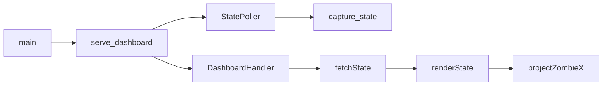

# Plan 04 — 本地 Web State 监视器

## 1. Metadata

- Plan ID: P04
- Iteration: `001-memory-state-reader`
- Status: Approved
- Depends on: P03
- Requirement IDs: R9, R11, R14

## 2. Goal

用只绑定 `127.0.0.1` 的本地浏览器页面持续展示 P03 State：顶部状态栏显示阳光、采样新鲜度和对象计数；卡牌区显示当前槽位、类型、费用与冷却；中央 5×9 棋盘分别表达植物占用和可种状态；僵尸作为独立覆盖层按所在行与游戏 X 近似移动，旁边列出类型、原始 HP 和准确 X/Y。页面仅用于观察和调试，没有控制游戏的按钮或写入接口。

### Requirement Mapping

| Requirement ID | Outcome in this Plan | Acceptance signal |
|---|---|---|
| R11 | 本地动态页面和只读 State 接口 | 页面可呈现卡牌、棋盘、僵尸位置/详情与缺口；用户游玩时随采样更新 |
| R9 | 暂停进程的一帧与页面对照 | 原始读数、State、API 和页面一致，暂停时不制造僵尸运动 |
| R14 | 用户玩一关的动态观察 | 用户操作期间的页面变化与游戏事件一致，由用户本人决定体验是否可接受 |

## 3. Scope

### In scope

- 使用 Python 标准库 `http.server` 在 `127.0.0.1` 的可配置端口提供 `GET /`、静态资源和 `GET /api/state`；不新增 Flask/FastAPI/Node 依赖。使用空闲端口通过 `uv run python main.py serve --port 8765` 启动。
- `StatePoller` 独立于 HTTP 请求按可配置间隔调用 `state/builder.py` 的 `capture_state`，保留最新快照与采集时间；HTTP 返回该快照而不在每个请求中重复读进程。游戏断开、版本不匹配和读数失败时保留可诊断状态，页面显示断开/错误而不冻结在旧的“正常”值。
- 前端用原生 HTML、[CSS Grid](https://developer.mozilla.org/en-US/docs/Web/CSS/Guides/Grid_layout) 和少量 JavaScript 获取 `/api/state`，初始采样/页面轮询均为可配置的 250–500 ms 范围，默认 500 ms；不新增 React、Canvas 或 WebSocket 依赖。静态的 5×9 单元格与动态僵尸 DOM 节点分层，按实体 ID 更新位置，避免每轮重建整个棋盘导致跳动。保持各字段的最后采样时间与断开提示。
- 若已验证 `game.paused` 为真，重复采样时实体位置不应因 UI 自行动画而移动；若暂停标志尚未验证，页面不据旧截图推断当前处于暂停。滚动的采样时间与游戏世界值要分开显示。
- 页面结构按用户确认的草图：顶部阳光/连接状态/植物、僵尸、掉落物计数；当前卡牌按槽位排列，显示类型、费用、冷却进度/剩余 tick 与可用性；5×9 棋盘有行列标签，单元格展示空、植物、已确认不可种或未知；僵尸标记在对应行的独立覆盖层上移动，格子内或悬停/点击可看类型和 HP，侧栏显示每只僵尸的精确游戏 X/Y、原始 HP 与类型码。掉落物及其 X/Y、原始 JSON、阶段/波次与缺口也可查看。
- 占用和可种性是两个不同维度：有植物不等于地形不可种；地形可种也不代表某张卡此时可种。只有 P03 提供经验证的阻挡/放置依据时才显示“不可种”，否则显示“未知”。`provisional` 值可在卡牌、棋盘、僵尸等区域显示，但须附“待动态核验”标记；`unavailable` 显示“未获取”，`error` 显示错误。费用缺失时不填示例数字；僵尸没有可信最大 HP 时显示原始 HP，不制造百分比。
- 僵尸的 `x` 是游戏空间位置；用经现场校准的草坪横向范围投影成棋盘列与覆盖层位置，允许多只僵尸在同一列，保留每只独立身份。若投影尚未验证，覆盖层显示“位置未校准”，侧栏继续显示行和原始 X/Y；不可把 `x` 直接当浏览器像素坐标。不同采样之间仅用 CSS 位移过渡，不能把插值位置当新的观测事实。
- 真实空列表显示“当前没有”；读取失败显示错误；未经验证的候选和无地址字段显示“未获取”；游戏结束或进程关闭时旧快照不可继续显示为正常实时数据。页面提供可折叠原始 JSON 便于对照，但不修改 State。
- 页面只读、无游戏动作入口、无外部 CDN/网络资源，响应标注不缓存；多标签页共享同一采样结果。

### Out of scope

- 游戏截图、精确像素叠加、远程公开服务、登录账户、WebSocket、实时视频和鼠标控制。
- 在浏览器中编辑地址偏移或调用 JEV。
- 本地端口占用检测、冲突提示和自动切换端口；本项目仅作为本机验证 JEV 的前置工具，使用者可自行指定空闲端口。
- 真实游戏退出/重连后的浏览器恢复现场作为后续可靠性验证；本次只以现有固定样本、错误状态分支和空闲端口页面/API 验收当前本地用途，不声称真实退出已观察。

## 4. Impact Surface

P03 在 `state/` 提供 `capture_state` 并扩展根目录 `main.py`。当前仓库无 Web 代码、静态资源或 HTTP 测试；P04 在 `dashboard/` 新增本地 HTTP 展示层，仅依赖 Python 标准库和既有 State 模块。

### 4.1 File and Symbol Map

```text
dashboard/
  __init__.py
  server.py
  static/
    index.html
    app.js
    style.css
main.py
tests/
  test_web.py
```

```text
File: dashboard/__init__.py
Module: dashboard
Symbols:
  package exports — 标记只读展示层
```

```text
File: dashboard/server.py
Module: dashboard.server
Symbols:
  StatePoller — 后台采样并原子替换最新 State，处理停止和断开
  DashboardHandler — 仅处理页面、静态文件和 GET /api/state
  serve_dashboard — 绑定 127.0.0.1、启动轮询并在退出时清理资源
```

```text
File: main.py
Module: application entry
Symbols:
  main — 增加 `serve --port` 子命令，沿用 P03 进程配置
```

```text
File: dashboard/static/index.html
Module: browser document
Symbols:
  dashboard regions — 状态栏、卡牌、棋盘/僵尸覆盖层、侧栏、掉落物、缺口和采集状态容器
```

```text
File: dashboard/static/app.js
Module: browser interaction
Symbols:
  fetchState — 定时获取最新只读 JSON
  renderState — 按 available/provisional/unavailable/error 分别呈现状态栏、卡牌、棋盘和详情
  projectZombieX — 经校准后把游戏 X 投影到棋盘覆盖层，未校准返回未知
```

```text
File: dashboard/static/style.css
Module: dashboard layout
Symbols:
  board and status styles — 5×9 CSS Grid、独立僵尸覆盖层、卡牌冷却条、状态区别与窄窗口排版
```

```text
File: tests/test_web.py
Module: tests.test_web
Symbols:
  read-only endpoint tests — 用固定 State 验证 /api/state 返回与错误/缺口语义
```

### 4.2 End-to-End Flow



## 5. Decision

### 5.1 Open Decision

无阻塞性 Open Decision。默认 8765 端口可通过参数修改，页面布局按目标 5×9 草坪设计；不需要用户在 Plan 阶段选定固定端口或视觉主题。僵尸 X 投影参数及卡牌费用只以目标进程实测决定。

### 5.2 Confirmed Decision

#### Confirmed Decision Record

- Decision ID: CD-04
- Confirmed choice: P04 使用本地浏览器页面，以状态栏、卡牌区、5×9 棋盘和动态僵尸层呈现 State。
- Source: 用户 2026-09-23 确认交互草图与 Web 技术路线，并于 2026-09-24 再次调用 `$sdd-plan`
- Date: 2026-09-24
- Reason: 页面要同时表达固定格子、移动实体、冷却进度和详细字段；浏览器可直接检查 JSON 与视觉布局。

#### Confirmed Decision Record

- Decision ID: CD-05
- Confirmed choice: P04 只验收空闲端口上的本地页面和只读接口，不验收端口冲突诊断。
- Source: 用户 2026-09-24 显式调用 `$sdd-plan`，要求直接纠正 P04，并说明项目是本地验证 JEV 的前置实现。
- Date: 2026-09-24
- Reason: 端口占用属于可由使用者选择其他端口解决的小型本地运行问题，无需在此迭代投入实现与验证。

#### Confirmed Decision Record

- Decision ID: CD-06
- Confirmed choice: 本地 JEV 前置验证以已观察的正常采样与页面刷新和用户试玩判断验收；严格同帧联证、逐事件联证及真实退出/恢复现场作为非阻塞后续证据。
- Source: 用户 2026-09-24 明确要求“001 部分通过，可以交付”，并指出这些缺口不影响当前关注的问题。
- Date: 2026-09-24
- Reason: 当前目标是验证结构化 State 能稳定读出并显示游戏状态，已有只读采样、API、DOM 和用户试玩反馈支撑；未观察的边界场景保留为已知限制。

## 6. Task

### Task

- [x] T1 — 本地只读服务与采样器
  - Objective: 提供本机绑定、最新 State 接口、断开/错误语义和清理机制。
  - Execution hint:
    - Width: `standard`
    - Worker effort: `medium`
    - Budget override: None; uses `sdd-implementation` defaults
  - Affected files:
    ```text
    Expected:
      dashboard/__init__.py
      dashboard/server.py
      main.py
      tests/test_web.py
    Actual:
      dashboard/__init__.py
      dashboard/server.py
      main.py
      tests/test_web.py
    ```
  - Implementation backfill:
    ```text
    Notes: 已提供绑定 127.0.0.1 的 HTTP 服务、共享 StatePoller、页面/静态资源和只读 `/api/state`；响应设置 no-store，轮询器发布完整快照并可返回断开/错误状态。目标 targeted tests 通过；本次对两个既有服务端口只读 GET 均为 200/no-store，返回 PID 4092、sun 725、50 plants、21 zombies、9 items。没有关闭目标进程来实测浏览器断开/重连恢复；相关错误状态由 State 测试覆盖，live recovery 保持未观察。
    Changed files:
      dashboard/__init__.py
      dashboard/server.py
      main.py
      tests/test_web.py
    ```

- [x] T2 — 浏览器状态监视器与现场核对
  - Objective: 按确认草图显示状态栏、卡牌、分层棋盘、移动僵尸、侧栏和缺口；先提供暂停现场对照能力，再由用户游玩时观察动态；校准或显式标识僵尸投影未知。
  - Execution hint:
    - Width: `standard`
    - Worker effort: `medium`
    - Budget override: None; uses `sdd-implementation` defaults
  - Affected files:
    ```text
    Expected:
      dashboard/static/index.html
      dashboard/static/app.js
      dashboard/static/style.css
    Actual:
      dashboard/static/index.html
      dashboard/static/app.js
      dashboard/static/style.css
    ```
  - Implementation backfill:
    ```text
    Notes: 页面显示状态栏、卡牌、费用来源/冷却状态、45 格棋盘、植物叠层、僵尸行和原始 X/Y/HP、掉落物及缺口；未校准 X 时显示“位置未校准”。既有 Verify 的浏览器检查与用户 dashboard 图片记录了 ten cards、45 cells、six layered cells、21 zombie details、9 items；用户另报告亲自测试页面且未发现问题。上述页面材料不含同刻游戏画面及 matching raw/API 记录，未获得自然游戏事件与页面时间线，也未校准 X 投影；本 Task 的动态事件结论不作通过宣称，留作 Verify 证据缺口。
    Changed files:
      dashboard/static/index.html
      dashboard/static/app.js
      dashboard/static/style.css
    ```

## 7. Validation

### Traceability

| Requirement ID | Task ID | Check | Expected evidence |
|---|---|---|---|
| R11 | T1, T2 | 固定 State 和本机浏览器检查状态栏、卡牌、45 格、僵尸层及缺口 | 布局与 JSON 一致，`provisional` 值可见且标待核验，未知费用/地形不伪装为已知；断开/错误/恢复状态可辨 |
| R9 | T1, T2 | 用户暂停现场：同一或相邻采样核对原始读数、State、`GET /api/state`、页面与当前游戏画面 | 阳光、可见植物和僵尸行/类型/大致位置与画面一致；数值 X/Y/HP 与 raw/State/API 一致并按证据等级标注；被暂停面板遮挡的内容不强判；静止僵尸不因动画移动 |
| R14 | T1, T2 | 用户亲自玩一关时记录页面变化及用户结论 | 游戏事件与页面时间线、原始 State 对应；体验是否通过由用户明示，代理不代玩、不代判 |

当前交付按 Plan Index 的 CD-06 验收：本表 R9 的严格同帧游戏画面联证、R14 的逐事件联证及真实退出/恢复观察保留为后续项；已取得的单帧 raw/State、相邻 API/DOM 和用户本人试玩判断支持当前用途，不把后续项写成已验证。

### Commands

- 目标运行环境/测试命令：`uv run python main.py serve --port 8765`；浏览器访问 `http://127.0.0.1:8765/`；`uv run python -m unittest discover -s tests -p test_web.py`。
- 若 8765 已被占用，指定其他空闲端口继续正常页面/API 检查；端口冲突时的报错形式、检测及自动切换均不作为验收项。
- 静态检查：`uv run python -m compileall dashboard main.py`；`python .codex/hooks/check_iteration_names.py`。
- 针对性测试：用固定 State 检查 `/api/state` 的 200 响应、JSON 类型和 `no-store`，用包含两只同路僵尸、空/植物/未知格、卡牌冷却/费用缺失的快照检查页面呈现；暂停进程的单帧页面和用户游玩时的连续刷新分别记录证据。

### Implementation Validation Evidence

| Task ID | Check | Result and evidence |
|---|---|---|
| T1 | `uv run python -m unittest discover -s tests -p test_web.py` | Pass: 3 tests, including shared JSON/no-store response, static resources and loopback-only binding. |
| T1 / R9 | Read-only `GET /api/state` on existing ports 8765 and 8766 | Both returned 200 with `Cache-Control: no-store, max-age=0`; adjacent responses reported PID 4092, sun 725, 50 plants, 21 zombies and 9 items. No service was started or stopped during this check. |
| T2 | Existing Verify browser inspection and user dashboard images | Prior inspection recorded 10 cards, 45 cells, six layered cells, 21 zombie details and 9 items; the marker fallback reports uncalibrated X and keeps raw coordinates in details. The user reports personally testing the page without issues. These records show the UI, not a same-frame game-screen/raw/State/API/UI comparison. |
| T1, T2 | `uv run python -m unittest discover -s tests`; `uv run python -m compileall -q runtime configs game state dashboard main.py`; `node --check dashboard/static/app.js`; `uv run python .codex/hooks/check_iteration_names.py` | Pass: 34 tests; compile, JavaScript syntax and naming checks exit 0. |

### Implementation evidence

T1/T2 的接口和页面实现、目标定向测试及现存浏览器记录已回填。用户反馈页面测试未发现问题；当前仍没有按自然事件关联的 raw/State/API/UI 时间线，也没有校准僵尸 X 覆盖。该缺口不通过静态页面截图或邻近 API 样本补写；R9 同帧游戏画面对照与 R14 动态观察由 Verify 单独核验。这不是正式 `verify.md` 的替代。

### Manual checks

- 第一部分保持游戏暂停：打开页面与 `GET /api/state`，对照同次/相邻原始采样和当下游戏画面；阳光、卡牌、可见植物及至少一只僵尸应正确，不能把旧截图中的 3333/1-3 写死为新帧真值。重复轮询时采样时间更新，但无新位置观测就不推动僵尸图标。
- 第二部分由用户亲自恢复游戏并玩一关：观察阳光变化、植物种植、卡牌冷却、僵尸移动/受伤/消失和掉落物出现，确认对应区域更新且时间戳递增；僵尸同列/同路时仍能查看每只的类型、X/Y 和 HP。用户记录是否接受页面表现，代理只记录读数与页面证据。
- 对照游戏画面校准僵尸 X→列映射；若未校准，页面显示“位置未校准”而不是错误列。确认原始 HP 不被自动写成百分比。
- 关闭游戏时页面显示断开；未证实的阶段/关卡、卡牌费用/冷却或不可种状态显示“未获取/未知”，而不是零、无卡牌或假造阻挡格。
- 两个浏览器标签打开时采样频率不翻倍；远程地址不能连接，只接受 `127.0.0.1`。

## 8. Risks

- 后台采样与 HTTP 请求并发；需只发布完整快照，避免半写状态。
- 浏览器定时轮询频率和采样频率不同；显示采样时间，避免把旧 State 当成实时值。
- 游戏坐标不是页面像素坐标；覆盖层需要经过目标关卡现场校准，未校准时只能显示原始 X/Y 与所在行。
- 浏览器过渡动画只是两个实测点之间的视觉插值；新采样过期或游戏暂停时停止移动，避免表现为真实测量。
- 用户暂停的现场进程可能在 Verify 前消失；只有当前进程的 API/UI/内存对照能完成第一部分，归档截图只是参照。动态页面的主观可用性必须等用户亲自玩一关后判断。
- 四个静态/服务文件超出小改动基线，是因为浏览器页面必须有独立数据接口和可审阅布局；不增加 P01 之外的依赖。

## 9. Approval

- Status: Approved
- Approved by: 用户
- Approval date: 2026-09-24
- Notes: P04 原范围曾获批准并完成实现回填。端口冲突要求已排除；用户于 2026-09-24 明确接受当前本地用途部分通过、可交付，并将严格联证与真实退出/恢复现场延后。未观察行为在 Verify 和 Delivery 中仍明确标注。

若 Goal、Scope、Decision、Task 或 Validation 有实质修订，将 Approval 恢复为 Pending，并等待用户再次明确批准。
