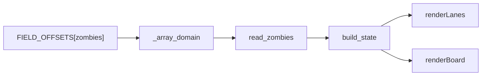

# Plan 02 — 僵尸分层血量

## 1. Metadata

- Plan ID: P02
- Iteration: `002-progress-and-zombie-health`
- Status: Approved
- Depends on: 当前只读僵尸数组/State/网页代码；不依赖 P01
- Requirement IDs: R4, R5, R6

## 2. Goal

复核并固化僵尸本体与装备各自的血量读取，使铁桶、路障及带盾僵尸的页面不再把本体值误称为整体血量。当前工作区已有初步修复，本 Task 的完成条件是检查其边界、必要修正及可复查证据，而非机械重复写同一代码。

### Requirement Mapping

| Requirement ID | Outcome in this Plan | Acceptance signal |
|---|---|---|
| R4 | 本体、头盔、盾牌、气球 HP 分开读取，合计只作数值参考 | 实机铁桶样本呈本体 270、头盔 1100、合计 1370；带盾 fixture 与其他装备可独立显示 |
| R5 | State/API/UI 同步且旧 `hp` 的本体语义清楚 | `/api/state` 有各分量；页面显示部位名称和“各部位 HP 合计”，缺字段时不冒充 0 |
| R6 | 测试与只读现场证据 | 头盔、盾牌、无护甲和未知值路径被覆盖；不写目标进程 |

## 3. Scope

### In scope

- 核对 [PvZLib 1.0.0.1051 僵尸字段](https://github.com/HenryJk/PvZLib/blob/main/include/pvz_reference/1_0_0_1051_en.h)：`Zombie+0xC8` 本体、`+0xD0` 头盔、`+0xDC` 盾牌、`+0xE4` 气球 HP，均以实际读数核验；不得按类型 ID 静态伪造当前 HP。
- 审查已存在的 `helmet_hp`/`shield_hp`/`balloon_hp` 读取、State 的 `body_hp`/`total_hp` 计算和网页部位文字。保留原始有符号值于 raw，展示数值采用明确的非负规则；如果某分量未读到，合计为未知，不把 `null` 当 0。`hp` 保持本体 HP 以兼容既有消费方。
- 对当前铁桶实机的一帧建立 raw → State → API → UI 对照；其他僵尸形态用固定字节样本做针对性检查，在用户自然游戏过程出现时再附动态证据。

### Out of scope

- 基于植物弹种计算精确实际剩余击杀伤害或预测死亡时间；更改僵尸血量；为所有特殊僵尸创造静态最大 HP 表。
- 将 `total_hp` 称为跨装备的统一可伤害血槽；不同攻击可能作用于不同部位。

## 4. Impact Surface

### 4.1 File and Symbol Map

```text
configs/
  pvz_1051.py
game/
  reader.py
state/
  builder.py
dashboard/static/
  app.js
tests/
  test_reader.py
  test_state.py
docs/
  memory-map.md
```

```text
File: configs/pvz_1051.py
Module: configs.pvz_1051
Symbols:
  FIELD_OFFSETS["zombies"] — 本体与三个装备部位的版本化偏移
```

```text
File: game/reader.py
Module: game.reader
Symbols:
  _array_domain — 活僵尸字段按有符号整数读取并保留原始值
  read_zombies — 为每个活实体输出四个血量分量与来源语义
```

```text
File: state/builder.py
Module: state.builder
Symbols:
  build_state — 保留旧 `hp` 本体字段，派生分层值及可为空的数值合计
```

```text
File: dashboard/static/app.js
Module: browser renderer
Symbols:
  renderLanes — 逐只展示本体、装备和参考合计
  renderBoard — 覆盖标记悬浮详情保持与侧栏同一血量语义
```

```text
File: tests/test_reader.py
Module: tests.test_reader
Symbols:
  SparseArrayTests — 用仿真内存核对铁桶及带盾字段读取
```

```text
File: tests/test_state.py
Module: tests.test_state
Symbols:
  StateBuilderTests — 分层合计、缺字段、无护甲和旧 hp 语义回归
```

```text
File: docs/memory-map.md
Module: memory field documentation
Symbols:
  zombie HP field table — 各分量地址、宽度、读数与证据级别
```

### 4.2 End-to-End Flow



## 5. Decision

### 5.1 Open Decision

无阻塞性 Open Decision。数值合计按用户已确认的“本体 + 当前装备分量”显示为参考值；若分量缺失，则直接显示缺口，不推断为 0。

### 5.2 Confirmed Decision

#### Confirmed Decision Record

- Decision ID: CD-02
- Confirmed choice: 僵尸血量要包含路障、铁桶等装备部位；页面展示分层血量与合计参考值。
- Source: 用户 2026-09-24 提供铁桶截图指出原始 HP 270 不代表整体，并在本次明确要求僵尸血量 Task
- Date: 2026-09-24
- Reason: 实机铁桶读到本体 270 与头盔 1100；单独的本体 HP 会误导读者和未来 JEV State 使用方。

## 6. Task

### Task

- [x] T1 — 僵尸分层 HP 复核与回归固化
  - Objective: 检查现有读取/State/网页实现，修正未覆盖的装备和缺值边界，产出固定样本及实机证据。
  - Execution hint:
    - Width: `standard`
    - Worker effort: `medium`
    - Budget override: None; uses `sdd-implementation` defaults
  - Affected files:
    ```text
    Expected:
      configs/pvz_1051.py
      game/reader.py
      state/builder.py
      dashboard/static/app.js
      tests/test_reader.py
      tests/test_state.py
      docs/memory-map.md
    Actual:
      configs/pvz_1051.py
      game/reader.py
      state/builder.py
      dashboard/static/app.js
      tests/test_reader.py
      tests/test_state.py
      docs/memory-map.md
    ```
  - Implementation backfill:
    ```text
    Notes: 审查并保留按有符号整数读取的 body/helmet/shield/balloon 字段；State 保持旧 hp=body_hp 兼容，将装备负值归零用于显示，任一装备分量缺失时 total_hp 为 null。网页逐项显示部位 HP 和带“数值参考”限定的合计，缺失项明确显示未获取。加入路障、铁桶、铁门盾牌、气球、普通僵尸和缺分量回归样本。
    Changed files:
      configs/pvz_1051.py
      game/reader.py
      state/builder.py
      dashboard/static/app.js
      tests/test_reader.py
      tests/test_state.py
      docs/memory-map.md
    ```

## 7. Validation

### Traceability

| Requirement ID | Task ID | Check | Expected evidence |
|---|---|---|---|
| R4 | T1 | 固定铁桶、路障、带盾和普通僵尸读数；至少铁桶实机一帧 | 本体/装备分量准确，合计仅为分量和，不以本体 270 冒充整体 |
| R5 | T1 | 同一采样的 raw/State/`/api/state`/网页 | 字段和标签一致；缺失分量为未知，旧 `hp` 仍是本体 |
| R6 | T1 | 仿真内存测试与只读游戏采样 | 零内存写入；动态伤害只在实际发生时记录 |

### Commands

- 目标运行环境/测试命令：`uv run python main.py probe`；`uv run python main.py snapshot --once`；`uv run python main.py serve --port 8765` 后检查 `/api/state` 和页面。
- 静态检查：`uv run python -m compileall configs game state tests`；`node --check dashboard/static/app.js`（本机有 Node 时）。
- 针对性测试：`uv run python -m unittest discover -s tests -p "test_*.py"`；`python .codex/hooks/check_iteration_names.py`。

### Implementation evidence

Implementation evidence (T1):

- `uv run python -m unittest discover -s tests -p "test_reader.py"` 与 `... "test_state.py"`：分别 7、14 项通过；固定字节样本覆盖路障（270+370）、铁桶（270+1100）、铁门盾牌（270+1100）、气球、普通僵尸和缺失部件合计为 null；旧 `hp` 仍等于本体值。
- `uv run python -m unittest discover -s tests -p "test_*.py"`：30 项通过。`uv run python -m compileall configs game state dashboard tests`、`node --check dashboard/static/app.js`、`python .codex/hooks/check_iteration_names.py` 均通过。
- 只读同一帧 raw/State（2026-09-24T05:12:08.880Z）：活跃 type-4 铁桶僵尸 slot 16 的 raw 为本体 270、头盔 1100、盾牌 0、气球 0；State `hp/body_hp=270`、`helmet_hp=1100`、`total_hp=1370`。另一帧铁门僵尸 body 218 + shield 1048 = 1266。
- 更新服务 API 同帧返回分层 HP；页面与脚本 HTTP 200，脚本中各部位和缺失值文案通过 Node 语法检查。单帧数值仅为 `observed_once`/`provisional`，动态伤害变化未人为制造。正式独立复核仍属于 Verify。

### Manual checks

- 游戏中自然出现铁桶或路障时，在暂停或相邻短时间采样中对照头部装备、raw 分量和网页文案；不为了测试而修改游戏进程。
- 对网页服务进行必要重启后检查 `/api/state` 和详情卡，确认不会由旧 Python 进程继续输出只含本体 HP 的旧 State。
- 若某种特殊僵尸的当前装备分量未取得或不符合结构预期，保留原始码与 `provisional`，不以静态血量表覆盖实测值。

## 8. Risks

- 本体与头盔、盾牌、气球可按不同伤害规则变化，简单相加只用于展示当前各部分数值，不保证等价于一次攻击路径的剩余伤害。
- 当前直接修复只针对活铁桶与固定铁桶样本通过，路障和带盾动态实测仍需自然事件；已有测试通过不能自动升级整组为 fully verified。
- 预计最多七个既有文件，因为同一 HP 语义贯穿版本偏移、解码、State、页面、测试和字段文档；不增加依赖或新层。

## 9. Approval

- Status: Approved
- Approved by: 用户
- Approval date: 2026-09-24
- Notes: 随 002 Iteration 获用户明确审批；当前代码初步修复仍需按本 Task 复核。

若 Goal、Scope、Decision、Task 或 Validation 有实质修订，将 Approval 恢复为 Pending，并等待用户再次明确批准。
