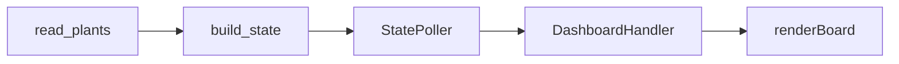

# Plan 03 — 同格植物叠放与草坪显示

## 1. Metadata

- Plan ID: P03
- Iteration: `002-progress-and-zombie-health`
- Status: Approved
- Depends on: 现有植物数组读取、State 构建和本地网页；不依赖 P01/P02 的关卡与僵尸 HP 逻辑
- Requirement IDs: R7, R8, R9

## 2. Goal

修复生存模式中高坚果与南瓜头等植物叠放时，State 把同格多株判为错误并清空整块草坪的问题。保留每株独立实体，在 5×9 格子里展示该格的全部植物，并以可复查的原始数组、State、API 和页面证据确认没有把真实叠放误判为读取失败。

### Requirement Mapping

| Requirement ID | Outcome in this Plan | Acceptance signal |
|---|---|---|
| R7 | 同格多株作为合法占用保留；每格提供全部植物及稳定的主要植物字段 | 高坚果与南瓜头同格时 `plants` 仍含两株，`board.cells` 该格列出两株，其他格不被清空 |
| R8 | 网页草坪显示同格的全部名称，且空格、未知可种性与读取失败保持不同语义 | 用户截图中的 5×9 草坪不再全空；叠放格可看到“高坚果”和“南瓜头”；鼠标提示含类型码 |
| R9 | 固定样本及运行中的只读现场验证实体数、占用格数和叠放格数 | 同一现场 raw 50 株、State 50 株、44 个占用格、6 个叠放格；`/api/state` 与页面一致，异常坐标和容器数量不匹配仍报错 |

## 3. Scope

### In scope

- 根因已定位：旧 `state.builder.build_state` 遇到第二株同坐标植物抛出 `Multiple plants occupy row 0, column 6`，随后把 `plants` 设为 `null`、清空 45 个 `board.cells` 并使网页呈现全空。用户的[游戏画面](../evidence/001-layered-plants-game.png)显示高坚果与南瓜头叠放，[故障页面](../evidence/002-empty-board-bug.png)显示草坪全空但卡槽与僵尸仍在刷新。
- 当前工作区已有直接修复：`build_state` 将同格实体聚合为 `cell.plants`，保留 `plants` 顶层实体列表和旧版单株 `type_code/type_name` 入口；`renderBoard` 渲染每个 `cell.plants` 的名称。已用当前进程只读采样观察到 50 株、44 个占用格、6 个叠放格，修复后 State 为 `ok`，32 项单测通过。P03 Task 仍需正式检查该实现的边界、必要修正与证据回填，不能因代码已存在而预先打勾。
- 多层格子的主要植物顺序应与内存槽遍历顺序无关：普通主体优先，南瓜头为覆盖层，睡莲/花盆为承载层；各实体 ID、类型、行列都必须完整保留。若出现超过两株，同样保留列表而不清空草坪；不靠 `plant_count` 推断可种性。
- 继续区分合法同格叠放与真正的坏数据：行列越界、类型非法、数组报告数和解码数不一致仍显式报错。读取失败时页面不得呈现为“当前所有格都空”。
- 只使用既有 Python State 与原生网页模块；零新依赖，零游戏输入或内存写入。预计修改/核对 `state/builder.py`、`dashboard/static/app.js`、`tests/test_state.py` 三个文件；若实测发现窄屏文字不可辨，先记录为后续 UI 问题，未经审批不扩大到新布局或框架。

### Out of scope

- 推断植物具体叠放规则、种植合法性、种植费用或每株植物 HP；本 Plan 只真实呈现已经存在的对象。
- 把 001 遗留的同步画面证据、动态通关判断或 JEV 决策接入一并完成。
- 以静态类型目录替代游戏内存中的活实体清单；支持其他棋盘尺寸或游戏版本。

## 4. Impact Surface

### 4.1 File and Symbol Map

```text
game/
  reader.py              (只读依赖，不预计修改)
state/
  builder.py
dashboard/
  server.py              (只读依赖，不预计修改)
dashboard/static/
  app.js
tests/
  test_state.py
```

```text
File: game/reader.py
Module: game.reader
Symbols:
  read_plants — 向 State 提供逐株原始活实体，P03 只核对输出，不修改读取规则
```

```text
File: state/builder.py
Module: state.builder
Symbols:
  build_state — 将原始活植物逐个归一化，按 (row, col) 聚合并输出顶层 plants 与 board.cells；保留真实错误语义
```

```text
File: dashboard/server.py
Module: dashboard.server
Symbols:
  StatePoller — 发布最新完整 State 快照，P03 使用既有只读路径
  DashboardHandler — 提供 GET /api/state 和静态页面，P03 使用既有接口
```

```text
File: dashboard/static/app.js
Module: browser renderer
Symbols:
  renderBoard — 按 cell.plants 呈现同格多株及类型提示，空格/未知可种性与错误状态可辨
```

```text
File: tests/test_state.py
Module: tests.test_state
Symbols:
  StateBuilderTests.test_pumpkin_and_tall_nut_share_one_cell_without_erasing_the_lawn — 不同数组顺序的高坚果+南瓜头叠放回归
  StateBuilderTests.test_invalid_plant_and_count_mismatch_are_explicit_errors — 越界字段和容器计数错误回归
```

### 4.2 End-to-End Flow



`read_plants` 位于现有 `game/reader.py`，`StatePoller` 与 `DashboardHandler` 位于现有 `dashboard/server.py`；本 Plan 不预计修改这两个文件，仅使用它们串联的原始数据和只读 API。

## 5. Decision

### 5.1 Open Decision

无阻塞性 Open Decision。当前同格 State 同时保留完整 `cell.plants` 列表和旧单株字段，以避免现有消费方丢失兼容入口；顺序用植物层级而非数组扫描顺序确定。若后续要定义更完整的游戏种植层规则，另行规划。

### 5.2 Confirmed Decision

#### Confirmed Decision Record

- Decision ID: CD-03
- Confirmed choice: 把同格植物叠放故障加入 002 的独立 Plan，验证草坪完整显示与原始实体一致。
- Source: 用户 2026-09-24 提供游戏/网页对照截图，并显式调用 `$sdd-plan` 要求“002 add plan to fix it”
- Date: 2026-09-24
- Reason: 游戏画面有多株植物，网页草坪却全空；现场异常直接指向同格植物被当成冲突后整域清空。

## 6. Task

### Task

- [x] T1 — 叠放植物 State 与草坪呈现复核
  - Objective: 审查现有直接修复，必要时收紧同格聚合、主要植物稳定性、错误与缺值路径，并形成自动与现场可复查证据。
  - Execution hint:
    - Width: `standard`
    - Worker effort: `medium`
    - Budget override: None; uses `sdd-implementation` defaults
  - Affected files:
    ```text
    Expected:
      state/builder.py
      dashboard/static/app.js
      tests/test_state.py
    Actual:
      state/builder.py
      dashboard/static/app.js
      tests/test_state.py
    ```
  - Implementation backfill:
    ```text
    Notes: 保留现有同格聚合，按主体、南瓜头覆盖层、睡莲/花盆承载层排序；同层再按类型码、实体 ID、槽位稳定排序，使主要植物不受数组顺序或槽位交换影响。目录外植物类型和越界坐标显式报错；读错或未获取时网页格子不再标成空格。未增加依赖、游戏输入或内存写入。
    Changed files:
      state/builder.py; dashboard/static/app.js; tests/test_state.py
    ```

## 7. Validation

### Traceability

| Requirement ID | Task ID | Check | Expected evidence |
|---|---|---|---|
| R7 | T1 | 固定样本含南瓜头+高坚果双株、相反数组顺序，以及睡莲/花盆承载和三株同格样本 | 每个实体 ID 和类型保留；主要植物稳定；`plants` 总数与 `cell.plants` 求和一致 |
| R8 | T1 | 本地浏览器检查 5×9 网格的叠放格、普通格与空格 | 叠放格显示全部名称，草坪不清空；空格仍注明可种性未知，真正读错给出错误状态 |
| R9 | T1 | 同次/相邻只读 raw、State、`GET /api/state`、页面与用户游戏截图对照 | 现场 50 株、44 占用格、6 叠放格被一致呈现；越界和活数不一致仍为 error，不混成空列表 |

### Commands

- 目标运行环境/测试命令：`uv run python main.py snapshot --once`；`uv run python main.py serve --port <空闲本机端口>`；浏览器读取 `GET /api/state`。若旧服务未重启，不能用旧进程的页面作为新代码验收。
- 静态检查：`uv run python -m compileall -q state tests`；`node --check dashboard/static/app.js`（本机有 Node 时）；`python .codex/hooks/check_iteration_names.py`。
- 针对性测试：`uv run python -m unittest discover -s tests -p "test_state.py"`；整体 `uv run python -m unittest discover -s tests -p "test_*.py"`。

### Implementation evidence

Implementation T1 证据（2026-09-24）：

- 固定样本：高坚果/南瓜头双顺序，以及睡莲/花盆承载、三株同格、同层槽位交换均通过；逐格 `plants` 求和与顶层实体数一致，ID 保留。越界行列、非法类型、植物数组活数不一致返回 `error` 和 `plants: null`；读取失败与成功读到空数组的 State 语义分离。
- 命令：`uv run python -m unittest discover -s tests -p "test_state.py"` 18 项通过；`uv run python -m unittest discover -s tests -p "test_*.py"` 34 项通过；`uv run python -m compileall -q state tests`、`node --check dashboard/static/app.js`、`python .codex/hooks/check_iteration_names.py` 均退出码 0。
- 现场只读：`uv run python main.py probe` 的植物 raw 为 reported/scanned/decoded 50/50/50、占用 44 格、叠放 6 格；相邻 `uv run python main.py snapshot --once` 为 `ok`、50 株、44 占用格、6 叠放格、逐格实体和 50、植物错误 0。新启 8877 本地服务的 `/api/state` 同样为 `ok`、50/44/6/50；其浏览器页面显示 50 株，5×9 草坪的同格高坚果与南瓜头两个名称及类型码提示，并将一个真实空格显示为“可种未知”。完成后已关闭临时页面和 8877 服务，未触碰已有 8765/8766 服务。
- 局限：raw、State、API 与页面是相邻而非同一原子帧；虽然各次植物数与占用分布一致，现场游戏画面的新截图及真实读取失败时的页面没有取得。读取失败页面文案已按 State 状态分支实现，仍待独立 Verify 复核；用户旧截图仅作为故障参照。

### Manual checks

- 在用户提供的两张[现场图片](../evidence/001-layered-plants-game.png)与[旧网页图片](../evidence/002-empty-board-bug.png)所代表的叠放场景下，取新的同刻游戏画面、raw、State、API 和网页进行对照；旧截图只作故障参照，不冒充新一帧证据。
- 浏览器检查普通单株格、高坚果+南瓜头格、空格；确认窄窗口仍能识别多个植物名或可通过悬浮提示查看全部类型。
- 若进程退出、换关或场景变化导致植物数量不再是 50，不把 50/44/6 写死为成功条件；核对同一采样时的动态实际数量。

## 8. Risks

- PvZ 允许覆盖层与承载层；将所有同格两株都视为损坏数据会重现全空草坪。反过来，把真正越界或数量损坏静默忽略也会污染未来给 JEV 的 State。
- 当前状态只表达“格内有几株及其类型”，不表达游戏引擎在各种攻击/铲除情况下的层级优先级；主要植物字段是兼容展示入口，不是完整种植规则。
- 用户游戏现场易变；50/44/6 是一次生存模式只读样本，正式验收须按当时实际采样比对。
- 预计三个既有文件、零新依赖；若真实浏览器验收发现需要改布局 CSS，须先修订方案并重新审批范围。

## 9. Approval

- Status: Approved
- Approved by: 用户（显式调用 `$sdd-implementation 002 plan-3`）
- Approval date: 2026-09-24
- Notes: 用户在审阅新增 P03 后明确要求实施 002/P03。现有直接修复仍须按本 Task 的实施与独立验证流程回填。

若 Goal、Scope、Decision、Task 或 Validation 有实质修订，将 Approval 恢复为 Pending，并等待用户再次明确批准。
