# Plan 1 — Semantic actions and State confirmation

## 1. Metadata

- Plan ID: P01
- Iteration: `003-action-executor`
- Status: Approved
- Depends on: 001 `memory-state-reader`; 002 `progress-and-zombie-health` (both Verify Passed per `.memory/context.md`)
- Requirement IDs: R1, R2, R3, R4, R5, R6, R7, R8, R9, R10

## 2. Goal

为固定 PvZ 1.0.0.1051 目标窗口提供三个语义动作与 JSON CLI：按卡槽和行列种植、按 State 中的 ID/坐标收取 item、对指定格执行一次原生铲除。每个动作都检查目标进程与唯一 HWND，并把鼠标消息定向投递给该 HWND；游戏可在后台运行，执行器不切换前台。动作前后由同一目标 PID 的 State 确认实际变化。唯一 G1 验收顺序修订为：Human 配置游戏在后台运行、不暂停并冻结僵尸，按卡槽 1–10 循环按行优先种满 5×9 草坪（不等待冷却），随后逐格铲至全空，再以 5 秒间隔动态收集掉落物并检查阳光增量是否严格大于 25；不实现 JEV 的植物选择策略或通关策略。

### Requirement Mapping

| Requirement ID | Outcome in this Plan | Acceptance signal |
|---|---|---|
| R1 | 提供 `place_plant(card_slot, row, col)`、`collect_item(item_id)`、`shovel_cell(row, col)`；铲除返回动作实际观察到消失的植物 ID 集合。 | V01 中三类动作均经真实 JSON CLI 执行并出现对应 State 变化。 |
| R2 | 固定目标进程身份与唯一 HWND 校验；把客户区坐标的鼠标消息定向投递给该 HWND，允许游戏保持后台且不主动切换前台；item 点击点来自当前 State 坐标。 | V01 至少记录一次在非目标窗口位于前台时、目标游戏后台动作成功的 State 变化；记录目标 PID/HWND、前台 HWND 和客户区几何。 |
| R3 | 动作前后采样同一 PID 的 State；等待有界且可配置；结果为 `rejected`、`success`、`unverified`，不自动重试。 | V01 每步确认对应目标格植物新增、指定 item ID 消失或格内植物 ID 消失；不确定结果不被记为成功。 |
| R4 | 通过 `main.py action --action-json <JSON>` 接收一条语义请求并输出一条 JSON 结果。 | V01 从命令行逐次提交动作，并读取机器可解析的结果。 |
| R5 | JEV 后续自动完成一只普通僵尸的场景。 | G3；本 Plan 不实现 JEV，也不要求关卡胜利。 |
| R6 | 在叠层格中按指定 `plant_id` 保证移除某一指定层。 | G2；本 Plan 只承诺一次原生按格铲除并报告实际删除 ID；重复调用逐步清空格子。 |
| R7 | 支持不同游戏版本及非标准窗口布局。 | G3；只支持固定 1.0.0.1051 和确认过的客户区 profile。 |
| R8 | 验证所有 item 类型和所有场景下的坐标/收取语义。 | G2；V01 只需收取至少两个 ID 与坐标可解析的掉落物，记录其 candidate/provisional evidence。 |
| R9 | Human 将游戏配置为后台继续运行、不暂停、僵尸冻结并提供充足阳光；实机验证按行优先循环卡槽 1–10 种满 45 格，再逐格铲除至全空。Human 已修改数据消除冷却，种植不检查或等待 cooldown，但每次需由 State 确认。 | V01 同一实机流程记录游戏处于后台时的 45/45 与 0/45；每次放置确认新植物 ID，且没有超时后自动重试。 |
| R10 | 全部铲除后记录阳光基线；每 5 秒采样并动态收集新掉落物，确认至少两个不同 item ID 消失。结束时阳光余额增量必须严格大于 25，报告 item 数及阳光增量。 | V01 同一 PID 的 `sun_before`/`sun_after`、不同 item ID 的成功请求与消失确认；仅当 `sun_after - sun_before > 25` 且至少两个不同 ID 收集成功时通过。 |

## 3. Scope

### In scope

- 新建 `runtime/window.py`，用现有目标进程身份检查关联 HWND；只接受已验证目标 PID 的唯一有效、可见、启用窗口；动态读取客户区矩形。输入使用客户区坐标和 `PostMessageW` 投递给目标 HWND，不要求目标 HWND 位于前台。
- 新建 `actions/` 包，封装目标窗口消息输入、请求校验、State 前后采样和结构化结果；复用 `state.builder.capture_state()`，不直接读写游戏内存。
- 在 `configs/pvz_1051.py` 增加固定版本的受支持窗口 profile 和卡槽、草坪、铲子区域布局；点击坐标依据 HWND 客户区计算，不保存屏幕坐标。实施时用实时 `GetClientRect` 确认 800×600 客户区条件；首格草坪 x 坐标以实机结果从 120 修正为 80。
- 实现三类动作：
  - `place_plant(card_slot, row, col)`：公开卡槽编号为 1–10，行列使用 State 的 0 基坐标（row 0–4、col 0–8）；点击卡槽后点击目标格，不读取或等待卡槽冷却；仅等待目标格出现新植物 ID。不做阳光/费用判断。
  - `collect_item(item_id)`：从当前 State 按 ID 找 item；依据其候选/暂定坐标和固定版本映射求点击位置，只接受有限、可解释且在客户区内的值；保留 State evidence，null、歧义、无法解析或越界时拒绝且不输入。验证同一 ID 消失，不要求 sun balance 增加。
  - `shovel_cell(row, col)`：先选原生铲子，再点指定格一次；若 State 观察到一个或多个 ID 消失则返回实际 ID 差异，不承诺能点名哪层。一个格仍有植物时，调用者可以再次明确调用，直至 State 显示为空。
- 在 `main.py` 增加 JSON CLI 的 `action` 子命令，一次接收一个语义 JSON 请求并输出一条 JSON 结果；移除 `card_ready_timeout_ms` 请求参数及 cooldown 前置检查；更新 `README.md` 和 `docs/architecture.md`，说明种植只等待 State 后置条件，以及 V01 的顺序和收集验收条件。
- 唯一 G1 验收 V01 由 Human 启动并准备游戏、配置其在后台继续运行且不暂停并冻结僵尸，通过 CLI 完成同一实机场景；验证期间另一个非目标窗口保持前台；不增加模拟输入的独立验收层。

### Out of scope

- JEV/LLM 调用、自治观察/决策、通关策略、自动选择卡组或根据植物类型选择格子；V01 的格子顺序和卡槽顺序固定，不需植物策略。
- 阳光余额或植物费用对种植的前置检查；Human 提供充足阳光和十张可在当前草坪使用的卡。收集完成后的阳光增量是 V01 必需结果证据。
- 新增常驻收集服务或 batch API；5 秒循环由 V01 调用者使用现有 snapshot/action CLI 编排。
- 按 `plant_id` 精确选择叠层的指定实体、所有 item 类型、其他 PvZ 版本、非标准客户区/缩放/多显示器。
- 执行器启动游戏、切换前台、控制键盘、拖拽、写内存、修改暂停/僵尸状态、注入、Hook、驱动或调用进程内函数；Human 负责在 V01 前设置后台运行、不暂停与冻结僵尸。
- 将 fake State/window/input 样本或自动化测试作为 V01 之前/之外的独立交付通过条件。

## 4. Impact Surface

### 4.1 File and Symbol Map

```text
runtime/
  window.py
actions/
  __init__.py
  executor.py
game/
  reader.py
configs/
  pvz_1051.py
main.py
README.md
docs/
  architecture.md
```

```text
File: runtime/window.py [new]
Module: target-window discovery and client geometry
Symbols:
  TargetWindow — HWND, owner PID, visibility/enabled state and client bounds
  find_target_window — locate the unique qualifying HWND for the verified target PID
  client_rect — read current client width and height
  display_geometry / dpi_for_window — enforce the fixed display profile
```

```text
File: actions/__init__.py [new]
Module: public semantic action API
Symbols:
  ActionExecutor — exported entry for validated actions and State confirmation
  ActionResult — exported structured action result and evidence
```

```text
File: actions/executor.py [new]
Module: action preflight, client-coordinate message delivery and State postconditions
Symbols:
  ActionExecutor.execute — dispatch one semantic request and return before/after evidence
  ActionExecutor.place_plant — select card slot without a cooldown gate, click target cell and wait for new plant ID
  ActionExecutor.collect_item — resolve current item ID/coordinates and wait for ID disappearance
  ActionExecutor.shovel_cell — click shovel/cell once and report actual removed IDs
  ActionExecutor._wait_for_postcondition — poll State until the bounded configurable deadline
  ActionExecutor._send_left_click — revalidate PID/HWND and post a click sequence to that HWND
  ActionExecutor._post_background_click — post WM_MOUSEMOVE, WM_LBUTTONDOWN and WM_LBUTTONUP
  ActionResult — represent rejected/success/unverified plus State evidence
```

```text
File: game/reader.py [modify]
Module: candidate State field reading
Symbols:
  read_seed_bank — read the candidate usable flag as one byte, avoiding adjacent bytes
```

```text
File: configs/pvz_1051.py [modify]
Module: pinned target identity and version-specific UI geometry
Symbols:
  TARGET_IDENTITY — existing executable/version/hash guard
  ACTION_WINDOW_PROFILE — supported client dimensions and coordinate/layout data for card slots, lawn cells, shovel and item mapping
```

```text
File: main.py [modify]
Module: CLI routing
Symbols:
  build_parser — add the semantic action command and JSON request argument
  run_action — parse one request, invoke ActionExecutor and print one JSON result
  main — route the approved action subcommand
```

```text
File: README.md [modify]
Module: user-facing operating contract and commands
Symbols:
  使用 — document action JSON calls and target-window preconditions
  安全边界 — distinguish read-only process memory from UI input to the pinned game
```

```text
File: docs/architecture.md [modify]
Module: system boundaries and data flow
Symbols:
  Action Executor section — document Process/Window → semantic request → Win32 input → State evidence
```

窗口客户区通过 `GetClientRect` 获取尺寸；执行器把客户区坐标打包为鼠标消息并以 `PostMessageW` 定向投递给目标 HWND，不将点换算为屏幕坐标，也不依赖目标窗口前台。`PostMessageW` 成功只表示消息进入窗口队列，不表示游戏已经处理，因此每步仍须以同一目标 PID 的 State 后置条件确认；完整性级别较低的进程可能因 UIPI 无法向较高完整性级别窗口投递消息。[GetClientRect](https://learn.microsoft.com/en-us/windows/win32/api/winuser/nf-winuser-getclientrect)、[PostMessageW](https://learn.microsoft.com/en-us/windows/win32/api/winuser/nf-winuser-postmessagew)、[Mouse Clicks](https://learn.microsoft.com/en-us/windows/win32/learnwin32/mouse-clicks)。

### 4.2 End-to-End Flow

```mermaid
flowchart LR
    cli["main.build_parser / run_action"] --> executor["ActionExecutor.execute"]
    executor --> before["state.builder.capture_state"]
    executor --> process["runtime.process.locate_target_process / verify_target_identity"]
    process --> window["runtime.window.find_target_window"]
    window --> geometry["runtime.window.client_rect / fixed display profile"]
    geometry --> action["ActionExecutor.place_plant / collect_item / shovel_cell"]
    action --> input["ActionExecutor._send_left_click / PostMessageW"]
    input --> game["PvZ 1.0.0.1051 UI"]
    game --> wait["ActionExecutor._wait_for_postcondition"]
    wait --> after["state.builder.capture_state"]
    after --> result["ActionResult with actual State delta"]
    result --> cli
```



每个 V01 请求单独调用 JSON CLI；Human 按规定顺序驱动动作并等待结构化结果，保持目标游戏后台运行且将非目标窗口留在前台。CLI 不启动游戏、不切换前台、不改写游戏参数或内存、不自动重放未确认操作。

### 4.3 Current Evidence Reviewed

- 原始需求：引用 ChatGPT 对话 `实现三个动作` 中用户要求种植、收取掉落物和删除植物，供下游单僵尸通关试验使用；其中 State 闭环与 `shovel_cell` 是原方案建议，已按本轮用户选择确认。
- 用户确认：2026-09-24 选择 OD-01 A JSON CLI、OD-03 A 按格原生铲除并报告实际移除 ID、OD-04 B 按 State 坐标推导 item 点击位置且保留 candidate evidence、OD-05 A rejected/success/unverified、有界等待且无自动重试；同日补充唯一 G1 Human 实机填满与清空流程。此前 OD-02 A 曾要求目标窗口必须在前台；用户随后明确要求利用其后台继续运行、不暂停、僵尸冻结的设置直接修复，并要求更新协调计划基线，因此本次将 OD-02 修订为后台目标 HWND 定向输入。
- Bootstrap/workflow: `AGENTS.md`、`.memory/context.md`、`.memory/project-map.md`、`.agents/skills/sdd-memory/SKILL.md`、当前 `.agents/skills/sdd-plan/SKILL.md` 及 `assets/plan-index.md`、`assets/plan.md`。
- CLI/依赖：`main.py` 提供 `probe`、`snapshot`、`serve`、`action`；`pyproject.toml` 仅声明现有 `pywin32` 运行依赖；README 提供快照、动作 CLI 与 unittest 命令。本 Plan 不新增依赖，也不把自动测试设为实机验收层。
- Runtime/State：`runtime/process.py` 有目标进程唯一查找和版本/PE/哈希检查；`runtime/window.py` 校验该 PID 唯一、可见、启用的 HWND 与固定窗口 profile；`actions/executor.py` 通过 `PostMessageW` 定向投递鼠标消息并前后采集同 PID State；`runtime/memory.py` 仍只暴露只读内存原语。`state.builder.capture_state()` 可复用；State 有 5×9 逐格植物、同格 `cell.plants`、植物 ID、卡槽和 item 坐标及字段级 availability。
- 已知局限：State 中卡槽/冷却字段和 item 坐标仍是 provisional/candidate；Human 已说明游戏数据修改后无冷却，因此执行器不得用这些字段阻止种植或等待卡槽。`collectible_suns` 为 null，`board.plantability` 为 unknown；阳光余额字段须在 V01 中确认可读并始终用同一 PID 比较。V01 不推断植物类型策略或全部 item 字段语义。
- 相似实现：`state.builder` 的 evidence/availability 字段和 `.sdd/002-progress-and-zombie-health/plans/03-layered-plants.md` 的同格 ID 聚合逻辑可复用；此前没有动作执行器或 HTTP 写接口，本次不增加 HTTP 控制服务。
- 窗口参照：`.sdd/001-memory-state-reader/evidence/002-game-paused.png` 是约 800×600 客户区的布局参照；实机必须重取目标 HWND 客户区，不能固化截图屏幕坐标。
- 工作区：Plan 阶段开始时 Git 状态中已有用户修改的 `.agents/skills/**`、`.codex/config.toml`、`.memory/context.md`，以及未跟踪的 `.sdd/003-action-executor/`；本次只更新 003 计划和 SDD Context，保留其余改动。
- 官方 API 依据：Win32 主文档说明 `GetClientRect`、`PostMessageW` 与鼠标消息客户区坐标语义；当前后台动作将点位打包给目标 HWND，需由 State 变化验证游戏已处理异步排队的消息。
- 规划约束：当前 SDD Plan skill 要求 G1/G2/G3、稳定 Check ID、用途/最小成功/非门槛边界及 evidence/升级条件；V01 为唯一 G1 Human 实机验收。
- 新增实机调试证据（2026-09-25）：按旧执行器状态运行时已完成 22/45 次种植；下一次 `(row=2,col=4,card_slot=3)` 因 provisional cooldown 读数被拒绝，结果 `input_clicks=[]`，没有发送输入。该拒绝与 Human 已改为无冷却的环境不符，不能作为当前验收的有效失败门槛。证据见 `.sdd/003-action-executor/evidence/v01-plant-run-2026-09-25.jsonl`；当时未进行铲除或收集，继续前需重新 snapshot 核实板面。
- 本次 Plan 变更（2026-09-25）：V01 次序更新为种满 → 全部铲除 → 记录阳光基线 → 每 5 秒动态发现并收集掉落物；成功须有至少两个不同 item ID 经 State 确认消失，且同 PID 阳光增量严格大于 25。收集循环总时限仍待 OD-06 决定。

## 5. Decision

### 5.1 Open Decision

None. OD-01 至 OD-06 均已由用户批准并移入 5.2。

### 5.2 Confirmed Decision

#### Confirmed Decision Record

- Decision ID: OD-01
- Confirmed choice: Option A — JSON CLI；在 `main.py` 增加 `action` 子命令，单次读取一个语义 JSON 请求并输出一个 JSON 结果。
- Source: 用户 2026-09-24 消息“OD-01 A”。
- Date: 2026-09-24
- Reason: 沿用统一入口即可提供可调用接口，不需要新增 HTTP 控制服务。

#### Confirmed Decision Record

- Decision ID: OD-02
- Confirmed choice: 修订为向通过固定进程身份校验的唯一目标 HWND 投递客户区鼠标消息；允许目标游戏在后台运行，不抢占前台、不改写内存。Human 负责使游戏在后台继续运行、不暂停并冻结僵尸。
- Source: 用户先于 2026-09-24 选择“OD-02 A”，后明确要求适配后台运行且无暂停、僵尸冻结的环境并更新协调计划基线；后续指示取代原前台限制。
- Date: 2026-09-24
- Reason: 满足用户当前指定的后台实机验证环境；把鼠标消息定向给已校验 HWND，不切换前台，并由 State 后置条件确认实际效果。

#### Confirmed Decision Record

- Decision ID: OD-03
- Confirmed choice: Option A — `shovel_cell(row, col)` 每次执行一次游戏原生铲除，State 返回实际消失的 plant ID；需要时由调用者逐次再次请求，直至格子为空。
- Source: 用户 2026-09-24 消息“OD-03 A”。
- Date: 2026-09-24
- Reason: 按格操作不假设原生游戏会选择叠层中的指定层。

#### Confirmed Decision Record

- Decision ID: OD-04
- Confirmed choice: Option B — item 点击位置从 State 的 item 坐标推导；保留 candidate/provisional evidence，只接受有限且可解释、映射后在支持客户区内的坐标。
- Source: 用户 2026-09-24 消息“OD-04 B，还是以坐标推导出”。
- Date: 2026-09-24
- Reason: 允许用现有坐标推进实机闭环，同时显式保留证据等级；null、歧义、无法解析或越界都不能发送点击。

#### Confirmed Decision Record

- Decision ID: OD-05
- Confirmed choice: Option A — 结果区分 `rejected`、`success`、`unverified`；等待上限有界且可配置，不自动重试。
- Source: 用户 2026-09-24 消息“OD-05 A”。
- Date: 2026-09-24
- Reason: 已发送但未观察到后置条件时不能误报成功或盲目重复输入。

#### Confirmed Decision Record

- Decision ID: CD-01
- Confirmed choice: Validation 使用一条 Human 监督的真实游戏验收流程。Human 启动 PvZ，设置游戏在后台继续运行、不暂停并冻结僵尸，提供充足阳光及十张卡；保持非目标窗口在前台。按 0 基行列行优先遍历 45 格，卡槽 1–10 循环种植并逐步等待 State 确认；随后逐格重复原生铲除至全空；最后记录阳光基线，每 5 秒动态采样并收集新掉落物，核对同 ID 消失和阳光增量。种植不检查或等待冷却。
- Source: 用户 2026-09-24 对 Validation 的补充，以及 2026-09-25 对顺序和冷却条件的修订。
- Date: 2026-09-25
- Reason: Human 实机效果直接证明输入、游戏操作、State 回读和多次收集闭环；不要求模拟输入先通过另一层验收。

#### Confirmed Decision Record

- Decision ID: CD-02
- Confirmed choice: 游戏数据已由 Human 修改为无冷却，动作不得读取或等待 cooldown 字段作为种植前置条件；每次种植仍须由 State 确认目标格新增植物 ID。
- Source: 用户 2026-09-25 消息“这里别在乎冷却，因为我改了数据所以无冷却”。
- Date: 2026-09-25
- Reason: cooldown State 字段是候选证据且与用户准备的运行环境不符，不能阻止真实动作。

#### Confirmed Decision Record

- Decision ID: CD-03
- Confirmed choice: 种植并铲除完毕后记录同一 PID 的阳光余额；每 5 秒动态发现并收集掉落物，分别确认 item ID 消失；以至少两个不同 item ID 成功消失且阳光增量 `sun_after - sun_before > 25` 作为收集通过条件，并报告 item 数与阳光增量。
- Source: 用户 2026-09-25 对 Validation 顺序、5 秒循环、多次收集及阳光增量的要求。
- Date: 2026-09-25
- Reason: 将用户要求的阳光更新和多次收集转成可复核的 State 证据。

#### Confirmed Decision Record

- Decision ID: OD-06
- Confirmed choice: Option A — 每 5 秒动态采样并收集；至少两个不同 item ID 消失且同一 PID 阳光增量 >25 后结束；总时长上限 120 秒，超时记录未通过、收集数与阳光增量。
- Source: 用户 2026-09-25 明确批准最新版 P01；该版将 Option A（120 秒）列为建议方案。
- Date: 2026-09-25
- Reason: 以用户对最新版计划的批准采用计划内推荐的有界收集方案，避免无限等待。

## 6. Task

### Task

- [x] T1 — 固定目标窗口上的三类语义动作与 Human 实机闭环
  - Objective: 实现已确认的 JSON CLI、目标窗口和坐标检查、`place_plant`/`collect_item`/`shovel_cell`、有界 State 等待与结果报告；移除种植动作的 cooldown 检查、等待及其请求参数；更新用户文档，并供 V01 按种植→铲除→动态收集顺序直接进行 Human 实机验收。
  - Execution hint:
    - Width: `broad`
    - Worker effort: `high` (涉及 Win32 HWND、系统鼠标输入、State 回读及长时实机流程；Implementation 阶段仍遵循技能运行时调度规则)
    - Budget override: None; uses `sdd-implementation` defaults
  - Affected files:
    ```text
    Expected:
      runtime/window.py
      actions/__init__.py
      actions/executor.py
      game/reader.py
      configs/pvz_1051.py
      main.py
      README.md
      docs/architecture.md
    Actual:
      runtime/window.py
      actions/__init__.py
      actions/executor.py
      game/reader.py
      configs/pvz_1051.py
      main.py
      README.md
      docs/architecture.md
    ```

  - Direct-task rework and V01 evidence (2026-09-25): In `actions/executor.py`, removed `card_ready_timeout_ms`, `_wait_for_card_ready`, `_card_readiness`, the cooldown gate, and cooldown-only action-result fields. `place_plant` now sends the card/cell input and relies on its bounded State postcondition only. Updated README and architecture text to match. A first post-removal request sent the intended clicks but returned `unverified` because a stale `readiness` reference remained; the next read-only snapshot confirmed plant ID `3697475584` at `(0,0)`. Fixed that result-detail reference without replaying the cell. The planting script resumed from the State-confirmed cell and completed the remaining row-major cells, cycling slots 2–10 then 1–10, with each new placement returning `success`; final occupancy was 45/45. A fresh post-fix `place_plant(slot=1,row=0,col=0)` also returned `success` with plant ID `3700424748`. The shovel script confirmed removal of all 45 plant IDs and final 0/45. The collection script polled every 5 seconds, collected IDs `3769040897` and `3769106433`, confirmed each ID disappeared, and observed same-PID sunlight grow from 1950 to 2000 (+50) within 120 seconds. A final single-plant cleanup restored 0/45. Final snapshot: PID 4092, profile 1.0.0.1051, sun 1900, one candidate item. The complete 45-cell run did not record foreground HWND/PID; user explicitly ruled that the available run and earlier recorded background success are sufficient for this delivery. Supporting checks: 34 existing unittests passed; all three temporary PowerShell scripts parsed. Temporary scripts are in `%LOCALAPPDATA%\Temp\jev-pvz-v01-003` and are not repository files.
  - Implementation backfill:
    ```text
    Notes: 已实现 Windows HWND 唯一性/可见启用检查、实时客户区映射、固定 800×600/96 DPI/单主显示器 profile，以及输入前的进程身份和 PID/HWND 重核对；不再要求目标窗口位于前台，鼠标消息通过 PostMessageW 定向投递给 HWND。三类语义动作均采集同 PID/程序身份的 before/after State；结果严格区分 rejected/success/unverified，点击后的轮询有界且不重试。初版曾按 State 的 provisional cooldown 计数与 byte-sized usable flag 等待卡槽（该门槛已于 2026-09-25 移除，详见下方 rework evidence）；item 仅接受有限且唯一解释的候选像素坐标；铲除每次仅选择一次原生铲子并报告消失 ID。已更新 CLI 与用户文档。一次草坪坐标调试证明 x=120 实际落到 `(0,1)`，改为 x=80 后请求 `(0,0)` 返回 success，并由 State 观察到新增 plant ID `3697410049`；此前卡槽 usable flag 的 DWORD 读取受相邻字节污染，改为单字节后读数由 1 变 0。该次放置后的历史记录显示当时 `(0,0)`、`(0,1)` 两格有植物；后续只读 snapshot 于 2026-09-24 23:33 +08:00 观察到 0/45 占用。Implementation 修复按 I-01 更新 README 顶部摘要和动作说明：明确向校验后的目标 HWND 定向投递 `PostMessageW` 消息，目标游戏可在后台运行且执行器不激活游戏、不改变焦点；移除逐击前台 HWND 与失焦拦截说明，并明确冻结僵尸、充足阳光、十张适用卡及非目标窗口前台属于 V01 的 Human 准备条件，不是每个独立动作的前提。按 README 回归命令运行 34 个 unittest，全部通过；人工检查 README 全文及 `rg` 结果确认无要求游戏前台/逐击前台校验/失焦禁止输入的旧说法，V01 准备要求保留且范围明确。此句记录的是 2026-09-24 状态；2026-09-25 的 direct-task rework 及完整 V01 运行结果已在下方回填并取代该历史状态。
    Changed files:
      - runtime/window.py
      - actions/__init__.py
      - actions/executor.py
      - game/reader.py
      - configs/pvz_1051.py
      - main.py
      - README.md
      - docs/architecture.md
    ```

Task 只实现本 Plan 的三个动作；V01 的卡槽顺序和格子顺序是人工验收协议，不新增植物策略或游戏启动/焦点切换能力。

## 7. Validation

### Traceability

| Check ID | Requirement ID | Task ID | Check | Tier and reason | Expected evidence | Delivery impact / escalation condition |
|---|---|---|---|---|---|---|
| V01 | R1, R2, R3, R4, R9, R10 | T1 | 唯一 G1 验收：Human 在启动并准备好的 PvZ 1.0.0.1051 实机中将游戏配置为后台继续运行、不暂停、僵尸冻结，并由 Human 将非目标窗口留在前台；通过 JSON CLI 按固定流程运行一次完整测试。初始 State 确认 5×9 草坪为空；Human 已选十张可在当前草坪使用的卡并提供充足阳光。按行优先遍历 `(row=0..4, col=0..8)` 共 45 格，卡槽按 1、2、…、10 循环；不读取或等待 cooldown，每次放置只等待 State 确认目标格出现新植物 ID。达到 45/45 后，按行优先逐格调用 `shovel_cell`，对仍有植物的格逐次显式调用，直到全空并记录 0/45。然后记录同一 PID 的 `sun_before`；此后每 5 秒采样 State，对新出现且 ID/坐标可解析的掉落物逐个调用 `collect_item`，确认每个相同 ID 消失并记录结果。至少两个不同 ID 收集成功后，继续至 `sun_after - sun_before > 25`；达到条件后结束并报告成功收集的 item 数与阳光增量。 | G1：一次真实端到端 Human 验收覆盖三类动作、目标 HWND 后台消息输入、种满、清空和多次掉落物收集；模拟输入无法证明真实游戏处理后台消息。State 逐步后置条件确认包含在同一流程，不形成前置测试层。 | 初始、每步及终态 State 样本；请求与 JSON 结果；固定目标 PID/HWND、当时前台 HWND 和客户区尺寸；45/45 与 0/45 占用证据；收集的不同 item ID 及同 ID 消失确认；`sun_before`、`sun_after` 与增量；收集循环的轮次/间隔。before/after 样本来自同一 PID，且至少一次成功动作发生于非目标窗口前台期间。 | 任一输入被错误窗口接收、后台消息虽入队但游戏无对应 State 变化、未完成 45 格占用/全空、无法读到阳光余额、收集不足两个不同 ID、阳光增量不大于 25、结果缺少必要证据，V01 不通过。出现 unverified、动作超时或 PID 改变时停止后续动作，由 Human 重新观察；不自动重试。总时长按 OD-06；未达门槛即记录失败及已收集数/阳光增量。 |
| V02 | R6, R8 | T1 | 仅当 V01 自然遇到叠层或额外 item 类型时，在同一实机记录中如实记下原生按格铲除的 ID 差异和 item 的类型/坐标 evidence；不另启场景、不要求构造所有类型或精确选层。 | G2：当前 API 不承诺按 ID 选层或覆盖全量 item 类型；这些边界不必然阻止固定实机场景完成。 | 若出现，保存对应前后 `cell.plants`、删除 ID、item ID/type/坐标解释和 State evidence；未出现的情况标为未观察。 | OD-03 Option A 已由 Human 确认，因此按格 native shovel 的剩余边界不阻塞；若 V01 无法清空，或无法收集至少两个不同的可解析 item ID，则属于 V01 失败并需修订实现或输入证据。未来若要求按 ID 选层或支持全部 item 类型，提升对应需求与检查级别。 |
| V03 | R5 | T1 | JEV 接入后的单普通僵尸自动通关。 | G3：JEV 运行时和策略不属于当前动作执行器目标。 | 本次不执行、不预写通过；由未来独立 Iteration 记录关卡结果。 | 不影响 003；当 JEV 接入并明确要求本仓库动作面完成通关时重新规划。 |
| V04 | R7 | T1 | 其他版本、客户区尺寸、DPI 缩放或多显示器窗口布局。 | G3：本次仅支持固定 1.0.0.1051 与确认后的客户区 profile。 | 本次不执行；目标/profile 不匹配时动作必须拒绝输入。 | 不影响 003；新增目标平台时重查身份与坐标，并另订验收条件。 |

### Commands

- V01 实机动作：`uv run python main.py action --action-json '{"action":"place_plant","card_slot":1,"row":0,"col":0}'`；按 row-major 和槽位 1–10 循环提交 45 次种植请求，再按格逐次铲除到全空，之后每 5 秒采样并对新 item 提交 `collect_item`。种植请求不得传入或依赖 cooldown 参数。
- State 证据采样：`uv run python main.py snapshot --once`；记录初始/满板/全空 State，采集 `sun_before`，随后按 5 秒周期动态记录 item ID、收集结果、同 ID 消失及 `sun_after`。
- 静态/替身测试：不设置独立验收命令或前置验收层；唯一交付门槛是 V01 Human 实机流程。README 当前的 unittest 命令属于现有仓库回归工具，不作为本 Plan 的替代证据。

### Implementation evidence

Implementation 阶段按 T1 回填实际受影响文件和 V01 的运行证据；记录动作 JSON、结果状态、State sample sequence、PID/HWND、客户区大小、45 格填满与全空数据、阳光基线/终值、每个 item ID 的收集结果及循环间隔/轮次。V01 未完成或未运行时明确保留为未验证；不能以代码检查或模拟点击替代实机证据。

- DPI repair: `runtime/window.py` 临时切换当前线程到 `DPI_AWARENESS_CONTEXT_SYSTEM_AWARE` 后读取 primary monitor 的 effective DPI，并在 `finally` 恢复 `SetThreadDpiAwarenessContext` 返回的原上下文；无法切换/恢复时拒绝。因为 GetDpiForWindow 对 DPI-unaware HWND 会返回 96，独立的 monitor DPI gate 才决定是否受系统缩放影响。依据 Microsoft Learn 的 `GetDpiForMonitor`、`SetThreadDpiAwarenessContext`、`GetDpiForWindow` 语义；没有运行 UI、游戏输入或测试套件。
- Syntax-only command: `uv run --no-sync python -c "import ast, pathlib; paths=['runtime/window.py','actions/__init__.py','actions/executor.py','configs/pvz_1051.py','main.py']; [ast.parse(pathlib.Path(p).read_text(encoding='utf-8'), filename=p) for p in paths]; print('syntax-only parse passed for ' + ', '.join(paths))"` — Pass；五个 Python 文件均解析通过。这不是动作或验收测试。
- 调试证据（非完整 V01）：使用者已启动并准备后台运行且不暂停、冻结僵尸的游戏。定向输入第一次用 x=120 请求 `(0,0)` 时，实机变化出现在 `(0,1)`，故校准首格 x=80；之后 `place_plant(card_slot=1,row=0,col=0)` 返回 `success`，State 出现新 plant ID `3697410049`，板上当前有 `(0,0)` 和 `(0,1)` 两格植物。动作前后的卡槽 usable byte 从 1 变 0。该结果只证明一次放置路径，未证明 45 格、item 收取、铲除或全部 State 证据记录齐备。
- V01 — 历史待验收记录（已被下列 direct-task 结果取代）：2026-09-25 旧执行器因 cooldown gate 在 1/45 后拒绝；这解释了本轮修复缘由，不代表当前实现结果。
- V01 — Completed 2026-09-25：在 PID 4092 / PvZ 1.0.0.1051 中，从 State 确认的 (0,0) 植物继续按行优先、槽位循环种满 45/45；随后逐格铲除并确认 0/45；最后按 5 秒间隔收集 item ID 3769040897 与 3769106433，分别确认消失；sun_before=1950、sun_after=2000、gain=50，120 秒内完成。初始 (0,0) 的首次响应曾因 stale readiness 变量为 unverified，但紧接着的 State snapshot 确认新 ID 3697475584；修复结果字段后，余下放置均返回 success，并另有一笔 clean place_plant success（ID 3700424748）及成功铲除。完整 45 格运行没有保存同时段 foreground HWND/PID；用户于 2026-09-25 明确裁定现有实机结果足以通过本次交付，该例外只适用于本次交付，不改变未来 V01 基线。终态只读 snapshot 为 0/45、sun 1900、1 个候选 item。34 个 unittest 及三份临时 PowerShell 脚本语法检查通过。

### Manual checks

- V01 — Human 启动并配置固定版本游戏后台继续运行、不暂停、冻结僵尸，确认 5×9 空草坪、十张适用卡和充足阳光；让非目标窗口保持前台。按 row-major 坐标及 1–10 卡槽循环执行 45 次种植，不检查或等待冷却，只等待每次 State 确认；记录 45/45 后逐格铲到所有 `cell.plants` 为空并记录 0/45。随后记录同一 PID 的 `sun_before`，每 5 秒采样、收集新出现且坐标可解析的 item，逐项确认 ID 消失；达到至少两个不同 ID 且阳光增量 >25 后报告收集数和增量；最大时长按 OD-06。保存请求/结果 JSON、State、目标 PID/HWND 与前台 HWND。
- V01 — 任一请求返回 `unverified`、超时或样本 PID 改变时停止后续输入，先重新观察；不得自动重发原请求。只有证据链完整并完成全流程才记为通过。
- V02 — 只整理 V01 自然出现的叠层与 item 证据；没有观察到的层级或类型标为未观察，不新增测试场景。
- V03 — 本次不运行；未来 JEV 集成后重订计划。
- V04 — 本次不执行其他版本/布局检查；运行时 profile 不匹配时应拒绝输入。

## 8. Risks

- `PostMessageW` 成功只说明鼠标消息已进入目标 HWND 的队列，不能保证游戏已处理；窗口消息可能被游戏忽略，或因 UIPI 完整性级别限制而被阻止。每步必须等同一目标 PID 的 State 后置条件，未观察到变化即 `unverified`，不得重试。
- 固定窗口布局需要由实时 `GetClientRect` 检查；窗口大小/缩放不符合受支持 profile 时 fail closed。坐标首格曾因 x=120 偏到 `(0,1)`，校准为 x=80 后 `(0,0)` 放置成功；V01 仍需验证其余格位、item 和 shovel 的点位。
- State 的卡槽冷却与 item 坐标含 candidate/provisional 证据；Human 已确认游戏数据无冷却，因此动作不得依赖 cooldown 字段或其有界等待。item 位置只有在解析有限、映射有效后才能输入；实机不符时停止并报告 unverified/rejected，不能盲目点击。
- 45 格顺序种植和清理是长流程；每一步等待有界且可配置。Human 负责提供充足阳光、合适卡组和当前 5×9 草坪；程序不检查余额/卡费、不判断植物类型与格子匹配。
- 单次 shovel 只报告实际 ID 差异；叠层格要逐次显式调用直至空。若一次请求后没有可观察差异，不得称成功或自动重复。
- State 事件可能同时受人工操作影响；同一 PID、逐步调用与采样记录能减少归因歧义，但 V01 期间须避免额外点击。

## 9. Approval

- Status: Approved
- Approved by: 用户（当前会话）
- Approval date: 2026-09-25
- Notes: 用户于 2026-09-25 批准最新修订版 P01，包含推荐的 OD-06 Option A（最长 120 秒）。
