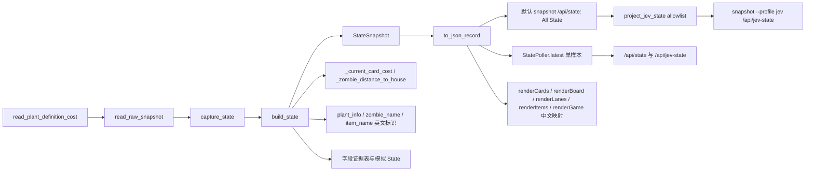

# Plan 1 — State 契约与安全派生

## 1. Metadata

- Plan ID: P01
- Iteration: `004-game-state-observation`
- Status: Approved
- Depends on: 001～003 当前 State、读取器与动作结果
- Requirement IDs: R1, R2, R5, R7, R8, R9, R15, R17

## 2. Goal

先给现有 State 做逐字段事实盘点及一帧可审阅的英文模拟样本，再为下一步决策提供有证据的确定性派生。完整关卡的多株、多僵尸、五行、45 格结构继续作为基础；State 的语义字符串供英文 JEV 消费，网页按标识映射为中文。新增 JEV State 精简投影，以 001 初始模拟字段组为基线；All State 继续保留完整诊断契约，但按本次 R9 明确删除 `progress_to_house` 并增加格子距离。僵尸本体与装备 HP 必须分开理解；字段来源、适用条件、未知值和版本兼容写清楚，不能把候选含义标成已验证。

### Requirement Mapping

| Requirement ID | Outcome in this Plan | Acceptance signal |
|---|---|---|
| R1 | State 字段契约、来源/证据/缺口清单；模拟节选与其主字段表逐项对应，未展示的现有诊断字段另表解释 | 文档与 `snapshot --once`、`/api/state` 的实际结构一致，节选字段不在主表中“凭空出现”或“消失” |
| R2 | 由程序计算受支持场景的当局费用、布尔型卡牌冷却就绪及已核验的确定性卡槽规则；不新增 affordability 字段 | 固定样本与实机动态证据证明 cost/冷却结果，JEV 无需解释原始冷却计数 |
| R5 | 对时间序列及全规则可种性明确暂缓 | 不输出无证据的速度、ETA、合法动作和威胁分数 |
| R7 | State 的语义值与枚举为英文，网页仍以中文展示；Plan 内有英文模拟样本 | `snapshot`/API 的各场景 JSON 不含中文语义值，现有 Dashboard 仍有中文名称和状态 |
| R8 | HP 本体、头盔、盾牌、气球分开，参考合计语义清楚 | 普通/铁桶/盾牌/气球/缺分量样本的 raw→State→页面一致；旧 `hp` 仍等于 `body_hp` |
| R9 | 在标准日间草坪校准 `house_x=0`、房屋侧首格边界 X=50 与 80px 列距；程序计算每只僵尸的像素距离、0–8 整数格子距离及行最近值，不输出 `progress_to_house` | 用户提供的同场景画面/State 证明 X 正方向及 row0 X=10/90/…/650 的 80px 间距；边界样本与逐行最近值符合公式 |
| R15 | 提供 JEV State / All State 两种分类。JEV State 以 001 初始模拟字段组和决策清单为基线，只保留明确的决策字段；All State 保持当前完整 State 输出不变。两种 profile 由同一 State 样本生成，JEV 中未获取字段保持 null/unavailable。 | 固定 001 模拟样本与当前 State 投影对照；JEV 正向 allowlist 精确，All State 深度等价于现有序列化结果；同一采样的 sequence/time 一致。 |
| R17 | JEV State 的 `board.cells[row][col]` 表示格子状态：`null` 为空且可种、`false` 为不可种、`plant:<type_name>` 为已占用；删除 JEV board 的独立 `terrain` 与 `plantability` 字段，All State 保持不变。逐格语义用于标准日间 5×9 草坪；occupancy 无效或不支持布局时 `board.cells` 为 null。 | 标准白天草坪固定样本正确编码 5×9；占用值使用英文 type_name；显式不可种格为 bool false；无效/不支持棋盘返回顶层 null；All State 深度不变。 |

## 3. Scope

### In scope

- 当前事实：`schema_version=1`、观测时间/序号/来源/错误、`availability`/`evidence`、阳光、卡牌静态费用和原始冷却、植物/僵尸/掉落物、5×9 占用、五行僵尸计数、像素/格子距离、原始快照。记录每项“已有/候选/缺失”和消费者用途；移除旧 `progress_to_house` 字段。
- 不新增 `cards[].affordable` 或 `affordable_by_catalog`。`cost` 由程序在受支持场景中计算当局最终价：先在固定进程中只读核验 `PlantDefinition` 基础价表，再按已证实的模式/升级规则修正；JEV 用它和阳光考虑资源选择，无需知道内存偏移或自行修正价格。若有特殊模式无法得出可信费用，明确 unavailable，不能把基础价冒充最终价。
- `cards[].cooldown_ready` 由程序读取并解释卡槽 active/refresh 状态，在正常未改冷却的固定目标上观察完整冷却事件后输出严格 bool；不能只把 raw 交给 JEV。`usable` 的可验证确定性门槛也由程序组合，仍与单个格子的可种规则分开。受支持的标准卡槽/场景必须取得通过证据；未覆盖特殊模式标记 unavailable，不能把未知写成 false。
- 使用用户 2026-09-26 确认的标准日间草坪几何：`house_x=0`、房屋侧第一列边界 X=50、列宽 80px。`zombies[].distance_to_house_px=max(0,x-house_x)`；`distance_to_house_cells` 是从房屋侧起算的 0 基整数格列，公式 `clamp(floor((x+30)/80), 0, 8)`，对应半开区间 `[0,50)→0`、`[50,130)→1` … `[610,+∞)→8`。各行分别给出最近僵尸的像素距离和格子距离。删除旧 `progress_to_house` 及其 `spawn_x` 依赖；其他背景/模式保持 null/unavailable，不泛化未经确认的布局。
- `type_name`、`game.scene/phase/mode/background` 等机器字段使用稳定英文标识，例如 `sunflower`、`buckethead_zombie`、`playing`、`adventure`、`day`；保留类型/场景数值码，未知枚举为 `unknown` 或 null，不在 State 增加中文显示副本。`errors` 等 State 诊断文本也应使用英文；`raw_snapshot` 的诊断文本需审计并避免本地化异常文字混入 State。
- 当前 Web UI 的中文名称不能再直接取自 State；在 `app.js` 依据英文标识/数值码映射中文，未知项用中文兜底且显示原始码。P02 原始 JSON 观察页按 State 原样显示英文值。
- 保持 002 已验证的 `hp=body_hp` 兼容语义，`helmet_hp`、`shield_hp`、`balloon_hp` 分列；`total_hp` 仅为所有分量读到时的非负数值和，不能作为统一可伤害 HP、精确击杀时间或某次攻击的消耗顺序。003 动作结果会携带部分 `type_name`，随 State 英文化对照其 JSON 输出。
- `decision_ready` 的判定条件必须定义，不能继续误导为“State 有值即能决策”；至少把受支持场景中 cost、cooldown_ready、像素/格子距离等 G1 必需字段纳入判定。特殊模式或缺样本时 false 并解释原因。
- 新增 JEV State 正向 allowlist 投影，以 001 P03 模拟快照/字段清单分类游戏决策数据；All State 保留完整字段、证据、错误、来源和 raw 诊断，唯一 R9 schema 变更是移除 `progress_to_house` 并增加 `distance_to_house_cells`。JEV State 的字段状态只对应其自身 allowlist，不能用删除几项已知诊断键再复制剩余字段。
- CD-08 进一步确定 JEV `board.cells` 的逐格语义，并从 JEV board 删除 `terrain`、`plantability`；All State 的完整 board 诊断结构保持不变。未知/不支持的完整棋盘使用顶层 `board.cells=null`，不把未知单格写成 `null`。
- `snapshot` 增加显式 `--profile all|jev`（默认 all），保留 `/api/state` 为 All State 并增加只读 `/api/jev-state`。CLI/API 投影从同一次 `capture_state` 或同一 `StatePoller.latest` 得到，不创建第二采样器。
- 双 profile 分类基线如下；未列入 JEV 列的当前字段继续留在 All State：

| 字段组 | JEV State | All State |
|---|---|---|
| 快照标识 | `schema_version`, `observed_at_utc`, `sample_sequence`, `status`, `valid`, `decision_ready` | 以上字段及 `retry_count`, 完整 `source`（PID/profile/hash/地址） |
| 可用性 | 不输出 `availability`；未获取值保留 null | 完整 `availability`, `evidence`, `errors`, `missing_fields` |
| 游戏 | `phase`, `mode`, `background`, `paused`, `level`, `wave`, `total_waves`, `level_complete` | 原始枚举码、重复别名、`progress_raw` 和候选读数 |
| 资源/卡槽 | `sun_balance`; 卡槽 `slot`, `type_code`, `type_name`, `cost`, `cooldown_ready`, `usable` | 模仿者原始字段、冷却计数/标志、成本来源及 SeedBank 候选；未获取 JEV 值保持 null/unavailable |
| 棋盘/植物 | 五行九列；`cells[row][col]` 为 null（空且可种）、false（不可种）或 `plant:<type_name>`（已占用）；整个格子状态未知时 `cells=null`；JEV 不输出 `terrain`/`plantability`；植物 `type_code`, `type_name`, `row`, `col` | 植物 ID/slot/叠层详情、完整 cell 对象、原始地形候选及完整 terrain/plantability 诊断 |
| 僵尸/行 | 僵尸 `type_code`, `type_name`, `row`, `x`, `y`, `hp`/`body_hp`（二者相等）、护具 HP 分量、`distance_to_house_px` 与 0–8 `distance_to_house_cells`；lane 行号、数量及 `nearest_zombie_distance_to_house_cells` | 僵尸 ID/slot、`total_hp`、lane zombie ID 列表及像素/格子最近距离诊断 |
| 掉落物 | `items` 包含 `type_code`, `type_name`, `x`, `y`；不输出 `collectible_suns` | item ID/slot、类型解释、坐标解释、收取标志候选、`collectible_suns` 和完整条目 |
| 诊断/内部字段 | 不输出 PID、文件路径/hash、内存地址、`raw_snapshot`、原始候选块、详细错误/缺口列表和重复别名 | 保留当前完整本地诊断字段 |

- `board.cells` 以 001 P03 的五行九列为形状；`plant:<type_name>` 使用稳定英文名。堆叠植物仍由 JEV `plants` 列表逐株表达，避免单格主名丢失其他实体。
- 使用现有 `docs/memory-map.md` 与 `docs/architecture.md` 记录证据和接口含义；同步 README 对观察入口/字段的描述。

### Out of scope

- 将冷却原始计数直接命名为剩余时间/秒数；未核验时计算 true 的 `usable`。
- `affordable`、`affordable_by_catalog` 及以静态目录价格假装实时费用；直接调用目标进程内的游戏函数或写内存来取价格。
- 推导所有背景和植物组合的通用可种性，或生成 `available_actions`/策略性 `lane_threat_score`。JEV board cell 的 `null`/`false` 编码仅用于 CD-08 定义的标准日间 5×9 草坪；无法判断整盘或不支持布局时输出 `cells=null`。
- 本次不输出 `progress_to_house`、跨样本速度、ETA、完整 JEV DecisionState 或改动 003 动作闸门；连接真实 JEV 或调用模型。
- 在 State 中保留中文 `type_name` 或另加 `*_zh` 展示副本；网页中文应由 UI 映射提供。
- 新依赖与额外内存写入。

### All State 模拟节选（供 Implementation 对照，非实机证据）

场景：1-1 白天，75 阳光，卡槽 0 向日葵、卡槽 1 豌豆射手；第 2 行（0 基）第 1 列有向日葵，同一行出现普通僵尸与铁桶僵尸。已有数值由 `tests/test_state.py::sample` 经当前 `build_state` 的模拟输入核对；**英文名称和 `cooldown_ready` 是 004 目标形状，其中两个布尔值是假设已完成正常冷却动态核验后的示意，不是当前实机证据**。以下是 All State 的兼容性节选；精简 JEV State 按上表 allowlist 投影。null 表示无法确认，不能由 JEV 当作 false 或 0。

```json
{
  "schema_version": 1,
  "observed_at_utc": "2026-09-25T02:00:00Z",
  "sample_sequence": 42,
  "status": "ok",
  "valid": true,
  "decision_ready": false,
  "sun_balance": 75,
  "game": {
    "scene": "playing",
    "scene_code": 3,
    "mode": "adventure",
    "mode_code": 0,
    "background": "day",
    "background_code": 0,
    "paused": false,
    "level": "1-1",
    "spawned_waves": 1,
    "total_waves": 10,
    "level_complete": false
  },
  "cards": [
    {
      "slot": 0,
      "type_code": 1,
      "type_name": "sunflower",
      "cost": 50,
      "cooldown_ready": true,
      "usable": null
    },
    {
      "slot": 1,
      "type_code": 0,
      "type_name": "peashooter",
      "cost": 100,
      "cooldown_ready": false,
      "usable": null
    }
  ],
  "plants": [
    {"id": 101, "type_code": 1, "type_name": "sunflower", "row": 2, "col": 1}
  ],
  "zombies": [
    {
      "id": 201, "type_code": 0, "type_name": "normal_zombie", "row": 2,
      "x": 620.0, "y": 250.0,
      "hp": 270, "body_hp": 270, "helmet_hp": 0, "shield_hp": 0,
      "balloon_hp": 0, "total_hp": 270,
      "distance_to_house_px": 620.0, "distance_to_house_cells": 8
    },
    {
      "id": 202, "type_code": 4, "type_name": "buckethead_zombie", "row": 2,
      "x": 700.0, "y": 250.0,
      "hp": 270, "body_hp": 270, "helmet_hp": 1100, "shield_hp": 0,
      "balloon_hp": 0, "total_hp": 1370,
      "distance_to_house_px": 700.0, "distance_to_house_cells": 8
    }
  ],
  "lanes": [
    {"row": 0, "zombie_count": 0, "zombies": []},
    {"row": 1, "zombie_count": 0, "zombies": []},
    {"row": 2, "zombie_count": 2, "zombies": [201, 202], "nearest_zombie_distance_to_house_px": 620.0, "nearest_zombie_distance_to_house_cells": 8},
    {"row": 3, "zombie_count": 0, "zombies": []},
    {"row": 4, "zombie_count": 0, "zombies": []}
  ],
  "items": [],
  "availability": {
    "cards.cost": "provisional",
    "cards.cooldown_ready": "available",
    "cards.usable": "unavailable",
    "zombies.hp": "provisional",
    "zombies.distance_to_house_px": "available",
    "zombies.distance_to_house_cells": "available",
    "lanes.nearest_zombie_distance_to_house_px": "available",
    "lanes.nearest_zombie_distance_to_house_cells": "available"
  },
  "evidence": {
    "cards.cost": "static_catalog",
    "cards.cooldown_ready": "verified_with_gameplay",
    "zombies.distance_to_house_px": "verified_with_gameplay",
    "zombies.distance_to_house_cells": "verified_with_gameplay"
  }
}
```

本例 `hp=body_hp`；铁桶僵尸 `270 + 1100 + 0 + 0 = 1370` 仅表示部件数值合计。不同攻击可能打在不同部件，不能用 `total_hp` 直接计算击杀时间。示例为 1-1 关，向日葵/豌豆射手的静态目录费用分别是 50/100；这只是**当前基线**，P01 交付时须由程序给出经核验的当局价。`cooldown_ready: true/false` 展示**假设核验完成后**的布尔契约；当前代码尚不能给这两个值。`usable` 更宽，仍无法确认。距离字段示例使用已确认日间 house/grid 几何；超出该布局时保持 `null`/`unavailable`。`distance_to_house_cells=8` 是零基最远列索引，不表示僵尸占据或阻挡该植物格。`progress_to_house` 已按用户 2026-09-26 指示删除。

样本末尾三个区域的作用不同：`items: []` 是**游戏事实**，表示本帧成功读到零个掉落物（读取失败应是 null）；`availability` 是**字段状态表**，说明某项读数是否已核验、仅是候选或无法获得；`evidence` 是**证据来源表**，例如费用来自静态目录。后两者供诊断和可信度判断，不是额外的阳光、僵尸或动作。上例 `cards.cooldown_ready=available / verified_with_gameplay` 同样只是“已完成核验后的模拟目标”，Implementation/Verify 必须取得真实事件证据才可这么标。

### 字段清单：现状、含义与获取路径

先看 A～F 与后面的“待补”表：它们共同解释上方 JSON 节选里看得到的字段。“未展示字段”单独说明当前完整快照另外还有什么、用途何在。`已有` 指当前 `build_state` 已输出，但可用性可能仍为 `provisional`；`计划` 指 004 待实现且须满足证据；`暂缓` 指本次不输出确定结果。

#### A. 快照与诊断

| 字段 | 状态 | 含义、来源和边界 |
|---|---|---|
| `schema_version` | 已有 | JSON 结构版本，当前为整数 1；`state/schema.py::to_json_record` 校验，不等于已冻结的业务 `state_version="1.0"`。 |
| `observed_at_utc`, `sample_sequence` | 已有 | 采样时间、进程内采样序号；来自 `build_state/capture_state`，不是游戏内时钟。 |
| `status`, `valid`, `decision_ready` | 已有 | 读取状态、快照内部有效性、决策就绪标记；`decision_ready` 目前恒 false，P01 需定义转 true 的最小必要条件，不能因 `valid=true` 自动变 true。 |
| `availability`, `evidence` | 已有；新增字段状态为计划 | 示例只列相关字段的可用性和证据，不是完整映射；`provisional` 表示有读数但语义尚待核验，`unavailable` 表示不能给确定值。 |

#### B. 游戏进度与阳光

| 字段 | 状态 | 含义、来源和边界 |
|---|---|---|
| `sun_balance` | 已有 | 当前阳光整数；`game/reader.py::read_sun_balance` 读取 Board 字段；无效或断连为 null。 |
| `game.scene`, `scene_code` | 已有，英文值计划 | 当前场景和 Root 原始码；英文如 `playing`。未知码保留且名称为 null/unknown。 |
| `game.mode`, `mode_code`, `background`, `background_code` | 已有，英文值计划 | 模式与场地英文标识及原始码；来自 Root/Board 候选，Web UI 按码/英文标识翻译中文。 |
| `game.paused`, `level_complete` | 已有 | 单字节 0/1 原始标志解释成暂停/完成布尔值；其他原始值报错/未知。 |
| `game.level` | 已有 | 冒险模式 `N-M` 标签；非冒险模式不套用冒险关卡解释。 |
| `game.spawned_waves`, `total_waves` | 已有 | 已生成波数与总波数；不表示当前活着的僵尸波次。 |

#### C. 卡牌

| 字段 | 状态 | 含义、来源和边界 |
|---|---|---|
| `cards[].slot`, `type_code`, `type_name` | 已有，英文名计划 | 0 基卡牌槽序、植物码和英文植物标识；来自 `read_seed_bank` 及静态目录。003 动作 `card_slot` 为 1 基，调用前转换。 |
| `cards[].cost` | 已实现，标准模式 available | 标准 Adventure/Hard Survival 从游戏 `PlantDefinition` 基础价表取得当局费用，并与固定目标游戏卡槽显示价核对；无尽模式升级植物可能加价，该动态事件按用户决定暂缓并继续标 provisional/unavailable。来源见 `evidence["cards.cost"]`。 |

#### D. 植物

| 字段 | 状态 | 含义、来源和边界 |
|---|---|---|
| `plants[].id`, `type_code`, `type_name`, `row`, `col` | 已有，英文名计划 | 活植物 ID、类型及 0 基位置；从植物数组读取。模拟节选只有这五项，没有 `slot`。 |

#### E. 僵尸与分层 HP

| 字段 | 状态 | 含义、来源和边界 |
|---|---|---|
| `zombies[].id`, `type_code`, `type_name`, `row`, `x`, `y` | 已有，英文名计划 | 活僵尸 ID、类型、0 基行和游戏坐标；由已校准的日间布局从 X 派生两种房屋距离。 |
| `zombies[].distance_to_house_px` | 已实现，标准日间布局 available | `max(0, x-house_x)`，单位为游戏像素；house_x=0。其他布局/无效 X 保持 null/unavailable。 |
| `zombies[].distance_to_house_cells` | 已实现，标准日间布局 available | 0 基整数格列距离，0 表示房屋侧格列、8 表示最远列；按 X 和 80px 列距离散映射。它只表示所在列区间，不表示占据植物格。 |
| `zombies[].hp`, `body_hp` | 已有 | 同一个本体 HP；`hp` 为 002 保留的兼容别名，不代表整只含装备僵尸的总 HP。原始偏移 `Zombie+0xC8`。 |
| `zombies[].helmet_hp`, `shield_hp`, `balloon_hp` | 已有 | 头盔、盾牌、气球分量；原始偏移 `+0xD0/+0xDC/+0xE4`，State 展示非负值；读不到应为 null，不当成 0。 |
| `zombies[].total_hp` | 已有 | 四个分量都已读取时的非负数值和；有一项未知则 null。只供参考，不表示统一血条或真实攻击路径。 |

#### F. 行汇总与掉落物

| 字段 | 状态 | 含义、来源和边界 |
|---|---|---|
| `lanes[].row`, `zombie_count`, `zombies` | 已有 | 五行各自的 0 基行号、活僵尸数与 ID 列表；由同帧 `zombies[]` 分组，不是威胁评分。 |
| `lanes[].nearest_zombie_distance_to_house_px`, `nearest_zombie_distance_to_house_cells` | 已实现，标准日间布局 available | 分别取该行所有僵尸 pixel distance 和 grid-distance index 的最小值；无僵尸时值为 null。 |
| `items` | 已有 | 本例 `[]` 表示这一帧成功读到零个掉落物；读取失败则为 null。实体字段未出现在本例，见“未展示字段”。 |

#### 当前完整 State 另有、但模拟节选未展示的字段

这些字段确实由当前代码输出；上面的模拟节选为了阅读没有放入。它们不是上表中“漏掉的样本字段”，也不能因为没展示就宣称代码里不存在。P01 实施时需决定哪些保留在完整诊断 State、哪些仅供将来单独的 JEV 输入视图使用；改动现有 JSON 键要检查 001～003 消费方。

| 现有字段 | 是什么、是否给 JEV 使用 |
|---|---|
| `retry_count`, `source`, `errors`, `missing_fields`, `raw_snapshot` | 采样重试、进程身份/地址、错误和原始读取诊断；主要用于排错。JEV 可看错误/可用性，不需要内存地址与整份原始快照。 |
| `game.progress_raw` | `read_game_progress` 读到的 scene/mode/level/wave 等候选原始字段映射，含值与证据；供核对映射是否读错。已有归一化 `game.*` 时，JEV 不应依赖它。它与僵尸距离字段无关。 |
| `game.phase`, `pause_raw_code`, `level_number`, `level_raw_code`, `wave`, `wave_raw_code`, `total_waves_raw_code`, `level_complete_raw_code` | 兼容别名或原始码。模拟节选只保留对应的主要语义值；完整 State 当前仍含这些诊断/兼容键。 |
| `cards[].imitator_type_code` | 只有卡牌 `type_code=48`（模仿者）时，才指向其模仿的植物类型码，当前 `cost` 也据此选择静态目录项。普通卡的原始读数即使为 0，也不表示其“模仿豌豆射手”；普通卡的决策视图不需要此字段。 |
| `cards[].cost_source` | 标准 Adventure/Survival 支持值为 `plant_definition_table_verified_with_gameplay`；Endless 升级价继续说明加价候选且 provisional。完整 State 暂保留来源字段；JEV 输入不包含此诊断字段。 |
| `cards[].cooldown_progress_raw`, `cooldown_total_raw`, `usable_flag_raw` | SeedBank 读取的两个候选冷却计数和一个单字节候选标志；**不是已确认的冷却时间，更不是秒数或剩余时间**。目前不知道计数方向/单位、flag 的 0/1 语义；保留作动态核验诊断，不直接喂给 JEV 当作可用性。 |
| `plants[].slot`, `zombies[].slot`, `items[].slot` | 内存数组槽位，供读取/对象追踪排错，**不是卡牌槽位**。当前完整 State 确实有 `plants[].slot`，但上方模拟节选没有；003 使用植物 ID/格子，JEV 通常不需要数组槽。 |
| `board.rows`, `cols`, `cells[5][9]`, `terrain`, `plantability[5][9]` | 当前完整 State 的 5×9 棋盘、占用格及尚未确认的地形/可种性；模拟节选只列了 `plants`，未铺开 45 格。真实读取失败时 `plants=null`，不能把空矩阵当作空草坪。 |
| `items[]` 的 `id`, `slot`, `type_code`, `type_name`, `type_meaning`, `x`, `y`, `coordinate_interpretation` | 本例 `items=[]`，故没有可展示的 item 对象；若有掉落物，完整 State 会给 ID、候选类型及坐标，类型名将按 R7 改英文。`slot` 仍只是内存数组槽。 |
| `collectible_suns` | 当前固定为 null；需验证具体 item 类型与收取事件后才可派生，不应把所有掉落物视为阳光。 |

#### 当局费用与卡牌冷却：已实现范围和未知边界

| 字段 | 当前规则与可用条件 |
|---|---|
| `cards[].cost`（标准模式已实现；无尽升级价暂缓） | 基础价表地址为 `module_base + 0x29F2B0 + type_code×0x24 + 0x10`。标准 Adventure/Hard Survival 读取后与游戏显示价核对；无尽生存升级植物“每株同类 +50”的代码路径保留，但动态加价验证已由用户移出 004，未核验场景继续 provisional/unavailable。模仿者、特殊模式和读取失败时不得伪造当局价。 |
| `cards[].cooldown_ready`（标准模式严格 bool） | `SeedPacket` 的 `mActive` 位于卡槽 `+0x48`；当 raw 计数与 flag 符合已核对边界时映射 true/false，矛盾/缺失保持 null。用户确认正常种植后变 false、自然冷却恢复后 true；原始计数不交给 JEV 自算。 |
| `cards[].usable`（按已验证规则计算） | 程序将同帧 `sun_balance >= cost`、`cooldown_ready`、游戏活动状态组合成“当前卡槽可选择/购买”；不包含指定格子的可种规则。所需输入不全或 Endless price 仍 provisional 时保持 null/provisional，不把未知写成 false。 |

费用/冷却来源：[PvZ 内存地址表](https://wiki.pvz1.com/doku.php/doku.php?id=%E6%8A%80%E6%9C%AF:%E5%86%85%E5%AD%98%E5%9F%BA%E5%9D%80)给出植物基础数据表 VA `0x69F2B0`、步长 `0x24`、费用偏移 `+0x10`。本次对仓库固定 PE 文件做只读 RVA→文件偏移核对（PE ImageBase `0x400000`）：类型 0/1/41 的表项类型码与基础价分别是 0/100、1/50、41/150，故配置应记录模块相对 RVA `0x29F2B0`，运行时仍需进程同刻核验。公开反编译的 [Board.cpp — `PlantUsesAcceleratedPricing` / `GetCurrentPlantCost`](https://github.com/ruslan831/PlantsVsZombies-decompilation/blob/master/Lawn/Board.cpp)、[SeedPacket.h — 卡槽结构](https://github.com/ruslan831/PlantsVsZombies-decompilation/blob/master/Lawn/SeedPacket.h) 与 [SeedPacket.cpp — `CanPickUp` / `Update`](https://github.com/ruslan831/PlantsVsZombies-decompilation/blob/master/Lawn/SeedPacket.cpp)说明基础价与当局价不同：例如双子向日葵基础价 150，若无尽生存场上已有一株同类，公开规则给出 200。`GetCurrentPlantCost` 是计算函数，不是卡槽内可读取的最终费用字段。公开源码和 PE 静态核对不能代替当前进程中的实测。

#### 僵尸距离与行位置：已实现范围

| 字段 | 当前规则与可用条件 |
|---|---|
| `zombies[].distance_to_house_px`、`distance_to_house_cells`（已实现，标准日间布局 G1） | 用户同场景样本校准 `house_x=0`、80px 列距和房屋侧边界 X=50；像素距离为 `max(0,x)`。格距索引为 `clamp(floor((x+30)/80),0,8)`，使 x=10/90/…/650 映射 0–8；X 缺失或其他布局为 null/unavailable。 |
| `lanes[].nearest_zombie_distance_to_house_px`、`nearest_zombie_distance_to_house_cells`（已实现，标准日间布局 G1） | 分别取该行已校准僵尸像素距离和格距索引最小值；无僵尸时值为 null，存在僵尸但其 X 无效时该行不可用，不能用原始候选排序。 |

#### 暂缓：掉落物、时间序列与合法动作

| 尚未实现的字段 | 获取/计算方案与可用条件 |
|---|---|
| `items[].collectable`, `collectible_suns`（暂缓） | 校验 `Item+0x50` 收取标志候选、类型码和坐标解释；观察同 ID 消失及阳光变化，之后才判断可收取与阳光子集。 |
| `zombies[].velocity_px_per_s`, `eta_to_house_s`（暂缓） | 以同 PID、同对象 ID、同一行的连续时间戳与 X 差估速，处理停顿/位移跳变/对象复用；只有距离有效且速度朝房屋、超过噪声门槛才可估 ETA。004 不输出确定值，后续决策闭环计划启动前重查。 |
| `board.plantability` 的确定值、`available_actions`（暂缓） | 须解码地形/障碍、同格叠层及植物专属规则，再用 003 动作结果交叉核验；占用矩阵和卡费不够推导合法动作。 |

英文标识来源应是固定版本类型码到稳定英文 slug 的静态映射，而不是把现有中文名称临时机翻。字段名继续使用英文 snake_case；未知代码保留 code，英文值为 `unknown`/null。UI 中文映射可由 code 或英文 slug 得到，禁止从中文 State 值倒推机器字段。

## 4. Impact Surface

### 4.1 File and Symbol Map

```text
state/schema.py
state/builder.py
state/projection.py             (new)
main.py
game/reader.py                 (基础价表运行时只读核验与读取)
configs/pvz_1051.py            (基础价表候选 RVA 与已校准草坪几何)
configs/plant_catalog.py
configs/zombie_catalog.py
configs/item_catalog.py
dashboard/static/app.js
dashboard/server.py
actions/executor.py            (只需检查 State-derived 名称消费是否兼容)
docs/memory-map.md
docs/architecture.md
README.md
tests/test_state.py
tests/test_reader.py            (基础价表边界与类型码回归)
tests/test_web.py               (中文页面与英文 API 回归)
```

```text
File: state/schema.py
Module: state.schema
Symbols:
  StateSnapshot — 现有版本化快照载体
  to_json_record — 验证 schema 版本和 availability 后输出兼容 JSON
```

```text
File: state/builder.py
Module: state.builder
Symbols:
  build_state — 统一归一化原始域，由程序计算当局价、卡槽状态、僵尸/行位置派生及证据状态
  _current_card_cost — 预期内部辅助：按已核验基础价、模式与同类植物数计算当局费用
  _zombie_distance_to_house — 预期内部辅助：用已校准的布局参数计算像素距离、整数格距和行最近值
  capture_state — 单次采样/一致性重试入口，保证 CLI、HTTP 使用相同快照
  _unavailable_record — 断连/失败时的明确未知状态
```

```text
File: state/projection.py
Module: state.projection
Symbols:
  project_jev_state — 从一个 JSON-ready All State 按固定 allowlist 构造精简 JEV State；不采样、不推断、也不修改输入
```

```text
File: main.py
Module: application entry
Symbols:
  run_snapshot / build_parser — 为 snapshot 增加 `--profile all|jev`，默认保留 All State
```

```text
File: dashboard/server.py
Module: dashboard.server
Symbols:
  DashboardHandler.do_GET — `/api/state` 继续返回 All State，新增 `/api/jev-state` 从同一个 `StatePoller.latest` 投影
```

```text
File: game/reader.py
Module: game.reader
Symbols:
  read_seed_bank — 读取卡槽候选冷却及可用标志；语义只在动态核验后升级
  read_plant_definition_cost — 预期新增的只读基础价表读取；校验表项类型码与数值后供当局 cost 计算
  read_raw_snapshot — 为 build_state 提供同一采样的原始域
```

```text
File: configs/pvz_1051.py
Module: configs.pvz_1051
Symbols:
  CANDIDATE_OFFSETS — 当前卡槽候选字段及基础价表 RVA/步长/字段偏移；运行时仍须按固定目标核验
  LAWN_GEOMETRY — 仅收录已校准布局的 house_x、grid_first_boundary_x、grid_cell_width_px
```

```text
File: configs/plant_catalog.py
Module: configs.plant_catalog
Symbols:
  PlantInfo / plant_info — 保留静态费用与类型码，提供稳定英文植物标识；中文名迁到 UI 映射
```

```text
File: configs/zombie_catalog.py
Module: configs.zombie_catalog
Symbols:
  ZOMBIE_NAMES / zombie_name — 将类型码映射为稳定英文僵尸标识，保留未知码处理
```

```text
File: configs/item_catalog.py
Module: configs.item_catalog
Symbols:
  ITEM_NAMES / item_name — 将候选 CoinType 映射为英文标识，保留 candidate 证据
```

```text
File: dashboard/static/app.js
Symbols:
  renderCards / renderBoard / renderLanes / renderItems / renderGame — 按英文标识/类型码映射中文名称；HP 分量和参考合计文案继续准确，覆盖图可复用 State 的已校准进度
```

```text
File: actions/executor.py
Module: actions.executor
Symbols:
  ActionExecutor._summarize_state — 检查随 State 返回的 type_name 是否仍可机器消费；动作参数/后置条件不依赖中文名称
```

```text
File: docs/memory-map.md
Symbols:
  字段证据表 — 记录原始计数、校准观察和不确定性
```

```text
File: docs/architecture.md
Symbols:
  State contract 说明 — 明确原始/派生边界及未来 JEV 消费方式
```

```text
File: README.md
Symbols:
  使用说明 — 指向快照、独立观察页与字段文档
```

```text
File: tests/test_state.py
Symbols:
  StateBuilderTests — 固定多实体、缺失/错误、卡牌判定和距离边界样本
```

```text
File: tests/test_reader.py
Symbols:
  读取器现有测试 — 新增基础价表 RVA/步长、类型码、异常数值与边界回归；卡槽更改时覆盖原始字段读取
```

```text
File: tests/test_web.py
Symbols:
  DashboardHttpTests — API 英文值、主页资源和浏览器中文展示的接口回归
```

### 4.2 End-to-End Flow



## 5. Decision

### 5.1 Open Decision

P01 无 Open Decision。OD-01 与 OD-02 已按用户选择移入下方 Confirmed Decision；OD-02 的距离表示于 2026-09-26 按 CD-05 修订。字段 profile 分类已按用户指示纳入 004；All State 除明确删除 `progress_to_house` 并加入格子距离外保持兼容。

### 5.2 Confirmed Decision

#### OD-01 — Option A：由程序计算确定性 State

- Confirmed choice: 004/P01 实现并核验受支持场景的当局费用、bool 型 `cooldown_ready`、可验证的 `usable` 门槛及僵尸/行派生；程序负责读取候选原始字段和确定性计算，不让 JEV 自行解释冷却计数或特殊模式价格。保持现有 `schema_version=1`，本次不新增或正式冻结 `state_version="1.0"`。
- Source: 用户 2026-09-25 指定“OD-01 不要把什么都交给 JEV，例如 cooldown_ready 可以程序算出来那么就直接算出来”。
- Date: 2026-09-25
- Reason: JEV 只需要判断策略，卡槽可用性与距离/价格等可验证事实由 Harness 给出。`affordable*` 仍按 CD-03 不新增；JEV 可使用阳光与当局费用做资源权衡，但不用修正价格规则。

#### OD-02 — 原 Option A：先校准再输出距离

- Confirmed choice: 原批准要求校准房屋触线、入场参考与方向，并输出像素距离、归一化进度和行最近距离。该表示已于 2026-09-26 按 CD-05 修订：保留像素距离，增加整数格子距离，删除归一化 `progress_to_house`；现在不再依赖 `spawn_x`。
- Source: 用户 2026-09-25 明确选择“OD-02 A”。
- Date: 2026-09-25
- Reason: 距离需要固定的几何基准；本次选择承担校准工作，而非长期只保留原始 X。

#### CD-01 — 英文 State、中文 Web UI

- Confirmed choice: State JSON 中的语义字符串与标识统一为英文，网页仍以中文呈现；本 Plan 保留英文模拟样本、字段含义与缺失字段获取方案。
- Source: 用户 2026-09-25 本次明确要求。
- Date: 2026-09-25
- Reason: JEV 消费英文机器契约，人工观察页面保持中文可读。

#### CD-02 — 僵尸 HP 分层语义

- Confirmed choice: 继续区分本体、头盔、盾牌、气球 HP；`hp` 只作为本体兼容别名，`total_hp` 为参考加和，不能作为统一血条。
- Source: 用户 2026-09-25 本次提醒；002/P02 的已交付实现与 Verify，003 动作沿用 State。
- Date: 2026-09-25
- Reason: 装备可独立承受伤害，本体 HP 或简单加和都不能单独代表实际耐久。

#### CD-03 — 卡牌费用与冷却字段收敛

- Confirmed choice: 不新增 `affordable`、`affordable_by_catalog`；受支持场景的 `cooldown_ready` 由程序计算并输出 bool，未覆盖场景标记 unavailable；当局 `cost` 已按 OD-01 纳入本次 P01。
- Source: 用户 2026-09-25 本次要求。
- Date: 2026-09-25
- Reason: 避免重复确定性比较与用 null/false 混淆未知和未冷却完毕。

#### CD-04 — JEV State 与 All State 字段分类

- Confirmed choice: JEV State 使用显式 allowlist，以 001 P03 初始模拟快照及 `state-checklist.md` 的决策字段族为基线，纳入 004 已确认对决策有用的字段和对应 availability；未知字段保留 null/unavailable。All State 保持当前完整序列化内容和现有默认行为。两种 profile 从同一个 State 样本生成。
- Source: 用户 2026-09-25 要求“直接分类，JEV STATE和All State”，并于 2026-09-26 明确要求修改 004，不保留单独 005。
- Date: 2026-09-26
- Reason: 将精简的 JEV 输入与本地完整诊断数据分开，同时保留 001 字段基线与现有消费者兼容。

#### CD-05 — 像素距离与格子距离替代全程进度

- Decision ID: CD-05
- Confirmed choice: 保留 `distance_to_house_px`，增加 `distance_to_house_cells`（0 基整数 0–8；0 是房屋侧格列，8 是最远列），删除 `progress_to_house`。标准日间草坪使用 `house_x=0`、房屋侧首格边界 X=50、列宽 80px；格列索引公式为 `clamp(floor((x+30)/80), 0, 8)`。主页位置标记按该索引吸附到对应列，但不表示僵尸占据植物格。其他未校准背景/模式输出 null/unavailable。
- Source: 用户于 2026-09-26 明确批准保留 `distance_to_house_px`、改为格子距离并删除 `progress_to_house`；同场景 State/截图显示 row 0 的 X 为 10、90、170、250、330、410、490、570、650，并确认房屋触线 X=0、首格边界 X=50、格宽80。
- Date: 2026-09-26
- Reason: 像素距离保留原始几何量，整数格距直接指出僵尸所在的 house-relative 列，不依赖未校准的出生参考点。

#### CD-08 — JEV board cell values

- Decision ID: CD-08
- Confirmed choice: 标准日间 5×9 草坪的 JEV `board.cells[row][col]` 使用三种值：`null` 表示空且可种，`false` 表示明确不可种，`plant:<type_name>` 表示已有植物；删除 JEV board 的独立 `terrain` 与 `plantability` 字段。occupancy 无效或背景/布局不支持时，整个 `board.cells` 为 null；All State 保持原结构。
- Source: 用户于 2026-09-26 明确给出 board cell 三种语义，要求删除 `terrain` 与 `plantability`，并在同一消息中批准 Plan-01 修订。
- Date: 2026-09-26
- Reason: JEV 可从单一矩阵读取标准日间草坪的占用/可种语义；整盘未知使用顶层 null，避免把未知单格冒充为空且可种。

## 6. Task

验收意图写在对应 Plan 或 Validation 内容中，不再塞入每个 Task 重复记录。

### Task

- [x] T1 — 对照模拟样本完成 State 契约
  - Objective: 对照本 Plan 的英文模拟节选及一一对应的主字段表，另行盘点完整 State 中未展示的诊断/特殊字段、分层 HP 和待获取字段；明确 `decision_ready` 与版本含义。
  - Execution hint:
    - Width: `standard`
    - Worker effort: `medium` (default)
    - Budget override: None; uses `sdd-implementation` defaults
  - Affected files:
    ```text
    Expected:
      docs/memory-map.md
      docs/architecture.md
      README.md
      Actual:
      docs/memory-map.md
      docs/architecture.md
      README.md
    ```
  - Implementation backfill:
    ```text
    Notes: 已补 State 英文机器标识、中文 UI 映射边界、分层 HP 兼容约定、费用/冷却/距离证据限制和 decision_ready=false 的当前依据；用固定目标一次只读快照核对字段结构。计划中的模拟 JSON 明确仍是假设目标形状，不作为实机事件证据。
    Changed files:
      docs/memory-map.md
      docs/architecture.md
      README.md
    ```

- [x] T2 — 英文 State、中文 UI、当局费用与安全派生
  - Objective: 保留既有 JSON 键与 HP 分层语义，把语义字符串改为稳定英文并同步网页中文映射；按已确认 OD-01 实现当前受支持标准模式的当局费用、bool 型冷却就绪与已验证的 `usable` 门槛，不新增 affordability 字段。无尽模式升级加价按用户 2026-09-26 决定暂缓。
  - Execution hint:
    - Width: `broad`
    - Worker effort: `high` (涉及候选内存语义和实机费用/冷却事件)
    - Budget override: None; uses `sdd-implementation` defaults
  - Affected files:
    ```text
    Expected:
      state/builder.py
      state/schema.py (如版本校验需扩展)
      configs/plant_catalog.py
      configs/zombie_catalog.py
      configs/item_catalog.py
      dashboard/static/app.js
      dashboard/static/style.css
      game/reader.py / configs/pvz_1051.py (基础价表读取与卡槽候选字段)
      tests/test_state.py
      tests/test_reader.py
      tests/test_web.py
      docs/memory-map.md
    Actual:
      state/builder.py
      configs/plant_catalog.py
      configs/zombie_catalog.py
      configs/item_catalog.py
      dashboard/static/app.js
      dashboard/static/style.css
      game/reader.py
      configs/pvz_1051.py
      tests/test_state.py
      tests/test_reader.py
      tests/test_web.py
      docs/memory-map.md
      docs/architecture.md
    ```
  - Implementation backfill:
    ```text
    Notes: 按用户要求经 direct-task 修正卡槽显示：费用、`cooldown_ready`、`usable` 使用 State 字段与逐项 availability，不再展示原始冷却计数或把已知值标为候选。Hard Survival 配对游戏截图/State 的卡牌价格相符；十张卡费用、冷却、可选值均为已获取的数值/布尔值。用户此前确认种植后冷却变 false、自然恢复后 true。无尽模式升级加价本次明确移出验收，其值仍按 provisional/unavailable 输出；其他 unsupported mode 继续 fail closed。
    Changed files:
      state/builder.py
      dashboard/static/app.js
      dashboard/static/style.css
      tests/test_state.py
      tests/test_web.py
      tests/test_reader.py
      docs/memory-map.md
      docs/architecture.md
    ```

- [x] T3 — 校准草坪像素/格子距离并移除全程进度
  - Objective: 按 CD-05 使用同场景画面/raw/State 核对 house_x、格子边界与 80px 列距；为已覆盖布局计算每只僵尸 `distance_to_house_px`、0–8 `distance_to_house_cells` 和两种行最近距离；从 All/JEV State 删除 `progress_to_house`，未覆盖布局保持 unavailable。
  - Execution hint:
    - Width: `broad`
    - Worker effort: `high` (实机坐标校准及多位置验证)
    - Budget override: None; uses `sdd-implementation` defaults
  - Affected files:
    ```text
    Expected:
      configs/pvz_1051.py
      state/builder.py
      state/projection.py
      dashboard/static/app.js
      dashboard/static/style.css
      dashboard/static/index.html
      tests/test_state.py
      tests/test_web.py
      docs/memory-map.md
      docs/architecture.md
    Actual:
      state/builder.py
      state/projection.py
      configs/pvz_1051.py
      dashboard/static/app.js
      dashboard/static/style.css
      dashboard/static/index.html
      tests/test_state.py
      tests/test_web.py
      docs/memory-map.md
      docs/architecture.md
    ```
  - Implementation backfill:
    ```text
    Notes: 按 CD-05 完成并以用户同场景 State/截图复核标准日间几何。用户样本中的 X=10/90/…/650 对应距离像素值和格距 0–8；每行最近值一致，`progress_to_house` 不再输出；边界和 unsupported 背景回退由 State/Web 测试覆盖。此前历史 backfill 已过期，本次按实际实现修正。
    Changed files:
      state/builder.py
      state/projection.py
      configs/pvz_1051.py
      dashboard/static/app.js
      dashboard/static/style.css
      dashboard/static/index.html
      tests/test_state.py
      tests/test_web.py
      docs/memory-map.md
      docs/architecture.md
    ```

- [x] T4 — 固定 JEV State allowlist 并保留 All State 兼容
  - Objective: 从一个现有 JSON-ready State 样本按 CD-04 的分类表生成 JEV State；新增 CLI/API 显式 JEV profile，保留默认 snapshot 与 `/api/state` 的 All State 输出；不增加采样器、不修改内存读取或任何候选字段的可用性。
  - Execution hint:
    - Width: `standard`
    - Worker effort: `medium` (default)
    - Budget override: None; uses `sdd-implementation` defaults
  - Affected files:
    ```text
    Expected:
      state/projection.py
      main.py
      dashboard/server.py
      tests/test_state.py
      tests/test_web.py
      docs/architecture.md
      README.md
    Actual:
      state/projection.py
      main.py
      dashboard/server.py
      tests/test_state.py
      tests/test_web.py
      docs/architecture.md
      README.md
    ```
  - Implementation backfill:
    ```text
    Notes: 新增 `project_jev_state`，从单个 JSON-ready All State 样本按字段显式构造投影，保留相关 availability 与 null/unavailable；精简棋盘为 5×9 字符串占用，剔除来源、raw snapshot、候选、证据、错误和诊断别名。`snapshot --profile all|jev` 默认 all；`/api/jev-state` 与 `/api/state` 从同一 `StatePoller.latest` 派生。未改内存读取、采样器或现有 All State serializer。
    Changed files:
      state/projection.py
      main.py
      dashboard/server.py
      tests/test_state.py
      tests/test_web.py
      docs/architecture.md
      README.md
    ```

- [x] T5 — 按 CD-08 投影 JEV board cell 状态
  - Objective: 将标准日间 5×9 JEV `board.cells[row][col]` 编码为 null/false/`plant:<type_name>`；从 JEV board 删除 `terrain` 和 `plantability`；occupancy 无效或不支持布局返回整个 `cells=null`；保持 All State board 深度不变。
  - Execution hint:
    - Width: `standard`
    - Worker effort: `medium` (default)
    - Budget override: None; uses `sdd-implementation` defaults
  - Affected files:
    ```text
    Expected:
      state/projection.py
      tests/test_state.py
      tests/test_web.py
      docs/architecture.md
      docs/memory-map.md
    Actual:
      state/projection.py
      tests/test_state.py
      tests/test_web.py
      docs/architecture.md
      docs/memory-map.md
    ```
  - Implementation backfill:
    ```text
    Notes: 按用户明确要求经 direct-task 完成并回填（不是正式 `$sdd-implementation` 阶段）。JEV board 仅保留 rows/cols/cells；标准日间 5×9 cells 编码为 null（空且可种）、false（明确不可种）、plant:<type_name>（已占用）；无效 occupancy/不支持布局时整个 cells 为 null。All State board 保持原样。单测覆盖三种格子语义、整盘回退、字段移除及 All State 输入不变。回归结果：test_state.py 24 项、test_web.py 12 项通过；Python 编译和 diff 检查通过。重启后的 8765 服务实时 API 确认 JEV board keys 为 rows/cols/cells、尺寸 5×9、样例值为 null/plant:sunflower/plant:torchwood；All State 仍保留 terrain/plantability 且为 5×9。
    Changed files:
      state/projection.py
      tests/test_state.py
      tests/test_web.py
      docs/architecture.md
      docs/memory-map.md
    ```

Task 只用 checkbox 表示是否完成：`[ ]` 表示仍需继续，`[x]` 表示完成。Execution hint 只记录任务宽度、建议 effort 和经批准的预算覆盖；未覆盖时使用 `.agents/skills/sdd-implementation/references/orchestration.md` 的默认值。实现完成后只回填对应 Task 的 Implementation backfill；其他状态、验收、验证和阻塞信息不在 Task 内重复记录。验证统一写在第 7 部分，并使用 `T1`、`T2` 等 Task ID 关联。

## 7. Validation

### Traceability

| Check ID | Requirement ID | Task ID | Check | Tier and reason | Expected evidence | Delivery impact / escalation condition |
|---|---|---|---|---|---|---|
| V01 | R1 | T1 | 模拟节选字段与主字段表逐项对账；未展示的完整 State 字段与 `build_state` / 实际快照单独对账 | G1：契约可信是本次核心 | 节选 JSON、主表和诊断/特殊字段表，来源、状态、类型与缺失边界一致 | 主表/节选不对应、漏列现有字段或错称已验证则阻塞 |
| V02 | R2 | T2 | Adventure/Hard Survival 标准费用、阳光与费用字段、bool 冷却和可选择门槛的正反例回归；无尽加价不在本次范围 | G1：当前受支持模式的确定性卡牌字段直接供观察/JEV 使用 | `test_reader.py`/`test_state.py` 断言：无 `affordable*`，标准模式 cost、`cooldown_ready` 和 `usable` 一致；未知特殊场景不写 false | 标准支持模式费用/布尔值错算或未知被当 false/null 则阻塞 |
| V03 | R2 | T2 | 固定目标标准模式卡牌显示费用与 State 对照，以及冷却/可选状态事件 | G1：确认交付范围内费用与冷却字段含义 | 用户提供的 Hard Survival 菜单价与配对 State 一致；用户已观察种植后 false、自然冷却恢复后 true；当前样本十张卡均为可用 bool；不要求无尽升级加价事件 | 标准模式状态与游戏/State 不符则阻塞；无尽加价列为 G3 Deferred |
| V04 | R5 | T1, T2, T3 | 核对速度/ETA/可种性/战术评分未伪装为已验证 | G3：未来 JEV/策略用途 | 文档列明暂缓及后续校准条件 | 后续决策闭环计划开始前重查；若本次实际输出这些字段则升 G1 |
| V09 | R7 | T1, T2 | 固定多类型/进度/未知码/错误样本的完整 State JSON 语义文本为英文；主页仍显示中文 | G1：用户明确的机器/页面语言边界 | `snapshot` 与 `/api/state` 英文标识、全树中文泄漏检查；浏览器中文名称及回退显示 | 任一中文语义值进入 State，或主页中文名称消失则阻塞 |
| V10 | R8 | T1, T2 | 普通及带头盔/气球僵尸的 State 组件值、同场景游戏截图类型/行列和 HP 展示对照；raw→State 计算由 builder 单测覆盖 | G1：装备耐久不能被本体值遮蔽 | 用户同场景 JEV State/截图中可见类型、行列、植物与 13 只僵尸数量相符；State 四分量与 `hp=body_hp` 正确；测试覆盖分量和、缺分量 null；Dashboard All State 显示参考合计。JEV 投影按设计不含 raw_snapshot | 组件错位、未知当 0、截图与 State 可见实体不符或把合计当统一血条则阻塞 |
| V11 | R9 | T3 | 核对标准日间草坪 house_x=0、首格边界 X=50、列宽80px、像素/格子距离和行最近值 | G1：位置派生必须有实机基准 | 同场景画面与 State/raw；X=10/90/…/650 映射格距0–8；边界X=49/50、129/130测试；逐行像素和格距最小值；其他布局 unavailable | house/grid边界、像素距离或行最小值错误，或不支持布局给出猜测数值则阻塞 |
| V20 | R15 | T4 | 将 001 P03 模拟样本和当前 All State 样本分别投影，逐项核对 JEV 正向 allowlist、字段组/类型与 unavailable/null 保留 | G1：字段差异正是用户提出本次分类的核心 | 固定样本断言 JEV JSON 路径精确；缺失字段不会变成 false/0；未来 All State 新增字段不会自动进入 JEV | JEV 输出越界、遗漏基线决策字段或改变未知语义则阻塞 |
| V21 | R15 | T4 | 对比投影前后 All State、默认 `snapshot` 和 `/api/state` | G1：兼容性是分类能安全上线的前提 | 同一固定输入的 All State 深度相等；既有默认 CLI/API 键和值不变 | 现有 All State 任一字段被删除、改名或改义则阻塞 |
| V22 | R15 | T4 | 检查 `/api/state` 与 `/api/jev-state` 同次轮询的时间/序号和采样器调用数，并比较显式 CLI profile 分支 | G1：两类 State 必须指向同一游戏帧 | HTTP 两个 profile 的 `sample_sequence`/`observed_at_utc` 一致且只调用一个 `StatePoller`; CLI 通过一个捕获结果分别序列化 | 增加第二 sampler 或两个 profile 采到不同样本则阻塞 |
| V23 | R15 | T4 | 检查 JEV projection 不包含来源身份、raw snapshot、内存地址、候选块、errors/missing_fields/evidence 及仅供诊断的重复别名 | G1：JEV 字段必须稳定、最小且不泄漏诊断结构 | 递归关键字段断言；对应诊断仍能在 All State 中查看 | 任一禁止诊断字段泄漏到 JEV 或 All State 丢失则阻塞 |
| V30 | R17 | T5 | 用固定 5×9 样本核对 null/false/`plant:<type_name>` 编码、JEV board 字段删除、未知/不支持棋盘回退及 All State 兼容 | G1：JEV cell 值直接影响模型对空格能否种植的判断 | 标准日间样本的空地、明确不可种和占用格分别符合定义；JEV 不含 `terrain`/`plantability`；无效 occupancy/不支持布局时 `cells=null`；All State 深度不变 | 空地/阻挡/占用混淆、未知被伪装成可种、或 All State 改变则阻塞 |

G1 包含 V01、V02、V03、V09、V10、V11、V20–V23、V30；OD-01、CD-05、CD-08 与 profile 分类均已确认，不能把费用、冷却、受支持布局像素/格子距离、JEV board cell 语义或 profile 隔离当作可选。V04 本次不要求实现；未来候选一旦在 004 输出为决策值，须升级到 G1。

### Commands

- 目标运行环境/测试命令（V01、V03、V11）：`uv run python main.py snapshot --once`；只在固定目标运行时执行，不要求改变游戏数据。V03 与 V11 的同刻游戏画面和事件观察为必要补充。
- 静态检查（V01、V04、V09、V10、V20、V23、V30）：对照 `state/builder.py`、`state/projection.py`、三个 catalog、`dashboard/static/app.js`、`state/schema.py`、`docs/memory-map.md` 和模拟/实际样本 JSON。
- 针对性测试（V02、V09、V10、V11、V20–V23、V30）：`uv run python -m unittest discover -s tests -p "test_reader.py"`、`uv run python -m unittest discover -s tests -p "test_state.py"`、`uv run python -m unittest discover -s tests -p "test_web.py"`。
- 全量回归（V02、V09、V10）：`uv run python -m unittest discover -s tests -p "test_*.py"`。

### Implementation evidence

Implementation 阶段按 Task ID 回填实际执行的命令、结果和关键输出；这不是正式 `verify.md` 的替代。

- T1 — `uv run python main.py snapshot --once` 返回 status=ok、valid=true；State 的 type_name 和 game scene/mode/background 为英文，HP 分量与诊断字段仍保留。`uv run python -m unittest discover -s tests -p "test_*.py"`：35 tests passed。一次快照只证明结构，不证明动态语义。
- T2 — `uv run python -m unittest discover -s tests -p "test_*.py"`：64 tests passed。新增 `test_web.py::test_card_labels_follow_state_cost_cooldown_and_usable_values` 覆盖已核验、冷却中、候选费用、未知可选值及部分 availability。重启服务后的主页 DOM 显示十张卡的真实费用、冷却就绪和可选状态；All State 对应三个字段 availability 均为 available。无尽模式升级加价按用户决策 Deferred。
- T3 — `uv run python -m unittest discover -s tests -p "test_state.py"` 和 `test_web.py` 通过；用户 2026-09-26 配对样本与早先同场景几何确认支持 X→像素/格距映射。边界 harness 与 unsupported-background 回退由既有测试覆盖；JEV board cell 与 `progress_to_house` 检查仍按 T4/T5 对应验证项处理。
- T4 — `uv run python -m unittest discover -s tests -p "test_state.py"`：23 tests passed；覆盖精简 allowlist、未知/null availability、经确认占用的 5×9 矩阵、未读取/结构无效占用保持 null、All State 输入不变及 CLI all 默认/JEV 选择。`uv run python -m unittest discover -s tests -p "test_web.py"`：12 tests passed；覆盖双 API 同序号/时间、一个 poller 样本、JEV 禁止诊断字段与页面切换/复制/失败清除。未运行实机页面浏览器检查；V20–V23 的固定样本/API 实现检查有测试证据，实机/人工浏览器部分保留给 Verify。
- T5 — `test_state.py`：24 tests passed；覆盖 cells 的 null/false/`plant:<type_name>` 语义、无效/不支持回退、JEV board 删除 terrain/plantability 和 All State 不变。`test_web.py`：12 tests passed。Python 编译与 `git diff --check` 通过。重启后的 `http://127.0.0.1:8765/api/jev-state` 返回 status=ok、board keys=`rows/cols/cells`、5×9，样例格为 null/`plant:sunflower`/`plant:torchwood`；`/api/state` 仍有 terrain/plantability 且 cells 为 5×9。在线 API 核对是当前服务确认，不替代独立 Verify。

### Manual checks

- V01 — 对照模拟节选逐项核对主表；另用同一次 `snapshot --once` 核对现有完整 State 的诊断/特殊字段、availability、evidence 和文档。
- V03 — 对照标准 Hard Survival/Adventure 的游戏卡槽价与 State；检查正常卡牌放置后冷却 false、自然恢复 true 及可选门槛。无尽模式升级费用不属于当前验收。
- V09 — 浏览器核对英文 API 之上的中文植物、僵尸、掉落物、场景和未知类型回退；完整 JSON 页面仍忠实显示英文 State。
- V10 — 将同场景游戏截图与 JEV State 的可见僵尸类型、行列、植物占用逐项比对；数值 HP 不从图像推断，由 raw→State 单测和 State 分量核对，确认 Dashboard All State 的参考合计与分量一致。
- V11 — 同场景核对游戏画面与 raw/State：house_x=0、首格边界 X=50、列距80px；用 X=10/90/…/650 样本核对格距0–8，用 X=49/50 和 129/130核对切换边界；校验像素/格距行最近值和其他布局 unavailable。不再采集 spawn_x 或核对 progress。
- V20/V21 — Implementation: `test_state.py` 23 tests passed；固定 builder 样本断言 compact 5×9 JEV 字段、仅在 occupancy available/provisional 且源矩阵有效时输出占用矩阵；未读取和无效矩阵输出 null 并保留 unavailable/error；另覆盖显式 allowlist、输入 All State 未变及 CLI parser 默认 all/显式 jev 投影。正式字段清单对照和独立 Verify 待后续阶段。
- V30 — 对 board cell 值使用固定样本单测：显式植株 type_name、空且可种、false 非可种、未知/不支持的整盘回退；逐项断言 JEV 不返回 terrain/plantability，All State 输入保持不变。该 fixture 不替代实机可种规则验证。
- V22/V23 — Implementation: `test_web.py` 12 tests passed；两个只读 API 的 sample_sequence/observed_at_utc 相同，单次 `StatePoller.sample_once` 后请求两路未增加采样调用；断言 JEV 不含 errors/evidence/source/raw_snapshot 与实体诊断 ID/total_hp，All State 仍返回原始样本。浏览器实机观察待后续 Verify。

## 8. Risks

- 无尽生存升级植物的动态加价尚无同刻实机对照，按用户决定列为 G3 暂缓；该模式继续 provisional/unavailable。标准支持模式卡价、冷却和可选值已有 Human 与实时 State 证据；模仿者和其他不支持场景仍 fail closed。`affordable*` 不进入 004。
- 当前静态目录和 `state/builder.py` 的场景/模式/场地字符串为中文，`app.js` 直接消费它们；英文迁移会影响测试和页面，需要同时检查未知码与 003 动作结果中的 `type_name`。
- 本次模拟 State 为结构与语义样例，不是实际目标进程证据；参考 HP 合计不能作为单一可伤害血槽。
- JEV State 与 All State 共享原始样本但拥有不同 allowlist；投影若使用开放式复制/删除键方式，未来 All State 新字段可能意外进入 JEV 输入。
- 003 使用修改过的“无冷却”游戏，不能用该结果证明普通冷却计数/标志含义。
- 僵尸数组位置与整帧采样一致性有限；距离校准需相同目标版本和同刻观察。
- 本 Plan 预计修改超过三个文件，因为英文机器契约同时影响目录、模型、网页中文映射、文档和测试；不新增依赖或独立抽象层。

## 9. Approval

- Status: Approved
- Approved by: User
- Approval date: 2026-09-26
- Notes: 用户于 2026-09-26 批准 R15/CD-04/T4 的 JEV State / All State 分类与投影范围，批准 CD-05 像素/格子距离契约及删除 `progress_to_house`，并批准 CD-08/R17 的 JEV board cell 语义与删除 `terrain`/`plantability` 字段。
