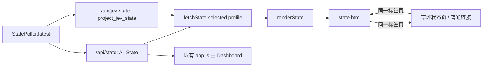

# Plan 2 — 独立动态 State 页

## 1. Metadata

- Plan ID: P02
- Iteration: `004-game-state-observation`
- Status: Approved
- Depends on: P01 的 State 契约；现有 `StatePoller` 与 `/api/state`
- Requirement IDs: R3, R6, R15

## 2. Goal

提供可直接打开的独立 `/state` 页面，持续读取并展示当前英文 State；页面默认展示基于 001 决策字段基线的 JEV State，并允许切换完整 All State。页面用中文文案清楚显示采样时间、序号、当前 profile、连接与错误状态，供人工观察字段变化。它与草坪状态页 `/` 通过页面内导航在同一浏览器标签页双向切换。页面复用当前单一采样器，不额外读取进程。

### Requirement Mapping

| Requirement ID | Outcome in this Plan | Acceptance signal |
|---|---|---|
| R3 | 独立 URL、同一浏览器标签页可切换、动态 State、可见采样状态 | 在当前标签页从 `/` 导航至 `/state` 并可返回；当前选中的 profile 随对应 API 更新 |
| R6 | 共享采样、异常/断连处理 | 两页看到同一序号；失败时不把旧 JSON 当作当前快照 |
| R15 | 页面可查看 JEV State 与 All State，并默认显示 JEV State | profile 切换明确；JEV/All 内容分别来自 `/api/jev-state` 和 `/api/state`，不启动第二采样器 |

## 3. Scope

### In scope

- 在本地只读服务提供 `/state`；页面按当前选择从相对路径 `/api/jev-state` 或 `/api/state` 拉取对应 JSON；静态资源按 allowlist 提供。
- 页面增加 JEV State / All State 选择控件，默认选择 JEV State；JEV 视图请求 `/api/jev-state`，All 视图请求 `/api/state`，复制按钮仅复制当前所选 profile。
- 展示当前 profile 的 State JSON，并单独突出 `status`、`valid`、`decision_ready`、采样时间/序号和错误；All State 的诊断错误照常显示，JEV State 以精简 availability 与状态信息表示未知字段。
- JSON 区域必须原样显示 P01 的英文机器值，不通过浏览器翻译或替换；页面标题、状态标签及操作说明使用中文。
- 浏览器定时刷新和 HTTP 失败提示；区分“服务不可达”“游戏断连”“State 错误”“尚未采样”。
- 草坪状态页 `/` 与 State 观察页 `/state` 均提供互相可达的普通页面链接，在同一浏览器标签页完成切换；补充 README 页面 URL 和使用方式。

### Out of scope

- 再造一套草坪/卡牌可视化；不改变 All State 任何字段来实现 JEV 精简。
- 新 HTTP 写接口、页面动作按钮、WebSocket、前端框架和新依赖。
- P03 的具体信息删减。

## 4. Impact Surface

### 4.1 File and Symbol Map

```text
dashboard/server.py
dashboard/static/index.html
dashboard/static/state.html          (new)
dashboard/static/state-page.js       (new)
state/projection.py                  (P01 projection contract)
dashboard/static/style.css           (必要的共享/页面样式)
README.md
tests/test_web.py
```

```text
File: dashboard/server.py
Module: dashboard.server
Symbols:
  StatePoller.latest — 返回同一采样器的深拷贝 State
  create_dashboard_server — 增加 /state 与 state-page.js allowlist 路由，保持 loopback 和只读 GET；页面链接由浏览器在当前标签页导航
```

```text
File: dashboard/static/index.html
Symbols:
  页面导航 — 以普通链接指向 /state，在当前标签页进入独立观察页
```

```text
File: dashboard/static/state.html
Symbols:
  独立 State 观察页 — 以普通链接返回 /，并呈现状态、时间、序号、错误和完整 JSON
```

```text
File: dashboard/static/state-page.js
Symbols:
  renderState — 用当前选定 profile 的快照更新页面、profile 标签和状态信息
  fetchState — 按选择请求 /api/jev-state 或 /api/state，处理异常并清除旧样本误导
```

```text
File: dashboard/static/style.css
Symbols:
  页面样式 — 共享导航与 JSON 可读性样式，保持窄屏可用
```

```text
File: README.md
Symbols:
  使用说明 — 说明 /state 入口及共享采样关系
```

```text
File: tests/test_web.py
Symbols:
  DashboardHttpTests — 新路由、资源、no-store、共享采样和异常响应回归
```

### 4.2 End-to-End Flow



## 5. Decision

### 5.1 Open Decision

无阻塞性选择。JEV/All 的字段契约由 P01/CD-04 固定；本 Plan 负责在 `/state` 呈现两个 profile 并复用现有采样器。

### 5.2 Confirmed Decision

#### CD-01 — 独立动态 State 页面

- Decision ID: CD-01
- Confirmed choice: 增加独立动态 State 页面，供观察
- Source: 用户本次明确要求 P02
- Date: 2026-09-25
- Reason: 与现有汇总 Dashboard 分开观察完整 State

#### CD-02 — 同一标签页切换

- Decision ID: CD-02
- Confirmed choice: 草坪状态页 `/` 与 State 观察页 `/state` 通过页面内普通链接，在同一浏览器标签页双向切换。
- Source: 用户 2026-09-25 明确确认“和草坪状态页同 tab，然后可以切换”。
- Date: 2026-09-25
- Reason: 两个页面属于同一本机监视器的可切换视图；顶部导航切换时继续使用当前标签页。

#### CD-03 — JEV State 默认视图与 All State 切换

- Decision ID: CD-03
- Confirmed choice: `/state` 默认展示 JEV State，用户可切换到 All State；视图状态和复制操作明确对应当前 profile。两个 profile 分别由 `/api/jev-state`、`/api/state` 从共享 `StatePoller.latest` 派生。
- Source: 用户 2026-09-25 批准 JEV State / All State 分类 Plan，并于 2026-09-26 指示将其范围迁入 004。
- Date: 2026-09-26
- Reason: 精简决策输入应作为观察页默认内容，All State 仍需保持人工诊断入口。

## 6. Task

验收意图写在对应 Plan 或 Validation 内容中，不再塞入每个 Task 重复记录。

### Task

- [x] T1 — 新增独立页面和资源路由
  - Objective: 让 `/state` 可打开，以当前标签页导航在 `/` 与 `/state` 间切换，并使用共享 `/api/state` 原样动态呈现完整快照。
  - Execution hint:
    - Width: `standard`
    - Worker effort: `medium` (default)
    - Budget override: None; uses `sdd-implementation` defaults
  - Affected files:
    ```text
    Expected:
      dashboard/server.py
      dashboard/static/state.html (new)
      dashboard/static/state-page.js (new)
      dashboard/static/index.html
      dashboard/static/style.css
      README.md
    Actual:
      dashboard/server.py
      dashboard/static/state.html
      dashboard/static/state-page.js
      dashboard/static/index.html
      dashboard/static/style.css
      README.md
    ```
  - Implementation backfill:
    ```text
    Notes: 增加 /state 与静态脚本 allowlist 路由，页面通过普通链接在当前标签页往返；完整英文快照从共享 /api/state 每 500 ms 读取，服务/API 错误时清除旧 JSON 并显示中文状态。HTTP 路由与资源回归通过。
    Changed files:
      dashboard/server.py
      dashboard/static/state.html
      dashboard/static/state-page.js
      dashboard/static/index.html
      dashboard/static/style.css
      README.md
    ```

- [x] T2 — 验证刷新与异常展示
  - Objective: 覆盖当前标签页双向切换、新路由、同一采样器、两次不同样本和连接失败时的清晰状态。
  - Execution hint:
    - Width: `narrow`
    - Worker effort: `medium` (default)
    - Budget override: None; uses `sdd-implementation` defaults
  - Affected files:
    ```text
    Expected:
      tests/test_web.py
      dashboard/static/state-page.js (如修正展示边界)
    Actual:
      tests/test_web.py
      dashboard/static/state-page.js
    ```
  - Implementation backfill:
    ```text
    Notes: `test_web.py` 覆盖首页与 /state 路由、共享 API 两个不同样本、错误响应和静态失败分支。CUA 实际打开 `/state`、切换 All State 并返回 `/`，确认同标签页导航、序号持续更新和 profile 标记正确。真实浏览器断连画面未执行，作为 G2 V07 风险保留，不阻塞此 Task。
    Changed files:
      tests/test_web.py
      dashboard/static/state-page.js
    ```

- [x] T3 — 增加 JEV State / All State 切换
  - Objective: 页面默认请求并展示 JEV State，允许切换完整 All State；两个视图只请求各自 profile，不额外启动采样器；错误/断连时清除当前旧 JSON，当前选择和复制内容保持一致。
  - Execution hint:
    - Width: `narrow`
    - Worker effort: `medium` (default)
    - Budget override: None; uses `sdd-implementation` defaults
  - Affected files:
    ```text
    Expected:
      dashboard/static/state.html
      dashboard/static/state-page.js
      dashboard/static/style.css
      tests/test_web.py
      README.md
    Actual:
      dashboard/static/state.html
      dashboard/static/state-page.js
      dashboard/static/style.css
      tests/test_web.py
      README.md
    ```
  - Implementation backfill:
    ```text
    Notes: `/state` 默认选择 JEV State，提供 All State 按钮；所选 profile 决定请求 `/api/jev-state` 或 `/api/state`，标题、标签和复制 action 同步更新。切换时清空旧 JSON 与复制状态，失败后清除旧样本；未新增采样器。
    Changed files:
      dashboard/static/state.html
      dashboard/static/state-page.js
      dashboard/static/style.css
      tests/test_web.py
      README.md
    ```

Task 只用 checkbox 表示是否完成：`[ ]` 表示仍需继续，`[x]` 表示完成。Execution hint 只记录任务宽度、建议 effort 和经批准的预算覆盖；未覆盖时使用 `.agents/skills/sdd-implementation/references/orchestration.md` 的默认值。实现完成后只回填对应 Task 的 Implementation backfill；其他状态、验收、验证和阻塞信息不在 Task 内重复记录。验证统一写在第 7 部分，并使用 `T1`、`T2` 等 Task ID 关联。

## 7. Validation

### Traceability

| Check ID | Requirement ID | Task ID | Check | Tier and reason | Expected evidence | Delivery impact / escalation condition |
|---|---|---|---|---|---|---|
| V05 | R3 | T1 | `/state`、静态脚本和 `/api/state` HTTP 响应 | G1：独立入口和完整数据链 | 200、正确内容类型、相对接口 URL、no-store | 路由/接口缺失则阻塞 |
| V06 | R3 | T1, T2 | 在同一浏览器标签页切换 `/` 与 `/state`，观察默认 JEV State、连续更新、中文 profile/状态/时间/序号及错误 | G1：独立观察入口与实际动态观察能力 | 当前标签页 URL 可双向切换、无新标签页；JEV JSON 与 `/api/jev-state` 一致，All JSON 与 `/api/state` 一致；断连/错误标记正确 | 页面不能往返、profile 内容混淆/缺字段或错误误报正常则阻塞 |
| V07 | R6 | T2 | 主 Dashboard 与新页共享采样；网络错误不残留旧内容 | G2：当前页面风险 | 同一 API 序号、没有第二个采样线程、失败 UI 不显示旧样本为当前 | 若影响 V06 真实性则升级 G1；只影响装饰性时间精度可记录风险 |
| V24 | R15 | T3 | 在 `/state` 默认查看 JEV State，再切换完整 All State 并返回；核对当前标签、复制内容、API 数据和错误清旧样本 | G1：JEV/All 分类须能被人工明确观察 | 页面默认 JEV，按钮/标题清楚标当前 profile；切换结果与对应 API 完全一致；同一 StatePoller 继续提供样本，失败后旧 JSON 清除 | 默认误显示 All、复制到另一 profile、字段显示混淆或 stale JSON 冒充最新则阻塞 |

G1 的最小充分证据是新路由响应和一次可复核的“`/` → `/state` → `/`、JEV ↔ All、样本 A→B→异常”页面变化。G2 的共享采样若造成状态错显，即变成 G1 缺陷。

### Commands

- 目标运行环境/测试命令（V05、V06、V24）：`uv run python main.py serve`，本机打开 `http://127.0.0.1:8765/`，通过页面导航进入 `/state` 并返回，切换两个 State profile；观察 `/api/state` 与 `/api/jev-state`。
- 静态检查（V05、V07、V24）：检查 `dashboard/server.py` 路由 allowlist、`state-page.js` profile 请求选择和异常分支。
- 针对性测试（V05、V07、V24）：`uv run python -m unittest discover -s tests -p "test_web.py"`；投影字段断言见 P01/V20–V23。
- 全量回归（V05）：`uv run python -m unittest discover -s tests -p "test_*.py"`。

### Implementation evidence

Implementation 阶段按 Task ID 回填实际执行的命令、结果和关键输出；这不是正式 `verify.md` 的替代。

- T1 — `uv run python -m unittest discover -s tests -p "test_web.py"`：6 tests passed；路由和静态资源返回 200、Cache-Control 为 no-store，页面使用相对 /api/state。页面内普通链接均无 target=_blank。
- T2 — `uv run python -m unittest discover -s tests -p "test_web.py"`：现有 HTTP/DOM 用例覆盖两个不同样本、失败时清旧 JSON 和 profile 状态；本轮 13/13 tests passed。CUA 页面往返检查通过：`/state` 可显示实时 JEV/All JSON，切换后标题与复制对象同步，点击草坪主页链接返回同一标签页。浏览器断连 UI 未实测，V07 保留 G2。
- T3 — `uv run python -m unittest discover -s tests -p "test_web.py"`：12 tests passed；Node 页面回归断言默认 JEV 标签、切换 All 的请求/当前标签和复制 payload 同属 All State，并断言失败时清空 JSON、禁用复制且仍标识所选 JEV。API 同样本/单采样器由 P01/T4 同命令覆盖。未执行手工浏览器检查；V24 浏览器人工部分留待 Verify。

### Manual checks

- V06/V24 — Implementation 的 Node DOM harness 验证默认 JEV、切换 All State 的标签/复制 payload 同步和异常时清空旧 JSON；本轮 CUA 实际页面往返确认同标签导航与实时样本。真实浏览器断连观察留在 G2 V07。
- V07 — 核对两个页面都请求同一个 `/api/state` 且没有第二个采样器；在当前标签页切换并观察序号，停止服务时页面立即标明请求失败。

## 8. Risks

- 前端定时器间隔与后台采样间隔不同，可能重复看到同一序号；页面应显示真实采样序号，不能把页面刷新次数当作新采样。
- 页面导航须使用指向 `/` 和 `/state` 的普通链接并留在当前标签页；误用新标签页导航会偏离已确认的切换方式。
- 页面/服务断开时浏览器可能仍保留旧 DOM；异常分支必须明确失效时间和状态。
- JEV State 会省略来源和详细错误；页面需显示 `valid`、`decision_ready` 和对应 availability，诊断错误仍可切换至 All State 查阅。
- 预计涉及超过三个文件，因为需要独立页面、脚本、服务路由、导航及测试；无新依赖。

## 9. Approval

- Status: Approved
- Approved by: User
- Approval date: 2026-09-26
- Notes: 用户于 2026-09-26 批准 R15/CD-03/T3 的 JEV State 默认视图与 All State 切换范围。
