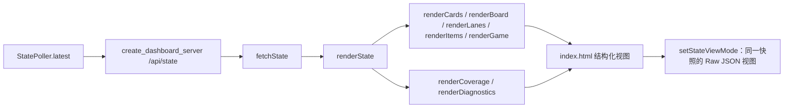

# Plan 3 — 草坪状态页结构与密度重设

## 1. Metadata

- Plan ID: P03
- Iteration: `004-game-state-observation`
- Status: Approved
- Depends on: P01 State 字段/中文 UI 映射及 `zombies[].row`、`distance_to_house_cells` 契约（格列标记仅在坐标校准可用时显示）；P02 页面导航和共享 /api/state 边界
- Requirement IDs: R4, R7, R13, R14

## 2. Goal

重整草坪状态页 /，让主要状态、卡槽和草坪在桌面一个视口内易于扫读，并把重复或次要详情放到紧凑的观察区。页面仍以共享 /api/state 为唯一事实源；结构化视图默认可读，Raw JSON 可切换查看。范围依据是用户在引用对话中的明确修改要求；随附图片仅作版式参考，不将图中文字或助手建议当作额外指令。

### Requirement Mapping

| Requirement ID | Outcome in this Plan | Acceptance signal |
|---|---|---|
| R4 | 重设草坪状态页的信息层级：移除醒目的“字段状态”面板，压缩卡槽，理顺草坪与逐行僵尸信息，保留所需 State 观察能力。精确 1672×941 无整页滚动作为 G2 版面风险。 | 浏览器确认指定内容、单一 State 来源和结构化/JSON 切换；目标视口仅记录为非阻塞风险，见 V08、V12。 |
| R7 | 植物与僵尸名称在 Web UI 显示中文；页面以文字为主，不使用植物光栅图片，简单图形可用 HTML/CSS 绘制。 | 已知英文类型标识显示对应中文，未知类型保留代码提示；页面没有植物图片资源或图片引用，见 V13。 |
| R13 | 当前 Dashboard 视觉设计由用户直接认可；不再要求归档参考图或给出相似度分数。 | 用户 2026-09-26 明确表示设计已认可并删除 V18；未来重新设计时再定义对照图与评分口径。 |
| R14 | 使用同一 State 样本中的僵尸行号和已校准 `distance_to_house_cells`，将标记吸附到草坪 0–8 列之一；格列只表示近似位置区间、不表示占据植物格。数据不可用/无效时保留逐行详情且不猜画。 | 固定样本核对 x=10/90/…/650 映射 0–8、边界切换和无效回退；校准可用时同帧核对画面与 State，见 V19。 |

## 3. Scope

### In scope

- 将顶部指标压成状态栏，优先保留阳光、波次、关卡、场景/模式、暂停/通关与连接/采样信号；植物数量可由草坪直接观察，不再占用同级大卡片。
- 将卡槽收为横向紧凑栏，显示槽位、中文植物名、费用与已知的就绪状态；未知值保持未知，不把原始冷却计数伪装成秒数。
- 让 5×9 草坪成为主要视觉区。逐行僵尸数量/距离与对应草坪行保持邻接；僵尸完整列表和 HP 分量放入可切换的详情区，避免草坪覆盖层和独立面板重复展示同一份长描述。
- 使用同一 State 样本的 `zombies[].row` 和整数 `zombies[].distance_to_house_cells` 将僵尸标记放到对应草坪行/列；标记按 0–8 列吸附，不表示僵尸占据或阻挡该植物格。
- 只有格距可用且为 0–8 整数时才显示标记；未校准、缺失或无效时保留逐行详情和 State 坐标，不在棋盘上猜位置。空格不重复显示“可种未知”。
- 移除主页当前独立的 FIELD COVERAGE/“字段状态”大面板，但保留 State 中 availability 与 evidence 字段；在次级结构化标签及完整 JSON 中仍可查看。原始 JSON 不作为底部常驻卡片。
- 提供结构化观察与只读 JSON 两种视图，默认结构化；两种视图使用同一份 /api/state 快照，不复制或重组事实源。保留 P02 的 /state 独立页面及同一标签页导航约定。
- 掉落物、游戏进度及采样诊断收进紧凑区域或详情标签；错误、断连和采样序号仍能辨认。
- 以随附参考图的 1672×941 内容视口、浏览器缩放 100% 作为 G1 版面基线：核心仪表盘不产生整页纵向滚动；可变长度的 JSON/详情允许在自身区域滚动。更小视口采用响应式布局，列入 G2。
- 当前视觉设计由用户直接认可；不再要求设计图归档或相似度评分。精确 1672×941 无滚动检查按 V12 作为 G2 风险记录。
- 使用文字与 HTML/CSS 简单图形；不新增植物光栅图片或其他外部视觉依赖。
- 页面继续从当前共享 State 获取动态数据，不增加采集频率或 HTTP API。

### Out of scope

- 从 State/API 删除 availability、evidence、植物/僵尸或其他字段；移除的是主页常驻面板，不是数据契约。
- 改动 State 采集/采样器、增加 API 或改变 P02 的 /state 独立页和导航行为。
- 未校准时在草坪格子绘制推测的僵尸位置；根据显示名推断未读到的游戏语义。
- 新增植物图片、外部图片资源、前端框架或依赖；实现自动动作与策略。
- 保证手机或小视口也能在单屏无滚动展示全部可变长度内容。

## 4. Impact Surface

### 4.1 File and Symbol Map

仓库检查确认主页结构与渲染分布在下列文件/符号。P03 只调整 Web 展示，不触碰状态采集与接口。

```text
dashboard/static/index.html
dashboard/static/app.js
dashboard/static/style.css
tests/test_web.py                (仅所涉入口/资源回归)
```

```text
File: dashboard/static/index.html
Symbols:
  summary-grid / content-grid — 顶部摘要及主次栏布局
  cards-list / board / zombie-layer / lane-list — 卡槽、草坪覆盖层和逐行僵尸详情容器
  items-list / game-details / missing-list / sample-diagnostics / raw-json — 掉落物、进度、字段覆盖、采样诊断与 JSON 视图容器
  page navigation — 保持指向 /state 的普通同标签页链接
```

```text
File: dashboard/static/app.js
Symbols:
  renderCards / renderBoard / zombiePositionsForState / renderLanes — 卡槽、植物棋盘及按同一 State 行号/校准格距吸附到对应列的僵尸标记
  renderItems / renderGame / renderCoverage / renderDiagnostics — 次级详情内容；将字段状态收进可切换标签
  renderState / fetchState — 用同一最新样本刷新页面并处理错误
  setStateViewMode — 计划新增的结构化/JSON 视图切换入口
```

```text
File: dashboard/static/style.css
Symbols:
  summary-grid / content-grid / cards-list / board / lawn-area / zombie-layer / zombie-marker / lane-list / raw-panel 样式 — 一屏优先布局、格列标记覆盖、窄屏响应式、详情内部滚动和视图切换
```

```text
File: tests/test_web.py
Symbols:
  DashboardHttpTests — 回归主页、静态资源及共享 API；补充页面控件、资源和名称呈现断言
```

### 4.2 End-to-End Flow



## 5. Decision

### 5.1 Open Decision

无未决 Open Decision。OD-03 已按用户 2026-09-25 确认的推荐 Option A 移入 Confirmed Decision；CD-04 是历史连续标记决定，已由 2026-09-26 的 CD-05 格列标记决定取代。

### 5.2 Confirmed Decision

#### OD-03 — 95% 视觉相似度的基准与口径

- Decision ID: OD-03
- Confirmed choice: 历史决定，已被 CD-06（2026-09-26）取代；当前 004 不再要求参考图归档或 95 分量表评分。
- Reference artifact: 历史参考图（仅保留为 OD-03 决策背景）；按 CD-06 不再要求归档，也不用于当前 004 验收。
- Source: 用户于 2026-09-25 明确表示采用推荐选项并批准整套 004 Plan。
- Date: 2026-09-25
- Reason: 保留历史批准记录；本次不再把历史视觉阈值作为当前交付条件。


#### CD-03 — 草坪状态主页的层级与内容

- Decision ID: CD-03
- Confirmed choice: 草坪状态页以紧凑的顶部状态栏、横向卡槽、主要草坪和次级观察区组织；移除常驻“字段状态”面板，按需保留 availability/evidence 与只读完整 JSON；草坪逐行威胁信息保持关联，植物/僵尸名称用中文，使用文字及代码绘制的简单图形，不加植物图片。
- Source: 用户在引用对话中的直接修改要求（移除字段状态、重新整理卡槽和草坪/僵尸详情、希望主要信息一屏容纳、植物和僵尸显示中文、删除植物图片并以文字为主）；本轮随附图用于版式参考。助手建议仅作为上下文，不作为单独需求。
- Date: 2026-09-25
- Reason: 让人工能快速读取与 JEV 相同的 State，同时保留必要诊断入口并降低重复信息占用。

#### CD-04 — 僵尸位置标记方式

- Decision ID: CD-04
- Confirmed choice: 历史决定为使用 `row`/`progress_to_house` 连续绘制且不吸附到九列；已被 CD-05 明确取代，不再作为当前实现验收基线。
- Source: 用户于 2026-09-25 选择“连续标记”，要求将此行为加入 P03 Task 并批准。
- Date: 2026-09-25
- Reason: 历史决定。用户于 2026-09-26 改选按格距列定位；本条不再是当前实现验收基线。

#### CD-05 — 按房屋侧格距显示僵尸列位置

- Decision ID: CD-05
- Confirmed choice: 删除 `progress_to_house`；主页保留像素距离并用整数 `distance_to_house_cells` 将僵尸标记吸附到 0–8 列，格距 0 为房屋侧列、8 为最远列。该格列是位置区间，不表示占据植物格。日间标准草坪按 P01 的 house_x=0、首列边界 X=50、列距80px 校准；其他布局 unavailable。
- Source: 用户于 2026-09-26 明确要求保留 `distance_to_house_px`、改为格子距离并删除 `progress_to_house`，随后批准修订；同场景截图/State 提供 9 个相隔80px 的僵尸 X 样本。
- Date: 2026-09-26
- Reason: 格列位置比归一化全程进度更直接回答“僵尸在哪个格子”，同时保留像素距离供更精细计算，且不谎称格子被占用。

#### CD-06 — 接受当前 Dashboard 设计

- Decision ID: CD-06
- Confirmed choice: 用户接受当前 Dashboard 设计；删除 OD-03/V18 的参考图归档和 95 分相似度评分要求。1672×941 精确无滚动检查保留为 G2 版面风险，不阻塞 004。
- Source: 用户 2026-09-26 明确表示设计已认可并要求删除 V18；同时要求非阻塞验证降级。
- Date: 2026-09-26
- Reason: 当前设计已由用户直接验收，定量视觉评分不再提供额外交付决策价值。

## 6. Task

验收意图写在对应 Plan 或 Validation 内容中，不再塞入每个 Task 重复记录。

### Task

- [x] T1 — 重排草坪状态主页
  - Objective: 用紧凑状态栏、单行卡槽、草坪主区和次级观察区呈现当前 State；保留单一数据来源、中文名称、结构化/JSON 切换和有证据支持的僵尸位置。
  - Execution hint:
    - Width: `standard`
    - Worker effort: `medium` (default)
    - Budget override: None; uses `sdd-implementation` defaults
  - Affected files:
    ```text
    Expected:
      dashboard/static/index.html
      dashboard/static/app.js
      dashboard/static/style.css
    Actual:
      dashboard/static/index.html
      dashboard/static/app.js
      dashboard/static/style.css
    ```
  - Implementation backfill:
    ```text
    Notes: 原始 JSON 视图使用的 hidden 状态现由显式 CSS 规则隐藏 dashboard-grid 与 raw-panel；test_web.py 增加回归断言并通过。V18 已按用户决定删除，V12 目标视口检查降为 G2，不影响本任务完成。
    Changed files:
      dashboard/static/index.html
      dashboard/static/app.js
      dashboard/static/style.css
    ```

- [x] T2 — 回归页面内容、视口和动态更新
  - Objective: 检查页面内容、状态视图切换、中文名称、无植物图片资源，以及主页与 P02 的导航/最新样本；用户已接受当前视觉设计，不再要求参考图或定量评分。精确 1672×941 无滚动测量为 G2。
  - Execution hint:
    - Width: `narrow`
    - Worker effort: `medium` (default)
    - Budget override: None; uses `sdd-implementation` defaults
  - Affected files:
    ```text
    Expected:
      tests/test_web.py
    Actual:
      tests/test_web.py
    ```
  - Implementation backfill:
    ```text
    Notes: 静态/HTTP 回归、JavaScript 语法、中文名称和页面资源边界检查通过；本轮浏览器检查主页状态及卡槽内容，用户接受当前 Dashboard 设计，V18 已移除。精确目标视口未测，V12 降为 G2，不阻塞当前范围。
    Changed files:
      tests/test_web.py
    ```

- [x] T3 — 按校准 State 显示僵尸所在格列
  - Objective: 复用同一 State 样本的 `zombies[].row` 与 0–8 `zombies[].distance_to_house_cells`，在对应草坪行/列显示离散标记；只有格距数据有效且可用时显示，未校准或无效时继续显示逐行详情并隐藏标记。
  - Execution hint:
    - Width: `standard`
    - Worker effort: `medium` (default)
    - Budget override: None; uses `sdd-implementation` defaults
  - Affected files:
    ```text
    Expected:
      dashboard/static/app.js
      dashboard/static/style.css
      dashboard/static/index.html
      tests/test_web.py
    Actual:
      dashboard/static/app.js
      dashboard/static/style.css
      dashboard/static/index.html
      tests/test_web.py
    ```
  - Implementation backfill:
    ```text
    Notes: 按 CD-05 将僵尸标记吸附至 0–8 格列；只有格距 available 且有效时显示。`test_web.py` 覆盖映射、边界、missing/unavailable 回退；用户同场景 State/截图确认 13 只僵尸的类型、行列与位置相符，主页 DOM 的格列标签一致。
    Changed files:
      dashboard/static/app.js
      dashboard/static/style.css
      dashboard/static/index.html
      tests/test_web.py
      .sdd/004-game-state-observation/plans/03-dashboard-reduction.md
    ```

Task 只用 checkbox 表示是否完成：`[ ]` 表示仍需继续，`[x]` 表示完成。Execution hint 只记录任务宽度、建议 effort 和经批准的预算覆盖；未覆盖时使用 `.agents/skills/sdd-implementation/references/orchestration.md` 的默认值。实现完成后只回填对应 Task 的 Implementation backfill；其他状态、验收、验证和阻塞信息不在 Task 内重复记录。验证统一写在第 7 部分，并使用 `T1`、`T2` 等 Task ID 关联。

## 7. Validation

### Traceability

| Check ID | Requirement ID | Task ID | Check | Tier and reason | Expected evidence | Delivery impact / escalation condition |
|---|---|---|---|---|---|---|
| V08 | R4 | T1, T2 | 检查同一 /api/state 样本驱动结构化与 Raw JSON 两种只读视图；字段状态卡移除但 availability/evidence 原值仍可从次级详情或 JSON 查到 | G1：主页不能复制或丢失 State 事实 | 浏览器 DOM/截图、JSON 与 API 快照逐值一致、字段入口和视图切换可用 | 两视图不一致、字段丢失或重新出现常驻字段状态大面板则阻塞 |
| V12 | R4 | T1, T2 | 在 1672×941 内容视口、100% 缩放检查首页布局及纵向滚动 | G2：当前设计已由用户认可，精确视口适配为后续版面风险 | 理想情况下核心状态栏、卡槽、草坪和次级观察入口同时可见；未测目标尺寸时如实记录，不阻塞当前 State 观察目标 | 若后续主要使用环境明确要求此尺寸，再升级为 G1 并实测 |
| V13 | R7 | T1, T2 | 检查植物/僵尸中文标签、未知类型回退和植物图片资源 | G1：UI 语言和文字优先为明确要求 | 已知类型中文名、未知类型及数字码、无新增光栅植物图片或图片请求 | 英文名称泄漏、未知值被猜译或出现植物图片资源则阻塞 |
| V19 | R14 | T3 | 用固定 State 样本检查 row 与 `distance_to_house_cells` 0–8 映射到对应行/列，以及 unavailable、缺失、超范围时隐藏覆盖并保留逐行详情；校准可用后同帧对照实机截图 | G1：用户要求直观看到僵尸所在格列，错误列位会误导人工 | X=10/90/…/650 分别映射格列0–8；X=49/50、129/130边界样本稳定；浏览器标记行/列与同一 State 一致；格位不宣称植物占用；未校准时无标记 | 行列错位、违反边界公式、将格位当植物占用或缺失时猜画均阻塞 |

V08、V13、V19 检查内容与 State 一致性。V12 精确视口检查为 G2，不作为当前交付门槛；用户已明确接受当前 Dashboard 设计，V18 与 R13 的数值评分要求已删除。P01 若未提供有效格距校准，V19 只验证位置不可用时不绘制、逐行详情仍可读；同帧实机列位对照须在 P01 V11 校准可用后完成。

### Commands

- 目标运行环境/浏览器检查（V12/G2）：`uv run python main.py serve`，理想情况下在 `http://127.0.0.1:8765/` 的 1672×941 内容视口、100% 缩放检查首页；目标尺寸未测不阻塞当前验收。按导航进入 `/state` 并返回，确认 P02 行为未变。
- 针对性测试（V08、V13）：`uv run python -m unittest discover -s tests -p "test_web.py"`。
- 针对性测试（V19）：`uv run python -m unittest discover -s tests -p "test_web.py"`；以固定 State 样本核对 X→格列映射、边界和 unavailable 回退。
- 静态检查（V08、V13、V19）：检查 HTML 视图控件、JS 单一快照渲染/格列映射和本地中文名称映射；确认无植物图片文件引用或外部图片请求。

### Implementation evidence

Implementation 阶段按 Task ID 回填实际执行的命令、结果和关键输出；这不是正式 `verify.md` 的替代。

- T1 — `uv run python -m unittest discover -s tests -p "test_web.py"`：6 tests passed。静态检查确认同源 /api/state、结构化/JSON 控件、次级 coverage 入口与 /state 导航；检查未发现图片元素/植物光栅引用或外部图片 URL。P01/P03 共用的 `dashboard/static/app.js` 运行 `node --check` 通过。
- T2 — `uv run python -m unittest discover -s tests -p "test_web.py"`：13 tests passed；`node --check dashboard/static/app.js` 与 `node --check dashboard/static/state-page.js` 通过。浏览器 DOM 确认中文卡牌名、已核验卡槽值、草坪占用和格列标记；同场景 State/截图由用户确认。设计已获用户认可，V18 已删除；V12 目标分辨率未测，作为 G2 保留。

- T3 / V19 — `uv run python -m unittest discover -s tests -p "test_web.py"`：13 tests passed；覆盖 0–8 格列映射、边界和 unavailable/缺失/越界隐藏。CUA DOM 显示 row0 九个格距标记及 row1 四个特殊僵尸位置，和同场景 JEV State 一致；全部标记声明不代表植物格占用。


- Parent browser acceptance — IAB DOM 检查确认结构化/JSON 视图切换、主页卡槽状态与最新 State 和僵尸格列标记；同标签 `/` ↔ `/state` 往返正常。1672×941 视口未测，V12 作为 G2；用户认可当前视觉设计，V18 已删除。

### Manual checks

- V08 — 在结构化与 JSON 模式检查同一采样序号及相同字段值；availability/evidence 可按需查看，但不占首页常驻大面板。
- V12/G2 — 目标尺寸 1672×941 未能实测；用户已认可当前视觉设计，记录为非阻塞版面风险，重新设计或主要使用环境改变时再核对。
- V13 — 检查本地已知植物和僵尸英文类型标识是否呈现中文；检查未知标识仍显示未知及类型码；确认 UI 使用文字/代码绘制图形而没有植物光栅素材。
- V19 — 用 X=10/90/…/650 固定样本核对 0–8 格列标记；注入 X=49/50、129/130 等边界、unavailable/缺失/超范围值确认列归属或安全隐藏，逐行详情始终保留。P01 V11 校准可用后，再用同帧 State 与游戏截图核对实机列位。


## 8. Risks

- 现有 `index.html` 的原始 JSON 已可展开查看，但用户明确要求 P02 为独立动态页面；不能因此取消 P02。
- 精确 1672×941 内容视口未测，现为 G2 非阻塞风险；若后续主要使用环境明确依赖单屏布局，再升级并实测。
- JSON、僵尸详情和僵尸数量可能随 State 增长；使用次级标签/内部滚动，避免它们把核心首页撑高。
- 僵尸在棋盘的精确位置依赖 P01 坐标校准；未通过校准时不得为视觉效果绘制假位置。
- 格列位置由 `distance_to_house_cells` 映射；未校准模式或无效格距必须隐藏标记并保留逐行详情，不得将该列位解释为植物占用或种植阻挡。
- 改动预计涉及 3 个前端文件及 1 个针对性测试文件，超过 1–3 文件的默认复杂度基线；原因是结构、渲染、布局和页面回归分属不同文件，无新依赖。

- 精确目标视口未测；按用户当前决定降为 G2，未来布局或使用环境变化时重查。
## 9. Approval

- Status: Approved
- Approved by: User
- Approval date: 2026-09-26
- Notes: 用户于 2026-09-25 批准整套 004 Plan；用户于 2026-09-26 批准 CD-05 距离格列标记并删除 `progress_to_house`。用户当前明确接受 Dashboard 设计并删除 V18/R13 数值评分；精确视口测量降为 G2。
