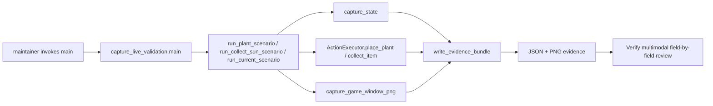

# Plan 4 — 实机 State 与画面交叉验证

## 1. Metadata

- Plan ID: P04
- Iteration: `004-game-state-observation`
- Status: Approved
- Depends on: P01 State 契约；003 已交付的 ActionExecutor；完成态截图在 P01–P03 实现后采集
- Requirement IDs: R10, R11, R12

## 2. Goal

提供一个由维护者显式启动的本机实机验证采集脚本，记录指定动作前后的 State、受支持游戏窗口截图和阳光收集结果。采集脚本不调用 LLM；脚本生成的 State/截图证据包交给 Verify 阶段做多模态核对，避免仅凭文字描述判断游戏 State 是否可信。

### Requirement Mapping

| Requirement ID | Outcome in this Plan | Acceptance signal |
|---|---|---|
| R10 | 使用同场景 State 与游戏截图核对可见植物类型和格子位置；Verify 阶段不要求实际发送种植输入 | 配对 State/截图中的植物、行列与格子占用对应；格子语义与 JEV contract 一致 |
| R11 | 阳光实机收集阈值结果暂不纳入 004 验收；采集脚本仍保留有界循环及其确定性回归测试 | G3 Deferred；未来确实需要证明收集效果时再恢复实机阈值检查 |
| R12 | 使用同场景的 State 与游戏截图核对可观察且稳定的字段 | 字段类型、数量、行列/格位与画面一致；明确忽略 items 列表 |

## 3. Scope

### In scope

- 在已运行且身份符合配置的 PvZ 1.0.0.1051 游戏中，采集脚本保留 plant、collect-sun 或 current 场景；当前交付使用用户提供的 State/截图核对可见事实，不要求 Verify 阶段发送游戏输入。
- plant 场景接受 1 基卡槽和 0 基行/列参数。先保存有效起始 State，要求指定格为空、卡槽存在且 cooldown_ready 为 true、cost 已知并且 sun_balance 足够；前提不满足时不发输入并记为 inconclusive。只调用一次现有 ActionExecutor.place_plant。动作返回后等待 1 秒，再保存 State 和游戏窗口 PNG 截图。
- collect-sun 场景仍实现 10 秒 deadline、安全阳光类型过滤及严格 >50 逻辑，且由确定性单测覆盖；用户决定不要求本次执行实机阳光收集，不把阈值结果当作 004 交付门槛。
- current 场景先保存 State、立即截取当前游戏窗口、再保存 State；证据包仅将截图前后相同且能从原生游戏画面辨认的字段交给 LLM 逐项核对。按用户要求完全忽略 items，不把新出现或消失的掉落物当作不匹配。
- 生成 JSON 证据记录和 PNG 截图；记录时间、目标进程/窗口身份摘要、动作结果、相关 State 投影和文件位置，不包含内存地址或完整 raw_snapshot。使用现有 Python/Windows 能力，不新增依赖、不接 LLM API。
- LLM 复核按“匹配 / 不匹配 / 截图不可见 / 样本期间变化”逐字段报告；只对画面可观察字段给结论，不从画面推断不可见字段。

### Out of scope

- 游戏启动、无人值守游玩、重复种植、自动选卡/选格、阳光策略、自动战斗或产品侧自动动作循环。
- 代替已有 ActionExecutor 执行输入；若对象 ID、坐标证据或目标窗口校验不通过，脚本必须保留拒绝结果并停止该对象的输入。
- 用 LLM API 自动上传数据、自动打分或自动批准 Verify；LLM 多模态审阅是后续 Verify 的证据判断步骤。
- 用 items 集合验证完成态截图；它会在运行期间自然改变。
- 以当前游戏截图替代 Dashboard 自身的 UI 检查；R13 当前设计已由用户直接认可，P03 精确视口仍独立记为 G2。

## 4. Impact Surface

### 4.1 File and Symbol Map

仓库已有 main.py snapshot、ActionExecutor.place_plant / collect_item、State 归一化和 Windows 目标窗口依赖；以下只新增验证工具及其确定性逻辑测试，并说明使用方法。

```text
tests/
  capture_live_validation.py (new)
  test_live_validation.py (new)
README.md
```

```text
File: tests/capture_live_validation.py
Module: tests.capture_live_validation
Symbols:
  main — 解析 plant / collect-sun / current 三种显式采集场景
  run_plant_scenario — 保存起始 State、执行一次种植、等待 1 秒并采集 after State/截图
  run_collect_sun_scenario — 在 10 秒 deadline 内逐个收集可安全定位的阳光物件并计算阳光差值
  run_current_scenario — 采集截图前后 State、稳定可见字段投影并忽略 items
  capture_game_window_png — 按已校验的游戏 HWND 保存窗口客户区截图
  write_evidence_bundle — 输出脱敏 JSON 元数据和对应 PNG 路径
```

```text
File: tests/test_live_validation.py
Module: tests.test_live_validation
Symbols:
  LiveValidationLogicTests — 用注入的 State/action/clock 输入检查严格大于 50 的门槛、10 秒截止、sun item 过滤、截图前后稳定字段以及 items 排除
```

```text
File: README.md
Symbols:
  实机验证说明 — 记录游戏前提、三个采集场景的调用参数、输出位置、inconclusive 条件与 LLM 复核步骤
```

### 4.2 End-to-End Flow



## 5. Decision

### 5.1 Open Decision

无阻塞性 Open Decision。种植目标由命令参数指定；阳光收集只使用当前 State 中可以安全定位的阳光类型。数据不足、运行环境不符或截图不可用时按本 Plan 记录为 inconclusive，不放宽判据。

### 5.2 Confirmed Decision

无新增 Confirmed Decision。

## 6. Task

验收意图写在对应 Plan 或 Validation 内容中，不再塞入每个 Task 重复记录。

### Task

- [x] T1 — 实现实机证据采集脚本
  - Objective: 以显式场景参数执行单次种植、最多 10 秒的阳光收集循环或当前态截图采集；每次输出 State、动作、时间戳和游戏截图证据。
  - Execution hint:
    - Width: `standard`
    - Worker effort: `medium` (default)
    - Budget override: None; uses sdd-implementation defaults
  - Affected files:
    ```text
    Expected:
      tests/capture_live_validation.py
    Actual:
      tests/capture_live_validation.py
    ```
  - Implementation backfill:
    ```text
    Notes: _state_copy 与最终 bundle sanitize 现递归过滤 module_base/root_address/board_address 和 raw_snapshot；回归测试验证这些字段和值不泄漏，同时保留 PID/profile，测试通过。未运行真实游戏动作；plant 场景保持 G2 可选，R11 的阳光实机阈值已按用户决定移出当前验收。
    Changed files:
      tests/capture_live_validation.py
    ```

- [x] T2 — 覆盖采集逻辑并记录操作说明
  - Objective: 对时间上限、严格阳光阈值、sun item 过滤、失败关闭及动态 items 排除做隔离测试；README 说明安全前提和 LLM 复核输出格式。
  - Execution hint:
    - Width: `narrow`
    - Worker effort: `medium` (default)
    - Budget override: None; uses sdd-implementation defaults
  - Affected files:
    ```text
    Expected:
      tests/test_live_validation.py
      README.md
    Actual:
      tests/test_live_validation.py
      README.md
    ```
  - Implementation backfill:
    ```text
    Notes: 13 个隔离测试覆盖种植只调用一次/1 秒等待、不就绪/未知格及实体结构/截图失败 fail closed；阳光循环覆盖安全过滤、截止和严格 >50 逻辑；current 忽略 items。README 记录三种显式调用与人工多模态复核。V15 实机动作是 G2 可选项；V16 阳光实机阈值已移出当前验收；V17 使用用户提供的 State/截图对照。
    Changed files:
      tests/test_live_validation.py
      README.md
    ```

Task 只用 checkbox 表示是否完成：`[ ]` 表示仍需继续，`[x]` 表示完成。Execution hint 只记录任务宽度、建议 effort 和经批准的预算覆盖；未覆盖时使用 .agents/skills/sdd-implementation/references/orchestration.md 的默认值。实现完成后只回填对应 Task 的 Implementation backfill；其他状态、验收、验证和阻塞信息不在 Task 内重复记录。验证统一写在第 7 部分，并使用 T1、T2 等 Task ID 关联。

## 7. Validation

### Traceability

| Check ID | Requirement ID | Task ID | Check | Tier and reason | Expected evidence | Delivery impact / escalation condition |
|---|---|---|---|---|---|---|
| V14 | R10, R12 | T2 | 注入固定 State/action/clock 运行采集逻辑边界测试：种植前提失败时不发输入、current 比较忽略 items 且只使用稳定字段；同时回归 collect-sun 的安全 deadline/阈值代码 | G1：采集逻辑不得伪造当前 State 的可信度 | `test_live_validation.py` 确定性断言；没有用户正在运行的游戏也可完成。阳光阈值只是工具逻辑回归，不是 R11 实机验收 | 输入前提失效仍发动作、current 把动态 items 当稳定差异或脚本清旧样本失败则阻塞 |
| V15 | R10 | T1 | 可选的真实种植动作及同一 HWND 截图采集 | G2：当前 State/截图配对已覆盖可见植物格子，实际动作验证是工具运行风险 | 若以后执行，JSON bundle 保留前后 State、ActionResult、等待时间及对应 PNG；当前不要求运行 | 若未来用户要求验证执行链路或实际部署使用该功能，再升级为 G1 |
| V17 | R12 | T1 | 核对用户提供的同场景 State 与游戏截图中的稳定可见字段 | G1：交叉核对当前 State 的真实可见事实 | 用户提供的 JEV State 和同场景 PNG；逐项核对游戏模式、植物/僵尸可见数量/类型/行列和格子位置，忽略 items。数值型 HP 不从像素推断，由 raw→State 单测覆盖 | 任一可见类型、数量、行列或格子不符则阻塞；截图不可见字段记为 not visible |

用户提供的 R10/R12 配对证据被明确认为来自同一游戏场景。脚本采集成功不等于多模态核对通过；R12 只对截图可见字段给结论，数值型 HP 不从图像推断。可选 plant 动作和实机阳光收集不属于当前 G1 验收。

### Commands

- 确定性测试（V14）：`uv run python -m unittest discover -s tests -p "test_live_validation.py"`。
- 实机种植采集（V15）：`uv run python tests/capture_live_validation.py plant --card-slot <1-based> --row <0-based> --col <0-based> --output-dir <evidence-dir>`。
- 当前游戏截图/State 采集工具（V17 的可选替代）：`uv run python tests/capture_live_validation.py current --output-dir <evidence-dir>`。

### Implementation evidence

Implementation 阶段按 Task ID 回填实际执行的命令、结果和关键输出；这不是正式 verify.md 的替代。

- T1 — `uv run python tests/capture_live_validation.py --help` 成功显示三个显式场景；`uv run python -m py_compile tests/capture_live_validation.py` 通过。脚本不启动游戏；实机动作、窗口截图和证据多模态判读未执行。
- T2 — `uv run python -m unittest discover -s tests -p "test_live_validation.py"`：13 tests passed；用注入 clock/sleeper 覆盖安全输入前提、阳光过滤与 deadline、严格阈值和 items 排除。README 已加入三种工具调用说明。实机 sun threshold 已按用户裁定移出验收，V15 实机种植为 G2。

- Parent acceptance — `uv run python -m unittest discover -s tests -p "test_*.py"`：64 tests passed；JavaScript/Python syntax、`git diff --check` 通过。用户配对的 State/截图用于 V17 可见字段核对；V15 真实种植动作仍为 G2，V16 已移出验收。

### Manual checks

- V15/G2 — 如用户要求运行真实种植采集，先检查卡槽冷却/费用、目标空格和目标 HWND 前提；只发一次输入，等待 1 秒后核对 after State 与同窗口截图。
- V17 — 对同场景用户提供的 State/截图逐项核对模式、可见实体数量/类型/行列及植物格子；忽略 items，图像不可见字段不得推断。

### Multimodal review record

Verify 阶段对每个相关字段保存四列：State 值、截图观察、结论（match / mismatch / not visible / sample changed）、截图区域或理由。结论不得只给总评；R10/R12 只有核心可见字段全部 match 且没有 mismatch 才通过。该人工判读不由采集脚本自动调用模型。

## 8. Risks

- 当前掉落物类型及位置可能仍为 candidate；ActionExecutor 对含糊坐标会拒绝输入。此时保留证据并报告 inconclusive，不能绕过安全检查。
- 10 秒内背景也可能出现其他阳光来源；应在没有其他玩家操作、自动收集或日照来源的受控场景执行，否则阳光增量不能归因于循环收集。
- 实机画面在 State 采样间仍可能变化；current 场景用截图前后样本识别变化，无法稳定关联的字段不计作通过或失败。
- 游戏窗口可能被遮挡、最小化或无法正确读回像素；截图无法确认对应活动窗口时不得以旧图或 Dashboard 截图代替。
- 执行 plant 和 collect-sun 会改变当前游戏。调用者需要指定一个空格和现成阳光物件；脚本不得额外清理植物或处理非阳光物件。
- 预计新增脚本和针对性测试并更新 README；使用仓库现有依赖，不新增包或 API。

## 9. Approval

- Status: Approved
- Approved by: User
- Approval date: 2026-09-25
- Notes: 用户于 2026-09-25 批准整套 004 Plan，P04 获批。本 Plan 仅用于显式运行的实机验证证据采集，不是自动游玩功能。
