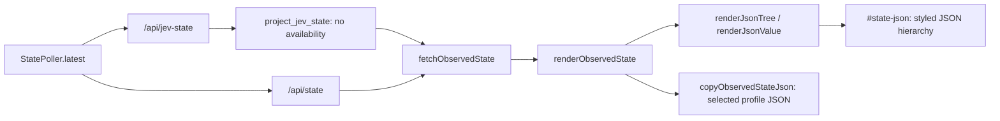

# Plan 5 — JEV 字段边界与 State JSON 树形展示

## 1. Metadata

- Plan ID: P05
- Iteration: `004-game-state-observation`
- Status: Approved
- Depends on: P01/T4 的 JEV 投影与 P02/T3 的 State 页面/profile 切换
- Requirement IDs: R15, R16

## 2. Goal

修订 JEV State 的诊断字段边界，并改善 `/state` 的 JSON 可读性。JEV State 不再输出顶层 `availability`，All State 继续保留完整可用性诊断；页面保留所选 profile 的原始 JSON 层级、键名和数据值，通过可折叠树与语法颜色提升阅读体验。复制内容仍是当前 profile 的 JSON 数据，不包含页面样式或辅助标记。

### Requirement Mapping

| Requirement ID | Outcome in this Plan | Acceptance signal |
|---|---|---|
| R15 | 从 JEV State 投影移除顶层 `availability`；All State 原样保留；JEV 未获取值仍为 `null`。 | JEV API/CLI 和投影结果不包含 `availability`；同一输入的 All State 深度等价且保留原 availability；现有双 profile 仍来自同一样本。 |
| R16 | `/state` 将选中 profile 的 JSON 原层级渲染为带语法样式的可折叠树。 | 页面结构、字段顺序和数据值与选中 API 对应；对象/数组可展开折叠；采样刷新后同一路径的展开状态保留；复制后解析所得对象与 API 完全一致；JEV/All、错误清旧样本和导航行为保持正常。 |

## 3. Scope

### In scope

- 仅从 `project_jev_state` 返回对象中去除顶层 `availability`。All State、`/api/state`、默认 All CLI profile 及草坪主页所用 State 不变。
- JEV State 其他字段保持既有 allowlist、值和次序；数据未获取时继续以 `null` 表达，不新增第二套可用性标记，也不据此改变 `decision_ready`。
- `/state` 继续默认查看 JEV State、可切换 All State、共享当前采样器、显示连接/错误/采样信息，并复制当前选中 profile 的 JSON。
- 将 JSON 文本区展示为 JSON 层级树，根对象默认展开；对象/数组使用可访问的原生展开折叠控件，键、字符串、数字、布尔值和 null 使用有区分度的语法颜色。保留原始键名、顺序、嵌套和数值，不转成业务卡片或表格。
- 页面持续轮询时，以 profile 和 JSON 路径保存对象/数组的展开状态；结构仍存在的路径在新样本重绘后继续保持展开或折叠，profile 切换恢复各自状态。
- 用 DOM 节点和文本 API 渲染 JSON 值，不把 State 内容作为 HTML 解释；错误、无效状态和 profile 切换期间继续清空旧树并禁用复制。
- 更新 State 契约文档和使用说明，明确 `availability` 只在 All State 中提供。
- 不增加依赖；样式沿用当前页面体系，并参考用户给出的浏览器 JSON 树截图，不要求逐像素复刻。

### Out of scope

- 不删除 All State 中的 `availability`、`evidence`、`errors` 或其他诊断字段；不修改 `/api/state`、StatePoller、草坪主页字段状态面板或主页 JSON 展示。
- 不删除 `decision_ready`、`status` 或其他 JEV 字段；不改变 cooldown、usable、sun 或植物/僵尸数据语义。
- 不把 State 改造成业务摘要卡片，不翻译 JSON 机器值，不改变选中 profile 的 API 路由、默认值、导航和轮询频率。
- 不引入前端框架、第三方语法高亮库或远端资源；不替代 P03 的唯一 Dashboard 设计基准，也不替代其 95/100 评分验收。

## 4. Impact Surface

### 4.1 File and Symbol Map

```text
state/projection.py
dashboard/static/state.html
dashboard/static/state-page.js
dashboard/static/style.css
tests/test_state.py
tests/test_web.py
docs/architecture.md
docs/memory-map.md
README.md
```

```text
File: state/projection.py
Module: state.projection
Symbols:
  project_jev_state — 从 JSON-ready All State 样本构造固定 JEV allowlist；移除 JEV 顶层 availability
```

```text
File: dashboard/static/state.html
Symbols:
  #state-json — 承载原层级 JSON 树的页面容器；保持页面标题、profile 控件、状态栏和复制入口
```

```text
File: dashboard/static/state-page.js
Symbols:
  renderObservedState — 更新采样元信息、错误状态、JSON 树和复制数据
  renderJsonTree / renderJsonValue — 将 API 对象按原层级渲染为安全、可折叠的 DOM
  expandedPathsByProfile — 按 profile 保存展开状态，并在轮询重绘后恢复仍存在的路径
  fetchObservedState — 按当前 profile 请求对应 API 并清除旧样本
  copyObservedStateJson — 复制当前 profile 的原 JSON 序列化结果
```

```text
File: dashboard/static/style.css
Symbols:
  .json-observer / .json-tree — State 页 JSON 等宽布局、折叠控件与值类型语法颜色
```

```text
File: tests/test_state.py
Symbols:
  StateBuilderTests — 断言 JEV 投影不含 availability，All State 保留其原诊断映射
```

```text
File: tests/test_web.py
Symbols:
  DashboardHttpTests — 检查 State 页树容器与现有路由/profile 入口
  state-page.js DOM harness — 检查渲染层级、profile 对应复制、错误清理及文本安全
```

```text
File: docs/architecture.md, docs/memory-map.md, README.md
Symbols:
  State/profile 契约说明 — 说明 JEV 不含 availability、All State 保留诊断以及 JSON 树与复制行为
```

### 4.2 End-to-End Flow



## 5. Decision

### 5.1 Open Decision

无阻塞性产品选择。用户已确定字段边界与视觉方向；具体色值沿用本地样式、保证可读即可，不作像素级复刻。

### 5.2 Confirmed Decision

#### CD-06 — JEV State 移除字段可用性诊断

- Decision ID: CD-06
- Confirmed choice: JEV State 不输出顶层 `availability`；All State 保留该字段及原诊断契约。页面连接状态徽标不属于 JSON 的 `availability` 字段，继续显示。
- Source: 用户 2026-09-26 明确要求“把 availability 从 jev state 中取出来，它不适合给 JEV 模型”。
- Date: 2026-09-26
- Reason: 将字段级诊断信息留在人工/All State 观察视图，不送入 JEV 模型；JEV 对未获取值仍读取 null。

#### CD-07 — 保留原 JSON 层级并增加树形样式

- Decision ID: CD-07
- Confirmed choice: `/state` 保留选中 profile 的原 JSON 数据结构，采用可折叠对象/数组和语法颜色提升可读性；复制操作仍对应原 JSON 数据。
- Source: 用户 2026-09-26 明确要求“还是原始结构，但有一些样式”，并提供 JSON 树形预览截图作样式示例。
- Date: 2026-09-26
- Reason: 允许人工检查完整 State 字段，同时更易浏览大型嵌套对象；不把视觉容器误作数据结构变化。

## 6. Task

验收意图写在对应 Plan 或 Validation 内容中，不再塞入每个 Task 重复记录。

### Task

- [x] T1 — 收敛 JEV profile 诊断字段并同步契约说明
  - Objective: 从 JEV API/CLI projection 中移除顶层 `availability`，保持 All State 与其他 JEV allowlist 字段不变；测试和文档反映 CD-06。
  - Execution hint:
    - Width: `standard`
    - Worker effort: `medium` (default)
    - Budget override: None; uses `sdd-implementation` defaults
  - Affected files:
    ```text
    Expected:
      state/projection.py
      tests/test_state.py
      docs/architecture.md
      docs/memory-map.md
      README.md
    Actual:
      state/projection.py
      tests/test_state.py
      docs/architecture.md
      docs/memory-map.md
      README.md
    ```
  - Implementation backfill:
    ```text
    Notes: 2026-09-26 完成，执行路径为用户明确要求的 direct-task（不是正式 `$sdd-implementation`）。JEV 投影不再输出顶层 availability；All State 仍保留原 availability/diagnostics，其他 allowlist 字段和值保持不变。README、架构与 memory-map 契约说明已同步。`test_state.py` 24 项通过；当前 CLI/API 快照确认 JEV 无 availability、All State 有 availability，两个 profile 仍来自同一采样。
    Changed files:
      state/projection.py
      tests/test_state.py
      docs/architecture.md
      docs/memory-map.md
      README.md
    ```

- [x] T2 — 将 State JSON 文本改为可折叠树形展示
  - Objective: 为 `/state` 添加保留 JSON 层级的安全树形渲染和样式；按 profile/path 保持轮询刷新前后的展开状态；保持错误清理、采样信息与准确复制行为。
  - Execution hint:
    - Width: `standard`
    - Worker effort: `medium` (default)
    - Budget override: None; uses `sdd-implementation` defaults
  - Affected files:
    ```text
    Expected:
      dashboard/static/state.html
      dashboard/static/state-page.js
      dashboard/static/style.css
      tests/test_web.py
    Actual:
      dashboard/static/state.html
      dashboard/static/state-page.js
      dashboard/static/style.css
      tests/test_web.py
    ```
  - Implementation backfill:
    ```text
    Notes: 2026-09-26 完成，执行路径为用户明确要求的 direct-task（不是正式 `$sdd-implementation`）。页面用安全 DOM 文本节点渲染带语法颜色的 JSON 树，按 profile/path 保存展开状态；保留 JEV/All 切换、采样与错误清理，复制仍序列化所选 API 对象。`test_web.py` 12 项通过；浏览器临时端口检查了默认 JEV、All State 保留 availability、卡牌树展开跨轮询及 profile 往返恢复；HTML 特殊字符串按文本显示。V29 大型 All State 性能 G2 未运行。
    Changed files:
      dashboard/static/state.html
      dashboard/static/state-page.js
      dashboard/static/style.css
      tests/test_web.py
    ```

## 7. Validation

### Traceability

| Check ID | Requirement ID | Task ID | Check | Tier and reason | Expected evidence | Delivery impact / escalation condition |
|---|---|---|---|---|---|---|
| V25 | R15 | T1 | 对同一 All State 样本投影，核对 JEV 无 availability、All 仍保留且其他值不变；检查 JEV CLI/API 输出 | G1：决定 JEV 输入契约与诊断隔离 | 投影/CLI/API 的 JEV JSON 不含 `availability`；All State 与投影输入深度相等且仍含原 availability；sequence/time 同样本 | JEV 仍泄漏 availability、All 丢字段、其他 allowlist 值变化或双 profile 样本不一致则阻塞 |
| V26 | R16 | T2 | 用含对象、数组、字符串、数字、布尔和 null 的样本渲染 JSON 树；展开/折叠并应用新样本后检查文本层级和复制结果 | G1：树形样式与 500ms 轮询不得改变原 JSON 结构、复制内容或打断阅读 | DOM 按原 key 次序和深度展示；各类型有语法样式；仍存在的路径保留展开状态；复制后 JSON 与当前 profile API 对象深度相等 | 字段漏显/篡改、profile 混用、复制含 UI 标记、每次刷新重置阅读位置或展开/折叠损坏数据则阻塞 |
| V27 | R16 | T2 | 浏览器检查 JEV 默认与 All 切换、错误时清树及复制禁用，检查样式和同标签页导航 | G1：用户要求的是可用 State 页面，而非单独样式表 | 截图/DOM 可见根层级和折叠对象；键和值颜色可区分；默认 JEV、不显示 availability；All 显示完整原字段；profile 切换与轮询不丢失当前展开路径；错误/复制/导航正确 | 默认 profile 错误、旧快照伪装新样本或树结构/页面行为破坏则阻塞 |
| V28 | R16 | T2 | 对含 HTML 特殊字符的 State 字符串运行渲染 harness | G1：State 原始内容不得成为可执行 HTML | 字符内容以文本显示，未创建注入元素；复制 JSON 仍包含原字符串 | State 内容被解释为 HTML 或复制改变原值则阻塞 |
| V29 | R16 | T2 | 在较大 All State 样本下观察树生成和轮询更新响应 | G2：All State 比 JEV 大，渲染耗时可能影响观察体验 | 页面仍能刷新/切换，用户可折叠大数组；记录明显卡顿或内存增长 | 若阻止连续样本更新、造成 stale 快照或无法交互则升级 G1 |

G1 最小充分证据是 V25 的 projection/API 单样本对照、V26/V28 的 DOM harness 与选择性复制/文本安全回归，以及 V27 的浏览器树形展开、JEV/All 切换、错误清理和页面视觉检查。V29 为 G2，仅在大样本实际阻塞刷新或交互时升级。

### Commands

- V25 — `uv run python -m unittest discover -s tests -p "test_state.py"`
- V25 — `uv run python main.py snapshot --once --profile jev` 与 `uv run python main.py snapshot --once --profile all`；运行目标游戏并比较同一构建的输出字段；HTTP profile 同样本由 `test_web.py` 的共享 poller 测试覆盖。
- V26/V27/V28 — `uv run python -m unittest discover -s tests -p "test_web.py"`
- V27 — `node --check dashboard/static/state-page.js`；启动本地服务后在浏览器执行 profile/展开折叠/复制/导航观察。
- V25–V28 — `git diff --check`。

### Implementation evidence

Implementation 阶段按 Task ID 回填实际执行的命令、结果和关键输出；这不是正式 `verify.md` 的替代。

### Manual checks

- V27 — 打开 `/state`，确认 JEV 默认状态以根对象与可折叠 JSON 节点显示；展开/折叠复杂对象和数组，等待至少两次新序号后确认展开状态保持，再切换 All State；检查 All 中保留 `availability`，复制内容与对应 API JSON 相等。
- V27 — 触发可控 API 错误或使用错误态测试 fixture，确认旧 JSON 树消失、复制按钮禁用、错误提示仍清楚；从 `/` 与 `/state` 通过普通链接在同一 tab 往返。
- V27/V28 — 用浏览器检查类似用户截图的键/值类型着色；把 `<script>` 等字符串作为纯数据输入，页面只显示字符、不创建脚本元素；不用真实游戏动作制造测试数据。
- V18 remains independent — P03 设计图评分仍需唯一参考图与 1672×941 截图；本计划给出的 JSON 页面截图不替代该基准。

## 8. Risks

- 移除 JEV `availability` 后，JEV 只通过 null 看到“没有值”，不能区分尚未读取、暂不支持和读取错误；符合用户决定。All State 与 `/state` 的 profile 切换仍提供人工诊断路径，不对其他诊断层作额外改动。
- JSON 树若通过 `innerHTML` 渲染 State 字符串会产生注入风险；Task 明确使用安全文本节点并以含特殊字符的测试覆盖。
- All State 包含 `raw_snapshot` 等较大嵌套结构，整棵树展开可能难读或渲染变慢；使用原生折叠、限制横向溢出并记录 G2，若影响刷新/交互则升级 G1。
- 页面每 500ms 刷新一次；若每次刷新都重置树展开状态，用户无法检查字段。Implementation 应按 profile/path 保留展开状态并由 V26/V27 验证。
- 当前同一 `style.css` 还服务草坪主页；选择器必须限定在 `.state-page` / `.json-observer`，不得意外重排 P03 首页。
- 本 Plan 跨越 projection、页面渲染、测试和契约文档共 9 个现存文件，超过默认 1–3 文件基线；原因是 JEV 字段契约、JSON 展示、复制行为和文档需保持一致，不引入新依赖或抽象。

## 9. Approval

- Status: Approved
- Approved by: User
- Approval date: 2026-09-26
- Notes: 用户于 2026-09-26 明确批准 Plan-05；按本 Plan 执行，未新增依赖。用户后续明确选择 direct-task 实现路径，不代表正式 SDD Implementation backfill 或 Verify。
