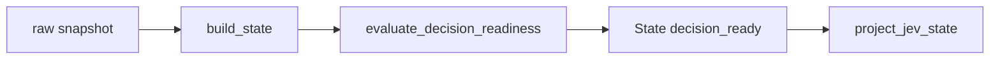

# Plan P01 — decision_ready gate

## 1. Metadata

- Plan ID: P01
- Iteration: 006-jev-runtime-loop
- Status: Approved
- Depends on: None
- Requirement IDs: R1

## 2. Goal

为现有 State 的 decision_ready 建立明确、可测试的准入规则，使 Runtime Loop 只在有效、受支持且含有必要决策数据的进行中对局调用 JEV。用户给出的 jev_eligible 表达式是必要准入条件；规则还按已确认的 OD-02 检查 required field 证据。使用 All State 的字段证据，不新增诊断数据泄漏到 JEV projection。

### Requirement Mapping

| Requirement ID | Outcome in this Plan | Acceptance signal |
|---|---|---|
| R1 | decision_ready 必须先满足用户定义的 jev_eligible 表达式，再满足 OD-02 确认的 required field 证据规则。 | 表达式任一条件为 false 时不准入；满足表达式但必需域 error/unavailable 或结构不合规时也不准入；JEV projection 保留最终布尔值。 |

## 3. Scope

### In scope

- 将用户指定的表达式作为 jev_eligible 必要条件，字段路径按 State 语义解释：
  ```python
  jev_eligible =
      state.valid
      and state.status == "ok"
      and state.game.phase == "playing"
      and not state.game.paused
      and state.board.cells is not None
      and state.cards is not None
      and state.zombies is not None
      and state.items is not None
  ```
- decision_ready 只有在 jev_eligible 为 true、且 OD-02 的 required field evidence 规则通过时才为 true。required fields 至少覆盖 game.phase/mode/background/paused、sun_balance、board.occupancy、cards、cards.cost、cards.cooldown_ready、cards.usable、plants、zombies、zombies.hp、zombies.distance_to_house_cells、lanes.nearest_zombie_distance_to_house_cells、items、items.type 和 items.position；JEV 值还须符合现有 5×9 board.cells、卡牌、实体和坐标结构。
- provisional 值还必须通过对应字段的结构/值检查；未知模式、不支持棋盘和缺少必要证据时 false。unavailable/error 必须 false。
- 空数组可在其域有可接受证据时表示当前没有实体；与 null/缺域区分。
- false 仍由现有 availability、missing_fields 和 errors 提供诊断依据；不扩展 JEV allowlist 或新增说明字段。

### Out of scope

- 将 decision_ready 等同于“JEV 一定会有非 wait 决定”或“任一具体动作必然通过 Boundary”。
- 在此 Plan 修改 JEV projection 字段、各域字段来源/内存偏移或既有 evidence 等级。
- 未覆盖模式的通用推测；没有证据的布局保持 false。

## 4. Impact Surface

### 4.1 File and Symbol Map

```text
state/
  builder.py
tests/
  test_state.py
docs/
  architecture.md
```

```text
File: state/builder.py
Module: All State 构造和保守字段派生
Symbols:
  _unavailable_record — 连接不可用时构造 false-ready 快照
  build_state — 从原始快照构造版本化 State
  capture_state — 采集实际样本并调用 State 构造
  evaluate_decision_readiness — 新增，集中判定 required fields 与 admission 条件
```

```text
File: tests/test_state.py
Module: 固定输入的 State 契约回归
Symbols:
  StateBuilderTests — 覆盖有效、缺失、错误和场景变化下的 ready gate
```

```text
File: docs/architecture.md
Module: 已实现 State / JEV 投影契约说明
Symbols:
  State contract — 记录 ready 的含义及不代表动作授权的边界
```

### 4.2 End-to-End Flow



## 5. Decision

### 5.1 Open Decision

- None.

### 5.2 Confirmed Decision

#### Confirmed Decision Record — OD-02

- Decision ID: OD-02
- Confirmed choice: required field 可用 available 或 provisional 准入；provisional 仍须通过字段结构/值校验；unavailable/error 不准入。
- Source: 用户在本次 Plan 执行中选择“允许合规的 provisional”。
- Date: 2026-09-27
- Reason: 与现有 State evidence 分级及 ActionBoundary 对 provisional 输入的既有支持一致；保留必需字段和结构校验。

## 6. Task

### Task

- [x] T1 — 实现并说明可验证的 decision_ready gate
  - Objective: 按用户给出的 jev_eligible 表达式判断基础准入，再应用 OD-02 的 available/provisional 证据规则；缺失/error/unavailable 或结构不合规时 fail-closed。
  - Affected files:
    ```text
    Expected:
      state/builder.py
      tests/test_state.py
      docs/architecture.md
    Actual:
      state/builder.py
      tests/test_state.py
      docs/architecture.md
    ```
  - Implementation backfill:
    ```text
    Notes: 新增 evaluate_decision_readiness 并在 build_state 完成后计算 gate。显式校验用户给出的有效/状态/阶段/暂停/非空字段条件、required availability 仅接受 available/provisional、day lawn JEV 5×9 投影及 cards/plants/zombies/lanes/items 结构；保留证据有效的空数组，错误/缺失/unsupported mode 或 board fail closed。JEV projection schema 未改变。
    Changed files:
      state/builder.py
      tests/test_state.py
      docs/architecture.md
    ```

## 7. Validation

### Traceability

| Check ID | Requirement ID | Task ID | Check | Tier and reason | Expected evidence | Delivery impact / escalation condition |
|---|---|---|---|---|---|---|
| V01 | R1 | T1 | State builder readiness matrix：逐项翻转 jev_eligible 中的 valid/status/phase/paused/board.cells/cards/zombies/items 条件，并覆盖 missing/error required domain、valid empty entities、available/provisional evidence。 | G1：Admission 直接决定 API 是否被调用。 | 固定 State 输入下每个条件的精确布尔结果；表达式任一条件不满足时不准入；All/JEV 同 sample 的最终 readiness 一致。 | 任一表达式条件不满足仍准入、或 required domain evidence 不满足 OD-02 时错误准入，阻塞交付。 |
| V02 | R1 | T1 | uv run python -m unittest discover -s tests -p "test_state.py" | G1：针对 State schema 的最小回归命令。 | 所有 State tests 通过，既有 All State 与 JEV projection 契约不回归。 | 失败阻塞交付。 |

### Commands

- V02 针对性测试：uv run python -m unittest discover -s tests -p "test_state.py"
- 全量回归（最终集成后）：uv run python -m unittest discover -s tests -p "test_*.py"

### Implementation evidence

Implementation evidence:

- V01：增加完整 provisional 对局准入、用户列出的基础条件逐项拒绝、每个 required availability 的 unavailable/error 拒绝，以及损坏投影/unsupported mode/background/lanes 拒绝检查。
- V02：`uv run python -m unittest discover -s tests -p "test_state.py"` — 28 tests passed。

### Manual checks

- 无单独现场检查；V07 覆盖真实运行时是否按此 gate 准入。

## 8. Risks

- valid 与 status 都必须按用户表达式检查；valid=true 单独不足以准入，status 也必须等于 ok。
- items=[]、zombies=[] 等有证据的空数组可以是完整观测，不能因“没有实体”本身误判不可决策。
- JEV projection 不包含 availability；因此必须在 All State 构造时先作准入判定并投影同一结果，不能在 Client 侧猜测证据等级。
- jev_eligible 表达式是必需条件，但不是唯一条件；P01 还要明确 required evidence keys、数组/board 结构及 supported mode，且不得笼统接受任意 provisional。

## 9. Approval

- Status: Approved
- Approved by: Human
- Approval date: 2026-09-27
- Notes: Human 明确批准 P01 与 Iteration 006。
