# Plan P02 — JEV API 接入

## 1. Metadata

- Plan ID: P02
- Iteration: 006-jev-runtime-loop
- Status: Approved
- Depends on: None
- Requirement IDs: R2、R6、R7

> P03 整合边界（2026-09-27）：本文件记录已实现的同步 SDK、全局 Router/Action 与目录基线。当前 P03 修订负责 AsyncTypeSafeClient、分支局部 questions、依赖 stage 与请求预算；本文件旧全局 Router 固定格式和每轮请求数不约束异步版。新增接口/criteria 与验证归 P03/T4、T5，不将旧 P02 通过证据当作异步接口通过。

## 2. Goal

使用 TypeSafe 官方 Python SDK 实现两层 JEV 决策：Action Router 在一次请求内用 3 个 Noul 表达可同时成立的候选意图，再用一个 Choice 选唯一下一动作；只有选中非-wait intent 时才发一个 collect/plant/shovel 专项 JEV Action 请求，以 typed Choice 选择具体目标。Plant/Zombie 英文目录补充决策所需机制知识，不修改现有 JEV projection schema。所有游戏动作都来自 JEV 决策链，不由采样或 housekeeping 自动触发。

### Requirement Mapping

| Requirement ID | Outcome in this Plan | Acceptance signal |
|---|---|---|
| R2 | 用 TypeSafeClient.system_one 发送 Router（3 Noul + next_action Choice），再按 intent 触发一个专项 Action request；答案按 typed values 校验后才映射到 ActionBoundary。Noul candidate、Router Choice confidence 与 Action Choice confidence 各有独立 .env 配置。Plan 同时给出各一个 Decision 与 Action 的模拟 typed input/output。 | next_action 只能选一个 intent；Router 候选与 Choice 不一致、对应门槛未过、专项参数缺失或 SDK 错误均不形成动作；两组示例能看出两次请求如何衔接。 |
| R6 | 为 PLANTS 中每种植物维护英文 description_en，并在 Plant Action 的 plant_type Choice.criteria 中使用对应描述。 | 当前 49 个 PlantInfo 均有非空描述；当前可选卡牌的 criteria key 与 type_name 一一对应，说明文本为英文。 |
| R7 | 为所有已知僵尸类型维护英文能力描述，并只把当前样本出现的 zombie descriptions 添加到 TypeSafe request context。 | 已知类型描述齐全；每个 Router/Action request 只附上本样本实际出现的类型，不向 project_jev_state 增加字段。 |

## 3. Scope

### In scope

- 在项目 pyproject.toml 增加已获准的 typesafe-sdk 与 python-dotenv 并更新 uv.lock；入口先 load_dotenv(override=False)，再创建 TypeSafeClient。SDK 使用 TYPESAFE_API_KEY/Bearer 与默认 base URL，显式请求 jev-latest；HTTP_PROXY / HTTPS_PROXY 从 .env 注入后验证 SDK transport 确实经代理访问。
- build_typesafe_state 从同 sample 的 project_jev_state 生成 TypeSafe state envelope；只加入当前 card/zombie types 的目录说明，不发送 All State、raw memory、PID/HWND、availability/evidence 或 Key，不改原 JEV projection。
- Action Router questions 固定包含 should_collect、should_plant、should_shovel 三个 Noul，以及 next_action Choice（wait/collect/plant/shovel）。Noul 与 Choice 并行看同一 State；三个 Noul 可同时表示有多个候选，但 next_action 每轮只选择一个立即动作。
- Noul 概率达到独立配置的 `JEV_NOUL_CANDIDATE_THRESHOLD` 才标记 candidate；响应后校验 next_action：wait 直接结束；非-wait intent 必须对应 candidate，否则 effective_action=wait。Router Choice confidence 使用 `JEV_ROUTER_CONFIDENCE_THRESHOLD`，专项 Action Choice confidence 使用 `JEV_ACTION_CONFIDENCE_THRESHOLD`；三项配置独立、各自默认 0.6。
- 按 Router 的唯一 non-wait intent 最多发一个专项 JEV Action request：collect 用 Choice 选当前 items 中的 item index；plant 用 plant_type Choice 和 available cell Choice；shovel 用 Choice 选有植物的 row/col cell。Action JEV 也只返回定义过的 Choice，不输出屏幕坐标或自由文本。
- Plant catalog 对 PLANTS 的全部 49 项新增 description_en，文字为简洁英文，说明用途/关键机制/必要放置条件；植物描述以 PvZ 原版 Almanac 为事实来源，criteria 使用当前卡组植物的目录描述，不重复推测 cost/cooldown/usable。
- Zombie catalog 对现有 34 种 zombie type 增加 description_en，英文概述其特殊移动、护具或攻击机制。每次 TypeSafe request 只附当前 State 中出现的 unique types；unknown/custom 类型缺目录项时明确无描述，不编造能力。
- Plant Action 用 Choice criteria 将当前 usable cards 的 type_name 映射到 PlantInfo.description_en，并用 cell Choice 选择 board.cells 为 null 的格；Collect Action 用 item index Choice 映射回同样本中 type_code/type_name/x/y；Shovel Action 只选择有植物的 cell，保持现有 cell-level shovel 语义。
- 每轮 Router 固定一个请求；若选择 non-wait，再发一个对应 Action 请求，最多两次 TypeSafe calls、最多一个 ActionBoundary dispatch。所有 Action answers 基于 Router 同 sample，Executor 仍执行实时安全检查。
- State capture 和 items/坐标出现本身没有动作副作用；程序没有自动收集或自动种植/铲除路径。每个点击都必须有 Router intent、对应 Action answer 和 ActionBoundary。
- SDK timeout、认证错误、限流/服务错误、Noul/Choice 不一致、低置信度、缺参数及未知选项都不返回动作；SDK timeout/retry 设置为有界值，错误摘要不得包含 API Key、认证 header 或代理凭据。
- 可用 client.models.list() / GET /v1/models 确认账户模型名；运行时固定 jev-latest，不在每个 Router cycle 查询模型列表。

官方协议来源：[TypeSafe OpenAPI](https://api.typesafe.ai/openapi.json)、[TypeSafe Python SDK](https://docs.typesafe.ai/sdk/python)、[Choice typed output](https://docs.typesafe.ai/primitives/choice)、[python-dotenv](https://github.com/theskumar/python-dotenv)、[EA PvZ Readme / Almanac reference](https://akamai.cdn.ea.com/eadownloads/u/f/manuals/GAME-PVZ/en_US_readme.html)。

Router 调用的核心形状如下。三个 Noul 与 next_action Choice 在同一 TypeSafe 请求中并行评估，代码随后 reconcile 候选信号与 next_action：

```python
from dotenv import load_dotenv
from typesafe_sdk import Choice, Noul, TypeSafeClient

load_dotenv(override=False)
typesafe_state = build_typesafe_state(jev_state, plant_catalog, zombie_catalog)
with TypeSafeClient() as client:
    response = client.system_one(
        model="jev-latest",
        state=typesafe_state,
        questions={
            "should_collect": Noul(
                instructions="Is collecting a currently visible item useful now?",
                criteria={"true": "Collecting helps now.", "false": "Do not collect now."},
            ),
            "should_plant": Noul(
                instructions="Would planting improve the current position now?",
                criteria={"true": "Planting helps now.", "false": "Do not plant now."},
            ),
            "should_shovel": Noul(
                instructions="Would removing a current plant improve the formation now?",
                criteria={"true": "Shoveling helps now.", "false": "Do not shovel now."},
            ),
            "next_action": Choice(
                instructions="Choose the single best immediate action for this game state. Other useful actions can be reconsidered after the next observation.",
                criteria={
                    "wait": "Take no game action now.",
                    "collect": "Collect one visible item.",
                    "plant": "Place one plant.",
                    "shovel": "Remove one plant cell.",
                },
            ),
        },
    )

candidate_probabilities = {
    "collect": response.answers["should_collect"].noul,
    "plant": response.answers["should_plant"].noul,
    "shovel": response.answers["should_shovel"].noul,
}
next_action = response.answers["next_action"]
choice = next_action.choice
confidence = next_action.confidence
probabilities = next_action.probabilities
```

SDK 0.7.1 将异构的 Noul/Choice typed answers 放在 `SystemOneResponse.answers`，以 question id 查取并按类型读取 `.noul` 或 `.choice/.confidence/.probabilities`；运行时代码使用该 typed mapping，不解析 raw JSON。Router 同时返回 3 个 Noul 概率和一个 next_action Choice；SDK 并行评估这些问题，因此 Loop 在收到回答后检查 Choice 与 Noul candidates 的一致性，再决定是否触发第二次调用。

| Specialized JEV Action | Typed question(s) | 本地映射与安全门槛 |
|---|---|---|
| collect | 一个 item Choice；option key 为当前 items 的稳定 sample 内索引，如 item_0/item_1。 | 将所选索引映射回同 sample 的 type_code/type_name/x/y，再交 ActionBoundary 做 All State 唯一解析。 |
| plant | plant_type Choice（criteria 使用当前可用卡对应的英文 PlantInfo.description_en）和 cell Choice（只含 JEV board.cells 为 null 的格）。 | 返回 type_name 与 row/col；缺少任一低 confidence answer、卡不可用或格不合法时 effective action=wait。 |
| shovel | cell Choice（只含当前有植物的格，并在 option description 中列出已知 plant types）。 | 只映射 row/col，遵守 ActionBoundary 现有 cell-level shovel 语义；叠层格不承诺精确铲除其中某株。 |

#### 模拟请求与响应：一个 Decision、一个 Action

以下是同一 State sample 的示例。数值和选项只用于说明 typed request/response 如何衔接；响应以 SDK typed answer 属性读取，不把这些示意内容当作原始 HTTP JSON 或自由文本解析。

**Request 1 — Decision Router input**：sample `#2104` 中假设有可见 sun、可用 peashooter 卡牌、开放格 `r2c4` 和在场僵尸。三个 Noul 与 `next_action` Choice 在这一条请求里基于同一份 enriched JEV State 并行回答。

```python
router_response = client.system_one(
    model="jev-latest",
    state=typesafe_state_for_sample_2104,
    questions={
        "should_collect": Noul(...),
        "should_plant": Noul(...),
        "should_shovel": Noul(...),
        "next_action": Choice(...),
    },
)
```

**Response 1 — Decision Router typed output（示意）**：

```text
response.answers["should_collect"].noul = 0.72       # candidate
response.answers["should_plant"].noul   = 0.84       # candidate
response.answers["should_shovel"].noul  = 0.10       # not a candidate
response.answers["next_action"].choice = "plant"
response.answers["next_action"].confidence = 0.81
response.answers["next_action"].probabilities = {"wait": 0.08, "collect": 0.11, "plant": 0.81, "shovel": 0.00}
```

示例默认门槛均为 0.6：`plant` 是达到 `JEV_NOUL_CANDIDATE_THRESHOLD` 的 candidate，且 Router Choice confidence 达到 `JEV_ROUTER_CONFIDENCE_THRESHOLD`，因此本地 reconcile 允许进入 plant Action 分支。若 Choice 为 `collect` 或 `shovel` 但相应 Noul 未达门槛，effective action 就是 `wait`，不会发送 Request 2。

**Request 2 — Plant Action input**：只为已选中的 `plant` intent 再发送一次 `system_one`；使用相同 sample 的 State，`plant_type` criteria 纳入可用卡牌的英文能力描述，`cell` criteria 只列可种植的空格。

```python
action_response = client.system_one(
    model="jev-latest",
    state=typesafe_state_for_sample_2104,
    questions={
        "plant_type": Choice(
            instructions="Choose one currently usable plant for this position.",
            criteria={"peashooter": "Fires peas in a straight line at zombies."},
        ),
        "cell": Choice(
            instructions="Choose one currently open board cell.",
            criteria={"r2c4": "An open cell in row 2, column 4."},
        ),
    },
)
```

**Response 2 — Plant Action typed output（示意）**：

```text
plant_type.choice = "peashooter"  confidence = 0.89
cell.choice       = "r2c4"        confidence = 0.78
```

本地只把这两个 typed answers 映射为同 sample 的 Boundary semantic request：`place_plant {type_name: "peashooter", row: 2, col: 4}`。任一 Action Choice confidence 未达到独立的 `JEV_ACTION_CONFIDENCE_THRESHOLD`、answer 缺失或映射不合法时，不发 Boundary。collect/shovel 分支分别使用上表所列的单 item Choice 或 occupied-cell Choice，仍各自只发一条 Action request。

### Out of scope

- 使用其他 provider、chat completion、自由文本 prompt 或任意 JSON response schema。
- 让 Client 控制循环、持久化 Trace、访问 PvZ 进程或执行动作。
- 在 Client 层把低 confidence 改写为模型 action；由 P03 统一实现该门槛。
- 保存提示历史或全量 provider 响应；暴露密钥、代理凭据或认证头。

## 4. Impact Surface

### 4.1 File and Symbol Map

```text
configs/
  plant_catalog.py
  zombie_catalog.py
jev/
  __init__.py
  config.py
  client.py
  decision.py
pyproject.toml
uv.lock
tests/
  test_jev_client.py
```

```text
File: configs/plant_catalog.py
Module: PvZ 1.0.0.1051 plant names, static costs, and English decision descriptions
Symbols:
  PlantInfo — add description_en while preserving name/cost
  PLANTS — all 49 known plant entries with non-empty English descriptions
  plant_info — keep current code lookup
```

```text
File: configs/zombie_catalog.py
Module: PvZ zombie labels and special-ability descriptions
Symbols:
  ZombieInfo — add stable name and description_en
  ZOMBIE_NAMES — preserve compatibility with existing callers
  zombie_info / zombie_name — lookup metadata and retain name lookup
```

```text
File: jev/config.py
Module: TypeSafe SDK setup and .env loading
Symbols:
  load_typesafe_environment — 新增，调用 load_dotenv(override=False) 并检查 TYPESAFE_API_KEY 存在；不输出其值
```

```text
File: jev/client.py
Module: TypeSafe request-state context, Router and intent-specific Action calls
Symbols:
  build_typesafe_state — 新增，从同 sample 的 JEV State 与当前 catalogs 构造 SDK state
  build_router_questions — 新增，构造 3 Noul + next_action Choice
  build_action_questions — 新增，按 collect/plant/shovel intent 构造专用 Choices
  JevClient.decide_router / decide_action — 新增，执行一阶段或专项 system_one 调用
  JevApiError — 新增，将 SDK exception 转为不泄露凭据的运行时错误
```

```text
File: jev/decision.py
Module: Router/Action typed answers 的置信度校验和本地映射
Symbols:
  reconcile_router — 新增，把 Noul candidates 与 next_action Choice 合并为一个 effective intent
  validate_action_answers — 新增，检查专项 Choice、confidence 与候选参数映射
  JevRouterDecision / JevActionDecision — 新增，保留 typed answers、confidence、probabilities、model、usage
```

```text
File: tests/test_jev_client.py
Module: dotenv、catalog、Router/Action request 与 typed response 回归
Symbols:
  JevConfigTests — 验证 load_dotenv 与进程环境优先级、缺 key 时 fail-closed
  CatalogDescriptionTests — 验证全部植物/僵尸项有非空英文 description_en，未知类型不伪造描述
  JevClientTests — 注入 fake TypeSafeClient，验证 Router questions、分支 Action questions、same-sample mapping、SDK error 和代理配置
```

```text
File: pyproject.toml / uv.lock
Module: Python dependency declarations and reproducible lock
Symbols:
  project.dependencies — 加入 typesafe-sdk 与 python-dotenv
```

### 4.2 End-to-End Flow

```mermaid
flowchart LR
    dotenv["load_typesafe_environment"] --> client["TypeSafeClient"]
    state["project_jev_state output"] --> enrich["build_typesafe_state + catalogs"]
    enrich --> req1["Request 1: decide_router / system_one<br/>3 Noul + next_action Choice"]
    client --> req1
    req1 --> out1["Typed output 1<br/>3 Noul probabilities + Choice/confidence"]
    out1 --> reconcile["reconcile_router<br/>Noul candidate threshold + Router confidence threshold"]
    reconcile -->|wait / mismatch| wait["No Request 2; no Boundary"]
    reconcile -->|one selected intent| req2["Request 2: decide_action / system_one<br/>intent-specific typed Choices"]
    req2 --> out2["Typed output 2<br/>target Choice answer(s) + confidence"]
    out2 --> validate["validate_action_answers<br/>same sample; Action confidence threshold"]
    validate -->|invalid / missing / low confidence| no_action["No Boundary action"]
    validate -->|valid target| boundary["map typed target to same-sample Boundary request"]
    boundary --> result["ActionBoundary / ActionResult"]
```



## 5. Decision

### 5.1 Open Decision

- None.

### 5.2 Confirmed Decision

#### Confirmed Decision Record — OD-01

- Decision ID: OD-01
- Confirmed choice: 官方 TypeSafe SDK；TYPESAFE_API_KEY；default base URL；model=jev-latest；Router questions 采用 3 Noul + next_action Choice；response typed answers 由 SDK 读取；可由 models.list() 查询可用模型。
- Source: 用户提供的官方 API/SDK 信息并要求修订 P02；核对 TypeSafe OpenAPI、Python SDK 和 Choice 官方文档。
- Date: 2026-09-27
- Reason: JEV 输出 typed decision；TypeSafe SDK 提供与该 API 对应的 Choice helper 和 typed response。

#### Confirmed Decision Record — OD-04

- Decision ID: OD-04
- Confirmed choice: P02 正式新增 typesafe-sdk 与 python-dotenv 两个运行依赖；Implementation 获批后更新 pyproject.toml 与 uv.lock。
- Source: 用户在本次 Plan 执行中明确批准，2026-09-27。
- Date: 2026-09-27
- Reason: 复用官方 Client 与标准 .env loader，不自建 HTTP/ dotenv 解析。

#### Confirmed Decision Record — OD-05

- Decision ID: OD-05
- Confirmed choice: Router Choice confidence 未达到 `JEV_ROUTER_CONFIDENCE_THRESHOLD` 时 Loop 映射为本地 wait；专项 Action Choice confidence 未达到 `JEV_ACTION_CONFIDENCE_THRESHOLD` 时不调用 Boundary；两者默认各为 0.6。
- Source: 用户在本次 Plan 执行中选择，2026-09-27。
- Date: 2026-09-27
- Reason: 让 API 返回的不确定性约束实际游戏动作；Router 与专项 Action 使用独立门槛，便于分别调整。

#### Confirmed Decision Record — OD-06

- Decision ID: OD-06
- Confirmed choice: 每个 Router cycle 先发 3 Noul + next_action Choice；wait 不发 Specialized Action，collect/plant/shovel 只发对应的一个 Action request。
- Source: 用户当前明确指示参考“游戏状态与动作边界”对话最新的 JEV 两层设计，2026-09-27。
- Date: 2026-09-27
- Reason: Router 表达多个候选意图并选一个立即动作，专项 Action 只细化该 intent 的目标。

#### Confirmed Decision Record — OD-10

- Decision ID: OD-10
- Confirmed choice: 每个非-wait intent 的具体目标由专项 JEV Action 的 typed Choice 选择：collect 选择当前 item index，plant 选择 plant type 和可用 cell，shovel 选择有植物的 cell；本地仅把答案映射回同 sample，不自行选择游戏目标。
- Source: 用户要求按“游戏状态与动作边界”对话完整模拟 JEV Decision 与 JEV Action 的 input/output；当前 P02/P03 contract 将目标选择放在专项 JEV Action。
- Date: 2026-09-27
- Reason: 让具体收取、种植和铲除目标继续由 JEV 以 human 视角决定，同时保留 typed choices 和 ActionBoundary 的样本/动作校验。

#### Confirmed Decision Record — OD-07

- Decision ID: OD-07
- Confirmed choice: 为当前全部 Zombie catalog entries 添加英文 description_en；TypeSafe request 只带当前 sample 实际出现的 unique zombie type descriptions；JEV projection schema 保持不变。
- Source: 用户在本次 Plan 执行中选择“纳入僵尸能力目录”。
- Date: 2026-09-27
- Reason: Zombie type/HP/armor/distance 无法总是表达特殊移动或能力；只传当前出现类型可补充背景并控制上下文大小。

#### Confirmed Decision Record — OD-08

- Decision ID: OD-08
- Confirmed choice: should_collect/should_plant/should_shovel Noul probability 达到 `JEV_NOUL_CANDIDATE_THRESHOLD` 才算 candidate；Router next_action 若不是 wait，必须对应一个 candidate，否则 effective action 为本地 wait；默认值为 0.6。
- Source: 用户在本次 Plan 执行中选择“采用 0.6 Noul 门槛”。
- Date: 2026-09-27
- Reason: Noul results can identify multiple possibilities; next_action prioritizes one, and code checks their consistency after the parallel answers return。

#### Confirmed Decision Record — OD-13

- Decision ID: OD-13
- Confirmed choice: 在 `.env` 中分别设置 `JEV_NOUL_CANDIDATE_THRESHOLD`、`JEV_ROUTER_CONFIDENCE_THRESHOLD`、`JEV_ACTION_CONFIDENCE_THRESHOLD`；各自未设置或留空时使用独立默认值 0.6，必须是 0 到 1 的有限数值。
- Source: 用户要求置信度可以在 `.env` 配置，并明确要求不同阶段不要公用一个阈值，2026-09-27。
- Date: 2026-09-27
- Reason: Noul 候选率、Router 的动作置信度和专项 Action 的目标置信度是三个不同闸门，需要独立调参且便于按 Trace 复核。

## 6. Task

### Task

- [x] T1 — 加入官方 SDK/dotenv 依赖并补齐 Plant/Zombie catalogs
  - Objective: 声明已批准的两个运行依赖，在 TypeSafeClient 前加载 .env；为当前 PLANTS 与 ZOMBIE_NAMES 的每个条目提供简洁英文 description_en，保留现有 name/code 查找行为。
  - Affected files:
    ```text
    Expected:
      jev/__init__.py
      jev/config.py
      configs/plant_catalog.py
      configs/zombie_catalog.py
      pyproject.toml
      uv.lock
      tests/test_jev_client.py
    Actual:
      jev/__init__.py
      jev/config.py
      configs/plant_catalog.py
      configs/zombie_catalog.py
      pyproject.toml
      uv.lock
      tests/test_jev_client.py
    ```
  - Implementation backfill:
    ```text
    Notes: 安装 typesafe-sdk 0.7.1 与 python-dotenv 1.2.3；load_dotenv(override=False) 在 SDK Client 构造前加载并检查 API Key/两种代理变量，不输出值。创建 HTTPX2 transport 时临时将 ALL_PROXY fallback 对齐到配置的 HTTPS_PROXY，避免继承的 SOCKS fallback 干扰已批准的 HTTP 代理；原进程变量随即恢复。49 个植物与 34 个僵尸均有英文描述；ZOMBIE_NAMES 与既有 name lookup 保持兼容。
    Changed files:
      jev/__init__.py
      jev/config.py
      configs/plant_catalog.py
      configs/zombie_catalog.py
      pyproject.toml
      uv.lock
      tests/test_jev_client.py
    ```

- [x] T2 — 实现 Decision Router 与 intent-specific Action requests
  - Objective: 构造同 sample enriched TypeSafe state；用 3 Noul + next_action Choice 得到 RouterDecision；仅对选中的非-wait intent 发一个专项 Action JEV 请求并生成 typed target mapping；不解析自由文本/任意 JSON。
  - Affected files:
    ```text
    Expected:
      jev/decision.py
      jev/client.py
      tests/test_jev_client.py
    Actual:
      jev/decision.py
      jev/client.py
      tests/test_jev_client.py
    ```
  - Implementation backfill:
    ```text
    Notes: Router 使用 3 Noul + next_action Choice，分别从 .env 读取 Noul candidate 与 Router Choice confidence 门槛；专项 Action 读取独立的 Action Choice confidence 门槛，三者默认均为 0.6。Noul/Choice 说明使用各自门槛值，不一致时仍本地 wait。非 wait 才按 intent 生成一次专项 typed Choice request，同 sample answer 映射为 Boundary semantic target。采用已安装 SDK 的 response.answers typed mapping；httpx2 默认 trust_env=True，RetryPolicy 禁用隐式重试并设 15 秒请求超时。
    Changed files:
      jev/decision.py
      jev/client.py
      tests/test_jev_client.py
    ```

## 7. Validation

### Traceability

| Check ID | Requirement ID | Task ID | Check | Tier and reason | Expected evidence | Delivery impact / escalation condition |
|---|---|---|---|---|---|---|
| V03 | R2 | T1 | 使用临时 .env 验证 load_dotenv(override=False)、进程变量优先、TYPESAFE_API_KEY、HTTP(S)_PROXY 与三个独立阈值的加载、默认值和范围校验；缺 key fail-closed，输出不泄密。 | G1：SDK 初始化及用户代理/认证/运行门槛配置是 API 调用的前置条件。 | 注入 fake TypeSafeClient 前的环境快照只含哨兵值，日志/错误不含 secret；缺失配置各自使用 0.6，设置值互不覆盖。 | key 缺失仍进入请求、环境优先级错误、门槛共享/错用或 secret 回显，阻塞交付。 |
| V04 | R2、R5 | T2 | 注入 fake TypeSafeClient，验证 Router 每次发 3 Noul + 1 Choice；Noul 概率按 `JEV_NOUL_CANDIDATE_THRESHOLD` 判定，Router 和 Action confidence 分别按各自 env 门槛判定；测试独立值与默认 0.6 的边界；next_action 只选一个且必须命中 candidate；candidate mismatch/Choice 低 confidence 时不发 Action/Boundary；wait 不触发后续请求。 | G1：证明“三个独立门槛、多意图信号 + 单一下一步”与 no-auto-action 原则。 | 捕获到三项 env 值分别作用于 Noul 候选、Router reconcile 和 Action answer；Router question 指令反映 Noul 门槛；typed answer reconciliation 和 request count 正确。 | 阈值共享、错用、Choice 与 Noul mismatch 或低 confidence 被错误处理，或 wait 发出动作，阻塞交付。 |
| V05 | R2、R6、R7 | T1、T2 | 验证全部 PLANTS/ZOMBIE_NAMES 项有英文 description_en；Plant Action criteria 使用当轮 usable card 描述；zombie context 仅含当前出现类型；collect item index 映射同 sample 属性；shovel criteria 只列 occupied cells。 | G1：catalog coverage 和 target mapping 会直接影响 JEV 选择与动作安全。 | catalog completeness 测试、captured TypeSafe state/questions，以及每种分支映射到预期 Boundary semantic request。 | 缺描述、使用未出现僵尸目录项、映射跨 sample 或暴露 plant IDs，阻塞交付。 |

### Commands

- V03–V05 针对性测试：uv run python -m unittest discover -s tests -p "test_jev_client.py"
- 真实服务/代理/密钥确认：由 P03/V07 的 Human 有界 live loop 执行，不新增单次调用 CLI。
- 全量回归：uv run python -m unittest discover -s tests -p "test_*.py"

### Implementation evidence

Implementation evidence:

- V03–V05：`uv run python -m unittest discover -s tests -p "test_jev_client.py"` — 19 tests passed，覆盖 dotenv precedence/proxy 配置、三个独立环境阈值的加载/默认/范围校验与实际应用、SDK client 在 SOCKS ALL_PROXY fallback 下创建 HTTP transport、catalog coverage、Router Noul/Choice reconcile、Action question builders、typed target mapping、无目标跳过与 error sanitization。
- SDK inspection：安装的 typesafe-sdk 0.7.1 返回 `SystemOneResponse.answers`；`httpx2.Client` 的 `trust_env` 默认 true，SDK 创建默认 client 时不覆盖该值。未发起真实 API 请求；端到端代理连通性仍留给 P03/V07 的 Human-controlled run。

### Manual checks

- P03/V07 — 由 Human 在受控运行中确认 TypeSafe SDK 经 .env 配置的代理连到官方 endpoint，返回 typed Choice，输出中没有 TYPESAFE_API_KEY。

## 8. Risks

- Router Choice 只给一个高层 intent，具体参数必须由同 intent 的 Specialized JEV Action answer 提供；缺少参数时 wait，不由本地启发式补造。
- SDK 的 typed Choice 避免任意 JSON 解析，但 Client 仍要拒绝未知选项、无效 confidence/probabilities 和异常响应；只有声明过的 criteria option 能映射到本地行为。
- Router 的 Noul 与 next_action questions 是并行独立回答，next_action 不会读取其他 Noul 的实际返回；必须由 Runtime 在响应后校验候选门槛，不能把 prompt 文案当程序闸门。
- Plant description_en 必须和 PvZ 原版 Almanac/当前固定目录一致；描述用作策略 context，不能冒充 cards.usable、sun balance 或 plantability 的事实。
- Zombie description_en 仅补充类型机制；实际 HP、护具、lane 和 distance 仍以当前 State fields 为准。未知/自定义 zombie 不得套用相似类型描述。
- 每个 request 的catalog 上下文只含当前 cards 与 zombie list 对应类型，避免把完整 static catalog 重复送入 JEV。
- load_dotenv 默认不覆盖已有进程变量；这是刻意的 precedence，配置检查和文档要保持一致。
- V03 已验证安装 SDK 创建 transport 时采用环境代理且能绕过继承的 SOCKS ALL_PROXY；真实官方 endpoint 的代理连通性仍需由 Human-controlled V07 确认。
- SDK error/exception 中可能包含响应内容或 request metadata；日志需脱敏，不输出 API Key、完整 headers 或原始响应。
- 有界 timeout/retry 必须按当前 SDK 的公开 RetryPolicy 配置；API 调用故障时不把旧 sample 的晚到决定交给 Loop。

## 9. Approval

- Status: Approved
- Approved by: Human
- Approval date: 2026-09-27
- Notes: Human 明确批准 P02 与 Iteration 006；依赖和目录范围按已确认 decisions 执行。
