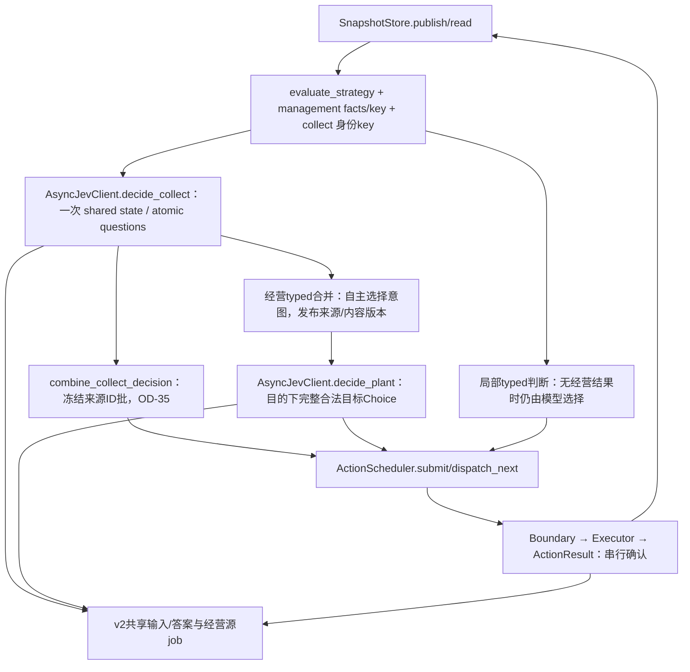
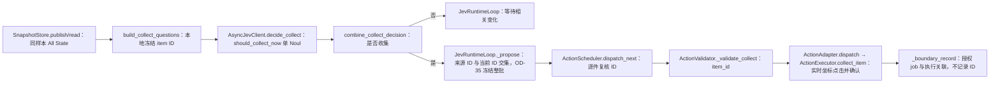
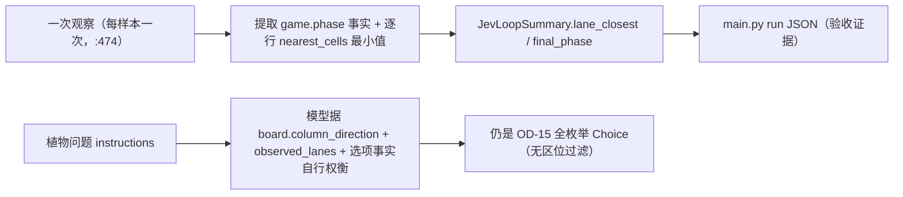
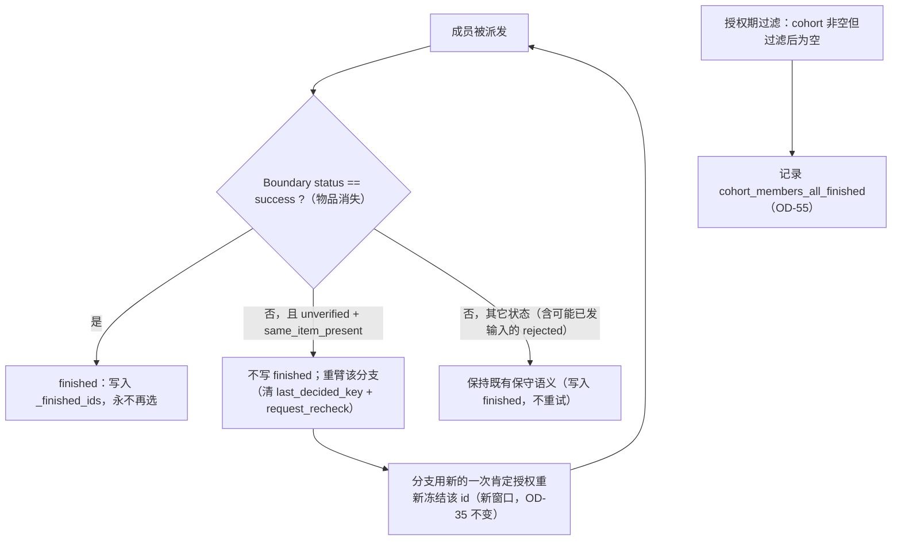
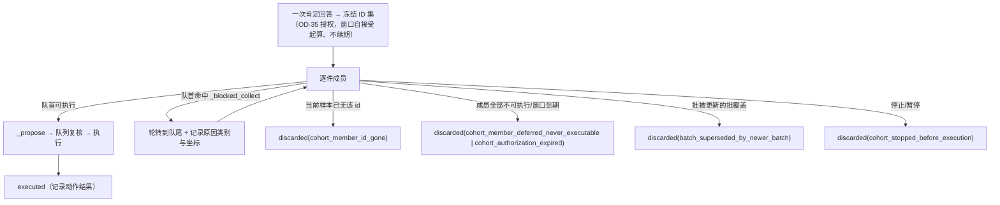
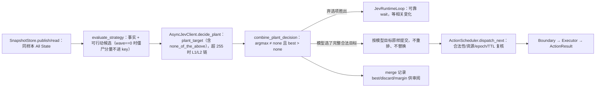
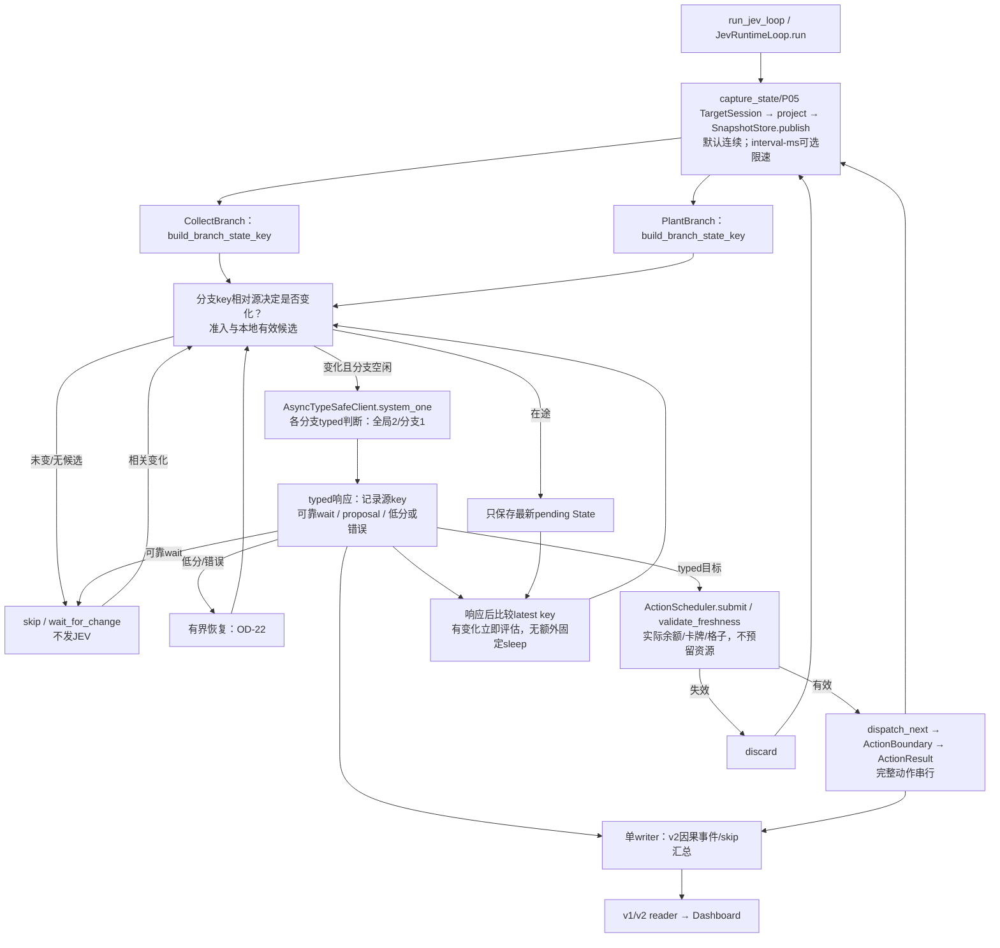

# Plan P03 — 异步 JEV Runtime 与分层策略

## 1. Metadata

- Plan ID: P03
- Iteration: 006-jev-runtime-loop
- Status: Pending human review
- Depends on: P01、P02、P05（已实施采集基线）
- Requirement IDs: R1、R2、R3、R4、R5、R6、R8、R9、R10、R11、R15、R16、R17、R18、R19、R20、R21、R22、R23、R24、R25、R26、R27、R28、R29、R30、R31、R32、R33、R34、R35、R36、R37、R38、R39、R40、R41、R42、R43、R44、R45、R46、R47、R48、R49、R50、R51、R52、R53、R54、R55

## 2. Goal

将现有阻塞式 Router → Action → Observe 改为默认连续观察、相关状态变化驱动的独立收集/种植分支，以及统一串行动作执行。Observer 完成采样即继续，不默认 sleep 100ms/5s；--interval-ms 仅作可选观察限速。两个分支各自比较决策相关 State key，变化才调用 JEV，无变化 skip；请求在途时只保留最新待评估状态。收集和种植没有显式任务依赖或阳光预留，收集成功后的实际余额通过新 State 自然进入种植判断。局部可靠 wait 等到相关变化，API 错误/低置信度为有限恢复例外。JEV 仍负责分层 typed 判断，执行前保持来源、新鲜度、身份、资源与 Boundary 校验；采样速度不等于网络或动作响应速度。

请求设计遵循 TypeSafe 官方 pattern（Speculative fan-out + Composite scoring + Hierarchical Choice）：**同一次决策的所有问题放在一次请求里**（含只有部分输入才用得上的推测性问题），问题必须**原子**（一个问题只评估一个属性），多因子判断由**代码加权合并**；数值、计数与算术一律在代码完成，`state` 只放该问题需要的字段；Noul 与 Choice 是两类不同问题，不相互套用门槛。目标选择采用「本地枚举完整 `{type_name,row,col}` 候选 + 一次 Choice」，代码用返回的完整 `probabilities` 做约束下重排；当候选空间可本地枚举时**一次请求即可完成**，仅当无法本地枚举时才允许第二轮。

### 本次收集策略修订（2026-09-27，当前规范）

用户明确要求：“这里改成 item id，直接忽略坐标；JEV 这里只做到是否收集”，以缓解慢模型响应期间掉落物位移与重复逐件询问。该收集修订的历史边界为经营暂缓；本轮经营增量以下一节 R25–R29 为准。

本节及 OD-34 优先于历史 collect 设计：collect_target Choice、item_index 目标映射和 Scheduler→Boundary 的坐标属性请求退出新 Runtime 收集路径；T1–T9 的已完成记录保留历史真实性，不代表本次修订已实施。收集子问题仅读取物品类型与代码计算的数量，不含坐标、真实 ID 或 sample-local index；该职能只有 should_collect_now 一个 typed Noul，共享请求另可包含本次经营问题。ID 来自同一样本的 All State，由本地保存，用于目标生命周期和执行，不交给模型猜测。Noul 门槛沿用 Runtime 配置，本轮不擅自重定 0.3/0.6。

“忽略坐标”适用于模型输入、目标选择、目标身份校验与决策失效条件；实际鼠标点击仍由既有 ActionExecutor 按 ID 从即时 State 解析当前位置，保留有限坐标、坐标含义、窗口范围和身份守卫。不放宽既有 item_coordinates.bounds，也不新增内存写入。

OD-35 已由用户确认整批收取：一次肯定回答覆盖请求样本冻结的全部有效 ID，本地按来源数组顺序逐个执行，不为同批每件重问；新 ID 下一批再问。授权不能自动延伸到请求样本之外的新 ID。

### 本次经营策略修订（2026-09-27，自主经营，当前规范）

用户的实验初衷是观察 JEV 能否自己经营并通过植物大战僵尸。用户本轮明确：“应该让 JEV 选择，而不是我给一个答案”。撤回预定义攻略方案、向日葵目标数量、列布局、逐行最低阵容、阶段达成/转移公式；OD-37 修订，原 OD-39 参数问题按“不需要这些业务答案”解决。不得用新默认参数或评分权重重新引入答案。

保留收集与经营同一样本裁剪 state、同一次请求；CollectBranch 扩为共享入口，PlantBranch 消费自主经营意图选择完整合法目标，两个请求 worker、统一串行执行器不变。收集子职能仍只有 should_collect_now 一个 Noul，无 collect_target；来源 ID 本地冻结整批逐件执行（OD-34/35），物品坐标/真实 ID 不进模型或 Trace。空 items 不阻断经营相关变化。

代码提供观察事实：阳光/金币生产类型与数量/布局、各行植物和僵尸类型/能力与数量/距离/生命值、可信波次、卡牌费用/冷却/合法位置、当前余额及支付能力。JEV 判断是否扩经济/加强某行/应急/等待，选择下一建设类型，决定保持、替换或放弃已有意图。typed 选项描述游戏可做的动作和植物能力，不是“经济优先/防线优先”等人写的攻略方案；有显式 hold/取消/弃选语义。

长期性来自本局持有并回传 JEV 上次选择的意图与最小实际执行结果（例如“下一步种豌豆射手；当前75，费用100，不可支付”），由 JEV 在最新局面中重新判断。代码可计算差25阳光，但不计算“还差3株才达到理想经济”或断言“一株攻击植物已经足够防守”。plant被种下的事实可结束该具体意图，不证明阵容足够；下一步方向仍由JEV选择。

OD-38 保留：当 JEV 明确选择等待某建设类型时，本地不花钱种无关便宜植物；支付能力/冷却/阵容/威胁/波次变化唤醒判断，JEV可改变或放弃等待。代码不能因本地phase/urgency公式强制改用途。未到账阳光不得计预算，无预测/阳光锁定/资金任务。

经营意图不设置业务TTL，也不作为无限期可执行授权；既有技术门槛保留（sample age≤500ms、job deadline10s、proposal TTL5s、epoch/身份/合法性守卫）。每次具体种植仍有typed合法目标与即时复核，来源失效/超时待新判断；暂停/新局清理意图。普通序号/时间变化不制造模型请求。本节与 OD-40 优先于下方历史本地phase/urgency/重排规则，历史T1–T9 backfill不改。T10–T15 已实施并有确定性回归证据（见 §7）；本次冷启动修订只改计划，T16–T19 未实施。

### 本次冷启动与闸门修订（2026-09-27，当前规范）

实测依据（两次受控运行、均为 Human 授权下本人操作，非本 Plan 执行）：`run c8c02e90`（58.8 s）与 `run 78993a85`（31.4 s，新开一关）。收集路径已恢复正常：31.4 s 内 5 个可见阳光**全部收到、0 次 Boundary 拒绝、0 个过期**，每个阳光出现后 0.3–0.7 s 内被点击，Trace 无 item ID 泄漏；收集闸门 `should_collect_now` 完全二分（空 items 0.10–0.12 / 有阳光 0.54–0.60）。但同一 31.4 s 内**零种植**：sun 已达 150、45 个空位、3 种可负担植物，模型 6 次植物请求里 5 次被闸门挡回 `model_wait`（`should_invest_economy` 实测 0.18–0.26 < 部署门槛 0.3），而它自己的 `plant_target` 已明确给出 `sunflower@r0c0`（0.36 / 0.50）与 `peashooter@r2c0`（0.54 / 0.38），弃选项仅 0.06–0.13。冷启动 `construction_intent` 恒为 null，而 `keep/replace/cancel` 三选项均相对「当前意图」定义，模型 17/17 选 `cancel`（0.55–0.78）—— 这是问题集良构性缺陷，不是模型没有经营能力。

本节与 OD-41–OD-45 优先于下方历史 plant 闸门设计与历史 collect 门槛口径；T1–T15 的已完成记录保留历史真实性，不代表本次修订已实施。

1. **plant 取消绝对闸门、弃选项作主（OD-41）**：删除 act-now Noul（现行文本 "Should the next construction intent be acted on now using one of the offered legal placements? …"，构造于 `jev/client.py::_plant_absolute_questions`）。plant 的「要不要动手」由模型自己在 `plant_target`（或超 255 时的 L1/L2 链）里表达：`none_of_the_above` 胜出即等待，否则直接执行 argmax。判据只有 `argmax ≠ none_of_the_above` **且 `best > none`**（δ=0，**零新增可调参数**）；不引入任何绝对阈值，也不再用 confidence 门槛。`best`/`discard`/`margin` 作为**事实字段**写入 merge 与 Trace 供 V41 审阅。
2. **collect 闸门铆定 0.5（OD-42）**：`should_collect_now` 与显式常量 `COLLECT_ACT_THRESHOLD = 0.5` 比较（含义是「比一半更可能」，不需要按局面重调），不再与 `JEV_NOUL_CANDIDATE_THRESHOLD` 共用。该常量与问题文本同在 `jev/questions.py`，是 V41 的审阅对象。0.5 比现行部署值 0.3 **更严格**；实测数据两者等价（无样本落在 0.3–0.5 之间），但若模型「是」答案下漂到 0.45 将停止收集，该风险写入 §8。
3. **删除 `needs_immediate_response`（OD-43）**：实测 7/17 为真（≥0.3）却没有任何消费者（只被写进 Trace），其位置已被 `none_of_the_above` 取代。`construction_intent` / `next_construction_type` 保留，但从**授权前提**降级为**上下文**。
4. **空 items 不问 collect 子问题（OD-44）**：共享请求在 `items == []` 时只带经营问题；实测 17 次 collect 请求中 9 次在空物品上白问。
5. **开局 `wave == 0` 守卫（OD-45）**：关卡尚未开始（`wave == 0`）时，僵尸相关分量（`zombie_count`/`urgency`/`attacker_count`/`has_defender`）不进入 PlantBranch key。实测首样本 `wave=0` 却有 9 个僵尸（均 row0、distance 8），0.93 s 后归 0，该瞬变把当时**唯一通过闸门的种植决策**判成 `superseded`。守卫只影响 key 的灵敏度，**不改变发给模型的事实**（模型仍看得到这些实体）。
6. **长线经营仍由模型自主（OD-37/OD-40 不变）**：代码不提供攻略答案、不重排、不替换模型的合法选择；OD-38 的「为指定建设攒钱」改由模型选 `none_of_the_above` 表达（目标候选只含当前可负担类型）。

后效与边界：plant 请求因此只剩**一个 Choice**（`plant_target`，超 255 时 L1/L2 链保持），与 OD-28 的原子问题原则不冲突（一个决策只判一个属性：选哪个完整合法目标）；删除该 Noul 后运行时**再没有任何内联问题文本**，V41 的审阅入口自动闭合。**P02 历史同步路径（`build_router_questions`/`build_action_questions`/`validate_action_answers` 与其门槛）与 `actions/executor.py` 一律不动**；`JEV_NOUL_CANDIDATE_THRESHOLD` 只服务 P02。本次不解除 `x<80` 点击区域限制（§8 G2 保持）。

### 本次可用性与布局事实修订（2026-09-27，当前规范）

实测依据（Human 授权下的受控运行 `run 92f9a6ac`，104.5 s、515 事件、50 次动作：collect 36 / plant 14）：

- collect 36 次派发 = 27 次 `success`（确认 median **1091 ms**、max 1431 ms）+ **8 次 `rejected`（22%）** + 1 次 `unverified`。8 次拒绝的边界证据**全部**是 `rejection_evidence: ["item_coordinate_evidence"]` 且 `input_status: "not_sent"`，即**没有发出点击**；`unverified` 那次是 `polls: 40`、`waited_ms: 10000`、`timeout_ms: 10000`（**阻塞唯一 worker 10.2 s**）。
- 几何对账：`client_size=(800,600)`、`lawn.first_cell_center=(80,130)`、`horizontal_spacing=80`、`vertical_spacing=100` → 列中心 x = 80…720。`item_coordinates.bounds = (80,80,800,600)` 的 **x 下限正好等于列 0 中心**，把列 0 左半边 `x∈[40,80)` 整块排除；**y 下限 80** 排除仍在下落高处（实测 y≈60）的掉落物。所以这 8 次拒绝是**几何常量过窄**，不是决策或过期问题。
- 该 10.2 s 阻塞期间同屏阳光数达到 **5**；数量账本显示全窗口 26 次计数下降中**只有 1 次**无法被成功收集解释，其时间点正落在该阻塞窗口内。
- collect 另有 **46/72 次"模型已授权收集"的决策既无动作也无记录**：活跃批期间的第二次 `selected` 被 `jev/loop.py` 静默丢弃（`if outcome == "selected" and not self._cohort`），而已批准的 OD-35 明确要求保留"一份 latest 未授权状态"。
- plant 侧（策略质量参考，非本次主要目标）：7 株向日葵全在 row 0；3 个坚果在 **r3c0 / r1c0 / r1c1**（房屋侧，不是"最后一列"）；仅 1 株豌豆射手。模型输入**已含** `plants`（逐株 row/col）与 `plant_counts`（**仅全局按类型**），但**没有每行己方构成**、**没有列方向语义**。实测 `plant_option_criteria` **已经**在选项文本里带 `role`。

本节与 OD-46–OD-50 优先于下方历史区域常量与收集时效口径；T1–T19 的完成记录保留历史真实性，不代表本次修订已实施。

1. **掉落物点击区域（OD-46, R35）**：`item_coordinates.bounds` 由 `(80,80,800,600)` 改为 **`(40,40,800,600)`**（x 下限 = 首列中心 80 − 半间距 40；y 下限放宽到 40 以允许高处下落物；上界不变）。该常量**只被** `actions/executor.py::_resolve_item_point` 使用，种植/铲除走 `lawn` 几何，因此改动只影响掉落物点击。本项按 §8 既有升级条件**升为 G1**。
2. **收集确认超时（OD-47, R36）**：collect 请求显式携带 `timeout_ms = 2500`（实测成功确认 median 1091 / max 1431 ms），**不改 `actions/executor.py::DEFAULT_TIMEOUT_MS`**（避免影响种植/铲除的确认语义）；`unverified` 结果除既有 `polls`/`waited_ms`/`timeout_ms` 外，补 `last_observation`，以区分"点了没生效"与"items 不可用 / ID 歧义"。
3. **OD-35 latest 未授权批（OD-48, R37）**：补全**已批准**的 OD-35 —— 活跃批期间到达的 `selected` 必须保存在**一份 latest 未授权批**并记录事件；当前批结束/取消/过期后按既有 5 s 授权时效消费，超时则丢弃并记录原因。**不得静默丢失授权**。
4. **布局与列方向语义事实（OD-49, R38）**：共享 state 新增 `lane_composition`（每行 `{resource, attacker, defender}` 计数）并在 `board` 中写入**列方向语义**（col 0 = 房屋侧、col 8 = 僵尸来向）；同步更新 `PLANT_STATE_FIELDS` 与 V31/V44 的字段集断言。**只给事实与语义，不给推荐、配额或布局答案**（OD-40 不变）。
5. **角色暴露方式（OD-50，沿用 OD-37/OD-40 的 A 档）**：`role` 只作为**事实与呈现**暴露 —— 选项文本已有 `role`，本次仅把它加入共享 state 的 `cards[]`；**不拆角色问题、不按角色过滤候选**。

### 本次批成员账本与队首轮转修订（2026-09-27，当前规范）

实测依据（Human 授权下的受控运行 `run 94a40c3c`，26.7 s，结束时 `stop_reason = paused`）：

- **坐标区域拒绝 0 次**（T20 生效 ✓），**`unverified` 一次 2.656 s / polls 11 / timeout 2500**（T21 生效 ✓，旧实现为 10.2 s）。
- 但 collect 的**授权与执行严重不守恒**：`selected` 决策 13 次，合计 **16 个已授权成员槽位**；实际 collect 派发 **6 次**（4 success + 1 unverified + 1 覆盖 `job-000032`）；整轮**只有 1 条丢弃记录**（`batch_superseded_by_newer_batch`）。**约 9 个成员槽位没有任何记录**。
- 用户截图那一刻正是这一类：`job-000032` 是 **2 件批**，只执行了第 1 件，草地上第 2 颗太阳直到运行暂停都没被收。

四条静默路径已定位（全部不写任何事件）：

1. `jev/loop.py::stop_dispatch`（约 :339-346）清空 `_cohort` / `_latest_cohort` / `_blocked_collect` / `_finished_ids`，**不记录** → 尾部授权（t≥23 s 的 `job-000033/035/036/037`）在这里消失；这也解释了为什么"暂停前刚授权的批"完全无痕。
2. `_discard_cohort` 只以 `targets[0]` 记 **1 条批级记录** → 多成员批的其余成员不可见（TTL 过期路径同样只有一条）。
3. `_pump_cohort`（约 :733-734）用**当前样本的 item id** 剪枝后 `return` → id 已消失的成员无记录。行为本身正确（东西没了），但不可归因。
4. `_pump_cohort` 的另两个 `return`：顶部忙闸门（约 :723 `_dispatch_busy or scheduler.pending(COLLECT)`）与队首阻塞（约 :737-739 `_blocked_collect` 条件未变）→ 无记录；其中**队首阻塞会让同批其他成员一直等到批时效**，是"2 件批只执行 1 件"的直接机制。

本节与 OD-51–OD-53 优先于下方历史批记账口径；T1–T23 的完成记录保留历史真实性，不代表本次修订已实施。**OD-35 不变**（授权窗口仍自"被接受"时刻起算、不因出队或等待续期、排队等待计入窗口内）—— 这已由 Human 明确确认，本次不修订它，只让**每一次失败都有记录**。

1. **批成员终态账本（OD-51, R39）**：每个已授权成员必须以 **`executed`** 或 **`discarded(reason)`** 收尾，不存在第三种状态。批结束处（TTL 过期 / 被更新的批覆盖 / id 消失 / 停止 / 成员全部不可执行）**逐条**记录未执行成员；`stop_dispatch` 路径必须记账（当前最大缺口）。新增 reason 词表：`cohort_member_id_gone`、`cohort_member_deferred_never_executable`、`cohort_authorization_expired`、`cohort_stopped_before_execution`。记账复用既有 action-discard 通道（`_record_action(..., OUTCOME_DISCARDED, reason)`），**不新增事件类型**（避免 v2 分类器把无 action 的 cycle 误判成 decision job、污染 job 计数）。
2. **队首轮转（OD-52, R40）**：`_blocked_collect` 命中的队首成员**移到队尾**，让同批其他可用成员先执行；该成员保留原有"离散条件变化后恢复"的语义，且**在条件未变前不得反复排到队首**（避免热循环）。忙闸门（`_dispatch_busy` / 单槽占用）不逐次记录（否则刷屏），但因此未执行的成员在批结束处计入账本。
3. **不可执行证据（OD-53, R41）**：未执行/被延迟成员的记录附带**原因类别**（由 `_collect_condition` 的元素派生，如 `outside_region` / `not_finite` / `unresolved_interpretation` / `items_unavailable`）与**该件的 client 坐标（两个数）**，用于一次性区分"贴房屋死带（x<40）"与"高处下落中（y<40，属瞬时）"。**不得写入 item ID**（红线保持）。

保持不变：单动作不可交叉（OD-24）；出队/派发的同 sample 身份+资源+位置复核；点击坐标由 Executor 在点击时取最新；epoch/TTL/停止 fail-closed；`item_id` 绝不进入任何 v2 事件；未确认结果不重放。

### 本次 finished 判据与重试修订（2026-09-27，当前规范）

实测依据（Human 授权下的受控运行 `run e6c84636`，23.3 s，结束时暂停；T24/T25 已生效）：

- collect `selected` 决策 **12 次**、合计 **15 个已授权成员槽位**，但只有 **4 次派发**（3 success + 1 `unverified`，2.7 s / polls 11 / `same_item_present: true`），且 **丢弃记录 0 条**。
- 时间顺序给出因果：唯一的 `unverified` 发生在 **t=11.4 s**，此后 **8 次 `selected`（`authorized_count=1`）全部既无动作也无记录**，而同屏那颗太阳一直没有消失。

根因（`jev/loop.py`，符号级已核实）：

1. `:1126-1128` 的 `else` 把**除 TTL 过期以外**的所有派发结果都记为 finished：

   ```python
   else:
       if dispatch.reason != DISCARD_TTL_EXPIRED:
           self._finished_ids.add(identity)
       self._cohort = [t for t in self._cohort if t.get("item_id") != identity]
   ```

   其中包括 `unverified`（点击未确认，而执行器证据 `wait.last_observation.same_item_present = true` **说明物品仍在**）与调度侧丢弃（`stale_sample` 等，**根本没点**）。
2. `_finished_ids` 只在 `:665` 按「当前样本仍存在的 id」做交集清理 → **可见物品的 id 会被永久保留在 finished 集合里**。
3. `:629` 的前置过滤因此把后续授权过滤成**空批**：

   ```python
   targets = [dict(t) for t in (decision.cohort or (decision.target,)) if t is not None and t.get("item_id") not in self._finished_ids]
   if targets: ...   # 空则什么都不做，也不记录
   ```

   → 一颗被误判 finished 的太阳从此**再也不会被点**，直到它自然过期。这正是「大概率不捡、偶尔捡起来」：`偶尔` = 点击确认成功（`success`）或出现新 id 的新太阳。
4. `collect_identity_key`（id 集合）在这期间**没有变化**，所以分支还会因 `last_decided_key` 命中而 skip，连重问都不会发生。

本节与 OD-54/OD-55 优先于下方历史 finished/记账口径；T1–T25 的完成记录保留历史真实性，不代表本次修订已实施。

1. **finished 只由「物品确实消失」判定（OD-54, R42）**：只有 `status == "success"`（执行器 `actions/executor.py:251` 的 `success` 即 `postcondition_result == "met"`）才算该成员已终结；**`unverified` 且执行器证据表明物品仍在** → **不得**进入 finished、不得从可重试集合中永久排除。其余状态（含「可能是已发送输入后的 rejected」）**保持现状的保守语义不变**（见 §8 风险）。
2. **该情形必须把分支交回重新授权（OD-54, R43）**：这类派发之后清该分支的 `last_decided_key` 并 `request_recheck()`（复用 `_release_branch` 已有的 TTL 交回机制，泛化为一个明确的重臂入口），使分支能为**同一物品**再问一次并拿到**新的一次**肯定授权。重试**不是重放同一个 proposal**：每次重试都需要新的模型授权，且点击前仍按 id 从**最新样本**取坐标；重试节奏由单执行器与确认窗口自然限流（`unverified` 一次本身要 ~2.5 s），不需要额外节流器。
3. **空批过滤必须记账（OD-55, R44）**：当一次肯定授权的 `decision.cohort` 非空、但过滤后没有任何可执行成员时必须留下一条带 reason 的记录（建议 `cohort_members_all_finished`），把 OD-51 的账本从「批」上移到「过滤前」，堵住本次这个洞。
4. **授权窗口语义不变**：OD-35 仍为「自被接受时刻起算、不续期、排队计入窗口内」。**无限重试不等于延长授权** —— 每次重试都是一次新的肯定回答及其自己的 5 s 窗口。

### 本次布局经验与结果事实修订（2026-09-27，当前规范）

需求来源：Human 提出「要不要在 state 里写几条经验（资源植物靠房屋侧、防御植物靠僵尸侧、攻击植物靠后因为血低且多为远程，除非近战）」。讨论后的结论与 Human 决定（OD-56/OD-57）：

- **不写进 `state`**：`state` 的已批准边界是「只给事实、不给 recommendation/quota」（OD-49/OD-50），而「哪几列适合种什么」是策略建议；写进 `state` 还会连带 `PLANT_STATE_FIELDS` 白名单与 Trace parity 成本。**Human 决定：只改 `instructions` 文本**（请求本就带 per-question `instructions` 层，例如 `jev/questions.py:194-204` 的植物选择文本）。
- **措辞必须锚定方向语义，不写列号**：`board.column_direction` 已存在（`house_side_col: 0` / `zombie_side_col: 最高列`，`jev/strategy.py:83-94`）。Human 原话中「最后 1~2 列」与「前 3 列」自相矛盾（取决于「前」指房屋侧还是僵尸侧），故文本只表达**方向倾向 + 威胁优先**，并显式让位给即时威胁。
- **不做区位过滤、不给配额**：候选集仍是 OD-15 的全枚举（`affordable × empty_plantable_cells`），文本只能是倾向而非约束；也不按区位裁剪候选。
- **catalog 不动**：`PlantInfo` 保持 `name/cost/description_en/role`。因此「除非是近战」这一例外今天只能由模型读 `description_en`（如 chomper 的 `Swallows one nearby zombie`）自行判断，**不保证可靠** —— 记为已知限制（G3），不为此新增结构化字段。
- **同时加入最小结果事实**（Human 决定；否则任何策略类改动都无法验收）：只记录**事实**，不预测、不计分、不进模型输入。

  1. `final_phase`：`_state_stop_reason`（`jev/loop.py:490-505`）已经读取 `all_state["game"]["phase"]`，但它把 `level_complete` 与 `zombies_win`/`level_award` 一并折叠成 `level_finished`，**胜负信息被丢掉**；把最后一次观测到的 phase 作为事实记录即可（`status` 语义**不变**）。
  2. `lane_closest`：run 内每行 `nearest_cells`（`jev/strategy.py` 的逐行僵尸接近度，`urgency_band` 的分档输入）的**最小值**，即「这局僵尸最近逼近到几格」。逐样本接近度**已在 Trace 中**（`observed_lanes[].nearest_cells`），故本项只是把它汇总成 run 级事实；样本数用既有 `observations` 计数器，不新增字段。
  3. **不新增 v2 Trace 事件类型**（避免污染分类器，沿用 T24 的同一理由）：结果事实落在 `JevLoopSummary` + `main.py` 的 run JSON（`:170-176`），既有逐样本事实可作离线交叉校验。

**补充（OD-58，Human 追加要求）**：这些经验**不由代码硬编码**，而是放在一个**可手工编辑的文件**里由用户自行增删 —— `configs/plant_experience.txt`（UTF-8；以 `#` 开头的行与空行忽略；其余每行一条经验；入库版本库）。加载器位于 `jev/questions.py`，在构建植物问题时读取并把这些行作为独立段落追加到三处 `instructions` 之后；**固定方向锚定句仍留在代码里**（保证 `state.board.column_direction` 锚定与「即时威胁优先」语义永远在场且可测），文件只提供**补充经验**。加载器不缓存（每次构建读取，用户改动立即生效；代价是一次小文件读取，可忽略）。**运行时不因文件内容失败**：缺文件 → 视为空；超预算或引用未知 `state.<字段>` 一律**只由测试发现**（V72），不在现场报错。入库文件默认内容：

```text
# Plant layout experience -- one guidance per line, edit freely.
# Lines starting with # and blank lines are ignored.
# Reference only state fields that exist in the plant request state
# (state.board, state.observed_lanes, ...), otherwise the acceptance test fails.
# English is recommended (the rest of the instructions is English).

A fragile resource plant is usually safer toward the house side.
A durable blocker belongs on the zombie side of what it protects.
Prefer planting into the lane whose nearest zombie is closest.
```

### 本次掉落物区域与植物能力事实修订（2026-09-27，当前规范）

**A. 掉落物点击区域（现场 bug，Human 报告「边缘太阳无法收集、百分百消失」）**

实测依据（受控运行 `run d8a00084`，`.log/test_02.jsonl`，644 事件）：

- 该局 **82 条** collect 批成员记录被判 `outside_region` 而**从未点击**（去重后 **29 个不同落点**），其中 **26 个落在 x∈[10,36]、y∈[103,414]** —— 即太阳已漂到**草坪左缘／割草机条带**上方，仍在 800×600 客户区内、**游戏可点**，却被 `configs/pvz_1051.py` 的 `ACTION_WINDOW_PROFILE["item_coordinates"]["bounds"] = (40.0, 40.0, 800.0, 600.0)` 的 x 下限 40 排除；同局 collect 实际动作仅 50 次。
- 另 3 个落点 x∈[57,122] 且 **y∈[17,31]**（在顶部种子栏 UI 之后）被拒绝是**正确**的。
- 归因：T20 当时把 x 下限从 80 收到 40（按「第一格左缘 = 中心 80 − 半格距 40」），但掉落物会**继续漂到草坪边界之外的那条带**；y 下限 40 也偏小（种子栏底部实际在 ≈80）。
- 修订后取值：`bounds = (0.0, 80.0, 800.0, 600.0)` —— x 下限放到**客户区左缘 0**（割草机条带属于场地，其上掉落物可点击），y 下限改为**草坪上沿** `first_cell_center_y 130 − vertical_spacing/2 50 = 80`（纳入草坪内低处、又不点进种子栏 UI），右/下保持客户区尺寸。**只改这一个常量**：判定逻辑（`jev/loop.py::_collect_condition` 的 `bounds + origin` 规则）、点击点解析（按 id 取当前样本坐标）均不变。

**B. 植物能力事实（Human：「植物的描述信息好像没在 jev state，state 根本不知道[植物]干什么」）**

现状核实（同一局真实请求 state）：

- `state.cards[]` **已有** `description_en` + `role` ✓（手牌清楚）。
- 每个 plant **选项**已有 `plant_ability` + `role` + `cost` ✓（待选落点清楚）。
- **缺口**：`state.plants[]` 与 `state.catalog_context` **没有任何植物能力** —— 实测 `catalog_context = {"zombie_abilities": []}`（只有僵尸能力，且可能为空）；`plants[]` 只有位置/类型类字段。于是在**汉化 mod**（如本局出现的 `coffee_bean` 等非原版植物）里，模型看不出**自己场上这些植物到底干什么**，铲除/补种决策缺少事实依据。

修订内容：`catalog_context` 增 `plant_abilities`（**只列本样本出现的手牌与已种植物类型**，去重、按类型名稳定排序，每项 `{type_name, description_en, role}`，与既有 `zombie_abilities` 同构、**不推断不在场类型**）；`plants[]` 每项增 `role`（不重复长描述，控制体积）。**不新增 state 顶层键**（`catalog_context` 本就在 `PLANT_STATE_FIELDS` 内），Trace 的 `catalog_context` 投影同步扩展（现仅投影 `zombie_abilities`）。

**C. collect 授权队列（Open Decision OD-59，见 §5.1；本次未定稿）**

实测：同一局 `batch_superseded_by_newer_batch` **545 次** vs 实际 collect 动作 **116 次** —— 现行「只保留 1 个待执行批准」在模型连续给出肯定回答时（尤其 T26 重臂后的重试节奏）会**丢掉尚未执行的旧批准**（有记录、不静默，但白丢）。是否改为多批 FIFO／先做等价合并去重，留作 Open Decision，待 Human 明确后回填为 Task。

### 本次直接实施回填（2026-09-27，Human 直接要求「不走 SDD」）

Human 在本 Iteration 中对若干行为改动作出「不走 SDD、直接改」的明确指示，主 agent 已直接实施并逐项独立验证（现场构建探针、变异回放，均逐字节还原）。本节把这些改动**追认**为 P03 的正式需求与实现记录，使 Plan 重新成为唯一事实来源；对应 Task 直接记为 `[x]`，验收证据见各 Task backfill 与 §7 的 V75–V80。

| 项 | 改动（当前实现） | 证据 |
|---|---|---|
| 威胁标签化 | 请求态不再含僵尸侧数字：`observed_lanes[] = {row, threat, crowd, composition, attacker_count, has_defender}`、`zombies[] = {type_name, row, proximity, armor}`；闭集 `threat = none\|unknown\|low\|medium\|high\|critical\|undefended`、`crowd/proximity/armor` 见 `jev/strategy.py`；`threat_label_facts` 在 `build_typesafe_state` 内应用。**无攻击植物的行自动升档**（本行有僵尸 → `undefended`，无僵尸 → `high`），且为**呈现层专属**：`urgency_band`、branch key、调度紧急度不变 | 现场构建：数字消失、标签出现；`management_state_key` 仍对距离敏感（3 vs 2 产生不同 key）；`ThreatLabelFactsTests` 3 项；变异 2/2 CAUGHT |
| OD-59 队列与去重 | 「只保留 1 个待执行批」→ **有界 FIFO 队列 + 等价合并去重**：`COHORT_QUEUE_LIMIT = 3`，超出丢最旧并记 `batch_queue_overflow`，重复成员记 `cohort_member_already_pending`（不再重复派发）；每批仍按「自接受时刻起算 5 s」窗口（OD-35 不变）；`_start_latest_cohort` 逐批推进、过期/空批记账后继续；stop 路径遍历整队列；新增 `_record_all_finished_batch` 复用 OD-55 记账 | 基线 `run d8a00084`：`batch_superseded_by_newer_batch` **753** 条 vs 实际 collect 动作 **302**（39%）；新用例 2 项；变异 **4/4 CAUGHT** |
| 管理答案校验 | 只有 `operation == "replace"` 才要求 `next_construction_type` 答案；`keep`/`cancel` 缺省不再判为 `invalid_management_response` | 基线该局 5 次误判（模型答 cancel 却不给类型，其 cancel 被丢弃、静默保留旧意图）；新用例 `test_a_cancel_intent_needs_no_construction_type_answer` |
| Trace 记胜负 | `runtime_stop` 增 `final_phase`（最后一次观测到的 `game.phase`），使 Trace 能区分 `level_complete` 与 `zombies_win`（`stop_reason` 仍为 `level_finished`，stop 语义不变） | trace 测试断言 `final_phase == "playing"` |
| 植物目录标注 | `PlantInfo.engagement ∈ {ranged, melee, none}`（49 项全标：18 ranged / 6 melee / 25 none；melee = chomper、squash、tangle_kelp、spikeweed、spikerock、gloom_shroom）+ 闭集 `PLANT_ENGAGEMENTS`；**经济植物即 `role == "resource"`**；`engagement` 下发到 plant 选项 criteria | `test_role_is_the_last_field_and_existing_facts_are_intact` 扩展（含 melee 名单与「经济=resource」断言）+ 选项断言 `engagement == "ranged"` |
| 描述事实补全 | 手牌 `cards[]` **不再丢弃目录解析不出的卡**（保留 `type_name/cost/payable/shortfall/usable/cooldown_ready`，`role`/`description_en`/`production_currency` 为 `null`）；`plants[]` 每项增 `description_en`；建造类型选项带能力文本（`_construction_option_text`；未知类型只给成本与缺口、不编造） | 现场构建实测（未知 mod 卡可见且不编造）；`test_jev_strategy`/`test_jev_client`/`test_jev_trace` 同步 |
| 经验文件策略 | `configs/plant_experience.txt` 重写为 **10 条 / 784 字符**（≤12 行 / ≤800 字符，V72 预算内），全部以**标签**为键；含「无攻击植物的行优先补防」「远程植物提前种」「优先攻击植物而非防守植物」「sun≥100 且无 critical 时仍扩经济」等 | V70/V72 用例（预算、逐条注入、禁词、`state.<字段>` 合法性）全部保持绿 |

**Human 接受声明（2026-09-27）**：Human 明确表示「006 已达到我的期望，我已经测出了 JEV 的能力上限，所以 006 可以 passed」。本 Plan 如实记录该**人工接受**：006 的当前状态由 Human 接受。它不改变 `verify.md` 的既有内容（仅 P01/P02/P05 为 Passed）；P03/P04 的正式 `Verify Passed` 标注仍需由显式 `$sdd-verify` 写入，且 **V07（受控真实 API/游戏）与 V41（问题/阈值/事实/reason 词表/经验文本逐条人工审阅）仍未执行**。

### Requirement Mapping

| Requirement ID | Outcome in this Plan | Acceptance signal |
|---|---|---|
| R1 | 每次启动 job 和派发前使用准入证据。 | paused/invalid/not-ready 时不派发；暂停后恢复不执行暂停前迟到结果。 |
| R2、R5 | PlantBranch 保留 typed 意图与目标；CollectBranch 仅 typed 是否收集，具体 ID 由本地授权范围绑定。 | 无肯定 typed collect 判定不得派发；每次收集可追溯授权 job，未经授权的新 ID 零派发。 |
| R3、R15 | 默认连续采样无额外固定间隔，分支依据相关 key 变化调用 JEV；无变化 skip；可选观察限速不控制 JEV 请求间隔。 | 相同语义 State 即使序号/时间变化也零新增请求；相关变化在请求返回后立即消费 latest-only；慢 API 不阻塞观察/另一分支。 |
| R6、R9、R10 | 提供植物能力、当前资源与各行真实事实，JEV自主选择经营/局部动作，不以开局攻略或未覆盖行规则强制行动。 | 能力/余额/阵容/威胁事实正确；合法模型选择保持原目标，资金不足等待由模型明确意图决定。 |
| R16 | 一次完整动作串行；执行前检查当前余额/卡牌/格子与旧结果有效性；不建立阳光预留/资源 claim。 | 两分支独立、完整输入不交叉，资金/目标已变化时拒绝旧方案，不换目标、不透支。 |
| R4、R8、R11、R17 | 异步事件有 job/stage/execution 因果关联；旧 Trace 与 Dashboard 可继续读。 | 新旧文件均展示正确，无敏感字段；乱序完成不会被显示为执行顺序。 |
| R18 | 同一次决策使用一次 fan-out 请求：所有该 state 的问题（含推测性问题）在同一请求内；不采用逐问题串行调用。 | 一次种植决策的 `system_one` 调用数恒为 1（第二轮仅在候选无法本地枚举时启用且有显式可判条件）；新增问题不新增请求。 |
| R19 | 问题原子化、代码机械合并typed答案与来源；旧业务权重/重排不得替代JEV选择，questions与技术阈值集中审阅。 | 单一属性可审计；模型意图/目标可追溯，代码只验证语义一致性/合法性，不输出另一个策略答案。 |
| R20 | 数值、计数与算术一律在代码完成；`state` 只包含该问题需要的字段；Noul 与 Choice 的语义与门槛不混用。 | 不存在要求模型做算术/计数的问题；state 字段集 = 问题所需，不含无关 projection 字段；Noul 与 Choice各自使用独立门槛且不要求候选集一致性。 |
| R21 | collect 决策与身份分离；连续坐标位移不作废。OD-34/OD-35 将旧类型+数量 key 与目标 Choice 升为本地 ID 授权生命周期，边界直接传 ID，ID 不进 Trace。 | 同批下落不重问/不 superseded；每件即时按原 ID 执行，ID 替换可识别，V46–V48。 |
| R22 | `job_start` 必须记录**实际发给模型的裁剪后 state**（而非 v1 摘要），使「模型当时看到了什么」可从 Trace 复核；同时仍不得写入 `availability`/`source`/`raw_snapshot`/凭据。 | 同一次实机运行发现 `job_start.state` 是 v1 `summarize_jev_state` 摘要且不含 items 坐标。（G1：Trace 是本次交付的可复核证据来源；记录错内容会让 V31 与 collect 决策无法核对。）|

| R23 | 收集职能只问是否收集：一个 Noul，无 collect_target；物品事实无 x/y、item_id/index。共享请求允许加入 R25 的经营问题与所需事实。 | fake SDK 断言收集问题恰一个且无目标 Choice；整体 question/state 按已确定经营问题裁剪，同批下落不重问。 |
| R24 | 本地目标与 Boundary collect 请求按 All State item ID 绑定；Executor 按此 ID 的即时坐标点击；普通位移不丢弃授权，授权范围/恢复按已确认 OD-35 执行。 | 同类多件按 ID 唯一执行、ID 消失不得换目标；同类型同数量替换身份可识别；不确定结果不重放，ID 不进 Trace。 |

| R25 | 扩展现有 CollectBranch，用同一 state/同一次 JEV 请求同时取得收集与经营原子判断；无物品时仍可因经营变化发请求，两个输出独立派生，不依赖同次另一答案。 | collect 与经营同需评估时一调用；无 items 但波次/目标相关事实变化仍有经营调用；保持全局2/worker1在途。 |
| R26 | 经营输入提供阳光生产/植物阵容、逐行僵尸与能力、实际预算/卡牌、可信波次及模型上次意图；代码只计算观察数量/费用/可支付性，区分sun/coin与unknown。 | 模型看到真实事实；无人工理想数量/布局/防线完成缺口，金币不误作阳光，unknown不补零。 |
| R27 | JEV自主选择、保持、替换或放弃下一建设意图；不提供预定义攻略方案、经济规模或阵容完成标准。 | 同一事实下fake JEV可以选择不同合法行动，代码均按typed选择处理；持续意图由模型更新，不由攻略参数推进。 |
| R28 | PlantBranch从模型意图对应的完整合法目标中选择，意图类别只表示动作能力；等待指定建设须源自JEV，JEV可改用途；不以固定阵容答案/本地威胁公式纠正模型。 | 任意合法模型目标不会被替换成代码推荐目标；意图/费用不兼容可拒绝，不能另选；真实余额不足零点击。 |
| R29 | 经营与收集独立来源key/epoch/内容版本；意图仅提供上下文，每件动作仍typed授权；变化才重评估，Trace关联模型意图、来源与实际执行结果。 | 无items也更新经营；旧epoch零派发，模型可取消等待；审计无硬编码业务覆盖；请求/动作可追溯。 |

| R30 | 代码不嵌入攻略答案，不通过本地phase/固定威胁档/候选重排覆盖JEV；仅合法性、来源、互斥与有限资源守卫，技术采样/门槛明示作为实验条件。 | 即使模型合法选择经济扩张与人类直觉不同，也保留原选择并记录；非法/失效选择只拒绝，不替换。 |
| R31 | plant 的「要不要动手」由模型自己在完整目标 Choice 的弃选项里表达；代码不得设置绝对闸门决定能否动手。 | 判据仅为 `argmax ≠ none_of_the_above 且 best > none`；无绝对阈值与 confidence 门槛；`best`/`discard`/`margin` 可从 merge/Trace 复核。（G1：直接决定冷启动能否种植：现行绝对闸门实测 0.18–0.26 使开局 31 s 零种植。）|
| R32 | collect 的「是否收集」使用固定锚点 0.5，与其它门槛解耦，且该锚点是人工可审阅的显式常量。 | `COLLECT_ACT_THRESHOLD = 0.5` 位于 `jev/questions.py` 并被 collect 合并消费；`JEV_NOUL_CANDIDATE_THRESHOLD` 变更不影响 collect 结论。（G1：收集是本次核心可用行为，其门槛必须可审阅且不随 P02 配置漂移。）|
| R33 | 共享请求按事实裁剪：没有可收集物品时不再询问收集子问题。 | `items == []` 的共享请求问题集中不含 `should_collect_now`，经营问题仍在。（G2：当前表现为空物品上白问（9/17），浪费 token 但不妨碍核心路径。）|
| R34 | 关卡尚未开始（`wave == 0`）时的僵尸分量不得使 PlantBranch 决策作废或被判为种植前提变化。 | 固定 State：`wave=0` 且僵尸整批出现/消失只改变可观测量，不改变 PlantBranch key；`wave ≥ 1` 时威胁分量仍进 key。（G1：实测该瞬变吞掉了开局唯一一次通过闸门的种植决策。）|
| R35 | 掉落物点击区域必须覆盖游戏实际掉落范围（含列 0 左半与高处下落物）；被区域拒绝时必须给出坐标证据。 | 固定样本 x=40/49/52、y=60 等边界值在 `_resolve_item_point` 下可点击；x<40 或 y<40 仍被拒且 `input_status: not_sent` 并带 `item_coordinate_evidence`；种植/铲除几何不受影响。 | G1 | 实测 22% 的收集派发因此被拒（8/36），直接导致阳光收不到。 |
| R36 | 收集确认必须有有界超时（显著小于现状 10 s），且超时结果必须携带确认证据。 | collect 请求带 `timeout_ms=2500`；`unverified` 在 ~2.5 s 内返回并记录 `polls`/`waited_ms`/`timeout_ms`/`last_observation`；executor 全局默认与种植/铲除路径不变。 | G1 | 实测一次未确认点击阻塞唯一 worker 10.2 s，期间同屏堆积到 5 个阳光并丢弃 1 个。 |
| R37 | 活跃批期间的收集授权不得静默丢失：必须保留一份 latest 未授权批并在当前批结束后按既有 5 s 时效消费或记录丢弃。 | 活跃批期间到达 `selected` → 有事件记录；当前批结束后消费该批；超 5 s 则丢弃并记录；无重复点击；决策数 = 消费 + 记录丢弃。 | G1 | 实测 46/72 次已授权决策无动作也无记录，既浪费 JEV 往返又破坏"授权→执行"可追溯性。 |
| R38 | 供模型使用的共享 state 必须包含每行己方构成、列方向语义与角色事实（仅事实与语义，不含推荐或配额）。 | `lane_composition` 与 `plants`/`board` 一致且空行/未知显式表示；列方向语义与 executor 的 `first_cell_center + col*spacing` 一致；`cards[].role` 取自目录、未知为 null；`PLANT_STATE_FIELDS` 与 V31/V44 断言同步；state 中不出现推荐/配额字段。 | G1 | 模型当前只拿到全局按类型计数与逐株坐标，需自行数 5 行且没有列方向语义，实测布局退化为单行堆叠与房屋侧坚果。 |
| R39 | 每个已授权收集成员必须以 `executed` 或 `discarded(reason)` 收尾；批结束（TTL/覆盖/id 消失/停止/全部不可执行）逐条记录未执行成员。 | 固定场景断言"授权成员数 = 执行数 + 丢弃数"（含 stop 路径与多成员批）；`stop_dispatch` 后存在对应记录。 | G1 | 实测 16 个成员槽位只有 6 次派发 + 1 条记录，授权与执行不可追溯。 |
| R40 | 暂不可执行的队首成员不得阻止同批其他成员执行。 | 一个 `_blocked_collect` 成员不再使同批兄弟成员饿死；该成员在离散条件变化后可再次执行；条件未变时不重复尝试。 | G1 | 实测 2 件批只执行第 1 件，第 2 件直到运行结束未被收。 |
| R41 | 未执行/被延迟成员的记录必须能归因：含原因类别与该件 client 坐标，且不含 item ID。 | 记录含 `outside_region`/`not_finite`/`unresolved_interpretation`/`items_unavailable` 之一与两个坐标数；序列化文本中无 item ID。 | G1 | 当前只能看到「存在坐标证据」，无法区分 x<40（永久死带）与 y<40（瞬时）。 |
| R42 | collect 成员的 `finished` 判据只能是「物品确实消失」（`success` / `postcondition_result == "met"`）；`unverified` 且物品仍在不得标 finished、不得永久排除。 | 固定场景断言：`unverified` + `same_item_present: true` → 该 id **不在** finished 集合；`success` → 在。 | G1 | 实测一次 `unverified` 使可见太阳被永久拉黑，是「大概率不捡」的直接原因。 |
| R43 | 该情形之后必须把 collect 分支交回重评估，使同一物品能获得**新的一次**授权并被执行；不得重放同一 proposal。 | 脚本化场景：断言分支被再次唤醒、出现第二次授权、同 id 被执行；且不出现同一 proposal 的重复派发。 | G1 | 只改 finished 判据还不够：id 集合未变时分支会因 `last_decided_key` 命中而 skip。 |
| R44 | 一次肯定授权在过滤后没有任何可执行成员时，必须留下带 reason 的记录。 | `decision.cohort` 非空且过滤后为空 → 恰好一条带 reason 的记录；「授权成员数 = 执行数 + 丢弃数」守恒式仍成立。 | G1 | 该路径此前完全静默，掩盖了误判 finished 的后果。 |
| R45 | 植物问题的 `instructions`（`plant_target_question`/`plant_lane_question`/`plant_lane_target_question`）用 `state.board.column_direction` 锚定方向语义，表达「资源植物偏房屋侧 / 耐久阻挡物偏它保护物的僵尸侧」的**倾向**并显式让位给即时威胁；不写列号、不用铁律措辞、不做区位过滤或配额。 | 固定字符串断言（三处均含方向锚定、无列号/铁律词）；既有 `state.<field>` 引用校验继续通过；`PLANT_STATE_FIELDS` 与 `build_typesafe_state` 输出键集未变。 | G1 | 措辞错向会把模型引到反向布局（Human 原话本身存在前/后歧义）。 |
| R46 | run 级最小结果事实：`final_phase`（最后一次观测到的 `game.phase` 事实）与 `lane_closest`（每行 `nearest_cells` 的 run 最小值），作为事实记录并经 run JSON 暴露；不预测、不计分、不进模型输入、不新增 v2 事件类型、`status` 语义不变。 | 多帧脚本化样本断言逐行 min、无僵尸行不出现、`final_phase` = 终局 phase 且 `status == "level_finished"` 语义不变。 | G1 | 没有结果事实，后续任何布局/策略改动都无法进入验收范围。 |
| R47 | 植物布局经验由**一个手编文本文件** `configs/plant_experience.txt` 管理（UTF-8；`#` 注释与空行忽略；每行一条；入库），加载器在构建植物问题时读取并追加到三处 `instructions`；加载不缓存、缺文件视为空；运行时不因内容失败；预算（去注释后 ≤12 行 / ≤800 字符）与 `state.<字段>` 引用合法性只由测试守护。 | 用 temp 文件断言注释/空行忽略、行序保持、UTF-8（含中文行不崩）、缺文件为空；入库文件满足预算；改文件即改请求文本。 | G1 | 这是 Human 明确要求的可维护形态（手加经验），也是文本实际进入模型请求的唯一通道。 |
| R48 | 掉落物可点区域必须是**真实可点击范围**：`item_coordinates.bounds = (0.0, 80.0, 800.0, 600.0)`（x 到客户区左缘、y 到草坪上沿），使漂到草坪左缘/割草机条带上方、仍在客户区内的掉落物被正常收集；种子栏 UI 之后的（y<80）仍被拒绝；只改该常量，判定与点击点解析不变。 | 常量断言 + 左缘落点（x=10/20/36 与 y∈[103,414]）判为可点、UI 条带（y=17/31）仍拒；既有 V61 边界断言按新值改写。 | G1 | 26/29 个实测丢弃落点是**可点却被拒**，直接造成「太阳凭空消失」。 |
| R49 | `state.catalog_context` 增 `plant_abilities`（本样本手牌 + 已种类型去重、稳定排序、`{type_name, description_en, role}`，不推断不在场类型），`state.plants[]` 每项增 `role`；不新增 state 顶层键；Trace 的 `catalog_context`/state 投影同步（parity）。 | 固定 state 断言去重/排序/字段集与「不在场类型不出现」；`set(state) == set(PLANT_STATE_FIELDS)` 不变；Trace 投影含新字段。 | G1 | mod 环境下模型无法从 state 得知场上植物能力，铲除/补种缺少事实依据。 |
| R50 | 请求态中僵尸侧的**威胁事实只以有序标签**出现（`threat`/`crowd`/`composition`/`proximity`/`armor`），不得下发 `zombie_count`/`nearest_cells`/`hp_total`/`distance_to_house_cells`/`hp` 等数字；**本行无攻击植物时**威胁至少 `high`，本行有僵尸且无攻击植物时为 `undefended`（高于 `critical`）；升档仅影响呈现，`urgency_band`/branch key 不变。 | 标签闭集与升档表逐项断言；现场请求 JSON 中不含僵尸数字；`management_state_key` 仍对距离敏感。 | G1 | 模型对数字不敏感，对序数标签稳定；「有僵尸但没攻击植物」此前不可见。 |
| R51 | collect 肯定授权采用**有界 FIFO 队列**（`COHORT_QUEUE_LIMIT = 3`）+ **等价合并去重**（同 item_id 已运行/在飞/排队则逐成员记 `cohort_member_already_pending`），超出上限丢最旧并记 `batch_queue_overflow`；每批保留「自接受起算 5 s」窗口；stop 路径遍历整队列。 | 队列顺序/去重/溢出三组用例 + 变异回放 4/4 CAUGHT；守恒式（授权 = 执行 + 丢弃 + 待执行）成立。 | G1 | 基线 753 条授权被新回答取代（只有 39% 转化为动作），直接造成经济缺口。 |
| R52 | 管理（经营/建造）答案仅在 `operation == "replace"` 时才要求 `next_construction_type`；`keep`/`cancel` 缺省合法。 | 缺省类型的 cancel 用例：无 `invalid_management_response`，`management == {operation: cancel, type_name: null}`。 | G1 | 基线 5 次合理答案被误判并丢弃。 |
| R53 | `runtime_stop` 事件携带 `final_phase`（最后一次观测到的 `game.phase`），`stop_reason` 语义不变。 | trace 用例断言该键与其值。 | G2 | 不影响决策；但让每局 trace 自带胜负，便于复盘与后续验收。 |
| R54 | `PlantInfo` 带闭集 `engagement ∈ {ranged, melee, none}`（49 项全标，经济植物由 `role == "resource"` 表示），并把 `engagement` 下发到 plant 选项 criteria。 | 目录字段/闭集/melee 名单断言 + 选项 `engagement` 断言。 | G1 | 「近战/远程」此前只能由模型从英文描述推断，放置策略不可靠。 |
| R55 | 手牌 `cards[]` 不丢弃目录解析不出的卡（字段置 `null` 而非消失）；`plants[]` 每项带 `description_en`；建造类型选项带能力文本且不编造；经验文件为**标签驱动的策略文本**（≤12 行/≤800 字符）。 | 现场构建实测 + 预算/注入/禁词用例 + `state` 顶层键不变。 | G1 | 目录外新卡此前整张不可见；模型无法判断场上植物能力。 |

## 3. Scope

### In scope

- 自主经营增量 R25–R30、T13–T15；不增加第三 worker/依赖/业务根文件。修改现有跨层请求、意图上下文、派发与Trace是必要范围，复用现有Executor/SDK，不泛化成规划系统。
- shared state分items与management事实域：物品仅类型/代码计数，真实ID/坐标本地；management给实际生产/阵容/威胁/能力/波次/余额/全部受支持卡牌费用与冷却、上次模型意图/实际结果。波次availability只在本地验证，未知显式表示。现有projection字段可用，不扩大raw快照、凭据或source白名单。
- 问题集中questions.py：should_collect_now、当前经营意图的有限行动Choice、各行当前是否需要响应的原子Noul、是否需要立即响应的Noul、每个行动类别的推测性下一建设类型Choice。类别如增加阳光生产/种植本局支持植物/等待/保持或取消意图，仅描述行动，不附理想数量/推荐先后/攻略实例。同次问题各自读同样本与已有意图，代码仅选用相关结果，不能把本次另一新答案当隐藏输入。
- 数值只计算当前计数/费用/预算/合法性；不得建理想阵容或足够火力公式。目录区分sun与coin是能力事实，不是停止扩张标准；未知生命值/能力不推测。只提供已支持的合法类型/位置，不借经营增加尚未支持的升级/特殊操作。
- 模型下一建设类型可来自当前手牌中受支持且费用可信的类型（允许暂不可支付/冷却未就绪），意图不是待派发动作。资金短缺是cost-current sun的事实；无明确建设类型/费用则不能创建指定支出等待。当前plant_target仍只枚举即时可负担/合法/冷却就绪的位置与模型选择类型，含弃选项。
- 本局意图持有source job/epoch/内容版本/建设类型与执行事实，提交给下一次经营判断。保留/修改/取消由typed答案决定；代码只能因目标已实际执行、ID/卡牌不再合法、暂停/新局等事实标明完成/失效。意图持有不施加业务TTL；具体动作仍受既有技术TTL与即时复核。
- shared worker分别维护collect授权ID与management事实/意图key。items变化与经营变化分别复核输出，避免全量superseded；同批不逐件重问，空items仍可评估经营；金额可支付性/冷却/阵容/僵尸类型及计数/距离离散格/波次/模型意图变化触发，不因raw x/y、HP每次变化、时间戳轮询。采样区间只限触发负载，不能被当作经营正确答案。
- PlantBranch正常消费已接受意图，后续一次请求选完整合法目标；不重复宏观经营问题。宏观结果缺失/失效时可依据最新事实做typed局部种植/wait判断，不由代码预先认定必须防御；合法选择仍由JEV。共享调用失败/单答案错误各自fail-closed、有界恢复，不伪造模型肯定或默认攻略。
- 当前phase/economy_signal的本地攻略含义不进入新经营输入，旧urgency可作为历史诊断但不决定经营目的/支出/优先级。新提案的紧急性来自JEV typed“是否需要立即响应”，同时就绪动作按这个模型结果优先，其他FIFO；不按“距离≤3”本地替JEV提升防御。完整动作仍不可抢占/输入互斥。
- 去掉新Runtime的约束下本地重排：目标必须是JEV实际选中的已提供合法完整选项。若同次/两次typed意图与目标语义冲突或资源/位置失效，记录拒绝/变化后重判断，不把概率第二名变成动作。机械列举完整候选、费用/空格/类型合法性校验保留，P02历史同步与已完成证据不改。

- 本轮冷启动增量（R31–R34、T16–T19）：plant 取消绝对闸门改由弃选项作主（含 margin 证据）、collect 闸门铆定 0.5、删除 `needs_immediate_response`、空 items 不再询问收集子问题、`wave == 0` 僵尸分量不进 PlantBranch key。改动限于 `jev/{client.py,decision.py,questions.py,strategy.py,trace.py,loop.py}` 与相应测试；不新增依赖、不动 `actions/**`、不动 P02 历史同步路径、不改 Executor 点击/确认语义。
- 复杂度说明：涉及 question/decision/client/strategy/trace 与 4 个测试文件，是「授权来自模型还是来自代码」这一跨层语义改变所必需；不新增模块或抽象。

- 本轮可用性/布局增量（R35–R38、T20–T23）：掉落物点击区域放宽到 `(40,40,800,600)`、collect 请求带 `timeout_ms=2500` 并补超时证据、补全 OD-35 的 latest 未授权批与丢弃记录、共享 state 增加 `lane_composition` + 列方向语义 + `cards[].role`。改动限于 `configs/pvz_1051.py`、`jev/{scheduler.py,loop.py,strategy.py,questions.py,trace.py}`、`tests/{test_action_boundary.py,test_jev_scheduler.py,test_jev_loop.py,test_jev_strategy.py,test_jev_client.py,test_jev_trace.py}` 与 README/docs；不新增依赖、不改 `actions/executor.py`、不改 P02 历史同步路径。
- 复杂度说明：涉及配置常量、跨层请求构造、授权生命周期与 state 契约四处，因"收不到→先修可用性、再修证据、最后修事实"的顺序必要；不新增模块或抽象。

- 本轮账本/轮转增量（R39–R41、T24–T25）：批成员终态账本（含 stop 路径）、队首轮转、不可执行证据（原因类别 + client 坐标、无 ID）。改动限于 `jev/loop.py` 与 `jev/trace.py`（仅在需要投影新证据字段时）及 `tests/{test_jev_loop.py,test_jev_trace.py}`；不新增依赖、不改 `actions/**`、不改 `jev/scheduler.py` 与 P02 路径、**不改 OD-35 的授权窗口语义**。
- 复杂度说明：改动集中在一个文件的批生命周期与一个证据投影点，属"止血 + 取证"的最小集合；不引入队列结构（队列化是后续独立议题）。

- 本轮直接实施回填（R50–R55、T33–T38）：Human 明示「不走 SDD」后由主 agent 直接改动的追认记录。改动集中在 5 个源文件（`jev/strategy.py`、`jev/client.py`、`jev/trace.py`、`jev/loop.py`、`configs/plant_catalog.py`）+ 1 个数据文件（`configs/plant_experience.txt`）+ 5 个测试文件；**零新依赖、零新模块**；`state` 顶层键集未被增删（R49/V70 的键集断言保持绿）。
- 复杂度说明：单次直接改动跨 5 个源文件，超出 1–3 文件基线；理由见 §8「未走 SDD 的追认」——它们源自 Human 逐条即时指示（现场 bug 与策略调整），已由 420 项测试与变异回放覆盖，本次仅补齐文档记录。

- 本轮掉落物区域/植物能力事实增量（R48–R49、T31–T32）：`configs/pvz_1051.py` 只改 `bounds` 一个常量；`jev/client.py` 增植物能力上下文与 `plants[]` 的 `role`；`jev/trace.py` 扩展 `catalog_context`/state 投影以保持 parity。**不改判定逻辑、不改点击点解析、不新增 state 顶层键、不改候选枚举、不新增依赖**。collect 授权队列（OD-59）本次未定稿、不产生 Task。
- 复杂度说明：4 个既有源文件（`configs/pvz_1051.py`、`jev/client.py`、`jev/trace.py`，必要时含 `state/projection.py` 的 `plants[]` 投影）+ 3 个测试文件；两个需求各自都在 1–3 文件内，合计略超基线但无新依赖、无新模块、无新抽象层。

- 本轮布局经验/结果事实增量（R45–R46、T28–T29）：只改 `jev/questions.py` 的三处植物 `instructions` 接线并新增其中的经验加载器，另新增手编数据文件 `configs/plant_experience.txt`（仓库首个非 Python 配置数据文件）；只给 `jev/loop.py` 的 `JevLoopSummary` 增加结果事实并在观察循环累加；只给 `main.py` 的 run JSON 增加两个字段。**不改 `state` 键集、不改 `PLANT_STATE_FIELDS`、不改 `configs/plant_catalog.py`、不改候选枚举、不改 stop 行为、不新增依赖**。
- 复杂度说明：3 个既有源文件（`jev/questions.py`、`jev/loop.py`、`main.py`）+ 1 个新增数据文件（`configs/plant_experience.txt`，非代码）+ 2 个测试文件；两个独立需求各自都在 1–3 文件内，合计略超基线但无新依赖、无新模块、无新抽象层。`pyproject.toml` 无打包配置（源码运行），故数据文件不需要 package-data 声明；`configs/__init__.py` 的 docstring（static/versioned、不读 `.memory/`）与该文件不冲突，无需改动。

- 本轮 finished/重试增量（R42–R44、T26–T27）：修正 finished 判据、为该情形提供分支重臂入口、补空批过滤记账。改动限于 `jev/loop.py` 与 `tests/test_jev_loop.py`；不新增依赖、不改 `actions/**`（成功判据直接取自执行器既有 status）、不改 `jev/scheduler.py`、不改 P02 路径、**不改 OD-35 窗口语义**。
- 复杂度说明：单文件三处改动 + 一个既有测试的语义更新，属最小修复集；不引入队列/调度器改造（队列化仍是独立议题）。

以下为既有收集增量与早期Runtime范围记录；收集ID/安全接口继续有效，旧phase/urgency/重排经营要求已由本次自主规范及OD-40取代，不再作为实施要求。

- 本轮增量：R23/R24、T10–T12，JEV 收集闸门单问、All State ID 本地管理、Boundary ID 请求适配及最小 Trace/文档同步；OD-35 已定冻结整批授权与本地逐件消费行为；经营新增范围为 T13–T15。
- 本地 ID 生命周期独立于模型语义输入：同类型同数量但 ID 替换必须能识别；移动本身不更新判断。肯定结果只适用于来源样本冻结 ID 与当前仍存在 ID 的交集；新 ID 等下一次判断，不能让一次回答无限覆盖新掉落物。模型返回时因来源成员消失不必整份 collect 结果 superseded，逐 ID 复核即可；暂停/episode 变化仍整体作废。
- 针对暂不可点击的 ID 保留有界本地待执行状态，待可执行条件离散改变再尝试调度，不在每次坐标变化时发 JEV。已发送输入或 unverified 的 ID 不重复点击；永久拒绝与临时不可执行分别记录。保持现有 5 s proposal TTL 与停止闸门；授权过期必须失效，不静默延长旧回答。
- 复杂度说明：涉及 question/client/decision、Runtime/Scheduler、Boundary、Trace 和相应测试多个文件，因收集目标来源跨层改变而必要；复用现有 Executor.collect_item，不新增第三方依赖或泛化任务系统。

- 一个 Observer 完成 capture_state → project_jev_state → 发布不可变 pair 后立即继续；默认无人为固定 sleep。capture 在受控 worker，每次 await 给其他任务运行机会；一次只有一个采集任务，不在 event loop 空转或并发无限采样。sample_sequence/时间/episode 保存作证据，不单凭序号变化触发请求。沿用已实现 P05 的 TargetSession 与默认 capture；Observer/Executor 采集入口协调，保持样本发布顺序和新鲜读取公平性。
- 第一版两个独立决策分支：CollectBranch 处理 visible item 与 collect/wait；PlantBranch 处理局面与资源策略、行需求、能力/植物和位置。移除全局 next_action Router 对所有分支的串行阻塞；意图判断放在各分支。低优先级 shovel 仍须 JEV 明确选择并走同一执行入口，不新增高频 ShovelBranch。
- 分支比较 build_branch_state_key 的语义变化，不做整份 State equality。CollectBranch 关注 item 实例集合/类型/可收集有效性；PlantBranch 关注确认阳光余额、可用/冷却就绪卡牌、棋盘占用、植物角色/覆盖及僵尸出现/行威胁相关信号。排除 sample_sequence、采样/身份验证时间戳、latency 等元数据；普通坐标连续变化不逐像素触发，用目标有效性与已定义威胁区间/信号表示，区间与其它关键字段须按 OD-15/22 定稿，不能忽略真实威胁推进。
- 每分支保留 last_submitted_key（在途去重）和 last_decided_key（最近可靠 JEV 结果所对应 key），以及最新 pending State。首次有准入及有效候选时评估一次；无相关变化 skip。不以相邻采样作为唯一比较基准：请求期间发生的变化必须保留，响应后若 latest key 不同立即重新评估，不额外等 100ms。全局最多2请求在途、每分支1；不在每次采样发请求，不排队旧样本，也不因为每个新样本反复取消请求。
- 使用当前已安装 typesafe-sdk 的 AsyncTypeSafeClient.system_one；标准库 asyncio 协调，阻塞 capture/Boundary 运行于受控 worker。配置在 Runtime 启动前读取并冻结；代理 fallback 在整个 client 生命周期内稳定，不在每个并发请求中反复修改 os.environ；client 所有请求结束后才关闭与恢复环境。不新增第三方依赖。
- State pair 在一个 DecisionJob 内冻结；有条件依赖的 JEV 节点按顺序将前序 typed answer 放入下一节点 request context，独立节点才并行。中途发现决策前提失效时取消本 job 并从最新 pair 重建；不把旧 plant_type 答案任意拼接到新 sample 的 cell 答案。
- 策略特征分层：事实（阳光/卡牌/实体）→ 可计算特征 → 决策信号 → JEV 局部判断。四类信号各有归属：**资源层**（当前 `sun`、`affordable` = cost ≤ sun 且 usable 且冷却就绪；**不预测产出**、不做预计阳光、不做阳光预留）、**全局战略阶段**（`economy / development / defense / emergency / recovery`）、**行级威胁**（**有序档** `urgency ∈ none/low/medium/high/critical` + 显式分量 `zombie_count` / `nearest_cells` / `attacker_count` / `hp_total` / `has_defender`；档位由代码按 OD-22 记录的阈值表映射，不输出浮点概率。**进入 branch key 的仅为 urgency 档、`zombie_count`、`attacker_count`、`has_defender`；raw 距离与 raw HP 不进 key**）、**可行动位置**（空格与可负担类型）。存在攻击植物不代表火力足够；未有可信攻击/护甲/速度数据时标为 unknown，不伪造 DPS、进屋时间或精确 threat probability。所有数值、计数与比较都在代码完成，JEV 不做算术。
- 请求拓扑遵循官方 Speculative fan-out：**一次决策 = 一次请求**。同一次请求内放置该 state 的全部问题，包括只有部分输入才用得上的推测性问题（例如某行不需要响应时其后续问题答案可忽略）；问题类型可自由混用（Noul/Choice/Score），Choice 选项上限按官方 255 处理。不采用“一问一调”的串行调用。
- 问题原子化与代码合并（官方标为最重要概念）：每个问题只评估一个属性；把“该不该动手 / 哪一行最要紧 / 选哪个完整目标”拆成互相独立的问题，再由代码按显式权重合并。权重与阈值集中在**单一可审阅文件**（官方建议 questions 与 thresholds 放一处），便于人工 review 与调参。
- 目标选择：本地枚举**完整且已校验**的 `{type_name,row,col}` 候选（空格 + 可负担 + 冷却就绪 + 行信号），一次 Choice 在所有候选上作答；**代码使用返回的完整 `probabilities` 分布做约束下重排**（例如与“需要响应的行”约束不一致时，在该行候选中取概率最高者），因此一次请求即可得到一致目标。候选**全枚举且不做 shortlist**（官方 `primitives/choice`：「A Choice question accepts up to 255 options … give the model the full list … rather than a shortlist」）；当「候选数 + 弃选项」超过官方 255 上限时，按同页给出的正解「chain Choice questions level by level」逐层拆成多次 Choice（每层 ≤ 255），**不得引入本地排序或截断算法**。仅当候选空间无法本地枚举（组合爆炸）时才允许第二轮“先定约束、再定目标”，且该条件必须显式可判。
- `state` 按问题裁剪：只放该问题需要的字段（官方指出无关内容会降低准确率并造成 context rot）；不得整包发送 JEV projection。`zombie_count`、`nearest_cells`、`hp_total`、`affordable` 等由代码计算后作为**事实字段**放入 state，而不是让模型统计（事实字段可与 branch key 不同：key 只取 OD-22 记录列出的字段）。
- Noul 与 Choice 语义分离（官方 jaggedness：两者不存在结构不变性，同一问题可给出 0.22 vs 0.99 的分歧）：Noul 用于**绝对**判断（“这一行现在是否需要响应”“现在是否适合投资经济”），Choice 用于**相对**选择（“选哪一个完整目标”）；**目标 Choice 不使用 confidence 门槛，直接取 argmax（并按 OD-15 做约束下重排）** —— 官方 agent-skill 明确「用于挑最佳选项的 Choice 只需取最高者，而不是设 confidence 门槛」，且 130+ 选项的分布几乎必然是平的，设门槛会让决策几乎全部落到 `low_confidence`。「要不要动手」只由 Noul 闸门决定；`JEV_ACTION_CONFIDENCE_THRESHOLD` 在新分支路径上**不再使用**（仅由 P02 的历史同步 `validate_action_answers` 使用）。**不再要求** Choice 落在 Noul 候选集合内。原 OD-08 的“候选外即 wait”一致性检查按此修订。
- 开局向日葵经济与未覆盖行防守仍是种植策略；PlantBranch 只用最新 State 已确认的余额和卡牌，不能假设 CollectBranch 即将成功。没有任何可负担/冷却就绪的有效种植候选时，本地 await_resource/await_cooldown，不请求 JEV 确认“钱不够”；CollectBranch 没有可收集目标时本地 no_target。控制/一次性/应急角色保留为接口，完整评分/长期经济仍需后续设计；role/description 配置值使用英文。
- CollectBranch 与 PlantBranch 不建立收集完成通知、funding task、依赖 DAG、阳光预测或 resource claim/reservation。收集独立选择 collect/wait；其成功经普通采样反映为余额变化，PlantBranch 按自己的相关 key 重评估。内部种植 JEV stages 的前序答案依赖仍保留，它不同于收集/种植之间的任务依赖。
- ActionProposal 携带 job/branch/来源 pair、模型目标、有效条件、创建/到期时间；目标实体在来源 All State 唯一绑定，不能换其他 item 或 type/row/col。统一执行器只负责多点击动作互斥、已就绪动作的紧急性/等待公平性和执行前校验。可选 collect 不长期挤占已就绪防守；只有 PlantBranch 消费阳光且一次只执行一个动作，因此第一版不预分配资源，执行前核对实际余额/卡牌/格子即可；若未来增加多个花阳光分支，再单独设计资源预留。
- 派发前使用最新可靠 State 检查身份/episode、目标存在、卡牌/费用/空格及相关目标前提；以相关条件变化和 TTL 判失效，不能因 sample_sequence 每次增加就让所有结果过期。Boundary 接收来源 JEV/All 同 sample pair，Executor 继续既有即时校验；新鲜度检查是附加闸门，不重写旧 pair。目标位置/身份无法可靠证明时 discard 并重评估。
- 单 execution worker 从 Boundary.dispatch 到 ActionResult 完成只消费一个动作；选卡→点格、选铲→点格及结果确认期间不插入其他动作。capture 调用通过一个串行入口协调 Observer 与 Executor 的新鲜读取，避免默认采集会话/序号的并发共享风险；沿用现有 State/Executor 注入接口。
- 分支等待区分 no_target、await_resource、await_cooldown、model_wait、low_confidence、await_execution、api_error。可靠 model_wait 缓存对应 last_decided_key，相关状态不变持续 skip，不因普通定时器重复请求；API 错误/低置信度未形成可靠决定，可按有界退避恢复，数值/上限由 OD-22 确定。新相关状态可唤醒分支，不能让旧 sample 的 wait 或退避额外阻止最新可行动状态；不确定执行结果仍禁止盲目重试。
- 暂停/关卡退出/身份变化/中断/Trace写失败先关闭提交与派发闸门、递增epoch，作废在途job及pending proposals；迟到回答不派发。已有多点击动作依Executor规则安全收尾，不插入清理点击、不重放unverified动作。配置错误启动失败，分支错误独立有界恢复，正常skip/wait不计API错误。
- Trace v2 使用一个 writer 和单调 event_sequence；事件包括 job_start、request_result、proposal_discarded、action_result、job_end、runtime_stop，并通过 job_id/request_id/stage_id/execution_id/branch_id 关联。保存 sample age、latency、queue delay、wait/discard reason、typed answers/confidence/usage 和有限策略摘要；不默认逐个高频 observation 全量持久化。
- reader、Dashboard 和旧文件识别同时支持 v1/v2，旧 v1 cycle 不伪装成并发分支。v2 明确决策、完成和实际执行顺序；停止时为每个已启动 job 写 terminal/cancelled 结果，不等待“下一个周期”才能写完上一事件。
- CLI 必须显式 --trace-file，默认无限。--interval-ms 未指定或显式0表示观察无额外固定等待；显式正整数只限制观察的最小开始间隔，用 monotonic、耗时已超间隔则不补跑，不在 JEV 结束后再睡同样时长；负值/无效值启动失败。API request timeout 保留，采样参数不控制网络超时。--max-cycles 新统计语义和恢复/TTL 参数仍归 OD-22，帮助/README/stdout 清楚区分观察、job、请求与动作计数。
- 本次较 1–3 文件的小修改基线大：新增策略/调度两个模块，扩展已有 Loop/SDK/Trace/UI，是异步运行时的共享状态、资源和可观测性边界所需；不为每个策略节点创建独立模块/独立 Agent。
- 已检查 Loop/Client/config/decision/trace、Boundary/Executor、state/builder.py、runtime/session.py、CLI/Dashboard、现有测试及 SDK async API。P05 已 Approved、T1–T3 实施完成、verify.md 仅 R12–R14 Passed；当前默认 capture 已使用带锁 TargetSession，P03 复用该真实能力并保持1s身份/30s唯一性重验证与失败作废语义。既有148项与3.49ms现场数据是 P05 历史证据，不是异步 Runtime 验证结果。

- collect 分支的语义 key 改为**类型 + 数量**（不含坐标、不含 ID）：物品的连续位移不再算作前提变化；仅当可收集物的类型或数量变化时才重新请求 JEV。
- collect 目标身份绑定：决策时把模型选中的 `item_{index}` 解析为**同样本 All State 的物品 `id`**（`id` 仅本地内存保存，不进模型、不进 Trace）；派发前按 `id` 在当前样本中复核该物品仍存在且 `type_code`/`type_name` 一致，并**以当前样本的坐标**作为点击位置；`id` 不复存在 → `discard` 并重评估；同类物品存在多件时按 `id` 唯一确定、**不因重复类型判 `target_unverifiable`**。
- `jev/trace.py` 的 `job_start.state` 改为记录**实际发给模型的裁剪 state**（按问题所需字段），保留既有脱敏要求（不写 `availability`/`source`/`raw_snapshot`/凭据）。
### Out of scope

- 本轮新增例外只包括本局“最后一个模型意图＋最近实际执行结果”的有界上下文，不创建跨局记忆/无限历史，以下旧“跨样本滚动历史”排除项不禁止这个最小上下文。禁止人工攻略方案/规模/布局/足够火力规则；保留执行与采样技术条件并如实记录其影响。

- 完整通关、自动开启下一关、训练/任意 prompt 搜索、未经数据支持的精确火力/威胁/未来产出预测；本轮仅纳入有限、可审阅目标的经营，不承诺最优收益或通关。
- 绕过 JEV 的自动 collect/place/shovel、新动作种类、游戏内存写入、输入动作并行化、改写 Executor 点击/确认语义；Boundary 仅允许本次 collect 的 item_id 适配扩展。
- 无上限请求、请求级环境变量争用、无限队列、重放已过期 Decision；不保证远端 JEV 或游戏动作在 100 ms 内完成。
- 跨局历史策略记忆、多角色 Agent、Trace 搜索/统计图/跨运行浏览。
- 本 Plan 阶段不发真实 API 请求、不操作游戏、不运行测试、不实施代码。
- 不做逐问题串行调用（官方列为应避免的 System-2 深链）；不把算术、计数或数值比较交给模型；**不预测未来阳光、不引入跨样本滚动历史、不做阳光预留**（与已确认 OD-27 一致）；不在 `state` 中包含与问题无关的字段。

## 4. Impact Surface

### 4.1 File and Symbol Map

本次经营增量已检查：build_typesafe_state 的 plant 输入只有 phase/economy_signal/sun/affordable/rows/catalog_context；_read_plant_rows 只统计 attacker/defender；game.wave/total_waves 已在 projection 但需 All State availability 守卫；resource 混合阳光与金币；CollectBranch._local_wait_reason 在无 item 时跳过 API；combine_plant_decision 在无 needed_rows 时允许任意合法植物。这些是 T13–T15 的实际改动依据。

```text
configs/plant_catalog.py
jev/{strategy.py,questions.py,config.py,client.py,decision.py,loop.py,scheduler.py,trace.py}
dashboard/static/jev-page.js
README.md
docs/architecture.md
tests/{test_jev_strategy.py,test_jev_cli.py,test_jev_client.py,test_jev_loop.py,test_jev_scheduler.py,test_jev_trace.py,test_web.py}
```

```text
File: configs/plant_catalog.py
Symbols:
  PlantInfo / PLANTS 与拟新增阳光生产分类 — 区分当前 resource 角色里的 sun 与 coin，不扩大合法升级操作。
```

```text
File: jev/strategy.py
Symbols:
  evaluate_strategy / _read_plant_rows / build_plant_candidates — 构成、阳光生产、实际预算与完整合法候选；不得计算理想阵容缺口。
  拟新增 management facts/key 纯函数 — 实际预算/可信波次/模型意图，经营key与collect身份分离；旧phase/urgency不决定策略。
```

```text
File: jev/config.py
Symbols:
  RuntimeConfig / 配置校验 — 仅保留现有技术时效/门槛配置，移除经营方案规模/布局/业务TTL配置需求；非法值启动fail-fast。
```

```text
File: jev/questions.py
Symbols:
  问题声明/字段白名单/行动/能力选项描述与技术阈值 — collect 单闸门与自主经营 atomic questions，不附攻略答案，模型意图持有与取消。
```

```text
File: jev/client.py
Symbols:
  build_typesafe_state / build_collect_questions / AsyncJevClient.decide_collect — 共享 state 与问题并集；无 item 时支持经营判断。
  build_plant_questions / AsyncJevClient.decide_plant — 消费明确经营快照，具体目标 Choice 不重复做宏观经济规划。
```

```text
File: jev/decision.py
Symbols:
  拟新增经营 typed 解析与合并结果 — 分别验证共享答案，行动选项/模型意图与来源可审阅，无预定义攻略政策。
  combine_collect_decision / combine_plant_decision — 授权不变；仅校验实际模型意图与目标/费用/合法性，不本地重排或替换JEV选择。
```

```text
File: jev/loop.py
Symbols:
  _run_async / _branch_loop / _attempt / _local_wait_reason / _resolve_outcome — 两 worker 调度共享问题、独立结果有效性、无 item 经营唤醒。
  拟新增经营快照持有与发布 / _propose / _dispatch — 内容版本、无经营结果时typed局部fallback、停止清理。
```

```text
File: jev/scheduler.py
Symbols:
  ActionProposal / _review_plant / dispatch_next — 经营来源与目的变化的复核，真实余额/原子动作不变，紧急性由JEV typed结果而非距离公式决定。
```

```text
File: jev/trace.py
Symbols:
  v2 job/request/action/strategy 白名单构造与reader — 实际共享输入、经营源job/版本/意图/实际执行结果、plant关联，ID不落盘，新旧兼容。
```

```text
File: dashboard/static/jev-page.js
Symbols:
  既有 request/action 卡片渲染 — 最小显示经营目的/来源与等待，旧 collect-only 记录继续展示；不新增写入接口。
```

```text
File: README.md
Symbols:
  JEV 收集与种植说明 — 共享请求、策略目标、无 item 唤醒、等待条件及输入边界。
```

```text
File: docs/architecture.md
Symbols:
  Runtime 流程 — 经营快照与具体目标两个决策尺度，两个worker/单执行器。
```

```text
File: tests/test_jev_cli.py
Symbols:
  配置预检 — 现有技术门槛非法配置不启动runtime，沿用现有fail-fast。
```

```text
File: tests/test_jev_strategy.py
Symbols:
  经营事实/意图/key检查 — sun/coin分类、unknown、预算、意图保持/取消与语义变化，不验证人工理想阵容。
```

```text
File: tests/test_jev_client.py
Symbols:
  fake async SDK 请求检查 — shared fan-out、空 items 经营、plant策略输入与目标问题。
```

```text
File: tests/test_jev_loop.py
Symbols:
  脚本化异步场景 — 独立有效性、策略消费/版本与独立typed局部判断不阻塞、暂停/失败。
```

```text
File: tests/test_jev_scheduler.py
Symbols:
  派发复核场景 — 目的变化/过期方案、实际预算/输入串行。
```

```text
File: tests/test_jev_trace.py
Symbols:
  共享策略与动作关联检查 — v1/v2、白名单、无真实 ID/敏感字段。
```

```text
File: tests/test_web.py
Symbols:
  只读 Timeline 数据检查 — 原有记录与新增策略摘要均可用。
```

下面的收集增量地图与历史地图按上述经营扩展合并理解；不将旧的“无目标则零请求”套用于经营职能。

本次冷启动修订已检查（2026-09-27，只读 + 实测 Trace 复算）：`jev/client.py:560-562` 的 `_plant_absolute_questions` 是**唯一**仍内联构造问题文本的运行时位置，调用点为 `:499`（`_single_plant_question_set`）与 `:527`（`_split_plant_question_set`）；`jev/decision.py:267-285` 计算 `economy_probability`/`invests_in_economy` 并在 `:313` 用 `if not needed_rows and not invests_in_economy` 返回 `model_wait`；`jev/questions.py:83-86` 的 `PLANT_QUESTION_SPECS` 仍列 economy Noul，`:363-375` 的 `management_questions` 仍含 `needs_immediate_response`，`:144` 的 `economy_question()` 已无运行时消费者；`jev/loop.py:568-581` 是意图更新（`keep/replace/cancel`，`replace` 是唯一能建立意图的分支）与 `:803` 的 `urgency = "high" if … self._intent … else "low"`；`jev/trace.py:677-678` 的 `MERGE_REVIEW_KEYS` 含 `economy_probability`/`invests_in_economy`，`:570`/`:899` 投影 `management` 的三个标量。测试现状：`test_jev_client` 57 项、`test_jev_loop` 53 项、`test_jev_trace` 26 项，其中 `test_the_noul_gate_alone_decides_whether_to_act`、`test_empty_items_still_allow_management_questions`、`test_no_intent_allows_typed_local_fallback` 等直接绑定本次要改的语义。

```text
jev/{questions.py,client.py,decision.py,strategy.py,loop.py,trace.py}
tests/{test_jev_client.py,test_jev_loop.py,test_jev_trace.py,test_jev_strategy.py}
README.md
docs/architecture.md
```

```text
File: jev/questions.py
Symbols:
  COLLECT_ACT_THRESHOLD — 新增显式常量 0.5，collect 闸门唯一锚点，与 P02 门槛解耦。
  COLLECT_QUESTION_SPECS / PLANT_QUESTION_SPECS — collect 门槛标签改为 collect_act_threshold；去掉 economy Noul 条目。
  management_questions — 删除 needs_immediate_response，保留 keep/replace/cancel 与下一建设类型。
```

```text
File: jev/client.py
Symbols:
  _plant_absolute_questions — 删除；_single_plant_question_set/_split_plant_question_set 只返回目标 Choice（含链）。
  decide_shared — 空 items 时不发送收集子问题；不再读取/记录 needs_immediate_response。
  build_collect_questions — 收集子问题仅在存在可收集物品时产生。
```

```text
File: jev/decision.py
Symbols:
  combine_plant_decision — 去掉 economy 闸门与 invests_in_economy；model_wait 只由弃选项胜出或无候选产生；merge 新增 best_option/best_probability/discard_probability/margin。
  combine_collect_decision — 使用 COLLECT_ACT_THRESHOLD。
```

```text
File: jev/strategy.py
Symbols:
  build_plant_branch_state_key — wave == 0 时僵尸相关分量不参与 key（其余字段不变）；collect 与身份 key 不动。
```

```text
File: jev/loop.py
Symbols:
  _finish_job 的意图更新 — 意图持有仍按模型 keep/replace/cancel；但 plant 派发/授权不再以意图存在为前提。
  _propose — urgency 不再依赖 needs_immediate_response（该答案已删除）。
```

```text
File: jev/trace.py
Symbols:
  MERGE_REVIEW_KEYS — 去掉 economy_probability/invests_in_economy，加入 best_option/best_probability/discard_probability/margin；management 投影去掉 immediate。
```

本次可用性/布局修订已检查（2026-09-27，只读 + 实测 Trace 复算）：`configs/pvz_1051.py:141-144` 的 `item_coordinates.bounds` **只被** `actions/executor.py:863-895` 的 `ActionExecutor._resolve_item_point`（**staticmethod**，取 `state`/`item`，可直接单测）消费，种植/铲除使用同文件 `ACTION_WINDOW_PROFILE["lawn"]` 的 `first_cell_center (80,130)` + `horizontal_spacing 80` + `vertical_spacing 100`；`actions/executor.py:29-31` 的 `DEFAULT_TIMEOUT_MS=10000` / `DEFAULT_POLL_INTERVAL_MS=250` / `MAX_TIMEOUT_MS=120000`，请求允许键含 `timeout_ms`/`poll_interval_ms`，取值范围 `timeout_ms ∈ [100, MAX]`；collect 请求目前由 `jev/scheduler.py::_dispatch_request` 从 proposal target 派生并剥掉调度侧身份键；`jev/loop.py:580-584` 只在 `not self._cohort` 时建批、`_pump_cohort`（:623-645）有 5 s 批时效与 `_blocked_collect` 离散恢复；共享 state 由 `jev/strategy.py::management_facts`（:482-511）构造，字段清单在 `jev/questions.py:74-75`（`PLANT_STATE_FIELDS` / `COLLECT_STATE_FIELDS`），字段集断言在 `tests/test_jev_client.py:992,1011` 与 `tests/test_jev_trace.py:529,538,545`；`RowSignals` 只有 `attacker_count`/`has_defender`（无 defender 计数）；目录角色为 `configs/plant_catalog.py` 的 `PlantInfo._fields == ("name","cost","description_en","role")`，`plant_option_criteria` 已在选项文本中带 `role`。**当前无任何测试覆盖 item 坐标区域**（`tests/capture_live_validation.py` 仅现场辅助）。

```text
configs/pvz_1051.py
jev/{scheduler.py,loop.py,strategy.py,questions.py,trace.py}
tests/{test_action_boundary.py,test_jev_scheduler.py,test_jev_loop.py,test_jev_strategy.py,test_jev_client.py,test_jev_trace.py}
README.md
docs/architecture.md
```

```text
File: configs/pvz_1051.py
Symbols:
  ACTION_WINDOW_PROFILE["item_coordinates"]["bounds"] — (80,80,800,600) → (40,40,800,600)；只影响掉落物点击。
```

```text
File: jev/scheduler.py
Symbols:
  _dispatch_request — collect 请求显式携带 timeout_ms=2500（其余允许键不变，调度侧身份键仍不进入请求）。
```

```text
File: jev/loop.py
Symbols:
  _finish_job / _pump_cohort — 活跃批期间的 selected 存入 latest 未授权批并记录；批结束/取消/过期后按 5 s 时效消费或记录丢弃。
```

```text
File: jev/strategy.py
Symbols:
  management_facts — 新增 lane_composition（每行 resource/attacker/defender 计数）与 board 的列方向语义；cards[] 增加 role。
```

```text
File: jev/questions.py
Symbols:
  PLANT_STATE_FIELDS / COLLECT_STATE_FIELDS — 同步新事实字段（字段集是 V31/V44 的断言对象）。
```

```text
File: jev/trace.py
Symbols:
  action_result 的 wait 摘要 — 增加 last_observation；新增 latest 批被丢弃/被消费的事件词汇。
```

本次账本/轮转修订已检查（2026-09-27，只读 + 实测 Trace 复算）：`build_collect_questions` 的 `candidates` 已是**逐件带 `item_id` 的冻结目标列表**（`jev/client.py`，与 `authorized_count` 同源），`combine_collect_decision` 用 `cohort=tuple(...)` 把整批交给 Runtime，因此"2 件批应有 2 个成员"成立；`_dispatch` 在派发后即把该成员从 `_cohort` 移除并把 id 放入 `_finished_ids`（`jev/loop.py:999-1005`）；`_discard_cohort` 只用 `targets[0]` 记 1 条批级记录；`stop_dispatch`（:339-346）清空四个批相关字段且不记录；`_pump_cohort` 有四处 `return`（忙闸门 :723、TTL 记账 :727-731、id 剪枝 :733-734、队首阻塞 :737-739）；`_collect_condition` 返回的元组已包含 `bounded`/`finite`/解释方式/`type_code`/`items` 可用性，可直接派生原因类别；reason 词表常量在 `jev/loop.py:75/78`，`DISCARD_TTL_EXPIRED="proposal_expired"` 在 `jev/scheduler.py:83`；v2 分类器把 `outcome == discarded 且 error_code 非空` 归为执行记录（`jev/trace.py`），因此复用 action-discard 通道不会污染 job 计数。现有相关测试：`tests/test_jev_loop.py::LatestUnauthorizedBatchTests`（:1615，含 `test_an_answer_arriving_during_an_active_batch_is_consumed_or_recorded`、`test_a_held_batch_that_is_still_fresh_is_consumed_after_the_active_batch`、`test_a_held_batch_expires_five_seconds_after_acceptance_not_at_dequeue`、`test_a_stop_clears_the_held_batch`）与 `SharedSourceLifecycleTests`（:1394，含 `test_cohort_expiry_and_stop_clear_pending_authorization`）。

```text
jev/{loop.py,trace.py}
tests/{test_jev_loop.py,test_jev_trace.py}
```

```text
File: jev/loop.py
Symbols:
  _pump_cohort — id 剪枝/队首阻塞改为「记录 + 轮转」，忙闸门与 TTL 记账按成员补齐。
  _discard_cohort — 由「按 targets[0] 记 1 条」改为「逐条记未执行成员 + 原因 + 坐标证据」。
  stop_dispatch — 清批前逐条记录未执行成员（cohort_stopped_before_execution）。
  新 reason 常量 — cohort_member_id_gone / cohort_member_deferred_never_executable / cohort_authorization_expired / cohort_stopped_before_execution。
  _collect_condition 的派生映射 — bounded/finite/解释方式/items 可用性 → 原因类别。
```

```text
File: jev/trace.py
Symbols:
  action_result / proposal_discarded 的证据投影 — 仅在需要时增加「原因类别 + client 坐标」的**无 ID** 白名单字段；不得引入 item ID。
```

本次布局经验/结果事实修订已检查（2026-09-27，只读）：

- `jev/questions.py:194-204`（`plant_target_question`）、`:207-217`（`plant_lane_question`）、`:220-231`（`plant_lane_target_question`）是植物分支的全部 instruction 文本位置；现有措辞是纯程序性的（「choose exactly one legal placement … compare only what is offered」），不含任何策略。`tests/test_jev_client.py:1423-1433` 的 `RequestFieldAcceptanceTests.test_all_current_plant_questions_reference_supplied_observations` 已用 `re.findall(r"state\.([a-z_]+)")` 校验「instructions 里引用的 `state.<field>` 必须在 `build_typesafe_state(..., branch="plant")` 的实际键集中」，因此新增文本必须只引用真实存在的字段（`board`、`observed_lanes` 均在 `PLANT_STATE_FIELDS` 内）。
- `jev/strategy.py:83-94` 的 `_board_column_direction` 产出 `{house_side_col: 0, zombie_side_col: highest}`，`jev/trace.py:981-987` 已把它投影到 Trace。
- `jev/loop.py:490-505` `_state_stop_reason` 读 `all_state["game"]` 的 `phase`/`paused`/`level_complete`；`:474` `self._observations += 1` 是**每样本一次**的观察循环累加点（无需去重守卫）；`:1376-1389` `_summary()` 组装 `JevLoopSummary`。
- `main.py:170-176` 用 `json.dumps` 输出 run 级计数 `{status, observations, requests, actions, terminated_jobs}`；`jev/trace.py` 只有 per-cycle 事件构造器（`build_trace_event`），**没有** run 级事件类型。

```text
jev/questions.py
jev/loop.py
main.py
```

```text
File: jev/questions.py
Symbols:
  plant_target_question / plant_lane_question / plant_lane_target_question — 追加共享的 2 句方向锚定文本（三处语义一致）。

File: jev/loop.py
Symbols:
  JevLoopSummary — 新增 lane_closest / final_phase 两个事实字段（默认值向后兼容）。
  观察循环（:474 附近）— 每样本累加每行 nearest_cells 的最小值。
  _summary() — 把两个事实填进 summary。

File: main.py
Symbols:
  jev-loop 的 run JSON 输出（:170-176）— 追加 lane_closest / final_phase。
```

本次直接实施回填已检查（2026-09-27，只读 + 实测）：`jev/strategy.py` 内 `urgency_band`（OD-22 表，决策/键使用）、`lane_threat_band`/`crowd_band`/`proximity_band`/`armor_band`/`threat_label_facts`（呈现层标签，含 `undefended` 升档）；`jev/client.py::build_typesafe_state` 是标签化与 `catalog_context` 的唯一装配点，`decide_shared` 的管理校验块与 `_plant_type_facts`/`_placement_criteria`/`plant_option_criteria` 是 engagement 的通路；`jev/trace.py::_actual_request_state` 的字段白名单与 `runtime_stop` 构造是 Trace parity 处；`jev/loop.py` 的 `_accept_latest_cohort`/`_start_latest_cohort`/`_record_stopped_cohorts` 是队列三处，`_record_all_finished_batch` 复用 OD-55 记账；`configs/plant_catalog.py` 的 `PlantInfo`/`PLANTS` 与 `configs/plant_experience.txt` 是数据侧。

```text
jev/strategy.py
jev/client.py
jev/trace.py
jev/loop.py
configs/plant_catalog.py
configs/plant_experience.txt
tests/{test_jev_strategy,test_jev_client,test_jev_trace,test_jev_loop}.py
```

本次掉落物区域/植物能力事实修订已检查（2026-09-27，只读 + 实测 Trace 复算）：`ACTION_WINDOW_PROFILE["item_coordinates"]` 仅被 `jev/loop.py::_collect_condition` 消费（`bounds` + `origin` 判定），点击点由 `actions/executor.py::_resolve_item_point` 按 id 从当前样本解析 —— 故区域修复**只需改常量**；`state/projection.py:98-100` 是 `plants[]` 的投影点，`jev/client.py:120-125`/`:205` 是 `catalog_context` 的两个装配点，`jev/client.py:137-163` 是既有 `zombie_abilities` 样板（植物版沿用同构，且 `PlantInfo` 已有 `description_en`/`role`）；`jev/trace.py:992-994` 目前**只**投影 `zombie_abilities`、`:127-149` 装配 v1 的 `catalog_context`。既有检查断言需同步：`tests/test_jev_loop.py` 中 V61 的 `(40,40,...)` 边界用例改为新值 + 新增左缘可点/UI 条带仍拒用例；`tests/test_jev_client.py:1560-1564` 的 `set(state) == set(PLANT_STATE_FIELDS)` 必须继续通过（不新增顶层键）。

```text
configs/pvz_1051.py
jev/client.py
jev/trace.py
state/projection.py   (仅当 plants[].role 放在投影层)
```

```text
File: configs/pvz_1051.py
Symbols:
  ACTION_WINDOW_PROFILE["item_coordinates"]["bounds"] — (40,40,800,600) → (0,80,800,600)。

File: jev/client.py
Symbols:
  _plant_ability_context(jev_state) — 本样本手牌 + 已种类型的去重能力事实（样板 _zombie_ability_context）。
  build_typesafe_state / 兼容投影两处 catalog_context 装配点 — 加入 plant_abilities。
  plants[] 的 role 来源（投影层或装配层，二选一并在 backfill 记录）。

File: jev/trace.py
Symbols:
  catalog_context 投影（v1 装配 + _actual_request_state/_model_input_state 白名单）— 覆盖 plant_abilities 与 plants[].role。
```

本次补充修订（手编经验文件）已检查（2026-09-27，只读）：`configs/` 目前只有 Python 数据模块（`__init__.py`/`item_catalog.py`/`plant_catalog.py`/`pvz_1051.py`/`zombie_catalog.py`），无文本数据文件；`pyproject.toml` 只有 `[project]`（无 `[build-system]`/打包配置）⇒ 源码运行，数据文件无需 package-data；`.gitignore` 仅忽略 `__pycache__/`、`.game/`、`.venv/`、`.env`（新文件**不会**被忽略，符合「入库」选择）；仓库已有「读文件」先例：`python-dotenv` 加载 `.env`（`jev/config.py:51`）；测试已有 `tempfile` + `write_text` 先例（`tests/test_jev_client.py:263`、`:315`）。

```text
configs/plant_experience.txt   (新文件，入库)
```

```text
File: configs/plant_experience.txt
Symbols:
  无代码；UTF-8 文本，`#` 注释 + 每行一条经验。默认内容见 §2 补充段落。

File: jev/questions.py
Symbols:
  load_plant_experience(path: Path | None = None) -> tuple[str, ...] — 读行、去 `#` 注释与空行、去首尾空白、保持顺序；缺文件返回 ()；路径默认 = 仓库根的 configs/plant_experience.txt（可用 `path` 参数在测试中注入 temp 文件）。
  plant_target_question / plant_lane_question / plant_lane_target_question — 追加「固定锚定句 + 文件行」段落。
```

本次 finished/重试修订已检查（2026-09-27，只读 + 实测 Trace 复算）：`actions/executor.py:251` 用 `status="success" if success else "unverified"` 把确认结果映射成 status，其中 `success` 来自 `_execute_collect` 的 `outcome == "met"`（物品消失）→ **`success` 即「确实收到」的现成判据**，不需要新增采集字段；`details.postcondition_result ∈ {met, pending, ambiguous, mismatch}` 与 `details.wait.last_observation.same_item_present`（T21 已投影到 Trace）都可用于细化；`jev/loop.py:1126-1128` 是 finished 的唯一写入点（`:373`/`:1304` 为清理、`:665` 为按存活 id 的交集清理）；`:629` 是空批过滤点；`_release_branch`（仅对 `DISCARD_TTL_EXPIRED` 交回）是可复用的重臂样板；`_proposed_member` 与单槽 scheduler 已保证同一成员不会在飞时被重复入队。既有待更新用例：`tests/test_jev_loop.py:1050` `test_an_unverified_result_is_recorded_and_not_retried`（锁住旧语义，必须按 OD-54 更新为「记录 + 可重试但需新授权」）；`tests/test_jev_loop.py:1492` `test_possible_input_rejection_never_replays` 与 `:1573` `test_ttl_does_not_mark_unstarted_member_finished` 的语义**保持不变**。

```text
jev/loop.py
tests/test_jev_loop.py
```

```text
File: jev/loop.py
Symbols:
  _dispatch 的 collect 记账 — finished 只写 `success`；`unverified` 且物品仍在 → 保持可重试并触发重臂。
  重臂入口 — 由 `_release_branch` 泛化（清该分支 `last_decided_key` + `request_recheck()`），语义为「该分支需要一次新的授权」。
  `:629` 的空批过滤 — 非空 cohort 过滤为空时记一条带 reason 的记录（建议 `cohort_members_all_finished`），并加入 reason 词表与 `__all__`。
```

本轮增量检查依据：现有 AsyncJevClient.decide_collect 发 Noul+Choice；combine_collect_decision 依赖 collect_target；build_collect_branch_state_key 只取类型+数量；ActionScheduler._dispatch_request 删除 item_id 并改为坐标请求；ActionValidator._validate_collect 通过坐标属性映射 ID；ActionAdapter 已调用 Executor.collect_item(item_id)，Executor 即时按 ID 取坐标。

```text
jev/{questions.py,client.py,decision.py,strategy.py,loop.py,scheduler.py,trace.py}
actions/boundary.py
README.md
docs/architecture.md
tests/{test_jev_client.py,test_jev_strategy.py,test_jev_loop.py,test_jev_scheduler.py,test_jev_trace.py,test_action_boundary.py}
```

```text
File: jev/questions.py
Symbols:
  collect_now_question / COLLECT_STATE_FIELDS / COLLECT_QUESTION_SPECS — 单一是否收集问题；类型与数量事实，不含坐标和目标 Choice。
```

```text
File: jev/client.py
Symbols:
  build_collect_questions / build_typesafe_state / AsyncJevClient.decide_collect — 单 Noul 请求；同样本 All State 本地身份绑定，不发送 ID。
```

```text
File: jev/decision.py
Symbols:
  combine_collect_decision / JevActionDecision — 校验 typed Noul 闸门；保存本地来源与授权范围，粒度为 OD-35 冻结整批。
```

```text
File: jev/strategy.py
Symbols:
  build_collect_branch_state_key / build_branch_state_key — 区分语义输入、来源 ID 与本地生命周期；坐标移动不重问，ID 替换不漏掉。
```

```text
File: jev/loop.py
Symbols:
  JevRuntimeLoop._submit / _resolve_outcome / _local_wait_reason / _propose / _dispatch / _release_branch — 肯定回答绑定来源 ID、拒绝/暂不可执行恢复、停止清理；按已确认 OD-35 整批逐件消费。
```

```text
File: jev/scheduler.py
Symbols:
  ActionProposal / ActionScheduler.submit / dispatch_next / _review_collect / _dispatch_request — 本地 ID 复核、发送 ID 请求、完整动作串行与高紧急种植优先。
```

```text
File: actions/boundary.py
Symbols:
  ActionValidator.validate / _validate_collect / ActionAdapter.dispatch — 新 collect ID 请求分支、同 sample/实体唯一性与类型事实校验，复用 Executor.collect_item；旧坐标请求保持兼容，不用旧坐标相等约束新 ID 路径。
```

```text
File: jev/trace.py
Symbols:
  _boundary_record / v2 request与action事件构造 — 单 Noul 实际输入、授权与执行关联，必要结果/拒绝分类，真实 ID 不落盘；旧 v1/v2 保持可读。
```

```text
File: README.md
Symbols:
  JEV 收集说明 — 模型判断与本地 ID 执行边界、一次授权范围与单执行确认上限。
```

```text
File: docs/architecture.md
Symbols:
  收集流程 — 无目标 Choice、无坐标判断、执行时实时寻址。
```

```text
File: tests/test_jev_client.py
Symbols:
  BranchFanOutTests — 一问一次请求及输入裁剪。
```

```text
File: tests/test_jev_strategy.py
Symbols:
  collect key 检查 — 连续运动稳定、同数量 ID 替换可识别。
```

```text
File: tests/test_jev_loop.py
Symbols:
  fake SDK/Executor 场景 — 慢响应/目标消失/新目标到达/恢复/停止与 OD-35。
```

```text
File: tests/test_jev_scheduler.py
Symbols:
  ID 调度场景 — 身份一致性、单执行互斥、防守优先。
```

```text
File: tests/test_jev_trace.py
Symbols:
  新旧契约场景 — 单 Noul 事件、关联与不泄漏 ID。
```

```text
File: tests/test_action_boundary.py
Symbols:
  collect ID 场景 — ID 唯一性、无坐标请求、旧坐标接口兼容及 fake Executor 转发。
```

以下原有文件地图为 T1–T9 历史影响范围；本次新增范围以以上块为准。

```text
configs/plant_catalog.py
jev/{loop.py,client.py,config.py,decision.py,questions.py,trace.py,strategy.py,scheduler.py}
main.py
README.md
docs/architecture.md
dashboard/{server.py,static/jev-page.js}
tests/{test_jev_strategy.py,test_jev_scheduler.py,test_jev_loop.py,test_jev_client.py,test_jev_trace.py,test_jev_cli.py,test_web.py}
```
 
```text
File: configs/plant_catalog.py
Module: 静态植物角色
Symbols:
  PLANTS — 英文 role/能力目录；不代表局面事实。
```

 
```text
File: jev/strategy.py
Module: 派生特征与分层策略
Symbols:
  evaluate_strategy — 事实 → 可计算特征 → 决策信号（资源 `affordable`、全局战略阶段、行级 `urgency` 有序档与显式分量）；所有数值、计数与比较在此完成。
  build_plant_candidates（拟新增） — 枚举完整且已校验的 `{type_name,row,col}` 候选（空格/可负担/冷却），**不排序、不截断、不排 shortlist**，顺序确定。
  build_branch_state_key（拟新增） — PlantBranch / CollectBranch 的语义 key；只取 OD-22 记录列出的字段，排除元数据与 raw 距离/HP。
```

 
```text
File: jev/loop.py
Module: 异步观察与分支生命周期
Symbols:
  JevRuntimeLoop.run — asyncio Runtime 入口与停止闸门。
  SnapshotStore.publish/read — 最新不可变 pair；复用 P05 默认会话的串行采集入口。
  wait_for_change（拟新增）— 各分支相关变化、可靠决定基准及 latest-only；没有变化挂起/skip（key 计算位于 jev/strategy.py）。
  stop_dispatch（拟新增）— 暂停/结束/中断先关闭新动作派发，作废迟到结果和清理有界 pending proposals。
  CollectBranch / PlantBranch — 各自的 DecisionJob、触发与等待。
```

 
```text
File: jev/client.py
Module: 官方 typed async 请求
Symbols:
  JevClient 的 async 请求入口（拟新增）— AsyncTypeSafeClient.system_one；**一次决策发一次 fan-out 请求**（含推测性问题）。
  build_typesafe_state — 改为**按问题裁剪**的 state（不整包发送 projection）；`zombie_count`/`nearest_cells`/`hp_total`/`affordable` 等由代码算好后作为事实字段放入。
  build_plant_questions（拟新增，替代并行 plant_type/cell 形态）— 生成原子问题集：绝对闸门 Nouls（逐行 + 资源）+ 一个完整目标 Choice。
```

 
```text
File: jev/config.py
Module: 一次初始化的运行配置
Symbols:
  load_typesafe_environment / use_configured_http_proxy_fallback — 固定 Runtime client 生命周期代理，取消每请求环境修改。
  预算与计时配置校验（拟新增）— 有限正值、依赖边界与独立门槛。
```

 
```text
File: jev/decision.py
Module: typed 结果与来源契约
Symbols:
  reconcile_router / validate_action_answers — 复用或迁移为分支局部意图/目标校验；保留独立 confidence gates；**按修订后的 OD-08 不再要求 Choice 落在 Noul 候选集合内**。
  combine_plant_decision（拟新增） — Noul 绝对闸门（该不该动手 / 哪行需要响应） + Choice 完整 `probabilities` 约束下重排 → 单一一致目标或本地 wait。
  DecisionJob / ActionProposal（拟新增）— 来源、执行前提与terminal；无跨分支依赖/资源claim。
```

```text
File: jev/questions.py
Module: 单一可审阅的问题与阈值常量（拟新增）
Symbols:
  Noul 指令/criteria、Choice 选项集与描述、各门槛阈值 — 全部集中于此文件，便于人工 review 与调参（官方建议 questions 与 thresholds 放一处）。
```

 
```text
File: jev/scheduler.py
Module: 单执行入口和资源/新鲜度协调
Symbols:
  ActionScheduler.submit/dispatch_next（拟新增）— 有界候选、紧急性/等待公平性、单 Boundary.dispatch 和实际资源复核；不预留阳光。
  _review_collect（修订）— 按同样本 All State 的 `id` 复核目标并使**用当前坐标**点击；同类多件不再歧义。
  validate_freshness（拟新增）— 来源 episode/身份、TTL 与最新行动前提；不改目标。
```

 
```text
File: jev/trace.py
Module: v2 异步事件及旧记录兼容
Symbols:
  build_trace_event / writer / reader — job/stage/execution 关联和单 writer；v1/v2 按版本分别校验。
```

 
```text
File: main.py
Module: CLI 生命周期
Symbols:
  run_jev_loop / build_parser — asyncio 入口、预算预检、停止和新计数/时间说明。
```

 
```text
File: dashboard/server.py
Module: 只读 Trace API
Symbols:
  已有 JEV Trace reader 路由 — 读取新旧事件，不允许任意文件路径。
```

 
```text
File: dashboard/static/jev-page.js
Module: 只读事件展示
Symbols:
  既有 cycle card renderer — v1 周期与 v2 分支/请求/执行事件分别呈现。
```

 
```text
File: README.md
Module: 使用说明
Symbols:
  JEV runtime section — 分支 wait、配置与计数迁移、无限默认和停止语义。
```

 
```text
File: docs/architecture.md
Module: 运行契约
Symbols:
  Runtime flow — 观察/判断/调度/执行职责、来源和迟到回答失效。
```

 
```text
File: tests/test_jev_strategy.py
Module: 固定 State 策略检查
Symbols:
  策略测试（拟新增）— 开局/逐行/资源不足本地等待/unknown能力；实际余额变化自然触发。
```

 
```text
File: tests/test_jev_scheduler.py
Module: 确定性调度检查
Symbols:
  调度测试（拟新增）— 当前资源复核、目标失效、动作不交叉、饥饿边界；无reservation/DAG。
```

 
```text
File: tests/test_jev_loop.py
Module: 异步可控 API/clock 检查
Symbols:
  既有 Loop 测试扩展 — 可手动resolve的请求证明观察不阻塞、分支变化去重/等待隔离、在途变化不丢失。
```

 
```text
File: tests/test_jev_client.py
Module: SDK 请求契约检查
Symbols:
  fake async SDK — 并发上限、条件化 stage、门槛/代理/取消。
```

 
```text
File: tests/test_jev_trace.py
Module: 新旧事件安全检查
Symbols:
  v1/v2 writer/reader — 因果顺序、terminal 与敏感字段隔离。
```

 
```text
File: tests/test_jev_cli.py
Module: CLI 启停语义
Symbols:
  帮助/无效配置/无限默认/有界计数/退出闸门。
```

 
```text
File: tests/test_web.py
Module: Trace API 与展示数据
Symbols:
  新旧 payload reader 与只读路径隔离。
```

### 4.2 End-to-End Flow

本次经营共享流程（优先于下方旧 collect-only 图）：




本次 CollectBranch 流程（PlantBranch 延续已实现行为）：



本次布局经验/结果事实修订后的端到端流程（只加两个旁路，不改变决策流）：



本次 finished/重试修订后，单个成员的终态判定补成三条（原来只有「执行成功」与「丢弃」两条）：



本次账本/轮转修订后的批成员生命周期（每一格都必须落到终态）：



本次可用性修订后的收集执行路径（在既有「单 Noul → 冻结整批 → 逐件消费」之上加三道约束）：

```mermaid
flowchart LR
  gate["should_collect_now ≥ COLLECT_ACT_THRESHOLD"] --> batch["冻结来源 ID 批（OD-35）"]
  batch --> latest["活跃批期间的新 selected → latest 未授权批 + 记录"]
  batch --> pump["_pump_cohort：逐件、按 5 s 授权时效"]
  pump --> sched["_dispatch_request：带 timeout_ms=2500 的 collect 请求"]
  sched --> region["_resolve_item_point：bounds (40,40,800,600) 区域检查"]
  region -->|界内| click["点击并按 2500 ms 上限确认"]
  region -->|界外| rej["拒绝 + item_coordinate_evidence（不发输入）"]
  click -->|met| done["success"]
  click -->|2.5 s 未确认| unv["unverified + polls/waited_ms/last_observation"]
  rej --> trace["v2 action_result"]
  unv --> trace
  done --> trace
```

本次冷启动修订后的 plant 流程（取代旧的「绝对闸门 → 目标」两段式）：



以下图保留全局 Runtime 流程；其中 collect 的 typed目标按本次单 Noul + 本地 ID 解释。



## 5. Decision

### 5.1 Open Decision

- 本次布局经验修订的两项选择（经验只进 `instructions`、结果事实取 run summary + run JSON 且不新增 v2 事件）已由 Human 确认并转入 §5.2（OD-56/OD-57）。
- 无阻塞性Open Decision。本次 finished/重试修订的三项选择（finished 判据、该情形重臂、空批过滤记账）已由 Human 在本次 `$sdd-plan` 之前的对话中确认并转入 §5.2（OD-54/OD-55）；**保存 OD-35 的授权窗口语义不变**亦已确认。
- 非阻塞 Open Decision（G2，建议下一轮）：是否为 `unverified` 的 collect 动作额外投影**点击点与该物品点击时坐标**（执行器 `details.item.client_point` 已存在但未进 Trace，均为纯数值、无 ID），用于判断点击未生效是「点偏了」还是「游戏忽略了输入」。本项不阻断当前修复：即使点击偶发失效，OD-54 的重试也能在物品寿命内补收。

### 5.2 Confirmed Decision

#### Confirmed Decision Record — OD-21

- Decision ID: OD-21
- Confirmed choice: 全局最多 2 个 JEV 请求同时在途，CollectBranch/PlantBranch 各最多 1 个；分支内依赖判断顺序执行；新 sample 不堆积 job。
- Source: 用户在本次交互问题中明确选择“全局 2 个，各分支 1 个（推荐）”。
- Date: 2026-09-27
- Reason: 允许独立分支同时等待网络，保持预算有界；默认无固定请求间隔已由OD-25确认，语义key/时效与异常恢复细节仍由OD-22决定。

#### Confirmed Decision Record — OD-23

- Decision ID: OD-23
- Confirmed choice: 持续观察，收集/种植独立异步分支，各自 action/wait；共享最新 State，统一协调最终动作。
- Source: 用户明确要求基于上一轮异步与分层分析修订 P03。
- Date: 2026-09-27
- Reason: API 等待与分支 wait 不应停止整个 Runtime。

#### Confirmed Decision Record — OD-24

- Decision ID: OD-24
- Confirmed choice: 完整游戏输入及结果确认串行，异步用于观察与独立判断；所有动作有 JEV typed 意图/目标并经过 Boundary。
- Source: 用户要求基于分析方案修订；actions/executor.py 的现有多点击事务证据。
- Date: 2026-09-27
- Reason: 避免收集插入选卡/点格或选铲/点格间，保留动作语义。

#### Confirmed Decision Record — OD-14

- Decision ID: OD-14
- Confirmed choice: 开局经济与未覆盖行防守策略保留，已就绪防守不被可选collect长期挤占；资源不足等最新余额变化。原funding任务依赖/资源预留由OD-27取代；逐行数量/距离与植物角色仍是依据。
- Source: 用户此前确认的策略目标，本次分层修订继续保留。
- Date: 2026-09-27
- Reason: 局部异步等待不应清除仍成立的高优先目标。

#### Confirmed Decision Record — OD-05

- Decision ID: OD-05
- Confirmed choice: 低于对应置信门槛的 typed 意图或目标为本地 wait，不产生 Boundary 输入。
- Source: 用户此前确认低置信度本地 wait。
- Date: 2026-09-27
- Reason: 保持 fail-closed。

#### Confirmed Decision Record — OD-13

- Decision ID: OD-13
- Confirmed choice: Noul 闸门使用 `JEV_NOUL_CANDIDATE_THRESHOLD`（默认 0.6）；**目标 Choice 不再使用 confidence 门槛，直接取 argmax + OD-15 约束下重排**（2026-09-27 修订：官方 agent-skill 明确「用于挑最佳选项的 Choice 只需取最高者，而不是设 confidence 门槛」，且 130+ 选项的平分布会把决策全部推成 `low_confidence`）。`JEV_ACTION_CONFIDENCE_THRESHOLD` 与 `JEV_ROUTER_CONFIDENCE_THRESHOLD` 在新分支路径上不再使用，仅服务 P02 的历史同步 Router/Action。不暗中新增共享门槛或节点阈值。
- Source: 用户此前要求三个门槛独立配置。
- Date: 2026-09-27
- Reason: 候选判断、意图选择和目标选择的置信用途不同。

#### Confirmed Decision Record — OD-09

- Decision ID: OD-09
- Confirmed choice: 所有游戏动作须有 JEV typed 分支意图/目标并经过 Boundary；采样与 visible item 不自动派发。原全局 Router 前置要求由分支局部意图取代。
- Source: 用户原 no-auto-action 约束及本次基于异步分支方案的修订。
- Date: 2026-09-27
- Reason: 运行时协调不替代 JEV 选择。

#### Confirmed Decision Record — OD-10

- Decision ID: OD-10
- Confirmed choice: 目标由 JEV typed Choices 决定；本地只绑定/校验同 sample 目标身份，不改 type/row/col 或改收集另一个 item。
- Source: 此前 Decision/Action typed 目标契约及本次旧结果失效分析。
- Date: 2026-09-27
- Reason: 来源 pair 与新鲜度校验不允许偷换模型决定。

#### Confirmed Decision Record — OD-06

- Decision ID: OD-06
- Confirmed choice: 原全局 Router → 唯一 Action 与每周期最多两次请求为历史实现；当前由独立分支局部意图与依赖阶段形成 ActionProposal，总量按 OD-15/21/22 管理。
- Source: 用户本次要求基于异步分支分析修订 P03，覆盖旧全局串行方案。
- Date: 2026-09-27
- Reason: 避免全局 next_action 阻塞两个独立分支。

#### Confirmed Decision Record — OD-08

- Decision ID: OD-08
- Confirmed choice: 具有 Noul candidate 与 Choice 的局部节点仍执行候选/Choice 一致性检查，默认 Noul threshold 0.6；旧 3 Noul + global next_action 不是所有分支必经格式。
- Source: 此前候选一致性选择与本次分支局部判断修订。
- Date: 2026-09-27
- Reason: 保留检查语义而不强制全局 Router。

#### Confirmed Decision Record — OD-25

- Decision ID: OD-25
- Confirmed choice: 默认连续观察，采样完成立即继续；没有默认100ms/5s sleep。--interval-ms作为可选观察限速，未指定/0不加人为间隔，正值只限观察；请求完成后不额外睡眠。
- Source: 用户要求去掉默认100ms并保留可选参数，随后要求同步P03。
- Date: 2026-09-27
- Reason: 采样与远端请求的耗时各自形成节奏，不强加固定反应周期。

#### Confirmed Decision Record — OD-26

- Decision ID: OD-26
- Confirmed choice: 各分支基于决策相关State key变化触发JEV，无变化skip；请求在途只保留最新State，响应后比较源key与latestkey，不能按相邻采样比较丢掉变化。可靠model_wait等待变化，错误/低置信可有界恢复。
- Source: 用户明确get state →变化true→JEV、false→skip，并要求本次固化最近讨论。
- Date: 2026-09-27
- Reason: 避免元数据/普通坐标导致重复调用，并区分可靠决定与本地异常等待。

#### Confirmed Decision Record — OD-27

- Decision ID: OD-27
- Confirmed choice: collect和plant独立，无收集成功→种植任务依赖、funding DAG、预测收入或阳光预留；只用State确认余额/卡牌/格子。收集成功经普通采样更新余额自然触发plant，保留完整动作互斥及执行前复核。
- Source: 用户提出依赖由下一State自然衔接即可，随后要求把最新逻辑同步到P03。
- Date: 2026-09-27
- Reason: 第一版仅一个花阳光分支；简单State协作足够，不需要资源reservation系统。

#### Confirmed Decision Record — OD-28

- Decision ID: OD-28
- Confirmed choice: 请求设计采用 TypeSafe 官方 pattern：Speculative fan-out（一次决策 = 一次请求，且包含只有部分输入才用得上的推测性问题）+ 问题原子化 + 代码加权合并；数值/计数/算术一律在代码完成；`state` 按问题裁剪；questions 与 thresholds 集中在单一可审阅文件。目标选择采用「本地枚举完整候选 + 一次 Choice + 代码用返回的完整 `probabilities` 做约束下重排」；仅当候选空间无法本地枚举（组合爆炸）时才允许第二轮，且该条件必须显式可判。
- Source: 用户 2026-09-27 明确要求「按照官方的建议来设计」；依据官方 docs.typesafe.ai 的 patterns/fan-out、patterns/composite-scoring、cookbooks/parallel_questions、concepts/how-to-build-with-system-one、cookbooks/hierarchical_classification 与 model-jaggedness/jev-1.13。
- Date: 2026-09-27
- Reason: 官方明确「把所有该 state 的问题放一次请求，新增问题几乎不影响响应时间」（13 问合一批量实测 12.2x 更省 / 10.0x 更快），并把「拆成原子问题、在代码里加权合并」列为最重要的概念；同时把 N 轮深链列为应避免的 System-2 任务（jev-1.13 在多级间接上表现弱）。

#### Confirmed Decision Record — OD-29

- Decision ID: OD-29
- Confirmed choice: 资源层**不预测**。只用当前 `sun` 与 `affordable`（cost ≤ sun 且 usable 且冷却就绪），加一个独立的「现在是否适合投资经济」判断；不计算产出速率、不预计未来阳光、不做阳光预留。OD-27 保持不变。
- Source: 用户在本次 Plan 执行的交互提问中选择「不预测，只用当前余额」。
- Date: 2026-09-27
- Reason: 与官方「不要让模型做算术、不要问代码能精确算出的东西」一致；避免引入跨样本滚动历史（与「每 sample 重算」冲突）；保持 OD-27 的「无预测收入 / 无预留」。

#### Confirmed Decision Record — OD-30

- Decision ID: OD-30
- Confirmed choice: 行级威胁用**有序档** `urgency ∈ none/low/medium/high/critical` **加显式分量**（`zombie_count` / `nearest_cells` / `attacker_count` / `hp_total` / `has_defender`）；档位由代码按显式阈值映射，**不输出浮点 threat score**。其中 `attacker_count`（每行攻击植物数，离散）与 `has_defender` 一并暴露；**branch key 只取 urgency 档 / `zombie_count` / `attacker_count` / `has_defender`，raw 距离与 raw HP 不进 key**（见 OD-22 记录）。
- Source: 用户在本次 Plan 执行的交互提问中选择「有序档 + 显式分量」。
- Date: 2026-09-27
- Reason: 官方明确 jev-1.13 不做算术、数不准，数值表示弱于语义表示，且不要伪造精确 threat probability；有序档 + 分量使回归可断言、Trace 可读、权重可调。

#### Confirmed Decision Record — OD-31

- Decision ID: OD-31
- Confirmed choice: 官方对齐的改动**在 P03 内完成**（主要是 T3/T4/T7），包括把 `build_typesafe_state` 改为按问题裁剪、以及替换并行的 `plant_type`/`cell` 问题形态为「绝对闸门 Nouls + 一个完整目标 Choice」；P02 按其 §1 自己声明的「历史同步基线」保留，P02 的 Verify 结论保持其历史范围不变，新接口证据由 P03 的检查承担。
- Source: 用户在本次 Plan 执行的交互提问中选择「在 P03 内改，P02 记为历史基线」。
- Date: 2026-09-27
- Reason: 避免两套请求构造长期共存与语义漂移；P02 正文已声明「后续接口/criteria 变更验证由 P03/T4–T5 承担」。

#### Confirmed Decision Record — 修订 OD-08

- Decision ID: OD-08（修订）
- Confirmed choice: 不再要求「Choice 必须落在 Noul 候选集合内」。Noul 用于**绝对**判断（该不该动手 / 哪一行需要响应），Choice 用于**相对**选择（选哪一个完整目标）；两者各自使用独立门槛，**不做跨类型的候选一致性检查**；原「候选外即 wait」规则撤销。
- Source: 用户 2026-09-27 要求按官方建议设计；依据官方 model-jaggedness/jev-1.13 的 "Common-sense structural invariants" 一节（同一问题 Noul 给 0.22、Choice 给 0.99，两者不可互换）与 cookbooks/skill_suggestion 的分工示例。
- Date: 2026-09-27
- Reason: 官方明确 `P(noul)` 与 Choice 概率不可比，且「A Choice over options and one Noul per option answer different questions」。保留原一致性检查会引入与官方结论相反的约束。

#### Confirmed Decision Record — OD-22（方法）

- Decision ID: OD-22（方法）
- Confirmed choice: Option A —— 语义 key + 行动前提 + 有界时效/恢复。比较时排除 `sample_sequence`/时间戳/普通像素变动，按每分支相关字段与已定义信号判变；可靠决定记录源 key 并持续 skip；deadline/TTL 与异常退避只处理「失效」或「未形成可靠决定」两种情况。具体 key/阈值/TTL/重试数值与 `--max-cycles` 口径见 OD-22 的 Open 条目。
- Source: 用户在本次 Plan 决策中回复「od-22 a」，2026-09-27。
- Date: 2026-09-27
- Reason: 在已确认的「默认连续观察 + 变化驱动」前提下，A 既避免因元数据或普通坐标变化导致重复请求，也避免可靠 wait 被定时器反复唤醒，同时用有界 TTL 防止陈旧结果长期有效。Option B（精简字段精确比较 + 统一 TTL）会让持续变化的距离在每次网络返回后立即触发；Option C（整份 State 判变）与已确认的 OD-26 相冲突。

#### Confirmed Decision Record — OD-15（选择）

- Decision ID: OD-15（选择）
- Confirmed choice: **Option C —— 全枚举、不截断、不排 shortlist**。目标候选 = 全部「空格且可种植」×「当前可负担（cost ≤ sun、usable、冷却就绪）」+ 显式弃选项，由一次 Choice 承载；代码只做**事实性过滤**与 OD-28 的约束下重排。**当「候选数 + 弃选项」超过官方 255 上限时，按官方正解「chain Choice questions level by level」逐层拆成多次 Choice（每层 ≤ 255），不引入本地截断算法。** 放弃 Option A（排序取前 24 的 shortlist）。
- 备选与不选原因: A 被否 —— 「排序取前 N」本身是一层**无法被验证的本地策略**，且选 A 会封闭 C；B（只 1 资源 Noul + 1 目标 Choice）被否 —— 失去逐行可比较信号与绝对闸门，且与官方 `cookbooks/skill_suggestion` 的「Noul 决定要不要、Choice 决定选哪个」分工不一致。
- Source: 用户 2026-09-27 决策：「OD-15 C，因为官方已经推荐了，那没必要截断，而且你怎么保证你的截断算法符合期望呢？且没有超过 255 官方上限」。
- Date: 2026-09-27
- Reason: 官方 `primitives/choice` 明确「A Choice question accepts up to 255 options, and adding options costs a few tokens each, so give the model the full list … rather than a shortlist」，并在同页给出超限时的正解「chain Choice questions level by level」。因此本地排序与截断两层的正确性都无法被验证，属应移除的未经验证策略；今天 43 格 × 3 类型 + 弃选项 = 130，未触及上限。同一页另建议：选项描述先写一行，易混选项改为结构化对象（`what` / `not_for` / `examples`）；分布变平即低置信，由 `confidence` 检测并走 OD-05 的低置信 wait。

#### Confirmed Decision Record — OD-22（数值与口径）

- Decision ID: OD-22（数值与口径）
- Confirmed choice: 承接已确认的 Option A 方法，采用下列七组具体值。
  1. **分支 key 字段**（`build_branch_state_key`）：
     - PlantBranch = (`affordable` 集合, 每行 `(urgency 档, zombie_count, attacker_count, has_defender)`, 占用格集合)。`affordable` 由当前可支付性派生，**不是原始 `sun`**。
     - CollectBranch = `frozenset((type_code, round(x/8), round(y/8)))`。
     - **不进入 key**：`sample_sequence`、`observed_at_utc`、`identity_verified_at_utc`、latency、raw `nearest_distance`、raw `x/y`、raw `hp`。
     - 距离**只进有序档**（连续变化不能进 key）；**HP 不进 key**（理由见 Risks：多株植物射击时 HP 每击一变，会退化为每 ~1.4 s 一次请求），火力改用**离散**的 `attacker_count` 表达。
  2. **OD-30 有序档阈值**（该行取最靠近房屋的僵尸）：`none` = count 0；`low` = nearest 6–8；`medium` = nearest 4–5；`high` = nearest 2–3，或 nearest ≤ 5 且 count ≥ 3；`critical` = nearest ≤ 1，或 nearest ≤ 3 且 count ≥ 3。
  3. **TTL / deadline**：request deadline **15 s**（沿用 P02 `REQUEST_TIMEOUT_SECONDS`，不改）；job deadline **10 s**；proposal TTL **5 s**；job 启动时 sample age **≤ 500 ms**。
     失效判定顺序：(1) epoch/身份变化 → 全部作废；(2) 本分支 key 变化 → 该 job 作废并用最新 pair 重建；(3) 派发前资源复核（sun/卡牌/格子）与目标存在性不符 → discard；(4) 仅当 key 未变但超 deadline → 按 TTL 作废。**不得**因 `sample_sequence` 自增而全量过期。
  4. **恢复策略**：**可靠结论** = `model_wait` / `await_resource` / `await_cooldown` / `no_target` / **`low_confidence`** → 记为该 key 的结论并持续 skip，**不重试**；**不可靠** = `api_error`（超时/连接/5xx）→ 有界退避 **1 s 起、×2、最多 3 次、上限 8 s**，耗尽后转 `await_change` 并计入错误；派发前复核失败 → discard 不重发；执行结果 `unverified` → 禁止盲目重试。正常 skip 与 `model_wait` **不计入错误**。
  5. **公平性**：单执行 worker、不可抢占；就绪提案按 **urgency 档降序 → 创建时间 FIFO**；`collect` 提案让位于任何 urgency ≥ `high` 的提案；提案等待超 TTL 即 discard 并重评估（防饿死）。
  6. **`--max-cycles` 口径**：计**终结的 DecisionJob** 数；observation / request / action 分别统计并分别输出。
  7. **超 255 的层级拆分顺序**：L1 = 行 Choice（5 + 弃选项）；L2 = 该行内「类型 × 格子」（≤ 9 × 10 = 90）；每层 ≤ 255。
- Source: 用户 2026-09-27 对本次 Plan 提交的七项提案回复「同意」。
- Date: 2026-09-27
- Reason: 第 1、2 项由真机模拟验证（冻结棋盘 16 样本各分支仅请求 1 次；脚本化 9 样本仅 Plant 5 次 / Collect 2 次，且 `sun 50→75` 跳过、`75→100` 触发、`d 5→4` 跳过、`4→3` 触发）。第 4 项「低置信不重试」依据官方 `model-jaggedness/jev-1.13` 的 "extremely consistent"（语义相似输入给定量相似输出），同一 key 重试不会改变答案，属无效重试。第 7 项依据官方 `primitives/choice` 的 255 上限与「chain Choice questions level by level」。第 1 项中「HP 不进 key」是对提案的**修正**：raw HP 虽为离散变化但在多株植物射击下频率过高（每 ~1.4 s 一次命中），会破坏变化驱动的前提。

#### Confirmed Decision Record — OD-32

- Decision ID: OD-32
- Confirmed choice: collect 分支的语义 key 改为**类型 + 数量**（如 `((type_code, count), ...)`），**不含坐标、不含 ID**；目标身份在决策时绑定为**同样本 All State 的物品 `id`**，派发时按 `id` 复核存在性与类型，并**用当前样本的坐标**点击；`id` 仅在内存中绑定、**不写入 Trace**。
- Source: 用户在本次 Plan 执行的交互提问中选择「类型 + 数量」与「绑定 item id + 用当前坐标点击」，2026-09-27。
- Date: 2026-09-27
- Reason: 实测同一太阳 x 恒定 546.0、y 从 241.5695 变到 261.6696（8px 桶 30 → 33），而 JEV 一次往返 263–507 ms；把坐标放进 key 等价于把「物品在动」误判为「局面变了」，导致 48 次模型已选中的收集决策里 46 次被作废。`_review_collect` 当前要求坐标**精确相等**且命中恰好 1 个，因此即便活到派发也会 `target_missing`；实测同屏有 3 个同类型（`type_code=4`）太阳，所以只有按 `id` 绑定才能既容忍位移又避免同类歧义。

#### Confirmed Decision Record — OD-33

- Decision ID: OD-33
- Confirmed choice: `jev/trace.py` 的 `job_start.state` 改为记录**实际发给模型的裁剪 state**，替代当前沿用的 v1 `summarize_jev_state` 摘要；保留无泄漏要求（不含 `availability`/`source`/`raw_snapshot`/凭据）与 v1/v2 兼容。
- Source: 用户在本次 Plan 执行的交互提问中选择「修订 P03，新增 T8/T9」（选项文本含该项），2026-09-27。
- Date: 2026-09-27
- Reason: 实机 Trace 的 `job_start.state` 只有 `counts`/`game`/`lanes`/`sun_balance`/`usable_plant_types`/`zombie_types` 等摘要字段，**不含 items 坐标**，无法复核 collect 决策的实际输入，也无法核对 V31 的 state 裁剪。

#### Confirmed Decision Record — OD-34

- Decision ID: OD-34（collect 单闸门与 ID 执行）
- Confirmed choice: 用户明确选定 JEV 仅判断是否收集；移除 Runtime collect_target Choice，不让模型读取/比较坐标。目标 ID 取自来源 All State，由本地持有，Boundary 新 ID 请求转发已有 Executor.collect_item；执行器按即时 ID 坐标点击。模型输入只需类型/代码计算数量，真实 ID 保持本地且不进 Trace，projection schema 不变。
- Source: 用户本轮：“改成 item id，直接忽略坐标……JEV 这里只做到是否收集”；显式 $sdd-plan 先更新收集策略，经营策略稍后说明。
- Date: 2026-09-27
- Reason: 降低收集问题与目标匹配开销，解除坐标下落对身份的影响；这不承诺模型延迟变短或绕过游戏点击安全条件。
- Supersedes: OD-15/OD-13 的 collect 目标 Choice 要求、OD-32 的 Scheduler→Boundary 不传 item_id/坐标请求；这些要求在 PlantBranch 或历史同步路径继续成立。OD-26 的无变化不重问保留，但本地授权成员生命周期与 ID 替换属于相关变化；OD-27/OD-29 经营/无预留/无预测不变。OD-35 定授权粒度。

#### Confirmed Decision Record — OD-35

- Decision ID: OD-35（一次闸门授权冻结整批）
- Confirmed choice: Option A — 整批收取。一次 should_collect_now 肯定回答覆盖来源样本全部有效 ID；本地按来源数组顺序逐个执行，同批成员无需再次请求 JEV。每次仅将一件交给既有 Scheduler，等待其完整确认后消费下一件，高紧急种植可在两次完整动作之间插入。真实 ID 本地持有，Trace 以来源 job_id 关联，不记录 ID。
- Source: 用户对本轮交互回复“整批收取（推荐）：一次判断覆盖当前全部 ID，逐个执行，不为每件重问”。
- Date: 2026-09-27
- Reason: 去除逐件网络询问，仍确保每件有 typed 肯定授权与即时 ID 复核。
- Execution contract: 最多一个 active 批与一份 latest 未授权状态；新 ID 不进入已有批，下一批再问，当前批待消费成员不被新回答覆盖。已在途/已完成成员不再选择，源 ID 消失则仅剔除该件，全部失效则结束此批。普通坐标变化不发 JEV，临时不可执行 ID 等离散条件变化；永远不把缺失目标换成另一个 ID。
- Expiry/recovery: 沿用 OD-22 的 5 s 有界 proposal TTL，本次整批授权自肯定回答被接受时起最多 5 s，不因每件出队而续期；到期尚未开始成员作废交回分支，需新肯定判断，已经开始的完整动作按 OD-24 收尾。暂停/episode 改变/停止清除授权；unverified 或输入是否已发送不确定的成员不重放。明确未发输入的暂时拒绝仅在执行条件离散改变后恢复，不能每帧盲重试。
- Supersedes: R5 的“每件必须有模型目标 Choice”在 collect 路径改为“每件属于模型肯定回答的来源批”；OD-26 仍禁止无变化重复询问，同批本地消费不算新询问，授权到期/ID 集合替换/批结束后的新来源属于相关生命周期变化。PlantBranch 不变。

#### Confirmed Decision Record — OD-36

- Decision ID: OD-36（经营并入收集共享请求）
- Confirmed choice: 按用户本轮显式 $sdd-plan，把经营策略加入 P03；经营与收集可由现有 collect worker 的同一个裁剪 state/同一次请求输出，PlantBranch 消费有效经营判断选择具体合法目标。空 items 时经营相关变化仍能唤醒；两 worker 保持可并发，输入/确认仍统一串行。
- Source: 用户前一轮确认设计可放到“收集分支的一次 state 中让 JEV 给出 output”，随后明确“经营策略添加到 plan-03 中”。
- Date: 2026-09-27
- Reason: 复用 fan-out 减少独立经营网络请求，形成持续目标与局部执行的接口；同次问题独立读取输入，代码负责结果关联。
- Supersedes: OD-34/R23 中“整个 request 只有一个 Noul、state 只有物品”的范围改为收集子职能规则；不恢复 collect_target。OD-27 仍禁止收集资金任务/预收入/资源锁定，但经营快照可作为 PlantBranch 的输入依赖；具体等待攒钱由 OD-38 确认。OD-29 不预测产出保留，长期目标选择不等于精确预测。

#### Confirmed Decision Record — OD-37（修订）

- Decision ID: OD-37（自主经营意图）
- Confirmed choice: 撤回“JEV选择预定义阵容方案”。模型基于观察事实与完整行动/能力选项选择、保持、替换或放弃下一建设意图；代码不提供目标经济规模、布局攻略、防线足够标准，不计算人工理想阵容缺口。
- Source: 用户指出预给参数答案背离测试JEV能否通关的初衷，本轮明确“应该让JEV选择，而不是我给一个答案”并显式调用$sdd-plan。
- Date: 2026-09-27
- Reason: 测试JEV自主经营判断，避免变成选择人写好的攻略。
- History: 前轮曾确认预定义方案选项A；本轮明确撤回，旧确认只作追踪记录，不再生效。

#### Confirmed Decision Record — OD-38

- Decision ID: OD-38（允许为指定建设等待资金）
- Confirmed choice: Option A — 下一建设暂不可负担时保留目的，进入 await_resource，不用无关便宜植物替代；费用可负担/冷却就绪/目标失效/紧急威胁时重评估，紧急防御允许改变支出用途。当前目标费用与支付能力在代码计算，动作派发再核对余额；不预测收入、不锁定资源、不假设收集批必然到账。
- Source: 用户本轮交互选择“允许等待攒钱（推荐）：保留建设目标，避免把钱花在无关便宜植物上；不预测收入、不锁定资源”。
- Date: 2026-09-27
- Reason: 避免低价值小额支出长期阻止建设目标，同时保留紧急应对。
- Supersedes: OD-27 仍不建跨分支资金任务/阳光预留，允许 PlantBranch 本地支出等待；不可负担的经营目标可作为计划目标，但绝不成为当前合法可派发候选。宏观方案/建设类型可含可等待的合法卡牌，具体 plant_target 仍只枚举当前可负担、可执行位置。

#### Confirmed Decision Record — OD-39（解决）

- Decision ID: OD-39（不设业务攻略参数）
- Confirmed choice: 不定义向日葵目标数量/列布局/各行最低阵容/阶段完成公式，不要求Human提供正确阵容；不再设置经营方案配置或业务意图TTL。代码只算当前观察数量与cost-current sun等事实。技术样本新鲜度、job deadline与proposal TTL沿用既有OD-22，不是经营答案；意图为上下文，每件点击仍新typed目标与即时合法性校验。
- Source: 用户本轮确认自主选择原则；承接上一轮说明代码只做事实计算/执行校验/记录，不给阵容答案。
- Date: 2026-09-27
- Reason: 原参数问题基于已撤回预定义方案，失去前提；由此解除其审批阻塞。未知波次明确unknown，不以未知推断阶段/安全。

#### Confirmed Decision Record — OD-40

- Decision ID: OD-40（代码不覆盖模型策略）
- Confirmed choice: 新Runtime经营/种植取消本地phase/urgency攻略驱动与约束下重排，代码不得替JEV选择另一合法目标。候选仅由当前游戏合法性与模型自身意图限定；冲突/过时/非法typed选择只能拒绝记录，不派发候补答案。紧急性来自JEV typed当前响应判断；机械FIFO/互斥/身份/实际余额等执行条件保留。旧距离档仅为变化采样/历史诊断，不成为策略答案。
- Source: 用户“应该让JEV选择”及已讨论代码只提供事实/合法行动、执行校验与证据的原则。
- Date: 2026-09-27
- Reason: 否则旧combine_plant_decision会把JEV选的合法目标换成代码认为合适的另一行，实验无法判断模型自身策略。
- Supersedes: OD-15新Runtime的约束下重排、OD-22/30的本地威胁档驱动目的/优先级、OD-34/35文字中由本地高紧急防御强制插入的来源；保留全枚举、模型argmax、采样触发、单完整动作不抢占及collect ID整批授权。P02历史路径与T1–T9 backfill保留，不能称已有实现符合本修订。

#### Confirmed Decision Record — OD-41

- Decision ID: OD-41（plant 取消绝对闸门、弃选项作主）
- Confirmed choice: 删除 plant 的 act-now 绝对 Noul；「要不要动手」由模型自己在 `plant_target`（或 L1/L2 链）的弃选项里表达。判据仅为 `argmax ≠ none_of_the_above` **且 `best > none`**（δ=0，零新增可调参数）；不使用任何绝对阈值或 confidence 门槛；`best`/`discard`/`margin` 作为事实字段记入 merge 与 Trace。
- Source: Human 在本次 `$sdd-plan` 之前的对话中回答「删除 act-now Noul，弃选项作主（推荐）」，2026-09-27。
- Date: 2026-09-27
- Reason: 实测同批数据下该规则把「6 次植物请求 → 0 次种植」变为 5 次种植，且唯一等待的那次正是模型自己选了 `none_of_the_above`；零新增参数。既有的绝对闸门实测 0.18–0.26 且其文本已在问「要不要现在动手」，与模型自己的目标选择（0.36–0.54）直接冲突；把它**删掉**而不是忽略，可避免 Trace 留下「模型说不要动手、系统却动手」的矛盾证据，这对「JEV 能否自主经营」的实验结论是必要的。
- Supersedes: OD-05 在分支路径上的「低于门槛即 wait」（plant 侧失去对象）；OD-13 的 Noul 闸门在 plant 侧不再适用；OD-22 分支 key 与 TTL/恢复不变，但 `model_wait` 的含义改为「弃选项胜出 / 无候选」。P02 历史同步路径与其门槛不受影响。残余风险：模型合法但策略不佳的选择会被如实执行（这是 OD-37/OD-40 的既定目的），且分布摊平时 argmax 具有任意性 —— 由 `best > none` 与派发前复核兜底，并在 §8 记录。

#### Confirmed Decision Record — OD-42

- Decision ID: OD-42（collect 闸门铆定 0.5）
- Confirmed choice: `should_collect_now` 与显式常量 `COLLECT_ACT_THRESHOLD = 0.5` 比较，放 `jev/questions.py`，与 `JEV_NOUL_CANDIDATE_THRESHOLD` 解耦；后者只服务 P02 历史同步路径。
- Source: Human 在本次 `$sdd-plan` 之前的对话中回答「铆定 0.5（推荐）」。
- Date: 2026-09-27
- Reason: collect 子问题在 OD-34 后只剩一个 Noul，没有选项可挑，因此「取消阈值」只能表现为固定锚点。实测 17/17 完全二分（空 items 0.10–0.12 / 有阳光 0.54–0.60），0.5 与 0.3 在本批数据上等价，而 0.5 是「比一半更可能」这一不需按局面重调的含义。残余：0.5 比现行 0.3 更严格，若模型「是」答案下漂到 0.45 会停止收集，记入 §8 由 V41/V07 观察。

#### Confirmed Decision Record — OD-43

- Decision ID: OD-43（删除 needs_immediate_response）
- Confirmed choice: 从共享请求与 Trace 中删除 `needs_immediate_response`；`construction_intent` / `next_construction_type` 保留，但从「授权前提」降级为「上下文」。
- Source: Human 在本次 `$sdd-plan` 之前的对话中回答「删掉（推荐）」。
- Date: 2026-09-27
- Reason: 该答案实测 7/17 为真却没有任何消费者（仅在意图存在时影响 `urgency`，而 `loop.py:803` 的 `self._intent` 在冷启动恒为 None）；删除 act-now Noul 后其位置已被 `none_of_the_above` 取代，保留即冗余问题与误导性证据。

#### Confirmed Decision Record — OD-44

- Decision ID: OD-44（空 items 不问 collect 子问题）
- Confirmed choice: 共享请求在 `items == []` 时只带经营问题，不再询问 `should_collect_now`。共享请求仍是一次请求、仍是同一样本裁剪 state；两个请求 worker 与在途上限不变。
- Source: Human 在本次 `$sdd-plan` 之前的对话中回答「空 items 不问 collect（推荐）」。
- Date: 2026-09-27
- Reason: 实测 17 次 collect 请求中 9 次发生在空物品上（gate 恒为 0.10–0.12，结论必然为等），属可裁掉的白问；经营问题必须保留，因为无物品时经营仍可变化。

#### Confirmed Decision Record — OD-45

- Decision ID: OD-45（开局 wave == 0 守卫）
- Confirmed choice: 关卡尚未开始（`wave == 0`）时，僵尸相关分量（`zombie_count`/`urgency`/`attacker_count`/`has_defender`）不进入 PlantBranch key；`wave ≥ 1` 起恢复正常。守卫只影响 key 灵敏度，**不改变发给模型的事实**。
- Source: Human 在本次 `$sdd-plan` 执行中回答「wave==0 守卫（推荐）」。
- Date: 2026-09-27
- Reason: 实测新开局首样本 `wave=0` 却有 9 个僵尸（均 row0、distance 8，即仍在最右列），0.93 s 后归 0；该瞬变把当时唯一通过闸门的种植决策判成 `superseded`。选 wave 守卫而非「已进场守卫」或「双样本一致」，是因为它最窄、直接对应证据，且不会掩盖 `wave ≥ 1` 的真实威胁推进，也不给连续观察引入额外等待（OD-25 保持）。残余：若未来某关有真实僵尸在 `wave == 0` 期间构成威胁，该期间它不改变 key（仍会作为事实进入模型输入并触发其它字段变化）。

#### Confirmed Decision Record — 修订 OD-05

- Decision ID: OD-05（修订，仅分支路径）
- Confirmed choice: 「低于置信门槛的 typed 意图/目标为本地 wait」在新 Runtime 的 **plant** 路径失去对象（OD-41 删除该门槛）；**collect** 路径改为固定锚点 0.5（OD-42）。P02 历史同步路径（`validate_action_answers` 与 Router 门槛）保持原样。
- Source: 本次修订的连带结论（OD-41/OD-42），2026-09-27。
- Date: 2026-09-27
- Reason: 阈值式「fail-closed」在分支路径上被两处更明确的判据取代：plant 用弃选项胜出、collect 用固定锚点；保留旧文字会与 §5.2 的 OD-41/OD-42 冲突。

#### Confirmed Decision Record — 修订 OD-13

- Decision ID: OD-13（修订，仅分支路径）
- Confirmed choice: `JEV_NOUL_CANDIDATE_THRESHOLD` 在分支路径上**不再有任何消费者**：plant 无绝对闸门（OD-41），collect 用 `COLLECT_ACT_THRESHOLD`（OD-42）。该配置项与 `JEV_ACTION_CONFIDENCE_THRESHOLD`/`JEV_ROUTER_CONFIDENCE_THRESHOLD` 一并只服务 P02 历史同步路径。
- Source: 本次修订的连带结论，2026-09-27。
- Date: 2026-09-27
- Reason: 三个门槛配置是 P02 时代的产物；分支路径继续引用其中任一，都会让「授权来自模型还是来自配置」不可判定。

#### Confirmed Decision Record — 修订 OD-22（model_wait 语义）

- Decision ID: OD-22（数值与口径，修订第 4 条的措辞）
- Confirmed choice: 失效顺序（epoch → 本分支 key 变化 → 派发前复核 → 最后才 TTL）、TTL/deadline 数值、恢复退避与公平性全部不变；仅把「可靠结论」的枚举含义更新为：`model_wait` = 模型选择了弃选项（plant）或 collect 锚点未过 / 无候选，其余可靠结论（`await_resource`/`await_cooldown`/`no_target`/`low_confidence`）不变，一律不重试、持续 skip。
- Source: 本次修订的连带结论，2026-09-27。
- Date: 2026-09-27
- Reason: 改动只发生在「谁来决定动手」，未改变任何时效或恢复机制；但旧文字把 `model_wait` 绑在「Noul 闸门未过」上，需与新判据对齐以免实现阶段误读。

#### Confirmed Decision Record — OD-46

- Decision ID: OD-46（掉落物点击区域）
- Confirmed choice: `ACTION_WINDOW_PROFILE["item_coordinates"]["bounds"]` 由 `(80,80,800,600)` 改为 **`(40,40,800,600)`**；其余安全守卫（解释方式、origin、坐标有限性、唯一匹配、身份/同 sample 校验）不变。
- Source: Human 在本次 `$sdd-plan` 之前的对话中回答「(40, 40, 800, 600)（推荐）」，2026-09-27。
- Date: 2026-09-27
- Reason: 几何对账证明 x 下限 80 恰等于列 0 中心（`first_cell_center.x=80`、`horizontal_spacing=80`），把列 0 左半边 `x∈[40,80)` 整块排除；y 下限 80 又排除仍在下落高处（实测 y≈60）的掉落物。实测 8/36（22%）collect 派发因此被拒且未发输入。该常量只被 `_resolve_item_point` 使用，种植/铲除不受影响。按 §8 既有升级条件（受控现场中核心收集目标仍被区域限制拒绝）**升为 G1**。残余风险：放宽后需确保"解析误差导致点到奇怪位置"的防护仍由解释方式 + 坐标有限性 + 唯一匹配承担；若现场出现误点，需回 Plan 重定边界。

#### Confirmed Decision Record — OD-47

- Decision ID: OD-47（收集确认超时与证据）
- Confirmed choice: collect 请求显式携带 `timeout_ms = 2500`；`actions/executor.py::DEFAULT_TIMEOUT_MS` 保持 10000 不变（种植/铲除语义不受影响）；`unverified` 结果补 `last_observation`。
- Source: Human 在本次 `$sdd-plan` 之前的对话中回答「2500 ms（推荐）」，2026-09-27。
- Date: 2026-09-27
- Reason: 实测成功确认 median 1091 ms、max 1431 ms，2500 ms 保留余量并把最坏单次阻塞从 10.2 s 降到 ~2.5 s；那次 10.2 s 阻塞期间同屏阳光堆到 5 个并丢弃 1 个。`last_observation` 用于区分"点击未生效"与"items 不可用/ID 歧义导致的持续 pending"。残余风险：若游戏侧确认偶发超过 2.5 s，会多出一次 `unverified` 后的重新决策（代价可接受，且不再阻塞 worker 10 s）。

#### Confirmed Decision Record — OD-48

- Decision ID: OD-48（OD-35 补全：latest 未授权批）
- Confirmed choice: 活跃批期间到达的 `selected` 必须存入**一份 latest 未授权批**并产生事件；当前批结束/取消/过期后按**既有 5 s 授权时效**（自该批被肯定回答接受时起算，不因出队续期）消费；已超时则丢弃并记录原因。已消费/已完成的 ID 不再选择；新 ID 不进入已有批。
- Source: 补全**已批准**的 OD-35（其 Execution contract 原文即要求"最多一个 active 批与一份 latest 未授权状态"）；本次对话中 Human 选择「补全 OD-35 latest 批 + 记录丢弃」，2026-09-27。
- Date: 2026-09-27
- Reason: 实测 46/72 次已授权收集决策既无动作也无记录（`jev/loop.py:580-584` 的 `if outcome == "selected" and not self._cohort`），既浪费 JEV 往返，也让"授权→执行"链在 Trace 上不可解释；新出现的阳光必须等当前批耗尽或 5 s 过期，进一步压低收集吞吐。
- Supersedes: 不改变 OD-35 的授权粒度与时效，仅补齐其未实现的 latest 批槽位与记录。

#### Confirmed Decision Record — OD-49

- Decision ID: OD-49（布局与列方向语义事实）
- Confirmed choice: 共享 state 新增 `lane_composition`（每行 `{resource, attacker, defender}` 计数，取自 `plants` × 目录 `role`）并在 `board` 中写入列方向语义（col 0 = 房屋侧、col 8 = 僵尸来向，与 executor 的 `first_cell_center + col*spacing` 一致）；`PLANT_STATE_FIELDS` 与 V31/V44 的字段集断言同步更新。只给事实与语义，不给推荐/配额/布局答案。
- Source: Human 在本次 `$sdd-plan` 之前的对话中回答「加进共享 state（推荐）」，2026-09-27。
- Date: 2026-09-27
- Reason: 实测模型只拿到全局按类型计数（`{sunflower: 4, wall_nut: 2}`）与逐株坐标，必须自己数 5 行 —— 与官方"不要让模型做计数"的原则冲突；且输入里没有任何列方向/前线语义，实测布局退化为"向日葵全在 row 0、坚果放在房屋侧 c0/c1"。补事实不违反 OD-40（代码不替模型选择）。残余风险：state 字段变多会增加 token，且字段集扩张必须与 V31/V44/V41 同步审阅。

#### Confirmed Decision Record — OD-50

- Decision ID: OD-50（角色仅作事实与呈现）
- Confirmed choice: 沿用 OD-37/OD-40 的 A 档 —— `role ∈ {resource, attacker, defender, control, instant}` 只作为事实与选项描述暴露（选项文本已有 `role`，本次把 `role` 加入共享 state 的 `cards[]`）；**不拆角色问题、不按角色过滤候选**。
- Source: Human 在本次 `$sdd-plan` 之前的对话中回答「A：只补事实与呈现（推荐）」，2026-09-27。
- Date: 2026-09-27
- Reason: 分类已在 `configs/plant_catalog.py` 存在（49 株全标注），缺的只是暴露；按角色拆问题会让代码替代模型做"这一轮投资/输出/防守"的战略判断，与 OD-40 冲突。若将来仍要角色化提问，需回到 Plan 并明确它是否算代码介入策略。

#### Confirmed Decision Record — OD-51

- Decision ID: OD-51（批成员终态账本）
- Confirmed choice: 每个已授权收集成员必须以 `executed` 或 `discarded(reason)` 收尾；批结束处（TTL 过期 / 被更新的批覆盖 / id 消失 / 停止 / 成员全部不可执行）**逐条**记录未执行成员；`stop_dispatch` 路径必须记账。新增 reason 词表 `cohort_member_id_gone` / `cohort_member_deferred_never_executable` / `cohort_authorization_expired` / `cohort_stopped_before_execution`。记账复用既有 action-discard 通道（`_record_action(..., OUTCOME_DISCARDED, reason)`），不新增事件类型。
- Source: Human 在本次 `$sdd-plan` 之前的对话中回答「先止血+取证（推荐）」，其选项文本即含"只补三处静默丢弃的记录"，2026-09-27。
- Date: 2026-09-27
- Reason: 受控运行 `run 94a40c3c`（26.7 s）实测 13 次 selected、16 个已授权成员槽位，却只有 6 次 collect 派发与 1 条丢弃记录 → 约 9 个成员槽位无任何记录，授权与执行不可追溯。四条静默路径已定位（`stop_dispatch` 清批不记录、`_discard_cohort` 只按 `targets[0]` 记一条、id 剪枝 `return`、忙闸门/队首阻塞 `return`）。复用既有 discard 通道是因为 v2 分类器把「无 action 的 cycle」判为 decision job，新造事件类型会污染 job 计数。

#### Confirmed Decision Record — OD-52

- Decision ID: OD-52（队首轮转）
- Confirmed choice: `_blocked_collect` 命中的**队首成员移到队尾**，使同批其他可用成员先执行；该成员保留"离散条件变化后恢复"的既有语义，且在条件未变前不得反复排到队首（防热循环）。忙闸门（`_dispatch_busy` / 单槽占用）不逐次记录，但因此未执行的成员在批结束处计入账本。
- Source: 同前（Human 选择「先止血+取证」，其选项文本含"队首阻塞时轮转到队尾"），2026-09-27。
- Date: 2026-09-27
- Reason: `_pump_cohort` 只提议 `self._cohort[0]`，队首一旦在 `_blocked_collect` 中且条件未变就整批停滞，直到 5 s 批时效才以一条批级记录丢弃 —— 这正是实测「2 件批只执行 1 件、第 2 件直到暂停都没收」的直接机制。轮转只改**同批内部的尝试顺序**，不改授权粒度、不改窗口、不改单动作互斥。

#### Confirmed Decision Record — OD-53

- Decision ID: OD-53（不可执行证据）
- Confirmed choice: 未执行/被延迟成员的记录附带**原因类别**（由 `_collect_condition` 的元素派生：`outside_region` / `not_finite` / `unresolved_interpretation` / `items_unavailable`）与**该件的 client 坐标（两个数）**；**不得写入 item ID**。
- Source: 同前（Human 选择「先止血+取证」，2026-09-27）。
- Date: 2026-09-27
- Reason: 现有 Trace 只记 `rejection_evidence: ["item_coordinate_evidence"]`（证据键名），无法区分"贴房屋死带 x<40（永久收不到）"与"高处下落中 y<40（瞬时、会落进区间）"。带上坐标与原因类别后，一局即可定性并决定是否再调 `bounds`（OD-46 的边界）。坐标是两个普通数字、不含身份信息，符合"item ID 不进 Trace"的红线。

#### Confirmed Decision Record — OD-54

- Decision ID: OD-54（finished 判据与重试）
- Confirmed choice: `finished` 只由「物品确实消失」判定（`status == "success"`，即执行器 `postcondition_result == "met"`）；`unverified` 且执行器证据 `same_item_present == true` → 不写 finished，并通过重臂入口（清该分支 `last_decided_key` + `request_recheck()`）让分支为同一物品**重新授权**；**只要物品还在就允许无限重试**，每次重试都是一次**新授权**（不是重放同一 proposal），点击前仍按 id 从最新样本取坐标。除该情形外的其它状态保持既有保守语义不变。
- Source: Human 在本次 `$sdd-plan` 之前的对话中回答「走 `$sdd-plan` 第 7 次修订」与「无限重试（只要物品还在，推荐）」，2026-09-27。
- Date: 2026-09-27
- Reason: 实测 `run e6c84636` —— 12 次 `selected`（15 个成员槽位）只有 4 次派发、0 条丢弃记录，8 次空手而归全部发生在唯一一次 `unverified` 之后；`jev/loop.py:1126-1128` 的 `else` 把 `unverified` 与调度侧丢弃都记成 finished，而 `_finished_ids` 只按存活 id 清理 → 可见太阳被永久拉黑，`collect_identity_key` 未变又让分支 skip 不重问。重试不违反 OD-35：窗口仍自新的肯定回答被接受时起算，不续期；也不违反「不确定结果不重放」，因为执行器自身证据已表明物品仍在，第二次点击是对**仍存在物品**的新动作。

#### Confirmed Decision Record — OD-55

- Decision ID: OD-55（空批过滤记账）
- Confirmed choice: 当一次肯定授权的 `decision.cohort` 非空、但按 `_finished_ids` 过滤后没有任何可执行成员时，必须记录一条带 reason 的丢弃（建议 `cohort_members_all_finished`，加入 reason 词表与 `__all__`），不得静默跳过。
- Source: 同 OD-54（Human 批准第 7 次修订范围，其范围文本含 R44），2026-09-27。
- Date: 2026-09-27
- Reason: 该路径正是本次缺陷的静默出口（8 次授权在此消失且无任何记录）；把 OD-51 的账本从「批」上移到「过滤前」，使「授权成员数 = 执行数 + 丢弃数」在误判场景下也成立。

#### Confirmed Decision Record — OD-56

- Decision ID: OD-56（布局经验只进 instructions）
- Confirmed choice: 「哪几列适合种什么」这类经验**只写进植物问题的 `instructions` 文本**，不写进 `state`、不进 `configs/plant_catalog.py`；文本以 `board.column_direction` 锚定方向语义、只表达倾向且显式让位给即时威胁；候选集保持 OD-15 全枚举（不做区位过滤、不给配额）。「除非是近战」暂由模型读 `description_en` 判断，可靠性记为已知限制。 **补充（OD-58）**：经验行由手编文件 `configs/plant_experience.txt` 提供，代码只保留程序性文本与固定方向锚定句，文件内容每次构建时读取、不缓存、不参与运行时校验。
- Source: Human 在本次 `$sdd-plan` 之前的对话中选择「只改 instructions 文本」，随后以「直接纠正吧」授权按推荐形态定稿，2026-09-27。
- Date: 2026-09-27
- Reason: `state` 的已批准边界是 facts-only（OD-49/OD-50），策略建议越界还会带来白名单与 Trace parity 成本；`instructions` 层已存在且已是策略措辞的位置。Human 原话的前/后列号自相矛盾，故文本只讲方向。`PlantInfo` 无射程/耐久字段，因此「近战例外」不新增结构化字段。

#### Confirmed Decision Record — OD-57

- Decision ID: OD-57（最小结果事实的形态与归属）
- Confirmed choice: 结果事实 = `JevLoopSummary.final_phase`（最后一次观测到的 `game.phase`；`status` 语义不变）+ `JevLoopSummary.lane_closest`（run 内每行 `nearest_cells` 最小值），经 `main.py` 的 run JSON 输出；样本数用既有 `observations`。**不新增 v2 Trace 事件类型**，逐样本接近度沿用已有 `observed_lanes[].nearest_cells` 作离线交叉校验；不预测、不计分、不进模型输入。
- Source: Human 选择「加最小结果事实（推荐）」并以「直接纠正吧」确认采用推荐形态，2026-09-27。
- Date: 2026-09-27
- Reason: `_state_stop_reason` 已读 `game` 却把 `level_complete` 与 `zombies_win`/`level_award` 折叠为 `level_finished`，胜负被丢弃；`nearest_cells` 已是现成逐样本事实。run 级事实让「布局改动是否更安全」可对照，同时避免新事件类型污染 v2 分类器。

#### Confirmed Decision Record — OD-58

- Decision ID: OD-58（经验文本由手编文件管理）
- Confirmed choice: 布局经验放在**一个入库的手编文本文件** `configs/plant_experience.txt`（UTF-8；`#` 注释与空行忽略；每行一条；建议英文）；加载器在 `jev/questions.py`，每次构建植物问题时读取（不缓存）、追加到三处 `instructions` 的固定锚定句之后；缺文件视为空；**运行时不因内容失败**，预算（≤12 行 / ≤800 字符，按去注释后的注入文本计）与 `state.<字段>` 引用合法性**只由测试守护**。
- Source: Human 在本次 `$sdd-plan` 执行中的补充要求「这个最好是一个文件来管理，这样我可以手动额外添加一些经验」，并选择「`configs/plant_experience.txt` 入版本库」+「只由测试守预算/引用合法性」两项，2026-09-27。
- Date: 2026-09-27
- Reason: Human 要持续手加经验 ⇒ 不能硬编码进代码；入库使其随 Iteration 一起受版本管理（`configs/__init__.py` 的 static/versioned 定位不冲突，`pyproject.toml` 无打包配置故无需 package-data）；运行时只读不校验，避免一条写错的笔记让整局无法开局，而 CI 仍能守住预算与字段合法性（既有 `RequestFieldAcceptanceTests` 会扫描最终 instructions 中的 `state.<field>` 引用）。

#### Confirmed Decision Record — OD-59

- Decision ID: OD-59（collect 授权队列与去重）
- Confirmed choice: Human 以「不走 SDD、直接改」指示实施：**有界 FIFO 队列（上限 3）+ 等价合并去重**，超出上限丢最旧并记 `batch_queue_overflow`，重复成员记 `cohort_member_already_pending`；每批保留「自接受起算 5 s」窗口（OD-35 不变）；stop 路径遍历整队列。
- Source: Human 在对话中先选「先做等价合并去重」方向、随后指示「可以直接改，不走 SDD」，2026-09-27。
- Date: 2026-09-27
- Reason: 基线 `run d8a00084` 中 753 条授权被更新的回答取代，只有 302/776（39%）的肯定授权转化为动作，是经济缺口的主要来源。

## 6. Task

### Task

历史 T1/T2 为原串行版本完成记录，不能作为本异步版本完成证据。新执行顺序：T3 → T5 → T4 → T6 → T7；相关接口可在主 agent 内迭代，不授权 sub-agents。

- [x] T1 — 实现串行 Router/Specialized Action Loop 和 fail-closed 生命周期
  - Objective: 将 capture/project/admission/TypeSafe Router/Noul reconcile/optional specialized Action/Boundary 组成可依赖注入的 Loop；定义 wait、候选不一致、错误、暂停、完成及中断，不并发、不批量动作或重放。
  - Affected files:
    ```text
    Expected:
      jev/loop.py
      tests/test_jev_loop.py
    Actual:
      jev/loop.py
      tests/test_jev_loop.py
    ```
  - Implementation backfill:
    ```text
    Notes: 每个观察周期只捕获一个 All State/JEV State pair；ready 时先 Router、再可选一次 intent Action，目标与 All State 同 sample 经 Boundary。wait/not-ready 不调用 Boundary；连续 3 个错误周期停止；level end/disconnected 停止；on_cycle hook 为 P04 JSONL writer 提供当前与下一观察。
    Changed files:
      jev/loop.py
      tests/test_jev_loop.py
    ```

- [x] T2 — 接入 CLI 并记录 Human 使用约束
  - Objective: 用 main.py jev-loop 显式启动 Loop，提供 5 秒默认 Router-cycle 间隔、按 Router cycles 计数的 --max-cycles、清楚的 Ctrl+C 和游戏停止行为。
  - Affected files:
    ```text
    Expected:
      main.py
      README.md
      tests/test_jev_loop.py
      tests/test_jev_cli.py
    Actual:
      main.py
      README.md
      tests/test_jev_loop.py
      tests/test_jev_cli.py
    ```
  - Implementation backfill:
    ```text
    Notes: 增加 jev-loop --interval-ms（默认 5000）和按 ready Router cycles 计数的 --max-cycles；CLI 输出 allowlisted cycle summary。启动前校验 TypeSafe 环境与三个独立门槛；配置错误直接说明缺失/无效配置项，不创建 Trace、不进入错误重试周期。各门槛从 .env 读取并由 Trace 记录；README 记录两阶段请求、默认 0.6、无自动动作及停止条件。
    Changed files:
      main.py
      README.md
      tests/test_jev_loop.py
      tests/test_jev_cli.py
    ```


- [x] T3 — 建立局面特征与分层策略
  - Objective: 区分事实/可计算特征/决策信号/JEV 判断，并产出四类信号：**资源层**（当前 `sun` + `affordable` = cost ≤ sun 且 usable 且冷却就绪；**不预测产出、不做预计阳光、不做预留**）、**全局战略阶段**（economy/development/defense/emergency/recovery）、**行级威胁**（有序档 `urgency ∈ none/low/medium/high/critical` + 显式分量 `zombie_count`/`nearest_cells`/`attacker_count`/`has_defender`；档位按 OD-22 记录的阈值表由代码映射，不输出浮点 score，且 **HP 不进 key**）、**可行动位置**。逐行 count/distance/coverage 与 unknown 能力、英文植物角色；所有数值与计数在代码完成。按信号枚举**完整且已校验**的 `{type_name,row,col}` 候选（空格/可负担/冷却就绪/行信号），带显式选项上限。收集和种植不建立任务依赖；没有有效候选时本地等待，阳光不足不发无意义请求。并在 `jev/strategy.py` 实现 `build_branch_state_key`（4.1 中该 symbol 归属 `jev/strategy.py`，`jev/loop.py` 只调用）：PlantBranch 用 (`affordable` 集合, 每行 `(urgency 档, zombie_count, attacker_count, has_defender)`, 占用格集合)，CollectBranch 用 item 实例集合；元数据与 raw 距离/HP 一律不进 key。
  - Affected files:
    ```text
    Expected:
      configs/plant_catalog.py
      jev/strategy.py
      tests/test_jev_strategy.py
    Actual:
      configs/plant_catalog.py
      jev/strategy.py
      tests/test_jev_strategy.py
    ```
  - Implementation backfill:
    ```text
    Notes: 新增 `jev/strategy.py`（纯净、无 async/IO/网络/游戏访问）：`urgency_band` 逐字实现 OD-22/OD-30 阈值表（none/critical/high/medium/low，nearest 越界或 None 归 none）；`evaluate_strategy` 产出四类信号——资源层（当前 `sun`、`affordable` = usable 且 cooldown_ready 且 cost ≤ sun 的 frozenset、`economy_signal ∈ expand/hold/stop`，只用本样本、不预测产出、不预留、无 projected/reserve 字段）、全局 `phase`（priority：critical→emergency，high→defense，medium→recovery，全 none 且 economy=expand→economy，其余→development；规则写在 docstring）、逐行（0–4）`zombie_count`/`nearest_cells`/`hp_total`/`attacker_count`（按 catalog role=attacker 计数）/`has_defender`（role=defender）/`urgency`、可行动位置 `empty_plantable_cells`（投影 board 中 cell 为 None 的 (row,col)，False 与 "plant:<name>" 排除）；缺数据一律 None（unknown），不伪造 DPS/进屋时间/概率。`build_branch_state_key(branch, jev_state, signals=None)` 按 OD-22 生成 PlantBranch key = (`affordable` frozenset, 每行 `(urgency, zombie_count, attacker_count, has_defender)`, 占用格 frozenset) 与 CollectBranch key = `frozenset((type_code, round(x/8), round(y/8)))`；`sample_sequence`/`observed_at_utc`/`identity_verified_at_utc`/latency/raw 距离/raw x,y/raw hp 一律不进 key（已用固定 State 逐项断言），key 可哈希可 `==`。`build_plant_candidates(jev_state, signals=None)` 全枚举 `affordable` × `empty_plantable_cells`，去重、按 `(type_name,row,col)` 确定顺序、无排序策略/无上限/无 shortlist（OD-15），无可负担卡或棋面未知返回 []。`configs/plant_catalog.py`：`PlantInfo` 追加**最后一字段** `role`，49 项全部补 `role`（闭集 resource|attacker|defender|control|instant，新增常量 `PLANT_ROLES`），`name`/`cost`/`description_en` 顺序与语义不变（49 项 description_en 仍非空 ASCII，`plant_info` 行为不变，未发现其它 PlantInfo 构造点）。测试 38 项新增：V36 表驱动（nearest 0–8 × count 1/2/3 逐项 + count 0 → none + 提升规则）、V35 key 稳定性/灵敏度矩阵（sun 50→75 不变 / 75→100 变；距离 5→4 不变 / 4→3 变；zombie_count 变；attacker_count 增/减变；非攻击植物不变；has_defender 变；metadata/latency/raw hp 不变且 hp_total 确实变化）、CollectBranch key、目录 role 与既有字段、资源层（含无 projected/reserve 类键的断言）、逐行 unknown、phase 规则、候选全集/顺序/空集。命令与计数：`uv run python -m unittest discover -s tests -p "test_jev_strategy.py"` → Ran 38 tests, OK；`uv run python -m unittest discover -s tests -p "test_*.py"` → Ran 186 tests, OK（改动前基线 148 tests, OK；无回归）。未实施 T4/T5 的 state 裁剪、questions 与 loop 接线。
    Changed files:
      configs/plant_catalog.py
      jev/strategy.py
      tests/test_jev_strategy.py
    ```

- [x] T5 — 持续观察与独立分支异步生命周期
  - Objective: Observer 默认连续采样，--interval-ms 可选限速；SnapshotStore复用已实现P05会话。两个分支按 build_branch_state_key 相对最近已提交/可靠决定比较，变化才请求、无变化skip；在途latest-only，返回后无额外固定等待。AsyncTypeSafeClient全局2/每分支1。并按 OD-22 记录实现：TTL/deadline（job 10 s、proposal 5 s、job 启动时 sample age ≤ 500 ms、request 15 s 沿用）、失效判定顺序（epoch → key 变化 → 派发前复核 → 仅最后才按 TTL，**不得因 `sample_sequence` 自增而全量过期**）、恢复策略（可靠结论含 `low_confidence` 一律不重试；仅 `api_error` 退避 1 s / ×2 / 最多 3 次 / 上限 8 s）与 `--max-cycles` 计终结 DecisionJob 的口径（observation/request/action 分别统计）。
  - Affected files:
    ```text
    Expected:
      jev/loop.py
      jev/client.py
      jev/config.py
      tests/test_jev_loop.py
      tests/test_jev_client.py
    Actual:
      jev/loop.py
      tests/test_jev_loop.py
    ```
  - Implementation backfill:
    ```text
    Notes: 第 2 部分（异步 Runtime）在 `jev/loop.py` 原地重写，传输层第 1 部分（`jev/client.py::AsyncJevClient`、`jev/config.py::RuntimeConfig/runtime_environment`）未改动即被复用；本波不派发动作（`boundary_result` 恒为 None），问题形态仍用现有 `build_router_questions`/`build_action_questions` + `reconcile_router`/`validate_action_answers` 跑在 `AsyncJevClient.system_one` 上（T4 替换）。

    结构：`RuntimeSnapshot`（不可变 all_state/jev_state pair + version + 读取时刻）+ `SnapshotStore.publish/read/wait_for_publish/wait_for_change(branch, since_key)`（只保留最新，不排队；等待期间被停止闸门取消）。Observer 单任务串行：默认连续观察（interval 0 → 只 `await sleep(0)` 让出），`--interval-ms` 正值只按 monotonic 限速观察起点且不在请求结束后补睡；阻塞 `capture_state` 经 `asyncio.to_thread` 跑在受控 worker；样本年龄按**读取完成时刻**计时，故慢采集 publish 出的 pair 不会自带过期。

    分支：`CollectBranch`/`PlantBranch` 各自串行；key 由 `jev/strategy.build_branch_state_key` 得出，维护 `last_submitted_key`（提交后在途去重，attempt 返回即清空以便有界重试）、`last_decided_key`（可靠结论）与 `hard_block_key`（退避耗尽后的 await_change）；无变化 `wait_for_change` 挂起，不重复请求。响应返回后按 OD-22 顺序判定：epoch/停止 → 全部作废（discarded）；**本分支** key 变化 → superseded 并立即用最新 pair 重建（不 sleep）；key 未变但超 job deadline 10 s → expired 按 TTL 作废；`sample_sequence`/时间戳/latency 自增一律不使结果过期（key 由 strategy 排除）。全局在途 2 / 每分支 1 由 `AsyncJevClient` 的信号量保证，Runtime 不重复实现；分支循环每轮显式 `await asyncio.sleep(0)` 作为公平点，避免客户端实现不挂起时饿死事件循环。

    准入与本地等待：job 启动前要求 `decision_ready is True` 且样本年龄 ≤ 500 ms（否则等更新样本，不发请求）；无有效候选时本地结论且零请求 —— collect 无可见 item → `no_target`；plant 无 `build_plant_candidates` 时按是否有可用但冷却未就绪卡牌给 `await_cooldown`，否则 `await_resource`，无空格 → `no_target`。

    恢复：`model_wait` / `await_resource` / `await_cooldown` / `no_target` / `low_confidence` 记入 `last_decided_key` 并持续 skip、不重试、不计错误；`api_error`（JevApiError/JevConfigurationError）与 `invalid_response`（JevDecisionError）按 1 s → 2 s（×2，上限 8 s）退避、最多 3 次尝试，耗尽转 `await_change` 并计入错误。连续错误按**终结的错误 job 数**有界（`max_consecutive_error_cycles`，默认 3）→ 停止闸门 `too_many_errors`；正常 skip/model_wait 清零该计数。

    停止闸门：`stop_dispatch(reason)`（暂停 / 关卡结束 / `status == "disconnected"` / `game_left_playing_phase` / Ctrl+C / Trace 写失败 / max_cycles / too_many_errors）先关闭提交闸门、递增 epoch、取消在途 job 并丢弃 pending；迟到的回答因 epoch 不一致被标为 `discarded` 且不发布 proposal。停止后零新请求。

    兼容：`run(*, max_cycles=None, stop_requested=None)` 保持同步入口（内部 `asyncio.run`，KeyboardInterrupt → interrupted）；新增 `async def run_async(...)`。`JevRuntimeCycle` 既有字段全部保留（`boundary_result` 恒 None）并新增可选 `branch`；`JevLoopSummary` 既有四字段不变，新增 `observations`/`jobs`/`requests`/`actions`/`skips`/`errors`/`cancelled_jobs`（`jobs == router_cycles` 按**终结的 DecisionJob** 计数，`actions` 本波恒 0）。接受目标只经 `on_proposal` 回调与 cycle 记录暴露，不派发。

    测试（`tests/test_jev_loop.py` 重写为 28 项，`IsolatedAsyncioTestCase` + 可手动 gate 的 fake async client + fake clock/sleeper + 可 gate 的 capture）：V25（plant 请求挂起时观察继续且 collect 分支照常完成一次决策、峰值在途 2；元数据/band 内距离/sun 50→75 不触发；新增 item、affordable 集合、棋盘占用、跨 band 威胁各触发一次；在途 3 次变化只做一次最新评估 → 记录 `superseded`→`selected`，router/plant 的 sample_sequence 为 [1,4]；全为 0 等待、无固定 sleep）、V28（全局 ≤2、每分支 ≤1、可靠 model_wait 在时钟前进 360 s 后仍 0 新请求、client 关闭）、V37（迟到回答 discarded、epoch 取消在途 job、仅序号自增仍 selected、超 10 s deadline → expired 后以最新 pair 重建、样本年龄超限 0 请求且 fresh 对照有请求）、V38（五类可靠结论各只请求 1/1/1/0/0 次且不重试；api_error 在 0/1/3 s 三次尝试后 await_change，随后 60 s 内 0 新请求；`consecutive_error_cycles` 达上限 → too_many_errors）、停止闸门（暂停状态 → cancelled 且零新请求；on_cycle 抛 OSError → 闸门关闭且不再发请求）、计数口径（4 次观察 + 2 个终结 job，`max_cycles=2` 停止）、兼容（cycle 字段齐全 + `build_trace_event` 可用、summary 既有字段存在、`run()` 同步入口）。

    变异校验（证明断言确实绑定行为，均快速失败无挂起）：把 `last_decided_key/hard_block_key` skip 置为永假 → 13 failures；把 `_resolve_outcome` 的 epoch/key/TTL 判定全部短路 → 3 failures。

    命令与计数：`uv run python -m unittest discover -s tests -p "test_jev_loop.py"` → Ran 28 tests, OK；`uv run python -m unittest discover -s tests -p "test_*.py"` → Ran 213 tests, OK（基线 196 tests OK；本文件由旧 11 项改为 28 项，196 - 11 + 28 = 213，`test_jev_cli.py`/`test_jev_trace.py` 未受影响）。未访问真实网络/游戏。

    明确留给后续：问题形态与 state 裁剪、`combine_plant_decision`（T4）；ActionScheduler、派发前资源/目标复核与公平性（T6）；Trace v2/CLI 默认无限与计数输出/README/Dashboard（T7）；本波 T5 未改 `main.py`（CLI 仍传 5000 ms，T7 改默认）。
    Changed files:
      jev/loop.py
      tests/test_jev_loop.py
    ```

- [x] T4 — 把分层局部判断接入 typed JEV
  - Objective: 按 OD-28/OD-15 实现**一次 fan-out 请求**完成种植决策：把该 state 的全部问题（含只有部分输入才用得上的推测性问题）放进同一请求；问题**原子化**（绝对闸门 Nouls：逐行需求 + 是否适合投资经济；相对选择：一个完整目标 Choice。**全局战略阶段不单独提问** —— `phase` 已由 T3 的代码精确算出，按官方「不要问模型代码能精确算出的东西」作为 state 事实传入）；问题措辞与阈值集中到 `jev/questions.py` 供人工 review；`build_typesafe_state` 改为**按问题裁剪**（不整包发送 projection），数值事实字段由代码算好放入；`combine_plant_decision` 以 Noul 闸门决定「要不要动手、哪些行需要响应」，并以 `plant_target` 的**完整 `probabilities` 做 argmax + 约束下重排**得到单一一致目标或本地 wait；**目标 Choice 不设 confidence 门槛**，也不做候选一致性检查（修订 OD-08）。植物 Choice.criteria 保留对应植物英文能力描述。同一 job 使用固定样本，相关前提失效则重建 job。铲除保留受控低优先级 maintenance 路径，不新增独立高频分支。
  - Affected files:
    ```text
    Expected:
      jev/questions.py
      jev/client.py
      jev/decision.py
      jev/strategy.py
      jev/loop.py
      tests/test_jev_client.py
      tests/test_jev_loop.py
      tests/test_jev_strategy.py
    Actual:
      jev/questions.py
      jev/client.py
      jev/decision.py
      jev/loop.py
      tests/test_jev_client.py
      tests/test_jev_loop.py
    ```
  - Implementation backfill:
    ```text
    Notes: 两个分支从「router + action 两请求」改为**各自一次 fan-out 请求**：问题措辞/选项文本/门槛集中到新文件，多因子判断由代码合并。

    1) `jev/questions.py`（新建，V41 人工逐条审阅的单一来源）：集中所有常量与文本 —— `NOUL_CANDIDATE_THRESHOLD`/`ACTION_CONFIDENCE_THRESHOLD`/`ROUTER_CONFIDENCE_THRESHOLD`（引用 `jev/config.py` 的三个默认值，OD-13 各 0.6）、`MAX_CHOICE_OPTIONS = 255`、`DISCARD_OPTION_ID = "none_of_the_above"`、问题 id（`row_needs_response_r0..r4`、`should_invest_economy`、`plant_target`、`plant_target_lane`、`plant_target_lane_r{row}`、`should_collect_now`、`collect_target`）、state 字段清单（`PLANT_STATE_FIELDS`/`COLLECT_STATE_FIELDS`）、Noul 指令与 criteria、Choice 选项 id 与描述文本，以及 `QuestionSpec`/`PLANT_QUESTION_SPECS`/`COLLECT_QUESTION_SPECS`（逐条声明「一个问题 = 一个属性 + 它使用哪个门槛」，V30 审计对象）。措辞规则：单一属性、路径引用 `state.*`、明确写「不要数/不要算/不要预测」，弃选项显式存在。

    2) Plant 问题集（每决策固定 7 问 / 1 请求）：5 个逐行 Noul（`row_needs_response_r{row}`，仅判断该行是否需要种植响应，读 `state.rows[i]` 与 `state.catalog_context`）+ 1 个经济 Noul（`should_invest_economy`，只读 current sun/affordable/economy_signal/phase，不预测产出、不预留）+ 1 个完整目标 Choice（`plant_target`，选项 = `build_plant_candidates` 的全部 `{type_name,row,col}` + 显式弃选项）。**不再单独询问全局战略阶段**（`StrategySignals.phase` 由代码算出后作为 state 事实传入）。候选无排序/无 shortlist/无截断（OD-15），`候选数 + 弃选项 > 255` 时进入 L1/L2 链（见第 6 点）。

    3) Collect 问题集（2 问 / 1 请求）：`should_collect_now` Noul（只读 `state.items`）+ `collect_target` Choice（当前可见 item 的 `item_{index}` 身份 + 弃选项）。无可见 item → 本地 `no_target`、零请求。R7：plant 分支的 `catalog_context.zombie_abilities` 只放当前样本出现的僵尸类型（逐类型去重、要求目录名匹配且描述非空，不推测能力）；collect 分支不含该键。

    4) `build_typesafe_state(jev_state, *, branch=None, signals=None)` 改为按问题裁剪（V31）：`branch=plant` 时 `state` 键恰为 `PLANT_STATE_FIELDS` = `phase`/`economy_signal`/`sun`/`affordable`/`rows`/`catalog_context`；`branch=collect` 时恰为 `items[{index,type_name,x,y}]`。**不再整包发送 JEV projection**（`sample_sequence`/`game`/`board`/`plants`/`zombies`/`lanes`/`status`/`availability` 等一律不出现，测试逐项断言）。数值/计数/比较全部由 `jev/strategy.py` 算好放入（`zombie_count`/`nearest_cells`/`hp_total`/`attacker_count`/`has_defender`/`urgency`/`affordable`）。兼容 `jev/trace.py`（本波不可改）的 `build_typesafe_state(jev_state)` 调用：不带 branch 时只返回 `{"catalog_context": ...}`（trace 只读该键，R7 语义保持）；P02 同步 `JevClient` 使用私有 `_legacy_projection_state`（历史整包形态，Runtime 不再使用，其现有测试保留）。

    5) `combine_plant_decision` / `combine_collect_decision`（`jev/decision.py`，集中可单测）：绝对闸门用 `noul_candidate_threshold`（逐行概率 ≥ 门槛 → 需要响应的行；`should_invest_economy` ≥ 门槛 → 愿意投入经济；两者皆否 → `model_wait` / `noul_gate_below_threshold`）；相对选择取 argmax（`plant_target`/`collect_target` 的 `choice`、不使用 `confidence` 门槛）（2026-09-27 修正，见 OD-13；被选中选项的 `confidence` 仍记录但不参与过滤；与 Noul 门槛各自独立）；**约束下重排**使用返回的完整 `probabilities`：选中候选所在行不在「需要响应的行」内时，在该行候选中取概率最高者（无可行候选 → 本地 wait）；选中弃选项 → `model_wait`；没有需要的行但经济闸门为真 → 所有候选均可选。**修订 OD-08**：不再要求 Choice 落在 Noul 候选集合内（不再因候选不一致强制 wait），合并结论写入 `answers["merge"]`（`needed_rows`/`row_probabilities`/`economy_probability`/`noul_candidate_threshold`/`target_choice_rule`（argmax）/`chosen_option`/`selected_option`/`reranked`/`rejected_option`）供 review 与 T7 Trace 记录。

    6) 超 255 的层级拆分（V40）：仅当 `候选数 + 弃选项 > 255` 时启用，L1 = `plant_target_lane`（5 行 + 弃选项），L2 = 每行 `plant_target_lane_r{row}`（类型 × 格子，≤ 9 × 10 = 90）。今天 43 格 × 3 类型 + 1 = 130 不触发（测试用 45 格 × 3 类型 = 136 断言不拆分；合成 6 类型 × 45 格 = 270 触发）。两层的 L1 与全部 L2 仍放在**同一请求**内（推测性问题，官方 fan-out 允许），因此 V29 的「一次决策 = 1 请求」在超限情况下也成立；单行候选 + 弃选项仍超 255 时按 `JevDecisionError` fail-closed（OD-22 记录的 L2 ≤ 9 × 10 假设）。

    7) 异步入口与接线：`AsyncJevClient.decide_plant(jev_state, *, signals=None)` / `decide_collect(jev_state)`，各自**只发 1 次 `system_one`**（无候选时 0 次并本地 wait），门槛取自 open 时冻结的 `RuntimeConfig.thresholds`。`jev/loop.py` 的 `_attempt` 改为调用两个新入口并删除过渡形态（不再 build router/action 问题、不再两请求）；请求计数在确认要发请求时 +1（失败/取消也计入，保持 T5 语义）；`_local_wait_reason` 的 collect 判定改用 `build_collect_questions`；删除已无用的 `_thresholds`/`_resolve_thresholds`/`_default_thresholds`/`_question_summary`，`_Attempt.router` 保留但恒为 None（`JevRuntimeCycle.router` 字段保留）。`build_router_questions`/`reconcile_router`/`build_action_questions`/`validate_action_answers` 及其 P02 测试**全部保留**，仅在 docstring 注明 Runtime 已不再使用。

    8) 测试（`tests/test_jev_client.py` 新增 `BranchFanOutTests` 12 项，`tests/test_jev_loop.py` 由 28 项增至 30 项并适配新形态）：
    - V29：`test_one_plant_decision_issues_exactly_one_fan_out_request`（`len(fake.calls) == 1`，且该请求的 question id 集合恰为 5 行 + 经济 + `plant_target`）、`test_one_collect_decision_issues_exactly_one_fan_out_request`（1 次、2 问）、loop 侧 `test_each_plant_decision_is_exactly_one_fan_out_request`。变异校验：把 `decide_plant` 改成逐问题再发一轮 → 4 项失败。
    - V30：`test_every_question_judges_one_attribute_and_merge_is_unit_testable`（`PLANT_QUESTION_SPECS` 前 6 项为 noul、最后一项为 choice 且门槛名 = `action_confidence_threshold`；逐行指令只含 `state.rows[i]`、不含其它行；经济问题不引用任何 `state.rows`；合并规则按门槛断言 `model_wait` / `noul_gate_below_threshold` / `needed_rows == []` / `noul_candidate_threshold == 0.6`）。
    - V31：`test_plant_request_state_carries_only_the_question_fields`（捕获的 state 键集合 == `PLANT_STATE_FIELDS`，逐项断言无 12 个 projection 字段，行事实键集合与取值 `zombie_count=1`/`nearest_cells=4`/`hp_total=270`/`urgency=medium` 全部由代码算出）、`test_collect_request_state_carries_only_the_items`（键集合 == `COLLECT_STATE_FIELDS` 且无 `catalog_context`）、`test_no_question_asks_the_model_to_count_or_to_calculate`（逐问题扫描 instructions/criteria 文本，禁止 `calculate`/`how many`/`sum of`/`average`/`percentage`/`multiply`/`divide` 等算术措辞）。变异校验：把 plant state 改回整包 projection → V31 失败。
    - V32：`test_candidates_are_complete_validated_and_never_truncated`（136 个选项 == 3 类型 × 45 格 + 弃选项，每个选项都能对回合法候选：类型可负担、格子为空、criteria 含英文能力描述）、`test_choice_is_reranked_under_the_lane_that_needs_a_response`（需要响应的行 = {0}、Choice 选中第 2 行且概率最高 0.5；断言最终目标 = 第 0 行中概率最高者 `wall_nut@r0c7`、`merge["reranked"] is True`、`rejected_option` 记录被重排掉的候选）、`test_choice_may_select_the_discard_option_and_then_waits`、`test_without_a_plantable_candidate_no_request_is_sent_and_it_waits`（0 次请求 + `skipped_no_targets`/`wait`）与 loop 侧 `test_no_plant_candidate_waits_locally_without_any_request`（`summary.requests == 0` 且零提案）。变异校验：短路「约束下重排」→ 重排用例失败。
    - V33：`test_noul_gate_and_choice_confidence_use_independent_thresholds`（同一响应在三组环境门槛下分别得到 `model_wait`/`noul_gate_below_threshold`、`selected`（`confidence_threshold == 0.4`）、`low_confidence`，并断言 `merge` 中 `noul_candidate_threshold` 与 `target_choice_rule`（argmax）各自记录；Choice 落在 Noul 候选行之外时不再强制 wait —— 由 V32 重排用例的 `selected` 结果直接证明）。
    - V40：`test_over_the_option_cap_chains_levels_without_truncating`（3 类型不拆分；6 类型 × 45 格 = 270 候选触发拆分：L1 = 5 行 + 弃选项 = 6 ≤ 255，每行 L2 = 6 类型 × 9 格 + 弃选项 = 55 ≤ 255，L2 覆盖的候选总数 == 270 无截断，L1 选 `lane_2` 后合并在第 2 行给出目标且仍只发 1 次请求）。
    - 既有测试适配：`tests/test_jev_loop.py` 的 fake client 改为实现 `decide_plant`/`decide_collect`（内部调用真实 builder 与真实合并函数），responder 改为 plant/collect 答案集；plant 分支请求数由 2（router+action）改为 1（V25/V28/V37/V38 与计数用例逐处更新，如 `{"router":4,"plant":3,"collect":1}` → `{"plant":3,"collect":1}`）。P02 的 router/action 基线测试（`test_router_questions_are_three_nouls_and_one_next_action_choice` 等）保留未删。
    命令与计数：`uv run python -m unittest discover -s tests -p "test_jev_client.py"` → Ran 41 tests, OK；`-p "test_jev_loop.py"` → Ran 30 tests, OK；`-p "test_jev_strategy.py"` → Ran 38 tests, OK（未改动）；`uv run python -m unittest discover -s tests -p "test_*.py"` → Ran 227 tests, OK（基线 213；客户端 +12、loop +2）。`test_jev_cli.py` 与 `test_jev_trace.py` 继续通过（`build_typesafe_state(jev_state)` 的 catalog 语义、`JevRuntimeCycle`/`JevLoopSummary` 字段集合均未变）。未访问真实网络/游戏，未派发动作（`boundary_result` 恒 None）。

    明确留给后续：action 派发与派发前资源/目标复核（T6）；Trace v2 逐问原子答案与合并结论落盘、CLI 默认无限/计数输出、README/Dashboard（T7）；`questions.py` 措辞与门槛常量的人工逐条审阅（V41）。`jev/strategy.py` 与 `tests/test_jev_strategy.py` 本波未改动（T3 的候选枚举与信号已满足 T4 需要）。

    修正（定向修正，argmax）：按官方 agent-skill 指引与 Human 裁定，目标 Choice 不再使用 confidence 门槛 —— `combine_plant_decision`/`combine_collect_decision` 从签名移除 `action_confidence_threshold` 并删除两处 `low_confidence` 分支，改为取 argmax + OD-15 约束下重排（「要不要动手」只由 Noul 闸门决定，弃选项仍 fail-closed 本地 wait）；`answers["merge"]` 以 `target_choice_rule: "argmax"` 取代原门槛记录，`confidence` 仍原样记录供 Trace/审计；`jev/questions.py` 的两个 Choice `QuestionSpec.threshold` 由 `action_confidence_threshold` 改为 `argmax`，并注明 `ACTION_CONFIDENCE_THRESHOLD` 仅为 P02 历史同步 `validate_action_answers` 保留（该文件不含任何「全局战略阶段」问题：`phase` 由 T3 代码算出后作为 state 事实传入）；`jev/client.py` 仅做签名同步 —— 删除 `decide_plant`/`decide_collect` 对该参数的传参并修正 `decide_plant` docstring（Noul 门槛传参、请求/state 构造、L1/L2 链式与 `JevClient` 同步路径均未改）。V33 证据重写为：低 confidence（0.05）的 plant 与 collect 目标仍 `selected`（并断言 `merge["confidence"]`、`target_choice_rule`）、选中弃选项时仍本地 wait（与 confidence 无关）、Choice 落在「需要响应的行」外仍按约束下重排（`merge["reranked"] is True`）、Noul 闸门仍单独决定是否动手，另加签名断言「两个合并函数不再接受 `action_confidence_threshold`」。连带影响：`low_confidence` 不再由真实 merge 产生（`jev/loop.py:553` 的映射保留为 dead-but-harmless），`JEV_ACTION_CONFIDENCE_THRESHOLD` 与 `JEV_ROUTER_CONFIDENCE_THRESHOLD` 在新分支路径上已无消费者（仅服务 P02 历史同步路径）；`tests/test_jev_loop.py` 的 V38 `low_confidence` 用例随之改为期望 `selected`（confidence 0.5、仍 1 次请求、仍不重试）。命令与计数：`uv run python -m unittest discover -s tests -p "test_jev_client.py"` → Ran 45 tests, OK；`-p "test_jev_loop.py"` → Ran 30 tests, OK；`-p "test_*.py"` → Ran 231 tests, OK（修正前基线 227；客户端 41→45：删 1 增 5）。变异校验：把 argmax 改回 confidence 过滤（无参数、直接对模块默认 0.6 比较）→ 4 failures（`test_jev_client.py` 3 项、`test_jev_loop.py` 1 项），恢复后全绿。未访问真实网络/游戏。
    Changed files:
      jev/questions.py
      jev/client.py
      jev/decision.py
      jev/loop.py
      tests/test_jev_client.py
      tests/test_jev_loop.py
    ```

- [x] T6 — 统一动作调度与旧结果校验
  - Objective: ActionScheduler 每分支最多一个pending proposal，统一完整动作输入/结果确认，按已就绪紧急性与等待公平性协调。不做collect→plant DAG、funding任务或资源预留；绑定来源实体身份并派发前核对最新余额/卡牌/格子及有效条件；过期、目标消失或epoch/身份变化作废。未知执行结果不盲目重试。并按 OD-22 记录实现公平性：单执行不可抢占、urgency 档降序再创建时间 FIFO、`collect` 让位于任何 urgency ≥ `high` 的提案、提案等待超 TTL 即 discard 并重评估。
  - Affected files:
    ```text
    Expected:
      jev/scheduler.py
      jev/loop.py
      tests/test_jev_scheduler.py
      tests/test_jev_loop.py
    Actual:
      jev/scheduler.py
      jev/loop.py
      tests/test_jev_scheduler.py
      tests/test_jev_loop.py
    ```
  - Implementation backfill:
    ```text
    Notes: 新增 `jev/scheduler.py`（唯一执行入口，纯同步、无 asyncio/IO/网络）：`ActionProposal` 绑定 branch / intent / effective_action / **模型 target 原样保存** / source_key（分支语义 key）/ sample_sequence / epoch / created_monotonic / urgency（目标行的 OD-30 档）/ row（目标行前提）。`ActionScheduler.submit` 每分支最多一个 pending，同分支再次 submit 按**最新替换**（返回被替换者，调用方记为 `proposal_replaced`）；`next_proposal` 按 urgency 档降序再 created_monotonic FIFO（`PRIORITY_ORDER = none < low < medium < collect < high < critical`，collect 档严格低于 high 且高于 medium，使「collect 让位于任何 urgency ≥ high」与「可选 collect 不长期挤占」同时成立）；`dispatch_next` 每次只取一个提案：epoch → 目标身份/资源（sun ≥ cost、卡牌在 JEV cards 唯一且 usable 且 cooldown_ready、JEV 目标格为 None 且 All State 同格无植物、plantability False 即不可种、collect 的 type_code/type_name/x/y 在 JEV 与 All State 各唯一绑定、shovel 的 JEV cell 为 `plant:<name>` 且 All State 有同格同类型植物）→ 记录的前提（目标行当前档 ≥ 提案档，缺数据降为 none 故 fail-closed）→ **最后**才 TTL 5 s；任一项不符即 discard 且**不调用 Boundary**（原因常量：epoch_changed / proposal_replaced / card_unavailable / card_not_usable / card_on_cooldown / insufficient_sun / cell_occupied / cell_not_plantable / target_unverifiable / target_missing / precondition_no_longer_holds / proposal_expired）。无 resource claim/reservation/funding task、无 collect→plant DAG、不预测阳光、不做阳光预留。Boundary 仍以既有签名 `dispatch(request, jev_state=..., all_state=...)` 调用，request = `dict(proposal.target)`（模型目标原样，绝不改 type_name/row/col，不换实体），返回的 `ActionResult` 原样进入 `cycle.boundary_result`。`ActionValidationError` → outcome `action_rejected` + error_code `action_validation_failed`，**不重发**；`unverified`/其它 Boundary 结果同样不重发（提案已被消费）。单执行 worker：`jev/loop.py` 新增 `jev-executor` 任务，`await asyncio.to_thread(dispatch_next)` 串行消费一个提案到底（选卡→点格、选铲→点格及确认期间不插入其它动作，不可抢占）；`actions` 在**进入 Boundary 的瞬间**由 `on_dispatch` 回调累加（被停止闸门取消的在途动作也算一次真实派发）；停止闸门 `stop_dispatch` 递增 epoch 并 `scheduler.invalidate`，零新派发、pending 提案作废，在途动作按 Executor 既有规则收尾（不重放、不插入清理点击）。提案 age > TTL 的 discard 额外把该分支**交回重评估**（仅当 `last_decided_key == proposal.source_key` 时清空并通过 `SnapshotStore.request_recheck()` 唤醒挂起分支，防饿死）；其它 discard 原因本身即分支 key 的事实，分支随事实变化自然唤醒，不对未变的 key 重复请求（可靠结论不重试）。`jev/loop.py`：`SnapshotStore` 增 `recheck_generation`/`request_recheck()` 与 `wait_for_change(..., since_recheck=)`（不伪造新样本地唤醒分支）；分支在 outcome=selected 时用 `_propose` 把 `JevActionDecision` 转成 `ActionProposal` 交付调度器（`on_proposal` 临时 dict 的字段与语义**完全保持**）；executor 只使用最新 `decision_ready is True` 的 pair，因此复核基于最新可靠 State；请求计数/退避/max-cycles 语义未变，`_finish_job` 改为返回 cycle 以便用同一 `finished_at_utc` 生成 created_at。兼容性：`JevRuntimeCycle` 字段集合、`JevLoopSummary` 全部既有字段、`on_cycle`/`on_proposal` 契约、`run()`/`run_async()` 签名、`boundary_result` 字段名均未改；`boundary_result` 现为真实 `ActionResult`（`jev/trace.py` 的 `_boundary_record` 走 `to_dict`、`main.py` 走 `hasattr/to_dict` 读法不变）；执行/丢弃/拒绝/替换记录沿用 v1 cycle（discard 原因放在既有 `error_code` 字段，不新增字段）。无新增依赖。本轮只改上述 4 个文件，未改 `main.py`/`jev/trace.py`/`actions/**`；`JevRuntimeLoop` 新增可选 `boundary=` 注入参数，缺省为真实 `ActionBoundary()`（main.py 不改即接上执行侧，测试注入 fake）。
    Tests: `tests/test_jev_scheduler.py` 40 项 + `tests/test_jev_loop.py` 新增 8 项（该文件 30→38 项）/ 删除 0 项。**V26**：plant 派发前 sun 75 < cost 100 / 卡牌 unusable / 冷却未就绪 / 卡牌消失 → discard 且 `boundary.requests == []`（逐例断言 reason：insufficient_sun / card_not_usable / card_on_cooldown / card_unavailable）；目标格占用（JEV cell 或仅 All State 显示占用）→ cell_occupied；plantability False → cell_not_plantable；board occupancy unavailable → target_unverifiable；目标行档 high→none → precondition_no_longer_holds；collect 目标消失 → target_missing、同属性重复 → target_unverifiable、`items.position` 未声明 → target_unverifiable；TTL（age == 5.0 仍派发、5.001 即 proposal_expired）；epoch 0→1 → epoch_changed；**无关变化**（sun 100→150、另一行加僵尸、别处占格）仍成功派发；断言 boundary request 与模型 target 完全相等且键集恰为 `{action,type_name,row,col}`、`dispatch.proposal.target` 未被改写；`ActionProposal` 字段集与 `ActionScheduler` 公开名不含 claim/reserve/fund/budget/dependency/dag，且 collect 可在 plant 提案仍 pending 时先被派发（无 DAG）。**V39**：`PRIORITY_ORDER`/`priority_rank` 断言 + 五提案（critical > high@0.1 > high@2.0 > medium > low）顺序断言（档降序再 FIFO）、同档 FIFO；collect 对 high/critical 让位、对 none/low/medium 优先；超 TTL 被 discard 且不自动重放。loop 侧四类计数：requests=2、actions=2（两次真实派发）、jobs=2（两个终结 DecisionJob）、observations 与 observation_cycles 相等且 ≥ 2。**V27**：多点击事务（gated fake Boundary）期间另一个 proposal 就绪 → `boundary.peak_in_flight == 1`、顺序 `[place_plant, collect_item]`、不交叉；停止闸门后只有已开始的那一次派发到达 Boundary（`actions == 1`、`boundary.actions() == ["place_plant"]`），pending collect 提案被作废且从未点击（`outcomes("collect") == ["selected"]`）；TTL discard 后该分支用同一 key 再决策一次（collect 请求数 2）。**兼容性**：`boundary_result` 为真实 `ActionResult` 时 `build_trace_event` + `json.dumps` 成功（`event["boundary"] == {status,action,elapsed_ms}`）；`ActionValidationError` → `action_rejected` 不重发；`unverified` → 记录但 Boundary 只被调用一次；`test_jev_cli.py`/`test_jev_trace.py` 未改且继续通过。**变异检查**（改后完整回滚、每次重跑）：① 跳过 plant 的卡牌/费用复核 → scheduler 4 项失败；② `review()` 直接 `return None`（跳过全部派发前复核）→ scheduler 19 项 + loop 3 项失败（含「无 Boundary 调用」与 action_records）；③ 取消 TTL 交回（`_release_branch` 直接 return）→ loop 1 项失败；④ 去掉 epoch 检查 → scheduler 2 项失败。命令与计数：`uv run python -m unittest discover -s tests -p "test_jev_scheduler.py"` → Ran 40 tests, OK；`-p "test_jev_loop.py"` → Ran 38 tests, OK；`-p "test_*.py"` → Ran 279 tests, OK（改动前基线 231 tests, OK；净增 48 项，无回归）。明确留给后续：T7 的 Trace v2（job/proposal/execution/discard 原因事件化、CLI 四类计数输出与默认无限、README/Dashboard）；shovel 的复核与派发路径已就绪但没有分支产生 shovel 提案。
      Changed files:
        jev/scheduler.py
        jev/loop.py
        tests/test_jev_scheduler.py
        tests/test_jev_loop.py
    ```

- [x] T7 — 异步 Trace、CLI 与 Dashboard 兼容
  - Objective: Trace v2记录job/branch/stage/proposal/execution，相关变化触发原因、wait/skip统计、请求/排队/样本年龄、失效和停止。记录**一次请求内的原子答案**（逐行 Noul 值、资源/全局闸门值）、**Choice 的完整分布与代码合并结论**（含约束下重排选择了哪个候选、被重排掉的候选及原因），以便复核「为什么没选那一行」。记录实际资源检查，不记录预留或虚构未来收入。单writer、v1/v2兼容；CLI默认为无限且无观察额外等待，--interval-ms可选限速，--max-cycles与恢复/TTL按OD-22；配置预检与停止闸门保留。
  - Affected files:
    ```text
    Expected:
      jev/trace.py
      main.py
      README.md
      docs/architecture.md
      dashboard/static/jev-page.js
      dashboard/server.py
      tests/test_jev_trace.py
      tests/test_jev_cli.py
      tests/test_web.py
    Actual:
      jev/trace.py
      main.py
      README.md
      docs/architecture.md
      dashboard/static/jev-page.js
      dashboard/server.py
      tests/test_jev_trace.py
      tests/test_jev_cli.py
      tests/test_web.py
    ```
  - Implementation backfill:
    ```text
    Notes: Trace v2（`jev/trace.py`）—— 新增 `RuntimeEventBuilder`（单 writer、单一 `run_id`、`event_sequence` 从 1 单调递增），把 Runtime 的有序 cycle 转成六类因果事件 `job_start`/`request_result`/`proposal_discarded`/`action_result`/`job_end`/`runtime_stop`，固定外壳字段 `job_id`/`branch_id`/`stage_id`/`request_id`/`execution_id` 形成关联。分类规则（不允许改 `jev/loop.py`）：`branch is None` → stop；`action is not None` 或“无 action 且非执行记录” → 决策 job；`outcome ∈ {executed, action_rejected}` 或 `outcome == discarded 且 error_code 非空` → 调度执行记录（该判别把 `_record_action` 与 stop 时 cancelled/discarded 的决策 job 分开；`DISCARDED_OUTCOME`/`EXECUTION_OUTCOMES` 由测试断言与 `jev.scheduler` 的 `OUTCOME_*` 等值以防漂移，trace 不 import scheduler）。

    记录内容：`job_start` 记 `sample_sequence`/`sample_observed_at_utc`/`sample_age_ms`（= elapsed − latency，即源样本在请求发出前的年龄；api_error 无 latency 时记 null 不猜）/`elapsed_ms`/`request_issued`（true/false/null，null = stop 取消无法判定是否已在途）/`state`（既有 allowlist `summarize_jev_state`，不写原始 All State）/`strategy`（`StrategySignals.to_dict()`：资源/阶段/行级档与分量/可行动位置，无预留、无预测收入）；`request_result` 记 `latency_ms`/`model`/`usage`/`status`/`fallback_reason`/`error_code`/`noul_candidate_threshold`/`target_choice_rule`/`typed_answers`（逐行 `row_needs_response_r0..4` 与 `should_invest_economy` 的 noul 概率、每个 Choice 的 choice/confidence/完整 probabilities；merge 不重复计入）/`merge`（固定审阅键集 `MERGE_REVIEW_KEYS`：`needed_rows`/`row_probabilities`/`economy_probability`/`invests_in_economy`/`should_collect_probability`/`noul_candidate_threshold`/`target_choice_rule`/`chosen_option`/`selected_option`/`reranked`/`rejected_option`/`rejected_row`/`best_available_probability`/`confidence`/`status`/`fallback_reason`，缺失键补 null 以区分「未重排」与「未记录」，其余 merge 字段原样保留）；`proposal_discarded` 记 `discard_reason` 与 `queue_delay_ms`（builder 追踪“创建该提案的 job”到这次作废/派发的等待，替换场景取被替换者而非最新者）；`action_result` 记 `execution_id`/`boundary`（既有 status/action/elapsed_ms 投影）/`execution_elapsed_ms`/`queue_delay_ms`；`runtime_stop` 记 `stop_reason` 与 `pending_proposals`（停止时仍未被消费的提案 = 已 selected 但无后续执行记录的 job）。

    失效语义纠正：v2 **不写** `confidence_threshold`（`action_confidence_threshold` 不再被当成生效门槛），只写真实 Noul 门槛与 `target_choice_rule: "argmax"`；Choice 的 `confidence` 仅作审计保留、不参与过滤。事件按 job/派发写入（不按 observation），每个决策 job 固定 1–3 条；`build_trace_event`（v1）与 `summarize_jev_state` 未改，`tests/test_jev_loop.py`/`tests/test_state.py` 继续用它们。

    版本兼容：新增 `trace_schema_version(event)`（v1 = `schema_version==1` + `run_id` + `cycle`；v2 = `schema_version==2` + `run_id` + 已知 `event` + `event_sequence≥1`），`TraceRecorder` 的“能否覆盖既有文件”检查与 `dashboard/server.py` 的 reader 共用它；reader 逐行按各自版本校验、混版本即 `status:error`（旧 v1 cycle 不会被读成分支事件），v1 payload 保持原样 `{status, events}`，v2 payload 额外带 `schema_version: 2`。写失败仍沿既有路径冒泡并触发停止闸门。

    CLI（`main.py`）：`--interval-ms` 默认 0（不再 5000），help 写明“省略或 0 = 持续观察无额外等待，正值只给观察限速、不改请求超时”；`--max-cycles` help 写明“计已终结的 DecisionJob”。启动前置校验：`interval_ms < 0` 或 `max_cycles < 1` → stderr 说明 + 退出码 2，且在 `load_typesafe_environment`/`TraceRecorder`/`JevRuntimeLoop` 之前返回（不创建 Trace、不发请求、不进入恢复）；配置预检与停止闸门（interrupted→130、too_many_errors/process_disconnected→2）保留；每次 run 一个 builder，逐 cycle 写 v2 事件。stdout 收尾行改为分别输出 `observations`/`requests`/`actions`/`terminated_jobs` + `status`。

    Dashboard：`TraceFileReader` 同时读 v1/v2（见上）；`dashboard/static/jev-page.js` 新增 v2 渲染 —— `renderTrace` 按 `schema_version===2` 分流，v2 先输出两条顺序行（`决策完成顺序：1.种植分支(job-…) → …` 与 `实际执行顺序：1.收集分支(exec-…) → …`），再按 `job_id` 分组渲染任务卡片（表头 `决策完成顺序 #n · 实际执行顺序 #m`），每事件一行（#sequence、事件名、延迟、目标规则、需要响应的行、选中→最终、约束下重排、重排前候选、排队、边界结果）；v1 路径、既有 `renderCycle`、空状态文案与只读路由（仅 `/api/jev-trace`，带 query 仍 404）不变，未改 `dashboard/static/*.html`。

    文档：README 的 JEV Runtime Loop 段落改写为默认无限且无额外观察等待、`--interval-ms` 可选只限观察、负值/非法值启动失败、`--max-cycles` 计终结 DecisionJob、四类计数示例、Trace v2 事件/因果/审阅字段/不落敏感数据、v1/v2 兼容与两种顺序、停止语义；`docs/architecture.md` 新增 “JEV runtime loop” 与 “Trace schema” 小节（观察/判断/调度/执行职责、来源 pair 与迟到回答失效、v2 因果、不预留也不预测未来收入）。

    测试（夹具含 `raw_snapshot`/`availability`/`source`/API key/凭据哨兵）：`tests/test_jev_trace.py` 7→19 项（新增 `RuntimeTraceV2Tests` 12 项：因果顺序与 id 关联、样本年龄（500−210=290）、原子答案与 merge 审阅键、每 job ≤3 条与敏感字段隔离（含 `confidence_threshold` 不出现）、决策完成顺序 vs 实际执行顺序（collect 先执行、plant 先完成，`exec-000001←job-000002`）、替换/TTL 作废关联到创建它的 job 且无 `execution_id`、cancelled 记 `request_issued:null`、局部 wait 无请求且 reliable、api_error 不伪造答案、stop 决策 job 与作废提案互不混淆、`runtime_stop.pending_proposals`、argmax 与不写门槛、词汇表与 scheduler 常量等值、v1/v2 只按版本识别、单 writer 单调序列 + 4 线程并发写仍每行完整、recorder 接受既有 v2 文件）；`tests/test_jev_cli.py` 1→10 项（`--help` 新语义、省略 `--interval-ms` 传 0 且 `!= 5000`、正值是传给 loop 的唯一 kwarg、负值/非整数/`--max-cycles 0` 启动失败且不创建 Trace/不构造 Loop、`--max-cycles` 透传并计终结 job、stdout 四类计数、逐 cycle 写 v2 事件、配置错误先于 Trace）；`tests/test_web.py` 20→23 项（v2 文件经 `/api/jev-trace` 读出 `schema_version:2`、11 条事件顺序与五种事件名完整、v1 payload 形状不变、混版本/未知事件名/缺 `event_sequence`/缺 `cycle` 均 error、`?path=` 仍 404；node 渲染 v2 payload：两条顺序行与每任务 `决策完成顺序 #n · 实际执行顺序 #m` 分别正确、重排与被重排候选可见、v1 payload 仍按周期渲染且创建元素仍限于既有标签集；既有 v1 夹具补上 `run_id` 以满足按版本校验）。

    命令与计数：`uv run python -m unittest discover -s tests -p "test_jev_trace.py"` → Ran 19 tests, OK；`-p "test_jev_cli.py"` → Ran 10 tests, OK；`-p "test_web.py"` → Ran 23 tests, OK；`uv run python -m unittest discover -s tests -p "test_*.py"` → Ran 303 tests, OK（改动前基线 279 tests, OK；净增 24 项 = trace +12、cli +9、web +3，无回归）。未访问真实网络/游戏，未启动游戏、未发 API 请求。

    明确遗留：`jev/loop.py` 在停止时对被 `scheduler.invalidate` 丢弃的 pending proposal 不产生记录，v2 只能在 `runtime_stop.pending_proposals` 中报告它们（若将来要求逐条 terminal proposal 事件，需改 `jev/loop.py`）；`queue_delay_ms` 依赖 builder 追踪的提案创建时刻，手工拼装的 v2 文件可缺该字段（记 null）。
      Changed files:
        jev/trace.py
        main.py
        README.md
        docs/architecture.md
        dashboard/server.py
        dashboard/static/jev-page.js
        tests/test_jev_trace.py
        tests/test_jev_cli.py
        tests/test_web.py
    ```

- [x] T8 — collect 决策前提与目标身份分离
  - Objective: 把 collect 语义 key 改为类型 + 数量；`build_collect_questions` 的选项目标携带**同样本 All State 的物品 `id`**（无可解析 `id` 的可收集物不作为选项）；`_review_collect` 改为按 `id` 复核并与**当前坐标**刷新点击位置；`id` 不写入 Trace；覆盖「下落中」「同类型多件」「`id` 消失」「类型不符」等分支。修复 OD-32 与 §8 的已知缺陷。
  - Affected files:
    ```text
    Expected:
      jev/strategy.py
      jev/client.py
      jev/scheduler.py
      tests/test_jev_strategy.py
      tests/test_jev_client.py
      tests/test_jev_scheduler.py
      tests/test_jev_loop.py
    Actual:
      jev/strategy.py
      jev/client.py
      jev/scheduler.py
      jev/loop.py
      tests/test_jev_strategy.py
      tests/test_jev_client.py
      tests/test_jev_scheduler.py
      tests/test_jev_loop.py
    Note: T8 的 Expected 未列 `jev/loop.py`，但把同样本 All State 接到 collect 决策必须经过它（§4.1 已把 `jev/loop.py` 列为受影响模块）：`_attempt` 传 `snapshot.all_state`，`_local_wait_reason` 用同一 all_state，否则「本地判断有东西可问」会与真实选项集合不一致。改动限于这两处传参，未改分支/失效/恢复逻辑。
    ```
  - Implementation backfill:
    ```text
    Notes: collect 决策前提与目标身份分离（OD-32）。

    key（`jev/strategy.py`）：`build_collect_branch_state_key` 从 `frozenset((type_code, round(x/8), round(y/8)))` 改为 `frozenset((type_code, count))`，只表达「可见可收集物的类型与数量」。坐标、ID、`sample_sequence`/时间戳/latency 全部不进 key；无 int 型 `type_code`（<0）或无有限坐标的项照旧跳过 —— 这种项本来就不可能成为选项（`_collect_item_facts` 同样丢弃），让它影响 key 会产生无意义的重复请求。后果：物品连续位移不再算作前提变化，key 只在类型/数量变化时改变。

    目标身份（`jev/client.py`）：新增 `_same_sample_item_id(all_state, index, type_code, type_name)`，只在**同样本 All State** 的 `items[index]` 上取 `id`，并要求该记录的 `type_code`/`type_name` 与投影项一致、`id` 是 >0 的 int；不一致或缺失返回 None。`build_collect_questions(jev_state, *, all_state=None, ...)` 为每个选项写入 `item_index` 与 `item_id`，**解析不到 id 的可收集物不作为选项**（无法在派发时复核的目标只会白烧一次请求）；`all_state` 缺失时收集分支没有可绑定选项，`questions` 为空 → 本地 `no_target`、不发请求（fail-closed，不制造「永远问、永远丢弃」的隐性双模）。`criteria` 文本仍只含 index/type_name/x/y，`item_id` 只在本地 target 上。`decide_collect(jev_state, *, all_state=None)` 增加同样本 All State 参数。

    模型输入不变（R20/V31）：`build_typesafe_state(branch=collect)` 仍走 id-free 的 `_collect_item_facts`，字段集仍是 `COLLECT_STATE_FIELDS = ("items",)`，每项仍是 `{index, type_name, x, y}`；新增断言确认其中没有 `id`/`item_id`/`item_index`/`type_code`，也没有 `catalog_context`。

    派发前复核与点击坐标（`jev/scheduler.py`）：`_review_collect(target, all_state)` 不再比较坐标，改为按绑定 `id` 复核 —— 要求 `item_id` 为正 int、`items`/`items.position` 可用性为 accepted、该 id 在当前 All State 中**恰好命中 1 条**、且该条 `type_code`/`type_name` 与绑定一致；id 不存在 → `target_missing`，重复 id、类型不符或坐标不可读 → `target_unverifiable`（**永不改绑到别的物品**）。按 id 判定后，同类型多件不再构成歧义。新增 `_resolve`（`review` 保留原签名并委托于它）在**同一次遍历**里同时产出判定与 Boundary 请求，`dispatch_next` 改用它，避免「判定用一份样本、请求用另一份」；`_dispatch_request` 对 collect 请求用**当前样本**该 id 的 `x/y` 覆盖决策时坐标（下落中的物品点到它现在的位置），并剥掉 `item_index`/`item_id` —— `ActionValidator` 会拒绝不支持的请求键，`collect_item` 的允许字段集只有 action/timeout_ms/poll_interval_ms/type_code/type_name/x/y（`actions/boundary.py`）。旧 `_item_attributes`（坐标精确比较）已无调用者，删除，改为 `_item_matches`/`_item_record`。

    循环接线（`jev/loop.py`）：`_attempt` 把 `snapshot.all_state` 传给 `decide_collect`；`_local_wait_reason` 的 collect 分支改用**同一个** `all_state` 计算 `build_collect_questions`。

    Trace：无需新字段即满足「id 不写入 Trace」—— v2 事件从不序列化 target（只写 merge/typed_answers），v1 的 `_action_record` 走 `_target_summary` 白名单（仅 action/type_name/row/col）；已加断言确认序列化文本中不出现该 id。

    测试：`tests/test_jev_strategy.py` 38→41 项（`CollectBranchKeyTests` 重写为 V42：实测下落 241.5695037841797→261.6695861816406 跨 3 个 8px 桶 key 不变、坐标与元数据扰动不变、出现/消失/类型变化必变、同类型替换保持 key、无坐标项被忽略、负 type_code 被跳过、key 可哈希、分支分派）；`tests/test_jev_client.py` 46→50 项（新增 V43 身份 5 项：每个选项绑定同样本 id、id 不可解析的项不作为选项、All State 记录与投影不一致时不作为选项、无 all_state 时无从绑定、发给模型的状态与选项文本都不含 id；3 个既有收集用例改为传同样本 All State）；`tests/test_jev_scheduler.py` 40→45 项（重写 `CollectPreDispatchReviewTests`：id 消失→missing、可见但换了个同类型物品→missing、**同类型多件不再歧义**、同 id 重复→unverifiable、同 id 换类型→unverifiable、无绑定身份→missing、可用性未证→unverifiable、**点击用当前坐标**且请求键集恰为 Boundary 允许的 5 个键、实测下落场景仍可派发）；`tests/test_jev_loop.py` 27→28 项（新增端到端活锁回归 `test_a_falling_sun_does_not_supersede_the_collect_decision`：脚本化「模型作答期间太阳下落 20px」，断言 collect 只请求 1 次、无 `superseded`、派发 1 次且点击用当前坐标 546.0/261.6695861816406；夹具 `all_state` 与真实采集一致地给物品实体 id，`FakeAsyncClient.decide_collect` 接受同样本 All State）。

    命令与计数（改动前基线 303 tests OK）：`uv run python -m unittest tests.test_jev_strategy` → Ran 41, OK；`tests.test_jev_client` → Ran 50, OK；`tests.test_jev_scheduler` → Ran 45, OK；`tests.test_jev_loop` → Ran 28, OK；`uv run python -m unittest discover -s tests -p "test_*.py"` → Ran 320, OK。

    未做：未运行 `main.py jev-loop`、未启动游戏、未发任何真实 API 请求、未点击任何坐标。收集是否在现场真的生效属 V07/V43 的现场验证，需 Human 授权后单独执行。
      Changed files:
        jev/strategy.py
        jev/client.py
        jev/scheduler.py
        jev/loop.py
        tests/test_jev_strategy.py
        tests/test_jev_client.py
        tests/test_jev_scheduler.py
        tests/test_jev_loop.py
    ```

- [x] T9 — Trace 记录模型实际输入
  - Objective: `job_start.state` 记录按问题裁剪后的真实输入（collect 含 items 及其坐标；plant 含相应裁剪字段），替代 v1 `summarize_jev_state` 摘要；保持无泄漏与 v1/v2 兼容。修复 OD-33 与 §8 的证据缺口。
  - Affected files:
    ```text
    Expected:
      jev/trace.py
      tests/test_jev_trace.py
    Actual:
      jev/trace.py
      tests/test_jev_trace.py
    ```
  - Implementation backfill:
    ```text
    Notes: `job_start.state` 记录模型实际输入（OD-33）。`jev/trace.py` 新增 `_model_input_state(jev_state, branch, request_issued)`：当且仅当该 job 真的发出了请求（`request_issued is True`）且 `jev_state` 是 Mapping 时返回 `build_typesafe_state(jev_state, branch=branch)`，即客户端实际发送的按分支裁剪状态（collect = `{"items": [{index, type_name, x, y}]}` 含坐标；plant = `PLANT_STATE_FIELDS`）；`TypeError`/`ValueError` 时返回 None。没有发出请求的 job（`no_target`/`await_resource`/`await_cooldown`/stop 取消）记 `None` —— 该字段语义是「模型当时看到了什么」，记录模型没见过的状态等于记录未发生的事。`strategy`（`StrategySignals.to_dict()`）与 v1 的 `build_trace_event`/`summarize_jev_state` 未改（v1/v2 兼容保持）。无泄漏由构造保证：builder 只返回分支声明的字段，`availability`/`source`/`raw_snapshot`/凭据都不在其中。

    测试：`tests/test_jev_trace.py` 19→22 项（既有断言从「等于 `summarize_jev_state`」改为「等于 `build_typesafe_state(branch=plant)`、键集 = `PLANT_STATE_FIELDS`、且不等于 v1 摘要」；新增 3 项：按分支记录真实请求状态（plant 键集与值、collect 的 items 含坐标）、未发请求的 job `state is None`、记录内容不含 id/type_code 与 raw_state/availability 哨兵）。`tests/test_web.py` 与 dashboard 未改：v2 页面的 `job_start` 行读的是 `strategy` 与 `sample_age_ms`，不读 `state`；v1 渲染路径读 `state.game`/`state.sun_balance`，属内容未变的 schema-1 事件。

    命令与计数：`uv run python -m unittest tests.test_jev_trace` → Ran 22, OK；全量 `discover -s tests -p "test_*.py"` → Ran 320, OK（含 T8）。

    未做：未用真实运行的 `.log` Trace 复核新字段（T8 前产生的 `job_start.state` 仍是旧摘要，属历史文件）；现场复核属 V07。
      Changed files:
        jev/trace.py
        tests/test_jev_trace.py
    ```

### 本次增量 Task（T1–T9 已完成历史保留）

- [x] T10 — 收集职能单 Noul 与无坐标物品事实
  - Objective: 更新 questions/client/decision；复用门槛配置，模型只做是否收集，来源 All State ID 本地绑定；本任务只构建收集职能；整体共享请求由 T14 组合，T12 接线已确认 OD-35。
  - Affected files:
    ```text
    Expected:
      jev/{questions.py,client.py,decision.py}
      tests/test_jev_client.py
    Actual:
      jev/questions.py, jev/client.py, jev/decision.py, tests/test_jev_client.py
    ```
  - Implementation backfill:
    ```text
    Notes: 实施agent确定性验收完成，34项focused与最终350项全量回归通过；单Noul与本地冻结ID；false/缺答案无授权，items只含类型/数量；V45/V50确定性测试。 主agent独立acceptance仍需复核，正式Verify/V07/V41未执行。
    Changed files: jev/questions.py, jev/client.py, jev/decision.py, tests/test_jev_client.py
    ```

- [x] T11 — Scheduler 与 Boundary 直接以 item_id 寻址
  - Objective: 增加新 ID 请求校验并复用 Executor.collect_item；移除新路径的坐标属性匹配，保留来源/身份/实体唯一性/类型证据、旧坐标接口兼容与完整单执行确认。
  - Affected files:
    ```text
    Expected:
      jev/scheduler.py
      actions/boundary.py
      tests/{test_jev_scheduler.py,test_action_boundary.py}
    Actual:
      actions/boundary.py, jev/scheduler.py, tests/test_action_boundary.py, tests/test_jev_scheduler.py
    ```
  - Implementation backfill:
    ```text
    Notes: 实施agent确定性验收完成，34项focused与最终350项全量回归通过；ID唯一性/同样本与类型证据复核，转发已有Executor；旧坐标接口保留；V46。 主agent独立acceptance仍需复核，正式Verify/V07/V41未执行。
    Changed files: actions/boundary.py, jev/scheduler.py, tests/test_action_boundary.py, tests/test_jev_scheduler.py
    ```

- [x] T12 — 本地 ID 授权生命周期、恢复与 Trace 同步
  - Objective: 按已确认 OD-35 接线整批授权消费；慢 API 返回仅使用来源仍存在 ID，新 ID 不借旧授权；识别 ID 替换，移位不重问；暂不可执行、拒绝、unverified、TTL、暂停分别收尾；Trace 只保存最小授权/执行证据并更新使用文档。
  - Affected files:
    ```text
    Expected:
      jev/{strategy.py,loop.py,scheduler.py,trace.py}
      tests/{test_jev_strategy.py,test_jev_loop.py,test_jev_scheduler.py,test_jev_trace.py}
      README.md
      docs/architecture.md
    Actual:
      jev/strategy.py, jev/loop.py, jev/scheduler.py, jev/trace.py, tests/test_jev_strategy.py, tests/test_jev_loop.py, tests/test_jev_scheduler.py, tests/test_jev_trace.py, README.md, docs/architecture.md
    ```
  - Implementation backfill:
    ```text
    Notes: 实施agent确定性验收完成，34项focused与最终350项全量回归通过；单来源三ID串行消费；移位/新ID隔离、恢复条件、输入不确定不重放、停止与5s授权失效；新增本地cohort过期分类Trace；V47–V49。 主agent独立acceptance仍需复核，正式Verify/V07/V41未执行。
    Changed files: jev/strategy.py, jev/loop.py, jev/scheduler.py, jev/trace.py, tests/test_jev_strategy.py, tests/test_jev_loop.py, tests/test_jev_scheduler.py, tests/test_jev_trace.py, README.md, docs/architecture.md
    ```

### 本次经营增量 Task

执行顺序：T10/T11（收集职能与ID）→T13（事实与模型意图）→T14（shared请求）→T12（共享下整批生命周期）→T15（具体模型目标/执行与证据）。OD-37–40已确认，无业务目标参数前置；T1–T9 checkbox/backfill保持历史。

- [x] T13 — 经营观察事实与本局模型意图
  - Objective: 补sun/coin能力分类、阵容/可信波次/当前费用与预算事实、经营key；持有上次JEV意图/实际结果，不加入攻略方案、理想规模/布局/完成公式，既有技术配置保留。
  - Affected files:
    ```text
    Expected:
      configs/plant_catalog.py
      jev/{strategy.py,questions.py,config.py}
      tests/{test_jev_strategy.py,test_jev_cli.py}
    Actual:
      configs/plant_catalog.py, jev/strategy.py, jev/questions.py, tests/test_jev_strategy.py, tests/test_jev_client.py
    ```
  - Implementation backfill:
    ```text
    Notes: 实施agent确定性验收完成，34项focused与最终350项全量回归通过；sun/coin分类、当前计数/shortfall和observed_lanes纯事实；可信波次需同样本All State availability，否则null；沿用技术配置无需新增config参数；V51/V52。 主agent独立acceptance仍需复核，正式Verify/V07/V41未执行。
    Changed files: configs/plant_catalog.py, jev/strategy.py, jev/questions.py, tests/test_jev_strategy.py, tests/test_jev_client.py
    ```

- [x] T14 — 收集/自主经营共享请求与独立结果生命周期
  - Objective: 一次shared state/atomic questions取得collect闸门与自主意图/建设类型/立即响应判断；无items仍能判断，结果分别有效性复核；意图保持/修改/取消仅由模型或实际执行/失效事实更新，维持2/1在途、latest-only/暂停清理。
  - Affected files:
    ```text
    Expected:
      jev/{questions.py,client.py,decision.py,loop.py,strategy.py}
      tests/{test_jev_client.py,test_jev_loop.py,test_jev_strategy.py}
    Actual:
      jev/questions.py, jev/client.py, jev/decision.py, jev/loop.py, jev/strategy.py, tests/test_jev_client.py, tests/test_jev_loop.py, tests/test_jev_strategy.py
    ```
  - Implementation backfill:
    ```text
    Notes: 实施agent确定性验收完成，34项focused与最终350项全量回归通过；共享state单请求、空items经营活性；独立答案解析/来源复核，keep内容不变不增版本，replace/cancel由模型输出；2/1在途与latest-only保留；V50/V52/V54。 主agent独立acceptance仍需复核，正式Verify/V07/V41未执行。
    Changed files: jev/questions.py, jev/client.py, jev/decision.py, jev/loop.py, jev/strategy.py, tests/test_jev_client.py, tests/test_jev_loop.py, tests/test_jev_strategy.py
    ```

- [x] T15 — 忠实执行模型选择、等待资金与实验记录
  - Objective: PlantBranch选择完整合法目标并保留JEV实际选项，取消本地phase/urgency策略覆盖与概率重排；意图冲突/资源失效只拒绝，模型可选择攒钱/改变用途/取消；即时资源/来源/互斥/技术TTL复核，Trace/UI/文档展示意图与执行，不暗中纠正模型的合法策略错误。
  - Affected files:
    ```text
    Expected:
      jev/{client.py,decision.py,strategy.py,loop.py,scheduler.py,trace.py}
      dashboard/static/jev-page.js
      tests/{test_jev_client.py,test_jev_loop.py,test_jev_scheduler.py,test_jev_trace.py,test_web.py}
      README.md
      docs/architecture.md
    Actual:
      jev/client.py, jev/decision.py, jev/strategy.py, jev/loop.py, jev/scheduler.py, jev/trace.py, dashboard/static/jev-page.js, tests/test_jev_client.py, tests/test_jev_loop.py, tests/test_jev_scheduler.py, tests/test_jev_trace.py, tests/test_web.py, README.md, docs/architecture.md
    ```
  - Implementation backfill:
    ```text
    Notes: 实施agent确定性验收完成，34项focused与最终350项全量回归通过；合法selected目标原样保留，无phase/urgency策略或重排；模型指定费用等待75→100、可修改/取消，来源意图版本派发守卫；Trace实际shared字段白名单含observed_lanes、typed意图/来源job/执行与结构化确认/拒绝证据；V53–V56。 主agent独立acceptance仍需复核，正式Verify/V07/V41未执行。
    Changed files: jev/client.py, jev/decision.py, jev/strategy.py, jev/loop.py, jev/scheduler.py, jev/trace.py, dashboard/static/jev-page.js, tests/test_jev_client.py, tests/test_jev_loop.py, tests/test_jev_scheduler.py, tests/test_jev_trace.py, tests/test_web.py, README.md, docs/architecture.md
    ```

### 本次冷启动增量 Task

执行顺序：T16（plant 授权）→ T17（collect 锚点）→ T18（请求组合）→ T19（开局守卫）；四者共享 `questions.py` 与 `decision.py`，不并行。OD-41–OD-45 已确认，无业务参数前置；T1–T15 的 checkbox/backfill 保持历史。

- [x] T16 — plant 取消绝对闸门、弃选项作主
  - Objective: 删除 plant 的 act-now Noul（`_plant_absolute_questions` 及其两处调用）；`combine_plant_decision` 去掉 `economy_probability`/`invests_in_economy` 与 `if not needed_rows and not invests_in_economy` 分支，`model_wait` 只由弃选项胜出或无候选产生；merge 新增 `best_option`/`best_probability`/`discard_probability`/`margin` 事实字段并在 Trace 白名单中暴露；`PLANT_QUESTION_SPECS` 只剩目标 Choice。实现 OD-41、R31。
  - Affected files:
    ```text
    Expected:
      jev/client.py
      jev/decision.py
      jev/questions.py
      jev/trace.py
      tests/test_jev_client.py
      tests/test_jev_trace.py
      tests/test_jev_loop.py
      README.md
      docs/architecture.md
    Actual:
      jev/client.py
      jev/decision.py
      jev/questions.py
      jev/trace.py
      tests/test_jev_client.py
      tests/test_jev_trace.py
      tests/test_jev_loop.py
      README.md
      docs/architecture.md
    ```
  - Implementation backfill:
    ```text
    Notes: 删除 client.py::_plant_absolute_questions 及其在 _single/_split_plant_question_set
      的两处调用；build_plant_questions/_single/_split/decide_plant 不再接受或传递
      noul_candidate_threshold。combine_plant_decision 去掉 economy_probability/
      invests_in_economy 与 noul_gate_below_threshold 分支（签名去掉 noul_candidate_threshold），
      model_wait 只由弃选项胜出（model_selected_the_discard_option）或无候选产生；
      merge 新增 best_option/best_probability/discard_probability/margin 事实字段，
      trace.MERGE_REVIEW_KEYS 去掉 economy_probability/invests_in_economy、加入四个新字段。
      偏差（在计划 §6 T16「若删除更干净」允许内）：PLANT_ROW_QUESTION_IDS/needed_rows/
      row_probabilities 早已不在任何运行时问题集中（逐行 Noul 在更早修订移除），保留只会
      记录恒空死数据并需要已删除的门槛参数，故一并从 combine_plant_decision 与
      MERGE_REVIEW_KEYS 删除。PLANT_QUESTION_SPECS 只剩目标 Choice（threshold=argmax）。
      ECONOMY_QUESTION_ID 常量与 economy_question() 按计划保留为 P02 遗留；P02
      build_router_questions/validate_action_answers/JEV_NOUL_CANDIDATE_THRESHOLD 语义未动。
      2026-09-27 补完（本波 A）：plant 判据补上 Plan 明文要求的严格 `best > none`（δ=0，零新增参数）：
      combine_plant_decision 在弃选项胜出检查之后新增 `best_probability <= discard_probability`
      即 `margin <= 0` 时返回 model_wait（fallback_reason=discard_option_tied_or_won），故平局
      （best == discard == 0.5、margin 0）不再派发；best/discard/margin 仍只作事实字段记录。
      新增 90 候选平局用例（V57）与保留 margin>0 正常派发用例；T16 checkbox 重新置 [x]。
      变异自查(i)：临时把新判据改为恒假 → test_a_tie_between_the_best_placement_and_discard_waits
      以 'selected' != 'model_wait' 失败；已逐字节还原。
    Changed files:
      jev/client.py
      jev/decision.py
      jev/questions.py
      jev/trace.py
      tests/test_jev_client.py
      tests/test_jev_trace.py
      tests/test_jev_loop.py
      README.md
      docs/architecture.md
    ```

- [x] T17 — collect 闸门铆定 0.5
  - Objective: 在 `jev/questions.py` 新增 `COLLECT_ACT_THRESHOLD = 0.5` 并把 `COLLECT_QUESTION_SPECS` 的门槛标签改为它；`combine_collect_decision` 改用该常量（不再读 `noul_candidate_threshold`），继续记录 `should_collect_probability` 与实际使用的门槛。`JEV_NOUL_CANDIDATE_THRESHOLD` 保留给 P02。实现 OD-42、R32。
  - Affected files:
    ```text
    Expected:
      jev/questions.py
      jev/decision.py
      jev/client.py
      tests/test_jev_client.py
    Actual:
      jev/questions.py
      jev/decision.py
      jev/client.py
      tests/test_jev_client.py
    ```
  - Implementation backfill:
    ```text
    Notes: questions.py 新增显式常量 COLLECT_ACT_THRESHOLD = 0.5（带注释，与问题文本/门槛标签同在
      V41 审阅入口）；COLLECT_QUESTION_SPECS 门槛标签改为 collect_act_threshold；
      collect_now_question 默认参数改为 COLLECT_ACT_THRESHOLD。combine_collect_decision
      不再接受 noul_candidate_threshold，改为与 COLLECT_ACT_THRESHOLD 比较，继续记录
      should_collect_probability 与实际使用的门槛（沿用 merge 键 noul_candidate_threshold
      以保持 v2 Trace 字段与顶层 request_result.noul_candidate_threshold 读取不变）。
      build_collect_questions 与 client.decide_collect/decide_shared 不再传门槛；
      JEV_NOUL_CANDIDATE_THRESHOLD 仅保留给 P02。
    Changed files:
      jev/questions.py
      jev/decision.py
      jev/client.py
      tests/test_jev_client.py
    ```

- [x] T18 — 请求组合：删除 needs_immediate_response、空 items 不问 collect
  - Objective: 从 `management_questions`、`decide_shared`、`client.py` 的 management 记录与 `loop.py` 的 urgency 判据中删除 `needs_immediate_response`；`build_collect_questions`/`decide_shared` 在 `items == []` 时不再产生收集子问题（共享请求仍发出经营问题）；`trace.py` 的 `management` 投影同步去掉 `immediate`。实现 OD-43/OD-44、R33。
  - Affected files:
    ```text
    Expected:
      jev/questions.py
      jev/client.py
      jev/loop.py
      jev/trace.py
      tests/test_jev_client.py
      tests/test_jev_loop.py
      tests/test_jev_trace.py
    Actual:
      jev/questions.py
      jev/client.py
      jev/loop.py
      jev/trace.py
      tests/test_jev_client.py
      tests/test_jev_loop.py
      tests/test_jev_trace.py
      docs/architecture.md
    ```
  - Implementation backfill:
    ```text
    Notes: questions.py 删除 IMMEDIATE_RESPONSE_QUESTION_ID 常量与 management_questions 的
      该 Noul 条目（该标识符全仓库 jev/tests/dashboard 零残留，grep 自证），并把 dead 参数
      management_questions(type_names, threshold) 收窄为 management_questions(type_names)。
      client.py::decide_shared 去掉 IMMEDIATE_RESPONSE_QUESTION_ID 导入、immediate 记录与
      management 的 immediate 键，并移除多余的 threshold 局部变量
      （noul_candidate_threshold 现仅剩 build_router_questions/decide_router 的 P02 历史路径，
      行 210/219/624/628）。build_collect_questions 仅在存在可绑定物品时生成 collect Noul
      （items==[] 时 questions={}），decide_shared 据此在空 items 时不再调用
      combine_collect_decision，改用本地 wait（fallback_reason=no_valid_action_targets、
      status=model_wait）并保留 request_state，故空 items 的 component_errors 不再含
      invalid_collect_response；经营问题照旧解析、照旧产生 management。loop.py::_propose 的
      plant urgency 去掉 immediate 依赖固定为 "low"（未改 PRIORITY_ORDER，未新增紧急信号）；
      _finish_job 的意图更新去掉 immediate，intent 仅剩 {"type_name": ...}。trace.py 两处
      management/intent 投影去掉 "immediate"。
      偏差：Expected 未列 docs/architecture.md，但该文件正文仍写 “immediate-response
      answers/urgency from the model's immediate-response answer”，与删除后的行为矛盾，
      故同步更新（属允许改动文件）。
    Changed files:
      jev/questions.py
      jev/client.py
      jev/loop.py
      jev/trace.py
      tests/test_jev_client.py
      tests/test_jev_loop.py
      tests/test_jev_trace.py
      docs/architecture.md
    ```

- [x] T19 — 开局 `wave == 0` 守卫
  - Objective: `build_plant_branch_state_key` 在 `wave == 0` 时不取僵尸相关分量（其余字段不变）；`wave ≥ 1` 恢复正常；不改变发给模型的事实或任何时效机制。实现 OD-45、R34。
  - Affected files:
    ```text
    Expected:
      jev/strategy.py
      tests/test_jev_strategy.py
      tests/test_jev_loop.py
    Actual:
      jev/strategy.py
      tests/test_jev_strategy.py
    ```
  - Implementation backfill:
    ```text
    Notes: strategy.py::build_plant_branch_state_key 新增仅关键字参数 wave（默认 None），
      wave == 0 时僵尸分量整批不进入 key（zombie_lane_facts=()），其余字段（affordable、
      occupied_cells）不变；新增 _read_wave(jev_state) 从同一 projection 的 game.wave 取
      非负 int，缺失/不可解析/None/字符串一律返回 None → 保守地把僵尸分量留在 key。
      build_branch_state_key 自行提取 wave 并传入，故 loop.py 调用点无需改动（loop.py 本波
      仅 T18 urgency 一处）。未给 StrategySignals 增字段，未改 collect key/collect_identity_key/
      任何 TTL。测试新增 WaveZeroPlantBranchKeyTests（V60）：wave=0 时 9→0 僵尸整批不改变
      key；wave=1 同位置同数量僵尸仍进 key；wave 缺失/无 game/字符串 wave 均保守进 key；
      并断言 management_facts 在 wave=0 仍把 9 个僵尸发给模型（不隐藏事实）。
      变异自查(ii)：临时把 if wave == 0 改为 if False → WaveZeroPlantBranchKeyTests 的
      wave=0 整批僵尸用例失败（低/9 分量重新进 key）；已逐字节还原。
      偏差：Expected 列了 tests/test_jev_loop.py，但按计划 wave 经 build_branch_state_key
      传递、loop.py 无需改动，故该文件本波未改（loop 侧无新增断言）。
    Changed files:
      jev/strategy.py
      tests/test_jev_strategy.py
    ```

### 本次可用性/布局增量 Task

执行顺序：T20（区域）→ T21（超时与证据）→ T22（latest 批）→ T23（布局事实）；四者文件集部分重叠（`trace.py`、`test_jev_*`），按此顺序串行，不并行。OD-46–OD-50 已确认；T1–T19 的 checkbox/backfill 保持历史。

- [x] T20 — 掉落物点击区域覆盖真实掉落范围
  - Objective: `item_coordinates.bounds` 改为 `(40,40,800,600)`；补单元测试覆盖边界（列 0 左半与 y=40..80 的高处下落物可点；x<40 / y<40 仍拒且不发输入并带坐标证据）；确认种植/铲除几何不受影响。实现 OD-46、R35。
  - Affected files:
    ```text
    Expected:
      configs/pvz_1051.py
      tests/test_action_boundary.py
      docs/architecture.md
    Actual:
      configs/pvz_1051.py
      tests/test_action_boundary.py
      docs/architecture.md
    ```
  - Implementation backfill:
    ```text
    Notes: 已实施（2026-09-27，OD-46/R35，G1）。`item_coordinates.bounds` 由 (80,80,800,600) 改为 (40,40,800,600)（x 下限 = 首列中心 80 − 半间距 40；y 下限 40 允许高处下落物；其余不变），并在 configs/pvz_1051.py 就地加注释说明推导与拒绝行为。`tests/test_action_boundary.py` 新增 `ItemClickRegionTests`（4 项）：表驱动断言 (40,80)/(49,111)/(52,102)/(40,40)/(60,40) 可点击且 evidence 含 `client_point`；x<40 或 y<40（另加上界 800/600，仍是半开区间）抛 `_ActionProblem`，details 含 `item_coordinate_evidence`/`item_client_point`/`item_bounds`；经 `_execute_collect` 的拒绝路径 `input_clicks` 为空（确证不发输入）；种植/铲除点击点仍等于 `lawn.first_cell_center + (col,row)×spacing`（row 2 / col 3 → (320,330)，与卡槽/铲子中心对照）作为不受影响的回归。docs/architecture.md 的 Semantic Action flow 补一句区域与拒绝证据说明。无 Plan 偏差；`actions/executor.py` 未改（该 staticmethod 与新区域常量无需配合改动）。残余：x<40 / y<40 的掉落物仍被拒，是 OD-46 有意保留；V07 现场仍需受控运行复核实际掉落范围。
    Changed files:
      configs/pvz_1051.py（bounds 值 + 推导注释）
      tests/test_action_boundary.py（新增 ItemClickRegionTests，+4 tests）
      docs/architecture.md（item 点击区域与拒绝证据）
    Validation:
      `uv run python -m unittest discover -s tests -p "test_action_boundary.py"`：Ran 22 tests OK（本波前 18）
      `uv run python -m unittest discover -s tests -p "test_*.py"`：Ran 367 tests OK，14.4s（本波前基线 359 OK）
      变异自查 (i)：把 bounds x 下限改回 (80,80,800,600) → test_action_boundary 4 failures + 5 errors（5 个边界坐标全部被拒/断言不符）；随后按字节还原（cmp 与改动前副本一致）并复跑全量绿。
    Telemetry: turns/time/cost unknown。
    ```

- [x] T21 — collect 确认超时与超时证据
  - Objective: `_dispatch_request` 为 collect 请求带上 `timeout_ms=2500`（不动 executor 全局默认）；`unverified` 的 wait 摘要补 `last_observation`；同步更新断言请求键集的既有用例。实现 OD-47、R36。
  - Affected files:
    ```text
    Expected:
      jev/scheduler.py
      actions/executor.py
      jev/trace.py
      tests/test_jev_scheduler.py
      tests/test_jev_trace.py
    Actual:
      jev/scheduler.py
      jev/trace.py
      tests/test_jev_scheduler.py
      tests/test_jev_trace.py
      docs/architecture.md（说明该预算，见 Notes）
      未改：actions/executor.py
    ```
  - Implementation backfill:
    ```text
    Notes: 已实施（2026-09-27，OD-47/R36，G1）。jev/scheduler.py 新增 `COLLECT_CONFIRMATION_TIMEOUT_MS = 2_500`（含测得的 1091 ms median / 1431 ms max 依据），`_dispatch_request` 仅为 collect 请求写 `timeout_ms`，并加入模块 authority 列表与 `__all__`；种植/铲除请求一字不改，仍走 executor 默认。jev/trace.py 的 `_boundary_record` 仍只取 `polls`/`waited_ms`/`timeout_ms` 三个有界计数，另把 executor `_wait_for_postcondition` 的 `last_observation` 投影成白名单子集：只保留 `reason`（字符串）与 `same_item_present`（布尔），其余一律丢弃（`item_id` 绝不进入任何 v2 事件，R22 的 `assertNotIn("999")`/`assertNotIn("item_id")` 仍然成立），白名单为空时不写 `last_observation`。
      tests/test_jev_scheduler.py：`test_the_click_uses_the_current_coordinates_of_the_bound_item` 的请求全等断言与 `test_the_bound_identity_reaches_the_boundary_without_coordinates` 的键集断言按新契约更新为含 `timeout_ms`；新增 `CollectConfirmationTimeoutTests`（3 项）：每次 collect 请求恰带 `timeout_ms=2500` 且 `DEFAULT_TIMEOUT_MS == 10000` 未变、该请求经真实 `ActionValidator.validate` 仍通过（键集与 100..120000 区间合法）、种植/铲除请求不含 `timeout_ms`（executor 默认语义不变）。tests/test_jev_trace.py：有意扩展 `BoundaryWaitSummaryRepairTests`（wait 精确键集断言改为显式期望值，新增只含 `item_id` 的 `last_observation` 被丢弃的用例，并新增 unverified 用例断言 `polls`/`waited_ms`/`timeout_ms`/有界 `last_observation.reason` 同时存在且序列化文本无 item ID）与 `ConfirmationEvidenceAcceptanceTests`（补断言仅含 id 的 `last_observation` 整体不落地）。
      与 Plan 偏差两处，均已在上面标出：① `actions/executor.py` 未改 —— `_wait_for_postcondition` 本来就产出 `last_observation`，缺口只在 trace 侧；而 `DEFAULT_TIMEOUT_MS` 按 R36 必须保持 10000，因此该文件无需要改。② docs/architecture.md 额外补一句 collect 预算，因为该节原本只写「默认 10 s」，会与实际行为不符；此为同一段可读性修正，非新范围。
      残余：`last_observation.reason` 是 executor 自造的固定措辞（本次逐条核对无 ID 泄漏）；未来若在 reason 里拼接 ID，需同时改 trace 白名单。V07 现场验证仍未执行。
    Changed files:
      jev/scheduler.py（COLLECT_CONFIRMATION_TIMEOUT_MS、_dispatch_request、authority 与 __all__）
      jev/trace.py（wait 白名单 + _last_observation_summary）
      tests/test_jev_scheduler.py（2 处既有断言更新 + 新增 CollectConfirmationTimeoutTests，+3 tests）
      tests/test_jev_trace.py（扩展 2 个既有用例 + 新增 1 项，+1 test）
      docs/architecture.md（Scheduling 一节的 collect 确认预算一句）
    Validation:
      `uv run python -m unittest discover -s tests -p "test_jev_scheduler.py"`：Ran 48 tests OK（本波前 45）
      `uv run python -m unittest discover -s tests -p "test_jev_trace.py"`：Ran 27 tests OK（本波前 26）
      `uv run python -m unittest discover -s tests -p "test_*.py"`：Ran 367 tests OK，14.4s（本波前基线 359 OK）
      变异自查 (ii)：删掉 `_dispatch_request` 里的 `request["timeout_ms"] = COLLECT_CONFIRMATION_TIMEOUT_MS` → test_jev_scheduler 2 failures + 2 errors（4 处 collect 超时断言全失败）；随后按字节还原（cmp 与改动前副本一致）并复跑全量绿。
    Telemetry: turns/time/cost unknown。
    ```

- [x] T22 — 补全 OD-35 的 latest 未授权批与丢弃记录
  - Objective: 活跃批期间到达的 `selected` 存入一份 latest 未授权批并记录事件；当前批结束/取消/过期后按 5 s 授权时效消费，超时丢弃并记录原因；已消费 ID 不重复选择。实现 OD-48、R37。
  - Affected files:
    ```text
    Expected:
      jev/loop.py
      jev/trace.py
      tests/test_jev_loop.py
      tests/test_jev_trace.py
    Actual:
      jev/loop.py
      tests/test_jev_loop.py
    ```
  - Implementation backfill:
    ```text
    Notes: 改了什么：`jev/loop.py` 新增 `COHORT_AUTHORIZATION_SECONDS = 5.0` 与两个丢弃 reason 常量；新增状态 `_latest_cohort`/`_latest_cohort_source`/`_latest_cohort_accepted`（`_reset_counters` 与 `stop_dispatch` 一并清理）；`_submit` 的 collect `selected` 分支去掉 `and not self._cohort`，改为总是 `_accept_latest_cohort`；新增 `_accept_latest_cohort`/`_start_latest_cohort`/`_discard_cohort`；`_pump_cohort` 先在活跃批为空时提升 latest 批（`_cohort_started` = 该批被接受时刻）再执行既有 5 s 检查/剪枝/`_blocked_collect`/`_propose`；`_branch_loop` 在 `_cohort or _latest_cohort` 时 pump。无活跃批时新 `selected` 立即提升为活跃批（保持既有单批语义），活跃批存在时保存为唯一一份 latest 批（后到覆盖先到）。
    为什么：受控运行 `run 92f9a6ac` 共 72 次 collect `selected`，其中 46 次既无动作也无记录——旧 `if outcome == "selected" and not self._cohort` 直接静默丢弃。
    新丢弃 reason 词表：`batch_superseded_by_newer_batch`（latest 批被更新的 latest 批覆盖）、`batch_authorization_expired`（latest 批启动时已超 5 s）；既有活跃批过期沿用 `proposal_expired`（`DISCARD_TTL_EXPIRED`）。记录一律走既有 `_record_action(outcome=OUTCOME_DISCARDED, reason=...)`，每批一条（与既有活跃批过期路径同粒度），reason 写入 cycle `error_code`，由既有 v2 `proposal_discarded` 消费。
    CHANGED FILES: jev/loop.py、tests/test_jev_loop.py（新增 `LatestUnauthorizedBatchTests`，4 例）。
    与 Plan 偏差：Expected 列了 `jev/trace.py`，但 T22 未改它——丢弃 reason 经既有 `error_code` 机制即可复现，无需新事件；`tests/test_jev_trace.py` 的改动属于 T23 的字段集 parity，不计入 T22。
    遗留风险：latest 批被覆盖/过期按「一批一条」记录（与既有 TTL 路径一致）；latest 批里已消失或已完成的 ID 在存储/提升/剪枝时剔除，若整批都已失效则不产生记录（此时不存在有效授权可丢）。
    命令与结果：`uv run python -m unittest discover -s tests -p "test_*.py"` → Ran 377 tests, OK（14.3s；本波前基线 367 OK）。定向 `tests.test_jev_strategy tests.test_jev_client tests.test_jev_trace tests.test_jev_loop` → Ran 200 tests, OK。
    变异自查 (i)：在 `_accept_latest_cohort` 顶部加 `if self._cohort: return`（复现旧的静默丢弃）→ `LatestUnauthorizedBatchTests` 4 failures；随后按字节还原（与改动前副本 `cmp` 一致）并复跑 4 tests OK。
    变异自查 (ii)：`_lane_composition` 只计 `resource`/`attacker`（漏 `defender` 一类）→ `test_lane_composition_counts_each_row_and_keeps_empty_rows_explicit` 1 failure；随后按字节还原（`cmp` 一致）并复跑 OK。
    Telemetry: turns/time/cost unknown。
    ```

- [x] T23 — 布局、列方向语义与角色事实进入共享 state
  - Objective: `management_facts` 增加 `lane_composition` 与 `board` 的列方向语义、`cards[].role`；同步 `PLANT_STATE_FIELDS`/`COLLECT_STATE_FIELDS` 与 V31/V44 字段集断言；保持"只给事实不给攻略"。实现 OD-49/OD-50、R38。
  - Affected files:
    ```text
    Expected:
      jev/strategy.py
      jev/questions.py
      tests/test_jev_strategy.py
      tests/test_jev_client.py
      tests/test_jev_trace.py
      README.md
      docs/architecture.md
    Actual:
      jev/strategy.py
      jev/questions.py
      jev/trace.py
      tests/test_jev_strategy.py
      tests/test_jev_client.py
      tests/test_jev_trace.py
      README.md
      docs/architecture.md
    ```
  - Implementation backfill:
    ```text
    Notes: 改了什么：`jev/strategy.py` 新增 `LANE_COMPOSITION_ROLES`、`BOARD_COLUMN_GEOMETRY`、`_board_rows`、`_board_column_direction`、`_lane_composition`；`management_facts` 新增 `lane_composition`、`board` 内 `column_direction`、`cards[].role`。`jev/questions.py` 的 `PLANT_STATE_FIELDS` 加入 `lane_composition`（`COLLECT_STATE_FIELDS` 自动含）。`jev/trace.py::_actual_request_state` 的显式白名单扩到新字段（cards 元组加 `role`、board 增加 `column_direction`、新增 `lane_composition` 记录字段）。
    为什么：受控运行 `run 92f9a6ac` 证明模型只拿到全局按类型计数与逐株坐标，没有每行构成、没有列方向语义，实测布局退化为单行堆叠与房屋侧坚果。
    事实而非攻略：`lane_composition` 只统计 resource/attacker/defender（目录 `role`）；未知 role 不计入任何一类（该行分类和 = 该行可分类植物数）；空行显式 0；`plants` 非 list 时整字段为 null（沿用 `plant_counts` 约定）。列方向只声明 `house_side_col`=0、`zombie_side_col`=cols-1、`increasing_col_moves_toward_zombies`=true 与 `geometry` 字符串，与 executor 的 `first_cell_center + col * horizontal_spacing` 一致；无推荐、配额、优先级字段。`cards[].role` 取自目录；未解析的卡片仍按既有条件剔除（因此不存在 role 为 null 的条目，未知类型整张卡不入 cards）。
    与 Plan 偏差：T23 的 `Expected` 未列 `jev/trace.py`。已向 supervisor 取得明确决策（`need_decision` → YES）：允许把 `_actual_request_state` 的**显式白名单**扩到新字段，用途仅是保持 V31/V44 的 parity（`set(start["state"]) == set(PLANT_STATE_FIELDS)` 与 `assertEqual(recorded, actual)`）；未改成动态镜像整个 state，防泄漏护栏不变。该 trace.py 改动记为「依 T22 的 Expected 文件集授权」，用途是 T23 的字段集 parity。
    CHANGED FILES: jev/strategy.py、jev/questions.py、jev/trace.py、tests/test_jev_strategy.py（新增 `LaneCompositionAndColumnSemanticsTests`，5 例）、tests/test_jev_client.py（新增 1 例）、tests/test_jev_trace.py（扩 V44 断言）、README.md、docs/architecture.md。
    遗留风险：字段扩张增加 token 并改变 v2 `job_start.state` 字段集（V31/V44 断言与 V41 审阅面已同步）；`lane_composition`/`board.column_direction` 进入 `management_state_key`（plants 变化本就会改 key）；`control`/`instant` 角色不计入任何一类（按 OD-49 的三类口径）。
    命令与结果：`uv run python -m unittest discover -s tests -p "test_*.py"` → Ran 377 tests, OK（14.3s；本波前基线 367 OK）。定向 `tests.test_jev_strategy tests.test_jev_client tests.test_jev_trace` → Ran 143 tests, OK。
    变异自查 (ii)：`_lane_composition` 漏算 `defender` 类 → `test_lane_composition_counts_each_row_and_keeps_empty_rows_explicit` 1 failure；按字节还原（`cmp` 一致）后 OK。
    Telemetry: turns/time/cost unknown。
    ```

### 本次账本/轮转增量 Task

执行顺序：T24（账本）→ T25（轮转与证据）；两者同属 `jev/loop.py` 的批生命周期，串行、同一 writer。

- [x] T24 — 批成员终态账本
  - Objective: 让每个已授权收集成员以 `executed` 或 `discarded(reason)` 收尾；批结束（TTL/覆盖/id 消失/停止/全部不可执行）逐条记录未执行成员；`stop_dispatch` 清批前记账；`_discard_cohort` 由"按 `targets[0]` 记一条"改为逐条。新增四个 reason 常量。实现 OD-51、R39。
  - Affected files:
    ```text
    Expected:
      jev/loop.py
      tests/test_jev_loop.py
    Actual:
      jev/loop.py
      tests/test_jev_loop.py
    ```
  - Implementation backfill:
    ```text
    Notes: 已实施（OD-51/R39）。_discard_cohort 由「只记 targets[0] 一条」改为逐成员记账，复用既有 action-discard 通道（_record_action(..., OUTCOME_DISCARDED, reason)），不新增事件类型、不改 v2 分类器。五条路径逐条落账：(1) _pump_cohort 的 OD-35 窗口过期改用新常量 COHORT_AUTHORIZATION_EXPIRED 并逐成员记录；(2) _accept_latest_cohort 的被覆盖路径沿用 BATCH_SUPERSEDED_BY_NEWER_BATCH（现在逐成员）；(3) _pump_cohort 的 id 剪枝把消失成员记为 COHORT_MEMBER_ID_GONE（行为本身不变，只是不再无声）；(4) stop_dispatch 清批前调用新增的同步 _record_stopped_cohorts() 记录当前批与 latest 批（COHORT_STOPPED_BEFORE_EXECUTION），不引入 await/IO/重试，停止后仍零新派发；(5) OD-35 窗口到期时仍处于 _blocked_collect（离散条件未变）的成员记为 COHORT_MEMBER_DEFERRED_NEVER_EXECUTABLE（即「全部不可执行」路径）。停止落在「已出队、正在执行」的成员上时不重复记账——该成员由自身 dispatch 记录收尾（OD-24 不抢占在飞动作），用 _proposed_member 识别并在 _dispatch 写记录后清空。
    新增 reason 词表：COHORT_AUTHORIZATION_EXPIRED="cohort_authorization_expired"、COHORT_MEMBER_ID_GONE="cohort_member_id_gone"、COHORT_STOPPED_BEFORE_EXECUTION="cohort_stopped_before_execution"、COHORT_MEMBER_DEFERRED_NEVER_EXECUTABLE="cohort_member_deferred_never_executable"；四个均已加入 jev/loop.py 的 __all__（连同既有 BATCH_*）。OD-35 未改：窗口仍自「被接受」起算、不续期、排队计入窗口内；held latest 批的过期仍沿用既有 batch_authorization_expired（其断言未动）。
    证据：V65 = test_jev_loop.CohortMemberLedgerTests 的 TTL/覆盖/id 消失/停止/全部不可执行 五条路径用例（含 test_a_stop_during_an_in_flight_member_records_it_exactly_once），逐条断言「授权成员数 = 确认执行数 + 丢弃数 + 剩余批成员数」。
    Changed files:
      jev/loop.py
      tests/test_jev_loop.py
    ```

- [x] T25 — 队首轮转与不可执行证据
  - Objective: `_pump_cohort` 命中 `_blocked_collect` 的队首成员轮转到队尾（条件未变不重复排到队首）；延迟/丢弃记录附带原因类别与 client 坐标（无 item ID）；必要时在 `jev/trace.py` 增加**无 ID** 的白名单投影字段。实现 OD-52/OD-53、R40/R41。
  - Affected files:
    ```text
    Expected:
      jev/loop.py
      jev/trace.py
      tests/test_jev_loop.py
      tests/test_jev_trace.py
    Actual:
      jev/loop.py
      jev/trace.py
      tests/test_jev_loop.py
      tests/test_jev_trace.py
    ```
  - Implementation backfill:
    ```text
    Notes: 已实施（OD-52/OD-53、R40/R41）。_pump_cohort 新增 _promote_next_collect_member：跳过已被 _blocked_collect 否证且离散条件未变的成员（它们被轮到队尾），把第一个「未被否证」或「条件已变」的成员移到队首再 _propose，兄弟成员因此不再被饿死；条件未变时该成员永不排到队首（无热循环），条件变化时按既有语义 del _blocked_collect[...] 并重试。轮转只改同一批内部的尝试顺序，未越过 scheduler 的优先级门（collect 仍让位于 urgency≥high 的种植提案，也不抢占在飞动作）。
    证据形状（OD-53）：JevRuntimeCycle 新增可选字段 evidence: Mapping|None = None，_record_action 增加同名可选参数。jev/loop.py 由 _collect_condition 派生原因类别并取同一样本 item 记录的 x/y，形状固定为 {"reason_category": outside_region|not_finite|unresolved_interpretation|items_unavailable|None, "client_x": <number|None>, "client_y": <number|None>}——类别为纯枚举，坐标为两个有限数值（该件坐标非有限时记 None，本身即 not_finite 的证据），成员 facts 全部通过（可执行）时 reason_category 为 None、由批结束 reason 说明原因。jev/trace.py 新增 _evidence_record 显式白名单（reason_category/client_x/client_y）并投影到 v2 的 proposal_discarded 与 action_result 的 "evidence" 键（无证据时该键为 null），既不把坐标塞进 reason 字符串，也不镜像整个 dict。reason 词表与证据字段一并纳入 V41 人工审阅面。
    与 Plan 的偏差：OD-51 五条路径中的「全部不可执行」在本实现里由「OD-35 窗口到期时逐成员判定」触发（未被执行且仍在 _blocked_collect 即记 COHORT_MEMBER_DEFERRED_NEVER_EXECUTABLE），因为 T25 要求被否证成员保留「条件变化后恢复」语义，该批必须留到窗口到期而不能提前结束；held latest 批的过期 reason 仍为既有 batch_authorization_expired。新增 COLLECT_REASON_* 常量与 COLLECT_ACCEPTED_AVAILABILITY，并把 module 级 `import math` 提前以复用 _finite_number。
    遗留风险：整批被否证时要等到 OD-35 窗口到期才落账（最长 5 s），期间该批占住 collect 单槽；x<40 与 y<40 的区分仍依赖现场样本（V07）；reason_category=None 的执行中丢弃记录不再区分类别（属事实，由批结束 reason 说明）。
    证据：V66 = test_jev_loop.CohortMemberLedgerTests 的兄弟不被饿死/无热循环/条件变化重试 3 项 + SharedSourceLifecycleTests.test_temporary_rejection_only_recovers_when_discrete_condition_changes；V67 = 同类的四类别表 + test_a_deferred_member_record_carries_the_evidence_without_any_item_id 及 RuntimeTraceV2Tests.test_member_evidence_projects_only_the_category_and_client_coordinates（注入 item_id/object_id 仍被白名单剔除、assertNotIn 通过）。
    命令与结果：`uv run python -m unittest discover -s tests -p "test_*.py"` → Ran 389 tests, OK（本波前基线 377）。逐模块：test_jev_loop 68、test_jev_trace 28、test_jev_strategy 53、test_jev_client 63、test_jev_scheduler 48、test_action_boundary 22。变异自查（逐字节还原，md5 全程一致）：(i) `_discard_cohort` 改回只记 targets[0] → 4 个 V65 用例 FAILED（CAUGHT）；(ii) 去掉队首轮转/恢复整批阻塞 → V66 用例 FAILED（CAUGHT）；(iii) 去掉 stop 对在飞成员的排除 → 在飞停止用例 FAILED（CAUGHT）。turns/time/cost telemetry: unknown。
    Changed files:
      jev/loop.py
      jev/trace.py
      tests/test_jev_loop.py
      tests/test_jev_trace.py
    ```

### 本次 finished/重试增量 Task

执行顺序：T26（finished 判据 + 重臂）→ T27（空批过滤记账）；同一文件、同一 writer、串行。

- [x] T26 — finished 判据与重试重臂
  - Objective: `_dispatch` 的 collect 记账只在 `status == "success"` 时把 id 写入 `_finished_ids`；`unverified` 且 `same_item_present == true` 时保持可重试并通过重臂入口（清该分支 `last_decided_key` + `request_recheck()`）使分支重新授权；按 OD-54 更新 `test_an_unverified_result_is_recorded_and_not_retried`。实现 OD-54、R42/R43。
  - Affected files:
    ```text
    Expected:
      jev/loop.py
      tests/test_jev_loop.py
    Actual:
      jev/loop.py
      tests/test_jev_loop.py
    ```
  - Implementation backfill:
    ```text
    Notes: （1）`_dispatch` 的 collect 终态判据（第 2 波修正后的最终形式）：**当且仅当** `status == "success"`（执行器确认物品消失，`postcondition_result == "met"`）**或**（`status == "rejected"` 且 `possible_input` 为真，§8 已批准的 fail-closed 例外）才写 `_finished_ids`；其余全部不写 finished，改调新增私有 `_rearm_branch(branch, source_key)`（清 `last_decided_key` + `request_recheck()`），分支因此对同一 key 重新请求模型，得到新 decision → 新 cohort → 新 proposal，同一 id 得以再次派发。（2）第 2 波修正的行为缺陷：第 1 波写成 `if possible_input or status == "success"`，而 `actions/executor.py:1028` 的 `_input_may_have_been_sent` 用的正是同一套词表 `{sent, uncertain, pending}`（`:494` 把已发出点击标记为 `status: "sent"`，`:650` 把它追进 `details["input_clicks"]`，`:268/:283/:295` 与 `:251` 只在「可能已发出输入」时报 `unverified`）⇒ **生产中每个 `unverified` 都满足 `possible_input == True`**，于是「点击已发出但未确认且物品仍在」的成员照样被写进 finished——受控运行 `run e6c84636` 的缺陷实际未修复。现改为只有 `rejected + possible_input` 例外终结；`unverified`（无论 `possible_input` 真假）与 `result is None` 的调度侧丢弃一律重臂。TTL 过期仍逐字由 `_release_branch` 处理（reason 守卫不变），`_release_branch` 抽出共用 `_rearm_branch`，TTL 交回行为逐字不变（守卫仍是仅当 `state.last_decided_key == proposal.source_key` 才清 key 并 recheck）。（3）`_cohort` 的成员移除保持现状（成员仍从当前批移除），`_blocked_collect`（deferred）路径逐字不变；未把成员塞回旧 cohort、未复用旧 proposal 的 `created_monotonic`。（4）无新增轮询/重试计时器或退避：重试节奏 = 一次模型往返 + collect 自身确认窗口（`timeout_ms=2500`，不改）；`_finished_ids` 职责收窄为「确认已收走」。（5）用例：`tests/test_jev_loop.py` 旧用例 `test_an_unverified_result_is_recorded_and_not_retried` 改名为 `test_an_unverified_result_is_recorded_and_retryable_with_a_new_authorization`，并按**生产形态**固化 fixture（用例内 `dataclasses.replace` 覆盖 `boundary_result.details`：`input_clicks: [{"x":10,"y":20,"status":"sent"}]`、`postcondition_result: "pending"`、`wait.last_observation.same_item_present: true`）——断言两次结果均为 `unverified` 且 `input_clicks` 均为 `sent`、id 不在 `finished`、两次派发同 id 且两次 `source_cycle` 不同（= 新授权而非重放）、模型第 3 次自行否定后不再派发（collect 请求 3 次、动作 2 次，有界）；新增 V68 用例 `test_a_confirmed_collect_ends_the_member_and_is_never_asked_again`（结果无 click status，只有 `success` 收尾 → id 在 finished、同 id 不再授权/再点）。（6）变异自查（第 2 波）：把终态判据改回 `possible_input or status == "success"` → 生产形态 V68 用例 FAILED（`wait_until(len(boundary.requests) == 2)` 超时，`calls=['plant','collect']`，生产形态只有 1 次 collect 派发，CAUGHT）；第 1 波已做：把 collect 记账还原为「非 TTL 一律写 finished」→ 同一用例 FAILED（CAUGHT）。两次均逐字节还原（`cp`/`diff` 校验），无变异残留。
    命令与结果：`uv run python -m unittest discover -s tests -p "test_jev_loop.py"` → Ran 70 tests, OK（T26 前该文件 68 OK；loop.py 单独改完后旧用例仍 68 OK）；`uv run python -m unittest discover -s tests -p "test_*.py"` → Ran 391 tests, OK（第 1 波前基线 389）。第 2 波修正后重跑：`-p "test_jev_loop.py"` → Ran 70 tests, OK；`-p "test_*.py"` → Ran 391 tests, OK（第 2 波基线 391），并按名单单独运行 `test_possible_input_rejection_never_replays`、`test_ttl_does_not_mark_unstarted_member_finished`、`test_a_confirmed_collect_ends_the_member_and_is_never_asked_again`、`test_an_unverified_result_is_recorded_and_retryable_with_a_new_authorization`、`test_a_batch_whose_members_are_all_finished_is_recorded_once` → Ran 5 tests, OK。
    Changed files:
      jev/loop.py
      tests/test_jev_loop.py
    ```

- [x] T27 — 空批过滤记账
  - Objective: `:629` 的空批过滤在 `decision.cohort` 非空且过滤后为空时记录一条带 reason 的丢弃（`cohort_members_all_finished`），并加入 reason 词表与 `__all__`；断言守恒式仍成立。实现 OD-55、R44。
  - Affected files:
    ```text
    Expected:
      jev/loop.py
      tests/test_jev_loop.py
    Actual:
      jev/loop.py
      tests/test_jev_loop.py
    ```
  - Implementation backfill:
    ```text
    Notes: （1）`_submit` 的空批过滤处新增分支：`targets` 为空且（`decision.cohort` 非空或 `decision.target` 非 None）时，镜像 `_discard_cohort` 记**恰好一条**批级丢弃（不逐成员）——`ActionProposal(branch=collect, intent/effective_action="collect", target=dict(decision.target if not None else decision.cohort[0]), source_key=key, sample_sequence=snapshot.sample_sequence, epoch=self._epoch, created_monotonic=self._clock(), urgency="collect", source_cycle=decision.source_cycle)`，再 `_record_action(..., OUTCOME_DISCARDED, COHORT_MEMBERS_ALL_FINISHED, result=None, started_at_utc=finished_at_utc=cycle.finished_at_utc, evidence=None)`；`targets` 非空路径逐字不变。（2）新增常量 `COHORT_MEMBERS_ALL_FINISHED = "cohort_members_all_finished"`（置于其它 `COHORT_*` 常量旁）并加入同文件 `__all__`；该 reason 与新记录一并纳入 V41 人工审阅面。（3）用例：新增 `CohortMemberLedgerTests.test_a_batch_whose_members_are_all_finished_is_recorded_once`（3 成员全部 success 收尾后对同批再次肯定授权 → 恰好 1 条 `cohort_members_all_finished`、`boundary_result` 为 None、批保持为空、派发总数仍为 3；守恒式「每个 `selected` 的 cycle 都有同名 `executed`/`discarded` 记录的 `source_cycle`」成立；`assertNotIn("item_id", json.dumps(events))` 通过）。（4）变异自查：删掉该记账分支 → V69 用例 FAILED（`0 != 1`，CAUGHT）。
    命令与结果：`uv run python -m unittest discover -s tests -p "test_jev_loop.py"` → Ran 70 tests, OK（本文件改动前基线 68 OK；本波新增 2 个用例（V68 `success` 收尾、V69 空批记账）并重写 1 个（V68 `unverified` 重试））；`uv run python -m unittest discover -s tests -p "test_*.py"` → Ran 391 tests, OK（本波前基线 389）。
    Changed files:
      jev/loop.py
      tests/test_jev_loop.py
    ```

### 本次布局经验/结果事实增量 Task

执行顺序：T30（经验文件 + 加载器）→ T28（三处 instructions 接线）→ T29（结果事实）；串行，便于逐 Task 审阅。

- [x] T30 — 手编经验文件与加载器
  - Objective: 新增入库文件 `configs/plant_experience.txt`（默认三行经验 + `#` 注释头，见 §2 补充段落）与 `jev/questions.py` 中的 `load_plant_experience(path=None)`（去注释/空行/首尾空白、保持顺序、缺文件返回空、不缓存、不校验）。实现 OD-58、R47。
  - Affected files:
    ```text
    Expected:
      configs/plant_experience.txt
      jev/questions.py
      tests/test_jev_client.py
    Actual:
      configs/plant_experience.txt
      jev/questions.py
      tests/test_jev_client.py
    ```
  - Implementation backfill:
    ```text
    Notes: 新增 `configs/plant_experience.txt`（逐字使用 §2 补充段落内容，UTF-8 无 BOM，`#` 注释头 + 3 行经验）；`jev/questions.py` 增加 `from pathlib import Path`、模块常量 `PLANT_EXPERIENCE_PATH`、`load_plant_experience(path=None)`（按 path 或默认路径 `read_text(encoding="utf-8")`，`FileNotFoundError` → `()`，跳过 `#` 起始行与空白行，每行 `strip()` 后非空才保留，保持文件顺序，不缓存、不校验、不截断），并把两者加入 `__all__`。测试新增 `PlantExperienceLoaderTests`（注释/空行忽略、行序保持、首尾空白去除、UTF-8 含中文行不崩且原样返回、缺文件返回空、两次调用之间改写文件证明不缓存）与 `BundledPlantExperienceTests`（入库文件存在且默认路径一致；去注释后 ≤12 行且 ≤800 字符；`state.<字段>` 引用全部存在于 `build_typesafe_state(state, branch="plant")`）。运行 `uv run python -m unittest discover -s tests -p "test_jev_client.py"`：改动前 63 → 改动后 75，OK。
    Changed files:
      configs/plant_experience.txt（新建）
      jev/questions.py
      tests/test_jev_client.py
    ```

- [x] T28 — 植物问题 instructions 的方向锚定措辞
  - Objective: 在 `plant_target_question`/`plant_lane_question`/`plant_lane_target_question` 三处追加「共享的固定方向锚定句（含 `state.board.column_direction`、`state.observed_lanes`，无列号、无铁律措辞、不做区位过滤）+ `load_plant_experience()` 返回的经验行段落」。实现 OD-56/OD-58、R45/R47。
  - Affected files:
    ```text
    Expected:
      jev/questions.py
      tests/test_jev_client.py
    Actual:
      jev/questions.py
      tests/test_jev_client.py
    ```
  - Implementation backfill:
    ```text
    Notes: `jev/questions.py` 新增模块常量 `PLANT_LAYOUT_ANCHOR`（固定方向锚定句：`state.board.column_direction` + `state.observed_lanes` + 「immediate threat … outranks any long-term layout preference」，无列号/配额/铁律词）与共享辅助 `_plant_layout_guidance()`（锚定句 + 每次调用 `load_plant_experience()` 的行，文件为空时退化为仅锚定句）；三处 builder（`plant_target_question`/`plant_lane_question`/`plant_lane_target_question`）在原有文本之后追加同一段 `_plant_layout_guidance()`；未改候选枚举（OD-15 全枚举不变）、未按区位过滤、未改 `state` 键集与 `PLANT_STATE_FIELDS`。测试新增 `PlantInstructionsGuidanceTests`（三处均含锚定句与文件中每一行；temp 文件改写后重建问题新内容出现在三处，证明注入生效且不缓存；三处均不含 `"first "`/`"always"`/`"must "`/`"never"`；`PLANT_STATE_FIELDS` 与 `build_typesafe_state(branch="plant")` 键集不变；构造超预算 + `state.whatever` 的临时文件并 monkeypatch `questions.PLANT_EXPERIENCE_PATH` → `build_plant_questions` 不抛异常）。既有 `RequestFieldAcceptanceTests.test_all_current_plant_questions_reference_supplied_observations` 继续通过。运行 `uv run python -m unittest discover -s tests -p "test_jev_client.py"`：63 → 75，OK；全量 `uv run python -m unittest discover -s tests -p "test_*.py"`：本波前 394（含 `test_jev_cli` 2 个与本任务无关的既存失败）→ 本波后 406，仍为同 2 个 `test_jev_cli` 失败，无新增回归。
    Changed files:
      jev/questions.py
      tests/test_jev_client.py
    ```

- [x] T29 — run 级最小结果事实
  - Objective: `JevLoopSummary` 增加 `final_phase` 与 `lane_closest`，在观察循环每样本累加每行 `nearest_cells` 最小值，`_summary()` 填充，`main.py` run JSON 输出；`status` 语义不变。实现 OD-57、R46。
  - Affected files:
    ```text
    Expected:
      jev/loop.py
      main.py
      tests/test_jev_loop.py
      tests/test_jev_cli.py（偏差：见 Notes）
    Actual:
      jev/loop.py
      main.py
      tests/test_jev_loop.py
      tests/test_jev_cli.py
    ```
  - Implementation backfill:
    ```text
    Notes: `JevLoopSummary` 新增带默认值的 `lane_closest: tuple[tuple[int, int], ...] = ()` 与 `final_phase: str | None = None`；新增私有 `_record_run_facts(all_state, jev_state)`，在观察循环 `self._observations += 1` 之后**每样本调用一次**：逐行累加 `evaluate_strategy(jev_state).rows[*].nearest_cells` 的 **run 最小值**（`nearest_cells is None` 的行跳过，故从未观测到僵尸的行不出现），并保留最后一次非空 `all_state["game"]["phase"]`；`_summary()` 以 `lane_closest=tuple(sorted(...))` 与 `final_phase=...` 填充；`main.py` 的 run JSON 追加 `"final_phase"` 与 `"lane_closest": [[row, cells], ...]`。**语义边界（主 agent 以第 7 次修订验收快照差分核实）**：`_state_stop_reason`/`stop_dispatch` 逐字未动（`status` 仍为 `level_finished`，`final_phase` 只额外暴露 `level_complete`/`zombies_win`/`level_award` 的区别）；`jev/loop.py` 本轮全部改动仅 26 行；未新增 v2 事件类型；两个事实不进 `PLANT_STATE_FIELDS`/`build_typesafe_state`/trace 投影。**Expected-files 偏差（经 supervisor 明确授权）**：同时修改 `tests/test_jev_cli.py` —— 该文件以精确 dict 断言 run JSON 的两个用例，R46 要求追加两个键，不同步断言就会留下 2 个红灯（代理先问后改，未静默扩范围）。命令与结果：`test_jev_loop.py` 70 → 73 OK；`test_jev_cli.py` 10 OK；全量 391 → 406 OK。主 agent 独立验收：探针 13/13 PASS（加载器注释/空行/顺序/UTF-8/缺文件/不缓存/预算/注入/隔离），变异回放 7/7 CAUGHT 且逐字节还原（`lane_closest` 取最后值、`final_phase` 取首个 phase、事实泄漏进 `PLANT_STATE_FIELDS`、加载器加 `lru_cache`、注释不忽略、指导句丢失、锚定句出现列号 各被对应用例捕获）。未访问真实网络/游戏，未执行 `main.py`，未 commit。
    Changed files:
      jev/loop.py
      main.py
      tests/test_jev_loop.py
      tests/test_jev_cli.py（偏差，见 Notes）
    ```

### 本次掉落物区域/植物能力事实增量 Task

执行顺序：T31（区域常量 + 断言改写）→ T32（植物能力事实 + parity）；文件不重叠，串行便于逐 Task 审阅。

- [x] T31 — 掉落物可点区域修复
  - Objective: 把 `ACTION_WINDOW_PROFILE["item_coordinates"]["bounds"]` 改为 `(0.0, 80.0, 800.0, 600.0)`；改写既有边界断言并新增「草坪左缘可点 / 种子栏 UI 条带仍拒」用例。实现 OD-46（重定）、R48。
  - Affected files:
    ```text
    Expected:
      configs/pvz_1051.py
      tests/test_jev_loop.py
    Actual:
      configs/pvz_1051.py
      tests/test_action_boundary.py（偏差：V61 断言实际所在文件）
      tests/test_jev_loop.py（偏差：改写 3 处受新区域影响的「区域外」fixture）
      tests/test_live_validation.py（额外偏差：同一原因 1 处 fixture）
    ```
  - Implementation backfill:
    ```text
    Notes: 已实施（2026-09-27，OD-46 重定/R48，G1）。`item_coordinates.bounds` 由 (40,40,800,600) 改为 (0,80,800,600)（x 下限 = 客户区左缘 0；y 下限 = 草坪上沿 `first_cell_center_y 130 − vertical_spacing/2 50 = 80`），configs/pvz_1051.py 就地注释同步改写。生产代码只改这一个常量：`jev/loop.py::_collect_condition` 的 bounds+origin 判定、`actions/executor.py::_resolve_item_point` 的点击点解析、候选/几何/state 键集一律未动。
      判定覆盖：`tests/test_action_boundary.py::ItemClickRegionTests`（22→25 tests）——(a) 常量断言 = [0.0, 80.0, 800.0, 600.0]；(b) 左缘实测落点 (10,414)/(27,298)/(36,105) 既不被 `_collect_condition` 判 `outside_region`（reason=None），又经 `_resolve_item_point` 解析并在 `_execute_collect` 中恰好发出一次点击；(c) 可点集另含边界 (0,80)/(40,80)/(49,111)/(52,102)；(d) 种子栏 UI 条带 (57,17)/(122,31) 仍判 `outside_region`、带 `item_coordinate_evidence`/`item_client_point`/`item_bounds` 且 `input_clicks` 为空；(e) 上界 (300,600)/(800,300) 与 y=79 仍拒；既有「种植/铲除点 = lawn.first_cell_center + (col,row)×spacing → (320,330)」几何回归保留。
      Expected-files 偏差（经 supervisor 明确授权）：Plan 的 T31 Expected 列的是 tests/test_jev_loop.py，但 V61 的边界断言实际住在 tests/test_action_boundary.py，故正确位置在该文件改写 + 新增；反之 tests/test_jev_loop.py（T25 的 V65/V67 `CohortMemberLedgerTests`）有 3 处用 x=10.0 当「区域外代表」，新区域下 x=10 已界内（bounded=True、reason=None）→ 3 failures；按最小修法只换代表坐标为种子栏 UI 条带的 x=100.0/y=20.0 及相应 evidence 期望（:2149/:2152、:2203、:2226/:2235/:2246），用例语义不变。tests/test_live_validation.py::test_sun_filter_accepts_only_safe_types_4_5_6 同因（sun(5,4,x=10) → sun(5,4,y=20)），经授权一并修正。本 Task 未触碰任何生产判定/点击语义，只改一个配置常量与测试 fixture/断言。
    Changed files:
      configs/pvz_1051.py（bounds 值 + 推导注释）
      tests/test_action_boundary.py（V61/V73 改写 + 新增 3 项：常量、左缘可点并派发、UI 条带仍拒且零输入）
      tests/test_jev_loop.py（3 处「区域外」代表坐标与其 evidence 期望）
      tests/test_live_validation.py（1 处 sun 区域外 fixture）
    Validation:
      `uv run python -m unittest discover -s tests -p "test_action_boundary.py"`：Ran 25 tests OK（本波前 22）
      `uv run python -m unittest discover -s tests -p "test_jev_loop.py"`：Ran 73 tests OK（bounds 改后曾出现 3 failures，修正 fixture 后转绿）
      `uv run python -m unittest discover -s tests -p "test_live_validation.py"`：Ran 13 tests OK
      `uv run python -m unittest discover -s tests -p "test_*.py"`：Ran 414 tests OK，15.5s（本波前基线 406 OK）
      变异自查：内存内把 bounds 改回 (40,40,800,600) → `ItemClickRegionTests` 7 项变 12 failures + 5 errors（左缘落点被拒且 reason=outside_region、常量/证据断言不符、UI 条带坐标反被判可点并发出点击）；随后还原常量并复跑全量绿。
    Telemetry: turns/time/cost unknown。
    ```

- [x] T32 — 植物能力事实进入 state
  - Objective: `catalog_context.plant_abilities`（本样本手牌 + 已种类型去重、稳定排序、`{type_name, description_en, role}`，不推断不在场类型）+ `plants[]` 每项 `role`；Trace 的 `catalog_context`/state 投影同步（parity）；不新增 state 顶层键。实现 R49。
  - Affected files:
    ```text
    Expected:
      jev/client.py
      jev/trace.py
      tests/test_jev_client.py
      tests/test_jev_trace.py
      jev/strategy.py（偏差：见 Notes）
    Actual:
      jev/client.py
      jev/trace.py
      jev/strategy.py
      tests/test_jev_client.py
      tests/test_jev_trace.py
    ```
  - Implementation backfill:
    ```text
    Notes: `catalog_context` 在 `jev/client.py::build_typesafe_state` 统一装配 `zombie_abilities` + **`plant_abilities`**；新增 `_plant_ability_context(jev_state)`（紧随 `_zombie_ability_context` 之后）只列**本样本** `cards[*]` + `plants[*]` 出现过的类型，经 `plant_info(type_code)` 解析且要求 `info.name == type_name`、`description_en` 非空，**按 type_name 去重并稳定排序**，每项恰 `{type_name, description_en, role}`；不在场/解析不出/名称不符/无描述一律跳过（不编造）。P02 legacy 装配点 `_legacy_projection_state` 同步补同一 `plant_abilities`（加法式 parity）。`plants[]` 每项 `role` 加在 `jev/strategy.py::management_facts` 的 plants 投影（复用既有 `_role_of`：catalog code 优先、name 兜底；解析不到为 `None` 且**键恒存在**）—— 这是 Plan `Expected` 之外的**第 5 个文件**（`plants[]` 实际装配在 strategy.py，故未改 `state/projection.py`）。Trace：`_actual_request_state` 以三键白名单投影 `plant_abilities` 并给 plants 记录补 `role`；v1 `build_trace_event` 的异常回退改成同形（`{"zombie_abilities": [], "plant_abilities": []}`）。**未新增 state 顶层键**（`test_plant_state_fields_and_state_keys_are_unchanged` 保持绿）。命令与结果：`-p "test_jev_client.py"` 75 → **79 OK**；`-p "test_jev_trace.py"` 28 → **29 OK**；全量 406 → **414 OK**（含 T31 的 25/73/13）。主 agent 独立验收：**探针 20/20 PASS**（区域含 (0,80)/(799.9,599.9) 边界内与 (57,17)/(122,31)/(300,79)/(800,300)/(300,600) 界外、左缘点击点解析为物品自身坐标；`plant_abilities` present-only/去重/排序/恰三键/无编造、`plants[].role` 键恒存在且未知 mod 类型为 `None`、state 键集未变、plant 选项仍带 `plant_ability`）；**变异回放 8/8 CAUGHT 且逐字节还原**（区域 x 回 40、y 回 40、去重失效、排序丢失、名称匹配失效、`plants[].role` 删除、Trace 丢弃 `plant_abilities`，另补一条纯去重变异）。语义说明：`plants[].role` 沿用 `cards[].role` 的 code 优先/name 兜底（OD-50），故**允许** role 与 ability 的名称匹配要求不一致；`_legacy_projection_state`（P02 历史同步路径）新增字段为加法式，未改动其既有行为。
    Changed files:
      jev/client.py
      jev/trace.py
      jev/strategy.py（Expected 之外，见 Notes）
      tests/test_jev_client.py
      tests/test_jev_trace.py
    ```

### 本次直接实施回填 Task（追认：已于本日直接实施并验证）

执行顺序：与下方列表一致；全部 `[x]`，证据引用 §2 表格与 §7 的 V75–V80。

- [x] T33 — 威胁标签化与无攻击植物升档（R50）
  - Notes: `jev/strategy.py` 新增 `lane_threat_band`/`crowd_band`/`proximity_band`/`armor_band`/`threat_label_facts`；`jev/client.py::build_typesafe_state` 应用标签化；`jev/trace.py` 字段白名单同步。无攻击植物 → 至少 `high`，有僵尸 → `undefended`；`urgency_band`/branch key 不变。证据：现场构建 + `ThreatLabelFactsTests` 3 项 + 变异 2/2 CAUGHT。
- [x] T34 — collect 授权队列与去重（R51、OD-59）
  - Notes: `jev/loop.py` 以 `_cohort_queue`（上限 `COHORT_QUEUE_LIMIT = 3`）取代单槽 `_latest_cohort`；`_accept_latest_cohort` 去重并记 `cohort_member_already_pending`、超限记 `batch_queue_overflow`；`_start_latest_cohort` 逐批推进、过期/空批记账后继续；`_record_stopped_cohorts` 遍历整队列；新增 `_record_all_finished_batch`；新 reason 入 `__all__`。证据：2 个新用例 + 变异 4/4 CAUGHT + 守恒式。
- [x] T35 — 管理答案校验修正（R52）
  - Notes: `jev/client.py::decide_shared` 仅在 `operation == "replace"` 时校验 `next_construction_type`；新增用例断言 cancel 缺省类型合法且 collect 不受影响。
- [x] T36 — Trace 记 `final_phase`（R53）
  - Notes: `jev/trace.py` 的 `runtime_stop` 事件增 `final_phase`（`_final_phase(cycle.jev_state)`），`stop_reason` 语义不变；trace 用例断言。
- [x] T37 — 植物目录标注与选项下发（R54）
  - Notes: `configs/plant_catalog.py` 的 `PlantInfo` 增 `engagement`（49 项全标）+ 闭集 `PLANT_ENGAGEMENTS`；`jev/client.py::_plant_type_facts`/`_placement_criteria` 与 `jev/questions.py::plant_option_criteria` 下发 `engagement`。证据：目录断言（含 melee 名单、经济=resource）+ 选项断言。
- [x] T38 — 描述事实补全与经验文件策略（R55）
  - Notes: `jev/strategy.py::management_facts` 的手牌不再丢卡（未知类型字段置 `null`）、`plants[]` 带 `description_en`（新增 `_description_of`）；`jev/questions.py::management_questions(cards)` 的建造类型选项带能力文本（`_construction_option_text`）；`configs/plant_experience.txt` 重写为 10 条标签策略（784/800 字符）。证据：现场构建 + V70/V72 用例保持绿。

## 7. Validation

### Traceability

本次直接实施回填新增 V75–V80（V75/V76/V77/V79/V80 为 G1、V78 为 G2）与 T33–T38，全部已实施完成；**OD-59 已由直接实施闭环**（从 §5.1 移入 §5.2）。本次掉落物区域/植物能力事实修订新增 V73–V74（均 G1）与 T31–T32，并**改写** V61 的边界断言为 `(0,80,800,600)`（左缘可点 + UI 条带仍拒）。本次布局经验/结果事实修订（含手编经验文件补充）新增 V70–V72（均 G1）与 T30；新增的植物 `instructions` 文本与结果事实一并纳入 V41 人工审阅面。本次 finished/重试修订新增 V68–V69（均 G1）；新增 reason（`cohort_members_all_finished`）与 OD-54 的语义一并纳入 V41 人工审阅面。本次账本/轮转修订新增 V65–V67（均 G1）；新增的 reason 词表与「原因类别 + client 坐标」证据一并纳入 V41 人工审阅面。本次可用性/布局修订新增 V61–V64（均 G1，OD-46 由 §8 既有升级条件升 G1），并同步改写 V31/V44 的 state 字段集断言与 V43/T21 的 collect 请求键集断言；本修订新增的 `lane_composition`/列方向语义/`cards[].role` 一并纳入 V41 人工审阅面。本次冷启动修订新增 V57–V60，并**改写** V33/V38（plant 侧 Noul 闸门消失、`model_wait` 来源改判）、V45/V50/V53/V55（collect 门槛锚点与 plant 授权来源）；V30/V41 的审阅面随之扩大（新常量、被删除的问题、`best > none` 规则与 margin 证据）。改写后的旧检查 ID 保留，但其断言以本修订为准，不得沿用旧通过结果。本次经营新增 V50–V56；收集 V45 按 R25 修订为“收集子问题一个 Noul，无 collect_target”，不要求整个 shared request 一个问题；V49 实际输入是共享字段并集，仍不含物品坐标或 ID。无 items 零收集动作，不代表零经营请求。旧 V14/V18 的当前经济示例不能替代持续目标验证；OD-39已解决，参数示例不进入验收；尚未实施不得预写通过。

| Check ID | Requirement ID | Task ID | Check | Tier and reason | Expected evidence | Delivery impact / escalation condition |
|---|---|---|---|---|---|---|
| V50 | R25/R23 | T10/T14 | 一次 shared 请求取得所需 collect/经营答案；collect 恰一个 Noul无目标Choice；空 items 经营变化仍调用，同次答案不依赖另一新答案，plant不重复询问宏观经济。 | G1：用户指定的一次 state/一次调用结构。 | fake SDK捕获 question/state与调用数；空items+波次/目标变化场景。 | 多独立宏观调用、空items饿死经营、无肯定collect授权动作阻塞。 |
| V51 | R26 | T13 | 当前计数/费用/支付能力计算、sun/coin分类与可信进度/unknown；无理想阵容目标/完成公式、输入裁剪。 | G1：模型依据应是真实事实。 | 固定State变化核对计数与cost-current sun；金币不误作阳光，unknown不补零。 | 虚假事实/攻略参数进入输入阻塞。 |
| V52 | R27/R30 | T13/T14 | 模型自主意图保持/替换/取消；执行事实结束具体意图但不宣称防线足够；无预定义方案/规模/布局/自动阶段目标。 | G1：实验自主性的核心。 | 同一State给不同fake typed经营选择，系统按各答案持有意图；从扩阳光改防守/取消等待均由模型输出。 | 代码强制攻略或无法修改意图阻塞；不以是否符合人类攻略判模型答案错误。 |
| V53 | R28/R30 | T15 | 完整候选仅限制合法性与模型自身意图；保留实际selected选项，无本地重排/替换。非法或语义冲突只拒绝，不产生候补动作。 | G1：验证动作是模型自己的选择。 | fake选择与旧needed_rows/phase偏好不同但合法的目标，断言原目标执行；冲突/失效选择零替代点击。 | 自动纠正为另一植物/行/列阻塞。 |
| V54 | R25/R29/R30 | T14/T15 | collect/经营分量独立有效性；空items/普通位移/各域变化正确；无经营结果的局部typed判断仍由模型选择，旧epoch零派发，优先级不读本地攻略档。 | G1：共享调用与执行边界可信。 | 手动resolve SDK/clock，验证2/1、同批授权不误撤销、改变本地旧phase/urgency不覆盖模型紧急判断/目标。 | 全量superseded饿死一方、旧结果派发或本地规则强制动作阻塞。 |
| V55 | R28/R29 | T15 | 75→100等合成预算；JEV选择等待指定建设后代码不买替代品，费用跨越触发；JEV可改用途/取消，资金不足零点击，不计未到账阳光。 | G1：支出等待来自模型。 | typed选择序列与fake余额/冷却；断言每次意图来源与实际支出。 | 代码强制攒钱或强制应急覆盖模型、预算幻觉/资源锁定阻塞。 |
| V56 | R29/R22/R30 | T14/T15 | Trace记录实际shared输入、typed意图/源job/内容版本及实际选项/拒绝/等待/执行结果，旧v1/v2/只读UI兼容；无ID泄漏，新问题V41审阅。 | G1：自主行为可复核。 | reader/writer/UI回归与Human检查问题不含攻略答案；V07受控样本验证共享到实际动作来源。 | 来源不可追溯/隐蔽模型选择改写/旧Trace不可读/审阅缺失影响交付。 |


新增自主规范还取代旧V14/V15的固定开局/攻略预期、V32的目标重排、V36/V39由本地威胁档决定策略/优先级；这些旧检查仅作为T1–T9历史证据保留，新Runtime期望按V51–V55改写。采样档位/费用/互斥/来源的事实与技术回归保留，不允许旧测试迫使实现恢复攻略覆盖。

本次验收按 V45–V49。历史 V29 的 collect “2 问”改为 V45 的“1 问”；V31/V44 collect 实际输入由 V45/V49 无坐标字段替代；V32/V33 的 collect Choice 检查不再适用，PlantBranch 不变；V42/V43 的目标位移/身份有效性保留并扩展为 V46/V47，不能复用旧测试的通过结果替本轮验收。

| Check ID | Requirement ID | Task ID | Check | Tier and reason | Expected evidence | Delivery impact / escalation condition |
|---|---|---|---|---|---|---|
| V45 | R23 | T10 | 收集子职能恰一个 typed Noul；无 collect_target，items仅类型/数量，零物品坐标/ID/index；无收集目标零收集动作，经营按V50独立触发，闸门 false/缺答案零派发；plant 与历史 sync 保持兼容。 | G1：用户要求的模型职责边界。 | fake SDK 捕获真实请求/typed 结果并核对动作次数，门槛来自配置。 | 多问、坐标入模型或无肯定回答执行阻塞。 |
| V46 | R24 | T11 | 新 collect Boundary 请求只按 ID 绑定；同 sample 同类多件准确转发，同 ID 移动不拒绝；ID 缺失/重复/身份不可信失败关闭，不换目标；旧坐标请求兼容。 | G1：直接决定目标是否正确。 | fake Executor 接收同一 ID；实时坐标已有 Executor 行为的最小回归；恶意/失效 ID 零点击。 | 错收另一 ID 或绕过安全边界阻塞。 |
| V47 | R23/R24 | T12 | 慢 API 期间 ID 下落不 superseded；来源成员消失只剔除该成员，新 ID 不借授权；同类型同数量 ID 替换可触发新判断。 | G1：消除坐标导致旧结果失效且不漏身份变化。 | 手动 resolve fake async SDK，断言调用数、被执行 ID 与未被授权 ID。 | 连续移动反复请求、旧授权扩散或同数量身份变化永久漏问阻塞。 |
| V48 | R24 | T12 | 按已确认 OD-35 验证冻结整批/本地逐件消费；三件同源仅一次 JEV 肯定请求；暂不可执行等待离散条件变化，不逐帧重问；执行中/已完成 ID 不重复；拒绝释放可判状态，unverified 不重放；TTL/暂停/退出撤销；每完整动作之间保持 urgency≥high 优先。 | G1：吞吐改动不得破坏互斥与授权。 | 固定 A/B/C ID + fake clock/Executor，按 OD-35 断言一次肯定回答下 A/B/C 每件最多执行一次；新 D 不借原授权；每件之间优先 urgent plant，含 5 s 过期。 | 未实施不得预写通过；重复点击、无界队列、过期授权仍执行阻塞。 |
| V49 | R22/R23/R24 | T10–T12 | Trace 可复核单 Noul 实际输入与多个/单个 execution 的来源 job，最小结果/拒绝分类，无 ID 泄漏，旧 v1/v2 可读；后续实机确认按 ID 收集有效。 | G1：证据与实际可用性；现场由 V07 同时覆盖，不重复全量玩法。 | Trace 捕获与 reader 回归；后续 Human 授权下受控现场得到成功收集证据。 | ID 泄漏、输入不实或必要现场证据缺失影响交付。 |


> 本文件所有检查 ID 均属 **P03 作用域**（跨 Plan 引用时写作 `P03/Vxx`）；P05 的同号检查（如 `P05/V25`）是不同项。

| Check ID | Requirement ID | Task ID | Check | Tier and reason | Expected evidence | Delivery impact / escalation condition |
|---|---|---|---|---|---|---|
| V06 | R1、R2、R3、R5 | T4、T5、T6 | 更新旧编排验收：两个分支 typed 意图/目标、同来源 pair、局部 confidence/reconcile、单 execution。 | G1：基本运行/安全路径。 | fake async SDK 与 Boundary captured calls，wait/低分零派发。 | 丢失 JEV 来源、错门槛或交叉动作阻塞。 |
| V07 | R2、R3、R5、R15 | T4–T7 | 后续 Human-controlled Verify 用真实 API/游戏观察两个来源样本和两个分支，Trace/UI 对照；不要求模型产生非 wait 动作。 | G1：本交付实际用途是动态异步游戏决策。 | 脱敏分支 Trace、现场与 UI 一致；慢请求时仍有新观察。 | 缺少 live 证据不得宣称现场通过。 |
| V08 | R3、R15 | T7 | 验证默认无限且观察无额外sleep；--interval-ms未指定/0/正值/负值，正值只限采样、不改变请求超时或加在API返回之后；显式有界计数按OD-22。 | G1：默认行为与明确参数一致。 | fake clock帮助/stdout/捕获调度计数，错误不建Trace/发请求。 | 默认100ms/5s等待、参数默改网络节奏、无效值进入重试阻塞。 |
| V14 | R9 | T3、T4、T6 | 50阳光开局、防守、资源不足、已有经济/覆盖、低置信恢复；collect成功仅通过最新State余额使PlantBranch可行动。 | G1：策略核心及独立分支协作。 | 固定State与captured context，无跨分支完成回调/funding DAG/预留；无可负担候选不发plant API。 | 预测收入种植、钱不足反复请求、强制等待collect任务或目标丢失阻塞。 |
| V15 | R6、R10 | T3、T4 | 植物角色、逐行数量/距离/coverage，unknown 火力；按 OD-15 检查条件化阶段、目标类型/位置一致。 | G1：特征与目标依据可信。 | 植物 criteria 包含能力描述；每 request context 保留前序 typed answer；未知数据不生成伪分数；目标来自来源空格。 | 错行/错角色、跨 sample 拼答案或捏造能力阻塞。 |
| V16 | R2、R3、R5、R9、R10 | T4、T5、T6 | 连续job覆盖相关/无关变化、可靠wait、成功/失败，以及收集后普通余额变化自然触发种植；内部stage按OD-15。 | G1：分层策略实际接入独立Runtime。 | captured stages与job provenance；原wait源key不覆盖请求期间的新key，派发仍经Boundary。 | 在途变化丢失、旧wait拖住新局面、旁路输入或重复动作阻塞。 |
| V17 | R4、R8、R11、R17 | T7 | v2 因果事件/乱序 completion、terminal、单 writer、v1兼容、Dashboard；写失败关闭派发闸门。 | G1：异步结果必须可解释且不破坏已交付展示。 | 临时 JSONL、fake payload、页面数据映射；event_sequence/job/stage/execution 可重建。 | 版本误读、缺 terminal、日志泄漏、失效仍动作阻塞。 |
| V18 | R9、R10 | T3、T4、T6 | 后续 Human 观察开局经济或防守策略实际质量。 | G2：模型局部判断效果不是单测结论。 | 脱敏现场 Trace；不要求通关。 | 若常规场景持续违反目标/失配，升为 G1。 |
| V25 | R3、R15 | T5 | 手动控制future：plant挂起但观察/collect继续；元数据/普通坐标变化不重复请求，新增item、可用卡牌/余额/棋盘/行威胁相关信号触发；多次变化在途合并，响应后立即消费最新key。 | G1：变化驱动且API等待隔离。 | fake snapshots/clock请求计数与事件顺序；相同key可靠wait持续skip，错误/低分按有界恢复而非当成可靠wait。 | 每采样发API、按相邻样本比较漏变更、忙等、分支互相阻塞或每新帧取消阻塞。 |
| V26 | R16 | T6 | collect/plant各自就绪、原子输入不交叉；plant派发前余额不足/卡牌不可用/格占用，collect目标消失；TTL/episode/PID/暂停变化作废，无关sample不全量取消。 | G1：独立判断不能执行失效目标。 | 单dispatch、实际余额复核、discard原因、无resource claim/reservation/跨分支DAG；不替换模型目标。 | 透支/旧目标执行、无限失效饿死、隐式预测阳光或目标偷换阻塞。 |
| V27 | R1、R15、R16 | T5、T6、T7 | 多点击事务期间另一 proposal 就绪；Trace 写失败、Ctrl+C、phase/身份退出与迟到 API response；采集互斥与代理稳定。 | G1：完整输入及共享状态生命周期。 | click 不交叉；stop 后零新 dispatch；pending proposals/client/worker 有界收尾；request 间环境不变化。 | 动作交叉、退出后派发、环境竞态或不可收尾阻塞。 |
| V28 | R15 | T5、T7 | 全局2/分支1在途、有界stage/队列、latest-only，无默认固定JEV间隔；可靠wait不定时重发，错误/低分恢复次数和退避按OD-22。 | G1：变化驱动资源使用可控。 | fake clock/API峰值与请求计数；skip不增长API usage；新变化无额外100ms sleep。 | 无界请求、分支饥饿、把采样或模型wait变成周期请求阻塞。 |
| V29 | R18 | T4 | 请求拓扑：一次种植决策只发 **1 次** `system_one`；所有问题在同一请求内；包含推测性问题；不使用逐问题串行调用。 | G1：直接对应 R18，请求数可确定性断言。 | fake async SDK 记录调用次数；断言每决策 1 次调用、问题集完整、候选可枚举时第二轮未被触发。 | 出现逐问题串行调用或每决策多次请求，阻塞交付。 |
| V30 | R19 | T3、T4 | 原子性：问题集逐条审计为「一个问题一个属性」；多因子判断的权重与合并规则位于代码且可单测。 | G1：官方标为最重要概念，直接对应 R19。 | `jev/questions.py` 问题清单逐条审阅记录；合并函数单测覆盖权重与阈值；无「一个宽问题含多个判断」的项。 | 存在把多个判断塞进一个问题的项，或合并规则不可单测，阻塞交付。 |
| V31 | R20 | T3、T4 | 数值与 state 裁剪：不存在要求模型算术/计数的问题；`state` 字段集等于问题所需且不含无关 projection 字段；`zombie_count`/`nearest_cells`/`attacker_count`/`hp_total`/`affordable` 由代码计算后作为事实字段放入（其中只有 OD-22 记录列出的字段进 branch key）。 | G1：直接对应 R20，可对比裁剪前后的字段集合。 | 捕获请求的 state 键集合与问题所需字段一一对应；断言无无关 projection 字段与算术类问题。 | state 含无关字段或存在算术类问题，阻塞交付。 |
| V32 | R19、R20 | T3、T4 | 候选与约束下重排：本地候选全部完整且已校验（空格/可负担/冷却/行信号）并受显式上限约束；用 Choice 完整 `probabilities` 在「需要响应的行」约束下重排；无可行候选时本地 wait 且**不发请求**。 | G1：决定目标一致性是否真的由代码保证。 | 固定 State + fake SDK：候选合法性断言、约束下重排结果、无候选时 0 次请求。 | 候选含非法项、重排未生效，或无可选仍发请求，阻塞交付。 |
| V33 | R20 | T4 | Noul 与 Choice 语义分离：Noul 作**绝对**闸门（用 `JEV_NOUL_CANDIDATE_THRESHOLD`）、Choice 作**相对**选择（**取 argmax，不使用 confidence 门槛**），不做候选集合一致性要求（修订后的 OD-08）。 | G1：该修订源自官方结论；保留旧一致性检查会与官方相反。 | 断言 Noul 门槛被读取与使用、**目标 Choice 的 confidence 不参与过滤**（构造低 confidence 但可行的高概率选项，断言仍被采纳）、以及「Choice 落在 Noul 候选外」时按约束下重排处理而非强制 wait。 | 仍按旧一致性强制 wait、或仍用 confidence 门槛过滤目标 Choice，阻塞交付。 |
| V34 | R18、R19、R20 | T3、T4 | 实测本项目在**全枚举候选量**（今天 43 格 × 3 类型 + 弃选项 = 130）下的请求延迟、question token 量、top-1 稳定性与 `confidence` 分布形态；与历史 Router 往返 676 ms 对照。 | **G2**：官方已明确该量级在 255 上限内且「adding options costs a few tokens each」，本项目亦声明不承诺 100 ms 级远端判断；实测用于调参，不作为交付门槛。 | Human 提供 API 的有界测量：同一 State 重复若干次的延迟分布、token 量与 top-1 是否稳定。 | 若延迟超过 OD-22 选定的 TTL/deadline（答案到达前大概率已失效），升级为 G1 并重审层级拆分策略。 |
| V35 | R15、R18 | T3、T5 | 分支 key 的稳定性与灵敏度：`sun 50→75`（可负担集合不变）**不得**触发；`75→100`（集合变化）必须触发；距离在同一档内移动不触发、跨档触发；`zombie_count`/`attacker_count` 变化触发；`sample_sequence`/时间戳/latency 变化**不得**触发。 | G1：变化检测是 OD-26 的核心，误触发会让请求量退化为每帧一次。 | 固定 State + 脚本化序列断言 `build_branch_state_key` 的变/不变矩阵；与本次真机模拟的预期一致。 | 元数据变化导致触发，或相关语义变化未触发，阻塞交付。 |
| V36 | R9、R10 | T3 | OD-30 档位表：`none/low/medium/high/critical` 的边界与「count ≥ 3 提升档位」组合规则逐项断言。 | G1：行级威胁是所有种植判断的输入。 | 表驱动用例覆盖 nearest 0–8 × count 1/2/3 的档位结果。 | 档位与 OD-22 记录的表不一致，阻塞交付。 |
| V37 | R15、R16 | T5、T6 | 失效判定顺序：epoch/身份变化全部作废；本分支 key 变化使该 job 作废并立即用最新 pair 重建；派发前资源复核失败即 discard；**`sample_sequence` 自增不得使结果过期**；仅 key 未变且超 deadline 才按 TTL 作废。 | G1：顺序写错会导致旧结果执行或有效结果被误废。 | fake clock + 固定 State：分别构造上述五种情形的 job 生命周期断言。 | 因序号自增导致全量过期，或 key 已变仍执行，阻塞交付。 |
| V38 | R15 | T5 | 恢复策略：`model_wait`/`await_resource`/`await_cooldown`/`no_target`/`low_confidence` 一律不重试且持续 skip；`api_error` 按 1 s/×2/最多 3 次/上限 8 s 退避并在耗尽后转 `await_change`；正常 skip 不计入错误；`unverified` 不重放。 | G1：错误与可靠等待混淆会造成无效请求或掩盖真实故障。 | fake clock/API 计数：每类结论的重试次数与错误计数断言。 | 对低置信发起重试、或正常 wait 被计入错误，阻塞交付。 |
| V39 | R16 | T6 | 公平性与计数口径：urgency 档降序再 FIFO；`collect` 让位于 urgency ≥ `high`；提案超 TTL 即 discard；`--max-cycles` 按终结 DecisionJob 计数且 observation/request/action 分别统计输出。 | G1：调度与计数口径直接影响可观测性与防饿死。 | 固定 State + 多提案就绪的顺序断言；CLI 输出中四类计数分别出现。 | 可选 collect 长期挤占防守、或计数口径与文档不一致，阻塞交付。 |
| V40 | R18 | T3、T4 | 超 255 的层级拆分：构造候选数 > 255 的（合成）局面，断言按 L1 行 Choice → L2 行内「类型 × 格子」拆分，且每层选项 ≤ 255；今天 43 × 3 + 弃选项 = 130 时**不**触发拆分。 | G2：当前受支持局面不触发该路径，但设计已确认，需确定性单测防止回归。 | 合成大棋盘 + fake SDK：拆分层次与每层选项数断言。 | 默认不阻塞；若本次范围内任一受支持局面实际超过 255 未拆分，升级为 G1。 |
| V41 | R19 | T4 | **Human 逐条审阅 `jev/questions.py`** 的问题措辞（Noul 指令与 criteria、Choice 选项描述）与阈值常量。 | G1：官方明确「the most important thing for humans to review is the questions and any threshold constants」，且警告 "agents aren't great at writing questions"；措辞直接决定策略正确性，无法由测试替代。 | Human 的审阅记录：逐条确认或给出修改后的文本；Threshold 常量与 OD-13 的 0.6 默认一致。 | 未经 Human 审阅的问题措辞不得进入交付；审阅发现措辞不当须先修改再实现。 |
| V42 | R21 | T8 | collect key 稳定性与灵敏度：同类物品**坐标位移（含下落到跨 8px 桶）不得触发**；物品出现/消失/数量变化必须触发；`sample_sequence`/时间戳/latency 变化不得触发。 | G1：该误触发正是实机活锁的根因。 | 固定 State + 脚本化序列断言 key 的变/不变矩阵（含「同一太阳 y 跨 3 个桶但 key 不变」）。 | 坐标位移仍改变 key，阻塞交付。 |
| V43 | R21 | T8 | collect 目标身份：决策时绑定同样本 `id`；派发时 `id` 仍在 → 用**当前坐标**点击并通过；`id` 消失 → `DISCARD_TARGET_MISSING`；同类型多件 → 按 `id` 唯一确定、**不判** `target_unverifiable`；`type_code`/`type_name` 不符 → discard；序列化后的 Trace 中**不出现**该 `id`。 | G1：既要容忍位移，又要防止「捡了另一个物品」。 | 固定 State + fake Boundary：四条分支的 discard 原因与点击坐标断言；Trace 文本中 `id` 缺席断言。同一场景的真机确认属 V07。 | 同类多件被误判歧义、`id` 消失仍派发、或 `id` 泄漏进 Trace，阻塞交付。 |
| V44 | R22 | T9 | Trace `job_start.state` 字段集等于**实际发给模型的裁剪输入**（collect 含 items 及其坐标），且不含 `availability`/`source`/`raw_snapshot`/凭据；v1 文件仍按 v1 读取。 | G1：Trace 是本次交付的可复核证据来源。 | 断言 v2 `job_start.state` 键集与 `build_typesafe_state(...)` 输出一致；敏感字段缺席；v1 兼容用例不变。 | Trace 仍记录 v1 摘要、或缺坐标、或出现敏感字段，阻塞交付。 |
| V57 | R31 | T16 | plant 无绝对闸门：问题集中不含 act-now Noul；`argmax ≠ none` 且 `best > none` 时按模型目标派发，弃选项胜出或无候选时本地 wait；`best`/`discard`/`margin` 可在 merge 与 v2 Trace 中复核；不存在任何绝对阈值或 confidence 过滤。 | G1：直接决定冷启动能否种植，且取代了原 V33/V50 的 plant 闸门断言。 | fake SDK：低闸门场景（对应实测 0.18–0.26）断言仍派发；`none` 为 argmax 时零派发；merge 事实字段齐全；`inspect.signature` 断言合并函数不再接受 Noul 门槛参数。 | 仍存在绝对闸门、`none` 胜出仍派发、或 margin 不可复核，阻塞交付。 |
| V58 | R32 | T17 | collect 使用固定 0.5：`COLLECT_ACT_THRESHOLD` 是 `questions.py` 的显式常量且被 collect 合并消费；`JEV_NOUL_CANDIDATE_THRESHOLD` 在两种取值下 collect 结论相同；实测分界两侧（0.12/0.55）各得正确结论。 | G1：收集是核心可用行为；取代原 V45/V50 的 collect 门槛断言。 | 常量存在性与消费点断言 + 两组门槛环境变量下的 collect 结论对比 + 分界样本。 | collect 结论随 P02 门槛漂移、或阈值隐式硬编码，阻塞交付。 |
| V59 | R33 | T18 | 空 items 共享请求不带收集子问题、仍带经营问题；`needs_immediate_response` 在请求、merge、Trace 与 `management` 投影中全部消失；`construction_intent`/`next_construction_type` 保留且意图仍可 keep/replace/cancel。 | G2：属请求经济与冗余清理，不影响核心路径正确性。 | fake SDK 捕获 `items == []` 与有物品两种情况的问题集；全仓库断言 `needs_immediate_response` 无残留。 | 若清理后经营问题在空 items 时被一并裁掉（饿死经营），升级为 G1。 |
| V60 | R34 | T19 | `wave == 0` 时僵尸整批出现/消失不改变 PlantBranch key（实测 9→0 场景回归）；`wave ≥ 1` 时同位置同数量的僵尸仍进 key（威胁推进仍触发）；发给模型的 state 仍包含这些僵尸。 | G1：该瞬变实测吞掉了开局唯一一次通过闸门的种植决策。 | 固定 State 序列断言 key 变/不变矩阵（wave=0 与 wave=1 对照）+ 请求 state 断言僵尸仍在。 | 守卫掩盖了 `wave ≥ 1` 的真实威胁变化、或把僵尸从模型输入中隐藏，阻塞交付。 |
| V61 | R35 | T20 | 掉落物区域覆盖性：x=40/49/52、y=60 等边界坐标在 `_resolve_item_point` 下**可点击**；x<40 或 y<40 仍被拒且 `input_status: not_sent` 并带 `item_coordinate_evidence`；`bounds` 只被该 staticmethod 消费、种植/铲除请求点与 `lawn` 几何一致（回归）。 | G1：实测 22% 收集派发被区域拒绝。 | 直接以固定 `state`/`item` 调 `ActionExecutor._resolve_item_point`（staticmethod，无需游戏）；边界值表驱动 + 既有种植/铲除用例回归。 | 边界阳光仍被拒、或放宽导致误点/影响种植几何，阻塞交付。 |
| V62 | R36 | T21 | collect 请求恰带 `timeout_ms=2500`（且 `DEFAULT_TIMEOUT_MS` 保持 10000）；确认不达时 `unverified` 在 ~2.5 s 内返回并含 `polls`/`waited_ms`/`timeout_ms`/`last_observation`；成功路径确认与 `success` 语义不变；请求键集仍在 validator 允许集合内。 | G1：实测一次未确认点击阻塞唯一 worker 10.2 s。 | fake Boundary + 冻结时钟：断言请求内容与超时上限；`unverified` 事件字段断言；成功路径回归。 | 超时仍为 10 s、证据缺失或请求键集越界，阻塞交付。 |
| V63 | R37 | T22 | 活跃批期间到达 `selected` → 有记录且进入 latest 批；当前批结束后按 5 s 时效消费；超时丢弃并记录原因；已消费/已完成 ID 不再选择；决策数 = 消费 + 记录丢弃（无静默丢失）。 | G1：实测 46/72 次授权无动作也无记录。 | fake SDK/clock + 固定 ID 序列：三件同源 + 期间两次新 `selected`，断言消费顺序、丢弃事件与计数守恒。 | 仍出现无记录的授权丢失，阻塞交付。 |
| V64 | R38 | T23 | `lane_composition` 与 `plants`/`board` 一致且空行/未知显式表示；列方向语义与 `first_cell_center + col*spacing` 一致；`cards[].role` 取自目录、未知为 null；`PLANT_STATE_FIELDS` 与 V31/V44 断言同步；state 中不出现推荐/配额/布局答案字段。 | G1：布局退化（单行堆叠、房屋侧坚果）源于事实缺失。 | 固定 State（多行混合植物）断言计数与语义；字段集断言；负向断言无推荐类字段。 | 事实与游戏状态不一致、或引入攻略类字段，阻塞交付。 |
| V65 | R39 | T24 | 批成员终态账本：多成员批在 **TTL 过期 / 被更新的批覆盖 / id 消失 / 停止 / 全部不可执行** 五条路径下，每个已授权成员都落到 `executed` 或 `discarded(reason)`；断言"授权成员数 = 执行数 + 丢弃数"（含 `stop_dispatch` 之后）。 | G1：实测 16 个成员槽位只有 6 次派发 + 1 条记录。 | fake SDK/clock + 固定 ID 序列：构造 3 件批与上述五条路径，逐条断言记录与计数守恒；停止路径断言清批前有记录。 | 仍出现无记录的成员消失，阻塞交付。 |
| V66 | R40 | T25 | 队首轮转：一个 `_blocked_collect` 成员不再使同批兄弟成员饿死（兄弟先被执行）；该成员在离散条件变化后可再次执行；条件未变时不重复排到队首（无热循环）。 | G1：实测 2 件批只执行第 1 件。 | fake clock/snapshot：先让首件被 Boundary 判为 rejected → 断言第二件被执行且首件在条件变化后被重试。 | 兄弟成员仍被饿死、或出现重复尝试同一成员的热循环，阻塞交付。 |
| V67 | R41 | T25 | 不可执行证据：记录含原因类别（`outside_region`/`not_finite`/`unresolved_interpretation`/`items_unavailable` 之一）与该件 client 坐标（两个数）；**任何 v2 事件序列化文本都不含 item ID**。 | G1：该证据是判断 x<40 死带与 y<40 瞬时的唯一手段。 | 固定样本表驱动断言原因类别映射与坐标字段；`assertNotIn` item ID 断言。 | 证据缺失、类别错误或出现 item ID，阻塞交付。 |
| V68 | R42/R43 | T26 | finished 判据与重试：`unverified` 且物品仍在 → 该 id **不在** `_finished_ids`；分支被重臂并产生**第二次授权**与第二次派发（同 id）；`success` → 在 finished；**不得**出现同一 proposal 的无授权重放；重试节奏受单执行器与确认窗口自然限流（在固定仿真时间里派发次数有界，无热循环）。 | G1：实测一次未确认点击使可见太阳被永久排除。 | fake Boundary（固定返回 `unverified` 且确认证据显示物品仍在）+ fake SDK/clock：断言 finished 集合、第二次授权、派发计数与时间边界。 | 仍被永久排除、或出现无授权重放/热循环，阻塞交付。 |
| V69 | R44 | T27 | 空批过滤记账：`decision.cohort` 非空但过滤后为空 → **恰好一条**带 reason 的记录；同一场景下「授权成员数 = 执行数 + 丢弃数」守恒；该记录不含 item ID。 | G1：该路径此前完全静默（8 次授权在此消失）。 | 固定 ID 序列 + fake SDK：断言记录条数、reason、守恒式与 `assertNotIn` item ID。 | 该路径仍静默、或守恒式不成立，阻塞交付。 |
| V70 | R45 | T28 | 三处植物 instructions：均含方向锚定（`state.board.column_direction`）与「即时威胁优先」语义，且均**逐条包含经验文件内容**（用 temp 文件改写后请求文本随之变化）；不含列号、`always`/`must`/`never` 类铁律词或配额词；既有 `RequestFieldAcceptanceTests` 的 `state.<field>` 引用校验继续通过；`PLANT_STATE_FIELDS` 与 `build_typesafe_state(branch="plant")` 输出键集未变。 | G1：措辞反向会把模型引到反向布局；字段引用越界会让请求与文档不一致。 | `uv run python -m unittest discover -s tests -p "test_jev_client.py"` + 固定字符串断言；键集前后对比。 | 文本反向/越界或 state 键集被改动，阻塞交付。 |
| V71 | R46 | T29 | 多帧脚本化样本：逐行 `lane_closest` = 该行 `nearest_cells` 的 run 最小值（无僵尸行不出现、僵尸逼近后取更小值）；`final_phase` = 最后一次观测到的 `game.phase`，且 `status == "level_finished"` 的 stop 语义不变；`final_phase`/`lane_closest` 不出现在任何模型请求 state 中。 | G1：结果事实是后续布局改动的唯一可对照证据；若语义或隔离错，验收会得出错误结论。 | `uv run python -m unittest discover -s tests -p "test_jev_loop.py"` 内新增用例断言 min/phases；断言请求 state 键集不含这两个字段。 | 事实错误、stop 行为被改变或泄漏进模型输入，阻塞交付。 |
| V72 | R47 | T30 | 经验文件语义：`#` 注释与空行被忽略、行序保持、行内首尾空白去除、UTF-8（含中文行不崩）、缺文件返回空、读文件改动立即生效（不缓存）；入库文件去注释后 ≤12 行且 ≤800 字符，且其中 `state.<字段>` 引用全部存在于植物请求 state；**运行时不会因超预算/未知字段报错**（仅测试失败）。 | G1：这是 Human 手加经验的唯一通道；文件语义或预算失控会直接污染每个植物请求。 | `uv run python -m unittest discover -s tests -p "test_jev_client.py"`（temp 文件逐项断言 + 入库文件预算断言）。 | 注释/编码/顺序语义错、入库文件超预算、或运行时因文件内容报错，阻塞交付。 |
| V73 | R48 | T31 | 区域常量与新断言：`item_coordinates.bounds == (0.0, 80.0, 800.0, 600.0)`；草坪左缘落点（x=10/20/36 且 y∈[103,414]）判为**可点**并派发；`y<80`（如 17/31，种子栏 UI 之后）**仍被判 `outside_region`**；判定仍用 `bounds + origin`、点击点仍按 id 取当前样本坐标。 | G1：26/29 个实测丢弃落点属可点却被拒，直接造成「太阳凭空消失」。 | `uv run python -m unittest discover -s tests -p "test_jev_loop.py"`（改写后的 V61 + 新用例）。 | 左缘仍被拒、或 UI 条带被误点、或判定/点击点语义被改动，阻塞交付。 |
| V74 | R49 | T32 | 植物能力事实：固定 state 下 `catalog_context.plant_abilities` 只含**本样本出现**的手牌/已种类型且去重、按类型名稳定排序、每项恰为 `{type_name, description_en, role}`（不在场类型不出现、无描述不编造）；`plants[]` 每项含 `role`；`set(state) == set(PLANT_STATE_FIELDS)` **不变**；Trace 投影含新字段（parity）。 | G1：mod 环境下模型无法从 state 得知场上植物能力，铲除/补种缺事实依据。 | `uv run python -m unittest discover -s tests -p "test_jev_client.py"` + `-p "test_jev_trace.py"`。 | 缺字段、去重/排序不稳、类型不在场却出现、state 顶层键被改或 Trace parity 缺失，阻塞交付。 |
| V75 | R50 | T33 | 威胁标签：`observed_lanes[]`/`zombies[]` 只含标签（无 `zombie_count`/`nearest_cells`/`hp_total`/`distance_to_house_cells`/`hp`）；闭集与升档逐项正确（无攻击植物有僵尸 → `undefended`；无攻击植物无僵尸 → `high`；有攻击植物走 OD-22；僵尸在但距离缺失 → `unknown`）；`management_state_key` 仍对距离敏感。 | G1：数字对模型不可靠；「有僵尸却没攻击植物」此前不可见。 | `-p "test_jev_strategy.py"`（`ThreatLabelFactsTests`）+ 现场构建探针。 | 出现僵尸数字、升档错误或键不再敏感，阻塞交付。 |
| V76 | R51 | T34 | 队列：多批按到达顺序排队并依次执行（FIFO）；重复成员记 `cohort_member_already_pending` 且不重复派发；第 4 批记 `batch_queue_overflow`；每批仍在自接受起算 5 s 内有效，过期/空批记账后继续；stop 记整队列；守恒式成立。 | G1：单槽设计使 61% 的肯定授权白丢。 | `-p "test_jev_loop.py"`（队列/去重/溢出用例 + 既有守恒用例）。 | 丢批不记账、重复派发、顺序错乱或窗口被续期，阻塞交付。 |
| V77 | R52 | T35 | 管理答案：`replace` 必须给出选项内 argmax 的类型；`keep`/`cancel` 缺省类型合法（无 `invalid_management_response`）且不影响同请求的 collect 授权。 | G1：基线 5 次合理答案被误判丢弃。 | `-p "test_jev_client.py"`（新增 cancel 用例 + 既有 invalid 用例）。 | 合理答案被拒或错误答案被接受，阻塞交付。 |
| V78 | R53 | T36 | `runtime_stop` 含 `final_phase`（值来自当样本 `game.phase`），`stop_reason` 仍为 `level_finished` 语义。 | G2：不影响决策，影响每局复盘可信度。 | `-p "test_jev_trace.py"`。 | 该键缺失不算阻塞，但需在 backfill 记录。 |
| V79 | R54 | T37 | `PlantInfo._fields` 含 `engagement`；49 项取值均在 `PLANT_ENGAGEMENTS`，melee 名单固定；经济植物 = `role == "resource"`；plant 选项 criteria 带 `engagement`。 | G1：放置策略依赖远程/近战区分。 | `-p "test_jev_strategy.py"` + `-p "test_jev_client.py"`。 | 字段缺失/取值越界/选项未下发，阻塞交付。 |
| V80 | R55 | T38 | 手牌不因目录缺失而消失（字段为 `null` 而非丢行）；`plants[]` 带 `description_en`；建造类型选项带能力文本且未知类型不编造；经验文件 ≤12 行 / ≤800 字符、逐条注入三处、无禁词、`state.<字段>` 合法；`state` 顶层键集不变。 | G1：这些事实缺失会让模型对"场上/手牌是什么"失明。 | `-p "test_jev_client.py"` + `-p "test_jev_strategy.py"`。 | 卡被丢弃、描述编造、预算超限或键集变化，阻塞交付。 |

### Commands

- V50/V53/V55：`uv run python -m unittest discover -s tests -p "test_jev_client.py"`，以及 `test_jev_loop.py` 同入口。
- V51/V52：`uv run python -m unittest discover -s tests -p "test_jev_strategy.py"`；配置预检用 `test_jev_cli.py` 同入口，只断言观察事实与模型意图来源，不按人工经济规模或阵容答案验收。
- V54/V55：`test_jev_loop.py`、`test_jev_scheduler.py` 同入口；脚本化 SDK/clock，不调用真实 API。
- V56：`test_jev_trace.py`、`test_web.py` 同入口，后续受控现场与 Human 问题审阅沿用 V07/V41。

- V45：`uv run python -m unittest discover -s tests -p "test_jev_client.py"`。
- V46：`uv run python -m unittest discover -s tests -p "test_action_boundary.py"` 与 `test_jev_scheduler.py` 同入口。
- V47/V48：`test_jev_strategy.py`、`test_jev_loop.py`、`test_jev_scheduler.py` 同入口。
- V49：`test_jev_trace.py`、`test_web.py` 同入口；真实动作须后续显式 Verify 与受控授权，本轮不运行。

- V14–V15：uv run python -m unittest discover -s tests -p "test_jev_strategy.py"（拟新增）。
- V26–V27：uv run python -m unittest discover -s tests -p "test_jev_scheduler.py"（拟新增）。
- V06/V16/V25/V27/V28：既有 test_jev_loop.py、test_jev_client.py 分别用 unittest discover 运行。
- V08/V28：test_jev_cli.py；后续查看 jev-loop --help。
- V17：test_jev_trace.py 与 test_web.py；后续浏览器核对 legacy/v2 card 数据。
- 全量入口仍为 uv run python -m unittest discover -s tests -p "test_*.py"；本 Plan 阶段不执行。
- V07/V18：后续显式 sdd-verify，Human 控制受支持游戏/API、预算和 Trace 路径；有界参数须先由 OD-22 定稿。

### Implementation evidence

- 主agent独立Implementation acceptance（2026-09-27，接续本轮完成）：`uv run python -m unittest discover -s tests -p 'test_*.py'` **350 tests OK，15.218s**。人工核对V45–V56对应断言：真实SDK捕获的shared请求/无collect Choice、同源ID串行/新ID不借授权、TTL/暂停/uncertain不重放、来源意图版本与派发守卫、同样本availability守卫、observed_lanes纯事实、75→100模型等待/修改/取消、无local rerank、实际request与Trace白名单parity及v1/v2/只读Web。修改范围符合T10–T15授权，actions/executor.py保持不变，未新增依赖/业务根文件。T10–T15均[x]，Actual/Notes/Changed files已核对；本次Implementation完成，不代替正式Verify。
- 角色结果：fresh-context high实施agent首轮修复4个旧Loop测试并补波次可信度/行级事实/诊断与证据；第二轮仅修测试目录索引/import和Trace空wait摘要。两轮后主agent独立验收通过；实际费用unknown（本轮预留USD0.08），未进入第三轮。
- 残余明确保留：V07真实JEV/API/游戏现场、V41问题与技术阈值人工审阅未执行；已有x<80区域限制G2不因ID路径解除。未改verify.md、未commit/push、未真实点击游戏。前面部分实现/失败记录只代表历史当时状态。

- **T10–T15续接wave2完成（2026-09-27）**：仅修复最后三项测试/摘要契约，未扩展经营策略。gold_magnet fixture按catalog tuple索引解析（此前“50是code”诊断不准确，50是cost；当前code45），collector的production_currency=None，与marigold产coin区分；parity测试补SimpleNamespace；Trace仅在确有polls/waited_ms/timeout_ms字段时输出wait，保留0与非零值、拒绝nested ID。
  - `uv run python -m unittest tests.test_jev_strategy.ManagementFactAcceptanceTests tests.test_jev_trace.SharedActualInputParityAcceptanceTests tests.test_jev_trace.BoundaryWaitSummaryRepairTests tests.test_jev_trace.ConfirmationEvidenceAcceptanceTests tests.test_jev_loop.RuntimeCase.test_an_executed_action_records_the_real_boundary_result`：**6 tests OK，0.084s**，覆盖V51/V49/V56最后缺口与真实Boundary摘要回归。
  - `uv run python -m unittest discover -s tests -p 'test_*.py'`：**350 tests OK，15.083s**；包含四项原失败Loop检查、当前V45–V56确定性实现检查、Boundary/旧sync/Trace v1-v2/CLI/只读Web和其余仓库回归。
  - 已核对V45–V56的实现断言，Task T10–T15标记[x]并保留Actual/Changed files；下方34项focused/348项中间成功及349项中间失败记录保留为历史。主agent独立Implementation acceptance仍需复核；无memory/Verify/commit/push/真实API或游戏，V07现场与V41人工问题措辞审阅**未执行**，不得宣称正式Verify Passed。x<80 Executor bounds G2保持，不改执行器或区域限制。
  - wave2实际改动：jev/trace.py、tests/test_jev_strategy.py、tests/test_jev_trace.py、本文Task/Implementation evidence；约12:28–12:30 UTC，费用telemetry unknown。

- **T10–T15续接实施证据（2026-09-27）**：本次显式Implementation+$sdd-agents续接，由单一fresh-context agent完成，不新增依赖，不修改Executor/config bounds或memory，不执行真实API/游戏/Verify/commit/push。以下为Implementation确定性证据，主agent仍须独立acceptance；旧失败和T1–T9证据原样保留历史。
  - 修复四个历史Loop断言：blocked plant期间等待本地cohort授权、零collect pending，保持串行/停止/授权TTL重判；jobs单独计数，不等同job+action记录。四项targeted检查通过（随后全量再次包含它们）。
  - V45/V50：AutonomousManagementRevisionTests、SharedIndependentAnswerTests与BranchFanOutTests核对单Noul/单shared调用、空items经营、false/缺答案无收集授权、独立malformed结果；历史sync回归保留。
  - V46：ItemIdentityRevisionTests、CollectPreDispatchReviewTests、ActionBoundaryTests核对唯一ID/类型/同源/当前坐标、缺失/重复失败关闭与旧坐标接口。
  - V47/V48：SharedSourceLifecycleTests、RuntimeCase与ConsumptionTests覆盖同源三ID顺序/同job、慢响应移位、新ID不借授权、同数量替换key、单执行/2请求每worker1、temporary rejection离散恢复、uncertain/unverified不重放、TTL与epoch/停止；urgency来自模型或机械调度，不读攻略。
  - V51：新增ManagementFactAcceptanceTests验证同样本波次availability守卫与unknown=null、观测计数/费用shortfall/sun-coin区分；RequestFieldAcceptanceTests保证当前问题引用的observed_lanes等字段实际存在，观测lane字段无urgency/phase答案，key排除raw HP/位移。
  - V52–V55：新增ManagementAcceptanceTests验证模型指定peashooter在75时await_resource、不买便宜替代品，100时合法；模型可改为sunflower或cancel，epoch改变零输入；keep不增加内容版本、stale intent零派发、合法Choice不重排由既有focused断言覆盖。
  - V49/V56：SharedNestedWhitelistTests、ConfirmationEvidenceAcceptanceTests与SharedActualInputParityAcceptanceTests核对nested凭据/ID隔离、实际shared输入全字段含observed_lanes/waves白名单相等、typed intent/source job/content version→action关联、confirmation/input uncertainty与拒绝证据类别，不保存原始错误内容/身份；test_web与Trace v1/v2回归覆盖只读兼容。现场与问题人工审阅仍留V07/V41，绝不标Passed。
  - `uv run python -m unittest tests.test_jev_client.AutonomousManagementRevisionTests tests.test_jev_client.SharedIndependentAnswerTests tests.test_jev_client.RequestFieldAcceptanceTests tests.test_action_boundary.ItemIdentityRevisionTests tests.test_jev_loop.SharedSourceLifecycleTests tests.test_jev_loop.ManagementAcceptanceTests tests.test_jev_strategy.ManagementDistanceRevisionTests tests.test_jev_strategy.ManagementFactAcceptanceTests tests.test_jev_trace.SharedNestedWhitelistTests tests.test_jev_trace.ConfirmationEvidenceAcceptanceTests tests.test_jev_scheduler.ConsumptionTests`：34 tests OK，0.560s；新增实际输入parity另由最终全量覆盖。
  - `uv run python -m unittest discover -s tests -p 'test_*.py'`：348 tests OK，14.624s（parity新增前）；最终新增parity/coin断言后复跑349 tests（14.224s）1failure/2errors：gold_magnet fixture错用46（当时又误将成本50当type_code，最终按PLANTS目录索引解析修复）、parity测试缺SimpleNamespace import、Trace flat wait fallback无wait字段仍发全null wait破旧精确摘要。三项限定修复与最终复跑待主agent下一wave；T10–T15保持[ ]。已知x<80点击bounds G2保持，不以ID接口绕过，不宣称真机成功。

- 主agent终结验收（2026-09-27，Implementation未完成）：用户显式$sdd-implementation+$sdd-agents，按同Plan文件重叠规则串行三轮派发。主agent基线320 tests OK；第二轮26个新确定性检查主agent复跑通过；第三轮联合6模块208 tests、4 failures，均为历史Loop假设（blocked plant期间collect pending/TTL/停止互斥3项、summary records与jobs口径1项），未取得完整回归通过。末次主agent复跑AutonomousManagementRevisionTests/SharedIndependentAnswerTests/SharedSourceLifecycleTests/ManagementDistanceRevisionTests/SharedNestedWhitelistTests/ConsumptionTests与test_action_boundary：44 tests OK，0.501s。改动范围符合授权且actions/executor.py保持不变，未运行游戏/真实API。
- 历史当时剩余（后续wave1/2已解决，见上）：迁移tests/test_jev_loop.py的4个失败测试，补shared fake与明确job/action计数；docs/architecture.md后段历史row gate/重排说明需标明旧路径；最终全量回归、V45–V56完整逐项验收及各Task实际文件/backfill尚未闭环。T10–T15全部保持[ ]，不宣称Implementation完成，不写verify.md/commit/push。
- 编排限制：initial+两次repair共3轮，USD0.10预算均已预留（实际费用unknown），达到skill派发上限后停止；agent本地时间/工具调用统计见会话结果。需要下一次显式Implementation或Human明确调整编排预算后才能继续委派。

- 原串行 T1/T2 曾记录 Loop 11 tests、CLI 1 test 通过；这些仅证明旧版本，V06/V08 修订后需要重新取得证据。
- 原策略原型历史 144 项测试对应已回滚源码；与新 P05（采样会话）无关，不作为本修订证据。
- **T3–T7 已实施（2026-09-27）**，按 T3 → T5 → T4 → T6 → T7 分波完成，每波由主 agent 独立验收（范围 mtime 取证 + 目标测试 + 全量回归 + 核对断言非空洞）。全量回归 148 → **303 tests OK**。
  - **T3**：`test_jev_strategy.py` Ran 38 OK；全量 Ran 186 OK。V36 档位表逐项断言（nearest 0–8 × count 1/2/3）；V35 key 稳定性与灵敏度（`sun 50→75` 不变、`75→100` 变；同档内距离不变、跨档变；**raw hp 变化 key 不变**且额外断言 `hp_total` 确实变化以证明敏感度未被跳过；元数据变化不变）。目录 49/49 项 role 合法、`description_en` 全非空、`plant_info` lookup 未破。
  - **T5**：传输层 `test_jev_client.py` Ran 29 OK（代理 fallback 在生命周期内快照恒定、退出还原含"原本不存在→移除"；全局在途峰值恰为 2；启动时配置冻结；错误脱敏）；Runtime `test_jev_loop.py` Ran 28 OK（V25 变化驱动与隔离、V37 失效顺序含"仅 `sample_sequence` 自增不过期"、V38 恢复含"可靠结论不重试"、停止闸门与计数口径）。全量 Ran 213 OK。实施期修掉两个真 bug：`wait_for_publish` 无快照时立即返回导致空转饿死事件循环；`last_submitted_key` 在错误路径未清空使有界重试成为死代码。
  - **T4**：`test_jev_client.py` Ran 41 OK、`test_jev_loop.py` Ran 30 OK、全量 Ran 227 OK。V29 一次 fan-out 请求（调用计数恒为 1）；V30 原子问题 + 代码加权合并；V31 `state` 精确字段集且无算术类问题；V32 完整候选（136 项无截断）+ 约束下重排（含拒绝记录）+ 无候选时零请求；V40 合成 270 候选 → L1/L2 拆分且每层 ≤ 255。
  - **T4 修正**（Human 裁定，依据官方 agent-skill）：目标 Choice 改为 **argmax、不使用 confidence 门槛**；`action_confidence_threshold` 已从 `combine_plant_decision`/`combine_collect_decision` 签名移除（以 `inspect.signature` 核实）。V33 改为断言"低 confidence 但可行的高概率选项仍被采纳"、"弃选项仍 fail-closed"、"约束下重排仍生效"、"Noul 闸门仍决定是否动手"。`test_jev_client.py` Ran 45 OK；全量 Ran 231 OK。变异检查：把 confidence 过滤加回 → 4 处失败。
  - **T6**：`test_jev_scheduler.py` Ran 40 OK、`test_jev_loop.py` Ran 38 OK、全量 Ran 279 OK。V26 逐例断言派发前复核的每条 discard 原因（`insufficient_sun`/`card_not_usable`/`card_on_cooldown`/`card_unavailable`/`cell_occupied`/`cell_not_plantable`/`target_unverifiable`/`target_missing`/`precondition_no_longer_holds`/`proposal_expired`/`epoch_changed`）且这些情形 `boundary.requests == []`；无关变化仍派发；派发请求等于模型 target 且未被改写。V39 优先级 `none<low<medium<collect<high<critical>` ⇒ collect 必然让位于 urgency ≥ high，同档 FIFO，超 TTL 交回且不自动重放。V27 单执行峰值 1、顺序不交叉、停止后零新派发。变异检查：跳过资源复核 → 4 失败；`review()` 直接返回 None → 19+3 失败；取消 TTL 交回 → 1 失败；去掉 epoch 检查 → 2 失败。
  - **T7**：`test_jev_trace.py` Ran 19 OK、`test_jev_cli.py` Ran 10 OK、`test_web.py` Ran 23 OK、全量 **Ran 303 OK**。CLI `--interval-ms` 默认 **0**（以解析器直接核实，不再传 5000）；stdout 分别输出 `observations`/`requests`/`actions`/`terminated_jobs`；非法 interval 与 `--max-cycles 0` 在创建 Trace/进入循环前退出 2。Trace v2 单 writer、`event_sequence` 单调、六类事件经 `job_id`/`request_id`/`stage_id`/`execution_id` 关联；端到端脚本用真实 `TraceRecorder`/`TraceFileReader` 读回 `schema_version 2`、9 个事件、执行顺序与决策完成顺序不同；v2 不含 `confidence_threshold`（改为 `target_choice_rule: "argmax"`）也不含原始 State/凭据；v1/v2 各自校验、互不转换。波次结束后按 Human 要求把 `README.md` 再重构为「快速开始 → 命令一览 → 前置条件 → 观察状态 → 网页仪表盘 → 语义动作 → JEV 决策循环 → Python API → 测试 → 实机证据 → 相关文档」，新增「快速开始」与「命令一览」表（含“是否需要 `.env`”与“是否会操作游戏”两列），把原先夹在中间的英文段落改回中文并归位，并补上「`action`/`jev-loop` 会真的操作游戏」与「两个代理缺一即启动失败」两条警告；技术内容全部保留，仅去重与重排（+102/−41 行）。
- **留给 Verify 的残余**：V07/V18 的真实 API/游戏现场验证与 V41 的 `jev/questions.py` 逐条人工审阅均未执行；`main.py jev-loop` 现在会真实派发动作（T6 的预期后果）；v1 `build_trace_event` 仍写出历史 `confidence_threshold` 字段（schema-1 契约冻结，仅 v2 纠正语义）；停止闸门作废的 pending proposal 无独立 `proposal_discarded` 事件，只在 `runtime_stop.pending_proposals` 汇总；`dashboard/server.py` 现在依赖 `jev.trace` 的共享校验器；`interval_ms` 默认值在 Runtime 为 0、`main.py` 已同步为 0。

### Manual checks

- V07：两个分支的请求、wait、就绪/执行顺序与持续观察和 UI 对照。
- V18：开局向日葵/防守效果；资金不足到余额足够通过State自然重评估，不要求收集/种植任务依赖。
- V27：运行中中断，确认停止新派发并终结所有已启动 job；无不确定动作重放。

## 8. Risks

- **未走 SDD 的追认（G2）**：R50–R55 由 Human 即时指示直接实施，未经过先 Plan 后 Implementation 的常规闸门；本次以文档追认 + 420 项测试 + 变异回放补齐证据。若后续要求严格 SDD 轨迹，应避免继续以"直接改"替代已批准 Task 的实现。
- **队列放宽了接受面（G2）**：最多 3 批待执行，长队列时尾部批次可能在其 5 s 窗口内来不及执行（逐成员记 `cohort_authorization_expired`，不静默）。若现场显示该 reason 占比升高，再评估上限或窗口。
- **`undefended` 是呈现层升档（已确认）**：`urgency_band`/branch key/调度优先级不变，所以"无攻击植物的行"不会在调度层插队；若 Human 需要调度层也优先，需另开修订。
- **经验文件是 Human 内容（G3）**：策略质量不可由测试判定，工程只保证格式/预算/字段引用合法（V72）；文件已接近预算（784/800 字符），再加条当前需压缩既有行。
- **V07/V41 仍未执行**：即使 Human 接受 006 的当前状态，P03/P04 的正式 `Verify Passed` 仍需显式 `$sdd-verify` 写入 `verify.md`。

- **区域放宽的副作用（G2）**：x 下限放到 0 后，草坪左缘/割草机条带内的落点会被点击；这些位置在场地内、游戏可点，割草机本身不响应点击，故预期无害；若现场出现"点了边缘但游戏没反应"或误碰 UI，回 Plan 重定（**不得在实现里再放宽或缩小**）。
- **y 下限 80 的依据是几何常量**（`first_cell_center_y 130 − vertical_spacing/2 50`）：若 mod 的 UI 高度与之不符，需按现场截图微调，并同步 V73。
- **`plant_abilities` 的体积（G2）**：只列本样本出现的类型并去重，已是最小形式；若卡牌很多导致请求变大，优先砍 `plants[].role` 这类重复字段，而不是取消事实。
- **OD-59 未定稿**：队列/去重方案未确定，本次不含 Task；现行单槽的丢弃仍会继续（有记录、不静默）。若 Human 明确选择，将回填为 Task 并按新窗口/上限语义补充检查。
- **OD-46 阻塞项状态**：现场复核已失败（本修订即为其修复），修完仍需一局受控运行确认「边缘太阳可被收集」才算闭环。

- **手写内容不在工程可控范围（G3）**：用户可以加入任何经验行，其正确性与副作用（例如与即时威胁冲突、自相矛盾的列号表述）无法被测试判定；工程只保证**格式/预算/字段引用**合法。文件入库 ⇒ **请勿写入敏感信息**；缺文件或清空后行为退化为「仅固定锚定句」。
- **加载器每次构建读文件**：这是「改文件立即生效」的代价（一次小文件读取/植物决策）；不引入缓存或监听器。
- **建议质量本身不可验证（G3）**：`instructions` 文本是否真的改善布局，本轮没有胜负/推进度之外的对照实验；`final_phase` 与 `lane_closest` 只是让**以后的**改动可对照。不把「模型是否遵守倾向」设为本轮门槛。
- **过度遵守倾向**：模型可能为了「资源植物靠房屋侧」而忽视某行即时威胁。措辞用「an immediate threat … outranks any long-term layout preference」缓解，并在 V41 人工审阅面检查；不引入代码侧优先级覆盖（那会把策略搬回代码）。
- **prompt 变长**：三处各加 2 句，且植物链式问题（>255 选项）会带同样文本两次；保持精简，不追加更多经验句。
- **`lane_closest` 语义是「最佳值」不是「最新值」**：min 表示这局僵尸最近逼近到几格；文档与 Trace/README 必须写清，避免被误读为当前状态（当前状态仍看 `observed_lanes`）。
- **`final_phase` 与 `status` 关系**：`status` 仍是 `level_finished`（stop 行为不变），`final_phase` 才暴露 `level_complete` vs `zombies_win`/`level_award` 的差别；两者不得互相替代。
- **「近战例外」不可靠**：没有结构化射程/耐久字段，模型只能读 `description_en` 自行判断；若后续现场证明它经常判错，再单独开修订加闭集字段（届时需 catalog 表驱动测试）。
- **V07/V41 仍未执行**：本轮完成也不构成 P03 的正式 Verify Passed。- **无限重试的请求量**：只要物品仍在，每次确认失败都会带来一次新的 JEV 授权往返（约 2.5 s 一次，受单执行器与确认窗口限流）。太阳类无害目标的收益大于成本；若现场显示点击持续失效导致请求量显著上升，应先把 G2 的「点击点证据」补上，判断是点偏还是游戏忽略输入，再考虑收紧策略（不得改回「一次失败永久拉黑」）。
- **保守语义保持不变的一类**：「可能已发送输入后的 rejected」（`input_clicks` 为 sent/pending/uncertain）仍按现状写入 finished、不重试。这是 fail-closed 选择；它与 OD-54 的区别是：执行器**明确报告物品仍在**（`same_item_present` 为真）时才重试，无法判断时不重试。
- **重臂不等于重放**：实现必须保证第二次尝试是**新的一次肯定授权**（新的 proposal + 新的窗口），不得复用旧 proposal 或旧 `created_monotonic`；否则会同时违反 OD-22（不确定结果不重放）与 OD-35（不续期）。
- **`_finished_ids` 的职责收窄**：它从「所有非 TTL 派发结果」收窄为「确认已收走的物品」，因此仍要保证迟到/持批不会重复点击同一次收集（由执行器确认窗口期间的 id 仍被移除 + 单槽调度保证）。实现与 V68 必须覆盖「迟到的持批不得重击刚收走的物品」。
- **OD-35 未变**：排队等待仍计入 5 s 窗口，长队仍会有 `cohort_authorization_expired`（有记录）；若占比过高，队列化需另开 Plan。
- **V07（受控真实 API/游戏）与 V41（问题/阈值/事实/reason 词表逐条人工审阅）仍未执行**：即使 T26/T27 完成，P03 也不得据此宣称正式 Verify Passed。
- **记录量有界性**：批结束处逐条记录未执行成员会把记录粒度从"每批一条"变为"每成员一条"（最坏 = 冻结件数）。这是本次刻意换取的账本完整性；应断言记录数只取决于授权件数与路径，不随时钟或样本数增长。
- **停止路径记账不得妨碍停止**：`stop_dispatch` 是同步路径，新增记录必须复用既有同步 `_record_action`，不得引入 IO 等待或重试；停止后仍须零新派发。
- **轮转的顺序风险**：轮转只允许改变**同一批内部**的尝试顺序，不得越过 `scheduler` 的优先级门（`collect` 仍让位于任何 urgency ≥ high 的种植提案），也不得让同一成员在离散条件未变时反复占用单槽。
- **证据字段的泄漏边界**：新增的"原因类别 + client 坐标"必须是纯数值/枚举，**不得**携带 `item_id`、`object_id`、raw 内存或凭据；V67 的 `assertNotIn` 断言是硬门槛。
- **OD-35 不变仍存在一类「合法丢失」**：排队等待计入 5 s 授权窗口（Human 明确保持），批次排到队时可能已过期 → 现在它会是**有记录的** `cohort_authorization_expired` 而不是静默消失。这是接受的行为；若现场显示其占比过高，需另开 Plan 讨论队列化。
- **V07（受控真实 API/游戏）与 V41（问题/阈值/事实/reason 词表逐条人工审阅）仍未执行**：即使 T24/T25 完成，P03 也不得据此宣称正式 Verify Passed。

- **放宽掉落物点击区域的安全边界**：`(40,40,800,600)` 的下限由几何推导（首列中心 − 半间距），仍保留解释方式、origin、坐标有限性、唯一匹配与同 sample/身份校验；若现场出现"解析误差导致点到奇怪位置"，必须回 Plan 重定边界，不得在实现里再放宽。
- **collect 超时 2500 ms 的误判**：实测成功确认 max 1431 ms，余量约 1.7×；若游戏侧偶发更慢，会多一次 `unverified` 后的重新决策（不会阻塞 worker 10 s）。超时值不得与 `DEFAULT_TIMEOUT_MS` 合并修改，以免动到种植/铲除语义。
- **latest 未授权批的时效张力**：latest 批沿用 OD-35 的 5 s 授权时效（自接受时起算、不因出队续期），因此等待期间可能整批过期 → 需新决策。这是已批准的有界授权语义，不是缺陷；不得为实现"不漏"而无界延长授权。
- **共享 state 字段扩张**：新增 `lane_composition`/列方向语义/`cards[].role` 会增加 token 并改变 Trace 的 `job_start.state` 字段集（V31/V44 断言、V41 审阅面必须同步）。字段必须是**事实**；任何"推荐数量/布局答案"都违反 OD-40，属实现红线。
- **角色分类不得被当作策略**：`role` 只描述植物能力类别；按角色过滤候选或拆角色问题会替代模型做战略判断，需另开 Plan 并显式获批。
- **`x<80` 的 G2 已升级为 G1**：在 V61 通过前，P03 的收集路径不得宣称可用；现场是否仍有区域外掉落需在新一轮受控运行中复核（V07）。
- **V07（受控真实 API/游戏）与 V41（问题/阈值/事实逐条人工审阅）仍未执行**：即使 T20–T23 全部完成，P03 也不得据此宣称正式 Verify Passed。- **取消 plant 绝对闸门会如实放大模型自己的策略错误**（把阳光花在错误位置/类型）。这是 OD-37/OD-40 的既定实验目的，不是缺陷；但必须保证 Trace 能区分「模型选了 A」与「代码改成 B」——本修订要求任何合法选择原样执行，禁止重排或候补。
- **`best > none` 只是相对判据，不保证分布不平**：45+ 选项下概率可能摊平（官方亦提示选项越多越平），此时 argmax 在近似并列的选项间带任意性，而弃选项可能仅为噪声级。残余风险由派发前复核（合法性/资源/epoch/TTL）与 V41 审阅 `margin` 事实兜底；若实机观察到大面积 margin≈0 的种植，应升级为 G1 并考虑恢复一道**显式且可测**的判据（不得悄悄调回绝对阈值）。
- **collect 铆定 0.5 比现行 0.3 更严格**：本批实测两者等价（无样本落在 0.3–0.5），但若模型「是」答案下漂到 0.45，收集会停止而 0.3 不会。由 V41 审阅该常量、V07 现场观察收集成功率，必要时按证据显式调整（不得隐式耦合回 P02 门槛）。
- **`wave == 0` 守卫的边界**：若某关在 `wave == 0` 期间确有真实威胁，该期间僵尸分量不改变 key（威胁事实仍进入模型输入，其余字段变化仍可触发）。若实机出现「开局不响应真实威胁」，升级为 G1 并改为「已进场守卫」或引入显式 provisional 标记。
- **删除 `needs_immediate_response` 会移除唯一与意图无关的紧急信号**：`urgency` 因此只由机械调度规则决定（就绪 FIFO），模型无法表达「插队」。当前该信号本就无消费者，故净收益为正；但若将来需要紧急插队，必须新增**有消费者**的 typed 问题并同时给出 V41 审阅面。
- **本次修订不解除 `x<80` 点击区域限制（G2 保持）**：仍无法覆盖列 0 附近掉落的阳光。
- **V07（受控真实 API/游戏）与 V41（问题/阈值逐条人工审阅）仍未执行**：即使 T16–T19 全部完成，P03 也不得据此宣称正式 Verify Passed。
- OD-37自主意图、OD-38模型选择等待、OD-39无业务攻略参数、OD-40不覆盖模型均已确认；P03仍待明确批准，T10–T15未实施。模型合法但策略不佳的选择须如实执行/记录，不通过代码攻略掩盖。
- 一请求共享更多state会增加token且可能干扰单问题判断，问题必须明确限定事实域；共享只减少额外往返，不保证JEV本身更快。模型策略质量/长时间表现属G2，若系统不能忠实提供事实或执行模型合法选择，升级G1；长局胜负是实验结果，不能预先保证。实现验收不以模型必须赢或符合攻略为通过条件。
- 经营会利用现有实际波次/布局，但不能预测未来阳光或精确火力；现有urgency/phase不能充当自主经营输入的结论；距离/能力未知须明确unknown，不能当作已经安全。
- 意图内容版本不因元数据变化更新，过时提案不能继续派发；模型可能反复改变主意，这是需记录的行为，代码不能通过固定策略锁住答案。宏观缺失时允许最新事实的独立typed局部判断，无typed肯定不执行。

- T10–T12 保持收集ID整批范围；经营输入/持续目标/目的约束加入T13–T15，预测与资源锁定仍不纳入。
- 已有 Trace 四次 Executor 拒绝与决策样本 x<80 强关联；ID 适配不自动解除 `(80,80,800,600)` 点击范围。本轮不凭猜测放宽该范围，记录为 G2 当前风险；若受控现场必须收的目标仍被区域限制拒绝、使核心收集目标不可用，则升级 G1 并回 Plan 明确坐标区域修订，不能宣称该缺陷已修复。
- 模型从两问改一问会改变行为，现行门槛仅保持配置兼容，不保证 0.6 或 0.3 已经校准；V41 需审阅新的 collect 单问题。低分是否符合人类预期属于后续 V07/V18 证据。
- 按 ID 执行仍需现场即时坐标；本次减少决策与属性匹配开销，不消除单执行器等待结果确认的约 1 秒成本，不承诺总体每秒收集量。
- OD-35 已确认整批授权；5 s 时效下大批或插入紧急种植可能使余下成员需再次判断，这是有界授权的例外，不承诺一批无限有效。真实 ID 只能内部持有。旧 T8/T9 的证据是已实现基线，本次通过需新的 V45–V49。

- 默认连续采样可能增加CPU/内存读取负载；必须用受控worker和await协作、无目标/无语义变化时分支挂起；--interval-ms只提供可选限速。网络latency仍存在，不把连续观察承诺为固定100ms真实动作。
- SDK 已有 async API，但 Win32 capture/Executor 为阻塞路径；若直接运行在 event loop，会重新阻塞观察。受控 worker 和统一采集互斥必须验证。
- 旧代理 fallback 每请求修改 os.environ，直接并发会互相恢复错误值；须在任务启动前固定环境、所有请求结束后恢复。
- 长决策链相较持续变化的局面容易失效；TTL/相关前提定义过紧会饿死，过松会执行旧目标；OD-15/22 是审批前未决项。
- 对象身份绑定与来源 pair 正确不等于当前可执行；派发前的最新状态闸门和 Executor 即时校验缺一不可。
- 必须区分数据可信度、JEV confidence、策略 urgency；不得把三个量混成一个 threshold。
- 单动作不可抢占，紧急方案可能等待正在执行动作；不承诺抢占选卡/选铲事务，需在 Trace 分开记录网络等待与执行排队。
- 第一版只有PlantBranch消费阳光，按最新实际资源检查；不建立resource claim或预收入。若未来新增多个消费分支再设计资源协调；不确定动作结果不可盲目重试。
- P02/P04 已实现的 API/Trace/UI 是历史基线；本 P03 拥有分支 questions、v2/CLI/展示兼容的扩展任务。不得拿旧两请求测试报告充当新版通过证据。
- P05 已实施并验证，带锁TargetSession保护会话读取；P03仍需保证持续Observer/Executor的新鲜读取不会互相饿死或乱序发布。使用已有capture注入接口，不改变P05身份语义；真机3.49ms是该次环境数据，不是连续采集CPU成本或动态JEV延迟保证。
- Trace/UI 兼容与新 runtime modules 超过小修改基线是此次架构范围所需；不新增依赖或 Agent 框架。
- **官方 jaggedness 约束（jev-1.13，须逐条遵守）**：不做算术/计数（"Jev is not a calculator"、"does not count reliably"）→ 所有数值、计数与比较必须在代码完成；数值/hex 表示弱于语义表示 → 行级信号用命名档位而非浮点；多级间接与深链是弱项（"System Two tasks: more layers of indirections" 被列入应避免清单）→ 本 Plan 因此禁止 N 轮串行推导，只允许「候选可本地枚举 → 1 轮」与「候选爆炸 → 2 轮」；state 过大降低准确率并造成 context rot → 必须按问题裁剪。
- **Noul 与 Choice 无结构不变性**：官方给出同一问题 Noul 0.22 / Choice 0.99 的分歧，并明确「A Choice over options and one Noul per option answer different questions」。因此不得把一个类型的门槛搬到另一个，也不得把 Noul 概率当作 Choice 的候选集合（本 Plan 已据此修订 OD-08）。
- **官方延迟不是本项目保证**：官方基准为 70–500 ms（其自述为西海岸基准机），而本项目实测 Router 往返中位 676 ms（走代理）。「一次请求」降低的是往返次数与请求级失败面，不构成 100 ms 级实时承诺。
- **Choice 选项上限 255**：`build_plant_candidates` 必须有显式上限，并记录被截断的候选；上限同时影响选项描述 token 与可表达性。
- **P02 已实现且已 Verify 的请求构造将被 P03/T4 替换**（`build_typesafe_state` 整包含 → 按问题裁剪；并行 `plant_type`/`cell` → 绝对 Nouls + 完整目标 Choice）。P02 的 Verify 结论只对应其历史同步接口，**不得**当作新接口的证据；相关证据必须在 P03 的检查下重新取得。
- **问题措辞需人工审阅**：官方建议 questions 与 thresholds 集中一处以便 review，并明确警告 "agents aren't great at writing questions"，且「the most important thing for humans to review is the questions and any threshold constants」。因此 `jev/questions.py` 的措辞与阈值不能只靠测试通过来验收。
- **HP 不进 key 的修正与残余**：raw HP 虽是离散变化，但在多株植物射击下每 ~1.4 s 即变一次，进 key 会让请求退化为准周期请求，因此本修订把火力改为离散的 `attacker_count`。残余风险：若未来确需「接近击杀」信号，必须引入**显式且可测的档位**，不得把 raw HP 放回 key。
- **档位是硬阈值**：边界附近抖动会让相邻帧落在不同档，产生一次额外请求；这是可接受的（跨档即语义变化），但 `count` 与 `attacker_count` 仍留在 key 中，保证档内实质变化仍会触发。
- **`low_confidence` 不重试的残余**：若某 key 的低置信实为「信息不足」而非「局面模糊」，仅等 key 变化可能长期等待。由 TTL 与 Human 依据实机观察调参兜底；不得因此改为对同一 key 反复重试。
- **TTL 不是正确性装置**：正确性来自 key 比对与派发前资源/目标复核；TTL 只防无界延迟，不得把它当作唯一失效判据。
- **全枚举选项量的实测数据仍由本项目自行取得**：官方明确 Choice 接受最多 **255** 个选项且「adding options costs a few tokens each」，并建议「给完整列表而不是 shortlist」；但 70–500 ms 基准来自其自有环境，本项目链路实测 676 ms 且对应选项量更小。该量级延迟由 V34（G2）实测记录，不构成 100 ms 级承诺。
- **目标 Choice 的平分布**：130+ 选项下 `probabilities` 通常会摊平，因此**目标 Choice 不设 confidence 门槛、取 argmax**（否则决策几乎全部落到 `low_confidence`，Runtime 会"正确但什么都不做"）。残余：若分布真的接近均匀，argmax 在近似并列的选项间带有任意性；由 OD-15 的约束下重排（限定在需要响应的行）、Noul 闸门与 T6 的派发前复核共同兜底，并由 V34/V41 复核实际选择质量。
- **Choice 必须带显式弃选项**：官方要求「Add an `other` or `none of the above` option when the list might not cover every input」；缺弃选项时代码无法区分「最好的差选择」与「根本不该动手」。弃选项计入 255 上限。
- **超过 255 时必须逐层链式拆分而非截断**：官方正解为「To classify documents through a deep hierarchy or large taxonomy, chain Choice questions level by level」。当「候选数 + 弃选项 > 255」时（例如 10 种可负担类型 × 45 格 = 450），必须拆成多次 Choice 并保证每层 ≤ 255；**不得发明本地截断算法**。早层判断错误的残余风险由官方 beam search 证据缓解（K=3 命中 4/4，greedy 仅 2/4）。

- **已知缺陷（2026-09-27 实机运行发现，已由 T8 修复）：collect 分支活锁，实际不捡阳光。** 实机 v2 Trace（`.log/test.jsonl`，运行窗口 25.9 秒）显示 collect 分支 **67 次请求中 48 次模型已 `status: "selected"`**（意愿明确），但只有 **2 次**活到 `selected` 结局，**46 次被判 `superseded` 丢弃**；`proposal_discarded` 为 0、`boundary_status` 为 `null`，即**从未派发**。全程只成功 1 次收集，却消耗 **2.59 次请求/秒**。根因是 **OD-22 的 collect key 含坐标**：`frozenset((type_code, round(x/8), round(y/8)))`，而**下落的阳光 y 会变** —— 实测同一太阳 x 恒定 546.0、y 从 241.5695 变到 261.6696（8px 桶 30 → 33，跨 3 桶），而 JEV 一次往返仅 263–507 ms（中位 295 ms）。OD-22 当时写的前提"item 生成后静止"**对下落的阳光不成立**，属**设计前提错误**，不是 T5/T6 的实现错误。
  - 修复思路（需先修订 OD-22 的 collect key 与目标绑定规则，再另行实施）：(1) collect key **去掉坐标**，只保留可收集物的**类型与数量**，仅在出现/消失时变化；(2) 把"具体是哪一个"移到**派发前复核**：用决策时的 `(type_code, x, y)` 锚定，在当前样本中找**同类型且坐标在容差内**（如 ≤16 px，覆盖一次往返的下落量）的物件，找不到则 `discard` 并重评估；(3) 点击使用**当前**坐标而非决策时坐标。
  - **不得**把修复简化成"看到掉落物就自动触发动作"：OD-09/R5 明确禁止可见 item 自动触发输入，且往返期间目标可能已消失或移位。
- **证据缺口（同一次实机运行发现，已由 T9 修复）：Trace 的 `job_start.state` 记录的不是发给模型的裁剪后 state**，而是 v1 的 `summarize_jev_state` 摘要（`counts`/`decision_ready`/`game`/`lanes`/`observed_at_utc`/`sample_sequence`/`status`/`sun_balance`/`usable_plant_types`/`valid`/`zombie_types`）。它不含 `availability`/`source`/`raw_snapshot`/`evidence`（**无泄漏**，V17 的不写原始 State 仍成立），但也**不含 items 坐标**，因此无法从 Trace 复核 collect 决策的实际输入，也无法用 Trace 核对 V31 的 state 裁剪。需另行修订 `jev/trace.py` 的 `job_start.state` 记录内容。

## 9. Approval

- Status: Pending human review
- Approved by: Human
- Approval date: 2026-09-27 2026-09-27 2026-09-27 2026-09-27
- Notes: 本修订记录用户最新选择：无默认固定观察间隔、--interval-ms可选，相关状态变化才触发JEV，collect与plant仅经最新State衔接且不预留阳光。P05已实施/验证（仅其范围）；P03 T1/T2为旧串行历史，T3–T7尚未实施。OD-21/25/26/27已确认；OD-15与OD-22剩余目标/语义key/TTL/恢复/CLI计数细节待设计后审批。 2026-09-27 二次修订：按用户指令「按照官方的建议来设计」，请求设计对齐 TypeSafe 官方 pattern（Speculative fan-out、原子问题 + 代码加权合并、数值在代码完成、state 按问题裁剪、Noul 与 Choice 不混用），新增 R18–R20，确认 OD-28（官方对齐请求设计）、OD-29（资源层不预测）、OD-30（威胁用有序档 + 显式分量）、OD-31（官方对齐在 P03 内改、P02 记为历史基线），并修订 OD-08；OD-15 收窄为「具体问题集/阈值/候选规则」；OD-22 仍开放。实质范围修订使 Approval 回到 Pending。 追加：OD-15 已由 Human 选定 **Option C（全枚举、不截断、不排 shortlist）**，依据官方 `primitives/choice` 的 255 上限与「give the model the full list … rather than a shortlist」；超 255 时改用官方「chain Choice questions level by level」；OD-22 的 Open 列表因此增收「问题措辞与门槛数值」与「层级拆分顺序」；V34 降为 G2。 追加（2026-09-27）：OD-22 的七项数值与口径已由 Human 回复「同意」确认（另含对提案的一处修正：**HP 不进 branch key**，火力改用离散 `attacker_count`，理由是 raw HP 在多株植物射击下每 ~1.4 s 变化，会破坏变化驱动）。§5.1 现已无阻塞性 Open Decision；P03 等待 Human 明确批准。新增 V35–V40（V35–V39 为 G1、V40 为 G2）。 §5.1 已无阻塞性 Open Decision；「问题措辞与阈值常量」不作为计划阶段未决项，改由 V41 规定在 Implementation 产出 `jev/questions.py` 后由 Human 逐条审阅（官方要求）。P03 现等待 Human 明确批准。新增 V41（G1）。 2026-09-27 Human 明确批准本 Plan（回复「approved 可以实现了」）。批准时 §5.1 已无阻塞性 Open Decision；OD-15/OD-22（方法 + 数值）、OD-28–OD-31、修订 OD-08 均已确认。V41 规定 `jev/questions.py` 的措辞与阈值须经 Human 逐条审阅。 追加（2026-09-27，T4 期间）：按官方 agent-skill 的 Common issues（「用于挑最佳选项的 Choice 只需取最高者，而不是设 confidence 门槛」）与 130+ 选项平分布的确定性后果，Human 裁定**目标 Choice 不设 confidence 门槛、取 argmax + OD-15 约束下重排**；「要不要动手」只由 Noul 闸门决定。`JEV_ACTION_CONFIDENCE_THRESHOLD` 与 `JEV_ROUTER_CONFIDENCE_THRESHOLD` 仅服务 P02 的历史同步路径。OD-13、T4 Objective、V33 与 Risks 已同步修订。 2026-09-27 实机运行（`.log/test.jsonl`，v2）暴露两个**未修复**问题：collect 分支因 OD-22 的 collect key 含坐标而活锁（48 次模型已选中的收集决策里 46 次被判 `superseded` 丢弃，25.9 秒内 67 次请求仅 1 次成功收集），以及 Trace 的 `job_start.state` 记录的是 v1 摘要而非模型实际输入。两者均记录在 §8 Risks，**未在本 Implementation 中修复**；OD-22 的 collect key 与目标绑定需修订后另行实施，**Verify 不得据此把 collect 路径或 V31 记为通过**。 2026-09-27 追加修订（collect 身份分离 + Trace 输入记录）：新增 R21/R22、OD-32/OD-33、T8/T9 与 V42–V44；OD-22 的 collect key 定义被 OD-32 取代，`_review_collect` 的坐标精确相等要求被「按 `id` 复核 + 当前坐标点击」取代。这是实质范围修订，Approval 依规则回到 Pending，待 Human 审阅修订文本后再批准。 追加：2026-09-27 Human 明确批准本次三次修订（collect 决策前提与目标身份分离 + Trace 记录模型实际输入）。批准时 §5.1 无阻塞 Open Decision（OD-15/OD-22 已确认并修订，OD-28–OD-33 已确认），全部 5 个 Plan 均已批准，Iteration 的 Approval 一并恢复 Approved。T8/T9 仍未实施。 追加（Implementation, 2026-09-27）：T8/T9 已按批准文本实施并通过最小确定性验收 —— collect 语义 key 改为类型+数量、目标绑定同样本 All State 的 item `id`、派发时按 id 复核并用当前坐标点击（`item_index`/`item_id` 不进入 Boundary 请求、也不写入 Trace）、`job_start.state` 改为模型实际裁剪输入；`jev/strategy.py`/`client.py`/`scheduler.py`/`loop.py`/`trace.py` 与 4 个测试文件变更，测试 303 → 320 OK（无回归），新增端到端活锁回归用例（实测下落场景下 collect 只请求 1 次、无 superseded、点击用当前坐标）。T8 的 Expected 文件集未列 `jev/loop.py`，实际改动了它的两处传参，已在 Task backfill 中说明理由。未运行 `jev-loop`、未访问真实游戏/API，实机确认仍属 V07/V43 的现场验证。 2026-09-27 冷启动修订（本次 `$sdd-plan`）：依据两次受控实机 Trace（收集已恢复但新开局 31 s 零种植）新增 R31–R34、OD-41–OD-45（plant 取消绝对闸门改由弃选项作主、collect 闸门铆定 0.5、删除 needs_immediate_response、空 items 不问 collect 子问题、`wave == 0` 僵尸分量不进 plant key）与 T16–T19、V57–V60，并据连带结论新增「修订 OD-05/修订 OD-13/修订 OD-22（`model_wait` 语义）」三条记录。V33/V38/V45/V50/V53/V55 的 plant/collect 闸门断言随本修订改写。同步修正三处已失效的状态文字（§2 经营小节末的「T10–T15 未实施」、§8 首条的「P03 仍待明确批准」、§5.1 的旧等待措辞）与 §2 中 R22 一行的表格列数（原 5 列，与表头 3 列不符）。这是实质范围修订，Approval 依规则回到 Pending，等待 Human 审阅本次修订文本；本次未改任何生产代码、未运行测试、未访问真实 API/游戏。 追加：2026-09-27 Human 明确批准本次冷启动修订（R31–R34、OD-41–OD-45 与修订 OD-05/OD-13/OD-22、T16–T19、V57–V60，以及 V33/V38/V45/V50/V53/V55 的闸门断言改写）。批准时 §5.1 无阻塞性 Open Decision（OD-41–OD-45 均已确认），全部 5 个 Plan 均已批准，Iteration 的 Approval 一并恢复 Approved。T16–T19 仍未实施；V41 的问题/阈值人工审阅与 V07 的受控现场验证仍未执行。 2026-09-27 可用性与布局事实修订（第 5 次，本次 `$sdd-plan`）：依据受控运行 `run 92f9a6ac`（104.5 s、50 动作）新增 R35–R38、OD-46–OD-50（掉落物区域 `(40,40,800,600)`、collect `timeout_ms=2500` 与超时证据、补全 OD-35 的 latest 未授权批与丢弃记录、布局/列方向语义进入共享 state、角色仅作事实暴露）与 T20–T23、V61–V64；OD-46 按 §8 既有升级条件把掉落物区域从 G2 **升为 G1**；同步改写 V31/V44 的 state 字段集断言与 collect 请求键集断言，V41 审阅面扩大。这是实质范围修订，Approval 依规则回到 Pending，等待 Human 审阅本次修订文本；本次未改任何生产代码、未运行测试、未访问真实 API 或游戏。 追加：2026-09-27 Human 明确批准本次可用性与布局事实修订（第 5 次：R35–R38、OD-46–OD-50、T20–T23、V61–V64，以及 V31/V44 字段集断言与 collect 请求键集断言的改写）。批准时 §5.1 无阻塞性 Open Decision（四项取值已确认，OD-48 是补全已批准的 OD-35），全部 5 个 Plan 均已批准，Iteration 的 Approval 一并恢复 Approved。OD-46 已把掉落物区域从 G2 升为 G1。T20–T23 仍未实施；V07 与 V41 仍未执行。 2026-09-27 账本/轮转修订（第 6 次，本次 `$sdd-plan`）：依据受控运行 `run 94a40c3c`（13 次 selected / 16 个成员槽位，仅 6 次 collect 派发与 1 条丢弃记录；坐标拒绝 0、T20/T21 生效）新增 R39–R41、OD-51–OD-53（批成员终态账本含 stop 路径、队首轮转、原因类别 + client 坐标证据）与 T24–T25、V65–V67；**OD-35 授权窗口语义保持不变**（Human 明确确认，排队等待仍计入 5 s 窗口）。这是实质范围修订，Approval 依规则回到 Pending，等待 Human 审阅本次修订文本；本次未改任何生产代码、未运行测试、未访问真实 API 或游戏。 追加：2026-09-27 Human 明确批准本次账本/轮转修订（第 6 次：R39–R41、OD-51–OD-53、T24–T25、V65–V67）。批准时 §5.1 无阻塞性 Open Decision（三项选择已确认；OD-35 经 Human 确认保持不变、不修订），全部 5 个 Plan 均已批准，Iteration 的 Approval 一并恢复 Approved。T24–T25 仍未实施；V07 与 V41 仍未执行。 2026-09-27 finished/重试修订（第 7 次，本次 `$sdd-plan`）：依据受控运行 `run e6c84636`（12 次 selected / 15 个成员槽位 → 仅 4 次派发、0 条丢弃记录，8 次空手而归全在唯一一次 `unverified` 之后）新增 R42–R44、OD-54/OD-55（finished 只由「物品确实消失」判定、该情形重臂分支重新授权、空批过滤记账）与 T26–T27、V68–V69；**OD-35 授权窗口语义保持不变**。这是实质范围修订，Approval 依规则回到 Pending，等待 Human 审阅本次修订文本；本次未改任何生产代码、未运行测试、未访问真实 API 或游戏。 2026-09-27 布局经验/结果事实修订（第 8 次，本次 `$sdd-plan`）：Human 提出「在 state 里写几条布局经验」，讨论后决定**不写进 `state`**（facts-only 边界 OD-49/OD-50），改为新增 R45–R46、OD-56（经验只进植物问题 `instructions`，方向以 `board.column_direction` 锚定、不做区位过滤/配额、catalog 不动）与 OD-57（最小结果事实 = `JevLoopSummary.final_phase` + `lane_closest`，经 run JSON 暴露、不新增 v2 事件），以及 T28–T29、V70–V71。这是实质范围修订，Approval 依规则回到 Pending，等待 Human 审阅本次修订文本；本次未改任何生产代码、未运行测试、未访问真实 API 或游戏。 【补充修订，同日】Human 追加要求「经验最好由一个文件管理，便于手动新增」并选定 `configs/plant_experience.txt` 入版本库 + 「只由测试守预算/引用合法性」：新增 R47、OD-58 与 T30（经验文件 + `load_plant_experience` 加载器）及 V72，并把 T28 的目标改为「固定锚定句 + 文件经验行」、V70 增补「逐条包含文件内容」。范围不变；当时 Approval 仍为 Pending human review，**随后 Human 于 2026-09-27 明确批准，P03 与 Iteration 恢复 Approved**。 2026-09-27 掉落物区域/植物能力事实修订（第 9 次，本次 `$sdd-plan`）：据受控运行 `run d8a00084` 新增 R48–R49 与 T31–T32、V73–V74（区域 `(0,80,800,600)`；`catalog_context.plant_abilities` + `plants[].role`），并改写 V61；collect 授权队列记为 **Open Decision OD-59**（实测 545 次 `batch_superseded_by_newer_batch` vs 116 次实际动作），待 Human 明确后回填为 Task。另：手编经验文件 `configs/plant_experience.txt` 已按 Human 要求改为 4 条编号经验（列 0/1 资源植物、空行不等于安全等），属文件内容而非代码范围。这是实质范围修订，Approval 依规则回到 Pending。 **随后 Human 于 2026-09-27 明确批准，P03 与 Iteration 的 Approval 恢复 Approved**（OD-59 仍 Open、不阻塞；T31/T32 待实施）。 2026-09-27 实施验收（第 9 次修订的 T31/T32，经 `$sdd-implementation`+`$sdd-agents` 单波 2 并发代理）：T31 实施 `bounds = (0.0, 80.0, 800.0, 600.0)` 并改写 V61 为新用例（左缘可点 + 种子栏条带仍拒），`tests/test_action_boundary.py` 22→25；T32 实施 `catalog_context.plant_abilities` + `plants[].role` + Trace parity，`test_jev_client.py` 75→79、`test_jev_trace.py` 28→29；**全量 406 → 414 OK**；主 agent 独立验收：探针 20/20 PASS、变异回放 8/8 CAUGHT 且逐字节还原。**Expected-files 偏差**：T31 另改 `tests/test_jev_loop.py`（3 处 fixture）与 `tests/test_live_validation.py`（1 处）、T32 另改 `jev/strategy.py`（`plants[]` 实际装配处）。残留：`docs/architecture.md:240-243` 的旧区域文字待同步（未在本修订范围）；OD-46 现场闭环与 OD-59 仍 Open。 2026-09-27 直接实施回填修订（第 10 次，本次 `$sdd-plan`）：把 Human 指示「不走 SDD、直接改」后已实施的六项改动（威胁标签化 + 无攻击植物升档、OD-59 队列与去重、管理答案校验、Trace `final_phase`、目录 `engagement` 标注、描述事实补全与经验文件策略）追认为 R50–R55 与 T33–T38（均记为 `[x]`，证据 V75–V80），并把 OD-59 从 Open 移入 Confirmed（已闭环）。同时如实记录 **Human 接受声明**（2026-09-27：「006 已达到期望、已测出 JEV 能力上限，006 可以 passed」）——该声明不改变 `verify.md` 既有内容，P03/P04 的正式 Verify 仍需显式 `$sdd-verify`，V07/V41 仍未执行。这是实质范围修订，Approval 依规则回到 Pending。

- 本次修订记录（2026-09-27）：用户选定 OD-34，新增 R23/R24、T10–T12、V45–V49；T1–T9 保持完成历史。OD-35 已确认冻结整批。Approval 回到 Pending；经营策略暂缓。未实施、未运行测试或真实游戏/API。

- 2026-09-27 经营修订：新增R25–R29、OD-36（共享请求已确认）、OD-37/38（目标方案选择/等待支出已确认）、OD-39（具体参数开放）、T13–T15、V50–V56。R23/V45的“单问题”仅指collect职能，shared请求含经营问题；T1–T9保留完成历史，T10–T15均未实施。P03/Iteration继续Pending；本轮未实施/测试/真实游戏/API。

- 2026-09-27 自主经营修订：用户撤回预定义攻略答案；OD-37改模型自主意图、OD-39不需业务参数并解除阻塞、OD-40取消本地策略覆盖/重排，R26–R29/T13–T15/V51–V56同步并新增R30。技术门槛仍为显式实验条件。T1–T9历史不改，T10–T15未实施，P03/Iteration Pending。

- 2026-09-27 Human明确回复“approved”，批准本次ID整批收集与自主经营修订（R23–R30、OD-34–40、T10–T15、V45–V56）。无阻塞性Open Decision，Approval恢复Approved；T10–T15仍未实施，历史记录中的Pending只描述当时状态。批准不等同Implementation/Verify，未改生产代码或运行游戏/API。


### Implementation evidence — T10–T15 首轮部分实现（2026-09-27）

- 未完成：T10–T15 checkbox 保持 `[ ]`；不代表 Implementation acceptance 或正式 Verify。
- `uv run python -m unittest tests.test_jev_client.AutonomousManagementRevisionTests tests.test_action_boundary.ItemIdentityRevisionTests`：5 tests OK；证明收集单 Noul/本地同源整批、无物品坐标/ID的模型事实、空物品经营问题、Boundary ID 唯一性与同坐标物品隔离。
- `uv run python -m unittest tests.test_jev_client tests.test_jev_scheduler tests.test_action_boundary`：111 tests，12 failures/9 errors（修改后旧 collect_target、坐标 Boundary、策略重排及问题字段断言尚未迁移，不能据此记通过）。
- `uv run python -m unittest tests.test_jev_client.AutonomousManagementRevisionTests tests.test_action_boundary tests.test_jev_strategy tests.test_jev_trace`：84 tests，3 failures（Trace历史输入字段断言仍待迁移）。
- 当前核心未闭环：独立shared结果与具体动作来源关联、临时拒绝恢复完整证明、型别/意图版本派发校验、V45–V56端到端覆盖与全量回归、UI/README/架构同步仍待完成。没有真实API/游戏，没有memory写入/Verify/commit/push/依赖安装。


### Implementation evidence — T10–T15 第二轮限定修复（2026-09-27）

- 当前仍为部分实现，T10–T15不勾选；未执行正式Verify、真实游戏/API、memory写入、commit/push或依赖安装。
- 修复：active cohort期间经营仍活跃；僵尸距离以离散格变化唤醒；keep内容未变不发布新意图版本；shared两类答案独立解析与前提复核；具体proposal绑定来源intent/version并在Boundary前检查；无意图时仍允许最新事实typed局部判断；临时拒绝按现有ACTION_WINDOW_PROFILE/有限坐标/解释/可用性离散变化恢复，possible-input与unverified不重放；执行中不重复排队；未开始TTL过期不标完成；共享输入Trace嵌套白名单与source cycle→job→执行关联。
- `uv run python -m unittest tests.test_jev_client.AutonomousManagementRevisionTests tests.test_jev_client.SharedIndependentAnswerTests tests.test_jev_loop.SharedSourceLifecycleTests tests.test_jev_strategy.ManagementDistanceRevisionTests tests.test_jev_trace.SharedNestedWhitelistTests tests.test_jev_scheduler.ConsumptionTests`：26 tests OK（0.461s），其中新增包含一肯定→3 ID串行完整派发与同来源Trace、管理/item独立变化、来源意图失效零派发、临时恢复/不确定输入/TTL/停止/执行中排除、距离离散变化、nested凭据/ID隔离。
- 用unittest加载client/scheduler/strategy/trace四模块收集回归：166 tests，15 failures/9 errors；遗留断言仍基于collect_target/row gates/重排/坐标Boundary/旧输入字段与旧proposal shape，尚未迁移，不宣称全回归通过。loop历史helper仍需迁移；UI/README/architecture和完整验收待后续限定修复。
- 本轮实际改动：jev/{client.py,decision.py,strategy.py,loop.py,scheduler.py,trace.py}；tests/{test_jev_client.py,test_jev_loop.py,test_jev_strategy.py,test_jev_trace.py}。费用telemetry unknown。

- 2026-09-27 第 7 次修订（finished 判据与重试）获 Human 明确批准（「approved」）：无阻塞性 Open Decision（仅一条非阻塞 G2：是否投影点击点证据）→ P03 与 Iteration 的 Approval 恢复 Approved，P01–P05 全部批准；**T26–T27 待 `$sdd-implementation` 实施**。

- 2026-09-27 第 8 次修订（布局经验 + 手编经验文件 + 最小结果事实）获 Human 明确批准（「approved」）：无阻塞性 Open Decision（仅一条非阻塞 G2：collect 点击点证据）→ P03 与 Iteration 的 Approval 恢复 Approved，P01–P05 全部批准；**T30/T28/T29 待 `$sdd-implementation` 实施**。

- 2026-09-27 第 9 次修订（掉落物区域 + 植物能力事实）获 Human 明确批准（「approved」）：R48/R49 与其验证路径 V73/V74（含改写 V61）已定稿，**T31/T32 待 `$sdd-implementation` 实施**；**OD-59（collect 授权队列/去重）仍为 Open 且不阻塞**（R48/R49 不依赖它，Human 明确选择后回填为 T33）；非阻塞 G2（collect 点击点证据）保留。
