# Plan P04 — Runtime Trace and JEV Timeline

## 1. Metadata

- Plan ID: P04
- Iteration: 006-jev-runtime-loop
- Status: Approved
- Depends on: P03
- Requirement IDs: R2、R4、R6、R7、R8

> P03 整合边界（2026-09-27）：本文件记录已实现的 v1 单周期 JSONL 与只读 Dashboard 基线。当前 P03/T7 负责 v2 branch/job/stage/execution 事件、writer 生命周期、reader/UI 新旧兼容；旧“每轮一条、等待下一观察后完成”的规则不约束异步版。P04 的基础批准与历史实现证据保留，扩展验收归 P03/V17 并回归 P04 展示。

## 2. Goal

为 JEV Runtime Loop 的每个周期生成可复核的 JSONL Trace，并在现有本机 Dashboard 增加 JEV 导航页和简洁时间线卡片。JSONL 是完整记录；页面从同一份由 Human 显式指定的 Trace 文件只读展示最近周期摘要。时间线应能区分 Router 的 3 Noul 候选、next_action、可选专项 Action、实际使用的植物/僵尸目录描述、effective action、Boundary/ActionResult 与后续 State 样本；不得保存密钥、完整 State 或进程诊断，也不得由展示页面触发任何游戏动作。

### Requirement Mapping

| Requirement ID | Outcome in this Plan | Acceptance signal |
|---|---|---|
| R4 | 每个 Runtime cycle 输出一条 JSONL 事件，记录 Router 的 3 Noul 与 next_action、实际发生的专项 Action typed answers、每阶段实际采用的独立门槛、confidence/probabilities、usage、相关 catalog context、有效决定、Boundary/ActionResult 与下一观察；每次 Loop 启动必须显式提供 --trace-file。 | 全部已结束周期均可从 JSONL 还原；事件合法、按 run/cycle/sample 关联，并排除 secret、All State 整包及进程信息。 |
| R8 | 现有 Dashboard 增加 JEV 导航页和只读时间线卡片，从配置为同一路径的 JSONL Trace 文件展示最近周期；Dashboard 与 Runtime Loop 保持独立进程。 | 正在追加的完整事件可由本机 `/api/jev-trace` 读取并在 JEV 页呈现；页面不含启动 Loop 或执行动作的入口。 |

## 3. Scope

### In scope

- 每个 Router cycle 形成一个版本化事件：UTC 时间、run_id、cycle、输入 sample_sequence、受限 JEV State 摘要、当前 TypeSafe request 实际使用的 plant/zombie catalog descriptions、Router/可选 Action 请求阶段与 typed answers、effective decision、参数映射摘要、Boundary result、ActionResult 摘要、下一观察 sample_sequence 与状态摘要。
- Router event 记录三个 Noul 概率、实际 `JEV_NOUL_CANDIDATE_THRESHOLD`、`JEV_ROUTER_CONFIDENCE_THRESHOLD`、next_action Choice 的 choice/confidence/probabilities 和候选 reconcile；若 intent 触发专项 JEV Action，再记录该请求的 question IDs/criteria、typed answers、实际 `JEV_ACTION_CONFIDENCE_THRESHOLD`、confidence/probabilities 与 usage。wait、not-ready、paused、API error、参数缺失/低 confidence、Boundary reject、ActionResult status、level end 和用户停止都记录真实阶段，不把未发生的请求或动作记为成功。
- Plant criteria 保存当前候选 type_name 与 description_en；Zombie context 仅保存当前 sample 实际附加的 unique type descriptions。Trace 不保存完整静态目录、完整 State 或 Boundary 内部 ID。
- 用 UTF-8 JSON Lines 编码；Loop 必须收到调用者明确提供的 `--trace-file`。路径不存在时创建；若已存在且首行可识别为本应用 schema-v1 JEV Trace，则启动时截断旧 run 并从空文件写新 run；若现有文件不是可识别 Trace、路径是目录或符号链接，则拒绝修改。每条事件写完后 flush；Trace 写失败时停止新的 JEV/API/Boundary/action 周期。
- Trace 只保存 JEV State 的有限摘要、实际使用的 catalog 子集和复核必要结果；不保存 TYPESAFE_API_KEY、Authorization、代理凭据、All State、PID/HWND、raw memory、原始 HTTP response 或完整 headers。不得为追求重放而写入完整请求状态。
- 在 `serve` 中增加可选的显式 Trace 文件路径参数（计划接口：`--jev-trace-file`）；只有 Human 将其指向与 `jev-loop --trace-file` 相同的文件时，Dashboard 才读取该运行。Dashboard 进程只读文件，不创建、不截断或修改 Trace；HTTP 请求不得接受任意本机文件路径。
- Dashboard 增加 `/jev` 页面和 `/api/jev-trace` 只读路由；页面导航在草坪主页、完整 State 页和 JEV 页之间保持一致。后端仅读取配置路径中的完整 JSONL 行，忽略正在写入的未完成尾行，并向页面提供有界的最近 100 条事件；原始文件保留完整运行历史。
- JEV 页面显示简单、按周期排列的时间线卡片：输入样本序号/时间、Router 的候选信号与所选 action、（若发生）专项 Action 结果、confidence fallback、Boundary/ActionResult 状态和下一观察。空文件、尚未出现 Trace、未配置文件及读取错误都有明确状态；页面只轮询/读取 Trace，不控制 Loop 或游戏。

卡片的一行示意：`State #2104 → Router: collect candidate / next_action=collect → Action: item 0 (sun) → Boundary accepted / Action success → next State #2105`。该行是事件摘要，不展示原始 State、自由文本解释或内部 item ID。

### Out of scope

- Trace 统计图、搜索/过滤 UI、跨运行索引、多文件浏览、数据库、上传、导出或训练集。
- 从 Dashboard 启动/停止 JEV Loop、发送新决策或执行任何游戏输入。
- 保存完整 State、原始 API 请求/响应、凭据或足以逐字节重放模型输入的数据集。
- 修改 JEV State projection、ActionBoundary/ActionExecutor 语义或游戏内存读写行为。

## 4. Impact Surface

### 4.1 File and Symbol Map

```text
jev/
  trace.py
  loop.py
main.py
dashboard/
  server.py
  static/
    index.html
    state.html
    jev.html
    jev-page.js
    style.css
tests/
  test_jev_trace.py
  test_web.py
README.md
```

```text
File: jev/trace.py
Module: JSONL event schema、受限 State 摘要和写入
Symbols:
  TraceRecorder — 新增，创建或替换经识别的 JEV Trace 文件、逐事件写入并 flush
  summarize_jev_state — 新增，只摘录决策复核必需字段
  build_trace_event — 新增，构造固定版本的 JSON-serializable cycle event
```

```text
File: jev/loop.py
Module: Runtime orchestration
Symbols:
  JevRuntimeLoop.run — 每周期汇总实际发生的 Router/Action、Boundary、ActionResult 和 next-observation 结果并交给 TraceRecorder
```

```text
File: main.py
Module: CLI 入口
Symbols:
  build_parser — 为 serve 增加可选 --jev-trace-file；保留 jev-loop 必需的 --trace-file
  run_serve — 将显式 Trace 路径传给 Dashboard server
```

```text
File: dashboard/server.py
Module: 本机只读 HTTP 路由与配置 Trace 文件读取
Symbols:
  create_dashboard_server — 新增 /jev 与 /api/jev-trace allowlisted GET routes
  serve_dashboard — 接收可选 Trace 文件路径并为页面提供只读 feed
  TraceFileReader — 新增或等价符号，增量读取完整 JSONL 行并限制返回的最近事件数
```

```text
File: dashboard/static/index.html / state.html
Module: 现有页面的统一导航
Symbols:
  page-nav — 增加指向 /jev 的 JEV 页面链接
```

```text
File: dashboard/static/jev.html / jev-page.js / style.css
Module: JEV Timeline 页面
Symbols:
  timeline-card — 新增，展示周期级决策与结果摘要
  fetchJevTrace / renderTimeline — 新增，轮询只读 API 并以安全 DOM 文本渲染状态
  JEV timeline styles — 新增，沿用现有 dashboard panel 与 navigation 视觉样式
```

```text
File: tests/test_jev_trace.py
Module: JSONL event、TraceRecorder 与摘要边界测试
Symbols:
  JevTraceTests — 验证多阶段 typed answers、所有退出路径、flush、JSONL 关联与 secret exclusion
```

```text
File: tests/test_web.py
Module: Dashboard HTTP 和页面回归
Symbols:
  DashboardHttpTests — 验证 /jev、/api/jev-trace、显式路径读取、空/错误/部分行行为、页面导航和时间线内容
```

```text
File: README.md
Module: Dashboard / Runtime 使用说明
Symbols:
  JEV timeline section — 说明 jev-loop Trace 写入、serve 共读同一路径、JEV 页面展示范围和只读边界
```

### 4.2 End-to-End Flow

```mermaid
flowchart LR
    loop["JevRuntimeLoop.run cycle"] --> input["input sample + ready gate"]
    input --> router["Router Noul answers + next_action Choice"]
    router -->|"wait / rejected"| outcome["effective decision + next observation"]
    router -->|"selected intent"| specialized["optional specialized JEV Action request"]
    specialized --> boundary["ActionBoundary / ActionResult"]
    boundary --> outcome
    outcome --> event["build_trace_event"]
    event --> recorder["TraceRecorder.write and flush"]
    recorder --> file["explicit JSONL Trace file"]
    file --> reader["serve TraceFileReader, read-only same path"]
    reader --> api["GET /api/jev-trace"]
    api --> page["/jev timeline-card"]
```



## 5. Decision

### 5.1 Open Decision

- None.

### 5.2 Confirmed Decision

#### Confirmed Decision Record — OD-06

- Decision ID: OD-06
- Confirmed choice: Trace 按每个 Router cycle 记录一次 Router request 和（若 intent 非-wait）一个 JEV Action request；Action target 由专项 JEV Action typed answers 产生，不由本地确定性 selector 代替。
- Source: 用户在本次 Plan 执行中指定采用关联对话的 Router + Specialized Action 设计。
- Date: 2026-09-27
- Reason: Trace 必须跟随真实的两阶段 JEV 决策链，才能还原模型如何从多个候选意图走到一个具体目标。

#### Confirmed Decision Record — OD-10

- Decision ID: OD-10
- Confirmed choice: 专项 Action target 由该 JEV Action request 的 typed answers 产生；本地只做有限 answer-to-Boundary 映射，不自行选择动作目标。
- Source: 用户要求完整展开 JEV Action input/output，并采用关联对话中的 Decision/Action 两层设计。
- Date: 2026-09-27
- Reason: Trace 记录实际 JEV 选出的目标和映射结果，不把本地选择伪装成模型 output。

#### Confirmed Decision Record — OD-11

- Decision ID: OD-11
- Confirmed choice: JEV Loop 与 Dashboard 保持独立进程，共读同一份由 Human 显式指定的 JSONL Trace；Loop 负责该路径的创建/更新，Dashboard 只读。Dashboard 的页面/接口只读取其显式配置路径，不允许浏览器请求任意本机文件路径。
- Source: 用户在本次 Plan 执行中选择“共读同一 JSONL 文件；jev-loop 写入，serve 只读同一路径；两个进程独立”。
- Date: 2026-09-27
- Reason: 让 JSONL 作为完整记录的单一来源，保留现有独立 `serve` 与 Loop 生命周期，并使页面实时展示不改变游戏动作边界。

#### Confirmed Decision Record — OD-03

- Decision ID: OD-03
- Confirmed choice: 每次 Runtime Loop 必须显式指定 `--trace-file`；不提供仓库内或用户目录的隐式默认路径。
- Source: 用户在此前 Plan 执行中选择“要求显式 --trace-file”。
- Date: 2026-09-27
- Reason: Trace 是运行数据，明确路径可避免意外持久化或污染工作区。

#### Confirmed Decision Record — OD-12

- Decision ID: OD-12
- Confirmed choice: 每次 Loop 必须显式指定 `--trace-file`。若路径已有可识别的 JEV schema-v1 JSONL Trace，则启动时截断旧内容并写入新 run；非 Trace 文件、目录或符号链接不覆盖并返回安全错误。
- Source: 用户 2026-09-27 明确要求“修改代码逻辑 直接干掉，然后使用新的”。
- Date: 2026-09-27
- Reason: 同一路径重跑无需手动删除；把覆盖范围限制在可识别的 JEV Trace，避免误删其它文件。需要保留旧历史时应使用新路径。

## 6. Task

### Task

- [x] T1 — 定义分阶段 JSONL event 与受限 State 摘要
  - Objective: 为实际发生的 Router/专项 Action 阶段、effective decision、Boundary/ActionResult 和 next observation 建立固定版本事件与安全 JSONL 写入；不保存完整输入状态或敏感字段。复用显式路径时只替换经验证的 JEV Trace。
  - Affected files:
    ```text
    Expected:
      jev/trace.py
      tests/test_jev_trace.py
    Actual:
      jev/trace.py
      tests/test_jev_trace.py
    ```
  - Implementation backfill:
    ```text
    Notes: 实现版本化事件、固定字段 allowlist State/Action/Boundary 摘要、当前 zombie catalog 子集与 request criteria；TraceRecorder 以 UTF-8 JSONL 写入并逐事件 flush。路径已有有效 JEV Trace 时先截断旧 run；非 Trace 文件、目录和 symlink 保持不变并报安全错误。完整 All State、内存/进程信息、凭据、HTTP response 与内部 item/plant IDs 不写入。Trace 写失败作为异常停止后续 Loop 周期。
    Changed files:
      jev/trace.py
      tests/test_jev_trace.py
    ```

- [x] T2 — 接入 Loop 与共享 Trace 的 Dashboard 只读 API
  - Objective: 让 Runtime cycle 结果写成并 flush 到 JSONL；让独立 `serve` 通过显式同一路径增量读取完整行，并提供有界、脱敏的 `/api/jev-trace` 数据。
  - Affected files:
    ```text
    Expected:
      jev/loop.py
      main.py
      dashboard/server.py
      tests/test_jev_trace.py
      tests/test_web.py
    Actual:
      jev/loop.py
      jev/trace.py
      main.py
      dashboard/server.py
      dashboard/__init__.py
      tests/test_jev_trace.py
      tests/test_web.py
    ```
  - Implementation backfill:
    ```text
    Notes: jev-loop 要求新 --trace-file 并以 run_id 记录每周期事件；serve 可选 --jev-trace-file 只读相同路径。TraceFileReader 仅返回最近 100 条完整 JSONL event、忽略 partial tail、报告 unconfigured/missing/empty/error；HTTP query 不可改变路径。Recorder callback 写失败会在下一 JEV request 前中断 Loop。
    Changed files:
      jev/loop.py
      jev/trace.py
      main.py
      dashboard/server.py
      dashboard/__init__.py
      tests/test_jev_trace.py
      tests/test_web.py
    ```

- [x] T3 — 增加 JEV timeline 页面并说明运行方式
  - Objective: 增加 JEV 导航页和简单时间线卡片，从只读 API 展示最近周期、各阶段结果和空闲/错误状态；说明 Loop 与 Dashboard 显式共用文件路径。
  - Affected files:
    ```text
    Expected:
      dashboard/static/index.html
      dashboard/static/state.html
      dashboard/static/jev.html
      dashboard/static/jev-page.js
      dashboard/static/style.css
      tests/test_web.py
      README.md
    Actual:
      dashboard/static/index.html
      dashboard/static/state.html
      dashboard/static/jev.html
      dashboard/static/jev-page.js
      dashboard/static/style.css
      tests/test_web.py
      README.md
    ```
  - Implementation backfill:
    ```text
    Notes: 三个观察页面共享导航；新增只读 JEV 页面展示最近周期、Router 候选/置信度、专项 Action、Boundary 结果、fallback 与下一观察。所有数据通过固定 /api/jev-trace GET 获取并以 DOM textContent 渲染；未配置/缺失/空/错误状态可区分，页面没有 Loop 或游戏控制入口。README 展示 Loop 与 Dashboard 共读同一显式文件路径。
    Changed files:
      dashboard/static/index.html
      dashboard/static/state.html
      dashboard/static/jev.html
      dashboard/static/jev-page.js
      dashboard/static/style.css
      tests/test_web.py
      README.md
    ```

## 7. Validation

### Traceability

| Check ID | Requirement ID | Task ID | Check | Tier and reason | Expected evidence | Delivery impact / escalation condition |
|---|---|---|---|---|---|---|
| V09 | R4、R6、R7 | T1 | 用固定 Router Noul 概率（低于/达到配置值、多候选）、独立 Router/Action confidence 门槛、wait、missing-parameter、API error、not-ready、Boundary reject 与 stop 样本构造 Trace，并逐行解析；检查 catalog entries/criteria descriptions 与 typed answers 一致。 | G1：Trace 是复核 JEV typed stages、机制描述和动作结果的核心证据。 | 每个结束 cycle 恰有一条合法 event；记录实际 Noul/Router/Action 门槛、Noul 概率、候选结果、Choice reconcile、目录上下文摘要、参数映射及有效决定；不伪造未发生的阶段。 | 阶段/catalog 遗漏、门槛记录/使用错误、样本错配或 JSONL 不合法，阻塞交付。 |
| V10 | R4、R2 | T1、T2 | 将 sentinel TYPESAFE_API_KEY、代理凭据、Authorization、All State PID/HWND/raw data 放入事件输入，再检查 JSONL 和 `/api/jev-trace` 返回。 | G1：同一 Trace 同时落盘并提供给浏览器，敏感信息隔离必须在两层成立。 | 文件和 API 响应均不含 sentinel、headers、All State 整包、PID/HWND 或 raw memory，只含 allowlisted 摘要。 | 任一敏感字段泄漏，阻塞交付。 |
| V11 | R4、R8 | T2 | 使用临时 JSONL 文件配置 `serve`；模拟追加完整行、未完成尾行、文件未出现及不可读路径，再请求 `/api/jev-trace`；对已有有效 JEV Trace 启动新 recorder，并确认非 Trace 文件不被替换。 | G1：用户选定的双进程同文件架构必须能增量、只读呈现实际 Trace，重跑语义也必须可预测。 | 只有显式配置路径可读；完整新事件可出现，部分尾行不破坏已有数据；复用有效 Trace 路径得到一个新 run，非 Trace/目录/链接原样保留；请求参数不能切换本机文件路径。 | 读到错误文件、非 Trace 内容被截断、API 能改读任意路径、追加期间解析失败或异常路径泄密，阻塞交付。 |
| V12 | R8 | T3 | 用代表性 Trace fixture 打开 `/jev`，核对导航、按 cycle/sample 排序的 timeline、Router 候选/所选 action、可选 Action、低 confidence wait、Boundary/ActionResult 与无 Trace/错误状态。 | G1：前端时间线是用户新增的直接交付结果，必须证明数据显示与 JSONL 语义一致。 | 新 JEV nav 在两现有页面均可达；卡片只读且安全渲染；没有游戏动作/Loop 控制；现有页面与 State 接口不回归。 | 内容/状态误导、敏感数据渲染、页面可发出动作或导航破坏，阻塞交付。 |
| V13 | R4、R8 | T2、T3 | 复用 P03/V07 的有界真实双周期运行；对照 Loop 实际结果、JSONL 和 JEV 页显示。 | G1：仅假数据不足以证明 Runtime writer 与独立 Dashboard reader 对同一文件的联通。 | 至少两个连续 cycle 的 Router/可选 Action、result、下一观察在 JSONL 和前端顺序一致；现场记录不含凭据。 | 文件与 UI 不一致或现场动作未经过既有 Boundary，阻塞交付。 |

### Commands

- V09–V10 针对性测试：`uv run python -m unittest discover -s tests -p "test_jev_trace.py"`
- V11–V12 针对性测试：`uv run python -m unittest discover -s tests -p "test_web.py"`
- V13：沿用 P03/V07 的有界 Loop 命令，并用同一路径启动 `serve --jev-trace-file <same-path>`；实际运行只在 Human 明确启动的 Verify 阶段进行。
- 全量回归：`uv run python -m unittest discover -s tests -p "test_*.py"`

### Implementation evidence

- V09–V10：`uv run python -m unittest discover -s tests -p "test_jev_trace.py"` — 7 tests passed；覆盖成功/等待/not-ready/API error/Boundary reject/stop、事件阶段一致性、Noul/Router/Action 实际门槛记录、受限 State 摘要、敏感哨兵排除、有效旧 Trace 替换、非 Trace 文件保护、flush 和非法 JSON 数据拒绝。
- V11–V12：`uv run python -m unittest discover -s tests -p "test_web.py"` — 20 tests passed；覆盖 Dashboard 固定配置路径、writer 打开时读取已 flush event、missing/unconfigured/empty/error/partial tail、最近 100 条、query path 拒绝、导航、XSS 安全文本渲染、置信度回退和时间线空闲/错误状态。
- Full deterministic acceptance：`uv run python -m unittest discover -s tests -p "test_*.py"` — 129 tests passed after independent threshold configuration and CLI config preflight follow-ups。
- V13：未在 Implementation 启动真实游戏或调用真实 API；保留给 Human-controlled Verify 做最多两个 cycle 的 JSONL/Dashboard 对照。

### Manual checks

- V12 — 本机打开草坪主页、完整 State 与 JEV 页面，检查导航一致、空文件/等待/错误状态清晰，卡片按周期显示 fixture；确认页面只读。
- V13 — Human 在受支持游戏和 API 上启动至多两轮决策，Dashboard 与 Loop 使用同一 Trace 文件；按时间/样本号核对 JSONL 和前端，不要求通关。

## 8. Risks

- JSONL 由 Loop 在用户显式路径写入，Dashboard 需配置同一路径；复用路径会清除旧 JEV Trace 并开始新 run，因此要保留历史时需选择新路径。非 Trace 文件不能被替换。两处路径不一致时页面不会显示该次运行。
- Windows 上 Dashboard 与 Loop 并发访问同一追加文件时，TraceReader 必须只消费完整换行记录；不允许打开写入句柄或锁住/截断 Loop 文件。V11 覆盖此并发读场景。
- Trace 文件会随时间增长；本 Plan 不做归档/删除，JEV 卡片只返回并显示最近 100 条完整事件，完整历史仍保留在 JSONL。若实际运行证明 100 条窗口无法支持所需复核，再单独设计分页/历史浏览。
- Trace 只存摘要，不能逐字节重放 TypeSafe 的输入；这是有意的最小审计范围。
- Router/专项 Action 的调用顺序、参数 Choice 和各自独立的门槛按已更新的 P02/P03 contract 记录；Trace 必须反映实际采用的配置值及各阶段 answers，不能把 Noul candidate 当成已执行动作。
- 浏览器只读取 Dashboard 显式配置的路径；禁止使用请求参数让 localhost server 读取任意文件。
- JEV timeline 是用户明确加入的本次范围；统计图、搜索和跨运行 Trace 浏览属于未来需求，不作为本次交付门槛。

## 9. Approval

- Status: Approved
- Approved by: Human
- Approval date: 2026-09-27
- Notes: Human 明确批准 P04 与 Iteration 006；按 OD-03、OD-06、OD-10、OD-11、OD-12 实现共享 Trace/JEV Timeline。
