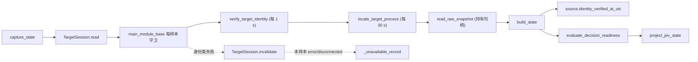

# Plan P05 — 采样会话与目标身份

## 1. Metadata

- Plan ID: P05
- Iteration: 006-jev-runtime-loop
- Status: Approved
- Implementation: Complete（T1–T3）
- Verification: Passed（仅P05 / R12–R14，见 ../verify.md；不代表Iteration整体通过）
- Depends on: None（采集侧改造，与 P01–P04 无代码依赖；为 Runtime Loop 的观察节奏提供前置能力）
- Requirement IDs: R12、R13、R14

## 2. Goal

把 State 采集从"每个样本重新发现并完整验证目标进程"改为"每个运行持有一个已验证的目标会话"。会话在建立时一次性完成进程定位与完整磁盘身份验证，随后持有目标进程句柄；每个样本只做廉价守卫（存活 + 主模块路径 + 模块基址），并按各自周期重新执行磁盘身份验证与进程唯一性解析。这样每样本的固定采集开销从实测约 33 ms 降到约 5–6 ms（不含周期摊销），使 Runtime Loop 的 100–250 ms 观察节奏在采集侧不再受限。同时把"身份是在何时被验证的"显式写入 State 的 `source`，使采集证据链在放宽验证频率后仍然诚实。此 Plan 只改采集侧；LLM 决策往返（实测 Router 676 ms、反应周期 1360 ms）不是本 Plan 范围，见第 3 节与第 8 节。

### Requirement Mapping

| Requirement ID | Outcome in this Plan | Acceptance signal |
|---|---|---|
| R12 | 每个样本的固定采集开销不再包含进程枚举与磁盘身份验证；稳态下每样本只做持有句柄守卫与真实内存读取。 | 用可注入 clock 与调用计数器证明：稳态每样本 0 次 `locate_target_process`、0 次 `verify_target_identity`；每 1 s 恰 1 次磁盘身份验证、每 30 s 恰 1 次唯一性解析。 |
| R13 | 身份保证从"每样本全量验证"改为"会话建立时全量验证 + 每样本廉价守卫 + 周期性重验证"，并以持有句柄消除 PID 复用；守卫失败使本样本 fail-fast，并在下一个样本重新解析。 | 守卫与两类重验证的触发时机、失败样本的状态输出、以及失败后下一个样本的重解析均可由固定输入与 fake clock 验证；歧义检测窗口不超过 30 s 且被显式记录。 |
| R14 | State 的 `source` 增加 `identity_verified_at_utc`，记录该样本所依据的最近一次成功的磁盘身份验证时间。 | `source` 含该字段；`project_jev_state` 输出不含 `source`；Trace 文本不含该字段；`schema_version` 仍为 1。 |

## 3. Scope

### In scope

- 新增 `runtime/session.py` 的目标会话类型，职责是"已验证目标的持有期"，不新增进程发现或内存读取原语：
  - 建立会话：调用现有 `locate_target_process` 与 `verify_target_identity` 各一次，取得并**持有**目标进程句柄（`ReadOnlyMemory`），缓存 `pid`、`ProcessInfo`、`ProcessIdentity`、模块基址与两个时间戳。
  - 每样本守卫：继续使用现有 `main_module_base(pid, expected_path)`（实测约 0.05 ms）复核 PID 存活、主模块路径仍是锁定 exe，并取得模块基址；真实内存读取路径中 `ReadOnlyMemory.read_bytes` 现有的 `GetExitCodeProcess` 检查保持不变。
  - 周期性重验证：距上次磁盘身份验证达到 `IDENTITY_REVERIFY_SECONDS`（默认 1.0 s）时重跑 `verify_target_identity`；距上次唯一性解析达到 `RESOLUTION_REVERIFY_SECONDS`（默认 30.0 s）时重跑 `locate_target_process`，并要求返回的 PID 与会话 PID 一致。
  - 持有时长：`ReadOnlyMemory` 句柄在会话有效期内保持打开，不再每样本开关。
  - 时间来源：使用可注入的 `clock`（默认 `time.monotonic`），与 `JevRuntimeLoop` 的现有可注入 clock 风格一致。
- 失败分类与后果（只依赖现有异常类型，不新增异常层次）：
  - **身份/存活类失败**（`TargetNotRunningError`、`AmbiguousTargetError`、`IdentityMismatchError`、`ProcessExitedError`，以及守卫或解析中的 `ProcessDiscoveryError`）→ 作废会话（关闭句柄、清空缓存）并让异常冒泡；本样本按现有规则输出 `status: "error"` 或 `"disconnected"`，下一个样本从头重新解析。
  - **数据读取类失败**（`MemoryAccessError`、`ShortReadError`、`NullPointerError`、`ArrayFormatError`、`ValueError`、`KeyError`）→ 不作废会话，身份仍然有效；由 `capture_state` 现有的无效样本重试路径处理，行为与今天一致。
- 把 `state/builder.py` 的默认采集路径从 `_capture_raw` 切换到会话：
  - `capture_state(raw_reader=None, session=None)` 保持向后兼容。传入 `raw_reader` 时完全绕开会话（现有测试全部走这条路径）；未传入时使用模块级惰性默认会话。
  - 会话内部对 `read()` 加一把无争用锁，使模块级 `capture_state()` 在多线程下也安全。
  - 会话读取结果仍返回 `(raw, source)` 二元组，`build_state` 与后续 State 构造不变。
- 在 `source` 中新增 `identity_verified_at_utc`：取值为会话最近一次成功的磁盘身份验证时间（UTC、毫秒精度，与现有 `observed_at_utc` 格式一致）。连接不可用样本（`_unavailable_record`）不携带该字段或其为 null；不新增 `source` 的其他字段，不改 `source` 既有键的含义。
- 更新 `docs/architecture.md` 的 `runtime/` 与 State 契约描述，写明采集侧的身份保证已从"每样本全量验证"改为"会话验证 + 每样本廉价守卫 + 1 s 磁盘身份重验证 + 30 s 唯一性重解析"，以及歧义检测窗口不超过 30 s。

### Out of scope

- **不改动作路径。** `actions/executor.py` 的 `_target_context`（每次动作完整验证）与 `_capture_for_target`（用 State `source` 对照自身身份）保持原样；写路径上约 27 ms 不影响动作正确性，改动会扩大对动作语义的风险面。
- **不改数组/字段批量读。** 实测 capture 中身份验证占 27.6 ms、全部真实内存读取只占约 5.4 ms，批量读取的收益上限不足 5 ms，不值得在本 Plan 扩大 diff。若后续现场测量显示稳态每样本仍超过 10 ms，再单独评估（见第 8 节）。
- **不做决策侧解耦。** 让 JEV 退出每 tick 关键路径、由本地策略在 100–250 ms 内拍板，是达成"真实 100 ms 反应"的另一半前提，属后续 Plan；本 Plan 完成后反应周期仍由 LLM 往返主导。
- 不改 `main.py probe`、`tests/capture_live_validation.py` 与 `actions/executor.py` 的既有身份验证调用点。
- 不改 State schema 版本、`availability`/`evidence`/`errors` 语义、JEV projection allowlist 或 Trace 事件结构。
- 不改 `win32process.EnumProcesses()` 的 pywin32 包装（实测裸 `K32EnumProcesses` 更便宜，但会话化后枚举只在解析时执行，收益不足）。
- 不新增会话的显式关闭入口，也不修改 `main.py` 与 `dashboard/server.py` 的收尾路径（OD-16 已确认 Option A）；句柄只在会话作废或重解析时关闭旧句柄。
- 本 Plan 阶段不调用真实 JEV API、不启动或操作游戏、不运行测试。

## 4. Impact Surface

### 4.1 File and Symbol Map

```text
runtime/
  session.py
  __init__.py
state/
  builder.py
docs/
  architecture.md
tests/
  test_session.py
  test_state.py
```

```text
File: runtime/session.py
Module: 已验证目标进程的持有期与采样守卫（新增）
Symbols:
  IDENTITY_REVERIFY_SECONDS — 磁盘身份重验证周期（默认 1.0 s）
  RESOLUTION_REVERIFY_SECONDS — 进程唯一性重解析周期（默认 30.0 s）
  TargetSession — 建立/持有目标会话；提供 read()、invalidate()、close()（仅在作废或重解析时关闭旧句柄，不是 CLI 收尾入口）、identity_verified_at_utc
  TargetSession.read — 每样本守卫 → 按周期重验证 → 用持有句柄读取原始快照，返回 (raw, source)
  TargetSession.invalidate — 身份类失败后作废会话：关闭句柄并清空缓存，使下一次 read() 重新解析
```

```text
File: runtime/__init__.py
Module: runtime 包公开表面
Symbols:
  TargetSession — 与会话周期常量一并导出，保持包内公开类型的一致性
```

```text
File: state/builder.py
Module: All State 构造与默认采集路径
Symbols:
  _capture_raw — 改为委托默认会话，不再在每个样本重新定位并验证进程
  _default_session — 模块级惰性默认会话（含锁）
  capture_state — 扩展签名 session=None 保持向后兼容；source 透传 identity_verified_at_utc
  _unavailable_record — 连接不可用记录不含身份验证时间
```

```text
File: docs/architecture.md
Module: 已实现 runtime / State 契约说明
Symbols:
  runtime section — 记录会话生命周期与守卫/重验证周期
  State contract — 记录 source.identity_verified_at_utc 的含义与证据边界
```

```text
File: tests/test_session.py
Module: 会话生命周期、守卫与重验证的固定输入回归（新增）
Symbols:
  TargetSessionTests — 覆盖建立一次、稳态零枚举、周期触发、失败分类、作废与重解析
```

```text
File: tests/test_state.py
Module: 固定输入的 State 契约回归
Symbols:
  StateBuilderTests — 增加 source.identity_verified_at_utc、错误样本与 projection 隔离检查
```

### 4.2 End-to-End Flow



## 5. Decision

### 5.1 Open Decision

- None.

### 5.2 Confirmed Decision

#### Confirmed Decision Record — OD-17

- Decision ID: OD-17
- Confirmed choice: 接受把进程歧义的 fail-closed 检测从"每样本"放宽为"周期性"，窗口不超过 30 s；会话有效期内即使出现第二个同名同路径进程，Loop 也继续操作原本已验证并持有句柄的目标实例。
- Source: 用户在本次 Plan 执行的交互提问中选择"接受周期性歧义检测"。
- Date: 2026-09-27
- Reason: 每样本歧义检测必须枚举全部进程（实测 11–20 ms），是固定开销中最大的一项；放宽后每样本只保留约 0.05 ms 的守卫。持有的句柄保证读取永远指向原本已验证的进程，因此"读错进程"风险不由该放宽引入。

#### Confirmed Decision Record — OD-18

- Decision ID: OD-18
- Confirmed choice: 磁盘身份重验证周期为 1.0 s，进程唯一性重解析周期为 30.0 s；两者独立配置且各自记录触发时间。
- Source: 用户在本次 Plan 执行的交互提问中选择"身份 1s / 唯一性 30s"。
- Date: 2026-09-27
- Reason: 磁盘身份（版本/PE/SHA-256，实测 6.9 ms）是锁定构建的可信来源，需要较紧的窗口；唯一性解析（实测 20.5 ms）只覆盖"出现第二个实例"这一低概率情形，可以更稀疏。100 ms 节奏下摊薄约 0.73 ms/样本。

#### Confirmed Decision Record — OD-19

- Decision ID: OD-19
- Confirmed choice: 守卫或重验证失败时，本样本立即按现有规则输出 `status: "error"`/`"disconnected"` 并作废会话；下一个样本从头重新解析，不在同一次调用内静默重解析。
- Source: 用户在本次 Plan 执行的交互提问中选择"本样本 fail-fast，下样本重解析"。
- Date: 2026-09-27
- Reason: 与仓库既有 fail-fast 约定一致，并保持与今天相同的可观测性——瞬时身份失败仍然会产生一个可见的错误样本，不会被静默吸收。

#### Confirmed Decision Record — OD-20

- Decision ID: OD-20
- Confirmed choice: State 的 `source` 增加 `identity_verified_at_utc`，记录该样本所依据的最近一次成功磁盘身份验证时间；该字段为 additive，`schema_version` 保持 1。
- Source: 用户在本次 Plan 执行的交互提问中选择"加 identity_verified_at_utc"。
- Date: 2026-09-27
- Reason: 缓存身份后，`source` 中的 `pid`/`sha256` 只证明"会话曾通过验证"，不再隐含"本样本刚被验证"。显式时间戳使采集证据链在放宽验证频率后仍然诚实。已核实该字段不进 JEV projection（`state/projection.py` 不输出 `source`）也不进 Trace（`jev/trace.py` 的 `summarize_jev_state` 不输出 `source`）。

#### Confirmed Decision Record — OD-16

- Decision ID: OD-16
- Confirmed choice: Option A —— 不新增会话的显式关闭入口，也不修改 `main.py` 与 `dashboard/server.py` 的收尾路径。句柄只在会话作废或重解析时关闭旧句柄；进程退出时由操作系统释放。
- Source: 用户在本次 Plan 执行的交互提问中回复"OD-16 A"。
- Date: 2026-09-27
- Reason: 句柄持有本身就是本 Plan 所需的身份保证语义，而重解析路径已经必须关闭旧句柄；显式关闭带来的资源收益不足以抵消多改两个 CLI/服务入口以及 `CloseHandle` 失败处理策略的成本。若后续需要把会话注入更多入口，再评估上下文管理器方案。

## 6. Task

### Task

- [x] T1 — 新增 TargetSession 与采样守卫
  - Objective: 实现"已验证目标的持有期"：建立时一次性定位并完整验证，持有目标句柄；每样本执行廉价守卫；按 1 s / 30 s 周期分别重验证磁盘身份与进程唯一性；身份类失败作废会话；时间来源可注入以便测试；不新增 CLI 收尾关闭入口（OD-16 Option A），句柄只在作废与重解析时关闭。
  - Affected files:
    ```text
    Expected:
      runtime/session.py
      runtime/__init__.py
      tests/test_session.py
    Actual:
      runtime/session.py
      runtime/__init__.py
      tests/test_session.py
    ```
  - Implementation backfill:
    ```text
    Notes: 已实现 runtime/session.py 的 TargetSession（懒解析建立会话、持有 ReadOnlyMemory 句柄、每样本 main_module_base 守卫、1 s 磁盘身份重验证、30 s 唯一性重解析、身份/存活类失败作废会话并原样冒泡、数据读取类失败不作废、read() 全程单锁、模块级 utc_now 格式与 state/builder.py::_now 一致）。runtime/__init__.py 导出两个周期常量与 TargetSession。默认 snapshot reader 采用函数内惰性导入 read_raw_snapshot，避免 game.reader → runtime.memory → runtime.session → game.reader 的循环导入；memory_factory 直接默认 ReadOnlyMemory（无循环）。新增 tests/test_session.py（13 用例，全部 fake 协作者，不触碰真实进程）。验证命令与结果：`uv run python -m unittest discover -s tests -p "test_session.py"` → Ran 13 tests, OK；`uv run python -m unittest discover -s tests -p "test_*.py"` → Ran 142 tests, OK（基线 129，无新增失败）；`uv run python -c "import runtime"` / `import runtime.session` / `import state.builder` → 全部成功。等 T2 完成后再跑 V22/V23 全量。
    Changed files:
      runtime/session.py (新增 TargetSession、周期常量、utc_now、_default_snapshot_reader)
      runtime/__init__.py (导出 IDENTITY_REVERIFY_SECONDS、RESOLUTION_REVERIFY_SECONDS、TargetSession)
      tests/test_session.py (新增，覆盖 V19–V21)
    ```

- [x] T2 — 把默认采集路径切换到会话并记录身份验证时间
  - Objective: `capture_state` 默认走会话且保持 `raw_reader` 注入路径不变；模块级默认会话惰性创建并加锁；`source` 透传 `identity_verified_at_utc`；连接不可用记录不携带该字段。
  - Affected files:
    ```text
    Expected:
      state/builder.py
      tests/test_state.py
    Actual:
      state/builder.py
      tests/test_state.py
    ```
  - Implementation backfill:
    ```text
    Notes: state/builder.py 新增模块级惰性默认会话 _default_session（_DEFAULT_SESSION_LOCK 保护，首次使用时构造 TargetSession，不在 import 时构造）与可重置入口 reset_default_session（best-effort close，吞掉 MemoryAccessError）。_capture_raw 改为 `return _default_session().read()`，不再每样本定位/验证。capture_state 扩展为 capture_state(raw_reader=None, session=None)，优先级 raw_reader > session > 默认会话；raw_reader 非 None 时完全不触碰默认会话。尝试重试与 `except (ProcessDiscoveryError, OSError, RuntimeError, ValueError, KeyError) → _unavailable_record`（含 status = disconnected/error 判别）保持原样；build_state 与 _unavailable_record 未改动，source 由 session.read() 透传 identity_verified_at_utc。清理已不再引用的导入：read_raw_snapshot、ReadOnlyMemory、locate_target_process、main_module_base、verify_target_identity；保留 ProcessDiscoveryError/TargetNotRunningError。tests/test_state.py 新增 CaptureSessionTests（6 用例，fake session，覆盖 V22：source 含 identity_verified_at_utc 及其取值、project_jev_state 与 build_trace_event 均不含该字段、schema_version==1、raw_reader 注入路径不触碰默认会话、TargetNotRunningError→disconnected 与 ProcessDiscoveryError→error 且不可用记录无该字段），tearDown 调用 reset_default_session。验证命令与结果：`uv run python -m unittest discover -s tests -p "test_state.py"` → Ran 34 tests, OK；`uv run python -m unittest discover -s tests -p "test_jev_trace.py"` → Ran 7 tests, OK；`uv run python -m unittest discover -s tests -p "test_session.py"` → Ran 13 tests, OK；`uv run python -m unittest discover -s tests -p "test_*.py"` → Ran 148 tests, OK（T1 后基线 142，新增 6 用例，无回归）。
    Changed files:
      state/builder.py (新增 _default_session / reset_default_session；_capture_raw 委托会话；capture_state 接受 session 参数并保持 raw_reader 注入优先；移除失效导入)
      tests/test_state.py (新增 CaptureSessionTests，覆盖 V22)
    ```

- [x] T3 — 更新架构说明中的身份保证与采集契约
  - Objective: 在 `docs/architecture.md` 写明会话生命周期、守卫与两类重验证周期、歧义检测窗口，以及 `source.identity_verified_at_utc` 的含义与证据边界；不改 JEV projection 与 Trace 描述。
  - Affected files:
    ```text
    Expected:
      docs/architecture.md
    Actual:
      docs/architecture.md
    ```
  - Implementation backfill:
    ```text
    Notes: docs/architecture.md 新增 `## Capture session and identity guarantee` 小节（置于 State contract 与 Read-only boundary 之间，沿用既有英文与 `##` 标题层级）：记录会话建立时一次性解析 + 完整磁盘身份验证并持有进程句柄；每样本只做存活 + 主模块路径 + main_module_base 守卫；两类独立重验证周期 1.0 s 磁盘身份 / 30.0 s 进程唯一性；歧义检测窗口不超过 30 s；持有句柄使 PID 复用结构性不可能，进程退出仍可检测；`source.identity_verified_at_utc` 表示最近一次成功验证时间、不声明样本在采集时刻被验证，且 pid/exe_sha256 不再隐含每样本验证；连接不可用样本不带该字段；该字段刻意排除于 JEV projection 与 Trace 之外。未改动 JEV projection 描述与任何 Trace 描述。
    Changed files:
      docs/architecture.md (新增 Capture session and identity guarantee 小节)
    ```

## 7. Validation

### Traceability

| Check ID | Requirement ID | Task ID | Check | Tier and reason | Expected evidence | Delivery impact / escalation condition |
|---|---|---|---|---|---|---|
| V19 | R12 | T1、T2 | 用可注入 clock 与调用计数器（包装 `locate_target_process`、`verify_target_identity`、`main_module_base`、`read_raw_snapshot`）跑一串样本，验证稳态每样本枚举次数为 0、磁盘身份验证次数为 0，且仅在跨过 1 s / 30 s 边界时各触发 1 次。 | G1：这是本 Plan 的核心结果，且调用次数是确定性断言，不依赖机器速度。 | 固定 clock 序列下每个样本的四类调用计数矩阵；跨边界样本恰好各多 1 次；会话建立时恰好各 1 次。 | 稳态仍每样本枚举或做磁盘校验、或周期边界不触发，说明 R12 未达成，阻塞交付。 |
| V20 | R13 | T1 | 对持有句柄守卫、磁盘身份重验证、唯一性解析分别注入失败，验证：异常原样冒泡、会话被作废（句柄已关闭）、下一个样本重新执行完整解析且成功后恢复正常采样。 | G1：证明 fail-fast 与重解析语义，以及会话不会停留在无效状态。 | 每个失败注入点产生一个错误样本，随后样本重新调用定位与验证各一次；数据读取类失败（`MemoryAccessError` 等）不作废会话且不触发重解析。 | 失败被静默吸收、会话保持无效状态、或数据读取失败被误判为身份失败而反复重建会话，阻塞交付。 |
| V21 | R13 | T1 | 用 fake 的定位/验证结果覆盖：第二次解析返回不同 PID、返回多个匹配（歧义）、返回零匹配、主模块路径变化、磁盘摘要不符。 | G1：这些分支是放宽验证频率后仍然必须成立的 fail-closed 保证。 | 每个分支抛出对应既有异常类型（`IdentityMismatchError`/`AmbiguousTargetError`/`TargetNotRunningError`），且不产生任何内存读取。 | 歧义或身份不符时仍继续读取或继续进入后续流程，阻塞交付。 |
| V22 | R14 | T2 | 断言正常运行样本的 `source` 含 `identity_verified_at_utc` 且取值等于最近一次成功验证时间；断言 `project_jev_state` 输出不含 `source`；断言 `build_trace_event` 文本不含该字段；断言 `schema_version` 仍为 1；断言 `raw_reader` 注入路径不产生该字段。 | G1：证据字段的正确性与隔离直接决定采集记录是否可信且不泄漏。 | 字段存在性与取值断言全部通过；projection 与 Trace 文本均不含该字段；注入路径样本无该字段。 | 字段缺失、取值不是验证时间、泄漏进 projection/Trace，或注入了破坏性 schema 变更，阻塞交付。 |
| V23 | R12 | T2 | 全量回归：uv run python -m unittest discover -s tests -p "test_*.py" | G1：改动位于所有采集入口的公共路径，必须确认既有 State、JEV、Dashboard 契约不回归。 | 既有全部测试通过，无新增失败。 | 任一既有测试失败，阻塞交付。 |
| V24 | R12、R13 | T2 | Human 在受支持的真实对局中运行有界采样（如 `snapshot --interval-ms 100`）并记录每样本实际耗时与 loop 周期，与本次实测基线（约 33 ms/样本）对照。 | G2：真实耗时为机器相关且依赖现场负载，不影响本 Plan 的契约正确性；但若稳态仍超过 10 ms，则说明 R12 目标未达成。 | Human 留存的耗时记录与周期分布；稳态每样本明显低于基线。 | 默认不阻塞交付；若稳态每样本 > 10 ms，升级为 G1 并重新评估数组/字段批量读。

### Commands

- V19–V21：uv run python -m unittest discover -s tests -p "test_session.py"
- V22：uv run python -m unittest discover -s tests -p "test_state.py" 与 uv run python -m unittest discover -s tests -p "test_jev_trace.py"
- V23：uv run python -m unittest discover -s tests -p "test_*.py"
- V24：仅在 Human 显式调用 `$sdd-verify` 并提供受支持游戏时运行；Plan/Implementation 不启动游戏。

### Implementation evidence

- 同步记录（2026-09-27，本次仅Plan更新）：P05/T1–T3已完成，verify.md仅R12–R14结论Passed；既有148项测试通过，受控现场稳态中位3.49ms、p95 4.13ms。本次未重跑检查，数据不证明动态JEV或P03异步路径。

- V22（G1，已通过）：`uv run python -m unittest discover -s tests -p "test_state.py"` → Ran 34 tests, OK；`uv run python -m unittest discover -s tests -p "test_jev_trace.py"` → Ran 7 tests, OK。覆盖：正常样本 `source` 含 `identity_verified_at_utc` 且取值等于注入的成功验证时间；`project_jev_state(record)` 不含 `source` 也不含 `identity_verified_at_utc`；`build_trace_event(cycle, run_id="x")` 的 `json.dumps` 文本不含 `identity_verified_at_utc` 与 `"source"`；`schema_version == 1`；`raw_reader` 注入路径的 `source` 不新增该键，且以 monkeypatch 使默认会话访问即失败仍成功（默认会话未被触碰）；注入 `TargetNotRunningError` → `disconnected`、`ProcessDiscoveryError` → `error`，二者 `valid` 为 False 且 `source` 无 `identity_verified_at_utc`。
- V23（G1，已通过）：`uv run python -m unittest discover -s tests -p "test_*.py"` → Ran 148 tests, OK, exit 0（T1 后基线 142，新增 6 用例，无既有测试回归）。`test_session.py` 保持 Ran 13 tests, OK。`uv run python -c "import state.builder, main, actions.executor, dashboard.server, jev.loop"` → 导入成功。

### Manual checks

- V24 — Human 启动目标游戏并运行有界采样，记录 `snapshot --interval-ms 100` 的每样本耗时与 `jev-loop --interval-ms 100` 的周期分布；与 2026-09-27 从既有 Trace 反推的约 33 ms/样本基线对照。不要求通关或完整对局。
- 手工确认 — 三个 CLI（`probe`、`snapshot`、`serve`）在目标游戏退出后仍按既有行为输出 `disconnected`，并在游戏重新启动后恢复采样（会话失效与重解析的外部表现）。

## 8. Risks

- **歧义检测放宽是本 Plan 唯一的策略性安全变化。** 会话有效期内出现第二个同名同路径进程时，最多 30 s 内不会拒绝出手。持有句柄保证读取始终指向原本已验证的进程，因此不会"读错进程"；但"出现歧义时拒绝操作"这一 003/004 的既有策略被放宽，须由 OD-17 的批准覆盖。
- **`source` 的证据语义变化。** 缓存后 `pid`/`sha256` 不再隐含"本样本刚被验证"。若下游（含 Human 审阅）仍按旧语义解读，会产生错误结论。`identity_verified_at_utc` 是缓解手段，必须在 `docs/architecture.md` 明确写入，并在后续 Verify/现场证据中按新语义解释。
- **`actions/executor.py` 的一致性检查依赖 `source` 身份字段。** `_capture_for_target` 用 State `source` 对照执行器自身解析的身份；会话重解析后若 `source.pid` 与执行器的 `context.process.pid` 不同，该检查会 `_StateUnavailable` 并 fail closed。这是期望行为，但会表现为"动作被拒绝"，需要与真实的身份不一致区分。本 Plan 不改执行器。
- **实测基线来自一次非当前格式的 Trace 与一台机器。** 33 ms/样本是从 `.log/test.jsonl` 的周期与 Router 延迟反推得出（该文件格式早于当前 `jev/trace.py`），并非直接计时。组件耗时是本次直接实测的，但整体数字应视为数量级证据；V24 用于在现场确认。
- **本 Plan 不达成"100 ms 真实反应"。** 采集侧只是前提之一；实测 Router 往返 676 ms、反应周期 1360 ms 仍由 LLM 决策主导。若把本 Plan 完成等同于达成反应目标，会得到错误结论。决策侧解耦（本地策略在 tick 内拍板、JEV 退为异步顾问）是后续 Plan 的范围。
- **持有句柄改变资源语义。** 会话有效期内目标进程句柄保持打开；若目标进程反复重启，重解析路径必须关闭旧句柄，否则累积泄漏。V20 覆盖该路径，但需要人工确认 `close()` 失败时的处理不会掩盖身份错误。OD-16 已确认不新增 CLI 收尾关闭入口：长驻进程（`serve`、`jev-loop`）在整个运行期保持一个句柄属预期行为，由操作系统在进程退出时释放。
- **`capture_state` 是多个入口的公共默认值**（`jev/loop.py`、`dashboard/server.py`、`actions/executor.py`、`main.py`、`tests/capture_live_validation.py`）。改默认路径会同时影响这些入口；`raw_reader` 注入路径保持不变是控制回归面的关键。
- **模块级默认会话的测试隔离。** 若测试之间共享默认会话，会出现跨用例状态泄漏。`raw_reader` 注入路径必须完全不触碰默认会话，且会话需要可重置的测试入口。

## 9. Approval

- Status: Approved
- Approved by: Human
- Approval date: 2026-09-27
- Notes: Human 于 2026-09-27 明确批准本 Plan。该批准覆盖 P05 的 Goal、Scope、Impact Surface、Task 与 Validation 路径，并覆盖其 Requirement Mapping 中的 R12–R14，使三者成为 Iteration 需求基线的一部分。OD-16 至 OD-20 已在批准前确认，P05 无剩余 Open Decision。本批准不延伸至 P03（其 OD-15 仍开放）或其它 Plan。2026-09-27 Implementation 启动前，Human 额外确认“P05 获批即足够，仅 P05 范围内实施”：本次实施限于 P05/T1–T3，不触碰 P03 范围，Iteration 级审批状态保持 Pending human review。
