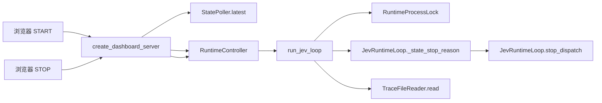

# Plan 1 — JEV 进程生命周期

## 1. Metadata

- Plan ID: P01
- Iteration: `007-dashboard-jev-runtime`
- Status: Implemented
- Depends on: None
- Requirement IDs: R2, R3, R4, R5, R7

## 2. Goal

让本机 Dashboard 启动并管理一个真实的 `jev-loop` 子进程；启动前验证游戏正在进行，以 OS 级互斥覆盖网页和命令行，STOP 明确终止网页所启动的进程。服务端状态不依赖 Trace 最后一条是否及时写成。

### Requirement Mapping

| Requirement ID | Outcome in this Plan | Acceptance signal |
|---|---|---|
| R2 | 一键启动与状态查询 | 控制接口回报 PID/运行状态，实际子进程进入 Loop |
| R3 | `jev-loop` 全入口互斥 | 同时/重复启动仅一个获得锁，退出前另一方被拒 |
| R4 | STOP 结束受管子进程并回到可启动 | STOP 后子进程退出、锁释放、状态可解释 |
| R5 | 复用 `_state_stop_reason` | 暂停/通关/离开 playing/断连的 Trace 和进程结果一致 |
| R7 | 失败与刷新可见 | 启动失败、CLI 占用、Dashboard 重启不误报成功 |

## 3. Scope

### In scope

- `serve` 使用固定本机 Trace 目标（默认 `.log/jev-dashboard.jsonl`，现有 `--jev-trace-file` 可覆盖）；控制接口不接受浏览器路径或命令参数。
- 页面启动仅在共享 State 最新有效且 `game.phase == playing`、`game.paused == false` 时接受；若状态未知/断连，显示原因并拒绝。
- 子进程执行当前 Python 解释器的 `main.py jev-loop --trace-file <serve 配置的路径>`；以仓库目录为工作目录，沿用现有环境配置预检。标准输出/错误流须有界收集或重定向，不能堵住 Loop。
- CLI `jev-loop` 在打开/截断 Trace 之前获取 OS 级单实例锁，并在任何退出路径释放。固定仓库锁身份覆盖网页与 CLI；不能仅靠页面按钮禁用或 PID 查询。
- STOP 只作用于本 Dashboard 实际启动且仍存活的进程，先阻止重复 STOP/START 竞争，随后强制结束并等待确认；无法结束要报告失败且继续占用。Dashboard 停机时同样回收其子进程。
- 控制接口仅固定 GET 状态与 POST START/STOP，拒绝意外 body、方法、Origin；保持 loopback 绑定、无 CORS、无任意命令能力。需制定同源请求校验，避免其他网页发起写操作。

### Out of scope

- 不用网页强制结束其他终端或 Dashboard 实例启动的 Loop；外部占用只显示“已有 JEV 进程”并禁用 START。
- 不改现有 JEV 决策算法与游戏内动作门槛；不引入第三方进程管理包。

## 4. Impact Surface

### 4.1 File and Symbol Map

```text
main.py
dashboard/server.py
dashboard/runtime_control.py             (expected new)
jev/loop.py
tests/test_jev_cli.py
tests/test_jev_loop.py
tests/test_web.py
README.md / README.zh-CN.md (implementation时按实际文档结构)
docs/usage.md
```

```text
File: main.py
Symbols:
  run_serve — 传入固定 Trace 路径与控制器配置
  run_jev_loop — 启动前互斥、原有配置预检/Trace/Loop/退出摘要
  build_parser — 保持现有 CLI 参数兼容并说明 serve 的受控能力
```

```text
File: dashboard/runtime_control.py (new)
Symbols:
  RuntimeController — 子进程启动、存活复核、STOP、退出摘要与同步互斥
  RuntimeProcessLock — 跨进程、崩溃自动释放的本机单实例锁
```

```text
File: dashboard/server.py
Symbols:
  StatePoller.latest — 启动前共享 State 事实来源
  TraceFileReader.read — 同一受控 Trace 的只读读取
  create_dashboard_server — 固定状态/START/STOP 路由和请求校验
  serve_dashboard — 创建与关闭 RuntimeController
```

```text
File: jev/loop.py
Symbols:
  JevRuntimeLoop._state_stop_reason — 既有 paused/level_finished/game_left_playing_phase/process_disconnected 判据；优先保持原状
  JevRuntimeLoop.stop_dispatch — 既有停止门槛；仅在必要时接入受控停止，不改变游戏语义
```

```text
File: tests/test_jev_cli.py
Symbols:
  CLI tests — 启动预检、锁竞争及失败不截断 Trace
```

```text
File: tests/test_jev_loop.py
Symbols:
  Loop tests — 既有自动停止回归；按新增接入补确切情景
```

```text
File: tests/test_web.py
Symbols:
  DashboardHttpTests — 控制接口、生命周期、只读路由兼容与同源约束
```

```text
File: README.md / README.zh-CN.md
Symbols:
  serve / jev-loop usage — 网页启动、外部占用、STOP 与 Trace 路径说明
```

```text
File: docs/usage.md
Symbols:
  网页仪表盘 / JEV 决策循环说明 — 同步原有只读描述与新 Runtime 控制边界
```

### 4.2 End-to-End Flow



## 5. Decision

### 5.1 Open Decision

None.

### 5.2 Confirmed Decision

#### Confirmed Decision Record — OD-01

- Decision ID: OD-01
- Confirmed choice: 仅当游戏已连接且正在进行时允许启动。
- Source: Human 在 2026-09-28 本次 Plan 交互明确选择推荐项。
- Date: 2026-09-28
- Reason: 避免启动后立即退出；让 START 的反馈符合实际可运行条件。

## 6. Task

### Task

- [x] T1 — 使所有 `jev-loop` 启动受 OS 级锁保护
  - Objective: 原子互斥、异常与崩溃释放；拒绝时不打开 Trace。
  - Affected files:
    ```text
    Expected: main.py, dashboard/runtime_control.py, tests/test_jev_cli.py
    Actual: main.py, dashboard/runtime_control.py, tests/test_jev_cli.py
    ```
  - Implementation backfill:
    ```text
    Notes: CLI 在配置及 Trace 打开前持有仓库身份对应的 Windows 字节锁；冲突拒绝，进程退出自动释放。增加同进程与跨进程互斥测试。
    Changed files: main.py, dashboard/runtime_control.py, tests/test_jev_cli.py
    ```
- [x] T2 — 建立 Dashboard 子进程与受控 HTTP 生命周期
  - Objective: 严格前置状态、并发 START、STOP、退出码与 Dashboard 关闭清理；同源固定接口。
  - Affected files:
    ```text
    Expected: dashboard/server.py, dashboard/runtime_control.py, main.py, tests/test_web.py
    Actual: dashboard/server.py, dashboard/runtime_control.py, main.py, tests/test_web.py
    ```
  - Implementation backfill:
    ```text
    Notes: 默认固定 Trace 路径；共享 State 限制 START；受管子进程的 STOP/关闭回收；同源、固定 JSON POST；状态包含占用、PID、退出码。
    Changed files: dashboard/server.py, dashboard/runtime_control.py, main.py, tests/test_web.py
    ```
- [x] T3 — 验证 CLI 自动终止与受控 STOP 的终态
  - Objective: 保持既有暂停/结束/退出判据，并使进程状态与 Trace 停止原因分工清楚。
  - Affected files:
    ```text
    Expected: tests/test_jev_loop.py, tests/test_jev_cli.py, tests/test_web.py; jev/loop.py only if needed
    Actual: tests/test_web.py, tests/test_jev_cli.py；jev/loop.py 与既有 Loop 测试无需修改
    ```
  - Implementation backfill:
    ```text
    Notes: 复核既有 _state_stop_reason：暂停、关卡结束、离开 playing、断连已自动停机；控制器 STOP 测试覆盖退出后再次启动；真实对局留待 Verify。
    Changed files: tests/test_web.py, tests/test_jev_cli.py
    ```
- [x] T4 — 更新运行说明
  - Objective: 说明网页启动、Trace 归属、CLI 互斥、STOP 和错误处理。
  - Affected files:
    ```text
    Expected: README.md / README.zh-CN.md（按实施时实际文档结构）, docs/usage.md
    Actual: README.md, README.zh-CN.md, docs/usage.md
    ```
  - Implementation backfill:
    ```text
    Notes: 中英文入门及详细使用说明同步 START/STOP、默认 Trace、单实例与可操作游戏的边界。docs/usage.md 是实施时发现的既有详细说明，补入本 Task 的 Impact Surface。
    Changed files: README.md, README.zh-CN.md, docs/usage.md
    ```

## 7. Validation

### Traceability

| Check ID | Requirement ID | Task ID | Check | Tier and reason | Expected evidence | Delivery impact / escalation condition |
|---|---|---|---|---|---|---|
| V1 | R2,R3 | T1,T2 | 页面启动真实子进程；双请求及 CLI 并发启动只有一个成功，锁占用时 Trace 未被截断 | G1: 防双控制 | 进程 PID、HTTP 冲突码、Trace 前后对照 | 失败阻塞 |
| V2 | R4 | T2,T3 | STOP 后子进程消失、锁释放、重新 START 成功；强制终止时可读退出状态 | G1: 闭环 | 进程句柄退出码与接口状态 | 失败阻塞 |
| V3 | R5 | T3 | 暂停、胜负/关卡结束、离开 playing、断连的 Loop 判据及网页终态 | G1: 自动停机 | Loop 测试、受控真机 Trace/状态 | 缺真机证据须记录未验证 |
| V4 | R2 | T2 | 未连接、暂停、状态未知均拒绝 START，进行中可启动 | G1: 授权条件 | HTTP 断言和受控运行 | 失败阻塞 |
| V5 | R7 | T1,T2 | 配置失败、外部 CLI 占用、页面刷新/服务重启、请求伪造 | G2: 当前可信度风险 | 测试/手工记录状态和原因 | 若产生第二进程或错误动作升 G1 |

### Commands

- 目标环境与回归（V1–V5）：`uv run python -m unittest discover -s tests -p "test_*.py"`
- 定向（V1,V2,V4,V5）：`uv run python -m unittest tests.test_web tests.test_jev_cli`
- 定向（V3）：`uv run python -m unittest tests.test_jev_loop`
- 现场（V1–V4）：`uv run python main.py serve`，在 `/jev` 启动/停止；另开 CLI 竞争试验，观察 Trace 与进程状态。

### Implementation evidence

Implementation 证据（T1–T4）：`uv run python -m unittest tests.test_jev_cli tests.test_web` 通过；最终 `uv run python -m unittest discover -s tests -p "test_*.py"` **425 tests OK**；跨 Python 进程持锁测试通过，HTTP POST 403/409/202/200、受管进程 STOP/再次 START 测试通过。未进行真实游戏/API 运行；V1–V4 的真机部分留给正式 Verify。

### Manual checks

- V1,V2 — 在游戏进行中点击 START、重复点击、STOP、再次 START；核实只有一个真实进程。
- V3 — 受控对局分别触发暂停、关卡终止与退出，核对 `runtime_stop.stop_reason` 与页面状态。
- V5 — 终端手工运行一个 `jev-loop` 后访问页面，核对占用提示和 STOP 不触及外部进程。

## 8. Risks

- Windows 锁要由实际 Loop 进程持有，而非仅由 Dashboard 父进程持有；父进程退出后子进程仍存活时必须继续阻止第二个 Loop。
- START 返回后子进程可能因 `.env` 缺失立即退出；界面必须显示启动失败及退出原因，不能以创建 PID 判为成功。
- 强制 STOP 可能无法写 `runtime_stop`，控制器的终态与 Trace 应清晰区分。
- Windows 子进程输出若用未读取的 PIPE 会阻塞；避免此路径。

## 9. Approval

- Status: Approved
- Approved by: Human
- Approval date: 2026-09-28
- Notes: Human 在本次对话明确回复“approved”；OD-01 已确认。
