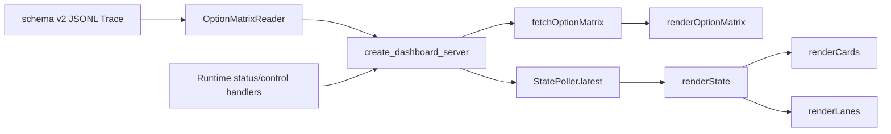

# Plan 2 — 三页界面、option 点阵与录制页

## 1. Metadata

> **第 2 次修订说明（2026-09-29）**：本 Plan 的 Historical backfill 段落（T1–T4、T8、T9 及 4.1/6 中
> 对 `dashboard/static/app.js` 的描述）如实记录了当时的实施事实，**保留不改**。但从第 2 次修订起，
> 取证对象已变更为 `dashboard/static/viewmodel.js` + `dashboard/static/recording.js`：
> `app.js` 已删除并拆分，`/` 已由草坪主页改为录制页（世界模型 / 800×600 游戏窗口 / JEV 决策轨迹），
> 新增 `dashboard/runtime_control.py`、`tools/`。当前有效的验证路径见 §7 Commands 与 Traceability 的 V17。


- Plan ID: P02
- Iteration: `007-dashboard-jev-runtime`
- Status: **Revised, Pending re-approval**（2026-09-29 新增 T11/V17）（T1–T10 已实施；待正式 Verify）
- Depends on: P01 的状态/控制接口契约
- Requirement IDs: R1, R2, R6, R7, R8, R9, R10, R11, R12

## 2. Goal

已实施的三页统一视觉和 Runtime 控制区保留。本次修订把旧的“每 `job_end` 一点＋点击展开任务日志”替换为“每个当前 option 一点”：本局每个 question ID 保留最近一次请求的完整 option 集，按问题分组平铺；只有与该 option 同源并由 `action_result.boundary.status == success` 证实的游戏动作使其亮灯。删除截图红框内的任务详情、顺序列表和运行停止文字。同时修正草坪主页两处排版：僵尸详情不再用 56px 固定列承载行摘要，卡牌槽保持单行横向滚动但卡内分层。两项排版与点阵同批实施与验收（OD-06）。

### Requirement Mapping

| Requirement ID | Outcome in this Plan | Acceptance signal |
|---|---|---|
| R1 | 三页统一色彩、字体、像素边框/标记和响应布局 | 草坪、State、Runtime 的桌面/窄屏截图可读且交互保留 |
| R2 | Runtime 页面展示 START/STOP/状态 | 进行中、停止中、失败、占用状态与按钮一致 |
| R6 | 每类问题最新完整 option 点阵 | 对同一 run 的 plant/collect/management 各 question ID 与 Trace 概率键逐项对应，100 事件外不漏组 |
| R7 | 无 Trace、历史 v1、刷新和换局呈现清楚 | 不将旧点/旧运行混到当前运行 |
| R8 | 删除截图红框区域 | DOM 不再生成任务详情卡、两种顺序列表、runtime_stop 正文 |
| R9 | 成功执行点亮同源 option | 成功 plant 精确坐标亮点、成功 collect 点亮 true；模型选中但未执行或未确认不亮 |
| R10 | 僵尸详情不再被固定窄列挤断 | 多僵尸/长 HP 样本下行标题独占整行、每只僵尸独立信息块，短字段不断行 |
| R11 | 卡牌槽保持单行横向滚动但卡内分层 | 十张卡可横向逐张浏览，卡宽受控，未知类型/长编号、费用、冷却和可选状态各自成行可读 |

## 3. Scope

### In scope

- 视觉方向：深色近黑底、少量霓虹青/紫/酸绿强调、清晰网格与细像素轮廓；信息密度简约，拒绝全页繁复霓虹。数字和状态使用等宽/像素感字形，正文保持中文易读；优先系统字体与 CSS 绘制，不增加字体、图片或 CSS 框架依赖。
- 保留草坪 5×9、卡牌、观察标签、JSON 切换/复制、State profile 切换/展开等现有行为；重排并调整视觉层级。
- 第三页标题、导航、页脚文案改为 JEV Runtime，增加状态区、START 与 STOP；状态来自 P01 服务端，不从 Trace 猜测进程存活。按钮在未满足条件或请求进行时禁用，错误直接显示。
- 点阵以 `question_id` 为分组键；同一 run 每组用最后一次 `request_result.typed_answers[question_id]` 的 `probabilities` 全键作点（含 `none_of_the_above`）。`should_collect_now` 是 Noul，以 `true|false` 两点表示，`true` 使用记录的 p，`false` 为 1−p。保留最近一组，替换旧组时移除旧 option；`next_construction_type` 在暂未重问时保留本局最近一组。大于单个 Choice 上限时，`plant_lane` 与逐行 `plant_lane_target_*` 等实际提出的问题分别成组，不截断或伪造合并选项。
- 点以方阵/规则换行平铺；植物目标按类型及行列、其它问题按 option ID 给可读分组与悬停/键盘焦点名称。暗点表示有选项但无成功执行，亮点只表示可证实的执行，不用模型选中概率充当执行状态。新增/替换组可有短暂光效，尊重 reduced-motion。
- 仅当 `action_result` 的 `job_id` 与该组最新 `request_result` 同源、`boundary.status == success`、动作目标精确映射到该 option 时亮灯：plant 用 `type_name@r{row}c{col}`；collect 成功使 `should_collect_now:true` 亮。`construction_intent` 和 `next_construction_type` 是经营意图、没有直接游戏动作，保持暗点。失败、unverified、proposal_discarded、仅模型 choice 与旧 job 的迟到动作均不亮。缺失目标或问答证据时显示暗点/未知，不推断。
- 删除原截图红框内的任务详情卡、决策完成顺序、实际执行顺序、`runtime_stop` 正文及点选展开日志的交互。保留进程控制、简短组标题/计数和 option 名称提示；停机原因仍由控制状态承担，不造额外日志区。
- 后端用同一配置的 JSONL 文件提供“本局最新各 question option＋同源动作结果”的只读摘要，不能只依赖现有 100 条事件窗口。摘要按 run_id、文件替换/截断重置；仅处理完整有效记录，浏览器不能指定路径。现有 `/api/jev-trace` 契约保持兼容，不改变 Trace schema。
- 历史 schema v1 无完整问题 option，给出兼容提示而不伪造点；新 run 清空旧组和亮灯。页面刷新可由摘要恢复本局状态。
- 本次修订会同时触及固定路径 HTTP 摘要、页面脚本/布局、CSS、测试与用法文档，超过小改动 1–3 文件基线是因为“完整 option”和“真实执行亮灯”跨越 JSONL 读取与 DOM；不新增依赖或另起决策管线。
- 草坪主页僵尸区取消 `.lane-row` 的固定 56px 左列：`.lane-heading` 改为跨整行的行摘要（行号、数量、最近像素/格距），每只僵尸渲染为独立 `.zombie-detail` 信息块；短字段（`普通僵尸 · #0`、`X 836 · Y 430`）作为不断行的整体，总 HP 与各部位 HP/证据分层排列；桌面可在短字段上两列、长 HP 行占完整宽度，窄屏回到单列。多僵尸仍在观察面板内滚动，不逐字挤断，也不省掉 `未获取`/`待动态核验` 事实。
- 卡牌槽**保留单行横向滚动**（OD-05）：`.seed-card` 去掉趋近无界的 `min-width: max-content`，改为受控最小/最大宽度与 2–3 层行结构（槽位/类型名·编号 → 费用 → 冷却/卡牌可选）；卡内长名称和编号在字段内正常换行或提供完整 `title`/焦点名称，不裁掉费用、冷却或 `未获取` 状态。十张卡的总区块高度保持紧凑，横向滚动条和键盘滚动可见。
- 两项主页排版与 T5–T7 的 option 点阵在**同一批**实施与验收（OD-06）：同一次 `tests/test_web.py` 回归与同一次桌面/窄屏浏览器审阅，主页 DOM 断言与点阵 DOM 断言共存于同一测试文件。

### Out of scope

- 不做 WebGL、外部图像/字体下载或实时流新协议；现有 1 s Trace 轮询足够。
- 不展示 TypeSafe 原始敏感响应或超出 `jev.trace` allowlist 的数据；摘要仅含 option ID、必要分组/执行状态与安全概率值。
- 不按 job、action 或历史重复请求数量生成点；同一 question 只有本局最近一组。
- 不为管理选择制造游戏“执行”状态；不新增 JEV 策略或 Trace schema。
- 主页排版不改卡牌或僵尸的采样字段、证据级别、中文类型映射与 5×9 草坪几何；不把未知值猜成可用事实。

现状依据：`jev/questions.py` 定义动态 Choice 与 255 option 上限，`jev/client.py::build_plant_questions` 会在超限时拆为 lane/row 问题；`jev/strategy.py::build_plant_candidates` 由可支付卡牌 × 可种空格生成候选。`jev/trace.py::RuntimeEventBuilder._request_result_event` 已写出 `typed_answers`、run_id/job_id，`action_result` 已带目标与 Boundary 状态。当前 `dashboard/server.py::TraceFileReader.read` 仅返回最近 100 事件，`dashboard/static/jev-page.js::renderRuntimeTrace` 仍按 `job_end` 生成点并渲染红框日志；`tests/test_web.py` 仍断言旧行为。最近一局样本有 46 个 plant_target（45 个 potato_mine 位置＋弃选项）、11 个建设类型和 3 个经营操作；累计重复请求可超过 100，但不能当成 100 个不同的当前点。

新增两张截图的版面病灶已在源码定位：`style.css::.lane-row` 为 `display: grid; grid-template-columns: 56px minmax(0,1fr)`，而 `app.js::renderLanes` 把 `.lane-heading`（第 N 行 / N 只 / `最近：像素距禞未获取 · 格距未获取`）放进 56px 列，长中文标签只能逐字换行；右侧 `.zombie-detail` 又把名称、`X · Y`、距离、各部位 HP 与证据作为五个块垂直堆叠在 9px 字号下，形成长窄条。`style.css::.seed-card` 为 `grid-template-columns: auto minmax(66px,auto) auto auto` 加 `min-width: max-content`，`app.js::renderCards` 将槽位、类型名·编号、费用、冷却/可选四个字段平铺到同一行，使“未获取”费用与“已就绪”状态被挤在一起且卡宽无界。两者均需在保留全部采样字段与证据的前提下重排 DOM 层级与列定义。

## 4. Impact Surface

### 4.1 File and Symbol Map

```text
dashboard/static/index.html
dashboard/static/state.html
dashboard/static/jev.html
dashboard/static/style.css
dashboard/static/app.js
dashboard/static/state-page.js
dashboard/static/jev-page.js
dashboard/server.py
tests/test_web.py
README.md / README.zh-CN.md (implementation时按实际文档结构)
docs/usage.md
```

```text
File: dashboard/static/index.html
Symbols:
  #dashboard / .dashboard-grid — 草坪主页与观察区现有容器；卡牌/僵尸排版只在该区调整
  #cards-list / #lane-list — 十张卡横向容器与逐行僵尸详情容器
```

```text
File: dashboard/static/state.html
Symbols:
  .state-main / #state-json — State 页面布局、导航名称和 JSON 容器
```

```text
File: dashboard/static/jev.html
Symbols:
  #jev-timeline — 当前问题 option 点阵承载区；移除底部详情与顺序日志
  Runtime controls — 保留状态、START、STOP 的语义按钮和反馈区
```

```text
File: dashboard/static/style.css
Symbols:
  :root — 统一色彩与排版 token
  .topbar / .page-nav / .panel — 三页共用视觉
  .jev-timeline / .jev-decision-grid / .jev-decision-dot — option 分组、暗/亮点阵与名称提示
  .cards-list / .seed-card / .seed-index / .seed-type / .seed-cost / .seed-cooldown — 单行横向滚动、卡内分层与受控宽度（去掉无界 min-width）
  .lane-row / .lane-heading / .lane-count / .lane-distance / .zombie-detail / .zombie-name / .evidence-inline — 行摘要跨整行与逐僵尸字段层级
  @media — 100+ 点密度、窄屏与减少动画偏好
```

```text
File: dashboard/static/app.js
Symbols:
  renderState — 继续使用同一 State 样本更新主页
  renderCards / cardDisplayModel — 保留费用/冷却/可选语义与 localizedType 未知类型文案，把每卡从四字段平铺改为槽位、类型、费用、状态分层 DOM
  renderLanes — `.lane-heading` 移出 56px 列改为跨行摘要；每只僵尸的位置、距离、HP 部位与 evidence-inline 分层，不改变数值事实
```

```text
File: dashboard/static/state-page.js
Symbols:
  renderObservedState / renderJsonTree — JSON 树的可读性、展开/复制行为保持
```

```text
File: dashboard/static/jev-page.js
Symbols:
  renderRuntimeTrace — 旧 job 点阵/详情入口，本修订替换为 option 摘要渲染
  renderOptionMatrix (expected) — 每 question ID 的全部 option 点，成功动作亮灯
  fetchJevTrace / fetchOptionMatrix (expected) — 固定路由轮询、run_id 切换与空/旧 schema 状态
  Runtime status/control handlers — 保留状态轮询与 START/STOP 请求
```

```text
File: dashboard/server.py
Symbols:
  TraceFileReader.read — 保持现有 v1/v2 JSONL 读取和 100 事件上限
  OptionMatrixReader (expected) — 同一配置文件的当前 run、每 question 最新全 option 与同源成功动作的只读摘要；覆盖截断、替换和完整行
  StatePoller.latest — 主页已有的共享 State 样本入口
  create_dashboard_server — 固定摘要 GET 路由与既有 Runtime 状态接口
```

```text
File: tests/test_web.py
Symbols:
  DashboardHttpTests / browser JS checks — 页面资源、点阵映射、按钮状态、十卡/多僵尸长文本布局与旧接口回归
```

```text
File: README.md / README.zh-CN.md
Symbols:
  Dashboard usage — 将“每 job 一点”说明改为“每 option 一点”，说明亮灯证据
```

```text
File: docs/usage.md
Symbols:
  网页仪表盘 / Trace 说明 — 同步 option 点阵、旧 schema 提示与真实执行语义
```

### 4.2 End-to-End Flow



## 5. Decision

### 5.1 Open Decision

None.

### 5.2 Confirmed Decision

#### Confirmed Decision Record — OD-02

- Decision ID: OD-02
- Confirmed choice: 历史选择为每个已结束的决策任务一个点，以 schema v2 的 `job_end` 计数；**已被 OD-03 取代，不再是当前目标或验收依据**。
- Source: Human 在 2026-09-28 本次 Plan 交互明确选择推荐项。
- Date: 2026-09-28
- Reason: 当时与 `job_end` 稳定事件对齐；Human 看到实物后明确指出这不符合期望，并要求改成每 option 一点。

#### Confirmed Decision Record — OD-03

- Decision ID: OD-03
- Confirmed choice: 每个实际提出的 option 平铺成一个点；删除截图红框内的任务详情、两种顺序列表和运行停止正文。只有由同源 `action_result.boundary.status == success` 证实的游戏执行才亮灯；管理意图的模型选择不亮。
- Source: Human 2026-09-28 截图标红、明确纠正，以及随后认可并要求写入 Plan 的文本模拟。
- Date: 2026-09-28
- Reason: 用户要直接看候选空间与实际执行点，而非逐 job 的日志。

#### Confirmed Decision Record — OD-04

- Decision ID: OD-04
- Confirmed choice: 每类问题保留本局最新一组 option；以 question ID 区分组，后来一组替换该组旧点，新 run 全部重置。
- Source: Human 2026-09-28 本次 Plan 交互选择推荐项。
- Date: 2026-09-28
- Reason: plant 与 collect 请求交替出现时持续展示近期候选，而不累积历史重复点。

#### Confirmed Decision Record — OD-05

- Decision ID: OD-05
- Confirmed choice: 卡牌槽继续使用单行横向滚动，压缩每张卡的横向长度并将卡内内容分层，不改为自动换行的多行卡片网格。
- Source: Human 2026-09-28 本次 Plan 交互明确选择“保留单行横向滚动”。
- Date: 2026-09-28
- Reason: 保持草坪上方区块较低，同时解决长卡片与费用/冷却拥挤。

#### Confirmed Decision Record — OD-06

- Decision ID: OD-06
- Confirmed choice: 僵尸详情与卡牌槽两张截图的排版问题不新增独立 Requirement ID，而是强化现有 R10/R11（补充可度量的病灶与验收信号）；并且两项排版与 option 点阵在**同一批**实施、同一次验收（T5–T10 同批，T7 与 T10 共用回归与浏览器审阅），不拆前后优先级。
- Source: Human 2026-09-28 本次 Plan 修订交互选择“强化现有条目细节”与“合并同批实施”。
- Date: 2026-09-28
- Reason: 两项排版与点阵同属主页/第三页可读性交付，拆开会造成两轮 `tests/test_web.py` 回归与两次浏览器复核；现有 R10/R11 已覆盖同一目标，只需精确化验收信号。

## 6. Task

### Task

- [x] T1 — 建立三页统一视觉系统
  - Objective: 共用 token、排版、状态色、像素元素、响应布局与减少动态效果适配。
  - Affected files:
    ```text
    Expected: dashboard/static/style.css, dashboard/static/index.html, dashboard/static/state.html, dashboard/static/jev.html
    Actual: dashboard/static/style.css, dashboard/static/index.html, dashboard/static/state.html, dashboard/static/jev.html
    ```
  - Implementation backfill:
    ```text
    Notes: 深色网格、青紫强调、像素边框与等宽状态字；小屏折行、横向草坪滚动和 reduced-motion 适配。
    Changed files: dashboard/static/style.css, dashboard/static/index.html, dashboard/static/state.html, dashboard/static/jev.html
    ```
- [x] T2 — 保留草坪与 State 信息行为并更新导航
  - Objective: 三页名称一致，草坪和 JSON 操作在新布局中仍可读、可用。
  - Affected files:
    ```text
    Expected: dashboard/static/index.html, dashboard/static/state.html, dashboard/static/app.js, dashboard/static/state-page.js, tests/test_web.py
    Actual: dashboard/static/index.html, dashboard/static/state.html, dashboard/static/style.css；app.js、state-page.js 保持原有逻辑
    ```
  - Implementation backfill:
    ```text
    Notes: 三页导航统一为 JEV Runtime；草坪和 State 原有结构/采样/JSON 交互复用，浏览器可读性检查通过。
    Changed files: dashboard/static/index.html, dashboard/static/state.html, dashboard/static/style.css
    ```
- [x] T3 — Runtime 控制区与决策点阵
  - Objective: 控件映射 P01 状态；点阵按 run_id/job_id/job_end 增量呈现并提供键盘可达详情。
  - Affected files:
    ```text
    Expected: dashboard/static/jev.html, dashboard/static/jev-page.js, dashboard/static/style.css, tests/test_web.py
    Actual: dashboard/static/jev.html, dashboard/static/jev-page.js, dashboard/static/style.css, tests/test_web.py
    ```
  - Implementation backfill:
    ```text
    Notes: 控件轮询进程状态；点阵每个 job_end 一点，按 run_id/job_id 关联详情与动作，保留选中与键盘焦点，新 run 不显示旧点。
    Changed files: dashboard/static/jev.html, dashboard/static/jev-page.js, dashboard/static/style.css, tests/test_web.py
    ```
- [x] T4 — 更新 UI 回归与浏览器审阅
  - Objective: 验证 Trace 数据映射、缺失状态、v1 兼容、三页窄屏与实时更新。
  - Affected files:
    ```text
    Expected: tests/test_web.py, README.md / README.zh-CN.md（按实施时实际文档结构）
    Actual: tests/test_web.py, README.md, README.zh-CN.md
    ```
  - Implementation backfill:
    ```text
    Notes: JS/DOM 测试验证两点、决策顺序与执行顺序分离、v1 兼容；浏览器检查三页常规视口和 390px 窄屏；游戏未连接，实时真机点阵留待 Verify。
    Changed files: tests/test_web.py, README.md, README.zh-CN.md
    ```

T1–T4 的 checkbox/backfill 是上一版实施的事实记录；T3/T4 中“每 job 一点＋详情”的产物已由以下修订 Task 替换，不把既有测试通过误写成本次修订已验收。

T5–T10 由 `$sdd-agents $sdd-implementation 007` 委派实施（2026-09-28）：3 个 `worker` 子代理、2 个波次。子代理不写 `.sdd/`，只返回 backfill 文本，由主代理写入；`tests/test_web.py` 在同一波次内只有一个写者，所以 T8/T9 的测试由 T10 承担。

- [x] T5 — 投影本局每类问题最新完整 option
  - Objective: 由固定 Trace 生成分组 option 摘要，含 question ID、最新来源 job、option ID/安全概率和同源成功动作映射；长 Trace/换 run/文件替换仍准确。
  - Affected files:
    ```text
    Expected: dashboard/server.py, tests/test_web.py
    Actual: dashboard/server.py, tests/test_web.py
    ```
  - Implementation backfill:
    ```text
    Notes: 新增只读 OptionMatrixReader，对同一配置 JSONL 按 question_id 增量维护本局最新一组 request_result.typed_answers 全 option（Choice 取 probabilities 全键含 none_of_the_above；should_collect_now 等 Noul 展开 true/false，false=1−p），不受 100 事件窗口限制；按 run_id 清零旧组与亮灯，处理文件截断/替换/缺失与不完整尾行，追加读取不重扫全文件；仅同源 job_id 且 boundary.status==success 的游戏动作点亮（plant 按 type_name/row/col 精确映射，成功 collect 点亮 should_collect_now:true，construction_intent 与 next_construction_type 保持暗点）。新增固定只读路由 GET /api/jev-options（浏览器不能传路径/参数），v1 Trace 返回 legacy 兼容标识而不伪造点；原有路由与 Trace schema 未改，仍绑定 127.0.0.1。定向 `uv run python -m unittest tests.test_web` 37 tests OK；全量 436 tests OK。
    Changed files: dashboard/server.py, tests/test_web.py
    ```
- [x] T6 — 以 option 点阵替换旧 job 点阵和底部日志
  - Objective: 所有最新 option 点平铺、按问题标识与焦点提示；成功动作亮灯，暗点绝不暗示执行；删除红框中的详情/顺序/停止文字。
  - Affected files:
    ```text
    Expected: dashboard/static/jev.html, dashboard/static/jev-page.js, dashboard/static/style.css, tests/test_web.py
    Actual: dashboard/static/jev.html, dashboard/static/jev-page.js, dashboard/static/style.css, tests/test_web.py
    ```
  - Implementation backfill:
    ```text
    Notes: `jev-page.js` 改为轮询固定只读路由 `GET /api/jev-options`（1 s，与进程状态轮询同节奏）：按 question_id 分组，组标题为「分支 · 中文问题名」（`plant_target_lane_<n>` 译为「第 N 行目标植物」，未知问题回退原始 ID）并显示「N 个候选 · M 个已证实执行」；组内一 option 一个 `<button class="jev-decision-dot">`，以 `grid-template-columns: repeat(auto-fill, minmax(28px, 1fr))` 方阵换行平铺（100+ 点仍自动换行，窄屏媒体查询降到 26px）；每个点用 aria-label + title 给出可读名称（植物目标为 `type_name · 第 r+1 行第 c+1 列`，其余为 option ID，附模型概率与「已证实执行／未证实执行」），鼠标悬停与键盘焦点都可读。亮灯只读服务端 `option.executed === true`：不用概率、不用 job_end、不推断；失败／未确认／作废／仅模型选中／旧 job 迟到一律暗点，`construction_intent` 与 `next_construction_type` 保持暗点。红框内容与交互整体删除：任务详情卡、决策完成顺序、实际执行顺序、runtime_stop 正文、点击展开日志（`renderRuntimeJob`/`decisionCompletionOrderText`/`executionOrderText`/`runtimeEventDetail`/`selectedDecisionKey`/`aria-pressed` 均已移除，点无 click 处理，停机原因仍只由进程控制区承担）。run_id 变化清空旧组与亮灯，START 成功后显示「新一局正在启动」直到新 run 出现；刷新页面由摘要重绘恢复；同 run 内重新提问（job_id 变化）的组加 `.fresh` 短动画并在 `prefers-reduced-motion` 下关闭。v1 Trace 只给兼容提示，unconfigured/missing/empty/error 各有对应文案，均不伪造点。`jev.html` 更新标题区/说明/页脚文案与点阵 aria-label；`style.css` 以 `.jev-option-group`/`-heading`/`-title`/`-count`、`.jev-decision-grid`、`.jev-decision-dot(.executed)` 替换已失效的 `.jev-cycle-*`、`.jev-decision-detail`、`.jev-decision-dot.{selected,waiting,failed,newest}`、`.jev-runtime-*` 规则，三页共用视觉与主页规则未改。`node --check dashboard/static/jev-page.js`、`node --check dashboard/static/app.js` 通过；`uv run python -m unittest tests.test_web` 44 tests OK；全量 443 tests OK。
    Changed files: dashboard/static/jev.html, dashboard/static/jev-page.js, dashboard/static/style.css
    Direct-edit deviation 2（2026-09-28，Human 确认，已完成）: Human 否决了单一平铺矩阵（“拆的太开了、不够科幻”）与后续的两栏方案，最终确定左右排版决策网络：左侧意图层（收集/种植/取消，由本周期实际问了哪些分支推导，进入的分支点亮）→ 中间连线 → 右侧明细（收集层动态点数，种植层固定 5×9 草坪矩阵 45 格）；不显示文字标签，名称仅靠悬停/键盘焦点；已证实执行的点与格在本局内持续点亮（服务端按 question_id 保存已证实 option id，重新提问重建组时仍点亮）。因此 R6 的“按 question ID 分组平铺全部 option”与 OD-04 的分组语义均已被取代；`plant_target`/`plant_target_lane*` 的 `none_of_the_above` 与 `lane_N` 不映射到棋盘格，因此不出现在矩阵上（12 个本轮样本）。
    ```
- [x] T7 — 更新回归、使用说明和浏览器审阅
  - Objective: 用 46/100+ option、交错请求、迟到执行、未确认、跨 run 与旧 schema 样例检查点数/亮灯/删除范围；同步文档并复核窄屏。
  - Affected files:
    ```text
    Expected: tests/test_web.py, README.md, README.zh-CN.md, docs/usage.md
    Actual: tests/test_web.py, README.md, README.zh-CN.md, docs/usage.md, docs/architecture.md
    ```
  - Implementation backfill:
    ```text
    Notes: `tests/test_web.py` 删除两个编码旧行为的测试（`test_jev_timeline_renders_untrusted_values_as_text_and_fetches_fixed_route`、`test_jev_page_keeps_decision_completion_and_actual_execution_order_separate`），新增 Node DOM 探针工具（`DOM_HARNESS`/`run_node`/`css_declarations`）与 7 个测试：①摘要 option 与点数、顺序、question_id、executed、aria-label/title 一一对应（含 `none_of_the_above`、Noul `true`/`false`、注入式 option ID 走 textContent、无 innerHTML 写入）；②分层 plant 问题与 100+ option 分组完整（5 组 387 点，组内无重复无缺失，`plant_target_lane_2` 译名正确）；③只在 `executed === true` 亮灯（概率 0.99 仍暗、概率 0.01 亮，经营选择恒暗）；④新 run 清空旧点并忽略相同摘要，刷新后按摘要恢复同样的点与亮灯；⑤v1/empty/missing/unconfigured/error 只显示对应提示、点数为 0；⑥1 s 轮询固定路由 `/api/jev-options`（无查询串）；⑦红框内容与点击展开在 DOM class 集合、点 click handler、源码标记（`job_end`/`action_result`/`proposal_discarded`/`runtime_stop`/`决策完成顺序`/`实际执行顺序`/`运行停止`/`jev-decision-detail`/`jev-runtime-order`/`jev-runtime-job`/`selectedDecisionKey`/`aria-pressed`）与 CSS 标记中确证**不存在**（非隐藏），并断言 reduced-motion 关闭 `.fresh`。文档同步：README/README.zh-CN、`docs/usage.md` 由「每个已结束 job 一点」改为「每类问题最新一组、一 option 一点」，写明同源 `boundary.status == success` 才亮、暗点不代表执行、模型概率不是执行状态、v1 兼容提示、新 run 清空与刷新恢复、`/api/jev-options` 不受 100 事件窗口限制，以及主页行摘要/卡牌分层排版。主代理补充修正 `docs/architecture.md`（原文仍称 Dashboard 分别展示决策完成顺序与实际执行顺序，已被 R8 删除）：保留 trace 两种顺序的事实描述，改为说明 Runtime 页按 option 呈现并只点亮已证实执行项。`uv run python -m unittest tests.test_web` 44 tests OK；全量 443 tests OK；现场桌面/390 px 目视与真机动作对照（V9/V12/V13 截图部分）留待 Human。
    Changed files: tests/test_web.py, README.md, README.zh-CN.md, docs/usage.md, docs/architecture.md
    ```
- [x] T8 — 重排僵尸详情
  - Objective: 行摘要（行号/数量/最近像素或格距）改为跨整行；每只僵尸为独立信息块，名称、坐标、距离、总 HP 与各部位 HP/证据分层，桌面短字段两列、窄屏单列；`普通僵尸 · #0`、`X · Y`、`未获取` 等短字段不再逐字换行，也不隐藏证据。
  - Affected files:
    ```text
    Expected: dashboard/static/app.js, dashboard/static/style.css, tests/test_web.py
    Actual: dashboard/static/app.js, dashboard/static/style.css（tests/test_web.py 由 T10 承担）
    ```
  - Implementation backfill:
    ```text
    Notes: `.lane-row` 去掉 56px 固定列改为单列整行，`.lane-heading` 改为可换行 flex 行摘要且 `.lane-distance` 设 white-space:nowrap；`.zombie-detail` 桌面改两列网格，`.zombie-name`/`.zombie-coords` 不断行（名称占整行、坐标占第一列），`.zombie-distance` 占第二列，`.zombie-hp` 占整行并以 word-break:keep-all 在字段间换行，`.evidence-inline` 占整行；app.js 为坐标、距离、HP 增加 zombie-coords、zombie-distance、zombie-hp 类名，HP 文案、数值、`未获取` 占位与 `待动态核验` 证据文本均未改动；@media (max-width:760px) 回退单列。`node --check dashboard/static/app.js` 通过，`uv run python -m unittest tests.test_web` 通过。
    Changed files: dashboard/static/app.js, dashboard/static/style.css
    ```
- [x] T9 — 保留横向滚动并压缩卡牌内部排版
  - Objective: 卡牌仍单行可横向浏览；`.seed-card` 去掉无界 `min-width: max-content`，改为受控宽度与分层行（槽位/类型名·编号、费用、冷却/卡牌可选）；十张卡下 `未知植物 #4294967295` 与 `未获取`/`已就绪` 均完整可读且不被截断。
  - Affected files:
    ```text
    Expected: dashboard/static/app.js, dashboard/static/style.css, tests/test_web.py
    Actual: dashboard/static/app.js, dashboard/static/style.css（tests/test_web.py 由 T10 承担）, dashboard/static/index.html（主代理补 tabindex）
    ```
  - Implementation backfill:
    ```text
    Notes: `.cards-list` 保持单行 flex + overflow-x:auto（未改为多行网格）；`.seed-card` 去掉 `min-width: max-content`，改为 `flex:0 0 auto` 加受控 `min-width:116px` / `max-width:172px`，并以两列网格分层：槽位（第 1 列）+ 类型名·编号（第 2 列，`overflow-wrap:break-word` 且带 `title` 全称），费用与冷却/卡牌可选各占整行；删除 1100px 媒体查询中的 `grid-template-columns:auto auto auto` 覆盖；`.seed-cooldown` 去掉 nowrap，长名称/编号与 `未获取`/`已就绪` 完整可见不截断。cardDisplayModel/cardGroupStatus 输出与文案未改。主代理补充给 `#cards-list` 加 `tabindex="0"`、`role="group"` 与 aria-label，使 R11/V16 的键盘横向滚动不依赖浏览器默认的滚动容器可聚焦行为。`node --check dashboard/static/app.js` 通过，`uv run python -m unittest tests.test_web` 通过。
    Changed files: dashboard/static/app.js, dashboard/static/style.css, dashboard/static/index.html
    Direct-edit deviation（2026-09-28，Human 确认）: Human 看到实际渲染后指出面板宽度本可容下全部十张卡，要求“按内容压缩到能放下”，并选择直接改而不走 Plan 修订。因此 `.seed-card` 由 `flex:0 0 auto; min-width:116px; max-width:172px` 改为 `flex:0 1 auto; min-width:0`（去掉 max-width），宽屏下十张卡按内容压缩到一行全部显示、不再需要横向滚动；仅在 `@media (max-width:760px)` 保留 `flex:0 0 auto; min-width:92px` 的可读下限加滚动。注：R11 与 OD-05 原文仍写“单行横向滚动”，已与实现不一致，待 Human 决定是否补 Plan 修订；`tests/test_web.py` 的 V16 断言已随之改为断言新的可压缩契约。
    ```
- [x] T10 — 用截图场景验收主页布局
  - Objective: 用截图同构样本（多僵尸/长 HP 说明、十张未知或长名称卡牌）做 DOM 与浏览器验收；覆盖桌面与约 390 px 窄屏，检查无逐字断行、无横向溢出、卡牌滚动与键盘可达，且采样字段与证据不变。本 Task 与 T7 共用同一次 `tests/test_web.py` 回归和同一次截图审阅（OD-06）。
  - Affected files:
    ```text
    Expected: tests/test_web.py; dashboard/static/app.js / style.css only if visual repair needed
    Actual: tests/test_web.py（app.js/style.css 由 T8/T9 已实施，本次未再改动）
    ```
  - Implementation backfill:
    ```text
    Notes: 新增两个主页样本测试。多僵尸/长 HP（`test_homepage_lane_summary_and_zombie_hp_facts_stay_readable`）：以 2 只 `普通僵尸 · #0`（X 836/812、距屋 8 格、各部位 HP 含 `未获取`）构造与截图同构样本，断言 `.lane-row` 为单列 `grid-template-columns: minmax(0, 1fr)` 且不再出现 56px 固定列，`.lane-heading` 为跨整行 `flex-wrap: wrap` 摘要（`第 1 行`／`2 只`／`最近：812 px · 距屋 8 格`），`普通僵尸 · #0`、`X 836 · Y 430`、`距房屋 836 px · 格距 8（房屋侧第 9 列）`、`各部位 HP 合计（数值参考） 270（… 盾牌 未获取 …）`、`待动态核验` 各自是单个 0 子元素的字段（不逐字拆行、不隐藏证据），`.zombie-name`/`.zombie-coords`/`.lane-distance` 为 nowrap、`.zombie-hp`/`.zombie-distance` 为 keep-all 而非 break-all/anywhere，空行为 `当前没有`，760 px 媒体查询回退单列。十张未知/长名称卡牌（`test_homepage_seed_cards_keep_single_row_scroll_with_layered_fields`）：断言 `.cards-list` 仍为单行 `display: flex` + `overflow-x: auto`（无 wrap、无 grid），`.seed-card` 有受控 `min-width: 116px`/`max-width: 172px` 且无 `max-content`，每张卡输出且仅输出 `seed-index`/`seed-type`/`seed-cost`/`seed-cooldown` 四个各自成行的字段（0 子元素），`未知植物 #4294967295 · #4294967295`（seed-type 带完整 title）、`费用：未获取`、`冷却：冷却中 · 卡牌可选：否`、`费用：50 阳光`/`冷却：已就绪 · 卡牌可选：是`、`冷却：冷却中 · 卡牌可选：未知` 与证据徽标 `部分字段未获取` 均未被截断或改写。桌面与约 390 px 的真实截图、横向滚动与键盘可达性（V15/V16 的目视部分）待 Human 浏览器复核。
    Changed files: tests/test_web.py
    ```

### T11 — 修复录制页窄屏布局（R12 / V17）

- [ ] T11 让 `/` 在 390px 视口下可用：`.rt-bar` 允许换行并在窄屏纵向堆叠三组；窄屏下决策链与
      Position 走单列（沿用既有 `@media (max-width: 1280px)` 分支并补齐 `<= 620px` 细节）；
      修正 `.rt-main` 的固定行高在窄屏造成的叠压。
  - 预期影响文件：`dashboard/static/style.css`（主）、必要时 `dashboard/static/index.html`
  - 验收意图：V17 —— 390px 无横向溢出、标签不叠压，同时 2560×1440 无回归
  - 待回填 Implementation block：命令、结果、截图与量测输出


## 7. Validation

### Traceability

| Check ID | Requirement ID | Task ID | Check | Tier and reason | Expected evidence | Delivery impact / escalation condition |
|---|---|---|---|---|---|---|
| V6 | R1 | T1,T2 | 三页桌面及窄屏截图对照；草坪、State/JSON、导航仍可操作 | G1: 可见交付 | 截图及手工操作记录 | 关键内容不可读/行为丢失则阻塞 |
| V7 | R2 | T3 | START、STOP、占用、停止中和退出状态与 P01 状态一致 | G1: 控制可信 | 浏览器操作与服务端状态对照 | 错误放行/误报则阻塞 |
| V9 | R6,R7 | T5,T6,T7 | 空/缺/错/v1 Trace、页面刷新、文件替换与新 run_id 不继承旧 option/亮灯 | G1: 旧点冒充当前决策会使结果不可信 | 摘要与 UI 测试、重启/换 run 样例 | 失败阻塞 |
| V10 | R1 | T1,T4,T6 | reduced-motion、窄屏及长 option 名溢出 | G2: 当前易用性风险 | 浏览器检查 | 若核心按钮或 option 名不可用升 G1 |
| V11 | R6 | T5,T6,T7 | 由各 question 的最新 `probabilities` 全键生成点；Noul true/false、`none_of_the_above`、46 与 100+ option、分层 plant 问题完整且不重复 | G1: 点阵完整性就是本次目标 | JSONL 摘要/DOM 点数与 option ID 一一对应；超过 100 事件仍在 | 缺点、重复、串组阻塞 |
| V12 | R9 | T5,T6,T7 | 同源 job 的成功 plant 精确目标或成功 collect:true 才亮；选中未执行、unverified、失败、作废、迟到旧 job 与管理选择不亮 | G1: 亮灯必须代表真实执行 | 反例/正例确定性测试及真机动作对照 | 误亮或漏亮阻塞 |
| V13 | R8 | T6,T7 | 红框中的任务卡、两种顺序列表、runtime_stop 正文和点击展开日志均不出现；控制区/组标题保留 | G1: Human 明确删除 | DOM 断言及桌面截图 | 残留阻塞 |
| V14 | R6 | T5,T7 | 多 MB/长时间 JSONL 的增量摘要成本、完整行与文件轮转处理 | G2: 长局性能风险 | 有界合成 Trace 测试与耗时记录 | 若轮询卡住或影响 G1 完整性，升级 G1 |
| V15 | R10 | T8,T10 | 多僵尸与长 HP 样本下：`.lane-heading` 不为固定窄列，`普通僵尸 · #0`、`X · Y`、`最近：像素距离未获取 · 格距未获取` 等短字段整体不断行；每只僵尸信息块可扫读，HP 部位与 `待动态核验` 证据仍存在 | G1: Human 明确指出的主页主要信息不可读 | DOM 断言（无 56px 单列、短字段为单体）及密集/窄屏截图对照 | 仍逐字换行或丢字段阻塞 |
| V17 | R12 | T11 | 录制页在 390px 视口下 `document.documentElement.scrollWidth <= innerWidth`；页头不逐字换行；`.stage-label` 与节点场不重叠；决策链四段不叠压 | G1: Human 明确选择修复的窄屏缺陷 | `tools/dev-view.mjs` 在 VIEW_WIDTH=390 下的量测输出 + 截图 | 仍横向溢出或元素叠压则阻塞 |
| V16 | R11 | T9,T10 | 十张卡样本宽屏下一步全部显示、无横向溢出（`.seed-card` 按内容压缩）；≤760px 保留 92px 下限并可横向滚动。卡内槽位/类型名·编号、费用、冷却/可选仍分层且未知长编号与 `未获取`/`已就绪` 不被截断 | G1: 卡牌观察是主页主要功能 | DOM 断言与 DOM 计数、十卡样本桌面/窄屏截图 | 卡内字段被截、卡宽无界或十张仍不能全显则阻塞 |

历史检查 V8（“每 `job_end` 一点、点击查看详情”）被 Human 2026-09-28 的 OD-03 取代，不重用该 ID，也不作为修订后的验收路径。
V17 由第 2 次修订（2026-09-29）新增，对应 R12 与 T11。

### Commands

- 定向（V9,V11–V16）：`uv run python -m unittest tests.test_web`（当前 45 项）
- 录制页窄屏（V17/R12）：`VIEW_WIDTH=390 VIEW_HEIGHT=900 node tools/dev-view.mjs "http://127.0.0.1:8765/" out.png "<量测表达式>"`
- 静态（V11–V16）：`node --check dashboard/static/jev-page.js`、`node --check dashboard/static/viewmodel.js`、
  `node --check dashboard/static/recording.js`、`node --check dashboard/static/state-page.js`（分别执行）。
  **注**：`dashboard/static/app.js` 已于第 2 次修订前删除，不再是取证对象。
- 全量（V6,V7,V9–V16）：`uv run python -m unittest discover -s tests -p "test_*.py"`
- 现场（V9,V11–V13）：Human 管理 `uv run python main.py serve`；在桌面和约 390 px 视口查看 `/jev`，控制一局 JEV 并对照 JSONL 中的 question option、成功 plant/collect。Plan/Implementation 不替 Human 背景启动 Dashboard。

### Implementation evidence

上一版 Implementation 证据（T1–T4）：`node --check dashboard/static/jev-page.js` 通过；`uv run python -m unittest tests.test_web` 通过；三页在本机浏览器常规视口与 390px 视口目视可读；当时全量 **425 tests OK**。该证据只说明旧版每 job 点阵已实施，**不证明本次 option 点阵**。

本次修订 Implementation 证据（T5–T10，2026-09-28，主代理复跑）：

| 命令 / 检查 | 结果 | 对应检查 ID |
|---|---|---|
| `node --check dashboard/static/jev-page.js` | 退出 0 | V11–V16 静态语法 |
| `node --check dashboard/static/viewmodel.js` / `recording.js` | 退出 0 | V15/V16 静态语法（`app.js` 已删除） |
| `uv run python -m unittest tests.test_web` | 子代理报 44 tests OK | V9, V11–V13, V15, V16（单测/DOM 层） |
| `uv run python -m unittest discover -s tests -p "test_*.py"` | **Ran 443 tests, OK**（主代理复跑两次一致，含 tabindex 与 architecture.md 修正后） | V6, V7, V9–V16 无回归 |
| 主代理独立摘要冒烟（临时脚本，不入库） | 同源成功 plant 只点亮 `potato_mine@r2c3`；`unverified` 不亮；迟到旧 job 与失败动作不亮；管理选择恒暗；Noul `true` 0.9 / `false` 0.1；新 `run_id` 清空旧组与亮灯；不完整尾行不报错 | V11, V12, V9（实现层独立复核） |
| `git diff --cached --name-only` | 空（未 stage、未 commit、未 push） | — |

本阶段未取得的证据（不声称已通过）：V6/V7/V9/V12/V13/V15/V16 的**桌面与 ~390 px 浏览器目视部分**，以及真机对局中 option 变化与成功动作对照；V14 的多 MB 耗时预算。这些需要在正式 `$sdd-verify` 或 Human 现场取得。

### Manual checks

- V6 — 草坪 5×9、观察 tabs、JSON 复制、State profile 切换与树展开在新视觉下可用。
- V7 — 运行中重复 START 不生效，STOP 终止后能再次启动；错误文案可读。
- V9 — 切换新一局、刷新页面或加载旧 v1 Trace，确认不混入旧 option/亮灯，v1 仅给兼容提示。
- V11 — 对照本局各类问题最近的 `typed_answers.*.probabilities`，逐项点数核对；100+ 植物候选、无选项及分层 Choice 均覆盖。
- V12 — 对照 Trace 的同源 `action_result.boundary.status` 和目标：成功才亮、其它保持暗；管理选中项不误亮。
- V13 — 截图复核红框区域完全消失，鼠标/键盘仅能读取各点名称而不展开底部日志。
- V15 — 对照僵尸详情截图同构样本（多只僵尸、含 `普通僵尸 · #0`、`X 836 · Y 430`、长 HP 说明与 `待动态核验`）：行摘要占整行，短字段整体不拆字，各部位 HP 与证据仍可读。
- V17 — 在 390px 视口打开 `/`：确认无横向滚动条、页头三组纵向堆叠且不逐字换行、`OBSERVE/INTENT/OPTION/ACTION` 标签与 Position 格点场互不重叠；再在 2560×1440 复核未回归。
- V16 — 对照卡牌槽截图场景（十张卡，含 `未知植物 #4294967295`、`费用: 未获取`、`冷却: 已就绪`、`卡牌可选: 否`）：宽屏十张卡同排全显、无横向溢出，费用/冷却/可选分层可见；≤760px 缩到 92px 下限后可横向浏览。

## 8. Risks

- TraceReader 只给最近 100 条事件，不能支撑“本局每类最新一组”；新增摘要须按 run_id 增量维护或等价保证全局最新，避免每秒全量扫描大文件和文件替换后的旧缓存。
- 暗色/霓虹若过度会损害中文可读性；需对比度、字号和键盘焦点的人工审阅。
- 100+ 个点在窄屏可能密集或溢出；应保持可见网格、可键盘聚焦、可读 option 名与 reduced-motion，不恢复冗长日志。
- action_result 可能迟于下一次同 question 请求；必须以该组最新 request 的 job_id 约束亮灯，未确认状态不当成成功。
- 截图只是旧版信息布局证据，不包含新的配色或动效指令；视觉决定以 Human 的文字需求为准。
- 僵尸详情与卡牌槽同批实施（OD-06）会同时修改 `style.css` 与 `app.js`：僵尸区改善行摘要后，需确认卡牌区横向滚动未因父容器或网格变化而出现双滚动条或横向溢出；反之亦然。
- 本次实施由子代理完成，其自编测试未经独立复核；主代理已复跑全量并通过独立摘要冒烟，但“测试均通过”不能替代 `$sdd-verify` 的独立验证。
- `collect_target` 的 Choice 选项仍保持暗点：Trace 会剥离 item id，成功 `collect_item` 无法精确映射到 `item_<n>`，而 R9 只要求成功 collect 点亮 `should_collect_now:true`；该组仍完整输出全部概率键。若未来要求点亮具体收集目标，需先改 Trace，属于新范围。
- Noul `false` 概率为原始 `1−p` 浮点（如 `0.06999999999999995`），未四舍五入以免错报记录值；前端按需格式化。
- V14 无墙钟耗时证据：只以结构化方式覆盖增量读取、不完整行、截断/替换与 100+ 事件，未做多 MB Trace 的计时基准。
- 路由名 `GET /api/jev-options` 是实现选定的；Plan 只定了读取职责而未定路径，前端、测试与文档已按此固定，后续不得随意改名。
- **已批准的已知偏差（Human 确认，共十处（其中 (8)(9) 已撤销））：** 2026-09-28 Human 在真实页面上连续提出变更并均选择直接改：(1) 卡槽改为宽屏压缩到一行全显，不再保持 R11/OD-05 的“单行横向滚动”；(2) 点阵改为左右决策网络（意图层 收集/种植/取消 → 连线 → 收集动态点 + 固定 5×9 草坪矩阵），不再按 R6/OD-04 的 question ID 分组平铺全部 option；(3) 取消页面内可见文字标签；(4) 删除页面英文小标题与页脚注释，界面统一中文；(5) 卡槽只留 名称/费用数值/冷却进度条（冷却由 `cooldown_progress_raw`/`cooldown_total_raw` 驱动的动态进度条取代文字，“阳光”关键字与“卡牌可选”均已删除，名称居中、费用置于右下角线），僵尸详情只留 名称/位置/血量，删除各部位 HP 拆解等描述；(6) 删除三处状态徽章/注释（卡牌槽的“已核验”、草坪标题的僵尸格列说明、僵尸详情的“待动态核验”）及僵尸坐标的未舍入浮点；(7) JEV Runtime 改为霓虹 HUD 并内嵌草坪主页；(8) 新增第三方依赖 `dashboard/static/vendor/augmented-ui.min.css`（augmented-ui 2.x，BSD 2-Clause，vendored 原样未改，用于切角面板/按钮/六边形节点）与开发期截图工具 `tools/dev-view.mjs`（Node + 本机 Edge 无头模式，无 npm 依赖），与 Scope 中“无新第三方依赖、不增加 CSS 框架依赖”的约束相悖，Human 2026-09-28 明确要求“搜集别人写的样式模块”。(10) Human 判定霓虹/切角方向本身错误，给出 18 节 Visual Architecture Refactor 规格与参考图，确认四项决策（保持原生静态前端 / 中文标签+英文技术缩写 / 只用真实字段 / 只重构录制页 `/`）；据此 **撤销偏差 (8)(9)**：删除 vendored `augmented-ui`，`style.css` 重写为 token 化系统（强调色只在事件处出现）；`app.js` 拆为 `viewmodel.js`（唯一 schema 适配层）+ `recording.js`（只消费 RuntimeViewModel）；录制页改为世界状态 / 精确 800×600 游戏窗口 / JEV 决策空间三区域；后端新增 `GET /api/catalog` 并把真实 `choice`/`decision`/`execution` 加入 `/api/jev-options`。(9) Human 判定“整页很丑”，选择“整页霓虹化、语言统一”，因此 `style.css` 被整体重写为一套统一设计系统（近黑底 + 青色主强调 + 洋红次强调；绿色/金色/红色仅作数据语义；正文 13px、等宽数字；主要面板统一切角边框），删除了原先的浅色主题层；三个页面（草坪 / State / JEV Runtime）共用同一语言。上述 (5)(6)(7)(8)(9) 与 R10/R11 原先“保留全部证据字段”的要求相悖。Verify 应将这些视为 Human 已接受的偏差并只核对实际行为与可读性，不得当作未实现 R6/R10/R11 的缺陷；若需恢复一致性，需另行 `$sdd-plan` 修订 R6/R10/R11 与 OD-04/OD-05。
- 僵尸详情的“待动态核验”与卡牌的“费用: 未获取”是采样可用性事实，不能用占位符或隐藏代替；排版修正不得改变 `state.availability` 驱动的文案逻辑。

## 9. Approval

- Status: Approved
- Approved by: Human
- Approval date: 2026-09-28
- Notes: Human 在本次对话明确回复“approved”，批准备含 OD-06 强化后的 R10/R11、V15/V16 与 T5–T10 全部修订范围；无阻塞性 Open Decision。T1–T10 已实施（T5–T10 由 `$sdd-agents $sdd-implementation 007` 委派并回填），全量 443 tests OK；本阶段未取得浏览器目视与真机对局证据，也未写 `verify.md` 或交付。
