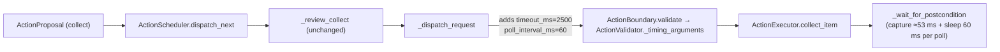

# Plan 01 — Collect confirmation poll interval

## 1. Metadata

- Plan ID: P01
- Iteration: `008-collect-confirmation-latency`
- Status: Approved
- Depends on: None
- Requirement IDs: R1, R2, R3, R4

## 2. Goal

让 JEV Runtime 的 collect 请求携带 60 ms 的确认轮询间隔，取代原先由执行器默认值
带来的 250 ms。改动只落在 `jev/scheduler.py` 构造 collect 请求的那一处，以及其
定向测试；`COLLECT_CONFIRMATION_TIMEOUT_MS = 2500` 与 plant/shovel 的 10 s 默认
全部保持不变。开发者需要看清的最终边界是：**只有 collect 走更密的轮询，且这只是
观测开销的削减，不改变"何时算收集成功"的判定**。

### Requirement Mapping

| Requirement ID | Outcome in this Plan | Acceptance signal |
|---|---|---|
| R1 | `_dispatch_request` 为 collect 请求写入 `poll_interval_ms = 60` | 请求键集包含 `poll_interval_ms` 且值等于常量 60 |
| R2 | `COLLECT_CONFIRMATION_TIMEOUT_MS` 保持 2500 | 既有断言 `== 2_500` 继续通过 |
| R3 | plant/shovel 请求不含 `poll_interval_ms` | 既有 `test_plant_and_shovel_requests_keep_the_executor_default` 通过 |
| R4 | 60 ms 通过真实 `ActionValidator` 且在预算内可轮询 | 校验后 `arguments["poll_interval_ms"] == 60`；2500/60 ≥ 41 次轮询 |

## 3. Scope

### In scope

- 新增 `COLLECT_CONFIRMATION_POLL_INTERVAL_MS = 60` 及其依据注释。
- 在 `_dispatch_request` 的 collect 分支写入该值。
- 将该常量加入 `__all__`。
- 更新 `_dispatch_request` docstring 说明现在同时携带超时与轮询间隔。
- 更新/新增 `tests/test_jev_scheduler.py` 断言。

### Out of scope

- 执行器 `DEFAULT_POLL_INTERVAL_MS`（保持 250 ms）。
- `COLLECT_CONFIRMATION_TIMEOUT_MS` 取值。
- `jev/loop.py` 的分支键与 cohort 账本（见 Plan Index 的 OD 说明与 CD-02）。
- 任何乐观确认 / 并发点击方案。

## 4. Impact Surface

### 4.1 File and Symbol Map

```text
jev/
  scheduler.py
tests/
  test_jev_scheduler.py
```

```text
File: jev/scheduler.py
Module: jev.scheduler
Symbols:
  COLLECT_CONFIRMATION_POLL_INTERVAL_MS — new module constant, 60 ms collect confirmation spacing
  _dispatch_request — builds the Boundary request; now also writes poll_interval_ms for collect
  __all__ — exports the new constant alongside COLLECT_CONFIRMATION_TIMEOUT_MS
  COLLECT_CONFIRMATION_TIMEOUT_MS — unchanged 2500 ms bounded budget (OD-47/R36)
```

```text
File: tests/test_jev_scheduler.py
Module: tests.test_jev_scheduler
Symbols:
  CollectPreDispatchReviewTests.test_the_click_uses_the_current_coordinates_of_the_bound_item — asserts the full collect request key set
  CollectPreDispatchReviewTests.test_the_bound_identity_reaches_the_boundary_without_coordinates — asserts the collect request key set
  CollectConfirmationTimeoutTests.test_the_collect_request_uses_the_denser_confirmation_poll_spacing — new contract check for the 60 ms value
  CollectConfirmationTimeoutTests.test_the_denser_spacing_still_passes_the_real_boundary_validator — new Boundary acceptance check
```

### 4.2 End-to-End Flow



## 5. Decision

### 5.1 Open Decision

无。

### 5.2 Confirmed Decision

#### Confirmed Decision Record — CD-01

- Decision ID: CD-01
- Confirmed choice: 直接实施 60 ms collect 确认轮询间隔。
- Source: 用户 2026-09-29 对话「直接改降低下，太慢了」；澄清提问中确认「保留 poll 改动」。
- Date: 2026-09-29
- Reason: 现场 Trace 复算显示 250 ms 间隔给每次收集带来约 150–250 ms 纯量化开销；
  60 ms 守在 Boundary 50 ms 下限之上且不放宽 2.5 s 预算。备选值（50 ms 贴死下限、
  100/125 ms 收益减半）均未优于 60 ms 的安全/收益折中。

#### Confirmed Decision Record — CD-02

- Decision ID: CD-02
- Confirmed choice: 本 Plan 不修改 `jev/loop.py`。
- Source: 用户 2026-09-29 澄清提问中选择「不恢复（推荐）」。
- Date: 2026-09-29
- Reason: `_last_result` 移出 collect 分支键的改动经等价复现实测未降低丢弃数。

## 6. Task

### Task

- [x] T1 — Add the collect-specific confirmation poll interval
  - Objective: 让 collect 请求以 60 ms 间隔确认，同时保持既有预算与 plant/shovel 默认不变。
  - Affected files:
    ```text
    jev/scheduler.py
    tests/test_jev_scheduler.py
    ```
    Expected:
      jev/scheduler.py
      tests/test_jev_scheduler.py
    Actual:
      jev/scheduler.py
      tests/test_jev_scheduler.py
    ```
  - Implementation backfill:
    ```text
    Notes: 新增 COLLECT_CONFIRMATION_POLL_INTERVAL_MS = 60 及依据注释；_dispatch_request
      的 collect 分支在写入 timeout_ms 后追加 poll_interval_ms；常量加入 __all__；
      _dispatch_request docstring 由「同时携带超时与轮询间隔」表述。
      测试侧：import 增加 COLLECT_CONFIRMATION_POLL_INTERVAL_MS 与 DEFAULT_POLL_INTERVAL_MS；
      test_the_click_uses_the_current_coordinates_of_the_bound_item 的期望请求字典加
      poll_interval_ms；test_the_bound_identity_reaches_the_boundary_without_coordinates
      的键集断言加 poll_interval_ms；CollectConfirmationTimeoutTests docstring 补一句；
      新增 test_the_collect_request_uses_the_denser_confirmation_poll_spacing 与
      test_the_denser_spacing_still_passes_the_real_boundary_validator。
    Changed files:
      jev/scheduler.py (+21/-4)
      tests/test_jev_scheduler.py (+36/-3)
    ```

## 7. Validation

### Traceability

| Check ID | Requirement ID | Task ID | Check | Tier and reason | Expected evidence | Delivery impact / escalation condition |
|---|---|---|---|---|---|---|
| V1 | R1 | T1 | collect 请求携带 60 ms 轮询间隔 | G1: 本次唯一行为变更 | `test_the_collect_request_uses_the_denser_confirmation_poll_spacing` 通过；请求 `poll_interval_ms == 60` | 失败则本次目标未达成 |
| V2 | R2 | T1 | 确认预算仍为 2500 ms | G1: 保护唯一执行 worker | `test_every_collect_request_carries_the_bounded_confirmation_timeout` 通过；`== 2_500` | 预算被放宽即视为回归 |
| V3 | R3 | T1 | plant/shovel 请求不含轮询间隔 | G1: 越界会改种植/铲除语义 | `test_plant_and_shovel_requests_keep_the_executor_default` 通过 | 出现该键即视为越界 |
| V4 | R4 | T1 | 60 ms 通过真实 Boundary 校验 | G1: 被拒则 collect 派发前失败 | `test_the_denser_spacing_still_passes_the_real_boundary_validator` 通过 | 校验失败则改动不可用 |
| V5 | R1–R4 | T1 | 全量回归无新增失败 | G1: 确认无副作用 | `unittest discover -s tests -p "test_*.py"` 结果与本 Iteration 无关失败之外无新失败 | 新失败若由本改动引起则阻塞 |
| V6 | R1 | T1 | 真机一局 collect 实际确认耗时下降 | G2: 需 Human 运行一局并读 Trace；不作为本次门槛 | Trace `boundary.wait.waited_ms` 由约 796–1093 ms 向游戏结算下限靠近 | 若实测未下降且采集耗时主导，升级为排查项 |

### Commands

- 定向测试（V1–V4）：
  ```text
  uv run python -m unittest tests.test_jev_scheduler
  ```
- 全量回归（V5）：
  ```text
  uv run python -m unittest discover -s tests -p "test_*.py"
  ```

### Implementation evidence

```text
V1–V4: uv run python -m unittest tests.test_jev_scheduler → Ran 50 tests ... OK
V5:    uv run python -m unittest discover -s tests -p "test_*.py" → 见 verify.md（本 Iteration
       交付时的实际结果；工作区存在并行的 plan/economy 直改任务，其失败不计入本次）
```

### Manual checks

- V6 — Human 在真实对局中启动 JEV Runtime，运行约 30 s，读取 `.log/*.jsonl` 中
  collect `action_result.boundary.wait.waited_ms` 与 `polls`；期望 `polls` 明显多于
  原先的 4–5、`waited_ms` 向游戏结算下限（约 600–800 ms）收敛。记录实际数值；
  未执行时如实记为未观察，不阻塞交付。

## 8. Risks

- 收益上限受游戏引擎结算延迟限制（约 550–800 ms），本次无法进一步压缩。
- 60 ms 距 Boundary 50 ms 下限仅 10 ms 余量，依赖 V3/V4 断言守护常量漂移。
- 实际轮询节奏受采集耗时（约 53 ms）主导，名义 60 ms 不会变成忙等。
- Trace 依据来自本机实机，跨机器绝对收益可能有差异，正确性不受影响。

## 9. Approval

- Status: Approved
- Approved by: 本仓库维护者（Human）
- Approval date: 2026-09-29
- Notes: 本次为对已实施并定向验证通过的直接改动的正式追认回填。
