# Plan 1 — Plan-driven offer policy

## 1. Metadata

- Plan ID: P01
- Iteration: `009-plan-driven-economy`
- Status: Approved
- Depends on: None
- Requirement IDs: R1, R2, R3, R4, R5, R6, R7, R10

## 2. Goal

把已在工作区落地（未提交）的 plan/economy 改动纳入受控范围：**模型自己声明的建设目标不再截断候选空间，而是作为上下文参与候选生成**。当目标可支付时，候选是目标本身加上"余额超出目标价的部分"能支付的牌；目标不可支付且没有行需要立即响应时，plant 分支本地等待（`await_plan`）而不是把钱花在当下的便宜植物上。本次同时把"需要立即响应"的中断条件从 `{medium, high, critical}` 收窄为 `{high, critical}`（加上"该行有僵尸但没有攻击植物"），并修订 006 中与之冲突的 OD-29/OD-38 条款。

最终边界：本 Plan 只保证**候选空间与等待语义**由代码确定地产生（Case A/Case B 的可复现部分）；模型最终选哪张牌、何时改目标仍完全由模型决定，代码不提供阵容建议、不重排、不替换模型的合法选择。

### Requirement Mapping

| Requirement ID | Outcome in this Plan | Acceptance signal |
|---|---|---|
| R1 | 目标可支付时，候选 = 目标 + 余额超出目标价部分能支付的牌；高成本牌重新进入候选与请求态 | 冻结样本候选 36/1 种 → 360/10 种；sun 320 只出目标、sun 400 出目标+便宜牌 |
| R2 | 目标不可支付且无中断行时，plant 分支本地等待、不发请求、不产生动作 | `_local_wait_reason == "await_plan"`、`client.calls == []`、Trace `job_end.reliable == true` |
| R3 | 中断条件收窄为任一行 urgency ∈ `{high, critical}`，或该行有僵尸且 `attacker_count == 0`；`medium` 不再中断攒钱 | `LANE_RESPONSE_URGENCIES == {"high","critical"}`；4 格僵尸行（medium）→ 仍 `await_plan`；2 格或无攻击植物 → 出候选 |
| R4 | 没有目标时行为与现状一致（OD-15 全枚举，无本地 shortlist） | 既有 `PlantCandidateTests` 与 `test_no_plan_keeps_the_full_enumeration_and_never_holds` 保持通过 |
| R5 | 请求态携带 economy 事实组并附语义说明；band 边界只来自本手牌价格，不引入任何配置阳光阈值 | `PLANT_STATE_FIELDS` 含 `economy`；Trace 往返相等；三处 plant instructions 只引用已下发字段 |
| R6 | 派发守卫不再因"目标类型 ≠ 声明目标类型"拒绝，但来源意图版本变化仍必须拒绝 | 非目标类型目标被派发；`source_intent_version` 变化 → `intent_changed`，0 派发 |
| R7 | 006 既有契约不回归：collect 授权/cohort 账本、意图 keep/replace/cancel、Trace schema-2 字段集、`management_state_key` 语义 | 全量 `unittest discover` 全绿；collect/intent/trace 既有用例未改语义 |
| R10 | 006 的 OD-29（不做阳光预留）与 OD-38/冷启动第 6 条（攒钱由模型弃选项表达、目标候选只含当前可负担类型）被本 Iteration 明确取代，并记录 R28 与 R29 的取舍 | 009 Decision 与 Plan Index 引用原文条款并写明取代内容；`docs/architecture.md` 同步 |

## 3. Scope

### In scope

- `jev/strategy.py`：经济/目标事实与候选策略（`card_costs`、`card_price_band`、`economy_band`、`plan_facts`、`economy_facts`、`lane_needs_response`、`PlantSpendDecision`、`plant_spend_decision`、`build_plant_candidates(..., plan=)`、`management_facts(..., plan=)`），以及 **T2 的中断档位收窄**。
- `jev/client.py`：`decide_plant` 去掉手牌过滤并传 `plan`；`build_plant_questions(..., plan=)`；`build_typesafe_state(..., plan=)`；`decide_shared` 下发 economy。
- `jev/questions.py`：`ECONOMY_ANCHOR` + 三处 plant instructions；`PLANT_STATE_FIELDS` 增 `economy`；`management_questions(..., economy=)` 与类型选项的相对价格档。
- `jev/loop.py`：`_local_wait_reason` 返回 `await_plan`；`_proposal_source_guard` 去掉类型冲突判定。
- `jev/trace.py`：`await_plan` 为可靠结论；`_actual_request_state` 增加 economy 有界投影。
- 上述行为的回归测试（`tests/test_jev_strategy.py`、`tests/test_jev_client.py`、`tests/test_jev_loop.py`、`tests/test_jev_trace.py`）。
- `docs/architecture.md` 的 Decision/Scheduling 段落与 009 Decision 的条款取代记录。

### Out of scope

- 模型如何选择目标、是否应该提供阵容/经济规模建议（R27/OD-37 仍由模型自主）。
- `jev/scheduler.py` 与 `tests/test_jev_scheduler.py`（008-collect-confirmation-latency 正在修改）。
- collect 分支的授权/账本/目标选择（含"只收一个物品"缺陷；`.memory` 已记为需另行规划）。
- 任何阈值/配置项新增（band 由手牌价格推出；中断档位是封闭集合取值，不是可调数值）。
- 真实模型行为的保证，以及实机取证脚本（属 P02/G2）。

## 4. Impact Surface

### 4.1 File and Symbol Map

```text
jev/
  strategy.py
  client.py
  questions.py
  loop.py
  trace.py
tests/
  test_jev_strategy.py
  test_jev_client.py
  test_jev_loop.py
  test_jev_trace.py
docs/
  architecture.md
```

```text
File: jev/strategy.py
Module: jev.strategy
Symbols:
  ECONOMY_BANDS — 资源档位闭集 scarce/normal/comfortable/abundant
  PLAN_HOLD_REASON — 本地等待原因 "await_plan"
  LANE_RESPONSE_URGENCIES — 中断攒钱的 urgency 集合；T2 从 {medium,high,critical} 收窄为 {high,critical}
  card_costs — 本手牌价格阶梯（升序 int 元组）
  card_price_band — 单卡在本次手牌中的相对价格档 low/mid/high
  economy_band — 余额在本手牌价格阶梯上的档位，无配置阈值
  plan_facts — 已声明目标的 cost/payable/shortfall（价格每次从手牌解析）
  economy_facts — economy 事实组（sun/band/cheapest/highest/plan/sun_above_plan）
  lane_needs_response — 是否有行不能留到下一次决策（urgency + 有僵尸无攻击植物）
  PlantSpendDecision — {type_names, hold_reason} 冻结结果
  plant_spend_decision — 目标上下文的候选限制与攒钱判定
  build_plant_candidates — 枚举候选；新增 plan 关键字参数
  management_facts — 请求态事实装配；新增 plan 参数与 economy 组
```

```text
File: jev/client.py
Module: jev.client
Symbols:
  build_typesafe_state — 新增 plan 参数，把 economy.plan 的 cost/payable/surplus 下发
  build_plant_questions — 新增 plan 参数，候选经 plant_spend_decision
  AsyncJevClient.decide_plant — 删除"只留目标类型"的手牌过滤；无候选时按 hold 原因本地等待
  AsyncJevClient.decide_shared — 共享请求带 economy，并把 economy 传给 management 问题
```

```text
File: jev/questions.py
Module: jev.questions
Symbols:
  ECONOMY_ANCHOR — 资源事实与 offer 规则的固定语义段（无阳光数字、不点名植物）
  _plant_economy_guidance — 把该段追加到三处 plant instructions
  PLANT_STATE_FIELDS — 声明字段集加入 economy（COLLECT_STATE_FIELDS 自动继承）
  management_questions — 新增 economy 关键字参数；意图问题说明目标对 plant 分支的作用
  _construction_option_text — 类型选项附带相对价格档
```

```text
File: jev/loop.py
Module: jev.loop
Symbols:
  JevRuntimeLoop._local_wait_reason — 使用与 client 相同的 plant_spend_decision，返回 await_plan
  JevRuntimeLoop._proposal_source_guard — 去掉 intent_type_conflict，保留 intent_changed
```

```text
File: jev/trace.py
Module: jev.trace
Symbols:
  RELIABLE_OUTCOMES — 加入 await_plan
  _economy_record — economy 组的有界投影（不引入新键）
  _actual_request_state — 记录 economy，与 build_typesafe_state 逐字段相等
```

```text
File: tests/test_jev_strategy.py
Symbols:
  EconomyPlanAcceptanceTests — 档位/价格档/候选/攒钱/中断/失效目标等用例；T2 改写 medium 用例
```

```text
File: tests/test_jev_client.py
Symbols:
  PlantPlanEconomyAcceptanceTests — 请求态、Case B 候选、无请求本地等待、surplus/shortfall
  PlantInstructionsGuidanceTests — 三处 instructions 的资源语义断言
```

```text
File: tests/test_jev_loop.py
Symbols:
  ManagementAcceptanceTests — await_plan、目标支付后重开、中断覆盖、Case B 全开、非目标类型可派发
```

```text
File: tests/test_jev_trace.py
Symbols:
  runtime 事件用例 — await_plan 为可靠结论、economy 白名单往返
```

```text
File: docs/architecture.md
Symbols:
  Decision 段 — economy 事实组、offer 规则与 await_plan 描述；T2 后中断档位措辞改为 high
  Scheduling 段 — "只按声明目标自身价格保留阳光，不预测收入"
```

### 4.2 End-to-End Flow

```mermaid
flowchart LR
    sample["state.builder.capture_state → project_jev_state"] --> signals["evaluate_strategy"]
    signals --> facts["management_facts(jev_state, all_state, plan)"]
    facts --> economy["economy_facts"]
    signals --> spend["plant_spend_decision(signals, cards, plan)"]
    economy --> spend
    spend --> hold{"hold_reason?"}
    hold -- "await_plan" --> wait["JevRuntimeLoop._local_wait_reason → job_end(await_plan)"]
    hold -- "None" --> candidates["build_plant_candidates(..., plan)"]
    candidates --> questions["build_plant_questions(..., plan)"]
    questions --> request["decide_plant → build_typesafe_state(plan) + current_intent"]
    request --> model["TypeSafe system_one (Choice argmax)"]
    model --> merge["combine_plant_decision"]
    merge --> guard["_proposal_source_guard (epoch / freshness / intent version)"]
    guard --> scheduler["ActionScheduler._review_plant"]
    scheduler --> boundary["ActionBoundary → ActionExecutor"]
```



## 5. Decision

### 5.1 Open Decision

无阻塞性 Open Decision。三项会影响实现与验收的选择已由 Human 在 2026-09-29 的本次 Plan 执行中确认（见 5.2 CD-01/02/05）；006 条款的记账方式见 CD-03。

### 5.2 Confirmed Decision

#### Confirmed Decision Record — CD-01

- Decision ID: CD-01（机制定稿）
- Confirmed choice: 保持"代码代攒钱"：目标不可支付且无中断行时本地 `await_plan`；目标可支付时只提供目标与"余额超出目标价部分"能支付的牌。
- Source: Human 对话选择（"保持代码代攒钱（推荐）"），本次 `$sdd-plan` 执行中再次确认
- Date: 2026-09-29
- Reason: Case A 需要确定性的攒钱行为；该机制改动面最小（只在"目标可支付且余额有富余"时改变行为），且不新增任何可调参数。

#### Confirmed Decision Record — CD-02

- Decision ID: CD-02（中断档位）
- Confirmed choice: 中断攒钱的条件是任一行 urgency ∈ `{high, critical}`，或该行有僵尸且没有攻击植物；`medium`（僵尸在 4–5 格）不再中断攒钱。
- Source: Human 对话选择（"只在 high 起中断"）
- Date: 2026-09-29
- Reason: 4–5 格仍属可接受的推进距离，让攒钱更有效；把"没有攻击植物"的升档保留为硬条件，避免有僵尸无可应对时还在攒钱。当前工作区实现仍为 `{medium, high, critical}`，由 T2 收窄。

#### Confirmed Decision Record — CD-03

- Decision ID: CD-03（006 条款记账）
- Confirmed choice: 006 是已交付 Iteration，本次不回改其 artifact；由 009 在 Decision 中逐条引用并声明取代 OD-29 与 OD-38/冷启动第 6 条，同时明确 R28 的"意图-目标语义冲突即拒绝"让位于 R29/OD-43 的"意图仅提供上下文"。
- Source: 本 Plan 执行决定（Human 已确认机制转向；回改已交付 artifact 会破坏历史证据）
- Date: 2026-09-29
- Reason: 仓库惯例是把修订追加为新的、带日期的决定记录，而不是改写已 Verify/Delivery 的 Iteration 文本。

#### Confirmed Decision Record — CD-04

- Decision ID: CD-04（真机观察级别）
- Confirmed choice: 真机一局 Case A/B 观察为 **G2 非阻塞**，并写明升级条件：若现场出现"目标已可支付且余额有富余，但候选仍只含目标类型或不出现高成本牌"，则升级为 G1 并阻塞交付。
- Source: Human 对话选择（"G2 非阻塞（推荐）"）
- Date: 2026-09-29
- Reason: 代码可确定的部分由离线证据与全量测试覆盖；模型最终选择不由代码保证，实机证据成本高且依赖 Human 时间。

#### Confirmed Decision Record — CD-06

- Decision ID: CD-06（已有实现的处理）
- Confirmed choice: 保留工作区已落地的 plan/economy 改动（5 个源文件 + 4 个测试文件，~855 行新增），由 `$sdd-implementation 009` 按 T1–T6 逐项独立核对、修正、补测、回填，并落地唯一尚未实现的 T2；不做整体回退重写。
- Source: Human 对话选择（"保留，由 implementation 核对（推荐）"）
- Date: 2026-09-29
- Reason: 改动已在工作区通过 470 项测试且与 CD-01 定稿一致；整体回退需重写约 850 行且无额外收益。实现阶段仍要求逐 Task 核对，Verify/Delivery 仍独立进行。

## 6. Task

验收意图写在 Validation（第 7 部分），不在每个 Task 重复。

### Task

- [x] T1 — 目标从授权前提降为上下文
  - Objective: 删除 `AsyncJevClient.decide_plant` 中"把手牌过滤为目标类型"的逻辑，改为把目标作为 `plan` 传入 `build_plant_questions` / `build_typesafe_state`；`build_plant_candidates` 通过 `plant_spend_decision` 限定候选。
  - Affected files:
    ```text
    Expected:
      jev/client.py
      jev/strategy.py
    Actual:
      jev/client.py
      jev/strategy.py
    ```
  - Implementation backfill:
    ```text
    Notes: 审计既有工作区改动，已符合 R1/R4，本次未修代码。AsyncJevClient.decide_plant 不再按
      intent["type_name"] 过滤手牌：候选只经 plant_spend_decision 受限，intent 仅作为 plan 传给
      build_plant_questions / build_typesafe_state；无候选时按 hold 原因返回本地等待。
      build_plant_candidates(..., plan=) 无 plan 时仍是 OD-15 全枚举
      （affordable × empty_plantable_cells，无排序、无截断）。
    Changed files:
      jev/client.py（既有未提交改动，本次未改）
      jev/strategy.py（既有未提交改动，本次仅 T2 改动）
    ```

- [x] T2 — 中断条件收窄为 high/critical（本 Iteration 的新改动）
  - Objective: `LANE_RESPONSE_URGENCIES` 从 `{"medium","high","critical"}` 收窄为 `{"high","critical"}`，保留"该行有僵尸且 `attacker_count == 0`"这一独立中断条件；同步改写 `tests/test_jev_strategy.py::EconomyPlanAcceptanceTests::test_a_medium_or_closer_lane_band_also_outranks_the_goal`（当前断言 medium 会中断，与新决定相反），并确认 `test_a_lane_that_cannot_stop_what_is_in_it_outranks_the_goal`（无攻击植物）与 loop 侧 `test_a_lane_that_cannot_stop_what_is_in_it_overrides_the_save`（2 格）在新取值下仍通过。
  - Affected files:
    ```text
    Expected:
      jev/strategy.py
      tests/test_jev_strategy.py
    Actual:
      jev/strategy.py
      tests/test_jev_strategy.py
      docs/architecture.md
    ```
  - Implementation backfill:
    ```text
    Notes: 本次唯一新落的代码改动。LANE_RESPONSE_URGENCIES 由 {medium,high,critical} 收窄为
      {high,critical}，常量 docstring 与 lane_needs_response docstring 同步改写；
      「该行有僵尸且 attacker_count == 0」的独立条件原样保留。
      原用例 test_a_medium_or_closer_lane_band_also_outranks_the_goal 被改写为
      test_a_medium_lane_band_keeps_saving_and_high_does_not（medium → await_plan，high → 出候选），
      并新增 LANE_RESPONSE_URGENCIES 取值断言。
      审计发现：原用例的 medium 行没有任何攻击植物，实际是被 attacker_count == 0 条件中断，
      与新档位无关；改写后的用例显式给该行放一个 peashooter，使 urgency 成为唯一中断来源。
      该 grep 的第三处命中是 jev/strategy.py::lane_needs_response 的 docstring（原写 "medium or higher"），
      已按 R3 改为 "high or higher"；此外 jev/strategy.py 的 URGENCY_BANDS/urgency_band/_phase 中的
      medium 是 OD-30 档位定义本身，未动。
    Changed files:
      jev/strategy.py（本次改动：常量取值 + 两处 docstring）
      tests/test_jev_strategy.py（本次改动：改写/重命名用例 + 新增常量断言）
      docs/architecture.md（本次改动：Decision 段 medium → high；见 T6）
    ```

- [x] T3 — economy 事实组与问题语义
  - Objective: `economy_facts`/`plan_facts`/`card_price_band` 进入 `management_facts` 与 `PLANT_STATE_FIELDS`；`ECONOMY_ANCHOR` 追加到三处 plant instructions；`management_questions` 的类型选项带相对价格档、意图问题说明目标对 plant 分支的作用。所有引用必须是已下发字段（由 `RequestFieldAcceptanceTests` 守护）。
  - Affected files:
    ```text
    Expected:
      jev/strategy.py
      jev/questions.py
      jev/client.py
    Actual:
      jev/strategy.py
      jev/questions.py
      jev/client.py
    ```
  - Implementation backfill:
    ```text
    Notes: 审计既有工作区改动，已符合 R5，本次未修代码。strategy.py 有 card_costs /
      card_price_band / economy_band / plan_facts / economy_facts，且 management_facts(..., plan=)
      产出 economy 组（sun / band / cheapest_cost / highest_cost / plan{type_name,cost,payable,shortfall}
      / sun_above_plan）；questions.py 的 PLANT_STATE_FIELDS 第 111 行含 "economy"（COLLECT_STATE_FIELDS
      自动继承），ECONOMY_ANCHOR 由 _plant_economy_guidance() 追加到 plant_target_question /
      plant_lane_question / plant_lane_target_question 三处 instructions，只引用已下发字段、不含阳光数字；
      management_questions(..., economy=) 的类型选项带相对价格档、意图问题说明目标对 plant 分支的作用。
      守护证据：RequestFieldAcceptanceTests 与 PlantInstructionsGuidanceTests 全绿。
    Changed files:
      jev/strategy.py（既有未提交改动，本次仅 T2 改动）
      jev/questions.py（既有未提交改动，本次未改）
      jev/client.py（既有未提交改动，本次未改）
    ```

- [x] T4 — 本地攒钱、派发守卫与 Trace
  - Objective: `_local_wait_reason` 用与 client 相同的 `plant_spend_decision`，目标不可支付且无中断行时返回 `await_plan`；`_proposal_source_guard` 去掉 `intent_type_conflict`（`intent_changed` 保留）；Trace 把 `await_plan` 视为可靠结论并投影 economy。
  - Affected files:
    ```text
    Expected:
      jev/loop.py
      jev/trace.py
    Actual:
      jev/loop.py
      jev/trace.py
    ```
  - Implementation backfill:
    ```text
    Notes: 审计既有工作区改动，已符合 R2/R6/R7，本次未修代码。_local_wait_reason 用与 client 相同的
      plant_spend_decision，目标不可支付且无中断行时返回 "await_plan"；_proposal_source_guard 只保留
      epoch_changed / stale_sample / intent_changed，已无 intent_type_conflict；RELIABLE_OUTCOMES
      含 "await_plan"；trace._economy_record 做有界投影且 _actual_request_state 与
      build_typesafe_state 逐字段相等（parity 用例通过）。
    Changed files:
      jev/loop.py（既有未提交改动，本次未改）
      jev/trace.py（既有未提交改动，本次未改）
    ```

- [x] T5 — Case A/B 回归测试
  - Objective: 在四个测试文件中补齐/校准 Case A（攒钱、无请求、达标后重开）与 Case B（富余时高成本牌进入候选与请求态）的确定性用例，并覆盖 T2 的新中断档位。
  - Affected files:
    ```text
    Expected:
      tests/test_jev_strategy.py
      tests/test_jev_client.py
      tests/test_jev_loop.py
      tests/test_jev_trace.py
    Actual:
      tests/test_jev_strategy.py
      tests/test_jev_client.py
      tests/test_jev_loop.py
      tests/test_jev_trace.py
    ```
  - Implementation backfill:
    ```text
    Notes: 审计既有用例（Case A 攒钱/不发请求/达标后重开、Case B 富余全开、非目标类型可派发、
      Trace 可靠结论与 economy 白名单往返）均存在且通过；本次只按 T2 改写了一个档位用例。
      校准结果：uv run python -m unittest tests.test_jev_strategy tests.test_jev_client
      tests.test_jev_loop tests.test_jev_trace → 264 tests OK。
    Changed files:
      tests/test_jev_strategy.py（本次改动：T2 档位用例）
      tests/test_jev_client.py（既有未提交改动，本次未改）
      tests/test_jev_loop.py（既有未提交改动，本次未改）
      tests/test_jev_trace.py（既有未提交改动，本次未改）
    ```

- [x] T6 — 文档与条款取代记录
  - Objective: `docs/architecture.md` 的 Decision/Scheduling 段落与实现一致（含 T2 后的 high 档位措辞、"只按声明目标自身价格保留阳光、不预测收入"）；在 009 的 Decision 中保留对 006 OD-29/OD-38/R28-R29 的取代说明，并在交付记录中注明 `docs/architecture.md` 的经济段落曾随 `7da972d` 早于代码一个提交。
  - Affected files:
    ```text
    Expected:
      docs/architecture.md
      .sdd/009-plan-driven-economy/plan-index.md
    Actual:
      docs/architecture.md
      .sdd/009-plan-driven-economy/plan-index.md（规划阶段已写入；本次按禁止项未改）
    ```
  - Implementation backfill:
    ```text
    Notes: docs/architecture.md 的 Decision/Scheduling 段已与实现一致（economy 事实组、offer 规则、
      await_plan、「只按声明目标自身价格保留阳光、不预测收入」），本次按 T2 只改一处档位描述：
      Decision 段 "no lane is at `medium` urgency or higher" → "`high`"。
      006 条款取代说明在 009 侧已由规划阶段写就：plan-index §5 的 CD-03（不回改 006 artifact，
      逐条引用并取代 OD-29 与 OD-38/冷启动第 6 条）与 R10 行（记录 R28 让位于 R29/OD-43）+
      P01 §5.1/§5.2，本次核对无缺项，因此未改 plan-index。
      「docs/architecture.md 的经济段落曾随 7da972d 早于代码一个提交」属交付记录事项，
      留给 $sdd-delivery 在 delivery.md 中注明（本阶段不得创建 delivery.md）。
    Changed files:
      docs/architecture.md（本次改动：Decision 段 medium → high）
      .sdd/009-plan-driven-economy/plan-index.md（无改动）
    ```

## 7. Validation

### Traceability

| Check ID | Requirement ID | Task ID | Check | Tier and reason | Expected evidence | Delivery impact / escalation condition |
|---|---|---|---|---|---|---|
| V1 | R1 | T1, T5 | 冻结样本候选对照：同一 7300 阳光、目标 sunflower 样本在修复前后分别是 1 种/36 个与 10 种/360 个；请求态与问题选项都出现目标类型之外的高成本牌 | G1：这是 Case B 的直接判据 | `tests/test_jev_strategy.py::EconomyPlanAcceptanceTests::test_case_b_an_abundant_balance_no_longer_hides_the_higher_cost_types`、`tests/test_jev_client.py::PlantPlanEconomyAcceptanceTests::test_case_b_the_declared_goal_no_longer_removes_the_rest_of_the_hand`、`tests/test_jev_loop.py::ManagementAcceptanceTests::test_case_b_an_abundant_balance_offers_the_high_cost_hand_under_a_cheap_goal` 全绿 | 任一失败或候选仍被截断，阻塞交付 |
| V2 | R2 | T4, T5 | 目标不可支付且无中断行：不产请求、`await_plan`、无动作 | G1：Case A 的核心语义 | `tests/test_jev_strategy.py::…::test_case_a_an_unpayable_goal_holds_instead_of_offering_cheaper_plants`、`tests/test_jev_client.py::…::test_case_a_an_unpayable_goal_sends_no_request_and_waits`、`tests/test_jev_loop.py::ManagementAcceptanceTests::test_case_a_a_goal_above_the_balance_saves_and_then_reopens_on_payment`、Trace 用例 `test_await_plan_is_a_reliable_local_conclusion` | 出现请求或动作，阻塞交付 |
| V3 | R3 | T2, T5 | 中断档位：`{high, critical}` 与"有僵尸无攻击植物"中断；`medium` 不中断 | G1：CD-02 的直接判据，取值错误会把攒钱变成不响应 | 改写后的 `test_a_medium_or_closer_lane_band_also_outranks_the_goal`（medium → 仍 `await_plan`）+ 保留的"无攻击植物"与 2 格用例 + `LANE_RESPONSE_URGENCIES` 断言 | 取值或断言与 CD-02 不符，阻塞交付 |
| V4 | R1 | T1, T5 | 目标可支付时的 surplus 规则：sun 320 → 只出目标；sun 400 → 目标+便宜牌；sun 8175 → 全手牌 | G1：这是"富余才放开"的边界判据 | `test_a_payable_goal_only_spends_what_is_left_above_its_own_price`（strategy）与 `test_a_payable_goal_states_its_surplus_and_keeps_the_cheaper_hand`（client） | 富余牌被错误排除或目标价被花掉，阻塞交付 |
| V5 | R4 | T1, T5 | 无目标时与 OD-15 全枚举一致（affordable × empty cells），无本地排序/截断 | G1：防止修复引入回归 | 既有 `PlantCandidateTests`（`test_candidates_equal_affordable_cross_empty_plantable_cells` 等）与 `test_no_plan_keeps_the_full_enumeration_and_never_holds` | 既有枚举用例失败，阻塞交付 |
| V6 | R5 | T3, T5 | 请求态 economy 字段齐全；Trace 投影与 `build_typesafe_state` 逐字段相等；三处 instructions 只引用已下发字段；无硬编码阳光常量 | G1：模型依据与审计面 | `test_jev_trace.py::test_a_declared_goal_round_trips_through_the_request_state_whitelist`、`test_real_shared_builder_survives_whitelist_with_observed_lanes_and_waves`、`RequestFieldAcceptanceTests::test_all_current_plant_questions_reference_supplied_observations`、`PlantInstructionsGuidanceTests::test_all_three_state_the_resource_facts_and_the_offer_rule` | 字段缺失/漂移或出现未下发引用，阻塞交付 |
| V7 | R6 | T4, T5 | 非目标类型目标可派发；来源意图版本变化仍被拒绝 | G1：守卫语义是"上下文而非授权"的关键 | `test_a_target_outside_the_declared_goal_is_context_not_a_conflict`、`test_stale_plant_intent_is_rejected_before_boundary`（`intent_changed`，0 派发） | 过期目标被派发或合法目标被拒，阻塞交付 |
| V8 | R7 | T5, T6 | 全量测试通过；collect 授权/账本、意图 keep/replace/cancel、Trace schema-2 字段集语义未变 | G1：防止跨迭代回归 | `uv run python -m unittest discover -s tests -p "test_*.py"` 输出 `OK`（当前基线 470 tests，T2/T5 后数量可能+1） | 出现失败或需改既有语义断言，阻塞交付 |
| V9 | R10 | T6 | 009 Decision 逐条引用 006 的 OD-29/OD-38/R28-R29 并声明取代；`docs/architecture.md` 措辞与 T2 后的实现一致 | G1：没有这条，实现与既有批准文本冲突，Verify/Delivery 无法判定范围 | 009 `plan-index.md` §5 与 P01 §5.2；`docs/architecture.md` 中不再出现 `medium` 档中断的表述 | 条款记录缺失或文档与实现矛盾，阻塞交付 |
| V10 | R10 | T6 | `.log/2026-09-29-plan-economy-root-cause.md` 与 CD-02 的转向一致（medium → high），不残留"medium 中断"的描述 | G2：R10 的 G1 判据是 V9；本条只覆盖证据文档一致性，不影响代码行为 | 该文件 §3 的中断条件表述与 009 Decision 一致 | 不一致时记录并在本次 Delivery 说明中修正，不阻塞（若被当作 Verify 证据引用则升级为 G1） |

### Commands

- 目标运行环境/测试命令（V8）：`uv run python -m unittest discover -s tests -p "test_*.py"`（仓库 README `测试` 段与 `docs/usage.md` 记录的唯一全量入口）
- 针对性测试（V1–V7、V10）：
  - `uv run python -m unittest tests.test_jev_strategy`
  - `uv run python -m unittest tests.test_jev_client`
  - `uv run python -m unittest tests.test_jev_loop`
  - `uv run python -m unittest tests.test_jev_trace`
- 离线对照证据（V1/V4）：`uv run python tools/evidence-plan-economy.py --trace-file .log/jev-dashboard.jsonl`（由 P02 提供；P02 未完成前用 `.log/evidence-plan-economy.py`）
- 静态检查（V6）：无新增静态检查入口；字段白名单由 `tests/test_jev_trace.py` 与 `tests/test_jev_client.py` 断言覆盖。

### Implementation evidence

Implementation 阶段按 Task ID 回填实际执行的命令、结果和关键输出；这不是正式 `verify.md` 的替代。

审计结论（逐条）：R1 已符合；R2 已符合；R3 已修正（T2 收窄取值）；R4 已符合；R5 已符合；
R6 已符合；R7 已符合；R10 已修正（docs 档位措辞）。

- T1（R1/R4）— 审计既有改动，无需新命令。证据：`git diff --stat` 中 `jev/client.py` +40/−…、
  `jev/strategy.py` +278/−… 已在工作区；`tests.test_jev_strategy` 的
  `test_no_plan_keeps_the_full_enumeration_and_never_holds` 与 `PlantCandidateTests` 全绿。
- T2（R3）— 本次唯一新落的代码改动。
  - 命令：`uv run python -m unittest tests.test_jev_strategy tests.test_jev_client tests.test_jev_loop tests.test_jev_trace`
  - 结果：`Ran 264 tests` … `OK`（4 个模块全绿）。
  - 关键输出/取值：`LANE_RESPONSE_URGENCIES == frozenset({"high", "critical"})`（已有断言）；被改写的用例名
    `EconomyPlanAcceptanceTests::test_a_medium_lane_band_keeps_saving_and_high_does_not`
    （原 `test_a_medium_or_closer_lane_band_also_outranks_the_goal`）；medium（distance=4，带 peashooter，
    `urgency == "medium"`）→ `hold_reason == "await_plan"`；high（distance=3）→ `hold_reason is None`
    且 `type_names == signals.affordable`。保留用例 `test_a_lane_that_cannot_stop_what_is_in_it_outranks_the_goal`
    （无攻击植物）与 loop 侧 `test_a_lane_that_cannot_stop_what_is_in_it_overrides_the_save`（2 格，`urgency == "high"`）在新取值下仍通过。
  - `grep -rn "medium" tests/ docs/ jev/` 命中情况：预期的两处（档位用例 + `docs/architecture.md:174`）之外，
    第三处为 `jev/strategy.py::lane_needs_response` 的 docstring「``medium`` or higher」，已按 R3 改为「``high`` or higher」；
    其余命中均为 OD-30 档位定义本身（`URGENCY_BANDS`/`urgency_band`/`_phase`/`_recovery`、
    `test_jev_scheduler.py` 的 `PRIORITY_ORDER`）或纯取值断言，不受影响。
- T3（R5）— 审计既有改动。证据：`PLANT_STATE_FIELDS` 含 `"economy"`；`ECONOMY_ANCHOR` 经
  `_plant_economy_guidance()` 追加到三处 plant instructions；`RequestFieldAcceptanceTests` 与
  `PlantInstructionsGuidanceTests` 全绿（包含在 T2 的 264 tests OK 中）。
- T4（R2/R6/R7）— 审计既有改动。证据：`_local_wait_reason` 返回 `await_plan`、`RELIABLE_OUTCOMES` 含
  `await_plan`、`_proposal_source_guard` 无 `intent_type_conflict`（代码逐行核对）；
  `test_await_plan_is_a_reliable_local_conclusion`、`test_a_declared_goal_round_trips_through_the_request_state_whitelist`、
  `test_stale_plant_intent_is_rejected_before_boundary`、`test_a_target_outside_the_declared_goal_is_context_not_a_conflict` 全绿。
- T5（V1–V7）— 离线冻结样本对照：`uv run python .log/evidence-plan-economy.py`
  - `job-000010  sample 696  sun 7300`：BEFORE `36 placements, types=['sunflower']` → AFTER
    `360 placements`，10 种（`cabbage_pult, cherry_bomb, chomper, jalapeno, melon_pult, peashooter,
    repeater, snow_pea, sunflower, tall_nut`）。
  - `job-000016  sample 1413  sun 7375`：同样 `36 / 1 种 → 360 / 10 种`。
  - `Case A sun 150  goal melon_pult(300)`：BEFORE `0 placements []` / AFTER `0 placements [] hold=await_plan`。
  - `Case A sun 320  goal melon_pult(300)`：AFTER `37 placements ['melon_pult'] hold=None`（只出目标）。
  - `Case A sun 400  goal melon_pult(300)`：AFTER `148 placements ['cabbage_pult', 'melon_pult', 'peashooter', 'sunflower'] hold=None`
    （即目标 + surplus 100 能支付的牌；与 `.log/2026-09-29-plan-economy-root-cause.md` §5 一致，
    该真实十张手牌含 `cabbage_pult(100)`，故比 `EconomyPlanAcceptanceTests` 的四张手牌多一种）。
- V8 全量：`uv run python -m unittest discover -s tests -p "test_*.py"` → `Ran 473 tests` … `OK`
  （基线 470；本次 +0（改写同名用例），其余增量来自并发 agent 新增的 `tests/test_economy_evidence.py`）。
- 未完成/留给后续：V10（`.log/2026-09-29-plan-economy-root-cause.md` §3 的中断条件仍写作
  `medium/high/critical`）为 G2，按 Plan 不阻塞；该文件不在本阶段允许写入清单内，未改，
  由 `$sdd-delivery` 在交付说明中记录。T6 的交付记录事项（`docs/architecture.md` 经济段落早于代码一个提交）同样留给 Delivery。

### Manual checks

- V1/V4 — 运行离线对照命令，确认输出中 BEFORE/AFTER 行与 `.log/2026-09-29-plan-economy-root-cause.md` §5 的数字一致（36/1 种 → 360/10 种；sun 320 只出目标；sun 400 出目标+便宜牌）。
- V3 — 阅读 `LANE_RESPONSE_URGENCIES` 取值与改写后的用例，确认 medium 行仍继续攒钱、无攻击植物行仍中断。
- V9 — 逐条对照 006 `plans/03-runtime-loop.md` 中 OD-29/OD-38/R28/R29 原文，确认 009 的取代说明没有扩大范围。

## 8. Risks

- **工作区已有实现**：本 Plan 的多数改动已在 2026-09-29 的 direct 任务中落在工作区（未提交）。Implementation 阶段必须先核对现状再回填，避免重复实现或覆盖 Human 侧修改；T2 是其中唯一尚未落地的新改动。
- **T2 会改变既有断言**：`test_a_medium_or_closer_lane_band_also_outranks_the_goal` 的当前断言与 CD-02 相反，必须改写；漏改会让 V3 失败并阻塞交付。
- **模型行为不由代码保证**：Case A/B 的"最终选什么"仍取决于模型；本次只保证候选空间与等待语义。实机观察为 G2（CD-04），触发条件见 V1 的升级条件。
- **与已交付 008 的边界**：`008-collect-confirmation-latency` 已交付（commit `d3071b2`，已推送），它持有 `jev/scheduler.py` 的 `poll_interval_ms` 行为。本 Plan 不改这两个文件；若后续改动需要触碰 collect 执行侧，属新范围。
- **已交付文档早于代码**：`docs/architecture.md` 的经济段落已随 `7da972d` 进入已推送历史，而对应代码在本 Iteration 才交付；Delivery 必须记录该时序，避免读者误判。
- **验收范围只到候选与等待**：把"目标质量"（模型是否在富余时主动声明高成本目标）排除在外，属后续观察项。

## 9. Approval

- Status: Approved
- Approved by: 本仓库维护者（Human）
- Approval date: 2026-09-29
- Notes: 三项关键选择（CD-01/CD-02/CD-04）已在 2026-09-29 的本次 Plan 执行中确认；Human 同日批准 009（P01/P02/P03）。实现阶段需先核对工作区既有改动，再落地 T2 的中断档位收窄。
