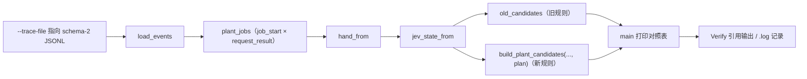

# Plan 2 — Economy evidence tool and live observation

## 1. Metadata

- Plan ID: P02
- Iteration: `009-plan-driven-economy`
- Status: Approved
- Depends on: P01（工具读取的字段与规则由 P01 定义）
- Requirement IDs: R8, R9

## 2. Goal

把 Case A/Case B 的离线对照脚本从 `.log/` 的临时证据升格为**入库的开发工具**：`tools/evidence-plan-economy.py`，接受 `--trace-file` 参数，只读一份 schema-2 JSONL Trace，重建其中一次 plant 决策的 JEV State，并打印"旧规则（只留目标类型）"与"新规则（目标为上下文 + surplus）"在同一冻结样本上的候选对照。配套一个自动化冒烟测试与文档命令，使 Verify 有一条不依赖游戏、不依赖模型的复现路径；同时把真机一局 Case A/B 的观察步骤与记录格式写成手工检查（G2，非阻塞）。

本 Plan 不改变任何运行时行为。

### Requirement Mapping

| Requirement ID | Outcome in this Plan | Acceptance signal |
|---|---|---|
| R8 | 真机一局 Case A/B 观察有明确的步骤、记录格式与升级条件（G2） | P01 V1 的升级条件 + 本 Plan 手工检查 V13；记录写入 `.log/` 之后可被 Verify 引用 |
| R9 | 冻结样本对照成为入库、可参数化、可测试的工具 | `tools/evidence-plan-economy.py --trace-file <path>` 输出与 `.log/2026-09-29-plan-economy-root-cause.md` §5 一致；`tests/test_economy_evidence.py` 通过 |

## 3. Scope

### In scope

- 新增 `tools/evidence-plan-economy.py`：把 `.log/evidence-plan-economy.py` 的逻辑迁入 `tools/`，支持 `--trace-file`（默认 `.log/jev-dashboard.jsonl`）、只读、退出码非零表示无法解析或找不到目标样本。
- 新增 `tests/test_economy_evidence.py`：在临时目录写一份最小 schema-2 Trace（含一个带 `source_intent` 的 plant job 与一个无目标 job），断言重建、BEFORE/AFTER 计数与 hold 原因。
- 更新 `README.md` / `README.zh-CN.md` / `docs/usage.md` 的命令清单，给出该工具的用途与一条可复制命令。
- 删除 `.log/evidence-plan-economy.py`，避免两份实现漂移；`docs/memory-map.md` 的 `.log/` 说明维持"证据非源码"。
- 手工检查：真机一局 Case A/B 观察步骤与记录格式（写入本 Plan 的 Manual checks）。

### Out of scope

- 任何运行时行为、候选规则、问题文本或 Trace schema 的修改（属 P01）。
- 实机自动化脚本（例如驱动游戏或调用真实 API）；真机观察仍由 Human 手工执行。
- `.log/jev-dashboard.jsonl` 等既有证据文件的清理、压缩或入库。

## 4. Impact Surface

### 4.1 File and Symbol Map

```text
tools/
  evidence-plan-economy.py
tests/
  test_economy_evidence.py
README.md
README.zh-CN.md
docs/
  usage.md
.log/
  evidence-plan-economy.py        （删除）
```

```text
File: tools/evidence-plan-economy.py
Module: evidence-plan-economy（脚本，无包导入）
Symbols:
  parse_arguments — --trace-file 参数与默认值
  load_events — 读取 JSONL 事件
  plant_jobs — 配对 job_start 与 request_result
  hand_from — 从首个多类型 plant 请求态取回本局手牌
  jev_state_from — 由 Trace 字段重建决策样本（board/sun/cards/zombies）
  old_candidates — 复现"只留目标类型"的旧规则
  main — 打印 BEFORE/AFTER 与 Case A 对照表，返回退出码
```

```text
File: tests/test_economy_evidence.py
Module: tests.test_economy_evidence
Symbols:
  EconomyEvidenceToolTests — 以临时 Trace 断言重建、对照计数与 hold 原因；断言工具只读（不改输入文件）
```

```text
File: README.md / README.zh-CN.md / docs/usage.md
Symbols:
  测试与工具清单 — 增加 `uv run python tools/evidence-plan-economy.py --trace-file <trace>` 一行说明
```

### 4.2 End-to-End Flow



## 5. Decision

### 5.1 Open Decision

无。工具形态（升格入库 + `--trace-file` + 冒烟测试）已由 Human 在 2026-09-29 选择（见 5.2 CD-05）；真机观察级别为 CD-04（G2）。

### 5.2 Confirmed Decision

#### Confirmed Decision Record — CD-05

- Decision ID: CD-05（证据工具范围）
- Confirmed choice: 把冻结样本对照脚本升格为入库工具 `tools/evidence-plan-economy.py`（支持 `--trace-file`），配一个冒烟测试，并在 README/usage 给出命令；不额外编写 loop 级场景脚本。
- Source: Human 对话选择（"升格为入库工具（推荐）"）
- Date: 2026-09-29
- Reason: Verify 需要一条可复现、不依赖游戏与模型的证据路径；loop 级场景已由 P01 的确定性测试覆盖，另写脚本属重复投入。

## 6. Task

### Task

- [x] T1 — 升格为入库工具
  - Objective: 在 `tools/` 新建只读脚本，逻辑与 `.log/evidence-plan-economy.py` 等价但支持 `--trace-file`（默认 `.log/jev-dashboard.jsonl`），输出格式保持"每个带目标样本一行 BEFORE/AFTER + Case A 三档对照"；解析失败或找不到样本时返回非零退出码并给出原因。
  - Affected files:
    ```text
    Expected:
      tools/evidence-plan-economy.py
    Actual:
      tools/evidence-plan-economy.py（新建，与 Expected 一致）
    ```
  - Implementation backfill:
    ```text
    Notes: 由 `.log/evidence-plan-economy.py` 逐函数移植并保持输出结构（每个带 `source_intent` 的 plant 决策一组 BEFORE/AFTER + 末尾 Case A 150/320/400 三档）。`--trace-file` 默认 `.log/jev-dashboard.jsonl`，相对路径按仓库根解析、绝对路径原样使用；仓库根由 `Path(__file__).resolve().parents[1]` 推导，用 `if str(ROOT) not in sys.path` 幂等插入，不依赖当前工作目录。纯标准库、全程只读。输入错误（Trace 缺失 / 某行不是合法 JSON 对象 / 无任何带 `source_intent` 的 plant 决策）向 stderr 打印原因并返回退出码 2，正常返回 0。
    Changed files:
      tools/evidence-plan-economy.py
    ```

- [x] T2 — 冒烟测试
  - Objective: 以临时目录中的最小 Trace 断言重建与对照：含 `source_intent` 的样本走 BEFORE/AFTER 两条路径、计数可预测、无目标样本不进入对照；确认工具不修改输入文件。
  - Affected files:
    ```text
    Expected:
      tests/test_economy_evidence.py
    Actual:
      tests/test_economy_evidence.py（新建，与 Expected 一致，117 行）
    ```
  - Implementation backfill:
    ```text
    Notes: 用 `importlib.util.spec_from_file_location` 载入带连字符的工具模块；最小 schema-2 Trace 写在 `tempfile.TemporaryDirectory()`：两个 plant `job_start`（同一 `sun`=400、3 张卡 sunflower 50 / peashooter 100 / melon_pult 300、5×9 全空 cells）+ 各自配对的 `request_result`，其中一个带 `source_intent.type_name=sunflower`、另一个不带。断言：重建（sun_balance 400、cells 原样、手牌 3 种）；BEFORE 45 个/['sunflower']、AFTER 135 个/['melon_pult','peashooter','sunflower']；stdout 含 job-000001、不含 job-000002；Case A sun150 `hold=await_plan` 0 个、sun320 `['melon_pult']` 45 个、sun400 135 个 3 种且 `hold=None`；默认路径按仓库根解析；运行前后 Trace sha256 一致（只读）；缺失路径 / 坏 JSONL 行 / 无目标样本均非零退出码并带 stderr 原因。
    Changed files:
      tests/test_economy_evidence.py
    ```

- [x] T3 — 文档命令与旧脚本下线
  - Objective: 在 `README.md`、`README.zh-CN.md`、`docs/usage.md` 记录工具用途与命令；删除 `.log/evidence-plan-economy.py`，并在 `.log/2026-09-29-plan-economy-root-cause.md` 中把复现命令改为 `tools/` 版本。
  - Affected files:
    ```text
    Expected:
      README.md
      README.zh-CN.md
      docs/usage.md
      .log/evidence-plan-economy.py        （删除）
      .log/2026-09-29-plan-economy-root-cause.md
    Actual:
      README.md、README.zh-CN.md、docs/usage.md（各加一条命令与一句用途说明，未重排既有清单）
      .log/evidence-plan-economy.py（已删除）
      .log/2026-09-29-plan-economy-root-cause.md（两处旧脚本引用改为 `tools/` 版本）
    ```
  - Implementation backfill:
    ```text
    Notes: README.md 的 “Tests and documentation” 与 README.zh-CN.md 的 “测试与文档” 段在既有 unittest 命令后追加一段用途说明与 `uv run python tools/evidence-plan-economy.py --trace-file .log/jev-dashboard.jsonl`；docs/usage.md 在 “测试” 段后新增 “离线经济证据工具” 小节（命令 + 用途 + 非零退出码语义）。删除 `.log/evidence-plan-economy.py`；`.log/2026-09-29-plan-economy-root-cause.md` 开头 “复现脚本” 行与 §5 标题两处引用改为 `tools/evidence-plan-economy.py --trace-file .log/jev-dashboard.jsonl`（其余内容未动）。`grep -rn "evidence-plan-economy" README.md README.zh-CN.md docs tests tools` 只剩对 `tools/` 新工具自身的引用，无 `.log/` 旧脚本残留。
    Changed files:
      README.md
      README.zh-CN.md
      docs/usage.md
      .log/2026-09-29-plan-economy-root-cause.md
      .log/evidence-plan-economy.py（删除）
    ```

## 7. Validation

### Traceability

| Check ID | Requirement ID | Task ID | Check | Tier and reason | Expected evidence | Delivery impact / escalation condition |
|---|---|---|---|---|---|---|
| V11 | R9 | T1, T2 | 工具在冻结 Trace 上输出与 `.log/2026-09-29-plan-economy-root-cause.md` §5 一致：7300 阳光/目标 sunflower 样本 BEFORE 36（1 种）→ AFTER 360（10 种）；Case A sun 150 → `await_plan`、sun 320 只出目标、sun 400 出目标+便宜牌 | G1：这是 Case A/B 离线证据的唯一复现路径 | `uv run python tools/evidence-plan-economy.py --trace-file .log/jev-dashboard.jsonl` 输出；`tests/test_economy_evidence.py`（冒烟）通过 | 输出与记录不一致或工具无法解析既有 Trace，阻塞交付 |
| V12 | R9 | T2 | 冒烟测试覆盖重建、BEFORE/AFTER 与只读性 | G1：自动化守护，避免工具随 Trace 变体静默失效 | `uv run python -m unittest tests.test_economy_evidence` 通过 | 失败即阻塞交付 |
| V13 | R8 | T3 | 真机一局 Case A/B 观察 | G2：需要 Human 时间与真实 API；升级条件同 P01 V1（富余下仍只出目标类型/不出现高成本候选 → 升 G1） | `.log/` 中一份记录：开始/结束时间、run_id、两次 plant 决策的 `source_intent`、请求态 `economy`、模型是否选择目标外类型；以及低威胁 + 高目标时是否出现 `await_plan` | 未执行不阻塞；执行后发现 V1 升级条件成立则阻塞 |
| V14 | R9 | T3 | 文档命令可直接复制执行；`.log/` 旧脚本已删除且无残留引用 | G2：属文档卫生，不影响行为 | `grep -rn "log/evidence-plan-economy" README.md README.zh-CN.md docs tests tools` 无残留；命令在仓库根目录可直接运行 | 不一致时在 Delivery 说明中修正，不阻塞 |

### Commands

- 目标运行环境/测试命令（V12）：`uv run python -m unittest tests.test_economy_evidence`
- 全量回归（V8 的一部分，跨 Plan）：`uv run python -m unittest discover -s tests -p "test_*.py"`
- 离线对照（V11）：`uv run python tools/evidence-plan-economy.py --trace-file .log/jev-dashboard.jsonl`
- 文档残留检查（V14）：`grep -rn "evidence-plan-economy" README.md README.zh-CN.md docs tests tools`
- 实机观察（V13）：`uv run python main.py jev-loop --trace-file .log/009-case-ab.jsonl`（需要 `.env` 与真实 API，由 Human 执行）

### Implementation evidence

Implementation 阶段按 Task ID 回填实际执行的命令、结果和关键输出；这不是正式 `verify.md` 的替代。

T1/T2/T3 回填（2026-09-29，Windows，仓库根 `F:\projects\JevPvz`）：

- `uv run python -m unittest tests.test_economy_evidence` → `Ran 3 tests` / `OK`。
- `uv run python tools/evidence-plan-economy.py --trace-file .log/jev-dashboard.jsonl` →

  ```text
  trace: jev-dashboard.jsonl  plant decisions: 5  hand: 10 types

  --- job-000010  sample 696  sun 7300
      declared goal        : sunflower (cost 50, payable True)
      balance band         : abundant   sun_above_plan: 7250
      BEFORE (goal filter) :   36 placements, types=['sunflower']
      AFTER  (goal context):  360 placements, types=['cabbage_pult', 'cherry_bomb', 'chomper', 'jalapeno', 'melon_pult', 'peashooter', 'repeater', 'snow_pea', 'sunflower', 'tall_nut']

  --- job-000016  sample 1413  sun 7375
      declared goal        : sunflower (cost 50, payable True)
      balance band         : abundant   sun_above_plan: 7325
      BEFORE (goal filter) :   36 placements, types=['sunflower']
      AFTER  (goal context):  360 placements, types=[... 同 10 种 ...]

  --- Case A sun   150  goal melon_pult(300): BEFORE    0 placements [] | AFTER    0 placements [] hold=await_plan
  --- Case A sun   320  goal melon_pult(300): BEFORE   37 placements ['melon_pult'] | AFTER   37 placements ['melon_pult'] hold=None
  --- Case A sun   400  goal melon_pult(300): BEFORE   37 placements ['melon_pult'] | AFTER  148 placements ['cabbage_pult', 'melon_pult', 'peashooter', 'sunflower'] hold=None
  ```

  与 `.log/2026-09-29-plan-economy-root-cause.md` §5 逐行一致：BEFORE 36（1 种）→ AFTER 360（10 种）；Case A sun150 `await_plan`、sun320 只出目标、sun400 目标 + 便宜牌。
- `uv run python tools/evidence-plan-economy.py --trace-file .log/does-not-exist.jsonl` → stderr `error: trace file not found: F:\projects\JevPvz\.log\does-not-exist.jsonl`，退出码 `2`；运行前后 `.log/jev-dashboard.jsonl` 的 sha256 不变（`fe5fb5a3…41db`）。
- `uv run python -m unittest discover -s tests -p "test_*.py"` → `Ran 473 tests in 21.741s` / `OK`（本 Plan 新增 3 个用例）。
- `grep -rn "evidence-plan-economy" README.md README.zh-CN.md docs tests tools` → 5 处命中全部指向 `tools/evidence-plan-economy.py`，无 `.log/evidence-plan-economy.py` 残留。

### Manual checks

- V11 — 运行离线对照命令，逐行比对本 Plan 第 7 节 Expected evidence 的三个数字组。
- V13 — 真机步骤（Human 执行）：
  1. 进入一局低威胁局面（或暂停僵尸生成），确认手牌含至少一张 ≥150 阳光的牌；
  2. 让 Runtime 运行至出现 plant 决策，在 Trace 中读取该 job 的 `source_intent`、`state.economy` 与 `typed_answers.plant_target`；
  3. 记录：(a) 目标类型是否出现在 `state.cards` 之外的候选里；(b) 目标不可支付时是否出现 `job_end.outcome == "await_plan"` 且 `request_issued == false`；(c) 目标可支付后是否重新发起请求并包含目标外的高成本 option。
  4. 把上述三项写成 `.log/009-live-case-ab-<date>.md`，作为 Verify 的现场证据（G2）。

## 8. Risks

- **Trace 形状变化**：工具依赖 `job_start.state` 与 `request_result.source_intent` 两个既有字段；v1 Trace 或缺少 `source_intent` 的样本会被跳过。冒烟测试锁定可用形状，遇到新形状时需同步更新工具。
- **样本来源固定**：默认 Trace 是本机 Dashboard 运行产物；工具不得写入 `.log/` 或任何仓库状态（只读），否则证据可信度受损。
- **真机证据依赖 Human**：V13 为 G2 且不会由 agent 自动执行；若 Human 长期不执行，Case A 的现场结论保持"未取得"。
- **删除 `.log/evidence-plan-economy.py` 的引用面**：`.log/2026-09-29-plan-economy-root-cause.md` 与 009 P01 的 Commands 都引用该脚本；T3 必须同时更新，否则 V14 失败。

## 9. Approval

- Status: Approved
- Approved by: 本仓库维护者（Human）
- Approval date: 2026-09-29
- Notes: 与 P01/P03 同时获批（Human 2026-09-29 回复“approved 009”）；三者共同构成 `009-plan-driven-economy` 的交付范围。
