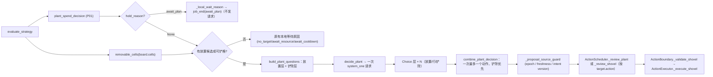

# Plan 3 — Autonomous plant removal in the plant request

## 1. Metadata

- Plan ID: P03
- Iteration: `009-plan-driven-economy`
- Status: Approved
- Depends on: P01（plant 分支的 `economy`/`plan` 请求态、候选规则与"目标类型不再是授权前提"的派发守卫）
- Requirement IDs: R11, R12, R13, R14, R15, R16, R17

## 2. Goal

让自主 Runtime 能够**明确选择并执行"铲除某一格植物"**：在 plant 分支已有的同一次 fan-out 请求里追加一个独立的铲除 Choice（可铲格 + 弃选项），由模型按事实自行判断是否铲、铲哪一格，代码只在合并时保证"一次决策最多一个动作"，并在两层同时命中时按明确的"铲除优先"规则处理。

现状缺口已核实：`shovel_cell` 的执行链（Boundary `_validate_shovel`、Executor `_execute_shovel`、Scheduler `_review_shovel`、CLI 手测入口）**全部已实现**，但异步 Runtime 的 `BRANCHES = ("plant","collect")` 里没有 shovel，`AsyncJevClient` 没有 `decide_shovel`，`jev/questions.py` 没有铲除问题，`jev/strategy.py` 没有可铲候选 —— 因此 loop 目前**不可能**产出铲除动作。这也正是 Human 需求里"低级植物 → Remove → 高级植物"的 Replace/Upgrade 两步策略被卡住的位置。

最终边界：本 Plan 只负责"模型能选、代码能安全执行一次铲除"，以及如实记录。**不负责**"什么时候该铲"的策略答案（沿用 OD-37/R27：代码只给事实，不给阵容/优先级建议），也不负责叠层格里"指定移除某一株实体"（执行器本身不承诺）。

### Requirement Mapping

| Requirement ID | Outcome in this Plan | Acceptance signal |
|---|---|---|
| R11 | 自主 Runtime 端到端产出并执行一次 `shovel_cell`；一次决策最多一个动作；放置与铲除同时命中时只派发铲除，并记录被丢弃的放置 | loop 用例：一次请求两问 → boundary 只收到 `shovel_cell`；仲裁用例断言放置被弃且 merge 记录 |
| R12 | 可铲候选只来自 `board.cells` 的 `plant:<type_name>` 格（与 Boundary 编码一致）；无可铲格时不追加铲除子问题；请求在"有放置候选"或"有可铲格"时发出 | strategy 候选断言（含未知/空板）；client 断言无候选时问题集不含铲除层；空放置 + 有可铲格时仍发请求 |
| R13 | 铲除 Choice 自带弃选项，按 `argmax ≠ 弃选 且 best > 弃选` 判定；不新增 Noul/绝对闸门；选项文本只陈述事实（行列、该格植物类型与角色） | client 用例：弃选胜出 → wait；选项文本不含建议词；请求问题集只增一个 Choice |
| R14 | 新增状态字段（若有）必须进 `PLANT_STATE_FIELDS` 与 Trace 白名单并逐字段相等；三处 plant instructions 只引用已下发字段；不新增 branch key 维度（复用 `occupied_cells`） | 既有 `RequestFieldAcceptanceTests` 与 Trace parity 用例扩展后通过；`build_branch_state_key` 形状不变 |
| R15 | Trace 如实记录铲除问题/选项/答案/merge 与 `shovel_cell` 的 `action_result`；`_last_result` 能记录 `action=shovel_cell`（不冒充 plant） | trace 用例：`job_start.state` 含新层、`request_result.typed_answers` 含铲除层、`action_result.action == "shovel_cell"`；loop 用例断言 `_last_result` 的 action |
| R16 | 成功的 `shovel_cell` 点亮对应草坪格，且不冒充种植（读出的名称/动作是铲除） | `tests/test_web.py` 用例（G2，见 V20） |
| R17 | 真机观察 Replace/Upgrade 两步（先铲后种）确实发生 | 手工记录（G2，见 V21） |

## 3. Scope

### In scope

- `jev/strategy.py`：可铲候选纯函数（从 `occupied_cells` / `board.cells` 取 `plant:<name>` 格；未知或不可解析的格不入候选）。
- `jev/questions.py`：`SHOVEL_TARGET_QUESTION_ID`、铲除 Choice 的固定文本与选项 criteria、选项 id（如 `remove@r<row>c<col>`），以及"有候选才追加"的装配规则。
- `jev/client.py`：`build_plant_questions` 在同一次请求里装配放置层 + 铲除层；`AsyncJevClient.decide_plant` 一次 `system_one` 调用携带两层；无放置候选但有可铲格时仍发出请求。
- `jev/decision.py`：`combine_plant_decision` 读取铲除层并实现"一次一个动作 + 铲除优先"；把铲除选项绑定为 `{"action": "shovel_cell", "row", "col"}` 目标。
- `jev/loop.py`：`_last_result` 支持铲除结果；`_proposal`/`_resolve_outcome`/`_proposal_source_guard` 在 `branch == "plant"` 下对铲除目标的行为（不需要新分支）。
- `jev/trace.py`：铲除层的记录与 merge 事实字段。
- `dashboard/static/viewmodel.js`（+ 必要时 `recording.js`）与 `tests/test_web.py`：被铲格点亮（G2）。
- 对应测试（`tests/test_jev_strategy.py`、`tests/test_jev_client.py`、`tests/test_jev_loop.py`、`tests/test_jev_trace.py`、`tests/test_web.py`）与 `docs/architecture.md`、`docs/usage.md` 的能力说明。

### Out of scope

- 新增第三个 shovel 分支 / 第三个 worker / 新的在途预算（CD-08 已选择并入 plant 分支）。
- "该不该铲"的策略答案与阵容建议；堆叠格中指定移除某一株实体（执行器不承诺）。
- 攒钱期间（`await_plan` 本地等待）的铲除：该轮不发请求，棋盘保持不变（见 5.2 CD-09 与 Risks）。
- 铲除的优先级/紧急度新档位（沿用 `proposal_priority` 对 `branch="plant"` 的现有 lane urgency）。

## 4. Impact Surface

### 4.1 File and Symbol Map

```text
jev/
  strategy.py
  questions.py
  client.py
  decision.py
  loop.py
  trace.py
dashboard/static/
  viewmodel.js
tests/
  test_jev_strategy.py
  test_jev_client.py
  test_jev_loop.py
  test_jev_trace.py
  test_web.py
docs/
  architecture.md
  usage.md
```

```text
File: jev/strategy.py
Module: jev.strategy
Symbols:
  removable_cells — 从 board.cells 取 plant:<type_name> 格的纯函数（无可解析格时为空）
  build_plant_candidates — 不变；铲除候选不进入放置枚举
  build_plant_branch_state_key — 形状不变（occupied_cells 已能触发"棋盘植物变化→重问"）
```

```text
File: jev/questions.py
Module: jev.questions
Symbols:
  SHOVEL_TARGET_QUESTION_ID — 新增问题 id
  shovel_target_question / shovel_option_criteria / shovel_option_id — 铲除 Choice 的固定文本与选项事实（行列 + 类型 + 角色）
  PLANT_STATE_FIELDS — 仅在确有新增状态字段时扩展；否则保持不变
```

```text
File: jev/client.py
Module: jev.client
Symbols:
  build_plant_questions — 在同一次请求里装配放置层与铲除层；无放置候选但有可铲格时仍返回仅含铲除层的问题集
  AsyncJevClient.decide_plant — 一次 system_one 调用携带两层；无任何问题时不发请求
  _plant_type_facts — 复用（铲除选项引用同一格已有植物的角色事实）
```

```text
File: jev/decision.py
Module: jev.decision
Symbols:
  combine_plant_decision — 读取铲除层；一次最多一个目标；铲除优先并记录被丢弃的放置
  _read_choice_levels — 绑定 action 型目标（shovel_cell），不再只认含 type_name 的选项
  _combine/目标构造 — 铲除目标 {"action":"shovel_cell","row","col"}
```

```text
File: jev/loop.py
Module: jev.loop
Symbols:
  JevRuntimeLoop._local_wait_reason — 请求发出条件改为「有放置候选或可铲格」；`await_plan` 优先级不变
  JevRuntimeLoop._propose — 铲除目标仍以 branch="plant" 提交（scheduler 按 action 复核）
  JevRuntimeLoop._last_result — 支持 action=shovel_cell（不冒充 plant）
```

```text
File: jev/trace.py
Module: jev.trace
Symbols:
  _decision_events / merge 记录 — 铲除层的问题、选项、答案与 merge 事实
  _actual_request_state — 仅在有新增状态字段时同步白名单
```

```text
File: dashboard/static/viewmodel.js
Symbols:
  lawn 格点亮 — 成功 shovel_cell 的目标格点亮，并读出实际动作（铲除），不冒充种植
```

### 4.2 End-to-End Flow



## 5. Decision

### 5.1 Open Decision

无阻塞性 Open Decision。接入方式（CD-08）与并入方式（CD-07）已由 Human 在 2026-09-29 的本次 Plan 执行中确认。

### 5.2 Confirmed Decision

#### Confirmed Decision Record — CD-07

- Decision ID: CD-07（铲除能力并入 009）
- Confirmed choice: "模型自主铲除植物"并入 `009-plan-driven-economy` 作为 P03，与 P01/P02 同批实现与交付；不回退为独立的 010，也不只做记录。
- Source: Human 对话选择（"并入 009 作 P03"）
- Date: 2026-09-29
- Reason: 它与 009 共用同一批文件（`client.py`/`loop.py`/`questions.py`/`trace.py`）与同一个 plant 请求；同批改动能避免两次触碰同一批符号，也直接补上 Human 需求里"低级植物 → Remove → 高级植物"的缺口。

#### Confirmed Decision Record — CD-08

- Decision ID: CD-08（铲除的接入方式）
- Confirmed choice: 在 plant 分支的同一次 fan-out 请求里追加一个**独立的铲除 Choice**（可铲格 + 弃选项），不新增第三个分支/worker/key/Trace 分支词表；一次决策最多一个动作，两层同时命中时**铲除优先**，被丢弃的放置记录进 merge/Trace。
- Source: Human 对话选择（"并入 plant 分支同一次请求（推荐）"）
- Date: 2026-09-29
- Reason: 无新增分支与在途预算；`occupied_cells` 已在 plant branch key 里，所以"棋盘植物变化 → 重问"是现成的；`proposal_priority` 对 `branch="plant"` 已按 target 的 lane urgency 排序，铲除目标自带 row 可直接复用；`scheduler._review` 已经按 `target.action` 分派到 `_review_shovel`。

#### Confirmed Decision Record — CD-09

- Decision ID: CD-09（请求发出条件与攒钱优先级）
- Confirmed choice: 请求在「有放置候选」**或**「有可铲格」时发出（两层按需装配，可能只含铲除层）；`await_plan`（P01 R2：目标差钱且无中断行）保持最高优先级，该轮不发请求、棋盘不变——攒钱期间不动棋盘上的生产植物。无可铲格时不追加铲除子问题，也不新增本地等待原因。
- Source: 本 Plan 执行决定（由 CD-08 与 P01 R2 推导；不改变 CD-01 的攒钱语义——铲除本身不消耗阳光，但本轮不发请求）
- Date: 2026-09-29
- Reason: 避免"满场/无可放置牌时铲除被饿死"（例如所有格被占且没有可支付卡时，铲除常是唯一有意义的动作）；同时避免攒钱期间提前铲掉仍在产阳光的植物。

## 6. Task

### Task

- [x] T1 — 可铲候选与铲除问题
  - Objective: 在 `jev/strategy.py` 增加可铲候选纯函数（只认 `plant:<type_name>`，忽略未知格）；在 `jev/questions.py` 增加铲除问题（`SHOVEL_TARGET_QUESTION_ID`、选项 id、只陈述事实的 criteria、自带弃选项）。
  - Affected files:
    ```text
    Expected:
      jev/strategy.py
      jev/questions.py
    Actual:
      jev/strategy.py
      jev/questions.py
    ```
  - Implementation backfill:
    ```text
    Notes: 新增 `removable_cells(jev_state)`（从 `board.cells` 取 `plant:<非空 type_name>` 格，按 row/col 稳定排序；缺板/畸形板/非字符串或畸形值一律忽略）与 `plant_role_by_name`（按类型名解析目录角色，未知为 None）；`_role_of` 改为复用 `plant_role_by_name`（语义等价）。questions.py 新增 `SHOVEL_TARGET_QUESTION_ID="shovel_target"`、`shovel_option_id(row,col)`（`remove@r<row>c<col>`）、`shovel_option_criteria`（行列 + 类型名 + 目录角色，只陈述事实）与 `shovel_target_question`（选项 = 可铲格 + DISCARD，无 Noul；文本追加 `_plant_economy_guidance()`）。`PLANT_STATE_FIELDS`、`build_plant_branch_state_key` 未改动。
    Changed files:
      jev/strategy.py（新增 removable_cells/plant_role_by_name，_role_of 复用）
      jev/questions.py（新增 SHOVEL_TARGET_QUESTION_ID/shovel_option_id/shovel_option_criteria/shovel_target_question，更新 __all__）
    ```

- [x] T2 — 一次请求两问与代码合并
  - Objective: `build_plant_questions` 按"有放置候选或可铲格"装配两层；`decide_plant` 一次 `system_one` 调用携带两层；`combine_plant_decision` 读取铲除层，实现"一次最多一个动作 + 铲除优先 + 记录被丢弃的放置"，并把铲除选项绑定为 `shovel_cell` 目标（`_read_choice_levels` 放宽绑定条件）。
  - Affected files:
    ```text
    Expected:
      jev/client.py
      jev/decision.py
    Actual:
      jev/client.py
      jev/decision.py
    ```
  - Implementation backfill:
    ```text
    Notes: client 新增 `_with_shovel_layer`（铲除层 level 号排在放置层之后，单层=2、lane 链后=3）并让 `build_plant_questions` 在"有放置候选或有可铲格"时返回问题集（两者皆无返回空集），`decide_plant` 仍是一次 `system_one`（未改请求次数语义，仅更新文档）。`_single_plant_question_set`/`_split_plant_question_set`/`_plant_type_facts` 与 255 逐层拆分逻辑未改动（只核对）。decision 侧：`_read_choice_levels` 现在也绑定 `{"action":"shovel_cell",...}` 目标；`_chosen_plant_option` 按放置层问题 id 定位（不再取 `choice_levels[0]`，否则只含铲除层时会把铲除当放置）；新增 `_shovel_selection`（同 OD-41 严格 `best > discard`、δ=0）与铲除优先仲裁；`_decision` 的 `effective_action` 由 target action 推导（`place_plant`→plant、`shovel_cell`→shovel，intent 仍为 plant）；merge 记录事实键。
    Changed files:
      jev/client.py（_with_shovel_layer、build_plant_questions 请求条件与文档、导入）
      jev/decision.py（_EFFECTIVE_ACTION_BY_TARGET/_PLANT_LEVEL_QUESTION_IDS、_read_choice_levels 绑定 action 目标、_shovel_selection、combine_plant_decision 重构与 merge 键、_chosen_plant_option 定位放置层）
    ```

- [x] T3 — Runtime 提案与结果记录
  - Objective: `_local_wait_reason` 的请求条件改为"有放置候选或可铲格"（`await_plan` 优先级不变）；铲除目标仍以 `branch="plant"` 提交并由 scheduler 按 action 复核；`_last_result` 记录 `action=shovel_cell`。
  - Affected files:
    ```text
    Expected:
      jev/loop.py
    Actual:
      jev/loop.py
    ```
  - Implementation backfill:
    ```text
    Notes: `_local_wait_reason` 先算 `removable_cells`；"无可种且无可铲"仍返回既有 `no_target`，其余判定不变，`await_plan` 仍优先（目标差钱且无中断行时不发请求）。`_propose` 未改：铲除与放置同为 branch=plant 的低优先级 proposal，无新增分支/worker/key。`_last_result` 改为按 target 记录 `action`/`type_name`/`row`/`col`/`outcome`/`status`（形状仍是同一 6 键；放置动作现在是 `place_plant`，铲除是 `shovel_cell`）。读取点已逐个核对：collect 分支 key 的 `repr(self._last_result)`、`decide_plant`/`decide_shared` 的 `last_actual_result` 请求态、trace 的 `_actual_request_state` 白名单（同 6 字段，无需扩字段）、`_proposal_source_guard`（只比意图版本，不读该字段）。
    Changed files:
      jev/loop.py（导入 removable_cells、_local_wait_reason 请求条件、_dispatch 的 _last_result）
    ```

- [x] T4 — Trace 与仪表盘
  - Objective: Trace 如实记录铲除层的问题/选项/答案/merge 与 `shovel_cell` 的 `action_result`；仪表盘让成功的铲除点亮对应草坪格且读出实际动作（不冒充种植）。
  - Affected files:
    ```text
    Expected:
      jev/trace.py
      dashboard/static/viewmodel.js
      dashboard/static/recording.js（如点亮规则在该文件）
    Actual:
      jev/trace.py
      dashboard/static/viewmodel.js
      dashboard/static/recording.js
    ```
  - Implementation backfill:
    ```text
    Notes: trace 只需扩 `MERGE_REVIEW_KEYS`（新增 shovel_option/shovel_selected/shovel_discarded/shovel_overrode_placement/overridden_placement_option/shovel_best_option/shovel_best_probability/shovel_discard_probability/shovel_margin）；`_typed_answers` 本就按问题 id 透传，铲除层问题/选项/答案自动落盘；`_actual_request_state` 字段集未变（只核对）。viewmodel：`SPATIAL_QUESTION` 增加 `shovel_target`（铲除格进入同一 5×9 决策场，不新增图层），`ACTION_ZH` 增加 `shovel_cell: "铲除"`，`buildField` 对 `remove@rNcM` 读出"铲除"而不是植物名，并按服务器对放置层同规（同 job + `boundary_status=="success"` + `action=="shovel_cell"` + 行列精确）点亮该格，另增 `pickAuthoritativeQuestion(groups, decision)` 以"这次决策真的下发了铲除"判定铲除层拍板（同 job 的 decision 才生效）。recording.js 的 TARGET 行对格上动作（种植/铲除）显示行列而不是 "—"。
    Changed files:
      jev/trace.py（MERGE_REVIEW_KEYS + 说明）
      dashboard/static/viewmodel.js（SPATIAL_QUESTION/ACTION_ZH/buildField/shovelExecution/pickAuthoritativeQuestion/buildDecision 同 job 判定）
      dashboard/static/recording.js（格上动作的 TARGET 文案）
    ```

- [x] T5 — 测试
  - Objective: 覆盖候选来源与"无候选不追加"、请求发出条件、弃选判定、仲裁（铲除优先）、端到端派发、Trace 记录与仪表盘点亮。
  - Affected files:
    ```text
    Expected:
      tests/test_jev_strategy.py
      tests/test_jev_client.py
      tests/test_jev_loop.py
      tests/test_jev_trace.py
      tests/test_web.py
    Actual:
      tests/test_jev_strategy.py
      tests/test_jev_client.py
      tests/test_jev_loop.py
      tests/test_jev_trace.py
      tests/test_web.py
    ```
  - Implementation backfill:
    ```text
    Notes: 新增 20 个用例（V15–V20）。strategy 5 个（RemovableCellTests）、client 10 个（PlantShovelLayerTests，含唯一一次 system_one、放置层为空只含铲除层仍发请求、弃选/平局→wait、铲除覆盖放置的 merge 记录、选项文本事实性、split 链后追加铲除层）、loop 3 个（真实派发 shovel_cell 到 FakeBoundary、两层同选只派发铲除并记录被丢弃 option、_local_wait_reason 三种既有结论不变+可铲格触发请求+await_plan 仍优先）、trace 1 个（job_start.state 含该格事实、request_result.typed_answers 含铲除层、merge 铲除事实、action_result.target/boundary.action == shovel_cell 且不泄漏 item/plant 内部 id）、web 1 个（同 job 成功铲除点亮该格并读作铲除；unverified/旧 job/放置动作不亮）。
    Changed files:
      tests/test_jev_strategy.py
      tests/test_jev_client.py
      tests/test_jev_loop.py
      tests/test_jev_trace.py
      tests/test_web.py
    ```

- [x] T6 — 文档
  - Objective: `docs/architecture.md`（Decision 段的铲除层与仲裁规则、Scheduling 段的一次一动作）与 `docs/usage.md`（能力说明：模型可铲、一次一个动作、叠层格不保证指定实体、攒钱期间不发请求）。
  - Affected files:
    ```text
    Expected:
      docs/architecture.md
      docs/usage.md
    Actual:
      docs/architecture.md
      docs/usage.md
    ```
  - Implementation backfill:
    ```text
    Notes: architecture 的 Decision 段补铲除层（自带弃选项、事实型选项、一次一个动作、铲除优先并记录被丢弃放置、请求条件与 await_plan 优先）；Scheduling 段补"铲除与放置共用 plant 分支与同一个低优先级 proposal 队列项，只有 target.action 不同，执行前 `_review_shovel` 复核格编码与 All State 实体"；Trace schema 段补铲除 merge 事实。usage 段补能力说明（模型可铲、一次一个动作、铲除弃选项判定、叠层格不承诺指定实体、攒钱期间不发请求），并更新两处仪表盘点亮规则文案（成功 `shovel_cell` 点亮被铲格并读作铲除）。
    Changed files:
      docs/architecture.md
      docs/usage.md
    ```

## 7. Validation

### Traceability

| Check ID | Requirement ID | Task ID | Check | Tier and reason | Expected evidence | Delivery impact / escalation condition |
|---|---|---|---|---|---|---|
| V15 | R11 | T2, T3, T5 | 端到端：一次请求可含放置层与铲除层；只派发一个动作；两层同时命中时 boundary 收到 `shovel_cell`，放置被记录为丢弃 | G1：这是本 Plan 的核心目标 | `tests/test_jev_loop.py` 新增用例（提交含铲除层的决策 → `boundary.requests == [shovel_cell…]`）+ `tests/test_jev_client.py` 仲裁用例 | 派发两个动作、铲除无法被执行、或丢弃未记录，阻塞交付 |
| V16 | R12 | T1, T2, T5 | 可铲候选只来自 `plant:<name>` 格；无可铲格不追加铲除层；空放置 + 有可铲格时仍发请求；两者皆无时保持原有本地等待原因 | G1：候选来源与请求条件是安全边界 | `tests/test_jev_strategy.py`（候选）、`tests/test_jev_client.py`（问题集组成）、`tests/test_jev_loop.py`（`_local_wait_reason` 条件） | 候选来源不正或请求条件错误，阻塞交付 |
| V17 | R13 | T1, T2, T5 | 铲除弃选胜出 → wait；`best > discard` 规则生效；选项文本只含事实；不新增 Noul | G1：问题形态与 OD-41 一致，避免复活绝对闸门 | client 用例（弃选/边界概率）+ instructions 文本断言（无 `should`/`recommend` 类建议词） | 出现绝对闸门或建议性文本，阻塞交付 |
| V18 | R14 | T1, T2, T5 | 若新增状态字段：`PLANT_STATE_FIELDS` 与 Trace 白名单同步且逐字段相等；instructions 只引用已下发字段；`build_branch_state_key` 形状不变 | G1：审计面与去重语义不能被悄悄改变 | 既有 `RequestFieldAcceptanceTests`、`SharedActualInputParityAcceptanceTests` 扩展后通过；branch key 断言 | 字段漂移或 key 形状变化，阻塞交付 |
| V19 | R15 | T3, T4, T5 | Trace：`job_start.state`、`request_result.typed_answers` 含铲除层；`action_result.action == "shovel_cell"`；`_last_result` 的 action 为 `shovel_cell` | G1：事实权威是 Trace，必须能离线核对 | `tests/test_jev_trace.py` 与 `tests/test_jev_loop.py` 用例 | 记录缺失或冒充 plant，阻塞交付 |
| V20 | R16 | T4, T5 | 仪表盘：成功的铲除点亮对应格并读出实际动作；unverified/失败/旧 job 不亮 | G2：呈现层；Trace 已是事实权威，缺失不影响铲除能力。升级条件：若 Human 需要视觉证据判定铲除是否发生 | `uv run python -m unittest tests.test_web` | 不阻塞；若升级为 G1 则需先补测试 |
| V21 | R17 | T6 | 真机观察：至少一次成功铲除被 State 确认；尽量记录一次"先铲后种"的 Replace/Upgrade | G2：依赖 Human 时间、真实 API 与真机。升级条件：实机出现误点/无法确认铲除 → G1 | `.log/009-live-shovel-<date>.md`（run_id、铲除 job 的 `typed_answers`、`action_result.status`、State 前后格内容） | 未执行不阻塞；执行后发现升级条件成立则阻塞 |
| V22 | R11 | T5 | 全量回归（含 006/007/008 既有契约） | G1：跨迭代回归是交付前提 | `uv run python -m unittest discover -s tests -p "test_*.py"` 输出 `OK`（基线 470，叠加 P01/P03 后数量增加） | 出现失败，阻塞交付 |

### Commands

- 全量回归（V22）：`uv run python -m unittest discover -s tests -p "test_*.py"`
- 针对性测试（V15–V19）：`uv run python -m unittest tests.test_jev_strategy tests.test_jev_client tests.test_jev_loop tests.test_jev_trace`
- 呈现层（V20）：`uv run python -m unittest tests.test_web`
- 手测入口（对照参考，非本 Plan 交付）：`uv run python main.py action --action-json '{"action":"shovel_cell","row":0,"col":0,"timeout_ms":10000}'`
- 真机观察（V21）：`uv run python main.py jev-loop --trace-file .log/009-live-shovel.jsonl`（需要 `.env` 与真实 API，由 Human 执行）

### Implementation evidence

Implementation 阶段按 Task ID 回填实际执行的命令、结果和关键输出；这不是正式 `verify.md` 的替代。

```text
$ uv run python -m unittest tests.test_jev_strategy tests.test_jev_client tests.test_jev_loop tests.test_jev_trace
Ran 283 tests in 5.9s
OK

$ uv run python -m unittest tests.test_web
Ran 46 tests in 13.6s
OK

$ uv run python -m unittest discover -s tests -p "test_*.py"
Ran 493 tests in 22.1s
OK
```

基线（P01+P02 已落地、P03 未动）为 473 tests OK；P03 新增 20 个用例（主 agent 复核：473 + 20 = 493，与全量实跑一致）：

- `tests/test_jev_strategy.py` → `RemovableCellTests`（5）：
  `test_only_plant_encoded_cells_are_offered_in_row_then_column_order`、
  `test_placeholder_and_non_string_values_are_ignored`、
  `test_a_missing_or_malformed_board_is_empty_occupancy`、
  `test_an_uncatalogued_type_name_stays_a_fact_with_no_role`、
  `test_cells_the_board_reports_as_empty_are_never_removable`
- `tests/test_jev_client.py` → `PlantShovelLayerTests`（10）：
  `test_one_request_carries_the_placement_and_the_shovel_layer`、
  `test_a_board_without_a_removable_cell_adds_no_shovel_layer`、
  `test_an_occupied_board_with_no_placement_still_asks_the_shovel_layer`、
  `test_a_discarded_shovel_layer_waits`、
  `test_a_flat_tie_with_the_shovel_discard_option_waits`、
  `test_a_selected_shovel_drops_a_selected_placement_with_a_record`、
  `test_a_discarded_shovel_layer_keeps_the_selected_placement`、
  `test_the_shovel_option_text_states_only_facts`、
  `test_the_shovel_layer_follows_a_split_placement_chain`、
  `test_an_uncatalogued_plant_cell_is_stated_with_a_null_role`
- `tests/test_jev_loop.py` → `RuntimeCase`（3）：
  `test_a_selected_removal_dispatches_one_shovel_cell_and_records_its_action`、
  `test_two_selected_layers_dispatch_only_the_removal_and_record_the_drop`、
  `test_local_wait_reason_asks_whenever_a_placement_or_a_removal_exists`
- `tests/test_jev_trace.py` → `ShovelLayerTraceTests`（1）：
  `test_the_removal_layer_answers_and_execution_are_recorded`
- `tests/test_web.py` → `DashboardHttpTests`（1）：
  `test_a_confirmed_removal_lights_its_own_cell_and_never_reads_as_planting`

Trace 断言样例（`tests/test_jev_trace.py`）：`job_start.state` 中 `board.cells[2][3] == "plant:peashooter"`、
`request_result.typed_answers["shovel_target"].choice == "remove@r2c3"`、
`merge.shovel_selected == true`、`merge.shovel_overrode_placement == true` 且记录被丢弃的放置 option id、
`action_result.target.action == "shovel_cell"` 与 `action_result.boundary.action == "shovel_cell"`；事件序列中不含 `item_id`/`plant_id`/`raw_snapshot`/`api_key`。

V21（真机观察）未执行：需要 `.env` 与真实 API，由 Human 按 Manual checks 执行。

### Manual checks

- V16 — 构造三种板面（无可铲格 / 只有可铲格无放置候选 / 两者都有），确认问题集与本地等待原因符合 CD-09。
- V17 — 阅读铲除 Choice 的 instructions 与 criteria，确认只有行列、类型与角色事实，没有"该铲/先铲"的建议。
- V21 — 真机步骤（Human 执行）：进入一局并让 Runtime 运行；当某格被占用且手牌有可支付植物时，检查 Trace 中是否出现含铲除层的请求、是否出现过铲除选中与成功的 `action_result`；记录到 `.log/009-live-shovel-<date>.md`。

## 8. Risks

- **仲裁语义**：铲除优先会丢弃一次已选中的放置（下一轮随 `occupied_cells` 变化自动重问）。若 Human 认为应改为放置优先，属 Plan 修订（影响 V15）。
- **`_last_result` 形状**：该字段进入 `management_state_key`/collect 分支 key 的 `repr` 与 prompt 上下文；把 `action=plant` 写死改为通用 action 时必须同步所有读取点，否则会产生意外的 key 抖动。
- **255 选项上限**：追加铲除层会让单次请求多一个 Choice；放置层超限时的逐层拆分保持不变，但必须确认新层的选项数（可铲格 ≤45）不会与既有拆分逻辑冲突。
- **叠层格**：执行器不承诺移除叠层中的某一株；Plan 的选项文本与文档必须保持这一措辞，不得暗示"移除指定实体"。
- **Trace/仪表盘诚实性**：铲除是"移除"而不是"种植"，点亮与文案必须如实；错标会制造假证据。
- **攒钱期间不铲**（CD-09）：`await_plan` 轮次不发请求，因此那段时间的铲除需求覆盖不到；这是有意取舍（不动生产植物），如需覆盖属后续范围。
- **与 P01 同批文件**：P03 与 P01 改同一批符号（`client.py`/`decision.py`/`loop.py`/`trace.py`），实现顺序必须先 P01 后 P03，避免在同一次编辑里混淆两层语义。

## 9. Approval

- Status: Approved
- Approved by: 本仓库维护者（Human）
- Approval date: 2026-09-29
- Notes: CD-07/CD-08 由 Human 在本次 Plan 执行中确认（并入 009 作 P03；接入方式为 plant 分支同一次请求），CD-09 为本 Plan 执行的推导决定（不改变 CD-01）。Human 同日回复“approved 009”，本 Plan 与 P01/P02 一并获批。
